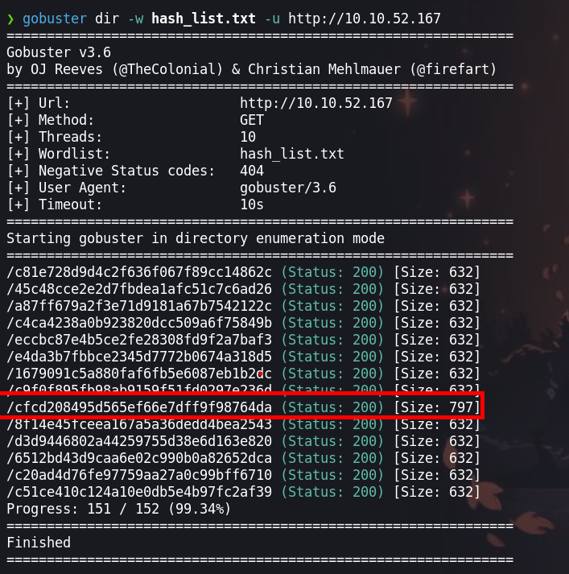

Corridor es una challenge que trata de fuzzing a los directorios de la pagina, pero las rutas de la web estan en md5 por lo que tendremos que crearnos un diccionario en md5 para realizar el `fuzzing`


Created by [tryhackme](https://tryhackme.com/p/tryhackme) and [JohnHammond](https://tryhackme.com/p/JohnHammond) and [cmnatic](https://tryhackme.com/p/cmnatic) and [timtaylor](https://tryhackme.com/p/timtaylor)


## Enumeración

Iniciamos con escaneo de los puerto con la herramienta `nmap`

```java
❯ nmap -p- --open --min-rate 1000 -vvv [IP-Victim] -Pn -n  -oG allportsScan
```

La herramienta `nmap` reportan que el puerto `80` esta abierto.

Para entender un poco mas de los parametros que lanzamos con `nmap` podemos leer un poco lo siguiente:

`-p-`: Esta opción indica a Nmap que escanee todos los puertos en lugar de un rango específico. El guion ("-") significa "todos los puertos". Esto permite escanear todos los puertos desde el puerto 1 hasta el 65535.

`--open`: Esta opción le dice a Nmap que solo muestre los puertos que están abiertos. Los puertos abiertos son aquellos en los que un servicio está escuchando y aceptando conexiones.

`--min-rate 1000`: Esto establece la velocidad mínima de escaneo en 1000 paquetes por segundo. Cuanto mayor sea la velocidad de escaneo, más rápido se completará el escaneo, pero ten en cuenta que un escaneo más rápido puede ser más intrusivo y podría llamar la atención no deseada.

`[IP-Victim]`: Esta es la dirección IP del objetivo que se va a escanear. Debes reemplazarla por la dirección IP que deseas escanear.

`-Pn`: Esta opción indica a Nmap que no realice el descubrimiento de hosts (Ping) antes de escanear los puertos. Puedes usar esto si sabes que el host objetivo no responde a los paquetes de Ping.

`-n`: Esta opción le dice a Nmap que no realice la resolución de nombres DNS. Puedes usarlo si no deseas que Nmap realice búsquedas DNS inversas durante el escaneo.

`-oG allportsScan`: Esta opción le indica a Nmap que genere la salida en formato "greppable" (Grep) y la guarde en un archivo llamado "allportsScan". Este archivo contendrá información detallada sobre los puertos abiertos y otros detalles del escaneo.

```java
PORT   STATE SERVICE REASON
80/tcp open  http    syn-ack
```

Enumeramos el puerto `80`

```java
❯ nmap -p80 -sC -sV -Pn -vvv [IP-Victim] -oN servicesScan
```

`-p80`: Esta opción especifica los puertos que se van a escanear. En este caso, se están escaneando los puertos 22, 80, 5044 y 5601. Los números de puerto están separados por comas y no se utiliza el rango de puertos.

`-sV`: Esta opción realiza la detección de versiones de servicios. Nmap intentará determinar qué servicios se están ejecutando en los puertos especificados y mostrará información sobre las versiones de esos servicios.

`-sC`: Activa los scripts de secuencia de comandos (scripts de automatización) de Nmap. Esto permite que Nmap ejecute scripts de detección y enumeración de servicios en los puertos especificados.

`-Pn`: Esta opción indica a Nmap que no realice el descubrimiento de hosts (Ping) antes de escanear los puertos. Si no se puede contactar con el host a través de Ping, Nmap aún intentará escanear los puertos especificados.

`-vvv`: Esto establece el nivel de verbosidad del escaneo en "muy alto". Esto significa que Nmap proporcionará una salida detallada que incluye información adicional sobre el progreso del escaneo.

`[IP-Victim]`: Debes reemplazar [IP] con la dirección IP del objetivo que deseas escanear. Este es el host en el que se realizará el escaneo.

`-oN servicesScan`: Esta opción le dice a Nmap que genere la salida en formato "greppable" (Grep) y la guarde en un archivo llamado "servicesScan". Este archivo contendrá información detallada sobre los servicios y versiones detectadas en los puertos especificados.


```java
PORT   STATE SERVICE REASON  VERSION
80/tcp open  http    syn-ack Werkzeug httpd 2.0.3 (Python 3.10.2)
| http-methods: 
|_  Supported Methods: HEAD GET OPTIONS
|_http-title: Corridor

```
### Puerto 80

Encontramos un servicio web en el puerto `80` el cual tenomos los siguiente:


En el codigo `html` tenemos unos hashes.


Practiquemos un poco de `bash` y y con `curl` obtenemos los hashes

```java
❯ curl -s http://[IP-Victim]| grep area| awk '{print $3}' | awk -F '"' '{print $2}'
```

```
c4ca4238a0b923820dcc509a6f75849b
c81e728d9d4c2f636f067f89cc14862c
eccbc87e4b5ce2fe28308fd9f2a7baf3
a87ff679a2f3e71d9181a67b7542122c
e4da3b7fbbce2345d7772b0674a318d5
1679091c5a880faf6fb5e6087eb1b2dc
8f14e45fceea167a5a36dedd4bea2543
c9f0f895fb98ab9159f51fd0297e236d
45c48cce2e2d7fbdea1afc51c7c6ad26
d3d9446802a44259755d38e6d163e820
6512bd43d9caa6e02c990b0a82652dca
c20ad4d76fe97759aa27a0c99bff6710
c51ce410c124a10e0db5e4b97fc2af39
```

Para crackear los hashes haremos uso de [Crackstation](https://crackstation.net/)

Vemos que al crackear los hashes tenemos numeros, entonces generaremos hashes del 0 al 150, para eso tenemos el siguiente:

- Primero creamos los hashes y lo guardamos en un archivo

```java
❯ for i in {0..150}; echo -n $i| md5sum >> hash.txt;
```
- Segundo, al generar los hashes, en mi caso me generan con un `-` por lo que los quitaré haciendo lo siguiente

```java
❯ cat hash.txt| awk '{print $1}' > hash_list.txt
```

- Tercero, con `gobuster` realizaremos `fuzzing` con los hashes que obtuvimos

```java
❯ gobuster dir -w hash_list.txt -u http://[IP-Victim]
```
Con `gobuster` tenemos que el diretorio `0` en md5 tiene otro resultado



Revisamos la web con la direción  y obtendremos nuestra flag