Para obtener los privilegios de usuario `root` tendremos que explotar un servicio que otorga una `key` y un `cert` el cual te permitira conectarte al servidor para obtner unas credenciales validas para iniciar sesión por `ssh`


- Link [b3dr0ck](https://tryhackme.com/room/b3dr0ck)
- Created by  [F11snipe](https://tryhackme.com/p/F11snipe)

# Walkthrough

## Enumeración
---

### Escaneo de puertos

Iniciamos enumerando cada unos de los puertos, con la finalidad de encontrar aquellos que tengan un estado abierto

```java
❯ nmap -p- --open --min-rate 1000 -vvv [IP-VICTIM] -Pn -n  -oG allportsScan
PORT      STATE SERVICE REASON
22/tcp    open  ssh     syn-ack
80/tcp    open  http    syn-ack
4040/tcp  open  yo-main syn-ack
9009/tcp  open  pichat  syn-ack
54321/tcp open  unknown syn-ack

```
Entendamos cada uno de los parametros de `nmap`

`-p-`: Escanea todos los puertos (1-65535). La opción -p- indica a Nmap que escanee todos los puertos en lugar de limitarse a un rango específico.

`--open`: Muestra solo los puertos abiertos en lugar de todos los puertos escaneados. Esto reduce la salida a solo los puertos que están activos.

`--min-rate 1000`: Establece la velocidad mínima de envío de paquetes. En este caso, se ha establecido en 1000 paquetes por segundo. Esto puede ayudar a acelerar el escaneo, pero ten en cuenta que tasas de envío demasiado altas pueden considerarse abuso de red.

`-vvv`: Establece el nivel de verbosidad del escaneo. En este caso, se ha establecido en el nivel más alto (-vvv) para obtener una salida más detallada.

`[IP-VICTIM]`: Debes reemplazar esto con la dirección IP de la víctima que deseas escanear.

`-Pn`: Ignora la detección de host y asume que el host objetivo está activo. Esto puede ser útil cuando los hosts no responden a las solicitudes de ping.

`-n`: Realiza el escaneo sin realizar la resolución de DNS. Esto acelera el escaneo y evita la necesidad de un servidor DNS.

`-oG allportsScan`: Guarda la salida en formato greppable (Grep) en un archivo llamado "allportsScan". Este formato permite un fácil procesamiento posterior con herramientas de análisis de texto.

Anteriormente nmap reporto que los puertos `22,80,4040,9009,54321` estaban abiertos, por lo que ahora vamos a enumerar los servicios que se ejecutan en cada uno de estos puertos

```java
❯ nmap -p22,80,4040,9009,54321 -sC -sV -Pn -vvv [IP-VICTIM] -oN servicesScan
PORT      STATE SERVICE      REASON  VERSION                                                                                                                                               
22/tcp    open  ssh          syn-ack OpenSSH 8.2p1 Ubuntu 4ubuntu0.4 (Ubuntu Linux; protocol 2.0)
| ssh-hostkey:        
|   3072 1a:c7:00:71:b6:65:f5:82:d8:24:80:72:48:ad:99:6e (RSA)                                                                                                                             
| ssh-rsa AAAAB3NzaC1yc2EAAAADAQABAAABgQDdQwFUWf+D4KPrnmLFLvDNxWwfz1KSykszWADhofGMt9/KW1mq5X6Qdx+JnStzc22CC25trfJYOmhyIcZj/lP2zbwCx8+Ng+31XwbnkqR1dzX6Y7KGEQbJeY48bO/nR1dsOnqFPZuKWPzN5dU3CPCYVXoNqYXxM9mJZ+oPW6hcWqD2AoPVmmda82Hir+wWNEtTjcHExY7ZxZI/Z7vsizYsNjJjBld9IGgAHErp/88h07BExG9HE+wqTZw7/JWC5H9xZqapK3wP9gVn+FGN+3JGHKuYKG6ZGc+eRel2XmIVC2PMelF4j2fY0+M8wMpXsa6MJdiyKnJwHC2V13CIvht+L1NMzV9Ajngl8FUwfQhJg46XrcJYnp1tncrA8/Vd5nar0p+9G0ppseBuM9oGB6iGvC3ssE5YFxN35a5g/0pH/JW8GWAAbzaqTxZbGauhPx+bkJIDoMosSovsYITJGi9l2bYGuv1KaJz7q3OcTVvQrBJYlEhxCo0bTwxcHNC90aU=       
|   256 3a:b5:25:2e:ea:2b:44:58:24:55:ef:82:ce:e0:ba:eb (ECDSA)                                                                                                                            
| ecdsa-sha2-nistp256 AAAAE2VjZHNhLXNoYTItbmlzdHAyNTYAAAAIbmlzdHAyNTYAAABBBIFKDczQ8etcHAV4SsMf7e4ObthBEdiU0W4KFMbqAla7taJBkcChWf136WLVnor+e9yXT0ywIK1xKzwq7c5tZus=                         
|   256 cf:10:02:8e:96:d3:24:ad:ae:7d:d1:5a:0d:c4:86:ac (ED25519)                                                                                                                          
|_ssh-ed25519 AAAAC3NzaC1lZDI1NTE5AAAAIB4sG8C6h8Ep0TzcuQinLsiEoA1nY84Gghmr6+sHR+89
80/tcp    open  http         syn-ack nginx 1.18.0 (Ubuntu)
| http-methods: 
|_  Supported Methods: GET HEAD POST OPTIONS
|_http-title: Did not follow redirect to https://[IP-VICTIM]:4040/
|_http-server-header: nginx/1.18.0 (Ubuntu)
4040/tcp  open  ssl/yo-main? syn-ack
| ssl-cert: Subject: commonName=localhost
| Issuer: commonName=localhost
| Public Key type: rsa
| Public Key bits: 2048
| Signature Algorithm: sha256WithRSAEncryption
| Not valid before: 2023-11-10T04:24:54
| Not valid after:  2024-11-09T04:24:54
| MD5:   e0b4:8eb3:992d:a055:5e25:5a63:c56b:9d61
| SHA-1: 8377:84d4:5684:93c9:9275:3530:2a9d:55c2:2290:08d8
| -----BEGIN CERTIFICATE-----
| MIICrzCCAZcCFCTUh+N9FyE7mYnAEx+Z/ik0iC5cMA0GCSqGSIb3DQEBCwUAMBQx
| EjAQBgNVBAMMCWxvY2FsaG9zdDAeFw0yMzExMTAwNDI0NTRaFw0yNDExMDkwNDI0
| NTRaMBQxEjAQBgNVBAMMCWxvY2FsaG9zdDCCASIwDQYJKoZIhvcNAQEBBQADggEP
| ADCCAQoCggEBAOLppLCBuyZV1xwfGPS5f++cOf/oKM/jHy1vUpVuT44mjxnuJ2eS
| 8tKFeMr2tgy4zGpXkkdwr6c8zHHMvjfql1OroBsfTeu02QmKfqo0nb540etvXuJK
| FU75MvBEMCHu03xFFCbACNpYgLoy0q3FF9B1glWru1hoCUu3BPy2yzxfKn7sjjSU
| QkxaH7fg6mIZT8YeYJFWTMK+rOsY5saU0/fOUgJ+Qm4ei2ncyzFGS31dEiO18t9O
| qeKeuv9OpCUGSxFaqq2xMxluQEnjwSxZQA2SXpM8ynmw9k3t9SA4sfMpX1Lm21qL
| xnLS33HC2ZTnc1kwNCCnRmE3YIdkqeCy1c0CAwEAATANBgkqhkiG9w0BAQsFAAOC
| AQEApL+rh4Y02knrXHA2d91jmbOaHOj9bWCH6UbvdwtrWo/XwfuFjj4aeCfEasb1
| iGwjkzseLONFNE30DJNuv9QEcaABWw2HSocEC3swkCGnc6HO8iUljKF6ea70OU4c
| 8cPtpVCafD4cfY/2dY9eBeHismyx0jk/vvTJw5vN6N9rCKQSZU7qwmRxBwKSWU++
| d5WdjUqr0JBVG13Bo/CN6Om8h4Eg8Sa7QFHSy7OICm9bO02hCixcf0ojmEvrX5yT
| f99JqCug9vsPbExw3oKndqQQ2+8wy+bP/Go6h6NhcpGykt3JZ7nhLsWnvFKCpEvk
| HgvbR9/tam4t5rSKkmP8SSorMQ==
|_-----END CERTIFICATE-----
|_ssl-date: TLS randomness does not represent time
| tls-alpn: 
|_  http/1.1
| fingerprint-strings: 
|   HTTPOptions: 
|     HTTP/1.1 200 OK
|     Content-type: text/html
|     Date: Fri, 10 Nov 2023 04:34:07 GMT
|     Connection: close
|     <!DOCTYPE html>
|     <html>
|     <head>
|     <title>ABC</title>
|     <style>
|     body {
|     width: 35em;
|     margin: 0 auto;
|     font-family: Tahoma, Verdana, Arial, sans-serif;
|     </style>
|     </head>
|     <body>
|     <h1>Welcome to ABC!</h1>
|     <p>Abbadabba Broadcasting Compandy</p>
|     <p>We're in the process of building a website! Can you believe this technology exists in bedrock?!?</p>
|     <p>Barney is helping to setup the server, and he said this info was important...</p>
|     <pre>
|     Hey, it's Barney. I only figured out nginx so far, what the h3ll is a database?!?
|     Bamm Bamm tried to setup a sql database, but I don't see it running.
|     Looks like it started something else, but I'm not sure how to turn it off...
|     said it was from the toilet and OVER 9000!
|     Need to try and secure
|   RTSPRequest: 
|     HTTP/1.1 200 OK
|     Content-type: text/html
|     Date: Fri, 10 Nov 2023 04:34:08 GMT
|     Connection: close
|     <!DOCTYPE html>
|     <html>
|     <head>
|     <title>ABC</title>
|     <style>
|     body {
|     width: 35em;
|     margin: 0 auto;
|     font-family: Tahoma, Verdana, Arial, sans-serif;
|     </style>
|     </head>
|     <body>
|     <h1>Welcome to ABC!</h1>
|     <p>Abbadabba Broadcasting Compandy</p>
|     <p>We're in the process of building a website! Can you believe this technology exists in bedrock?!?</p>
|     <p>Barney is helping to setup the server, and he said this info was important...</p>
|     <pre>
|     Hey, it's Barney. I only figured out nginx so far, what the h3ll is a database?!?
|     Bamm Bamm tried to setup a sql database, but I don't see it running.
|     Looks like it started something else, but I'm not sure how to turn it off...
|     said it was from the toilet and OVER 9000!
|_    Need to try and secure
9009/tcp  open  pichat?      syn-ack
| fingerprint-strings: 
|   NULL: 
|     ____ _____ 
|     \x20\x20 / / | | | | /\x20 | _ \x20/ ____|
|     \x20\x20 /\x20 / /__| | ___ ___ _ __ ___ ___ | |_ ___ / \x20 | |_) | | 
|     \x20/ / / _ \x20|/ __/ _ \| '_ ` _ \x20/ _ \x20| __/ _ \x20 / /\x20\x20| _ <| | 
|     \x20 /\x20 / __/ | (_| (_) | | | | | | __/ | || (_) | / ____ \| |_) | |____ 
|     ___|_|______/|_| |_| |_|___| _____/ /_/ _____/ _____|
|_    What are you looking for?
54321/tcp open  ssl/unknown  syn-ack
| ssl-cert: Subject: commonName=localhost
| Issuer: commonName=localhost
| Public Key type: rsa
| Public Key bits: 2048
| Signature Algorithm: sha256WithRSAEncryption
| Not valid before: 2023-11-10T04:24:54
| Not valid after:  2024-11-09T04:24:54
| MD5:   e0b4:8eb3:992d:a055:5e25:5a63:c56b:9d61
| SHA-1: 8377:84d4:5684:93c9:9275:3530:2a9d:55c2:2290:08d8
| -----BEGIN CERTIFICATE-----
| MIICrzCCAZcCFCTUh+N9FyE7mYnAEx+Z/ik0iC5cMA0GCSqGSIb3DQEBCwUAMBQx
| EjAQBgNVBAMMCWxvY2FsaG9zdDAeFw0yMzExMTAwNDI0NTRaFw0yNDExMDkwNDI0
| NTRaMBQxEjAQBgNVBAMMCWxvY2FsaG9zdDCCASIwDQYJKoZIhvcNAQEBBQADggEP
| ADCCAQoCggEBAOLppLCBuyZV1xwfGPS5f++cOf/oKM/jHy1vUpVuT44mjxnuJ2eS
| 8tKFeMr2tgy4zGpXkkdwr6c8zHHMvjfql1OroBsfTeu02QmKfqo0nb540etvXuJK
| FU75MvBEMCHu03xFFCbACNpYgLoy0q3FF9B1glWru1hoCUu3BPy2yzxfKn7sjjSU
| QkxaH7fg6mIZT8YeYJFWTMK+rOsY5saU0/fOUgJ+Qm4ei2ncyzFGS31dEiO18t9O
| qeKeuv9OpCUGSxFaqq2xMxluQEnjwSxZQA2SXpM8ynmw9k3t9SA4sfMpX1Lm21qL
| xnLS33HC2ZTnc1kwNCCnRmE3YIdkqeCy1c0CAwEAATANBgkqhkiG9w0BAQsFAAOC
| AQEApL+rh4Y02knrXHA2d91jmbOaHOj9bWCH6UbvdwtrWo/XwfuFjj4aeCfEasb1
| iGwjkzseLONFNE30DJNuv9QEcaABWw2HSocEC3swkCGnc6HO8iUljKF6ea70OU4c
| 8cPtpVCafD4cfY/2dY9eBeHismyx0jk/vvTJw5vN6N9rCKQSZU7qwmRxBwKSWU++
| d5WdjUqr0JBVG13Bo/CN6Om8h4Eg8Sa7QFHSy7OICm9bO02hCixcf0ojmEvrX5yT
| f99JqCug9vsPbExw3oKndqQQ2+8wy+bP/Go6h6NhcpGykt3JZ7nhLsWnvFKCpEvk
| HgvbR9/tam4t5rSKkmP8SSorMQ==
|_-----END CERTIFICATE-----
| fingerprint-strings: 
|   NULL: 
|_    Error: 'undefined' is not authorized for access.
|_ssl-date: TLS randomness does not represent time
3 services unrecognized despite returning data. If you know the service/version, please submit the following fingerprints at https://nmap.org/cgi-bin/submit.cgi?new-service :
==============NEXT SERVICE FINGERPRINT (SUBMIT INDIVIDUALLY)==============
SF-Port4040-TCP:V=7.94%T=SSL%I=7%D=11/9%Time=654DB27F%P=x86_64-pc-linux-gn
SF:u%r(HTTPOptions,3BE,"HTTP/1\.1\x20200\x20OK\r\nContent-type:\x20text/ht
SF:ml\r\nDate:\x20Fri,\x2010\x20Nov\x202023\x2004:34:07\x20GMT\r\nConnecti
SF:on:\x20close\r\n\r\n<!DOCTYPE\x20html>\n<html>\n\x20\x20<head>\n\x20\x2
SF:0\x20\x20<title>ABC</title>\n\x20\x20\x20\x20<style>\n\x20\x20\x20\x20\
SF:x20\x20body\x20{\n\x20\x20\x20\x20\x20\x20\x20\x20width:\x2035em;\n\x20
SF:\x20\x20\x20\x20\x20\x20\x20margin:\x200\x20auto;\n\x20\x20\x20\x20\x20
SF:\x20\x20\x20font-family:\x20Tahoma,\x20Verdana,\x20Arial,\x20sans-serif
SF:;\n\x20\x20\x20\x20\x20\x20}\n\x20\x20\x20\x20</style>\n\x20\x20</head>
SF:\n\n\x20\x20<body>\n\x20\x20\x20\x20<h1>Welcome\x20to\x20ABC!</h1>\n\x2
SF:0\x20\x20\x20<p>Abbadabba\x20Broadcasting\x20Compandy</p>\n\n\x20\x20\x
SF:20\x20<p>We're\x20in\x20the\x20process\x20of\x20building\x20a\x20websit
SF:e!\x20Can\x20you\x20believe\x20this\x20technology\x20exists\x20in\x20be
SF:drock\?!\?</p>\n\n\x20\x20\x20\x20<p>Barney\x20is\x20helping\x20to\x20s
SF:etup\x20the\x20server,\x20and\x20he\x20said\x20this\x20info\x20was\x20i
SF:mportant\.\.\.</p>\n\n<pre>\nHey,\x20it's\x20Barney\.\x20I\x20only\x20f
SF:igured\x20out\x20nginx\x20so\x20far,\x20what\x20the\x20h3ll\x20is\x20a\
SF:x20database\?!\?\nBamm\x20Bamm\x20tried\x20to\x20setup\x20a\x20sql\x20d
SF:atabase,\x20but\x20I\x20don't\x20see\x20it\x20running\.\nLooks\x20like\
SF:x20it\x20started\x20something\x20else,\x20but\x20I'm\x20not\x20sure\x20
SF:how\x20to\x20turn\x20it\x20off\.\.\.\n\nHe\x20said\x20it\x20was\x20from
SF:\x20the\x20toilet\x20and\x20OVER\x209000!\n\nNeed\x20to\x20try\x20and\x
SF:20secure\x20")%r(RTSPRequest,3BE,"HTTP/1\.1\x20200\x20OK\r\nContent-typ
SF:e:\x20text/html\r\nDate:\x20Fri,\x2010\x20Nov\x202023\x2004:34:08\x20GM
SF:T\r\nConnection:\x20close\r\n\r\n<!DOCTYPE\x20html>\n<html>\n\x20\x20<h
SF:ead>\n\x20\x20\x20\x20<title>ABC</title>\n\x20\x20\x20\x20<style>\n\x20
SF:\x20\x20\x20\x20\x20body\x20{\n\x20\x20\x20\x20\x20\x20\x20\x20width:\x
SF:2035em;\n\x20\x20\x20\x20\x20\x20\x20\x20margin:\x200\x20auto;\n\x20\x2
SF:0\x20\x20\x20\x20\x20\x20font-family:\x20Tahoma,\x20Verdana,\x20Arial,\
SF:x20sans-serif;\n\x20\x20\x20\x20\x20\x20}\n\x20\x20\x20\x20</style>\n\x
SF:20\x20</head>\n\n\x20\x20<body>\n\x20\x20\x20\x20<h1>Welcome\x20to\x20A
SF:BC!</h1>\n\x20\x20\x20\x20<p>Abbadabba\x20Broadcasting\x20Compandy</p>\
SF:n\n\x20\x20\x20\x20<p>We're\x20in\x20the\x20process\x20of\x20building\x
SF:20a\x20website!\x20Can\x20you\x20believe\x20this\x20technology\x20exist
SF:s\x20in\x20bedrock\?!\?</p>\n\n\x20\x20\x20\x20<p>Barney\x20is\x20helpi
SF:ng\x20to\x20setup\x20the\x20server,\x20and\x20he\x20said\x20this\x20inf
SF:o\x20was\x20important\.\.\.</p>\n\n<pre>\nHey,\x20it's\x20Barney\.\x20I
SF:\x20only\x20figured\x20out\x20nginx\x20so\x20far,\x20what\x20the\x20h3l
SF:l\x20is\x20a\x20database\?!\?\nBamm\x20Bamm\x20tried\x20to\x20setup\x20
SF:a\x20sql\x20database,\x20but\x20I\x20don't\x20see\x20it\x20running\.\nL
SF:ooks\x20like\x20it\x20started\x20something\x20else,\x20but\x20I'm\x20no
SF:t\x20sure\x20how\x20to\x20turn\x20it\x20off\.\.\.\n\nHe\x20said\x20it\x
SF:20was\x20from\x20the\x20toilet\x20and\x20OVER\x209000!\n\nNeed\x20to\x2
SF:0try\x20and\x20secure\x20");
==============NEXT SERVICE FINGERPRINT (SUBMIT INDIVIDUALLY)==============
SF-Port9009-TCP:V=7.94%I=7%D=11/9%Time=654DB26A%P=x86_64-pc-linux-gnu%r(NU
SF:LL,29E,"\n\n\x20__\x20\x20\x20\x20\x20\x20\x20\x20\x20\x20__\x20\x20_\x
SF:20\x20\x20\x20\x20\x20\x20\x20\x20\x20\x20\x20\x20\x20\x20\x20\x20\x20\
SF:x20\x20\x20\x20\x20\x20\x20\x20\x20\x20_\x20\x20\x20\x20\x20\x20\x20\x2
SF:0\x20\x20\x20\x20\x20\x20\x20\x20\x20\x20\x20____\x20\x20\x20_____\x20\
SF:n\x20\\\x20\\\x20\x20\x20\x20\x20\x20\x20\x20/\x20/\x20\|\x20\|\x20\x20
SF:\x20\x20\x20\x20\x20\x20\x20\x20\x20\x20\x20\x20\x20\x20\x20\x20\x20\x2
SF:0\x20\x20\x20\x20\x20\x20\|\x20\|\x20\x20\x20\x20\x20\x20\x20\x20\x20\x
SF:20\x20\x20/\\\x20\x20\x20\|\x20\x20_\x20\\\x20/\x20____\|\n\x20\x20\\\x
SF:20\\\x20\x20/\\\x20\x20/\x20/__\|\x20\|\x20___\x20___\x20\x20_\x20__\x2
SF:0___\x20\x20\x20___\x20\x20\|\x20\|_\x20___\x20\x20\x20\x20\x20\x20/\x2
SF:0\x20\\\x20\x20\|\x20\|_\)\x20\|\x20\|\x20\x20\x20\x20\x20\n\x20\x20\x2
SF:0\\\x20\\/\x20\x20\\/\x20/\x20_\x20\\\x20\|/\x20__/\x20_\x20\\\|\x20'_\
SF:x20`\x20_\x20\\\x20/\x20_\x20\\\x20\|\x20__/\x20_\x20\\\x20\x20\x20\x20
SF:/\x20/\\\x20\\\x20\|\x20\x20_\x20<\|\x20\|\x20\x20\x20\x20\x20\n\x20\x2
SF:0\x20\x20\\\x20\x20/\\\x20\x20/\x20\x20__/\x20\|\x20\(_\|\x20\(_\)\x20\
SF:|\x20\|\x20\|\x20\|\x20\|\x20\|\x20\x20__/\x20\|\x20\|\|\x20\(_\)\x20\|
SF:\x20\x20/\x20____\x20\\\|\x20\|_\)\x20\|\x20\|____\x20\n\x20\x20\x20\x2
SF:0\x20\\/\x20\x20\\/\x20\\___\|_\|\\___\\___/\|_\|\x20\|_\|\x20\|_\|\\__
SF:_\|\x20\x20\\__\\___/\x20\x20/_/\x20\x20\x20\x20\\_\\____/\x20\\_____\|
SF:\n\x20\x20\x20\x20\x20\x20\x20\x20\x20\x20\x20\x20\x20\x20\x20\x20\x20\
SF:x20\x20\x20\x20\x20\x20\x20\x20\x20\x20\x20\x20\x20\x20\x20\x20\x20\x20
SF:\x20\x20\x20\x20\x20\x20\x20\x20\x20\x20\x20\x20\x20\x20\x20\x20\x20\x2
SF:0\x20\x20\x20\x20\x20\x20\x20\x20\x20\x20\x20\x20\x20\x20\x20\x20\x20\x
SF:20\x20\x20\x20\x20\x20\x20\x20\x20\n\x20\x20\x20\x20\x20\x20\x20\x20\x2
SF:0\x20\x20\x20\x20\x20\x20\x20\x20\x20\x20\x20\x20\x20\x20\x20\x20\x20\x
SF:20\x20\x20\x20\x20\x20\x20\x20\x20\x20\x20\x20\x20\x20\x20\x20\x20\x20\
SF:x20\x20\x20\x20\x20\x20\x20\x20\x20\x20\x20\x20\x20\x20\x20\x20\x20\x20
SF:\x20\x20\x20\x20\x20\x20\x20\x20\x20\x20\x20\x20\x20\x20\x20\x20\x20\n\
SF:n\nWhat\x20are\x20you\x20looking\x20for\?\x20");
==============NEXT SERVICE FINGERPRINT (SUBMIT INDIVIDUALLY)==============
SF-Port54321-TCP:V=7.94%T=SSL%I=7%D=11/9%Time=654DB272%P=x86_64-pc-linux-g
SF:nu%r(NULL,31,"Error:\x20'undefined'\x20is\x20not\x20authorized\x20for\x
SF:20access\.\n");
Service Info: OS: Linux; CPE: cpe:/o:linux:linux_kernel
```

Ejecutamos el comando y nos da un reporte de los servicios y alguna información adicional, pero vamos a entender mejor cada uno de los parametros:

`-p22,80,4040,9009,54321`: Especifica los puertos a escanear. En este caso, se están escaneando los puertos 22 (SSH), 80 (HTTP), 4040, 9009, y 54321.

`-sC`: Activa la opción de scripts de secuencia de comandos de servicio. Ejecuta scripts incorporados en Nmap para detectar características específicas de servicios en los puertos escaneados.

`-sV`: Realiza una detección de versión para obtener información sobre las versiones de los servicios que se están ejecutando en los puertos escaneados.

`-vvv`: Establece el nivel de verbosidad del escaneo. En este caso, se ha establecido en el nivel más alto (-vvv) para obtener una salida más detallada.

`[IP-VICTIM]`: Debes reemplazar esto con la dirección IP de la víctima que deseas escanear.

`-oN servicesScan`: Guarda la salida en formato normal en un archivo llamado "servicesScan". Este formato permite una fácil revisión y análisis de la salida del escaneo.

### Puerto 80

Al ingresar en el puerto `80`, este nos redirige al `4040`

### Puerto 4040

En el sitio web `https://[IP-VICTIM]:4040/` observamos

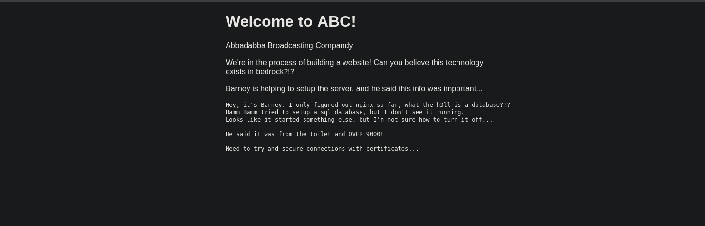

Encontramos un mensaje el cual habla de que hay un servicios que no deben de estar ejecubatdose, pero no encontraremos mas información
## Explotación

### Puerto 9009

En el puerto `9009` tenemos un servicio `pichat` que investigando encontre que podemos conectarnos por `telnet` 

```java
❯ telnet [IP-VICTIM] 9009
```
Nos conecta a un servicio el cual nos da un `key` y un `cert`

- Key

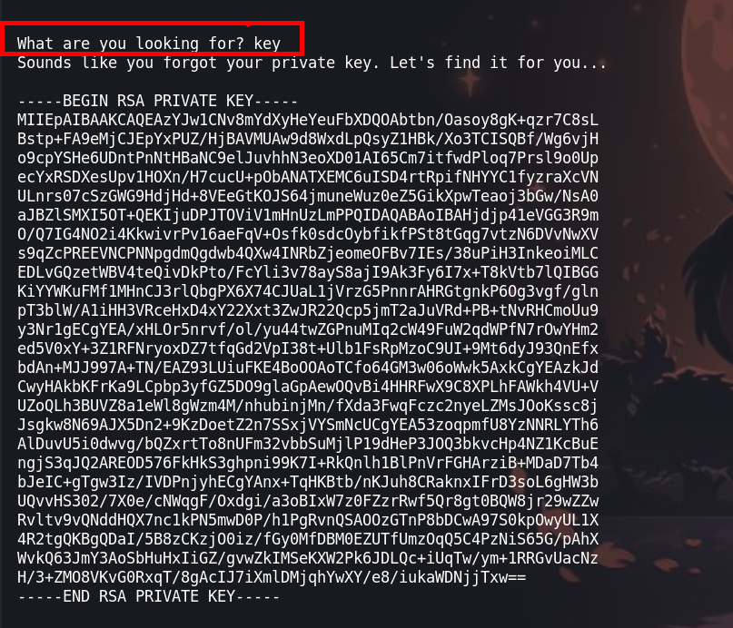

- Cert

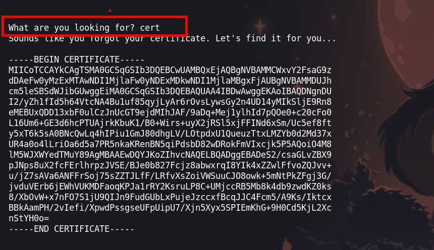

Pero no sabemos como usarlo, asi que ponemos un `help` y podemos obtener una ayuda de como ejecutarlo

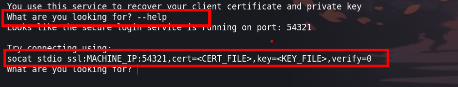

Investigando encontre que podemos conectarnos de la siguiente manera:

- **Primera forma**

```java
❯ openssl s_client -connect [IP-VICTIM]:54321 -cert cert -key key
b3dr0ck> hint
Password hint: d1ad7c0a3805955a35eb260dab4180dd (user = 'Barney Rubble')
```

- **Segunda forma**

```java
❯ socat stdio ssl:[IP-VICTIM]:54321,cert=cert,key=encrypted_privated.key,verify=0
```

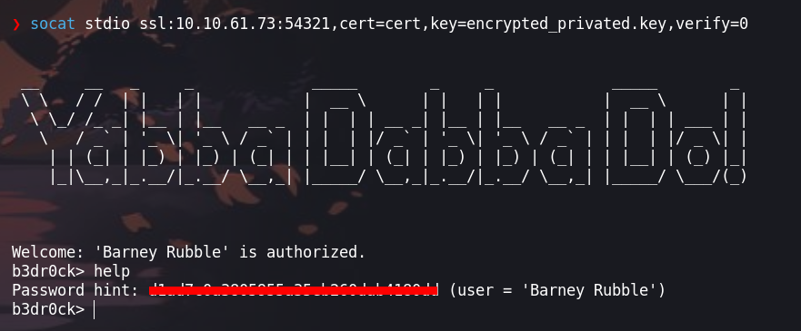

Una vez conectado obtendremos unas credenciales

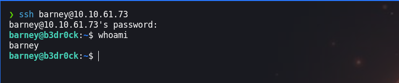

Estas credenciales permitirean conectarte por ssh como el suario `barney`

## Escalada de privilegios

### Usuario - barney
Ejecutando `sudo -l` observamos que tenemos permiso de ejecucion al binario `certutil`

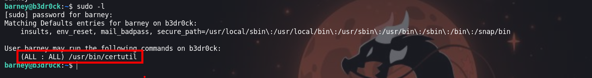

```
    (ALL : ALL) /usr/bin/certutil
```

Haciendo uso de este binario generaremos certificados para el usuario `fred` que luego la usaremos como hicimos con el usuario `barney` para obtener las credenciales de este usuario

```
barney@b3dr0ck:/var/cache$ sudo certutil fred frederick 
```
- Key

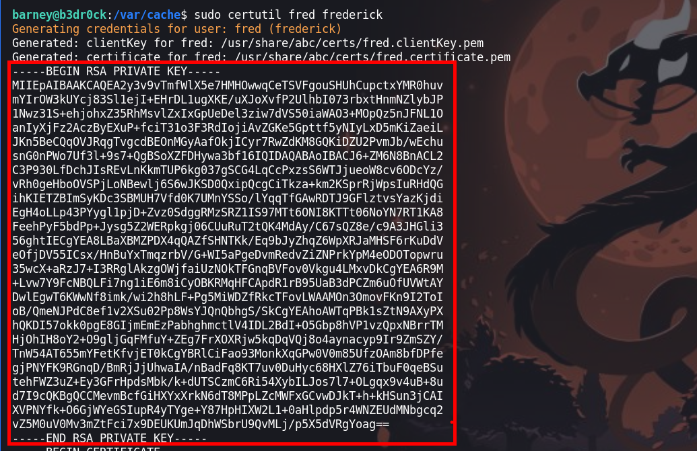

- Cert
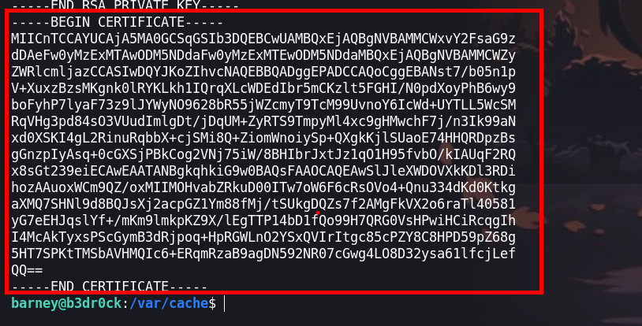

Nuevamente nos conectamos al servidor por el puerto `54321` 

```
❯ socat stdio ssl:[IP-VICTIM]:54321,cert=certFred,key=keyFred,verify=0
```

Obtendremos unas credenciales. las cuales podemos hacer uso

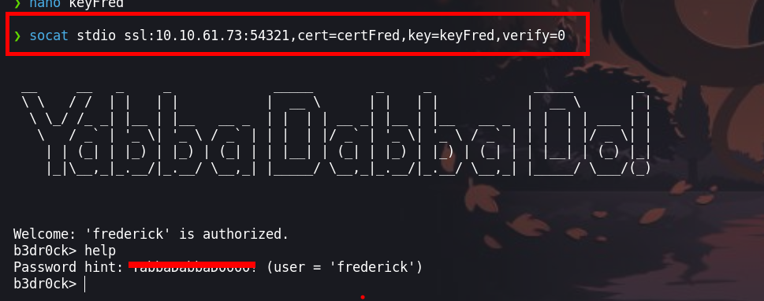

```java
Password hint: YabbaDabbaD0000! (user = 'frederick')
```

### Usuario - Fred

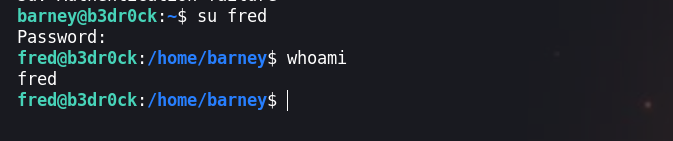

Enumerando los permisos del usuario, observamos que puede ejecutar `/usr/bin/base64 /root/pass.txt`

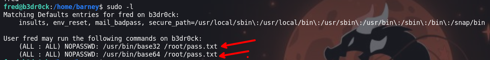

Al ejecutar obtenemos un texto en base64


Para desencriptar haremos uso de [CyberChef](https://gchq.github.io/CyberChef/)

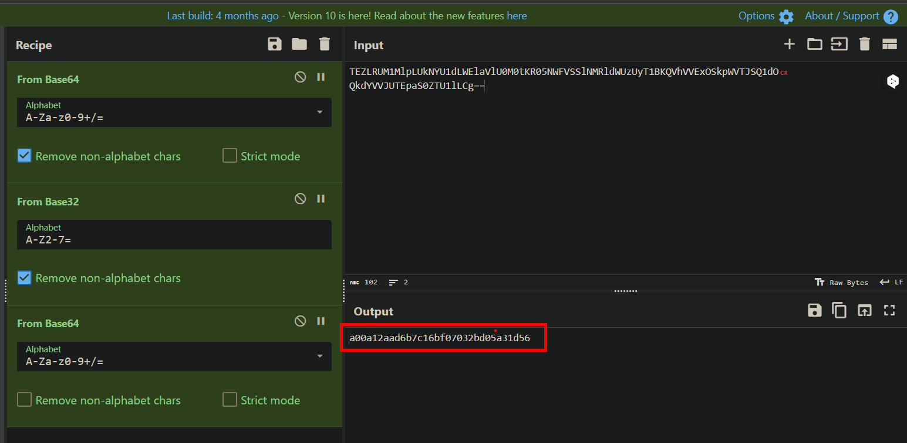

Obtenemos un hash, para crackear esto utilizaremos nuestra web de confianza que es [crackstation](https://crackstation.net/)

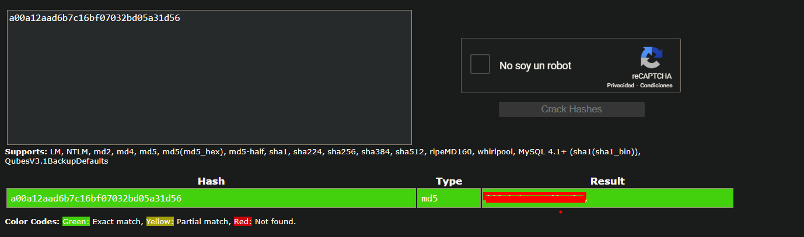

```
flintstonesvitamins
```
Haciendo uso de la credencial, iniciaremos sesión como el usuario `root` 

### Usuario - root
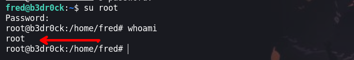

¡VAMOS!

Happy hacking :)