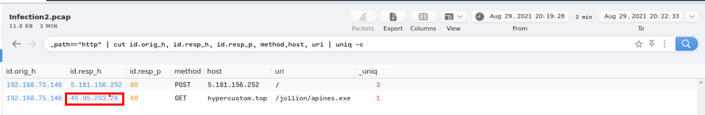
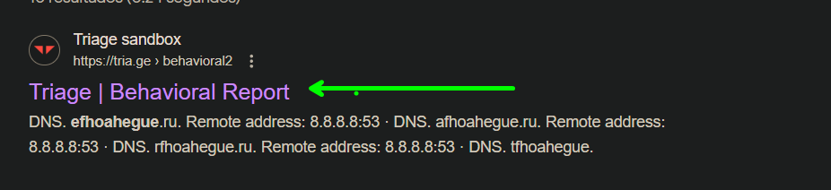

# Mastermind

En este CTF haremos uso de `brim` una herramienta muy util en para el analisis forense de red. Asi como wireshark `brim` es muy util para el analisis de paquetes de red. Aqui encontraras un poco mas de [brim](https://github.com/brimdata/zui) asi como su uso y friltros


* Link [masterminds](https://tryhackme.com/room/mastermindsxlq)
* Created by [tryhackme](https://tryhackme.com/p/tryhackme)

Para el analisis de las capturas, se usara `brim` para realizar el analisis y resolver cada una de las preguntas

## Walkthrough

***

### Task 2

**Proporcione la dirección IP de la víctima.**

Cargamos el archivo a la herramienta 

Elegimos la `query` `unque Network Connections` que es una manera rápida para visualizar las conecciones que se realizaron 

La única que conexión que se realizo y la ip victima es `192.168.75.249`

**La víctima intentó realizar conexiones HTTP a dos dominios sospechosos con el estado "404 No encontrado". Proporcione los hosts/dominios solicitados.**&#x20;

Haciendo uso del panel de queries podemos visualizar las `HTTP Requests` con peticiones con el método GET y podremos visualizar el dominio. 

* Otra manera que se pueden visualizar es ingresando con el siguiente comando

```php
_path=="http" |status_code==404
```


**La víctima realizó una conexión HTTP exitosa a uno de los dominios y recibió el Response\_body\_len de 1309 (tamaño del contenido sin comprimir de los datos transferidos desde el servidor). Proporcione el dominio y la dirección IP de destino.**

En este caso buscaremos las conexiones `HTTP` con una respuesta de 200 que indica las peticiones exitosas con un tamaño de contenido de 1309.

Tenemos el siguiente comando para filtrar las respuestas con una tamaño

```php
_path=="http" |response_body_len==1309
```


Por otro lado, con el siguiente comando podemos filtrar tanto el estado de respuesta y el tamaño del contenido.

```php
_path=="http"|status_code==200|response_body_len==1309
```


* ww25.gocphongthe.com,199.59.242.153

**¿Cuántas solicitudes DNS únicas se realizaron al dominio cab\[.]myfkn\[.]com (incluido el dominio en mayúscula)?**&#x20;

Para visualizar las cantidades de solicitudes al dominio que nos indican, se puede realizar seleccionando la querie de `Unique DNS Queries` y podremos visualizar las peticiones 

Teniendo las peticiones de DNS del dominio, tendremos un total de 7 peticiones

**Proporcione el URI del dominio bhaktivrind\[.]com al que la víctima accedió a través de HTTP.**&#x20;

Para visualizar el `uri` del dominio, lo que haremos es ir a la queries `HTTP Requests` y podremos visualizar el uri

```php
_path=="http" | cut id.orig_h, id.resp_h, id.resp_p, method,host, uri | uniq -c
```


En caso de que tengamos muchas resultados nos dificultara la visualización, para esto podemos ingresar el dominio y tendremos resultados con las peticiones solamente al dominio

```php
_path=="http" | cut host, uri | bhaktivrind.com
```


Respuesta:

```php
/cgi-bin/JBbb8/
```

**Proporcione la dirección IP del servidor malicioso y el ejecutable que la víctima descargó del servidor.**&#x20;

En los filtros ponemos los siguiente:

```php
_path=="http" | cut id.orig_h, id.resp_h, id.resp_p, method,host, uri | uniq -c
```

Debe de mostrarnos el siguiente resultado, donde tendremos nuestra respuesta


**Según la información recopilada en la segunda pregunta, proporcione el nombre del malware que utiliza** [**VirusTotal**](https://www.virustotal.com/gui/home/upload) **.**

Del resultado anterior tendremos que realizar click derecho y hacer click en "virus total lookup"


Nos redirigirá al sitio web de virus total, de esta manera se puede visualizar el nombre del malware


### Task 3

**Proporcione la dirección IP de la máquina víctima.**&#x20;

Haciendo uso de las querys elegimos "Unique Network Connections" para visualizar las conexiones que se realizaron

```php
_path=="conn" | cut id.orig_h, id.resp_p, id.resp_h | sort | uniq
```


Tenemos las conexiones que se realizaron y tenemos nuestra respuesta


**Proporcione la dirección IP a la que la víctima realizó las conexiones POST.**&#x20;

Conociendo la ip del atacante vamos a realizar filtros, agregando el método de las peticiones

```php
_path=="http"| cut id.orig_h, id.resp_h, id.resp_p, method, host. uri| uniq -c
```

Tenemos una IP origen de la cual intuimos que es el atacante


**¿Cuántas conexiones POST se realizaron a la dirección IP en la pregunta anterior?**

Teniendo en cuenta la pregunta anterior, tenemos la IP y podemos visualizar el numero de las peticiones

```php
method=="POST" |192.168.75.146 | cut id.resp_h | sort -r | uniq -c
```


**Proporcione el dominio desde donde se descargó el binario.**&#x20;

Nos ayudamos de la pregunta anterior y solo tendríamos que visualizar la otra petición que es "GET"


o podríamos ingresar el siguiente comando:

```php
_path=="http" | cut id.resp_h,host, uri, mime_type | uniq
```

* hypercustom.top

**Proporcione el nombre del binario, incluido el URI completo .**


* /jollion/apines.exe

**Proporcione la dirección IP del dominio que aloja el binario.**



**Hubo 2 alertas de Suricata "A Network Trojan was detected". ¿Cuáles fueron las direcciones IP de origen y destino?**&#x20;

Para visualizar las alertas, solo debemos de hacer click en las queries que nos proporcionan, en la cual visualizaremos las direciones IP destino y origen

```php
event_type=="alert" | alerts := union(alert.category) by src_ip, dest_ip
```


**Echando un vistazo al dominio .top en las solicitudes HTTP , proporcione el nombre del ladrón (troyano que recopila información de un sistema) involucrado en esta captura de paquetes utilizando la**  [**base de datos URLhaus**](https://urlhaus.abuse.ch/) **.**

hypercustom.top

Nos dirigimos al siguiente link [https://urlhaus.abuse.ch/browse/](https://urlhaus.abuse.ch/browse/) en el cual ingresamos el dominio


Luego de ingresar el dominio obtendremos mas información sobre este y nuestra respuesta a nuestra pregunta


* RedLine Stealer

### Task 4

**Proporcione la dirección IP de la máquina víctima.**

Para obtener la dirección IP de la victima, realizamos el siguiente filtro

```php
_path=="conn" | cut id.orig_h, id.resp_p, id.resp_h | sort | uniq
```

o podemos hacer click en las queries que nos proporcionan y obtendremos el mismo resultado


Otra forma de filtrar la ip es:

```php
_path=="conn" | put total_bytes := orig_bytes + resp_bytes | sort -r total_bytes | cut uid, id, orig_bytes, resp_bytes, total_bytes
```


**Proporcione tres dominios C2 desde los cuales se descargaron los archivos binarios (desde el más antiguo hasta el más reciente en la marca de tiempo)**

Para este caso filtraremos por las peticiones http

```php
_path=="http" | cut id.orig_h, id.resp_h, id.resp_p, method,host, uri | uniq -c
```


Una vez tengamos la informacion como se muestra en la imagen anterior agregaremos `|sort ts` al filtro y obtendremos


Ahora que filtramos para que las peticiones no se repitan agregaremos `cut ts`


Para luego observaremos algunos dominios


**Proporcione las direcciones IP para los tres dominios de la pregunta anterior.**


**¿Cuántas consultas DNS únicas se realizaron al dominio asociado desde la primera dirección IP de la respuesta anterior?**&#x20;

```php
_path=="dns" | count() by query | sort -r| efhoahegue.ru
```


**¿Cuántos archivos binarios se descargaron en total del dominio anterior?**&#x20;

```php
_path=="http" | cut id.orig_h, id.resp_h, id.resp_p, method,host, uri | uniq -c|efhoahegue.ru
```


**Proporcionó el agente de usuario listado para descargar los archivos binarios.**&#x20;

```php
_path=="http" | cut id.orig_h, id.resp_h, id.resp_p, method,host, uri, user_agent | uniq -c| efhoahegue.ru
```


**Proporcione la cantidad de conexiones DNS realizadas en total para esta captura de paquetes.**

```php
_path=="dns" | count() by query | sort -r
```


```php
_path=="dns" | count() by query | sort -r| sum(count)
```


**Con algunos conocimientos de OSINT , proporcione el nombre del gusano utilizando el primer dominio que haya logrado recopilar en la pregunta 2. (Utilice comillas para las búsquedas de Google, no utilice .ru en su búsqueda y NO interactúe con el dominio directamente).**

* Teniendo el dominio, relizaremos una busqueda en nuestro navegador de "efhoahegue"



Encontramos algo interesante al realizar una busqueda


Obtenemos nuestra respuesta.
