# Splunkps Eclipse

En esta sala aprenderemos a analizar las actividades de ransomware con la herramienta de `splunk` en donde realizaremos búsquedas y filtros para encontrar diversas cosas en un dispositivo.

El escenario que nos ponen es: que somos un analista de SOC en el cual un cliente envió un correo electrónico solicitando un analista para investigar los eventos ocurridos en la máquina de Keegan el **lunes 16 de mayo de 2022** . El cliente notó que **la máquina** está operativa, pero algunos archivos tienen una extensión extraña. Al cliente le preocupa que haya habido un intento de ransomware en el dispositivo de Keegan.

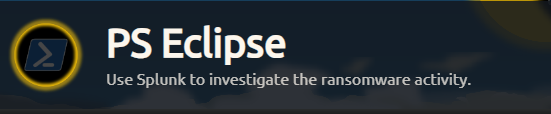

* Link [Splunk PS Eclipse](https://tryhackme.com/room/posheclipse)
* Created by  [tryhackme](https://tryhackme.com/p/tryhackme) and [Dex01](https://tryhackme.com/p/Dex01) and  [MartaStrzelec](https://tryhackme.com/p/MartaStrzelec)

### Primera Pregunta

_A suspicious binary was downloaded to the endpoint. What was the name of the binary?_

Para iniciar las pruebas ingresaremos un `*` para que nos filtre todos los eventos.

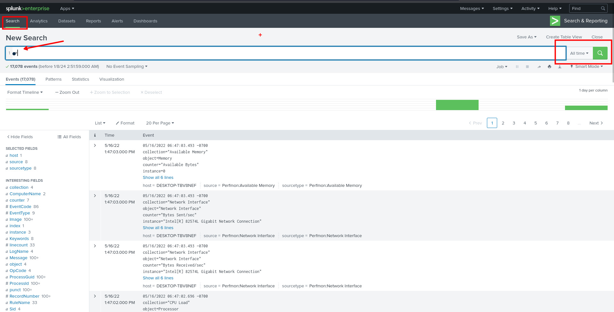

Filtrando todos los eventos, agregaremos a este el `EventCode=3` para obtener conexiones de red que se realizaron.

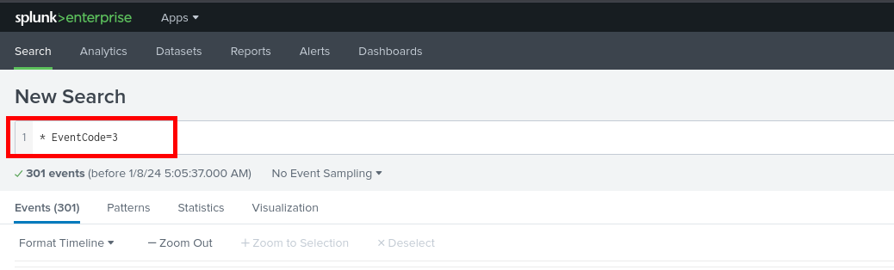

Ahora, procederemos a buscar en `Image` en donde encontraremos un `powershell.exe` que se hace uso.

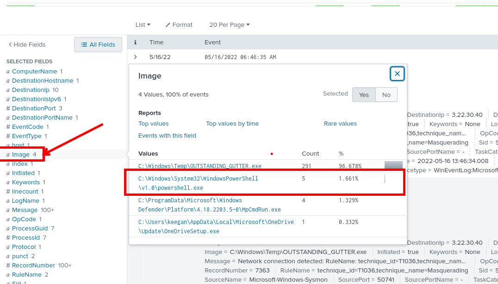

En la búsqueda ahora realizaremos la búsqueda de `commandline` y `Image ...`

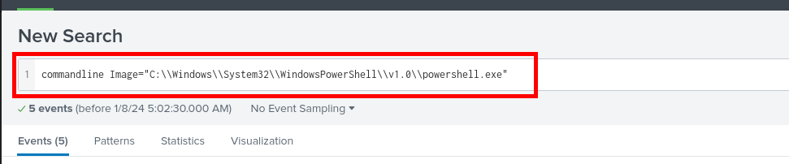

Luego de realizar el filtro nos encontraremos con una linea de comandos en la que tenemos un texto en base64.

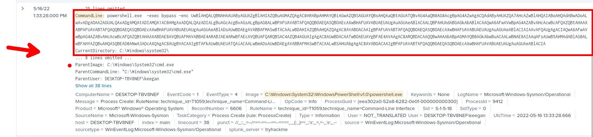

Para poder tener el texto en formato legible usaremos [CyberChef](https://gchq.github.io/CyberChef/)

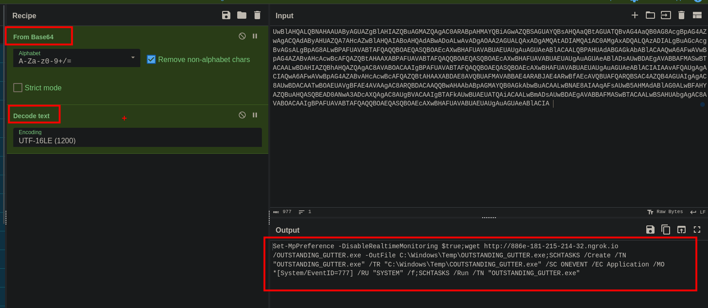

### Segunda pregunta

\_What is the address the binary was downloaded from? Add http://to your answer & defang the URL. \_

Del anterior texto podremos ver que tenemos una url que es `http://886e-181-215-214-32.ngrok.io` al cual pasaremos a _defang the URL_ haciendo uso de [CyberChef](https://gchq.github.io/CyberChef/)

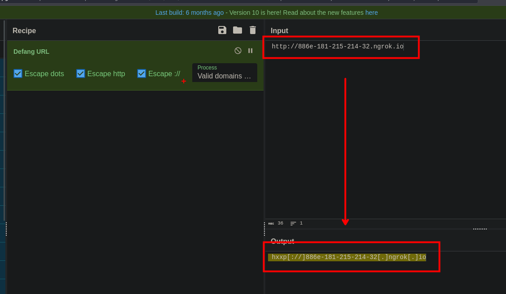

La respuesta que obtenemos es : `hxxp[://]886e-181-215-214-32[.]ngrok[.]io`

### Tercera pregunta

_What Windows executable was used to download the suspicious binary? Enter full path._

Desplegando el evento que encontramos antes encontraremos el binario con el que se ejecuto

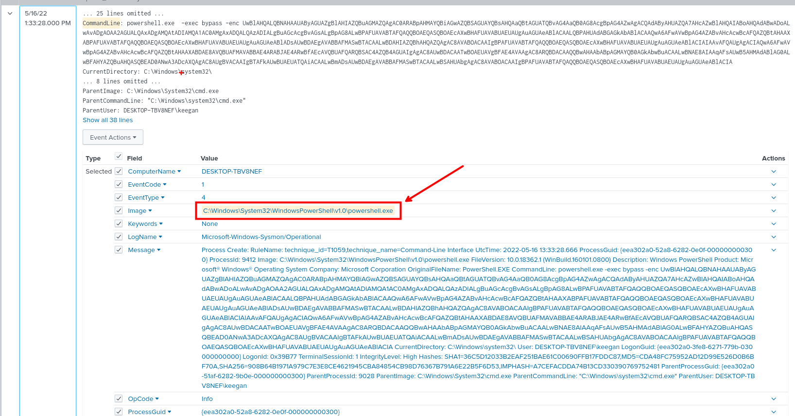

### Cuarta Pregunta

_What command was executed to configure the suspicious binary to run with elevated privileges?_

Para encontrar el comando que nos piden, tendremos que hacer uso del nombre del binario que descubrimos al tener el texto plano del base64.

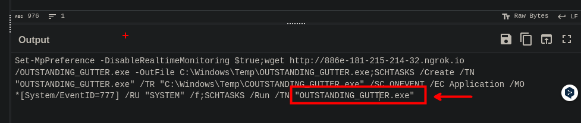

Teniendo en cuenta el binario y el el programa de `schtasks.exe` lo que ejecuta el binario malicioso.

```php
"OUTSTANDING_GUTTER.exe" "C:\\Windows\\system32\\schtasks.exe" 
|  table CommandLine
```

1. **`"OUTSTANDING_GUTTER.exe" "C:\\Windows\\system32\\schtasks.exe"`:**
   * Filtra los eventos donde el campo `CommandLine` contiene las cadenas "OUTSTANDING\_GUTTER.exe" y "C:\Windows\system32\schtasks.exe".
2. **`|`:**
   * El operador de tubería (`|`) toma el resultado de la búsqueda anterior y lo pasa a la siguiente operación.
3. **`table CommandLine`:**
   * Utiliza el comando `table` para mostrar en forma de tabla los valores del campo `CommandLine` en los resultados de la búsqueda anterior.

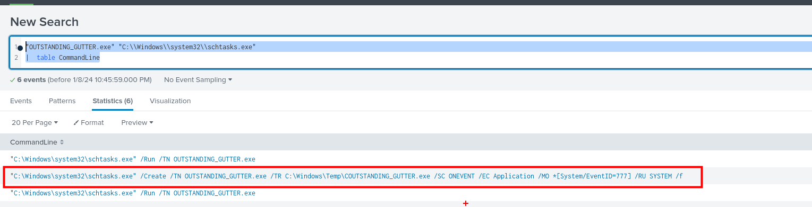

Ingresando los filtros obtenemos el anterior resultado resaltado em el recuadro. Este será nuestra respuesta.

```php
"C:\Windows\system32\schtasks.exe" /Create /TN OUTSTANDING_GUTTER.exe /TR C:\Windows\Temp\COUTSTANDING_GUTTER.exe /SC ONEVENT /EC Application /MO *[System/EventID=777] /RU SYSTEM /f
```

### Quinta pregunta

_What permissions will the suspicious binary run as? What was the command to run the binary with elevated privileges? **(Format:**_ _**User + ; + CommandLine)**_

Ya se tiene el usuario que es `SYSTEM`, este usuario lo encontramos al decodear el texto en base64.

```php
NT AUTHORITY/SYSTEM; "C:\Windows\system32\schtasks.exe" /Run /TN OUTSTANDING_GUTTER.exe
```

### Sexta pregunta

_The suspicious binary connected to a remote server. What address did it connect to? Add http:// to your answer & defang the URL_

Para este ejercicio usaremos el siguiente comando:

```php
* Image="C:\\Windows\\Temp\\OUTSTANDING_GUTTER.exe" TaskCategory="Dns query (rule: DnsQuery)" QueryName="*" 
|  table QueryName
```

1. **`Image="C:\\Windows\\Temp\\OUTSTANDING_GUTTER.exe"`:**
   * Filtra los eventos donde el campo `Image` es igual a `C:\\Windows\\Temp\\OUTSTANDING_GUTTER.exe`.
2. **`TaskCategory="Dns query (rule: DnsQuery)"`:**
   * Filtra los eventos donde el campo `TaskCategory` es igual a `"Dns query (rule: DnsQuery)"`.
3. **`QueryName="*"`:**
   * Filtra los eventos donde el campo `QueryName` es igual a cualquier valor (`*` es un comodín que coincide con cualquier cadena).
4. **`|`:**
   * El operador de tubería (`|`) toma el resultado de la búsqueda anterior y lo pasa a la siguiente operación.
5. **`table QueryName`:**
   * Utiliza el comando `table` para mostrar en forma de tabla los valores únicos del campo `QueryName` en los resultados de la búsqueda anterior.

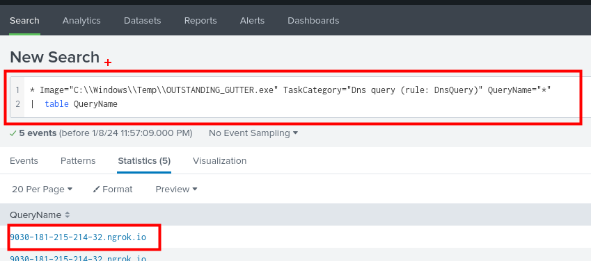

Luego de ejecutar el filtro obtendremos nuestra respuesta:

```php
hxxps[://]9030-181-215-214-32[.]ngrok[.]io
```

### Septima pregunta

_A PowerShell script was downloaded to the same location as the suspicious binary. What was the name of the file?_

```php
* .ps1 
| table TargetFilename
```

1. **`* .ps1`:**
   * Filtra eventos donde el campo `TargetFilename` contiene la extensión de archivo `.ps1`.
2. **`|`:**
   * El operador de tubería (`|`) toma el resultado de la búsqueda anterior y lo pasa a la siguiente operación.
3. **`table TargetFilename`:**
   * Utiliza el comando `table` para mostrar en forma de tabla los valores del campo `TargetFilename` en los resultados de la búsqueda anterior.

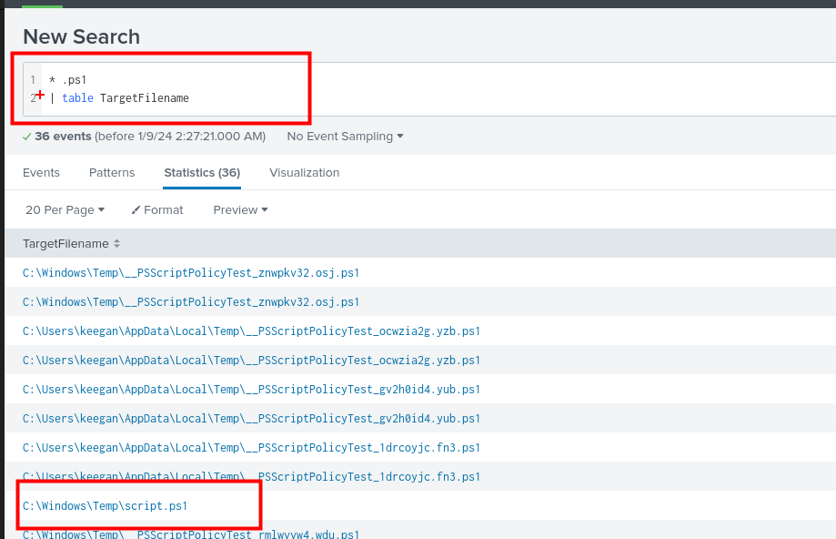

### Octava pregunta

_The malicious script was flagged as malicious. What do you think was the actual name of the malicious script?_

Haciendo su el anterior filtro encontraremos un hash en md5 el cual debemos copiar

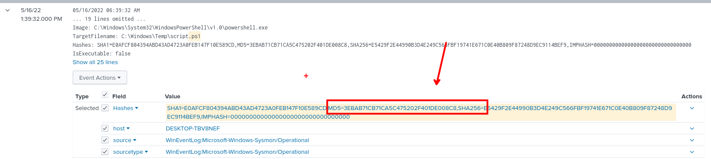

Ahora copiado el hash, ingresaremos a [virus total](https://www.virustotal.com/gui/home/search) y ingresaremos el hash

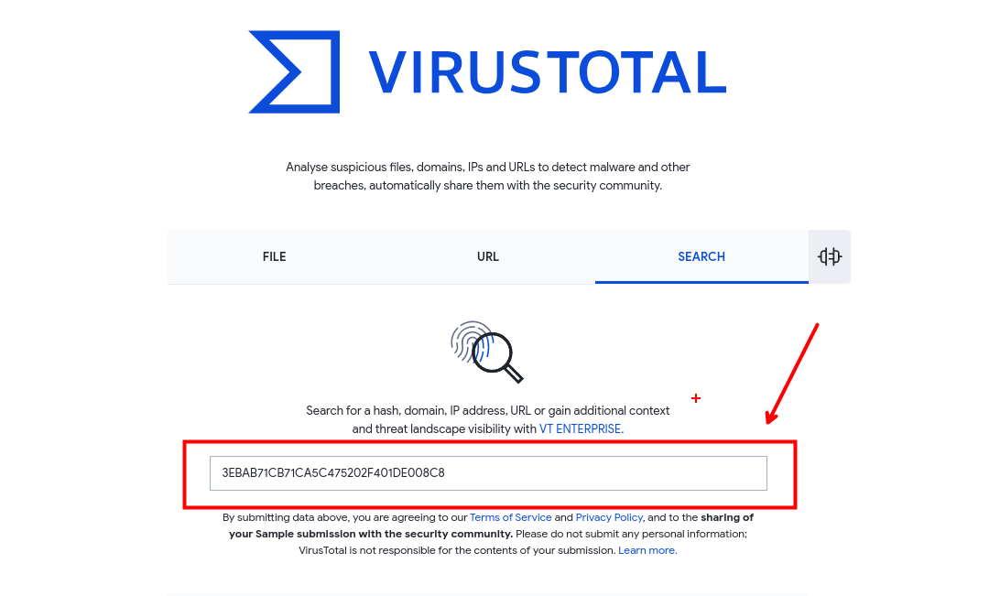

En detalles tendremos mas información acerca de este hash y del binario malicioso.

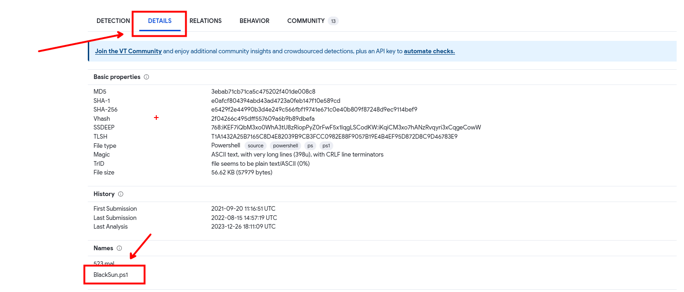

```php
BlackSun.ps1
```

Novena pregunta

_A ransomware note was saved to disk, which can serve as an IOC. What is the full path to which the ransom note was saved?_

Ahora filtraremos por `BlackSun`

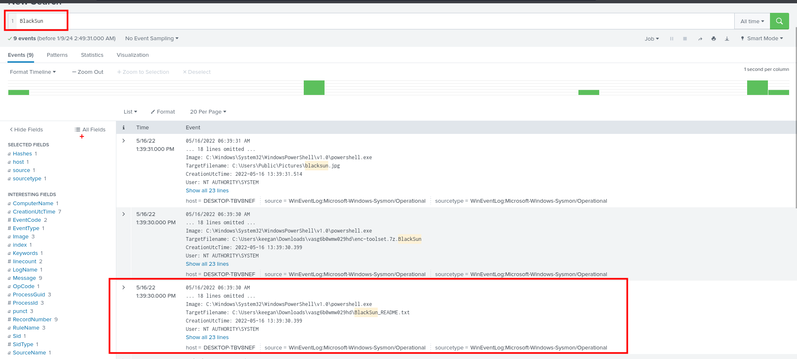

Obtenemos algunos archivos que dejo el ransonware

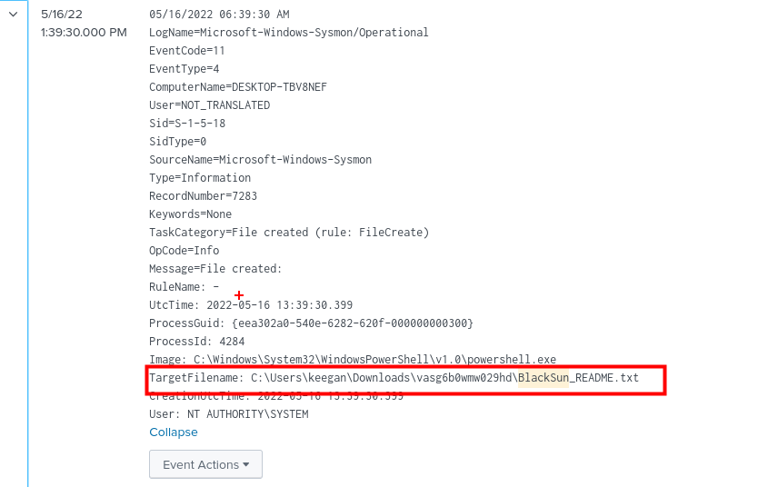

```php
C:\Users\keegan\Downloads\vasg6b0wmw029hd\BlackSun_README.txt
```

### Decima pregunta

_The script saved an image file to disk to replace the user's desktop wallpaper, which can also serve as an IOC. What is the full path of the image?_

Del anterior filtro podemos ver en el primer evento obtendremos nuestra respuesta.

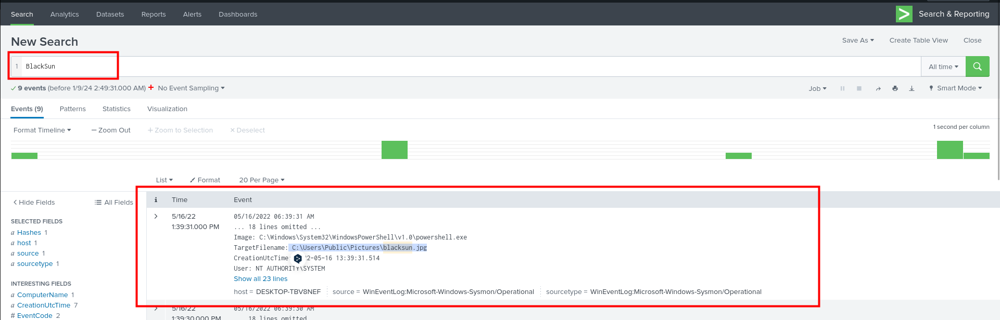

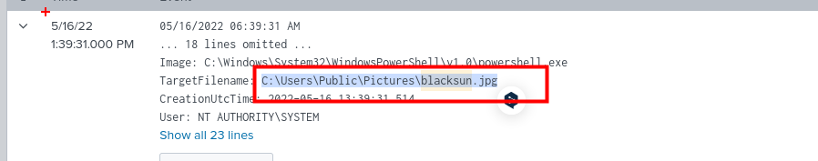

```php
C:\Users\Public\Pictures\blacksun.jpg
```

Happy Hacking :)
